#### **Ministero dell'Interno Dipartimento dei Vigili del fuoco, del Soccorso pubblico e della Difesa civile Direzione centrale per la Prevenzione e la Sicurezza tecnica**


Edizione in vigore dal **1 gennaio 2023**

revisione 00

## Testo coordinato dell'allegato I del DM 3 agosto 2015 **Codice di prevenzione incendi**

Testo coordinato con le modifiche introdotte dalle seguenti disposizioni normative:

- DM 8/6/2016: nuovo capitolo V.4 "*Uffici*".
- DM 9/8/2016: nuovo capitolo V.5 "*Attività ricettive turistico alberghiere*".
- DM 21/2/2017: nuovo capitolo V.6 "*Attività di autorimessa*"
- DM 7/8/2017: nuovo capitolo V.7 "*Attività scolastiche*".
- DM 23/11/2018: nuovo capitolo V.8 "*Attività commerciali*".
- DM 18/10/2019: aggiornamento di tutti i capitoli ad esclusione di V.4-V.8.
- DM 14/02/2020: aggiornamento dei capitoli V.4, V.5, V.6, V.7, V.8.
- DM 06/04/2020: nuovo capitolo V.9 "*Asili nido*" (in vigore dal 29/04/2020), correzione refusi nei paragrafi V.4.2, V.7.2 e tabella V.5-2.
- DM 15/05/2020: aggiornamento capitolo V.6 "*Attività di autorimessa*" (in vigore dal 19/11/2020).
- DM 10/07/2020: nuovo capitolo V.10 "*Musei, gallerie, esposizioni, mostre, biblioteche e archivi in edifici tutelati*" (in vigore dal 21/08/2020).
- DM 29/03/2021: nuovo capitolo V.11 "*Strutture sanitarie*" (in vigore dal 9/05/2021).
- DM 14/10/2021: nuovo capitolo V.12 "*Altre attività in edifici tutelati*" (in vigore dal 25/11/2021).
- DM 24/11/2021: errata corrige e integrazione per locali molto affollati (in vigore dal 1/01/2022).
- DM 30/03/2022: nuovo capitolo V.13 "*Chiusure d'ambito degli edifici civili*" (in vigore dal 7/7/2022).
- DM 19/05/2022: nuovo capitolo V.14 "*Edifici di civile abitazione*" (in vigore dal 29/6/2022).
- DM 14/10/2022: aggiornamento tabelle capitolo S.1 (in vigore dal 27/10/2022).
- DM 22/11/2022: nuovo capitolo V.15 "*Attività di intrattenimento e di spettacolo a carattere pubblico*" (in vigore dal 1/01/2023).


# **Norme tecniche di prevenzione incendi**

## **Struttura del documento**

#### [Sezione G Generalità](#page-4-0)

[Capitolo G.1 Termini, definizioni e simboli grafici](#page-6-0)

[Capitolo G.2 Progettazione per la sicurezza antincendio](#page-36-0)

[Capitolo G.3 Determinazione dei profili di rischio delle attività](#page-50-0)

#### [Sezione S Strategia antincendio](#page-58-0)

[Capitolo S.1 Reazione al fuoco](#page-60-0)

[Capitolo S.2 Resistenza al fuoco](#page-68-0)

[Capitolo S.3 Compartimentazione](#page-104-0)

[Capitolo S.4 Esodo](#page-124-0)

[Capitolo S.5 Gestione della sicurezza antincendio](#page-168-0)

[Capitolo S.6 Controllo dell'incendio](#page-182-0)

[Capitolo S.7 Rivelazione ed allarme](#page-198-0)

[Capitolo S.8 Controllo di fumi e calore](#page-208-0)

[Capitolo S.9 Operatività antincendio](#page-218-0)

[Capitolo S.10 Sicurezza degli impianti tecnologici e di servizio](#page-226-0)

#### [Sezione V Regole tecniche verticali](#page-234-0)

[Capitolo V.1 Aree a rischio specifico](#page-236-0)

[Capitolo V.2 Aree a rischio per atmosfere esplosive](#page-240-0)

[Capitolo V.3 Vani degli ascensori](#page-254-0)

[Capitolo V.4 Uffici](#page-258-0)

[Capitolo V.5 Attività ricettive turistico-alberghiere](#page-264-0)

[Capitolo V.6 Autorimesse](#page-272-0)

[Capitolo V.7 Attività scolastiche](#page-284-0)

[Capitolo V.8 Attività commerciali](#page-290-0)

[Capitolo V.9 Asili nido](#page-302-0)

[Capitolo V.10 Musei, gallerie, esposizioni, mostre, biblioteche e archivi in edifici tutelati](#page-308-0)

[Capitolo V.11 Strutture sanitarie](#page-316-0)

[Capitolo V.12 Altre attività in edifici tutelati](#page-328-0)

[Capitolo V.13 Chiusure d'ambito degli edifici civili](#page-334-0)

[Capitolo V.14 Edifici di civile abitazione](#page-344-0)

[Capitolo V.15 Attività di intrattenimento e di spettacolo a carattere pubblico](#page-352-0)

#### [Sezione M Metodi](#page-362-0)

[Capitolo M.1 Metodologia per l'ingegneria della sicurezza antincendio](#page-364-0)

[Capitolo M.2 Scenari di incendio per la progettazione prestazionale](#page-374-0)

[Capitolo M.3 Salvaguardia della vita con la progettazione prestazionale](#page-386-0)

## <span id="page-4-0"></span>**Sezione G Generalità**

[Capitolo G.1 Termini, definizioni e simboli grafici](#page-6-0)

[Capitolo G.2 Progettazione per la sicurezza antincendio](#page-36-0)

[Capitolo G.3 Determinazione dei profili di rischio delle attività](#page-50-0)

## **GENERALITÀ Capitolo G.1 Termini, definizioni e simboli grafici**

<span id="page-6-0"></span>[Premessa](#page-7-2)

[Riferimenti](#page-7-1)

[Prevenzione incendi](#page-7-0)

[Normazione volontaria](#page-9-0)

[Attività](#page-10-1)

[Soggetti](#page-10-0)

[Geometria](#page-12-0)

[Compartimentazione](#page-15-0)

[Esodo](#page-16-0)

[Gestione della sicurezza antincendio](#page-18-1)

[Opere e prodotti da costruzione](#page-18-0)

[Resistenza al fuoco](#page-19-0)

[Reazione al fuoco](#page-20-0)

[Protezione attiva](#page-21-0)

[Operatività antincendio](#page-24-0)

[Aree a rischio specifico](#page-25-2)

[Sostanze e miscele pericolose](#page-25-1)

[Atmosfere esplosive](#page-25-0)

[Alimentazioni elettriche](#page-26-1)

[Ascensori](#page-26-0)

[Ingegneria della sicurezza antincendio](#page-27-0)

[Tolleranze](#page-28-0)

[Simboli grafici](#page-29-0)

[Sigle](#page-32-0)

[Linguaggio](#page-34-0)

#### **G.1.1 Premessa**

- <span id="page-7-2"></span>1. Scopo del presente capitolo è quello di fornire definizioni generali relative ad espressioni specifiche della prevenzione incendi ai fini di una uniforme applicazione dei contenuti del presente documento.
- 2. Le soluzioni progettuali che soddisfano le prestazioni eventualmente richieste da dette definizioni sono descritte nei pertinenti capitoli del presente documento.
- 3. Nelle singole regole tecniche verticali possono essere aggiunte altre particolari definizioni al fine di precisare ulteriori elementi o dati specifici.

#### **G.1.2 Riferimenti**

<span id="page-7-1"></span>1. Per le definizioni non ricomprese nel presente capitolo si può fare riferimento alla norma UNI CEI EN ISO 13943 "*Sicurezza in caso di incendio - Vocabolario*" ed in generale alle norme UNI, EN, ISO di riferimento.

#### **G.1.3 Prevenzione incendi**

- <span id="page-7-0"></span>1. Prevenzione incendi: funzione preminente di interesse pubblico diretta a conseguire, secondo criteri uniformi sul territorio italiano, gli obiettivi di sicurezza della vita umana, di incolumità delle persone e di tutela dei beni e dell'ambiente attraverso la promozione, lo studio, la predisposizione e la sperimentazione di norme, misure, provvedimenti, accorgimenti e modi di azione intesi ad evitare l'insorgenza di un incendio e degli eventi ad esso comunque connessi o a limitarne le conseguenze.
- 2. Beni economici (o beni): mezzi materiali o immateriali in grado di soddisfare i bisogni dell'uomo e dotati di un prezzo positivo.
- 3. Regola tecnica di prevenzione incendi (o regola tecnica): disposizione regolamentare cogente in materia di prevenzione incendi.
- 4. Regola tecnica orizzontale (RTO): regola tecnica di prevenzione incendi applicabile a tutte le attività.

Nota Ai fini del presente documento è considerata regola tecnica orizzontale l'insieme dei capitoli compresi nelle sezioni *Generalità, Strategia antincendio e Metodi*.

- 5. Regola tecnica verticale (RTV): regola tecnica di prevenzione incendi applicabile ad una specifica attività o ad ambiti di essa, con specifiche indicazioni, complementari o sostitutive di quelle previste nella regola tecnica orizzontale.
- 6. Profilo di rischio: indicatore speditivo della gravità di rischio di incendio associata all'esercizio ordinario di una qualsiasi attività.
- 7. Profilo di rischio di riferimento: il più gravoso *profilo di rischio* dei compartimenti serviti ai fini della *misura antincendio* considerata.
- 8. Strategia antincendio: combinazione delle *misure antincendio* finalizzate al raggiungimento degli *obiettivi di sicurezza antincendio*.
- 9. Misura antincendio: categoria omogenea di strumenti di prevenzione, protezione e gestionali per la riduzione del rischio di incendio.

Nota Ad esempio: resistenza al fuoco, reazione al fuoco, compartimentazione, esodo, …

- 10. Protezione attiva: insieme delle misure antincendio atte a ridurre le conseguenze di un incendio, che richiedono l'azione dell'uomo o l'attivazione di un impianto.
- 11. Protezione passiva: insieme delle misure antincendio atte a ridurre le conseguenze di un incendio, non incluse nella definizione di protezione attiva e non di carattere gestionale.
- 12. Livello di prestazione (*performance requirement*): specificazione oggettiva della prestazione richiesta all'attività per realizzare la *misura antincendio*.
- 13. Soluzione conforme (*deemed to satisfy provision*): soluzione progettuale di immediata applicazione nei casi specificati, che garantisce il raggiungimento del collegato livello di prestazione.
- Nota Le soluzioni conformi sono soluzioni progettuali prescrittive che non richiedono ulteriori valutazioni tecniche (es. "La distanza di protezione è pari a 5 m").
- 14. Soluzione alternativa (*alternative solution*): soluzione progettuale alternativa alle soluzioni conformi. Il professionista antincendio è tenuto a dimostrare il raggiungimento del collegato livello di prestazione impiegando uno dei *metodi di progettazione della sicurezza antincendio* ammessi.
- Nota Le soluzioni alternative sono soluzioni progettuali prestazionali che richiedono ulteriori valutazioni tecniche (es. "La distanza di separazione deve essere calcolata imponendo irraggiamento massimo dal focolare verso l'obiettivo pari a 12,6 kW/m<sup>2</sup> ").
- 15. Soluzione in deroga: soluzione progettuale per la quale è richiesta l'attivazione del procedimento di deroga, così come previsto dalla normativa vigente. Il progettista è tenuto a dimostrare il raggiungimento degli obiettivi di sicurezza antincendio impiegando uno dei *metodi di progettazione della sicurezza antincendio* ammessi.
- 16. Metodo di progettazione della sicurezza antincendio: metodo di progettazione specificato nel capitolo [G.2](#page-36-0) del presente documento.
- 17. Prodotto per uso antincendio: materiale, componente, dispositivo, apparecchio, elemento per il quale, in relazione alla valutazione del rischio connesso al suo impiego, è prevista una caratterizzazione delle prestazioni antincendio.
- 18. Giudizio esperto: analisi fondata sui principi generali di prevenzione incendi e sul bagaglio di conoscenze del progettista esperto del settore della sicurezza antincendio.

#### G.1.4 Normazione volontaria

- <span id="page-9-0"></span>Nota Per le definizioni di *specifica tecnica*, *norma*, *prodotto della normazione europea*, *progetto di norma* e *specifica tecnica armonizzata*, ci si riferisce al Regolamento (UE) n. 1025/2012 del Parlamento europeo e del Consiglio, del 25 ottobre 2012. Per le definizioni di *valutazione europea*, *documento per la valutazione tecnica europea* e *specifica tecnica armonizzata* ci si riferisce al Regolamento (UE) n. 305/2011 del Parlamento europeo e del Consiglio, del 9 marzo 2011. Per le definizioni di *Technical Specification* (TS) e *Technical Report* (TR) ci si riferisce ai documenti CFN
- Nota Come specificato al paragrafo G.1.25, l'applicazione della normazione volontaria citata nel presente documento non è *obbligatoria*.
 - 1. Norma (o norma tecnica): specifica tecnica adottata da un organismo di normazione riconosciuto, per applicazione ripetuta o continua, alla quale non è obbligatorio conformarsi, e che appartenga a una delle seguenti categorie:
 - a. norma internazionale: norma adottata da un organismo di normazione internazionale;
- Nota Sono organismi internazionali di normazione: ISO (Organizzazione internazionale per la normazione), IEC (Commissione elettrotecnica internazionale) ed ITU (Unione internazionale delle telecomunicazioni).
 - b. norma europea: norma adottata da un'organizzazione europea di normazione:
- Nota Sono organizzazioni europee di normazione: CEN (Comitato europeo di normazione), Cenelec (Comitato europeo di normazione elettrotecnica), ETSI (Istituto europeo per le norme di telecomunicazione).
 - c. norma armonizzata: norma europea adottata sulla base di una richiesta della Commissione ai fini dell'applicazione della legislazione dell'Unione sull'armonizzazione:
- Nota Le *norme armonizzate* e, più in generale, le *specifiche tecniche armonizzate* sono solitamente riferite alla determinazione delle prestazioni di prodotti ai fini della relativa commercializzazione nello Spazio Economico Europeo (SEE).
 - d. norma nazionale: norma adottata da un organismo di normazione nazionale.
- Nota Le organizzazioni di normazione possono essere equivalentemente qualificate come *enti* o *organismi di standardizzazione* o *di normalizzazione*. Ad esempio, sono enti di normazione nazionale: DIN e DKE (Germania), AFNOR (Francia), UNI e CEI (Italia), NEN e NEC (Paesi Bassi), BSI (Regno Unito), ...
 - 2. Prodotto della normazione europea: qualsiasi altra specifica tecnica, diversa dalle norme europee, adottata da un'organizzazione europea di normazione per applicazione ripetuta o continua, alla quale non è obbligatorio conformarsi.
 - Si riportano i seguenti esempi di prodotti della normazione europea:
 - a. *Technical Specification* (TS): documento tecnico di carattere normativo il cui sviluppo può essere previsto quando varie alternative, non sufficienti a raggiungere un accordo o una norma europea o per la necessità di differenti specifiche sperimentali o a causa dell'evoluzione tecnologica, devono necessariamente coesistere in vista di una futura armonizzazione;
 - b. *Technical Report* (TR): documento tecnico di carattere informativo che fornisce informazioni sul contenuto tecnico del lavoro di normazione in atto. Generalmente viene predisposto quando si ritiene urgente o necessario fornire agli enti nazionali di normazione informazioni tecniche di dettaglio.
- Nota Le TS devono essere adottate dagli organismi nazionali di normazione, mentre le TR possono non essere adottate a livello nazionale.

- 3. Progetto di norma: documento contenente il testo delle specifiche tecniche relative a una determinata materia, predisposto ai fini dell'adozione secondo la procedura di normazione pertinente, quale risulta dai lavori preparatori e qual è distribuito ai fini di inchiesta pubblica o commento.
- 4. Specifica tecnica armonizzata: norme armonizzate e documenti per la valutazione europea (EAD).
- 5. Norma riconosciuta a livello internazionale: norma adottata da un organismo riconosciuto a livello internazionale.

Nota Sono organismi riconosciuti a livello internazionale tutti gli organismi di normazione extra europei citati nel presente documento e quelli comunque tradizionalmente riconosciuti nel settore antincendio. Ad esempio: NFPA, ANSI/UL, ASTM, API, FM Global, FPA, NIST, SFPE, TNO, VDS, Energy Institute, IGEM, VTT, BRANZ, ...

#### G.1.5 Attività

- <span id="page-10-1"></span>1. Attività: complesso delle azioni organizzate svolte in un luogo delimitato, che può presentare pericolo d'incendio o esplosione.
- 2. Attività soggetta: *attività* soggetta ai controlli di prevenzione incendi di competenza del Corpo nazionale dei Vigili del fuoco.
- <span id="page-10-2"></span>Nota Le attività soggette sono riportate nell'allegato I al decreto del presidente della Repubblica 1 agosto $2011~\rm{n}^{\circ}151$ .
 - 3. Attività con valutazione del progetto: *attività soggetta* il cui progetto antincendio *è valutato*, anche in deroga, dal Corpo nazionale dei Vigili del fuoco.
- Nota Sono incluse nella definizione sia le attività soggette di categoria B o C dell'allegato III del DM 7 agosto 2012, per le quali è prevista la valutazione del progetto antincendio, che le attività soggette di categoria A, del medesimo allegato, nel caso in cui il progetto antincendio sia sottoposto alla valutazione in deroga secondo le procedure previste dalla vigente normativa.
 - 4. Attività senza valutazione del progetto: *attività soggetta* il cui progetto antincendio *non è valutato*, neanche in deroga, dal Corpo nazionale dei Vigili del fuoco.
- Nota Sono incluse nella definizione le attività soggette di categoria A dell'allegato III del DM 7 agosto 2012, non ricomprese nella definizione di cui al comma 3.
 - 5. Attività esistente: attività in esercizio alla data di entrata in vigore della regola tecnica di riferimento.
 - 6. Attività all'aperto: attività o porzione d'attività, comprensiva delle sue vie d'esodo, svolta in area delimitata e prevalentemente in *spazio a cielo libero*, che consente a fumo e calore dell'incendio di disperdersi direttamente in atmosfera.

Nota Ad esempio, non sono considerate *attività all'aperto* quelle svolte su terrazze, aventi vie d'esodo all'interno di opere da costruzione.

#### G.1.6 Soggetti

- <span id="page-10-0"></span>1. Responsabile dell'attività: soggetto tenuto agli obblighi di prevenzione incendi per l'attività.
- 2. Progettista: tecnico abilitato o professionista antincendio, incaricato dal responsabile dell'attività della progettazione, ai fini antincendio, dell'attività stessa o di specifici ambiti di essa, nel rispetto delle competenze attribuite dalle disposizioni regolamentari.
- 3. Tecnico abilitato: professionista iscritto in albo professionale, che opera nell'ambito delle proprie competenze.

- 4. Professionista antincendio: tecnico abilitato iscritto negli appositi elenchi del Ministero dell'interno di cui all'articolo 16 del decreto legislativo 8 marzo 2006, n. 139.
- 5. Occupante: persona presente a qualsiasi titolo all'interno dell'attività, considerata anche alla luce della sua modalità di interazione con l'ambiente in condizioni di disabilità fisiche, mentali o sensoriali.
- 6. Soccorritore: componente di squadra di lotta all'incendio, opportunamente protetto ed addestrato a tale fine.

#### G.1.7 Geometria

- <span id="page-12-0"></span>1. Piano: superficie calpestabile.
- 2. Piano di riferimento del compartimento: *piano* del luogo esterno verso cui avviene prevalentemente l'*esodo degli occupanti* del compartimento e da cui *accedono i soccorritori*. Se non è presente piano con tali caratteristiche, si considera il piano di *accesso dei soccorritori* con le migliori caratteristiche di operatività antincendio (capitolo S.9). Per ogni compartimento è determinato un unico piano di riferimento, che generalmente corrisponde con la strada pubblica o privata di accesso. La determinazione del piano di riferimento del compartimento è riportata nel progetto.

Nota Si riportano esempi nell'illustrazione G.1-3.

- 3. Quota di piano: dislivello tra il *piano* ed il relativo *piano di riferimento del compartimento* cui appartiene.
- Nota La quota di piano può essere positiva, negativa o nulla. Si riportano esempi nell'illustrazione G.1-3.
 - 4. Altezza antincendio: massima *quota dei piani* dell'attività. Sono esclusi i piani con presenza occasionale e di breve durata di personale addetto (es. vani tecnici).

Nota Si riportano esempi nell'illustrazione G.1-3.

- 5. Quota del compartimento: dislivello tra il piano del compartimento ed il relativo piano di riferimento. In caso di compartimento multipiano si assume il dislivello che determina le soluzioni *più gravose* (es. per il piano *più elevato* di compartimento fuori terra, per il piano *più profondo* di compartimento interrato).
- Nota La quota del compartimento può essere positiva, negativa o nulla. Si riportano esempi nell'illustrazione G.1-3.
 - 6. Compartimento o piano fuori terra: compartimento o piano avente quota non negativa.
 - 7. Compartimento o piano interrato: compartimento o piano avente quota negativa.
 - 8. Ambito: porzione delimitata dell'attività avente la caratteristica o la qualità descritta nella specifica misura.
- Nota L'ambito può riferirsi all'intera attività o a parte di essa. Ad esempio: piano, compartimento, opera da costruzione, area a rischio specifico, area all'aperto, area sotto tettoia, ...
 - 9. Superficie lorda di un ambito: superficie in pianta compresa entro il perimetro interno che delimita l'ambito.
- Nota Se l'ambito è multipiano o vi sono soppalchi si intende la somma delle superfici lorde di tutti i piani.
- 10. Superficie utile di un ambito: porzione di superficie di un ambito efficace ai fini della funzionalità richiesta.
- Nota Ad esempio, per *superficie utile delle aperture di ventilazione* si intende la superficie del varco misurata al netto di eventuali ostruzioni (es. telaio, grata, alette, ...).
- 11. Altezza media di un locale $(h_m)$ : media pesata delle altezze $h_i$ di un locale con la proiezione in pianta della porzione di superficie $A_i$ della superficie di altezza $h_i$ :

$$h_{m} = \frac{\sum_{i} h_{i} \cdot A_{i}}{\sum_{i} A_{i}}$$
 G.1-1

Nota Si riportano esempi nell'illustrazione G.1-1.

- 12. Distanza di sicurezza esterna: distanza minima misurata in pianta tra il perimetro di ciascun elemento pericoloso di un'attività ed i seguenti elementi esterni al confine dell'attività e da preservare:
 - a. i confini di aree edificabili,
 - b. il perimetro del più vicino fabbricato,
 - c. il perimetro di altre opere pubbliche o private.
- 13. Distanza di sicurezza interna: distanza minima misurata in pianta tra i perimetri dei vari elementi pericolosi di un'attività.
- 14. Distanza di protezione: distanza minima misurata in pianta tra il perimetro di ciascun elemento pericoloso di un'attività ed il confine dell'area su cui sorge l'attività stessa.
- 15. Distanza di separazione: distanza di sicurezza interna, esterna o di protezione, a seconda dei casi.
- 16. Area di influenza di un elemento: area i cui confini sono ottenuti dalla traslazione (*offset*) su un piano di riferimento dei confini dell'elemento ad una distanza detta *raggio di influenza* roffset.

Nota Si riportano esempi nell'illustrazione [G.1-2.](#page-13-1)

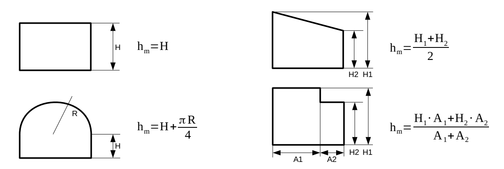

<span id="page-13-0"></span>*Illustrazione G.1-1: Esempi di determinazione dell'altezza media, in sezione*

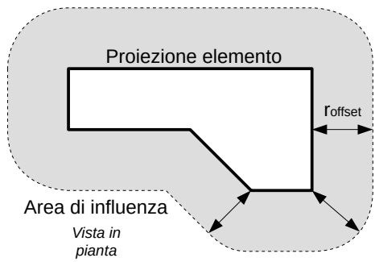

<span id="page-13-1"></span>*Illustrazione G.1-2: Costruzione dell'area di influenza di un elemento, in pianta*

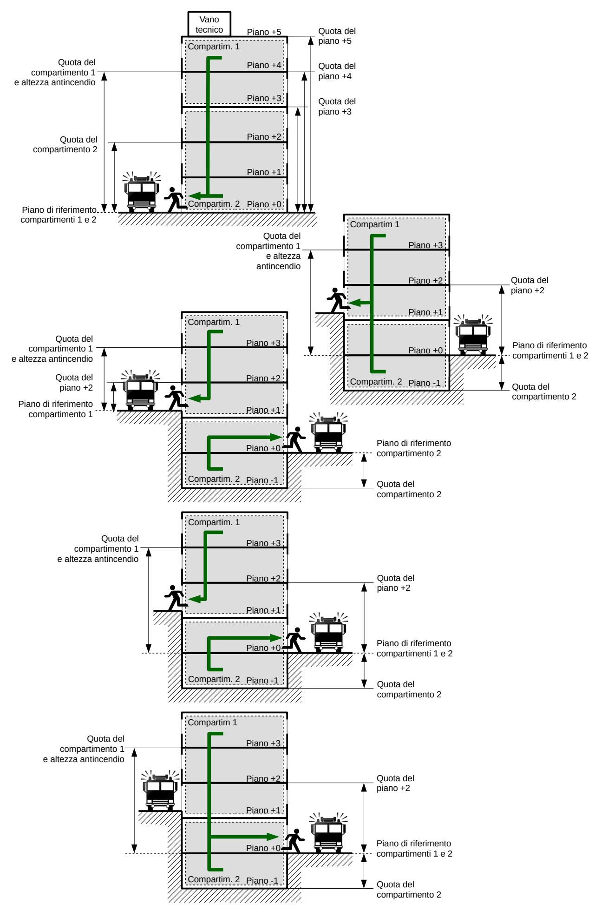

<span id="page-14-0"></span>*Illustrazione G.1-3: Esempi di altezza antincendio, quote di piano e di compartimento, in sezione*

#### G.1.8 Compartimentazione

- <span id="page-15-0"></span>1. Spazio a cielo libero: luogo esterno alle opere da costruzione non delimitato superiormente.
- 2. Spazio scoperto: spazio avente caratteristiche tali da contrastare *temporanea-mente* la propagazione dell'incendio tra le eventuali opere da costruzione o strutture che lo delimitano.
- 3. Compartimento antincendio (o compartimento): parte dell'opera da costruzione organizzata per rispondere alle esigenze della sicurezza in caso di incendio e delimitata da prodotti o elementi costruttivi idonei a garantire, sotto l'azione del fuoco e per un dato intervallo di tempo, la resistenza al fuoco. Qualora non sia prevista alcuna compartimentazione, si intende che il compartimento coincida con l'intera opera da costruzione.
- 4. Filtro: compartimento antincendio nel quale la probabilità di avvio e sviluppo dell'incendio sia resa trascurabile.

Nota Ad esempio, grazie all'assenza di inneschi efficaci ed al ridotto carico di incendio specifico q<sub>f</sub>.

- 5. Di tipo protetto (o protetto): qualificazione di un volume dell'attività costituente compartimento antincendio.
- Nota Si riportano alcune esempi di applicazione della definizione: scala protetta, locale protetto, vano protetto, percorso protetto, ...
- Nota Se non riferito ad un volume dell'attività, il termine assume altri significati, ad esempio soccorritore protetto, materiale protetto, elemento portante protetto, apertura protetta da ostruzione, posizione protetta, ...
 - 6. Di tipo a prova di fumo (o a prova di fumo): locuzione che indica la capacità di un compartimento di limitare l'ingresso di fumo generato da incendio che si sviluppi in compartimenti comunicanti.
- Nota Si riportano alcuni esempi di applicazione della definizione: scala a prova di fumo, vano a prova di fumo, percorso a prova di fumo, ...
 - 7. Di tipo esterno (o esterno): qualificazione di una porzione dell'attività esterna all'opera da costruzione, con caratteristiche tali da contrastare temporaneamente la propagazione dell'incendio proveniente dall'opera da costruzione.

Nota Si riportano alcuni esempi di applicazione della definizione: scala esterna, percorso esterno, ...

8. Intercapedine antincendio: vano di distacco, adeguatamente dimensionato per l'aerazione, la ventilazione o lo smaltimento dei prodotti della combustione, superiormente delimitato da spazio scoperto e longitudinalmente delimitato da muri perimetrali (con o senza aperture) appartenenti all'opera da costruzione servita e da terrapieno o da muri di altra opera da costruzione, aventi pari resistenza al fuoco.

#### G.1.9 Esodo

<span id="page-16-0"></span>1. Sistema d'esodo: insieme delle misure di salvaguardia della vita che consentono agli *occupanti* di raggiungere un *luogo sicuro* o permanere al sicuro, autonomamente o con assistenza, prima che l'incendio determini condizioni *incapacitanti* negli ambiti dell'attività ove si trovano.

Nota Gli occupanti raggiungono l'*incapacitazione* quando diventano inabili a mettersi al sicuro a causa degli effetti dell'incendio (capitolo M.3).

Nota Il sistema d'esodo è costituito da luoghi sicuri, vie d'esodo, uscite, porte, illuminazione di sicurezza, segnaletica, ...

- 2. Luogo sicuro: luogo in cui è *permanentemente* trascurabile il rischio d'incendio per gli occupanti che vi stazionano o vi transitano; tale rischio è riferito ad un incendio nell'attività.
- 3. Luogo sicuro temporaneo: luogo in cui è *temporaneamente* trascurabile il rischio d'incendio per gli occupanti che vi stazionano o vi transitano durante l'esodo; tale rischio è riferito ad un incendio in ambiti dell'attività specificati, diversi dal luogo considerato.
- 4. Spazio calmo: *luogo sicuro temporaneo* ove gli occupanti possono attendere e ricevere *assistenza* per completare l'esodo verso luogo sicuro.
- 5. Affollamento: numero massimo ipotizzabile di occupanti.
- 6. Densità di affollamento: numero massimo di occupanti assunto per unità di superficie lorda dell'*ambito* di riferimento (persone/m²).
- 7. Via d'esodo (o via d'emergenza): percorso senza ostacoli al deflusso, appartenente al sistema d'esodo, che consente agli occupanti di raggiungere un luogo sicuro dal luogo in cui si trovano.
- 8. Via d'esodo orizzontale: porzione di via d'esodo a quota costante o con pendenza $\leq$ 5%.

Nota Ad esempio: corridoi, porte, uscite, ...

9. Via d'esodo verticale: porzione di via d'esodo che consente agli occupanti variazioni di quota con pendenza > 5%.

Nota Ad esempio: scale, rampe, ...

- 10. Scala d'esodo: scala appartenente al sistema d'esodo.
- 11. Rampa d'esodo: rampa, anche carrabile, appartenente al sistema d'esodo.
- 12. Percorso d'esodo: parte di via d'esodo che conduce dall'uscita dei locali dedicati all'attività fino all'uscita finale.

Nota Il percorso d'esodo non comprende i locali dedicati all'attività ed è costituito da corridoi, scale, rampe, atri, passerelle, camminamenti, ...

- 13. Uscita di piano: varco del sistema di esodo che immette in via d'esodo verticale da una via d'esodo orizzontale.
- 14. Uscita finale (o uscita d'emergenza): varco del sistema di esodo al piano di riferimento, che immette all'esterno su luogo sicuro temporaneo o luogo sicuro.
- 15. Corridoio cieco (o percorso unidirezionale): porzione di via d'esodo da cui è possibile l'esodo in un'unica direzione.
- 16. Lunghezza di corridoio cieco: distanza che ciascun occupante deve percorrere lungo una via d'esodo dal punto in cui si trova fino a raggiungere:

- a. un punto in cui diventa possibile l'esodo in più di una direzione.
- b. oppure un luogo sicuro.
- La lunghezza di corridoio cieco è valutata con il metodo del filo teso senza tenere conto degli arredi mobili.
- Nota L'incendio lungo il *corridoio cieco* può impedire l'esodo degli occupanti. Poiché non è possibile stabilire a priori il compartimento di primo innesco, il *corridoio cieco* è indipendente dai compartimenti eventualmente attraversati.
- 17. Lunghezza d'esodo: distanza che ciascun occupante deve percorrere lungo una via d'esodo dal punto in cui si trova fino a raggiungere un *luogo sicuro tempo-raneo* oppure un *luogo sicuro*.
 - La lunghezza d'esodo è valutata con il metodo del filo teso senza tenere conto degli arredi mobili.
- Nota Ad esempio, la *lunghezza d'esodo* è usata per limitare il tempo che gli occupanti impiegano per abbandonare qualsiasi compartimento di primo innesco dell'attività.
- 18. Larghezza unitaria delle vie d'esodo (o larghezza unitaria): indice quantitativo della potenzialità di una via d'esodo in relazione al profilo di rischio $R_{\text{vita}}$ dell'attività. È convenzionalmente espressa dalla larghezza in millimetri necessaria all'esodo di un singolo occupante (mm/persona).
- 19. Esodo simultaneo: modalità di esodo che prevede lo spostamento contemporaneo degli occupanti fino a *luogo sicuro*.
- Nota L'attivazione della procedura di esodo segue immediatamente la rivelazione dell'incendio oppure è differita dopo verifica da parte degli occupanti dell'effettivo innesco dell'incendio.
- 20. Esodo per fasi: modalità di esodo di una struttura organizzata con più compartimenti, in cui l'evacuazione degli occupanti fino a *luogo sicuro* avviene in successione dopo l'evacuazione del compartimento di primo innesco. Si attua con l'ausilio di *misure antincendio* di protezione attiva, passiva e gestionali.
- 21. Esodo orizzontale progressivo: modalità di esodo che prevede lo spostamento degli occupanti dal compartimento di primo innesco in un compartimento adiacente capace di contenerli e proteggerli fino a quando l'incendio non sia estinto o fino a che non si proceda ad una successiva evacuazione fino a *luogo sicuro*.
- 22. Protezione sul posto: modalità di esodo che prevede la protezione degli occupanti nell'ambito in cui si trovano.
- 23. Gestione della folla (*crowd management*): disciplina che tratta la pianificazione sistematica e la supervisione dell'assembramento e del movimento ordinato della folla.
- 24. Sovraffollamento localizzato (*crowd crush*): pressione incontrollata della folla che determina lo schiacciamento degli occupanti ed il pericolo di asfissia.

#### **G.1.10 Gestione della sicurezza antincendio**

- <span id="page-18-1"></span>1. Gestione della sicurezza antincendio (GSA): misura finalizzata alla gestione di un'attività in condizioni di sicurezza, sia in fase di esercizio che in fase di emergenza, attraverso l'adozione di una organizzazione che prevede ruoli, compiti, responsabilità e procedure.
- 2. Segnaletica di sicurezza (o segnaletica): segnaletica che, riferita ad un oggetto, ad un'attività o ad una situazione determinata, fornisce un'indicazione o una prescrizione concernente la sicurezza, e che utilizza, a seconda dei casi, un cartello, un colore, un segnale luminoso o acustico, una comunicazione verbale o un segnale gestuale.

## **G.1.11 Opere e prodotti da costruzione**

- <span id="page-18-0"></span>1. Opere da costruzione: edifici, opere di ingegneria civile ed industriale.
- 2. Prodotto da costruzione: qualsiasi prodotto o kit fabbricato e immesso sul mercato per essere incorporato permanentemente in opere da costruzione o in parti di esse e la cui prestazione incide sulla prestazione delle opere da costruzione rispetto ai requisiti di base delle opere stesse.
- 3. Uso previsto: l'uso previsto del prodotto da costruzione come definito nella specifica tecnica armonizzata applicabile.
- 4. Elemento costruttivo: parte o elemento di opere da costruzione, composto da uno o più prodotti da costruzione.
- 5. Kit: un prodotto da costruzione immesso sul mercato da un singolo fabbricante come insieme di almeno due componenti distinti che devono essere assemblati per essere installati nelle opere da costruzione.
- 6. Caratteristiche essenziali: le caratteristiche del prodotto da costruzione che si riferiscono ai requisiti di base delle opere da costruzione come definiti nel CPR.
- 7. Prestazione di un prodotto da costruzione: la prestazione in relazione alle caratteristiche essenziali pertinenti, espressa in termini di livello, classe o mediante descrizione.
- 8. Campo di applicazione diretta del risultato di prova: ambito, previsto dallo specifico metodo di prova e riportato nel rapporto di classificazione, delle limitazioni d'uso e delle possibili modifiche apportabili al campione che ha superato la prova, tali da non richiedere ulteriori valutazioni, calcoli o approvazioni per l'attribuzione del risultato conseguito.
- 9. Campo di applicazione estesa del risultato di prova: ambito, non compreso tra quelli previsti nel campo di applicazione diretta del risultato di prova, definito da specifiche norme di estensione.
- 10. Laboratorio di prova: il laboratorio, notificato alla Commissione UE, che effettua prove su prodotti aventi specifici requisiti, ai fini dell'apposizione della marcatura CE, in riferimento al CPR; i laboratori della DCPST e i laboratori italiani autorizzati ai sensi del decreto del Ministro dell'interno 26 marzo 1985; i laboratori di uno degli altri Stati della Unione europea o di uno degli Stati contraenti l'accordo SEE e la Turchia, cui viene riconosciuta l'indipendenza e la competenza previsti dalla norma EN ISO CEI 17025 o da equivalenti garanzie riconosciute in uno degli Stati stessi.

- 11. Elemento chiave: elemento dalla cui stabilità dipende la stabilità del rimanente aggregato strutturale. Il collasso di un elemento chiave determina un danneggiamento strutturale ritenuto sproporzionato.
- 12. Robustezza: attitudine di una struttura a resistere ad azioni eccezionali (es. esplosioni, …) senza che si determinino danneggiamenti sproporzionati rispetto alla causa.

#### **G.1.12 Resistenza al fuoco**

- <span id="page-19-0"></span>1. Resistenza al fuoco: una delle *misure antincendio* di protezione da perseguire per garantire un adeguato livello di sicurezza di un'opera da costruzione in condizioni di incendio. Essa riguarda la capacità portante in caso di incendio, per una struttura, per una parte della struttura o per un elemento strutturale nonché la capacità di compartimentazione in caso di incendio per gli elementi di separazione strutturali (es. muri, solai, …) e non strutturali (es. porte, divisori, …).
- 2. Capacità portante in caso di incendio: attitudine della struttura, di una parte della struttura o di un elemento strutturale, a conservare una sufficiente resistenza meccanica sotto l'azione del fuoco, tenendo conto delle altre azioni agenti.
- 3. Capacità di compartimentazione in caso d'incendio: attitudine di un elemento costruttivo a conservare, sotto l'azione del fuoco, un sufficiente isolamento termico ed una sufficiente tenuta ai fumi e ai gas caldi della combustione, nonché tutte le altre prestazioni se richieste.
- 4. Carico di incendio: potenziale termico netto della totalità dei materiali combustibili contenuti in uno spazio, corretto in base ai parametri indicativi della partecipazione alla combustione dei singoli materiali. Limitatamente agli elementi strutturali di legno, è possibile considerarne il contributo tenendo conto del fatto che gli stessi devono altresì garantire la conseguente resistenza al fuoco. Tale contributo deve essere determinato tramite consolidati criteri di interpretazione del fenomeno. Il carico di incendio è espresso in MJ; convenzionalmente 1 MJ è assunto pari all'energia sviluppata da 0,057 kg di legna equivalente.
- 5. Carico d'incendio specifico: carico di incendio riferito all'unità di superficie lorda di piano, espresso in MJ/m<sup>2</sup> .
- 6. Carico d'incendio specifico di progetto: carico d'incendio specifico corretto in base ai parametri indicatori del rischio di incendio del compartimento antincendio e dei fattori relativi alle *misure antincendio* presenti. Esso costituisce la grandezza di riferimento per le valutazioni della resistenza al fuoco delle opere da costruzione.
- 7. Classe di resistenza al fuoco: intervallo di tempo espresso in minuti, definito in base al carico di incendio specifico di progetto, durante il quale il compartimento antincendio garantisce la resistenza al fuoco. È riferita ad una curva di incendio nominale.
- 8. Incendio convenzionale di progetto: incendio definito attraverso una curva di incendio che rappresenta l'andamento, in funzione del tempo, della temperatura media dei gas di combustione nell'intorno della superficie degli elementi costruttivi. La curva di incendio di progetto può essere:
 - a. nominale: curva adottata per la classificazione delle opere da costruzione e per le verifiche di resistenza al fuoco di tipo convenzionale;
 - b. naturale: curva determinata in base a modelli d'incendio e a parametri fisici che definiscono le variabili di stato all'interno del compartimento antincendio.

- 9. Incendio localizzato: focolaio d'incendio che interessa una zona limitata del compartimento antincendio, con sviluppo di calore concentrato in prossimità degli elementi costruttivi posti superiormente al focolaio o immediatamente adiacenti.
- 10. Fascicolo tecnico (per la resistenza al fuoco): documento predisposto dal Produttore in caso di variazioni del prodotto o dell'elemento costruttivo classificato, non previste dal campo di diretta applicazione del risultato di prova.
- 11. Elementi non portanti di opere da costruzione: elementi strutturali che, nella combinazione di carico eccezionale per le verifiche strutturali antincendio, così come da NTC, sono sottoposti al solo peso proprio ed all'azione termica dovuta all'esposizione al fuoco. Fanno eccezione quegli elementi che concorrono alla definizione del metodo di analisi strutturale (es. controventi verticali nei telai a nodi fissi).
- 12. Elementi strutturali principali: elementi strutturali il cui cedimento per effetto dell'incendio comprometta almeno una delle seguenti capacità:
 - a. capacità portante degli altri elementi strutturali della costruzione in condizioni di incendio;
 - b. efficacia di elementi costruttivi di compartimentazione;
 - c. funzionamento dei sistemi di protezione attiva;
 - d. esodo in sicurezza degli occupanti;
 - e. sicurezza dei soccorritori.
- 13. Elementi strutturali secondari: tutti gli elementi strutturali non *principali*.
- 14. Strutture vulnerabili in condizioni di incendio: strutture, solitamente di tipo leggero, che per loro natura risultano particolarmente sensibili all'azione del fuoco.

Nota Tipici esempi di sistemi costruttivi vulnerabili nei confronti dell'incendio sono: tensostrutture, strutture pressostatiche, strutture strallate, membrane a doppia o semplice curvatura, coperture geodetiche, strutture in lega di alluminio, allestimenti temporanei in tubo e giunto, tunnel mobili, …

#### **G.1.13 Reazione al fuoco**

- <span id="page-20-0"></span>1. Reazione al fuoco: una delle *misure antincendio* di protezione da perseguire per garantire un adeguato livello di sicurezza in condizione di incendio ed in particolare nella fase di prima propagazione dell'incendio (*pre-flashover*). Essa esprime il comportamento di un materiale che, con la sua decomposizione, partecipa al fuoco al quale è stato sottoposto in specifiche condizioni.
- 2. Classe di reazione al fuoco: grado di partecipazione di un materiale (o di un prodotto) al fuoco al quale è stato sottoposto; viene attribuita a seguito di prove normalizzate tramite cui valutare specifici parametri o caratteristiche, che concorrono a determinarne il grado di partecipazione all'incendio.
- 3. Materiale: il componente o i componenti variamente associati che possono partecipare alla combustione in dipendenza della propria natura chimica e delle effettive condizioni di messa in opera/applicazione per l'utilizzo finale.
- 4. Materiale incombustibile: materiale che non partecipa o contribuisce in maniera non significativa all'incendio, indipendentemente dalle sue condizioni di utilizzo finale.
- 5. Materiale isolante: manufatto commercializzato come tale, individuabile tramite la sua denominazione commerciale.

- 6. Componente isolante: nei materiali isolanti è l'elemento, o l'insieme di elementi, che hanno come funzione specifica quella di isolare.
- 7. Condizione d'uso finale (*End-use condition*): applicazione o messa in opera effettiva di un prodotto o materiale, in relazione a tutti gli aspetti che influenzano il comportamento di tale prodotto in diverse condizioni di incendio. Include aspetti quali orientamento, posizione in relazione ad altri prodotti adiacenti (tipologia di substrato, formante una cavità con un substrato, …) e metodo di fissaggio (incollato, agganciato in maniera meccanica o semplicemente a contatto).

#### **G.1.14 Protezione attiva**

- <span id="page-21-0"></span>1. Impianto o sistema di protezione attiva contro l'incendio: impianto di rivelazione e segnalazione allarme incendio, impianto di inibizione, controllo o estinzione dell'incendio di tipo automatico o manuale ed impianto di controllo del fumo e del calore.
- 2. Impianto di rivelazione incendio e segnalazione allarme incendio (IRAI): Impianto in grado di rivelare un incendio quanto prima possibile e di segnalare l'allarme al fine di attivare le misure antincendio tecniche (impianti automatici di controllo o estinzione dell'incendio, compartimentazione, evacuazione dei fumi e del calore, …) e procedurali (piano e procedure di emergenza e di esodo, …) progettate e programmate in relazione all'incendio rivelato ed all'area ove tale principio di incendio si è sviluppato rispetto all'intera attività sorvegliata. Tale impianto può comprendere i sistemi di diffusione vocale degli allarmi in emergenza.
- 3. Impianto di inibizione, controllo o estinzione dell'incendio (automatico o manuale): impianto antincendio in grado di erogare l'agente estinguente secondo appropriate configurazioni o di inibire l'incendio.
- 4. Sistema per l'evacuazione di fumo e calore (o impianto di controllo del fumo e del calore) (SEFC): sistema o impianto destinato ad assicurare, in caso di incendio, l'evacuazione controllata dei fumi e dei gas caldi.
- 5. Sistema di ventilazione orizzontale forzata (SVOF): sistema o impianto destinato ad assicurare, in caso di incendio, lo smaltimento meccanico controllato dei fumi e dei gas caldi.
- 6. Rete di idranti (RI): impianto di estinzione dell'incendio, a funzionamento manuale, progettato per contrastare gli effetti dell'incendio, in grado di erogare acqua da appositi apparecchi di erogazione.
- 7. Apparecchio di erogazione della rete di idranti (o erogatore): dispositivo antincendio, permanentemente collegato ad un sistema di tubazioni fisse, utilizzato per l'erogazione idrica, quali: idrante a colonna soprassuolo, idrante sottosuolo, idrante a muro e naspo.
- 8. Attacco di mandata per autopompa: dispositivo costituito almeno da una valvola di intercettazione ed una di non ritorno, dotato di uno o più attacchi unificati per tubazioni flessibili antincendio. Svolge la funzione di alimentazione idrica sussidiaria dell'impianto.
- 9. Estintore d'incendio (o estintore): apparecchio contenente un agente estinguente che può essere espulso per effetto della pressione interna e diretto su un incendio.
- 10. Capacità estinguente di un estintore (o capacità estinguente): sigla alfanumerica indicante la capacità di un estintore di spegnere fuochi standard in condizioni

- stabilite dalla norma di prova, caratterizzandone la prestazione antincendio convenzionale dello stesso.
- 11. Sistema di allarme vocale per scopi di emergenza (EVAC): impianto destinato principalmente a diffondere informazioni vocali per la salvaguardia della vita durante un'emergenza.
- 12. Specifica d'impianto: documento di sintesi dei dati tecnici che descrivono le prestazioni dell'impianto di protezione attiva contro l'incendio, le sue caratteristiche dimensionali (es. portate specifiche, pressioni operative, caratteristiche e durata dell'alimentazione dell'agente estinguente, estensione dettagliata dell'impianto, …) e le caratteristiche dei componenti da impiegare nella sua realizzazione (es. tubazioni, erogatori, sensori, riserve di agente estinguente, aperture di evacuazione, aperture di afflusso, …). La specifica comprende il richiamo della norma di progettazione che si intende applicare, la classificazione del livello di pericolosità, ove previsto, lo schema a blocchi e gli schemi funzionali dell'impianto che si intende realizzare, nonché l'attestazione dell'idoneità in relazione al pericolo di incendio presente nell'attività.
- Nota Generalmente, le norme adottate dall'ente di normazione nazionale riportano le indicazioni minime dei contenuti della documentazione per la fase preliminare e per la fase definitiva di progetto di un impianto di protezione attiva; i contenuti minimi della specifica di impianto possono essere i medesimi richiesti dalla norma tecnica applicata nella fase di progetto preliminare.
- 13. Modifica sostanziale dell'impianto: trasformazione della tipologia originale dell'impianto di protezione attiva contro l'incendio o ampliamento della sua dimensione tipica oltre il 50% dell'originale, ove non diversamente definito da specifica regolamentazione o norma.
- 14. Tipologia originale dell'impianto: natura dell'impianto di protezione attiva contro l'incendio o dell'agente estinguente utilizzato.
- 15. Dimensione tipica dell'impianto:
 - a. per la rete idranti si applica quanto riportato dalla norma adottata dall'Ente di normazione nazionale;
- Nota L'elenco, non esaustivo, delle norme adottate dall'ente di normazione nazionale è reperibile nel paragrafo [S.6.12.](#page-196-0)
 - b. per gli impianti di rivelazione ed allarme incendio s'intende il numero di rivelatori automatici o di punti di segnalazione manuale;
 - c. per gli impianti di estinzione o controllo si intende il numero di erogatori;
 - d. per gli impianti di estinzione di tipo speciale (es. estinguenti gassosi, schiuma, polvere, …) si intende la quantità di agente estinguente;
 - e. per gli impianti di controllo del fumo e del calore si intende la superficie utile totale di evacuazione per i sistemi di evacuazione naturale e la portata volumetrica aspirata per i sistemi di evacuazione forzata.
- 16. Regola dell'arte: stadio dello sviluppo raggiunto in un determinato momento storico dalle capacità tecniche relative a prodotti, processi o servizi, basato su comprovati risultati scientifici, tecnologici o sperimentali. Fermo restando il rispetto delle disposizioni legislative e regolamentari applicabili, la presunzione di regola dell'arte è riconosciuta, di prassi, alle norme adottate da Enti di normazione nazionali, europei o internazionali.
- 17. Progetto dell'impianto: insieme dei documenti indicati dalla norma assunta a riferimento per la progettazione di un nuovo impianto di protezione attiva contro l'incendio o di modifica sostanziale di un impianto esistente. Il progetto deve includere, in assenza di specifiche indicazioni della norma, almeno gli schemi e i disegni planimetrici dell'impianto, nonché una relazione tecnica comprendente

- i calcoli di progetto, ove applicabili, e la descrizione dell'impianto, con particolare riguardo alla tipologia ed alla caratteristica dei materiali e dei componenti da utilizzare ed alle prestazioni da conseguire.
- 18. Manuale d'uso e manutenzione dell'impianto: documentazione, redatta in lingua italiana, che comprende le istruzioni necessarie per la corretta gestione dell'impianto di protezione attiva contro l'incendio e per il mantenimento in efficienza dei suoi componenti. Il manuale deve essere predisposto dall'impresa installatrice dell'impianto, anche sulla base dei dati forniti dai fabbricanti dei componenti installati, e consegnato all'utilizzatore.
- 19. Sistema o impianto a disponibilità superiore: sistema o impianto dotato di un livello di *disponibilità* più elevato rispetto a quello minimo previsto dalle norme di riferimento del sistema o dell'impianto.

Nota La definizione di *disponibilità (availability)* è riportata nella norma UNI EN 13306. Le modalità per progettare e realizzare sistemi o impianti a disponibilità superiore sono descritte nel capitolo [G.2.](#page-36-0)

#### G.1.15 Operatività antincendio

- <span id="page-24-0"></span>1. Colonna a secco: installazione di lotta contro l'incendio ad uso dei Vigili del fuoco, realizzata con una tubazione rigida metallica, che percorre verticalmente le opere da costruzione, di norma all'interno di ciascuna via d'esodo verticale.
- 2. Piano d'accesso per soccorritori: piano del luogo esterno da cui i soccorritori accedono all'opera da costruzione. La determinazione dei piani d'accesso per soccorritori è riportata nel progetto.
- 3. Percorso d'accesso ai piani per soccorritori: percorso che conduce dal *piano d'accesso per soccorritori* fino ad uno o più *ingressi* di ciascun piano delle opere da costruzione dell'attività. Gli ingressi selezionati devono consentire ai soccorritori di raggiungere tutti i locali dell'attività.

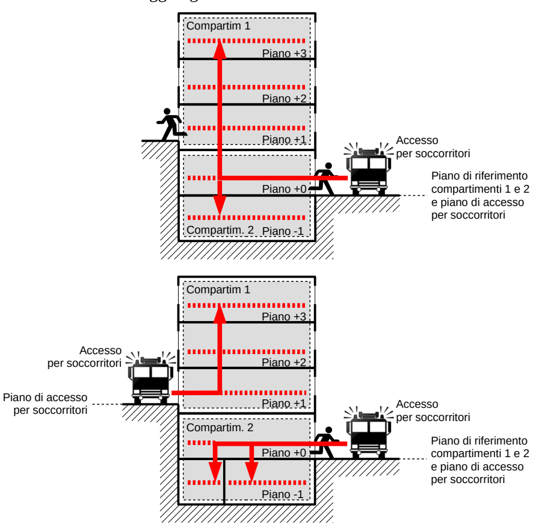

Illustrazione G.1-4: Percorsi d'accesso ai piani per soccorritori (linee piene), gli ingressi di piano consentono ai soccorritori di raggiungere tutti i locali (linee tratteggiate)

#### **G.1.16 Aree a rischio specifico**

<span id="page-25-2"></span>1. Area a rischio specifico: ambito dell'attività caratterizzato da rischio di incendio sostanzialmente differente rispetto a quello tipico dell'attività.

Nota L'individuazione delle aree a rischio specifico è effettuata dal progettista secondo i criteri del ca pitolo [V.1](#page-236-0) oppure è riportata nella regole tecniche verticali.

## **G.1.17 Sostanze e miscele pericolose**

<span id="page-25-1"></span>1. Sostanza o miscela pericolosa: sostanza o miscela classificata come pericolosa ai sensi del regolamento (CE) n. 1272/2008 relativo alla classificazione, all'etichettatura e all'imballaggio (*Classification, Labelling and Packaging, CLP*) delle sostanze e delle miscele.

## **G.1.18 Atmosfere esplosive**

- <span id="page-25-0"></span>1. Esplosione: reazione rapida di ossidazione o di decomposizione che produce un aumento della temperatura, della pressione o di entrambe simultaneamente.
- 2. Atmosfera esplosiva: una miscela con l'aria, a condizioni atmosferiche, di sostanze infiammabili allo stato di gas, vapori, nebbie o di polveri in cui, dopo l'accensione, la combustione si propaga nell'insieme della miscela incombusta.
- 3. Limite di concentrazione di ossigeno (LOC), anche denominato come Minima Concentrazione di Ossigeno (MOC, *Minimum Oxygen Concentration*): rappresenta la concentrazione limite di ossigeno in una atmosfera esplosiva al di sotto della quale non ha luogo la combustione, indipendentemente dalla concentrazione della sostanza combustibile.
- 4. Vent: porzione non strutturale dell'opera da costruzione o sistema costruttivo con la funzione di limitare la sovrappressione limitando il danneggiamento strutturale.
- 5. Venting: strategia di riduzione del danno da esplosione mediante adozione di *vent*.
- 6. Funzionamento normale: stato in cui si trovano apparecchi, sistemi di protezione e componenti che svolgono la loro funzione prevista all'interno dei rispettivi parametri di progettazione.
- Nota Emissioni minime di materiale infiammabile possono far parte del funzionamento normale. Si considerano emissioni minime, per esempio, il rilascio di sostanze da organi di tenuta basati sull'azione umettante del fluido pompato. Guasti che richiedono la riparazione o l'arresto (es. la rottura dei giunti di una pompa, delle guarnizioni a flangia o perdite di sostanze causate da incidenti) non sono considerati parte del funzionamento normale.
 - 7. Malfunzionamento: stato in cui apparecchi, sistemi di protezione o componenti non svolgono la funzione prevista.
- Nota Un malfunzionamento può accadere per diverse ragioni, tra cui: la variazione di una caratteristica o di una dimensione del materiale o del pezzo lavorato, il guasto di uno o più elementi costitutivi di apparecchi, sistemi di protezione e componenti, per effetto di disturbi di origine esterna (es. urti, vibrazioni, campi elettromagnetici), per un errore o un'imperfezione nella progettazione (es. errori nel software), per effetto di un disturbo dell'alimentazione di energia o di altri servizi; per la perdita di controllo da parte dell'operatore (specialmente per le macchine a funzionamento manuale).
 - 8. Malfunzionamento previsto: malfunzionamento (es. disturbi o guasti) di apparecchi, sistemi di protezione o componenti, che è noto si verifichi durante il normale utilizzo.

 - 9. Malfunzionamento raro: tipo di malfunzionamento che è noto possa accadere, ma solo in rari casi.

Nota Ad esempio, due malfunzionamenti previsti indipendenti che separatamente non creerebbero il pericolo di accensione, ma che in combinazione creano il pericolo di accensione, sono considerati come un malfunzionamento raro.

#### **G.1.19 Alimentazioni elettriche**

- <span id="page-26-1"></span>1. Alimentazione di emergenza: alimentazione di sicurezza o di riserva.
- 2. Alimentazione di sicurezza: sistema elettrico inteso a garantire l'alimentazione di apparecchi utilizzatori o parti dell'impianto elettrico necessari per la sicurezza delle persone.

Nota L'alimentazione di sicurezza risulta essere necessaria per alimentare gli impianti significativi ai fini della gestione della sicurezza antincendio e dell'emergenza, quali ad esempio illuminazione di sicurezza, gruppi di pompaggio antincendio, sistemi estrazione fumo, sistemi elettrici di ripristino delle compartimentazioni, impianti di rivelazione di sostanze o miscele pericolose, ascensori antincendio, …

Nota I sistemi di sicurezza e gli impianti dotati di alimentazione elettrica di sicurezza sono normalmente alimentati da una sorgente di alimentazione ordinaria che, in caso di indisponibilità o in situazioni di emergenza, viene sostituita automaticamente dalla sorgente di alimentazione di sicurezza.

3. Alimentazione di riserva: sistema elettrico inteso a garantire l'alimentazione di apparecchi utilizzatori o di parti di impianto per motivi diversi dalla sicurezza delle persone.

#### **G.1.20 Ascensori**

<span id="page-26-0"></span>1. Ascensore antincendio: ascensore installato principalmente per uso degli occupanti, munito di ulteriori protezioni, comandi e segnalazioni che lo rendono in grado di essere impiegato, sotto il controllo delle squadre di soccorso, anche in caso di incendio.

Nota Ad esempio, l'ascensore antincendio può essere impiegato, anche in caso di incendio, per l'evacuazione assistita di occupanti con ridotte o impedite capacità motorie.

- 2. Ascensore di soccorso: ascensore utilizzabile in caso di incendio, installato esclusivamente per il trasporto delle attrezzature di servizio antincendio ed, eventualmente, per l'evacuazione di emergenza degli occupanti.
- 3. Atrio protetto: compartimento protetto dall'incendio che fornisce un accesso protetto dall'area di utilizzo dell'edificio verso gli ascensori antincendio.

#### G.1.21 Ingegneria della sicurezza antincendio

- <span id="page-27-0"></span>1. Ingegneria della sicurezza antincendio (metodo prestazionale, *fire safety engineering*, FSE): applicazione di principi ingegneristici, di regole e di giudizi esperti basati sulla valutazione scientifica del fenomeno della combustione, degli effetti dell'incendio e del comportamento umano, finalizzati alla tutela della vita umana, alla protezione dei beni e dell'ambiente, alla quantificazione dei rischi di incendio e dei relativi effetti ed alla valutazione analitica delle misure antincendio ottimali, necessarie a limitare entro livelli prestabiliti le conseguenze dell'incendio, secondo le indicazioni del capitolo M.1.
- 2. Scenario d'incendio: descrizione completa ed univoca dell'evoluzione dell'incendio in relazione ai suoi tre aspetti fondamentali: focolare, attività ed occupanti.
- 3. Scenario d'incendio di progetto: specifico scenario d'incendio in relazione al quale viene condotta l'applicazione dei metodi dell'ingegneria della sicurezza antincendio.
- 4. ASET (*available safe escape time*): intervallo di tempo calcolato tra l'innesco dell'incendio ed il momento in cui le condizioni ambientali nell'attività diventano tali da rendere gli occupanti *incapaci* di porsi in salvo raggiungendo o permanendo in un luogo sicuro.
- 5. RSET (*required safe escape time*): intervallo di tempo calcolato tra l'innesco dell'incendio ed il momento in cui gli occupanti dell'attività raggiungono un luogo sicuro.
- 6. PTAT (*pre-travel activity time*): tempo impiegato dagli occupanti per attività svolte prima di avviare il movimento d'esodo.

#### **G.1.22 Tolleranze**

- <span id="page-28-0"></span>1. Tolleranza: differenza in valore assoluto tra la misurazione effettuata in sito e la corrispondente misura progettuale.
- Nota Ad esempio: larghezza vano di progetto 120 cm, larghezza vano eseguito 122 cm, tolleranza 2 cm. La *tolleranza* non deve essere confusa con la *precisione* dello strumento impiegato per la misura. Per definizione, la tolleranza non può essere già impiegata in fase progettuale.
 - 2. Tolleranza ammissibile: valore ammissibile della tolleranza stabilito in forza di una norma o di una regola tecnica o, in assenza, dal progettista.
 - 3. Valori delle tolleranze ammissibili: salvo indicazioni specifiche da parte di norme, specificazioni tecniche o regole tecniche, le tolleranze ammissibili per le misure di vario tipo, ai fini dell'applicazione del presente documento, sono riportate in tabella [G.1-1](#page-28-1).

| | Tolleranza ammissibile | |
|---------------------------------------------------------------------------|-----------------------------------------------------|-----|
| Lunghezza [1], [2] | ≤<br>2,40<br>m | ±5% |
| | per la porzione eccedente la lunghezza di 2,40<br>m | ±2% |
| Superficie, volume, illuminamento, tempo, massa, temperatura, portata [1] | ±5% | |
| Pressione [1] | | ±5% |

<sup>[1]</sup> Si intendono le grandezze definite nel Sistema internazionale di misura.

<span id="page-28-1"></span>*Tabella G.1-1: Tolleranze ammissibili per grandezza misurata*

<sup>[2]</sup> I valori della tolleranza ammissibile si applicano anche alle misure lineari che concorrono alla determinazione della pendenza delle rampe.

#### **G.1.23 Simboli grafici**

- <span id="page-29-0"></span>1. Nell'esecuzione degli elaborati tecnici il progettista impiega i simboli grafici della norma UNI EN ISO 7010, oppure quelli contenuti nelle tabelle [G.1-2](#page-30-0) ed [G.1-3.](#page-31-0) Tale simbologia può essere integrata da indicazioni di maggiore dettaglio, utili alla definizione di specifici aspetti antincendio.
- Nota Ad esempio: dimensioni utili delle porte, presenza di ritegni elettromeccanici, coefficienti k degli erogatori, tipologia dei dispositivi di apertura delle porte, tipologia di rivelatori antincendio, temperature di attivazione di sensori, tipologie di erogatori ad attivazione automatica, …
 - 2. Qualora sia necessario impiegare ulteriore simbologia per elementi ritenuti significativi ai fini della sicurezza antincendio, tale simbologia deve essere chiaramente riportata nella legenda degli elaborati tecnici.

| Tipologia | Simbolo | Descrizione | | |
|---------------------------------------------|---------|--------------------------------------------------------------------------------------------|--|--|
| Elementi costruttivi<br>e relative aperture | | Porta resistente al fuoco.<br>Per tali porte la sporgenza indica il verso di apertura [1]. | | |
| Distanziamenti | | Distanza di separazione [2] | | |
| | | Porzione della via di esodo verso l'alto | | |
| Vie d'esodo | | Porzione della via di esodo orizzontale | | |
| | | Porzione della via di esodo verso il basso | | |
| Estintori | | Estintore portatile [3] | | |
| | | Estintore carrellato [3] | | |
| Sistemi idrici<br>antincendio | | Naspo | | |
| | | Idrante a muro | | |
| | | Idrante sottosuolo [4] | | |
| | | Idrante a colonna soprassuolo [4] | | |
| | | Attacco di mandata per autopompa [5] | | |

<sup>[1]</sup> Accanto al simbolo grafico devono indicarsi il simbolo e la classe di resistenza al fuoco (es. EI 120-Sa)

<span id="page-30-0"></span>*Tabella G.1-2: Simboli grafici*

<sup>[2]</sup> Deve essere specificato, anche tramite colori, se la distanza è esterna, interna o di protezione

<sup>[3]</sup> Accanto al simbolo grafico devono essere indicate le classi di spegnimento dell'estintore.

<sup>[4]</sup> Accanto al simbolo grafico devono essere indicati il diametro e il numero degli attacchi di uscita.

<sup>[5]</sup> Accanto al simbolo grafico deve essere indicato il numero degli attacchi di immissione.

| Tipologia | Simbolo | Descrizione | |
|---------------------------------|---------|-----------------------------------------------------|--|
| Sistemi di<br>segnalazione | | Pulsante di allarme | |
| | | Rivelatore di incendio (o rivelatore) [1] | |
| Impianti fissi di<br>estinzione | | Erogatore di impianto ad attivazione automatica [2] | |
| | | Erogatore di impianto ad attivazione manuale [2] | |

<sup>[1]</sup> All'interno del cerchio deve essere riportato il simbolo del tipo di rivelatore

<span id="page-31-0"></span>*Tabella G.1-3: Simboli grafici*

<sup>[2]</sup> All'interno del cerchio e del quadrato deve essere riportato un simbolo rappresentativo della sostanza estinguente (da richiamare in legenda)

#### **G.1.24 Sigle**

- <span id="page-32-0"></span>1. Nel documento sono adottate le seguenti sigle.
- 2. ASET: Tempo disponibile per l'esodo, *Available Safe Egress Time*.
- 3. ATEX: Atmosfere esplosive, *Atmosphères Explosibles.*
- 4. CE: Comunità Europea, *Communauté Européenne*.
- 5. CPD: Direttiva Prodotti da Costruzione. Direttiva del Consiglio del 21 dicembre 1988 n. 89/106/CEE.
- 6. CFD: Fluidodinamica computazionale, metodologia di risoluzione numerica delle equazioni della fluidodinamica, *Computational Fluid Dynamics.*
- 7. CPR: Regolamento Prodotti da Costruzione. Regolamento (UE) n. 305/2011 del Parlamento Europeo e del Consiglio del 9 marzo 2011.
- 8. DCPST: Direzione centrale per la prevenzione e la sicurezza tecnica del Dipartimento dei Vigili del fuoco, del soccorso pubblico e della difesa civile del Ministero dell'interno.
- 9. DVR: Documento di valutazione dei rischi secondo decreto legislativo 9 aprile 2008, n. 81 "*Testo unico sulla salute e sicurezza sul lavoro*".
- 10. DUVRI: Documento di valutazione dei rischi di interferenza secondo decreto legislativo 9 aprile 2008, n. 81 "*Testo unico sulla salute e sicurezza sul lavoro*".
- 11. EAD: Documento per la valutazione europea, *European Assessment Document*.
- 12. ESFR: *Early Suppression Fast Response*, sistema sprinkler avente la possibilità di conseguire la soppressione dell'incendio.
- 13. EVAC: Sistema di allarme vocale per scopi di emergenza.
- 14. FED: Frazione di dose efficace, *Fractional Effective Dose*.
- 15. FEC: Frazione di concentrazione efficace, *Fractional Effective Concentration*.
- 16. FSE: Ingegneria della sicurezza antincendio, *Fire Safety Engineering*.
- 17. GNL: Gas naturale liquefatto.
- 18. GPL: Gas di petrolio liquefatti.
- 19. GSA: Gestione della sicurezza antincendio.
- 20. IRAI: Impianti di rivelazione incendio e segnalazione allarme incendio.
- 21. LEL: Limite inferiore di esplosività, *Lower Explosive Limit*.
- 22. LOC: Concentrazione limite di ossigeno, *Limit Oxygen Concentration.*
- 23. MIE: Minima energia di innesco, *Minimum Ignition Energy*.
- 24. MOC: Minima concentrazione di ossigeno, *Minimum Oxygen Concentration*.
- 25. NAD: *National Application Document*, documento di applicazione nazionale degli Eurocodici rappresentato per l'Italia dal decreto del Ministero delle Infrastrutture 31 luglio 2012.
- 26. NFPA: *National Fire Protection Association*.
- 27. NTC: Decreto del Ministro delle Infrastrutture e dei Trasporti del 17 gennaio 2018 "*Norme tecniche delle costruzioni*".
- 28. PTAT: Tempo di pre-evacuazione, *Pre-travel activity time.*

- 29. RHR (o HRR): *Rate of Heat Release* (o *Heat Release Rate*). Funzione che esprime l'andamento temporale della potenza termica rilasciata dall'incendio.
- 30. RI: Rete di idranti.
- 31. RSET: Tempo richiesto per l'esodo, *Required Safe Egress Time*.
- 32. RTV: Regola tecnica verticale.
- 33. RTO: Regola tecnica orizzontale.
- 34. SEE: Spazio Economico Europeo.
- 35. SEFC: Sistema per l'evacuazione del fumo e del calore.
- 36. SEFFC: Sistema forzato per l'evacuazione del fumo e del calore.
- 37. SENFC: Sistema naturale per l'evacuazione del fumo e del calore.
- 38. SPK: Sistema sprinkler.
- 39. SVOF: Sistema di ventilazione orizzontale forzata.
- 40. TAB: Organismo di valutazione tecnica, *Technical Assessment Body*.
- 41. TS: *Technical Specification*.
- 42. TR: *Technical Report*.
- 43. UE: Unione Europea, *Union Européenne*.
- 44. UEL: Limite superiore di esplosività, *Upper Explosive Limit*.

#### G.1.25 Linguaggio

- <span id="page-34-0"></span>1. Nel documento è impiegato il seguente linguaggio.
- 2. Con il verbo "dovere" al modo indicativo (es. "deve", "devono", …), il congiuntivo esortativo (es. "sia installato…") e l'indicativo presente degli altri verbi (es. "l'altezza è…") si descrivono le prescrizioni cogenti da applicare nel contesto esaminato.
- 3. Con il verbo "dovere" al modo condizionale (es. dovrebbe, dovrebbero, ...), gli avverbi "generalmente" e "di norma" si descrivono indicazioni non obbligatorie che consentono al progettista di scegliere modalità tecniche diverse da quella indicata nel contesto esaminato; tali modalità diverse devono essere analizzate e descritte nella documentazione progettuale.
- 4. Con il verbo "potere" (es. "può essere installato") si suggeriscono opportune valutazioni o modalità tecniche aggiuntive che si considerano efficaci nel contesto esaminato, anche ai fini della valutazione della sicurezza equivalente.
- 5. La congiunzione "e" è usata per collegare due condizioni che devono essere contemporaneamente valide (equivalente all'operatore logico *AND*).
- 6. La congiunzione "o" è usata per collegare due condizioni che possono essere valide sia alternativamente che contemporaneamente (equivalente all'operatore logico *OR*).
- 7. Nei casi in cui una condizione deve necessariamente escluderne altre (es. "o l'una o l'altra", equivalente all'operatore logico *XOR*), ciò viene esplicitamente segnalato nel testo.
- 8. Con il sostantivo "esempio" o con la sua abbreviazione "es." si propongono una o più possibilità riportate al mero scopo di indicare applicazioni pratiche di una regola o di un principio. Gli esempi sono quindi da considerare come casi indicativi, non esaustivi, forniti a mero titolo illustrativo e non costituiscono prescrizione.
- 9. L'applicazione della normazione volontaria citata nel presente documento (es. ISO, EN, UNI, ...) conferisce presunzione di conformità, ma rimane *volontaria* e non è *obbligatoria*, a meno che non sia resa cogente da altre disposizioni regolamentari.
- 10. Le note riportate nel testo hanno carattere *esplicativo* o *complementare* nel contesto esaminato.

## **GENERALITÀ Capitolo G.2 Progettazione per la sicurezza antincendio**

<span id="page-36-0"></span>[Principi e caratteristiche del documento](#page-37-2)

[Campo d'applicazione](#page-37-1)

[Ipotesi fondamentali](#page-37-0)

[Struttura del documento](#page-38-0)

[Obiettivi della progettazione della sicurezza antincendio](#page-39-1)

#### [Metodologia generale](#page-39-0)

[Valutazione del rischio d'incendio per l'attività](#page-41-0) [Attribuzione dei profili di rischio](#page-42-2) [Strategia antincendio per la mitigazione del rischio](#page-42-1) [Attribuzione dei livelli di prestazione alle misure antincendio](#page-42-0) [Individuazione delle soluzioni progettuali](#page-43-0)

[Metodi di progettazione della sicurezza antincendio](#page-45-0)

[Metodi aggiuntivi di progettazione della sicurezza antincendi](#page-46-1)

[Valutazione del progetto antincendio](#page-46-0)

[Indicazioni generali per la progettazione di impianti per la sicurezza antincendio](#page-47-1) [Prescrizioni comuni](#page-47-0)

[Sistemi o impianti a disponibilità superiore](#page-48-0)

[Riferimenti](#page-49-0)

#### G.2.1 Principi e caratteristiche del documento

- <span id="page-37-2"></span>1. Il presente documento riporta metodologie di progettazione della sicurezza antincendio finalizzate al raggiungimento degli *obiettivi primari* della prevenzione incendi
- 2. Le soluzioni progettuali previste dalle metodologie di progettazione della sicurezza antincendio del presente documento allineano il panorama normativo italiano ai principi di prevenzione incendi internazionalmente riconosciuti.
- 3. L'impostazione generale del presente documento è basata sui seguenti principi:
 - a. *generalità*: le medesime metodologie di progettazione della sicurezza antincendio descritte possono essere applicate a *tutte* le attività;
 - b. *semplicità*: laddove esistano varie possibilità per raggiungere il medesimo risultato si prediligono soluzioni più semplici, realizzabili, comprensibili, per le quali è più facile la manutenzione;
 - c. *modularità*: la complessità della materia è scomposta in moduli facilmente accessibili, che guidano il progettista alla composizione di soluzioni progettuali appropriate per la specifica attività;
 - d. *flessibilità*: ad ogni prestazione di sicurezza antincendio richiesta all'attività corrisponde sempre la proposta di molteplici soluzioni progettuali *prescrittive* o *prestazionali*. Sono inoltre definiti metodi riconosciuti affinché il progettista possa concepire autonomamente e dimostrare la validità della specifica soluzione progettuale alternativa, nel rispetto degli obiettivi di sicurezza antincendio;
 - e. *standardizzazione ed integrazione*: il linguaggio della prevenzione incendi è conforme agli standard internazionali. Sono state inoltre integrate le disposizioni derivanti dai documenti preesistenti della prevenzione incendi italiana;
 - f. *inclusione*: le diverse disabilità (es. fisiche, mentali o sensoriali) e le specifiche necessità temporanee o permanenti degli occupanti sono considerate parte integrante della progettazione della sicurezza antincendio;
 - g. *contenuti basati sull'evidenza*: il presente documento è basato su studio, valutazione ed uso sistematico dei risultati della ricerca scientifica nazionale ed internazionale nel campo della sicurezza antincendio;
 - h. *aggiornabilità*: il presente documento è redatto in forma tale da poter essere facilmente aggiornato al fine di poter seguire il continuo avanzamento tecnologico e delle conoscenze.

#### G.2.2 Campo d'applicazione

- <span id="page-37-1"></span>1. Il presente documento si applica alla progettazione, realizzazione e gestione della sicurezza antincendio delle attività, individuate con il presente decreto.
- 2. Il documento è applicabile ad attività *nuove* ed *esistenti*.

#### G.2.3 Ipotesi fondamentali

- <span id="page-37-0"></span>1. I contenuti tecnici del presente documento sono basati sulle seguenti *ipotesi fondamentali*:
 - a. in condizioni ordinarie, l'incendio di un'attività si avvia da un solo punto d'innesco.

b. il rischio d'incendio di un'attività non può essere *ridotto a zero*.

Le *misure antincendio* di prevenzione, di protezione e gestionali previste nel presente documento sono pertanto selezionate al fine di minimizzare il rischio d'incendio, in termini di probabilità e di conseguenze, entro limiti *considerati* accettabili.

Nota Si ritiene pertanto che nelle attività progettate, realizzate e gestite secondo le indicazioni di sicurezza antincendio ed i metodi del presente documento, il residuo rischio d'incendio sia considerato accettabile.

#### G.2.4 Struttura del documento

- <span id="page-38-0"></span>1. Il presente documento si compone di quattro sezioni che disciplinano, nel loro complesso, l'intera materia antincendio:
 - a. sezione G *Generalità*: contiene i principi fondamentali per la progettazione della sicurezza antincendio applicabili indistintamente a tutte le attività;
 - b. sezione S *Strategia antincendio*: contiene le *misure antincendio* di prevenzione, protezione e gestionali applicabili a tutte le attività, per comporre la *strategia antincendio* al fine di mitigare il rischio d'incendio;
 - c. sezione V *Regole tecniche verticali*: contiene le *regole tecniche verticali*, che completano, integrano o sostituiscono le misure della precedente sezione S per specifiche applicazioni tecniche o determinate tipologie d'attività.
 - d. sezione M *Metodi*: contiene la descrizione di metodologie progettuali *quantitative* per la progettazione di misure antincendio, calibrate sulle particolari problematiche tecniche affrontate nella determinata attività.

#### G.2.5 Obiettivi della progettazione della sicurezza antincendio

- <span id="page-39-1"></span>1. Progettare la sicurezza antincendio di un'attività significa individuare le soluzioni tecniche e gestionali finalizzate al raggiungimento degli *obiettivi primari* della prevenzione incendi, che sono:
 - a. sicurezza della vita umana,
 - b. incolumità delle persone,
 - c. tutela dei beni e dell'ambiente.
- 2. Gli obiettivi primari della prevenzione incendi si intendono raggiunti se le attività sono progettate, realizzate e gestite in modo da:
 - a. minimizzare le cause d'incendio o d'esplosione;
 - b. garantire la stabilità delle strutture portanti per un periodo di tempo determinato;
 - c. limitare la produzione e la propagazione di un incendio all'interno dell'attività;
 - d. limitare la propagazione di un incendio ad attività contigue:
 - e. limitare gli effetti di un'esplosione;
 - f. garantire la possibilità che gli occupanti lascino l'attività autonomamente o che gli stessi siano soccorsi in altro modo;
 - g. garantire la possibilità per le squadre di soccorso di operare in condizioni di sicurezza;
 - h. tutelare gli edifici pregevoli per arte o storia;
 - i. garantire la continuità d'esercizio per le opere strategiche;
 - j. prevenire il danno ambientale e limitare la compromissione dell'ambiente in caso d'incendio.

Nota Come specificato al capitolo G.3, la determinazione di quali edifici siano da considerarsi *pregevoli per arte o storia* e di quali opere siano da considerarsi *strategiche* è demandata a specifici atti normativi o ad esplicita richiesta del responsabile dell'attività.

#### G.2.6 Metodologia generale

<span id="page-39-0"></span>Nota Questa metodologia generale è applicata a tutte le attività, anche nel caso siano disponibili pertinenti *regole tecniche verticali* (Sezione V).

- 1. La progettazione della sicurezza antincendio delle attività è un processo iterativo, costituito dai seguenti passi:
 - a. *scopo della progettazione*: si descrive qualitativamente e quantitativamente l'attività ed il suo funzionamento, al fine di chiarire lo scopo della progettazione;

Nota Ad esempio, la descrizione dell'attività può comprendere: localizzazione e contesto, finalità, vincoli, struttura organizzativa e responsabilità, tipologia e quantità di occupanti, processi produttivi, opere da costruzione, impianti, tipologia e quantità di materiali stoccati o impiegati, ...

b. *obiettivi di sicurezza*: sono esplicitati gli obiettivi di sicurezza della progettazione previsti al paragrafo G.2.5, applicabili all'attività;

Nota Ad esempio, non è necessario tutelare edifici che non risultino *pregevoli per arte o storia*, o garantire la continuità d'esercizio per opere che non siano considerate *strategiche*.

- c. *valutazione del rischio*: si effettua la valutazione del rischio d'incendio di cui al paragrafo G.2.6.1;
- d. *profili di rischio*: si determinano ed attribuiscono i profili di rischio, come previsto al paragrafo G.2.6.2;
- e. *strategia antincendio*: si procede alla mitigazione del rischio valutato tramite misure preventive, protettive e gestionali che rimuovano i pericoli, riducano i rischi o proteggano dalle loro conseguenze:
 - i. definendo la *strategia antincendio* complessiva, secondo paragrafo G.2.6.3.
 - ii. attribuendo i *livelli di prestazione* per tutte le misure antincendio, come previsto al paragrafo G.2.6.4;
 - iii. individuando le *soluzioni progettuali* che garantiscono il raggiungimento dei livelli di prestazione attribuiti, secondo paragrafo G.2.6.5;
- f. qualora il *risultato* della progettazione non sia ritenuto compatibile con lo *scopo* definito al punto a, il progettista itera i passi di cui al punto e della presente metodologia.
- 2. Qualora disponibili, il progettista è tenuto ad applicare i contenuti delle pertinenti *regole tecniche verticali* all'attività trattata, secondo le indicazioni dei successivi paragrafi.

Nota La metodologia generale è schematizzata nell'illustrazione G.2-1.

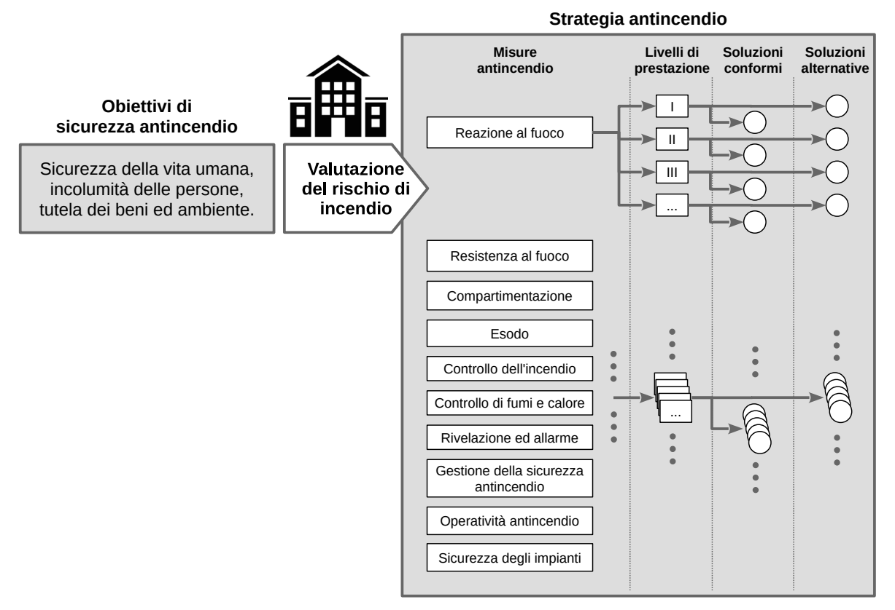

<span id="page-40-0"></span>*Illustrazione G.2-1: Schematizzazione della metodologia generale* 

## **G.2.6.1 Valutazione del rischio d'incendio per l'attività**

- <span id="page-41-0"></span>1. Il progettista impiega uno dei metodi di regola dell'arte per la valutazione del rischio d'incendio, in relazione alla complessità dell'attività trattata.
- Nota La valutazione del rischio d'incendio rappresenta un'analisi della specifica attività, finalizzata all'individuazione delle *più severe ma credibili* ipotesi d'incendio e delle corrispondenti conseguenze per gli occupanti, i beni e l'ambiente. Tale analisi consente al progettista di implementare e, se necessario, integrare le soluzioni progettuali previste nel presente documento.
 - 2. In ogni caso la valutazione del rischio d'incendio deve ricomprendere almeno i seguenti argomenti:
 - a. individuazione dei pericoli d'incendio;
- Nota Ad esempio, si valutano: sorgenti d'innesco, materiali combustibili o infiammabili, carico incendio, interazione inneschi-combustibili, eventuali quantitativi rilevanti di miscele o sostanze pericolose, lavorazioni pericolose ai fini dell'incendio o dell'esplosione, possibile formazione di atmosfere esplosive, …
 - b. descrizione del contesto e dell'ambiente nei quali i pericoli sono inseriti;
- Nota Si indicano ad esempio: condizioni di accessibilità e viabilità, layout aziendale, distanziamenti, separazioni, isolamento, caratteristiche degli edifici, tipologia edilizia, complessità geometrica, volumetria, superfici, altezza, piani interrati, articolazione plano-volumetrica, compartimentazione, aerazione, ventilazione e superfici utili allo smaltimento di fumi e di calore, …
 - c. determinazione di quantità e tipologia degli occupanti esposti al rischio d'incendio;
 - d. individuazione dei beni esposti al rischio d'incendio;
 - e. valutazione qualitativa o quantitativa delle conseguenze dell'incendio su occupanti, beni ed ambiente;
 - f. individuazione delle misure preventive che possano rimuovere o ridurre i pericoli che determinano rischi significativi.
 - 3. Qualora siano disponibili pertinenti *regole tecniche verticali*, la valutazione del rischio d'incendio da parte del progettista è limitata agli aspetti peculiari della specifica attività trattata.
 - 4. Negli ambiti delle attività in cui sono presenti *sostanze infiammabili* allo stato di gas, vapori, nebbie o polveri combustibili, la valutazione del rischio d'incendio deve includere anche la valutazione del rischio per *atmosfere esplosive* (capitolo [V.2](#page-240-0)).

#### G.2.6.2 Attribuzione dei profili di rischio

<span id="page-42-2"></span>1. Dopo aver valutato il rischio d'incendio per l'attività, il progettista attribuisce le seguenti tre tipologie di *profili di rischio*:

R<sub>vita</sub>, profilo di rischio relativo alla salvaguardia della vita umana;

R<sub>beni</sub>, profilo di rischio relativo alla salvaguardia dei beni economici;

R<sub>ambiente</sub>, *profilo di rischio* relativo alla tutela dell'*ambiente* dagli effetti dell'incendio.

Nota I profili di rischio sono *indicatori speditivi* e *sintetici* della tipologia di rischio presente negli ambiti dell'attività e non sono sostitutivi della dettagliata valutazione del rischio d'incendio condotta dal progettista secondo le indicazioni del paragrafo G.2.6.1.

- 2. Il capitolo G.3 fornisce al progettista:
 - a. la metodologia per determinare quantitativamente i profili di rischio $R_{\text{vita}}$ ed $R_{\text{beni}}\text{,}$
 - b. i criteri per valutare il profilo di rischio R<sub>ambiente</sub>.

## G.2.6.3 Strategia antincendio per la mitigazione del rischio

- <span id="page-42-1"></span>1. Il progettista mitiga il rischio d'incendio valutato applicando un'adeguata *strategia antincendio* composta da *misure antincendio* di prevenzione, di protezione e gestionali.
- 2. Nel presente documento le *misure antincendio* di prevenzione, di protezione e gestionali, di cui al comma 1, sono raggruppate in modo omogeneo nei capitoli compresi nella sezione Strategia antincendio.
- 3. Per ciascuna *misura antincendio* sono previsti diversi *livelli di prestazione*, graduati in funzione della complessità crescente delle prestazioni previste ed identificati da numero romano (es. I, II, III, ...)
- 4. Il progettista applica all'attività tutte le *misure antincendio*, stabilendo per ciascuna i relativi *livelli di prestazione* in funzione degli *obiettivi di sicurezza* da raggiungere e della *valutazione del rischio* dell'attività.

#### G.2.6.4 Attribuzione dei livelli di prestazione alle misure antincendio

- <span id="page-42-0"></span>1. Effettuata la *valutazione del rischio* d'incendio per l'attività e stabiliti i profili di rischio $R_{\text{vita}}$ , $R_{\text{beni}}$ ed $R_{\text{ambiente}}$ nei pertinenti ambiti (capitolo G.3), il progettista attribuisce alle misure antincendio i relativi *livelli di prestazione*.
- 2. Ciascun capitolo della sezione *Strategia antincendio* fornisce al progettista i criteri di attribuzione dei *livelli di prestazione* alle *misure antincendio*.
- 3. Qualora disponibili, nelle pertinenti *regole tecniche verticali* possono essere definiti alcuni dei *livelli di prestazione* che il progettista è tenuto ad attribuire all'attività in funzione delle sue caratteristiche (es. numero degli occupanti, quota dei piani, quantità di sostanze e miscele pericolose, ...).
- 4. Per ogni *misura antincendio*, il progettista può attribuire *livelli di prestazione* differenti da quelli proposti nel presente documento.
 - Se i livelli attribuiti sono inferiori a quelli proposti, il progettista è tenuto a dimostrare il raggiungimento degli obiettivi di sicurezza antincendio impiegando uno dei *metodi di progettazione della sicurezza antincendio* previsti al paragrafo G.2.7.

Al fine di consentire la valutazione di tale dimostrazione da parte del Corpo nazionale dei Vigili del fuoco, è ammessa l'attribuzione di livelli di prestazione differenti da quelli proposti solo nelle *attività con valutazione del proqetto*.

Nota La definizione di *attività con valutazione del progetto* si trova nel capitolo G.1 ed include, oltre alle attività con valutazione *ordinaria*, anche quelle con possibilità della valutazione *in deroga*.

#### G.2.6.5 Individuazione delle soluzioni progettuali

- <span id="page-43-0"></span>1. Per ogni *livello di prestazione* di ciascuna misura antincendio sono previste diverse *soluzioni progettuali*. L'applicazione di una delle *soluzioni progettuali* garantisce il raggiungimento del *livello di prestazione* richiesto.
- 2. Sono definite tre tipologie di *soluzioni progettuali*:
 - a. soluzioni conformi;
 - b. soluzioni alternative;
 - c. soluzioni in deroga.

Nota Le definizioni di *soluzioni conforme*, *soluzione alternativa* e *soluzione in deroga* si trovano nel capitolo G.1.

- 3. Qualora disponibili, nelle pertinenti *regole tecniche verticali* possono essere descritte eventuali *soluzioni progettuali* complementari o sostitutive di quelle dettagliate nella sezione *Strategia antincendio*, oppure semplici prescrizioni aggiuntive per la specifica tipologia d'attività.
- 4. Il progettista può sempre scegliere la soluzione progettuale più adatta alla tipologia d'attività.

## G.2.6.5.1 Applicazione di soluzioni conformi

- 1. Il progettista che fa ricorso alle *soluzioni conformi* non è tenuto a fornire ulteriori valutazioni tecniche per dimostrare il raggiungimento del collegato *livello di prestazione*.
- 2. Le *soluzioni conformi* sono solo quelle proposte nei pertinenti paragrafi della sezione *Strategia antincendio* e delle *regole tecniche verticali*.

## G.2.6.5.2 Applicazione di soluzioni alternative

- <span id="page-43-1"></span>1. Il progettista può fare ricorso alle *soluzioni alternative* proposte nei pertinenti paragrafi della sezione *Strategia antincendio* e delle *regole tecniche verticali*, oppure può proporre specifiche *soluzioni alternative* con i metodi di cui al comma successivo.
- 2. Il progettista che fa ricorso alle *soluzioni alternative* è tenuto a dimostrare il raggiungimento del collegato *livello di prestazione*, impiegando uno dei *metodi di progettazione della sicurezza antincendio* ammessi per ciascuna misura antincendio tra quelli del paragrafo G.2.7.
- 3. Al fine di consentire la valutazione di tale dimostrazione da parte del Corpo nazionale dei Vigili del fuoco, è ammesso l'impiego di soluzioni alternative solo nelle attività con valutazione del progetto.

Nota La definizione di *attività con valutazione del progetto* si trova nel capitolo G.1 ed include, oltre alle attività con valutazione *ordinaria*, anche quelle con possibilità della valutazione *in deroga*.

#### G.2.6.5.3 Applicazione di soluzioni in deroga

<span id="page-43-2"></span>1. Se non possono essere efficacemente applicate né le *soluzioni conformi*, né le *soluzioni alternative*, il progettista può ricorrere al procedimento di deroga secondo le procedure previste dalla vigente normativa.

- 2. Il progettista che sceglie le *soluzioni in deroga* è tenuto a dimostrare il raggiungimento dei pertinenti obiettivi di prevenzione incendi di cui al paragrafo [G.2.5,](#page-39-1) impiegando uno dei *metodi di progettazione della sicurezza antincendio* previsti al paragrafo [G.2.8](#page-46-1).
- 3. Tutte le disposizioni del presente documento, incluse quelle definite nelle r*egole tecniche verticali*, possono diventare oggetto di procedimento di deroga.

#### **G.2.7 Metodi di progettazione della sicurezza antincendio**

- <span id="page-45-0"></span>1. La tabella [G.2-1](#page-45-1) elenca i metodi per la progettazione della sicurezza antincendio impiegabili da parte di *progettista* per:
 - a. la *verifica delle soluzioni alternative* al fine di dimostrare il raggiungimento del collegato *livello di prestazione* (paragrafo [G.2.6.5.2\)](#page-43-1);
 - b. la *verifica del livello di prestazione* attribuito alle *misure antincendio* al fine di dimostrare il raggiungimento dei pertinenti obiettivi di sicurezza antincendio (paragrafo [G.2.6.4](#page-42-0)).

| Metodi | Descrizione e limiti d'applicazione |
|----------------------------------------------------------------------------------------------------|--------------------------------------------------------------------------------------------------------------------------------------------------------------------------------------------------------------------------------------------------------------------------------------------------------------------------------------------------------------------------------------------------------------------------------------------------------------------------------------------------------------------------------------------------------------------------------------------------------------------------------------------------|
| Applicazione di norme<br>o documenti tecnici | Il progettista applica norme o documenti tecnici adottati da organismi europei o in<br>ternazionali, riconosciuti nel settore della sicurezza antincendio. Tale applicazione,<br>fatti salvi gli obblighi connessi all'impiego di prodotti soggetti a normativa comunita<br>ria di armonizzazione e alla regolamentazione nazionale, deve essere attuata nella<br>sua completezza, ricorrendo a soluzioni, configurazioni e componenti richiamati<br>nelle norme o nei documenti tecnici impiegati, evidenziandone specificatamente<br>l'idoneità, per ciascuna configurazione considerata, in relazione ai profili di rischio<br>dell'attività. |
| Soluzioni progettuali che<br>prevedono l'impiego di<br>prodotti o tecnologie di tipo<br>innovativo | L'impiego di prodotti o tecnologie di tipo innovativo, frutto della evoluzione tecnolo<br>gica, è consentito in tutti i casi in cui l'idoneità all'impiego possa essere attestata<br>dal professionista antincendio, in sede di verifica ed analisi sulla base di una valu<br>tazione del rischio connessa all'impiego dei medesimi prodotti o tecnologie, sup<br>portata da pertinenti certificazioni di prova riferite a:<br>●<br>norme o specifiche di prova nazionali;<br>●<br>norme o specifiche di prova internazionali;<br>●<br>specifiche di prova adottate da laboratori a tale fine autorizzati. |
| Ingegneria della sicurezza<br>antincendio | Il professionista antincendio applica i metodi dell'ingegneria della sicurezza antin<br>cendio, secondo procedure, ipotesi e limiti indicati in particolare nei capito<br>li<br>M.1,<br>M.2 e<br>M.3 oppure in base a principi tecnico-scientifici riconosciuti a livello<br>nazionale o internazionale. |
| Prove sperimentali | Il professionista antincendio esegue prove sperimentali in scala reale o in scala<br>adeguatamente rappresentativa, finalizzata a riprodurre ed analizzare dal vero i fe<br>nomeni (es. chimico-fisici e termodinamici, esodo degli occupanti,<br>…) che caratte<br>rizzano la problematica oggetto di valutazione avente influenza sugli obiettivi di<br>prevenzione incendi. |
| | Le prove sperimentali sono condotte secondo protocolli standardizzati oppure con<br>divisi con la Direzione centrale per la prevenzione e la sicurezza tecnica del Corpo<br>nazionale dei Vigili del fuoco. |
| | Le prove sono svolte alla presenza di rappresentanza qualificata del Corpo nazio<br>nale dei Vigili del fuoco, su richiesta del responsabile dell'attività. |
| | Le prove devono essere opportunamente documentate. In particolare i rapporti di<br>prova dovranno definire in modo dettagliato le ipotesi di prova ed i limiti d'utilizzo<br>dei risultati. Tali rapporti di prova, ivi compresi filmati o altri dati monitorati durante<br>la prova, sono messi a disposizione del Corpo nazionale dei Vigili del fuoco. |

<span id="page-45-1"></span>*Tabella G.2-1: Metodi di progettazione della sicurezza antincendio*

## **G.2.8 Metodi aggiuntivi di progettazione della sicurezza antincendi**

<span id="page-46-1"></span>1. Per la verifica di *soluzioni in deroga* (paragrafo [G.2.6.5.3](#page-43-2)), al fine di dimostrare il raggiungimento dei pertinenti obiettivi di prevenzione incendi indicati al paragrafo [G.2.5,](#page-39-1) il *professionista antincendio* può impiegare i metodi per la progettazione della sicurezza antincendio di cui alla tabella [G.2-1](#page-45-1) ed i metodi aggiuntivi della tabella [G.2-2](#page-46-2).

| Metodi | Descrizione e limiti d'applicazione | | |
|-----------------------------------------------------|-----------------------------------------------------------------------------------------------------------------------------------------------------------------------------------------------------------------|--|--|
| Analisi e progettazione<br>secondo giudizio esperto | L'analisi secondo giudizio esperto è fondata sui principi generali di prevenzione in<br>cendi e sul bagaglio di conoscenze del professionista antincendio, esperto del set<br>tore della sicurezza antincendio. | | |

<span id="page-46-2"></span>*Tabella G.2-2: Metodi aggiuntivi di progettazione della sicurezza antincendio*

## **G.2.9 Valutazione del progetto antincendio**

- <span id="page-46-0"></span>1. Ai fini della valutazione del progetto da parte del Corpo nazionale dei Vigili del fuoco, secondo le procedure previste dalla vigente normativa, il progettista deve garantire tramite la documentazione progettuale:
 - a. l'*appropriatezza* degli obiettivi di sicurezza antincendio perseguiti, delle ipotesi di base, dei dati d'ingresso, dei metodi, dei modelli, degli strumenti normativi selezionati ed impiegati a supporto della progettazione antincendio;

Nota Ad esempio: appropriata applicazione delle soluzioni conformi, …

- b. la *corrispondenza* delle misure di prevenzione incendi agli obiettivi di sicurezza perseguiti secondo le indicazioni del presente documento;
- Nota Ad esempio: previsione di adeguato sistema di vie d'esodo per soddisfare l'obiettivo di sicurezza della vita umana, …
 - c. la *correttezza* nell'applicazione di metodi, modelli e strumenti normativi.
- Nota Ad esempio: assenza di grossolani errori di calcolo, corrispondenza tra i risultati numerici dei calcoli e le effettive misure antincendio, …
 - 2. Il progettista assume *piena responsabilità* in merito alla *valutazione del rischio d'incendio* riportata nella documentazione progettuale relativa all'attività.

## G.2.10 Indicazioni generali per la progettazione di impianti per la sicurezza antincendio

#### G.2.10.1 Prescrizioni comuni

<span id="page-47-1"></span><span id="page-47-0"></span>Nota Le definizioni di *progetto dell'impianto*, *specifica dell'impianto*, *manuale d'uso e manutenzione dell'impianto*, *modifica sostanziale* e le definizioni afferenti la normazione volontaria sono reperibili nel capitolo G.1.

- 1. Per l'installazione e la modifica sostanziale degli impianti deve essere redatto un *progetto dell'impianto*, elaborato secondo la regola dell'arte e sulla base dei requisti indicati nella *specifica dell'impianto*.
- 2. Qualora il *progetto dell'impianto* sia elaborato secondo una *norma europea* o una *norma nazionale*, lo stesso deve essere a firma di *tecnico abilitato*.
- 3. Fatti salvi gli obblighi connessi all'impiego di prodotti rientranti nel campo di applicazione di *specifiche tecniche armonizzate*, qualora il *progetto dell'impianto* sia elaborato secondo *norme internazionali* o *norme riconosciute a livello internazionale*, *TS* o *TR*, lo stesso deve essere a firma di *professionista antincendio*.
- 4. Il progetto dell'impianto deve essere a firma di *professionista antincendio* anche in caso di soluzioni progettuali che prevedono l'impiego di *prodotti o tecnologie di tipo innovativo* di cui al paragrafo G.2.7.
- 5. Le norme o i documenti tecnici di cui al comma 3 devono essere applicati in ogni loro parte, evidenziandone specificatamente l'idoneità della realizzazione, compreso l'utilizzo dei componenti necessari al corretto funzionamento dell'impianto.
- 6. I parametri impiegati per la progettazione degli impianti sono individuati dai soggetti responsabili della valutazione del rischio di incendio e della progettazione. I responsabili dell'attività in cui sono installati gli impianti hanno l'obbligo di mantenere le condizioni che sono state valutate per l'individuazione dei predetti parametri di progetto.
- Nota La variazione delle condizioni di esercizio (es. diversa tipologia delle merci stoccate, aumento della altezza di impilamento, introduzione di processi pericolosi ai fini dell'incendio, ...) potrebbe degradare la prestazione di protezione dell'impianto, pertanto al variare delle condizioni di esercizio dell'ambito protetto è necessario verificare se l'impianto risulta essere ancora efficace per la protezione richiesta.
 - 7. Ai fini della valutazione del progetto antincendio dell'attività, prevista dalla normativa vigente, gli impianti devono essere documentati dalla *specifica dell'impianto* che si intende installare o modificare sostanzialmente. La specifica dell'impianto deve essere a firma di *tecnico abilitato* nel caso di cui al comma 2 o di *professionista antincendio* nel caso di cui al comma 3.
 - 8. Al termine dei lavori di installazione dell'impianto devono essere forniti, al responsabile dell'attività, oltre a quanto già previsto dalla normativa vigente, i progetti esecutivo e costruttivo finale (*as-built*), la documentazione finale richiamata dalla norma impiegata per la progettazione e l'installazione dello stesso, nonché il relativo manuale d'uso e manutenzione.
 - 9. Gli impianti devono essere progettati, realizzati, eserciti e manutenuti a regola d'arte secondo quanto prescritto dalle disposizioni regolamentari vigenti.

#### G.2.10.2 Sistemi o impianti a disponibilità superiore

- <span id="page-48-0"></span>Nota La definizione di sistemi o impianti a disponibilità superiore è reperibile nel capitolo G.1. Le definizioni di disponibilità (availability), affidabilità (reliability), manutenibilità (maintainability), supporto logistico della manutenzione (maintenance support performance), stato degradato (degraded state), stato di indisponibilità (down state), guasto (failure) e tasso di guasto medio (mean failure rate) sono riportate nella norma UNI EN 13306.
 - 1. La *disponibilità superiore* per sistemi o impianti può essere ottenuta tramite:
 - a. migliore affidabilità,
- Nota Ad esempio, grazie a componenti con minor rateo di guasto, ridondanza delle fonti di alimentazione elettrica, di estinguente, di componenti critici, inserimento di accorgimenti per la riduzione degli errori umani, protezioni specifiche dagli effetti dell'incendio, ...
 - b. maggiore manutenibilità e supporto logistico della manutenzione.
- Nota Ad esempio, tramite riduzione dei tempi di ripristino dei guasti, programmazione delle manutenzioni per settori dell'impianto, controlli e prove periodiche, ...
- Nota Utile riferimento per ispezione, test e manutenzione degli impianti di protezione attiva è rappresentato dalla norma NFPA 25.
 - 2. Al fine di mantenere il livello di sicurezza assicurato all'attività, per sistemi o impianti a disponibilità superiore deve essere prevista la gestione degli *stati degradati* o dello *stato di indisponibilità* del sistema.
- Nota Ad esempio, tramite limitazione della severità degli stati degradati, misure gestionali compensative, condizioni o limitazioni d'esercizio dell'attività, ...
 - 3. Se nel presente documento non è richiesta disponibilità superiore, non sono dovute specifiche valutazioni per i sistemi o gli impianti realizzati secondo la regola dell'arte.

#### G.2.11 Riferimenti

- <span id="page-49-0"></span>1. Ciascun capitolo del presente documento contiene i riferimenti a norme e pubblicazioni scientifiche da cui trae metodi, soglie, parametri.
- 2. Si indicano di seguito alcuni riferimenti bibliografici impiegati come riferimento nella stesura del presente documento:
 - a. BS 9999 "Code of practice for fire safety in the design, management and use of buildings", British Standards Institution (BSI) <a href="
 - b. NFPA 101 "Life Safety Code", National Fire Protection Association <a href="
 - c. International Fire Code 2009, International Code Council <a href="
- 3. In merito alla valutazione del rischio, si indicano i seguenti riferimenti:
 - a. ISO 16732-1 "Fire safety engineering Fire risk assessment Part 1: General"
 - b. ASTM E1776 "Standard Guide for Development of Fire-Risk-Assessment Standards"

## <span id="page-50-0"></span>**GENERALITÀ Capitolo G.3 Determinazione dei profili di rischio delle attività**

[Definizione dei profili di rischio](#page-51-0)

[Profilo di rischio Rvita](#page-52-2) [Determinazione](#page-52-1) [Profili di rischio Rvita per alcune tipologie di destinazione d'uso](#page-52-0)

[Profilo di rischio Rbeni](#page-55-0)

[Profilo di rischio Rambiente](#page-56-0)

[Riferimenti](#page-57-0)

#### G.3.1 Definizione dei profili di rischio

<span id="page-51-0"></span>1. Al fine di descrivere sinteticamente la tipologia di rischio di incendio dell'attività si definiscono le seguenti tipologie di *profilo di rischio*:

R<sub>vita</sub>: profilo di rischio relativo alla salvaguardia della *vita umana*;

R<sub>beni</sub>: profilo di rischio relativo alla salvaguardia dei *beni economici*;

R<sub>ambiente</sub>: profilo di rischio relativo alla tutela dell'ambiente.

2. Il profilo di rischio R<sub>vita</sub> è attribuito per *ciascun compartimento* e, ove necessario, per ciascuno *spazio a cielo libero* dell'attività, come indicato nel paragrafo G.3.2.

Nota Ad esempio, l'attribuzione del profilo di rischio R<sub>vita</sub> negli spazi a cielo libero è necessaria per la progettazione dell'esodo delle *attività all'aperto*.

- 3. Il profilo di rischio $R_{beni}$ è attribuito all'*intera attività* o ad *ambiti* di essa, come indicato nel paragrafo G.3.3.
- 4. Il profilo di rischio R<sub>ambiente</sub> è attribuito all'*intera attività* o ad *ambiti* di essa, come indicato nel paragrafo G.3.4.

#### **G.3.2 Profilo di rischio Rvita**

#### **G.3.2.1 Determinazione**

<span id="page-52-2"></span><span id="page-52-1"></span>1. Il profilo di rischio Rvita è attribuito in relazione ai seguenti fattori:

δocc: caratteristiche *prevalenti* degli occupanti;

Nota Per "*prevalenti"* si intendono le caratteristiche degli occupanti che per numerosità e tipologia sono più rappresentativi dell'attività svolta nell'ambito considerato in qualsiasi condizione d'esercizio. Ad esempio, un ufficio in cui vi sia modesta presenza solo occasionale e di breve durata di pubblico può essere classificato δocc = A.

δα: velocità caratteristica *prevalente* di crescita dell'incendio, riferita al tempo t<sup>α</sup> in secondi, impiegato dalla potenza termica per raggiungere il valore di 1000 kW.

Nota Per "*prevalente"* si intende la caratteristica rappresentativa del rischio di incendio in qualsiasi condizione d'esercizio. Ad esempio, la presenza nelle attività civili di limitate quantità di prodotti infiammabili per la pulizia adeguatamente stoccati non è considerata significativa e dunque neanche prevalente.

Le tabelle [G.3-1](#page-53-1) e [G.3-2](#page-53-0) guidano il progettista nella selezione dei fattori δocc e δα.

- 2. Il progettista può selezionare il valore di tα anche ricorrendo ad una delle seguenti opzioni:
 - a. dati pubblicati da fonti autorevoli e condivise,
 - b. determinazione diretta della curva RHR (*rate of heat release*) relativa ai combustibili effettivamente presenti e nella configurazione in cui si trovano, secondo le indicazioni del capitolo [M.2](#page-374-0) o tramite misure presso *laboratorio di prova*, secondo protocolli sperimentali consolidati.

Nota Le definizioni di *RHR* e di *laboratorio di prova* sono riportate nel capitolo [G.1](#page-6-0). Ad esempio, utili riferimenti per la determinazione sperimentale della curva RHR sono le norme della serie ISO 9705, la norma ISO 24473, la norma ISO 16405, …

- <span id="page-52-3"></span>3. Il valore di δα, valutato in assenza di sistemi di controllo dell'incendio, può essere ridotto di un livello se l'attività è servita da misure di controllo dell'incendio di livello di prestazione V (capitolo [S.6](#page-182-0)).
- 4. Il valore di Rvita è determinato come combinazione di δocc e δα, come da tabella [G.3-3](#page-54-1).

## **G.3.2.2 Profili di rischio Rvita per alcune tipologie di destinazione d'uso**

- <span id="page-52-0"></span>1. In tabella [G.3-4](#page-54-0) si riporta un'indicazione, non esaustiva, sul profilo di rischio Rvita per le tipologie di destinazione d'uso (*occupancy*) più comuni. Qualora il progettista scelga valori diversi da quelli proposti, è tenuto a indicare le motivazioni della scelta nei documenti progettuali.
- 2. Ove non previsto nel presente documento, per i compartimenti aventi Rvita compreso in Ci1, Ci2, Ci3, possono assumersi a riferimento i livelli di prestazione e le soluzioni progettuali rispettivamente per Cii1, Cii2, Cii3, tenendo conto della maggiore familiarità degli occupanti con l'attività e dello specifico rischio di incendio.

| Caratteristiche prevalenti<br>degli occupanti δ <sub>οcc</sub> | | Esempi | | | |
|-----------------------------------------------------------------------------------------------|---------------------------------------------------------------------------------|-----------------------------------------------------------------------------------------------------------------------------------------------------------------------------------------------------------------|--|--|--|
| А | Gli occupanti sono in stato di veglia ed<br>hanno familiarità con l'edificio | Ufficio non aperto al pubblico, scuola, autorimessa privata, centro sportivo privato, attività produttive in genere, depositi, capannoni industriali | | | |
| В | Gli occupanti sono in stato di veglia e<br>non hanno familiarità con l'edificio | Attività commerciale, autorimessa pubblica, attività espositiva e di pubblico spettacolo, centro congressi, ufficio aperto al pubblico, ristorante, studio medico, ambulatorio medico, centro sportivo pubblico | | | |
| С | Gli occupanti possono essere addormentati: [1] | | | | |
| Ci | in attività individuale di lunga durata | Civile abitazione | | | |
| Cii | in attività gestita di lunga durata | Dormitorio, residence, studentato, residenza per persone autosufficienti | | | |
| Ciii | in attività gestita di breve durata | Albergo, rifugio alpino | | | |
| D | Gli occupanti ricevono cure mediche | Degenza ospedaliera, terapia intensiva, sala operatoria, residenza per persone non autosufficienti e con assistenza sanitaria | | | |
| Е | Occupanti in transito | Stazione ferroviaria, aeroporto, stazione metropolitana | | | |
| [1] Quando nel presente documento si usa C la relativa indicazione è valida per Ci, Cii, Ciii | | | | | |

<span id="page-53-1"></span>Tabella G.3-1: Caratteristiche prevalenti degli occupanti

| $\delta_{\alpha}$ | t <sub>α</sub> [1] | Criteri |
|-------------------|--------------------|-----------------------------------------------------------------------------------------------------------------------------------------------------------------------------------------------------------------------------------------|
| 1 | 600 s<br>lenta | Ambiti di attività con carico di incendio specifico $q_f \le 200 \text{ MJ/m}^2$ , oppure ove siano presenti prevalentemente materiali o altri combustibili che contribuiscono in modo trascurabile all'incendio. |
| 2 | 300 s<br>media | Ambiti di attività ove siano presenti prevalentemente materiali o altri combustibili che contribuiscono in modo moderato all'incendio. |
| 3 | 150 s<br>rapida | Ambiti con presenza di significative quantità di materiali plastici impilati, prodotti tessili sintetici, apparecchiature elettriche e elettroniche, materiali combustibili non classificati per reazione al fuoco (capitolo S.1). |
| | | Ambiti ove avvenga impilamento verticale di significative quantità di materiali combustibili con 3,0 m < h $\leq$ 5,0 m [2]. |
| | | Stoccaggi classificati HHS3 oppure attività classificate HHP1, secondo la norma UNI EN 12845. |
| | | Ambiti con impianti tecnologici o di processo che impiegano significative quantità di materiali combustibili. |
| | | Ambiti con contemporanea presenza di materiali combustibili e lavorazioni pericolose ai fini dell'incendio. |
| 4 | 75 s<br>ultra- | Ambiti ove avvenga impilamento verticale di significative quantità di materiali combustibili con h > 5,0 m [2]. |
| | rapida | Stoccaggi classificati HHS4 oppure attività classificate HHP2, HHP3 o HHP4, secondo la norma UNI EN 12845. |
| | | Ambiti ove siano presenti o in lavorazione significative quantità di sostanze o miscele pericolose ai fini dell'incendio, oppure materiali plastici cellulari/espansi o schiume combustibili non classificati per la reazione al fuoco. |

A meno di valutazioni più approfondite da parte del progettista (es. dati di letteratura, misure dirette, ...), si ritengono non significative ai fini della presente classificazione almeno le quantità di materiali nei compartimenti con carico di incendio specifico $q_f \le 200 \text{ MJ/m}^2$ .

- [1] Velocità caratteristica prevalente di crescita dell'incendio.
- [2] Con h altezza d'impilamento.

<span id="page-53-0"></span>*Tabella G.3-2: Velocità caratteristica prevalente di crescita dell'incendio* 

| Caratteristiche prevalenti<br>degli occupanti δ <sub>οcc</sub> | | Velocità caratteristica prevalente dell'incendio $\delta_{\alpha}$ | | | |
|----------------------------------------------------------------|---------------------------------------------------------------------------------|--------------------------------------------------------------------|------------|-----------------|-------------------|
| | | 1<br>lenta | 2<br>media | 3<br>rapida | 4<br>ultra-rapida |
| А | Gli occupanti sono in stato di veglia ed<br>hanno familiarità con l'edificio | A1 | A2 | A3 | A4 |
| В | Gli occupanti sono in stato di veglia e<br>non hanno familiarità con l'edificio | B1 | B2 | ВЗ | Non ammesso [1] |
| С | Gli occupanti possono essere addormentati: [2] | C1 | C2 | C3 | Non ammesso [1] |
| Ci | in attività individuale di lunga durata | Ci1 | Ci2 | Ci3 | Non ammesso [1] |
| Cii | in attività gestita di lunga durata | Cii1 | Cii2 | Cii3 | Non ammesso [1] |
| Ciii | in attività gestita di breve durata | Ciii1 | Ciii2 | Ciii3 | Non ammesso [1] |
| D | Gli occupanti ricevono cure mediche | D1 | D2 | Non ammesso [1] | Non ammesso |
| Е | Occupanti in transito | E1 | E2 | E3 | Non ammesso [1] |

<sup>[1]</sup> Per raggiungere un valore ammesso, $\delta_\alpha$ può essere ridotto di un livello come specificato nel comma 3 del paragrafo G.3.2.1.

<span id="page-54-1"></span>Tabella G.3-3: Determinazione di R<sub>vita</sub>

| Tipologie di destinazione d'uso | R <sub>vita</sub> | |
|------------------------------------------------------------------------------------------------------------------------------------------------------------------------------------------------------------------|-------------------|--|
| Palestra scolastica | A1 | |
| Autorimessa privata | A2 | |
| Ufficio non aperto al pubblico, sala mensa, aula scolastica, sala riunioni aziendale, archivio, deposito librario, centro sportivo privato | A2-A3 | |
| Attività commerciale non aperta al pubblico (es. all'ingrosso,) | A2-A4 | |
| Laboratorio scolastico, sala server | А3 | |
| Attività produttive, attività artigianali, impianti di processo, laboratorio di ricerca, magazzino, officina meccanica | A1-A4 | |
| Depositi sostanze o miscele pericolose | A4 | |
| Galleria d'arte, sala d'attesa, ristorante, studio medico, ambulatorio medico | B1-B2 | |
| Autorimessa pubblica | B2 | |
| Ufficio aperto al pubblico, centro sportivo pubblico, sala conferenze aperta al pubblico, discoteca, museo, teatro, cinema, locale di trattenimento, area lettura di biblioteca, attività espositiva, autosalone | B2-B3 | |
| Attività commerciale aperta al pubblico (es. al dettaglio,) | B2-B4 [1] | |
| Civile abitazione | Ci2-Ci3 | |
| Dormitorio, residence, studentato, residenza per persone autosufficienti | Cii2-Cii3 | |
| Camera d'albergo | Ciii2-Ciii3 | |
| Degenza ospedaliera, terapia intensiva, sala operatoria, residenza per persone non autosufficienti e con assistenza sanitaria | D2 | |
| Stazione ferroviaria, aeroporto, stazione metropolitana | E2 | |
| [1] Per raggiungere un valore ammesso fra quelli indicati alla tabella G.3-3, $\delta_{\alpha}$ può essere ridotto di un livello come specificato nel comma 3 del paragrafo G.3.2.1. | | |

<span id="page-54-0"></span>Tabella G.3-4: Profilo di rischio $R_{vita}$ per alcune tipologie di destinazione d'uso

<sup>[2]</sup> Quando nel presente documento si usa il valore C1 la relativa indicazione è valida per Ci1, Cii1 e Ciii1. Se si usa C2 l'indicazione è valida per Ci2, Cii2 e Ciii2. Se si usa C3 l'indicazione è valida per Ci3, Cii3 e Ciii3.

#### **G.3.3 Profilo di rischio Rbeni**

- <span id="page-55-0"></span>1. L'attribuzione del profilo di rischio Rbeni è effettuata in funzione del carattere strategico dell'intera attività o degli *ambiti* che costituiscono l'attività, e dell'eventuale valore storico, culturale, architettonico o artistico delle stesse e dei beni in esse contenuti.
- 2. Ai fini dell'applicazione del presente documento:
 - a. una attività o un ambito si considerano vincolati per arte o storia se essi stessi o i beni in essi contenuti sono tali a norma di legge;
 - b. una attività o un ambito risultano strategici se sono tali a norma di legge o in considerazione di pianificazioni di soccorso pubblico e difesa civile o su indicazione del responsabile dell'attività.

Nota Su richiesta del responsabile dell'attività, in aggiunta agli obblighi normativi, il progettista può incrementare il valore del profilo di rischio Rbeni al fine di garantire obiettivi di sicurezza antincendio come la *continuità d'esercizio* a seguito d'incendio.

3. La tabella [G.3-5](#page-55-1) guida il progettista nella determinazione del profilo di rischio Rbeni.

| | | Attività o ambito vincolato | |
|---------------------------------|----|-----------------------------|-----------|
| | | No | Sì |
| Attività o ambito<br>strategico | No | Rbeni = 1 | Rbeni = 2 |
| | Sì | Rbeni = 3 | Rbeni = 4 |

<span id="page-55-1"></span>*Tabella G.3-5: Determinazione di Rbeni*

#### G.3.4 Profilo di rischio Rambiente

- <span id="page-56-1"></span><span id="page-56-0"></span>1. Il progettista valuta il profilo di rischio R<sub>ambiente</sub> in caso di incendio, distinguendo gli ambiti dell'attività nei quali tale profilo di rischio è *significativo*, da quelli ove è *non significativo*.
- 2. La valutazione del profilo di rischio R<sub>ambiente</sub> deve tenere conto dell'ubicazione dell'attività, ivi compresa la presenza di ricettori sensibili nelle aree esterne, della tipologia e dei quantitativi di materiali combustibili presenti e dei prodotti della combustione da questi sviluppati in caso di incendio, delle misure di prevenzione e protezione antincendio adottate.
- Nota La presenza di materiali stoccati in attività ricadenti nel campo di applicazione del decreto legislativo 3 aprile 2006, n. 152 "*Norme in materia ambientale*" può dare luogo ad R<sub>ambiente</sub> significativo.
- Nota Nel capitolo V.1 sono indicate possibili misure di mitigazione del rischio di danno ambientale derivante da incendio.
- Nota Negli stabilimenti per i quali si applica il decreto legislativo 26 giugno 2015, n. 105 "Attuazione della direttiva 2012/18/UE relativa al controllo del pericolo di incidenti rilevanti connessi con sostanze pericolose", il rischio ambientale è mitigato dalle misure adottate nell'ambito dei procedimenti autorizzativi previsti dal suddetto decreto.
 - 3. Se non diversamente indicato nel presente documento o determinato in esito a specifica valutazione del rischio, il profilo di rischio R<sub>ambiente</sub> è ritenuto *non si-gnificativo*:
 - a. negli ambiti protetti da impianti o sistemi automatici di completa estinzione dell'incendio (capitolo S.6) a *disponibilità superiore*;
 - b. nelle attività civili (es. strutture sanitarie, scolastiche, alberghiere, ...).
 - 4. Le operazioni di soccorso condotte dal Corpo nazionale dei Vigili del fuoco sono escluse dalla valutazione di cui al comma 1.

#### **G.3.5 Riferimenti**

- <span id="page-57-0"></span>1. Si indicano i seguenti riferimenti:
 - a. ISO/TR 16738,
 - b. BS 9999 "*Section 2 Risk profiles and assessing risk*".

## <span id="page-58-0"></span>**Sezione S Strategia antincendio**

[Capitolo S.1 Reazione al fuoco](#page-60-0)

[Capitolo S.2 Resistenza al fuoco](#page-68-0)

[Capitolo S.3 Compartimentazione](#page-104-0)

[Capitolo S.4 Esodo](#page-124-0)

[Capitolo S.5 Gestione della sicurezza antincendio](#page-168-0)

[Capitolo S.6 Controllo dell'incendio](#page-182-0)

[Capitolo S.7 Rivelazione ed allarme](#page-198-0)

[Capitolo S.8 Controllo di fumi e calore](#page-208-0)

[Capitolo S.9 Operatività antincendio](#page-218-0)

[Capitolo S.10 Sicurezza degli impianti tecnologici e di servizio](#page-226-0)

## **STRATEGIA ANTINCENDIO Capitolo S.1 Reazione al fuoco**

<span id="page-60-0"></span>[Premessa](#page-61-1)

[Livelli di prestazione](#page-61-0)

[Criteri di attribuzione dei livelli di prestazione](#page-62-0)

[Soluzioni progettuali](#page-63-4)

[Soluzioni conformi per il livello di prestazione II](#page-63-3) [Soluzioni conformi per il livello di prestazione III](#page-63-2) [Soluzioni conformi per il livello di prestazione IV](#page-63-1) [Soluzioni alternative](#page-63-0)

[Classificazione dei materiali in gruppi](#page-64-0)

[Esclusione dalla verifica dei requisiti di reazione al fuoco](#page-67-1)

[Indicazioni complementari](#page-67-0)

[Riferimenti](#page-67-2)

#### **S.1.1 Premessa**

- <span id="page-61-1"></span>1. La reazione al fuoco è una misura antincendio di protezione passiva che esplica i suoi principali effetti nella fase iniziale dell'incendio, con l'obiettivo di limitare l'innesco dei materiali e la propagazione dell'incendio. Essa si riferisce al comportamento al fuoco dei materiali nelle effettive *condizioni d'uso finali*, con particolare riguardo al grado di partecipazione all'incendio che essi manifestano in condizioni standardizzate di prova.
- 2. Tali requisiti sono applicati agli ambiti dell'attività ove si intenda limitare la partecipazione dei materiali alla combustione e ridurre la propagazione dell'incendio.

## **S.1.2 Livelli di prestazione**

<span id="page-61-0"></span>1. La tabella [S.1-1](#page-61-2) riporta i livelli di prestazione attribuibili agli *ambiti* dell'attività per la presente misura antincendio.

| Livello di<br>prestazione | Descrizione |
|---------------------------|--------------------------------------------------------------------|
| I | Il contributo all'incendio dei materiali non è valutato |
| II | I materiali contribuiscono in modo significativo all'incendio |
| III | I materiali contribuiscono in modo moderato all'incendio |
| IV | I materiali contribuiscono in modo quasi trascurabile all'incendio |

Per *contributo all'incendio* si intende l'energia rilasciata dai materiali che influenza la crescita e lo sviluppo dell'incendio in condizioni pre e post incendio generalizzato (flashover) secondo EN 13501-1.

<span id="page-61-2"></span>*Tabella S.1-1: Livelli di prestazione*

#### **S.1.3 Criteri di attribuzione dei livelli di prestazione**

<span id="page-62-0"></span>1. Le tabelle [S.1-2](#page-62-2) ed [S.1-3](#page-62-1) riportano i criteri *generalmente accettati* per l'attribuzione dei singoli livelli di prestazione.

| Livello di<br>prestazione | Criteri di attribuzione |
|-----------------------------------------------------------------------------------------------------------|---------------------------------------------------------------------------------------------------------------------------------|
| I | Vie d'esodo [1] non ricomprese negli altri criteri di attribuzione. |
| II | Vie d'esodo [1] dei compartimenti con profilo di rischio Rvita in B1. |
| III | Vie d'esodo [1] dei compartimenti con profilo di rischio Rvita in B2, B3, Cii1, Cii2, Cii3, Ciii1,<br>Ciii2, Ciii3, E1, E2, E3. |
| IV | Vie d'esodo [1] dei compartimenti con profilo di rischio Rvita in D1, D2. |
| [1] Limitatamente a vie d'esodo verticali, percorsi d'esodo (corridoi, atri, filtri,<br>…) e spazi calmi. | |

<span id="page-62-2"></span>*Tabella S.1-2: Criteri di attribuzione dei livelli di prestazione alle vie d'esodo dell'attività*

| Livello di<br>prestazione | Criteri di attribuzione |
|---------------------------|---------------------------------------------------------------------------------------------------------------------------------------------------------------------------------------------|
| I | Locali non ricompresi negli altri criteri di attribuzione. |
| II | Locali di compartimenti con profilo di rischio Rvita in B2, B3, Cii1, Cii2, Cii3, Ciii1, Ciii2, Ciii3,<br>E1, E2, E3. |
| III | Locali di compartimenti con profilo di rischio Rvita in D1, D2. |
| IV | Su specifica richiesta del committente, previsti da capitolati tecnici di progetto, richiesti dalla<br>autorità competente per costruzioni destinate ad attività di particolare importanza. |

<span id="page-62-1"></span>*Tabella S.1-3: Criteri di attribuzione dei livelli di prestazione ad altri locali dell'attività*

<span id="page-63-4"></span>Nota Il livello di prestazione I della presente misura antincendio non richiede l'applicazione di soluzioni progettuali.

- 1. Di seguito sono riportate, per ciascun livello di prestazione, le soluzioni conformi riferite ai *gruppi di materiali* GM0, GM1, GM2, GM3, GM4 definiti nel paragrafo [S.1.5](#page-64-0).
- 2. Sono esclusi da valutazione dei requisiti di reazione al fuoco i materiali indicati nel paragrafo [S.1.6.](#page-67-1)
- 3. Indipendentemente dalle soluzioni conformi adottate per i rivestimenti, sono comunque ammessi materiali, installati a parete o a pavimento, compresi nel *gruppo di materiali* GM4, per una superficie ≤ 5% della superficie lorda interna delle vie d'esodo o dei locali dell'attività (es. somma delle superfici lorde di soffitto, pareti, pavimento ed aperture del locale).

## **S.1.4.1 Soluzioni conformi per il livello di prestazione II**

<span id="page-63-3"></span>1. Si considera soluzione conforme l'impiego di materiali compresi nel gruppo GM3.

## **S.1.4.2 Soluzioni conformi per il livello di prestazione III**

<span id="page-63-2"></span>1. Si considera soluzione conforme l'impiego di materiali compresi nel gruppo GM2.

## **S.1.4.3 Soluzioni conformi per il livello di prestazione IV**

<span id="page-63-1"></span>1. Si considera soluzione conforme l'impiego di materiali compresi nel gruppo GM1.

#### **S.1.4.4 Soluzioni alternative**

- <span id="page-63-0"></span>1. Sono ammesse *soluzioni alternative* per tutti i livelli di prestazione.
- 2. Al fine di dimostrare il raggiungimento del *livello di prestazione*, il progettista deve impiegare uno dei metodi del paragrafo [G.2.7.](#page-45-0)
- 3. In tabella [S.1-4](#page-63-5) sono riportate alcune modalità *generalmente accettate* per la progettazione di soluzioni alternative. Il progettista può comunque impiegare modalità diverse da quelle elencate.

| Oggetto della soluzione | Modalità progettuale |
|-----------------------------------------------------------|--------------------------------------------------------------------------------------------------------------------------------------------------------------------------------------------------------------------------------------------------------------------------------------------------------------------|
| Partecipazione dei materiali<br>all'incendio (§<br>S.1.1) | Si dimostri che è comunque garantita la salvaguardia della vita degli occu<br>panti (capitolo<br>M.3) e, se applicabile, la protezione dei beni, prevedendo sce<br>nari d'incendio di progetto ad hoc negli ambiti ove non siano installati i mate<br>riali con i requisiti minimi di reazione al fuoco richiesti. |

<span id="page-63-5"></span>*Tabella S.1-4: Modalità progettuali per soluzioni alternative*

#### **S.1.5 Classificazione dei materiali in gruppi**

- <span id="page-64-0"></span>1. Le classi di reazione al fuoco indicate nel presente paragrafo sono riferite:
 - a. alle classi di reazione al fuoco *italiane* di cui al DM 26/6/1984; le classi italiane indicate con [Ita] sono quelle minime previste per ciascun livello di prestazione;
 - b. alle classi di reazione al fuoco *europee* attribuibili ai soli prodotti da costruzione, con riferimento al DM 10/3/2005; le classi europee indicate con [EU], esplicitate in classi principali e classi aggiuntive (s, d, a), sono quelle minime previste per ciascun livello di prestazione. Sono ammesse classi di reazione al fuoco caratterizzate da numeri cardinali inferiori a quelli indicati in tabella o da lettere precedenti nell'alfabeto (es. se è consentita la classe C-s2,d1 sono consentite anche le classi B-s2,d1; C-s1,d1; C-s2,d0 …).
- 2. Il *gruppo di materiali* GM0 è costituito da tutti i materiali aventi classe 0 di reazione al fuoco italiana o classe A1 di reazione al fuoco europea. Questi materiali sono anche denominati *materiali incombustibili*.
- 3. Le tabelle [S.1-5](#page-65-2), [S.1-6](#page-65-1), [S.1-7,](#page-65-0) [S.1-8](#page-66-0) riportano la classe di reazione al fuoco per i materiali compresi nei *gruppi di materiali* GM1, GM2, GM3.
- 4. Il *gruppo di materiali* GM4 è costituito da tutti i materiali non compresi nei *gruppi di materiali* GM0, GM1, GM2, GM3.

| Descrizione materiali | | GM1 | | GM2 | | GM3 | |
|--------------------------------------------------------------------------------------------------------------------------|------|------|------|------|------|------|--|
| | | EU | Ita | EU | Ita | EU | |
| Mobili imbottiti (poltrone, divani, divani letto,<br>materassi, sommier, guanciali, topper, cuscini,<br>sedie imbottite) | 1 IM | | 1 IM | | 2 IM | | |
| Bedding<br>(coperte, copriletti, coprimaterassi) | | | | | | | |
| Mobili fissati e non agli elementi strutturali<br>(sedie e sedili non imbottiti) | | [na] | | [na] | | [na] | |
| Tendoni per tensostrutture,<br>strutture pressostatiche e tunnel mobili | 1 | | 1 | | 2 | | |
| Sipari, drappeggi, tendaggi | | | | | | | |
| Materiale scenico, scenari fissi e mobili<br>(quinte, velari, tendaggi e simili) | | | | | | | |
| [na] Non applicabile | | | | | | | |

<span id="page-65-2"></span>*Tabella S.1-5: Classificazione in gruppi per arredamento, scenografie, tendoni per coperture*

| Descrizione materiali | GM1 | GM2 | GM3 | |
|---------------------------------------------------------------------------------------------------|----------|---------|---------|--|
| | EU | EU | EU | |
| Rivestimenti a soffitto [1] | | | C-s2,d0 | |
| Controsoffitti, materiali di copertura [2], pannelli<br>di copertura [2], lastre di copertura [2] | A2-s1,d0 | | | |
| Pavimentazioni sopraelevate<br>(superficie nascosta) | | B-s2,d0 | | |
| Rivestimenti a parete [1] | B-s1,d0 | | | |
| Partizioni interne, pareti, pareti sospese | | | | |
| Rivestimenti a pavimento [1] | | | Cfl-s2 | |
| Pavimentazioni sopraelevate<br>(superficie calpestabile) | Bfl-s1 | Cfl-s1 | | |

<sup>[1]</sup> Qualora trattati con prodotti vernicianti ignifughi omologati ai sensi del DM 6/3/1992, questi ultimi devono essere idonei all'impiego previsto e avere la classificazione indicata di seguito (per classi differenti da A2): GM1 e GM2 in classe 1; GM3 in classe 2; per i prodotti vernicianti marcati CE, questi ultimi devono avere indicata la corrispondente classificazione.

<span id="page-65-1"></span>*Tabella S.1-6: Classificazione in gruppi di materiali per rivestimento e completamento*

| Descrizione materiali | GM1 | GM2 | GM3 | |
|------------------------------------|-----------|----------|----------|--|
| | EU | EU | EU | |
| Isolanti protetti [1] | C-s2,d0 | D-s2,d2 | E | |
| Isolanti lineari protetti [1], [3] | CL-s2,d0 | DL-s2,d2 | EL | |
| Isolanti in vista [2] | A2-s1,d0 | B-s2,d0 | B-s3,d0 | |
| Isolanti lineari in vista [2], [3] | A2L-s1,d0 | BL-s3,d0 | BL-s3,d0 | |

<sup>[1]</sup> Protetti con materiali non metallici del gruppo GM0 oppure prodotti di classe di resistenza al fuoco K 10 e classe minima di reazione al fuoco B-s1,d0.

<span id="page-65-0"></span>*Tabella S.1-7: Classificazione in gruppi di materiali per l'isolamento*

<sup>[2]</sup> Si intendono tutti i materiali utilizzati nell'intero pacchetto costituente la copertura, non soltanto i materiali esposti che costituiscono l'ultimo strato esterno.

<sup>[2]</sup> Non protetti come indicato nella nota [1] della presente tabella.

<sup>[3]</sup> Classificazione riferita a prodotti di forma lineare destinati all'isolamento termico di condutture di diametro massimo com prensivo dell'isolamento di 300 mm.

| Descrizione materiali | | GM1 | | GM2 | | GM3 | |
|-------------------------------------------------------------------------------|------|-----------------------------|------|----------------------------|------|---------------------------|--|
| | | EU | Ita | EU | Ita | EU | |
| Condotte di ventilazione e riscaldamento | [na] | A2-s1,d0 | [na] | B-s2,d0 | [na] | B-s3,d0 | |
| Condotte di ventilazione<br>e riscaldamento preisolate [1] | [na] | B-s2,d0 | [na] | B-s2,d0 | [na] | B-s3,d0 | |
| Raccordi e giunti per condotte di ventilazione e riscaldamento (L < 1,5 m) | 1 | B-s1,d0 | 1 | B-s2,d0 | 2 | C-s3,d0 | |
| Canalizzazioni per cavi per energia,<br>controllo e comunicazioni [2] [4] [5] | 0 | [na] | 1 | [na] | 1 | [na] | |
| Cavi per energia,<br>controllo e comunicazioni [2] [3] [6] | [na] | B2 <sub>ca</sub> -s1a,d0,a1 | [na] | C <sub>ca</sub> -s1b,d0,a2 | [na] | C <sub>ca</sub> -s3,d1,a3 | |

#### [na] Non applicabile.

- [1] La classe europea B-s2,d0 è ammessa solo se il componente isolante non è esposto direttamente alle fiamme per la presenza di uno strato di materiale incombustibile o di classe A1 che lo ricopre su tutte le facce, ivi inclusi i punti di interruzione longitudinali e trasversali della condotta. Utili riferimenti: EN 15423, EN 13403.
- [2] Prestazione di reazione al fuoco richiesta solo quando le canalizzazioni, i cavi elettrici o i cavi di segnale non sono incassati in materiali incombustibili.
- [3] La classificazione aggiuntiva relativa al gocciolamento d0 può essere declassata a d1 in presenza di IRAI di livello di prestazione III oppure qualora la *condizione d'uso finale* dei cavi sia tale da impedire fisicamente il gocciolamento (es. posa a pavimento, posa in canalizzazioni non forate, posa su controsoffitti non forati, ...).
- [4] La classe 0 può essere declassata a 1 in presenza di IRAI di livello di prestazione III.
- [5] la classe 1 non è richiesta per le canalizzazioni che soddisfano le prove di comportamento al fuoco previste dalle norme di prodotto armonizzate secondo la direttiva Bassa tensione (Direttiva 2014/35/UE).
- <span id="page-66-0"></span>[6] In sostituzione dei cavi $C_{ca}$ -s3,d1,a3 possono essere installati cavi $E_{ca}$ in presenza di IRAI di livello di prestazione III oppure in caso di posa singola.

Tabella S.1-8: Classificazione in gruppi di materiali per impianti

## **S.1.6 Esclusione dalla verifica dei requisiti di reazione al fuoco**

- <span id="page-67-1"></span>1. Se non diversamente indicato o determinato in esito a specifica valutazione del rischio, non è richiesta la verifica dei requisiti di reazione al fuoco dei seguenti materiali:
 - a. materiali stoccati od oggetto di processi produttivi (es. beni in deposito, in vendita, in esposizione …);
 - b. *elementi strutturali portanti* per i quali sia già richiesta la verifica dei requisiti di *resistenza al fuoco*;
 - c. materiali protetti con separazioni di classe di resistenza al fuoco almeno K 30 o EI 30.
- 2. Per eventuali *rivestimenti* ed *altri materiali* applicati sugli elementi strutturali di cui al comma 1 lettera b rimane comunque obbligatoria la verifica dei requisiti di reazione al fuoco in funzione dei pertinenti livelli di prestazione di reazione al fuoco.

## **S.1.7 Indicazioni complementari**

- <span id="page-67-0"></span>1. La verifica dei requisiti minimi di reazione al fuoco dei materiali da costruzione va effettuata rispettando il DM 10/03/2005, mentre per gli altri materiali va effettuata rispettando il DM 26/06/1984.
- 2. Sulle facciate devono essere utilizzati materiali di rivestimento che limitino il rischio di incendio delle facciate stesse nonché la sua propagazione, a causa di un eventuale fuoco avente origine esterna o origine interna, per effetto di fiamme e fumi caldi che fuoriescono da vani, aperture, cavità e interstizi.
- 3. Si richiama la possibilità di prevedere prestazioni di reazione al fuoco anche per altri materiali (es. porte, lucernari, pannelli fotovoltaici, …) laddove la valutazione del rischio ne evidenzi la necessità (es. percorsi di esodo con presenza rilevante di porte, percorsi di esodo con presenza significativa di lucernari, coperture combustibili sottostanti a pannelli fotovoltaici, …).

#### **S.1.8 Riferimenti**

- <span id="page-67-2"></span>1. Si indicano i seguenti riferimenti:
 - a. Commissione europea, Direzione generale per le Imprese e l'industria, *"Construction - Harmonised European Standards"*, documentazione da [
 - b. Decreto del Ministero dell'Interno 10 marzo 2005 "*Classi di reazione al fuoco per i prodotti da costruzione da impiegarsi nelle opere per le quali è prescritto il requisito della sicurezza in caso d'incendio*";
 - c. Decreto del Ministero dell'Interno 26 giugno 1984 "*Classificazione di reazione al fuoco ed omologazione dei materiali ai fini della prevenzione incendi*";
 - d. sezione "*Prodotti antincendio sicuri*" della pagina web: [http:// www.vigilfuoco.it](


## **STRATEGIA ANTINCENDIO Capitolo S.2 Resistenza al fuoco**

#### <span id="page-68-0"></span>[Premessa](#page-69-1)

#### [Livelli di prestazione](#page-69-0)

[Criteri di attribuzione dei livelli di prestazione](#page-70-0)

#### [Soluzioni progettuali](#page-71-4)

[Soluzioni conformi per il livello di prestazione I](#page-71-3) [Soluzioni conformi per il livello di prestazione II](#page-71-2) [Soluzioni conformi per il livello di prestazione III](#page-71-1) [Soluzioni conformi per il livello di prestazione IV](#page-71-0) [Soluzioni conformi per il livello di prestazione V](#page-72-1) [Soluzioni alternative per il livello di prestazione I](#page-72-0) [Soluzioni alternative per il livello di prestazione II](#page-73-1) [Soluzioni alternative per il livello di prestazione III](#page-73-0) [Soluzioni alternative per i livelli di prestazione IV e V](#page-74-0)

[Verifica delle prestazioni di resistenza al fuoco con incendi convenzionali di progetto](#page-75-1)

[Verifica delle prestazioni di resistenza al fuoco con curve naturali di incendio](#page-75-0)

[Curve nominali d'incendio](#page-76-0)

#### [Criteri di progettazione strutturale in caso di incendio](#page-77-3)

[Criteri generali](#page-77-2)

[Elementi strutturali secondari](#page-77-1)

[Strutture vulnerabili in condizioni di incendio](#page-77-0)

#### [Procedura per il calcolo del carico di incendio specifico di progetto](#page-79-0)

[Indicazioni aggiuntive sulla determinazione statistica del carico di incendio](#page-81-0) [Procedura per il calcolo del contributo al carico di incendio di strutture in legno](#page-82-0)

[Classificazione di resistenza al fuoco di prodotti ed elementi costruttivi di opere da costruzione](#page-83-0)

#### [Simboli](#page-84-0)

#### [Classi](#page-85-2)

[Elementi portanti privi di funzione di compartimento antincendio](#page-85-1) [Elementi portanti con funzione di compartimento antincendio](#page-85-0)

[Prodotti e sistemi per la protezione di parti o elementi portanti delle opere di costruzione](#page-86-1)

[Parti o elementi non portanti di opere di costruzioni e prodotti afferenti](#page-86-0)

[Prodotti destinati ai sistemi di ventilazione, esclusi i sistemi di estrazione del fumo e del calore](#page-89-1)

[Prodotti destinati all'uso nelle installazioni tecniche](#page-89-0)

[Prodotti da utilizzare nei sistemi di controllo del fumo e del calore](#page-90-0)

[Modalità per la classificazione in base ai risultati di prove](#page-93-0)

[Modalità per la classificazione in base ai risultati di calcoli](#page-94-0)

[Modalità per la classificazione in base a confronti con tabelle](#page-95-0)

[Murature non portanti di blocchi](#page-96-0) [Murature portanti di blocchi](#page-98-0)

[Solette piene e solai alleggeriti](#page-99-0)

[Travi, pilastri e pareti in calcestruzzo armato ordinario e precompresso](#page-100-0)

#### [Riferimenti](#page-102-0)

#### S.2.1 Premessa

- <span id="page-69-1"></span>1. La finalità della resistenza al fuoco è quella di garantire la *capacità portante delle strutture* in condizioni di incendio nonché la *capacità di compartimenta- zione*, per un tempo minimo necessario al raggiungimento degli *obiettivi di si- curezza di prevenzione incendi*.
- 2. Il capitolo S.3 sulle misure di *compartimentazione* costituisce complemento al presente capitolo.

## S.2.2 Livelli di prestazione

<span id="page-69-0"></span>1. La tabella S.2-1 riporta i livelli di prestazione attribuibili alle *opere da costruzione* per la presente misura antincendio.

| Livello di<br>prestazione | Descrizione |
|---------------------------|-------------------------------------------------------------------------------------------------------------------------------------------------------------|
| I | Assenza di conseguenze esterne per collasso strutturale |
| II | Mantenimento dei requisiti di resistenza al fuoco per un periodo sufficiente all'evacuazione degli occupanti in luogo sicuro all'esterno della costruzione. |
| III | Mantenimento dei requisiti di resistenza al fuoco per un periodo congruo con la durata dell'incendio. |
| IV | Requisiti di resistenza al fuoco tali da garantire, dopo la fine dell'incendio, un limitato danneggiamento della costruzione. |
| V | Requisiti di resistenza al fuoco tali da garantire, dopo la fine dell'incendio, il mantenimento della totale funzionalità della costruzione stessa. |

<span id="page-69-2"></span>Tabella S.2-1: Livelli di prestazione

#### **S.2.3 Criteri di attribuzione dei livelli di prestazione**

<span id="page-70-0"></span>1. La tabella [S.2-2](#page-70-1) riporta i criteri *generalmente accettati* per l'attribuzione dei singoli livelli di prestazione.

| Livello di<br>prestazione | Criteri di attribuzione |
|---------------------------|-----------------------------------------------------------------------------------------------------------------------------------------------------------------------------------------------------------------------------------------------------------------------------------------------------------------------------------------------------------------------------------------------------------------------------------------------------------------------------------------------------------------------------------------------------------------------------------------------------------------------------------------------------------------------------------------------------------------------------------------------------------------------------------------------------------------------------------------------------------------------------------------------------------------------------------------------------------------------------------------------------------------------------------------------------------------------------------------------------------------------------------------------------------------------------------------|
| I | Opere da costruzione, comprensive di eventuali manufatti di servizio adiacenti nonché dei re<br>lativi impianti tecnologici di servizio, dove sono verificate tutte le seguenti condizioni:<br>●<br>compartimentate rispetto ad altre opere da costruzione eventualmente adiacenti e struttu<br>ralmente separate da esse e tali che l'eventuale cedimento strutturale non arrechi danni<br>ad altre opere da costruzione o all'esterno del confine dell'area su cui sorge l'attività me<br>desima;<br>●<br>adibite ad attività afferenti ad un solo responsabile dell'attività e con profilo di rischio Rbeni<br>pari ad 1;<br>●<br>non adibite ad attività che comportino presenza di occupanti, ad esclusione di quella oc<br>casionale e di breve durata di personale addetto. |
| II | Opere da costruzione o porzioni di opere da costruzione, comprensive di eventuali manufatti di<br>servizio adiacenti nonché dei relativi impianti tecnologici di servizio, dove sono verificate tutte<br>le seguenti condizioni:<br>●<br>compartimentate rispetto ad altre opere da costruzione eventualmente adiacenti;<br>●<br>strutturalmente separate da altre opere da costruzione e tali che l'eventuale cedimento<br>strutturale non arrechi danni alle stesse o all'esterno del confine dell'area su cui sorge<br>l'attività medesima; oppure, in caso di assenza di separazione strutturale, tali che l'even<br>tuale cedimento della porzione non arrechi danni al resto dell'opera da costruzione o<br>all'esterno del confine dell'area su cui sorge l'attività medesima;<br>●<br>adibite ad attività afferenti ad un solo responsabile dell'attività e con i seguenti profili di ri<br>schio:<br>○<br>Rvita compresi in A1, A2, A3, A4;<br>○<br>Rbeni pari ad 1;<br>●<br>densità di affollamento ≤<br>0,2<br>persone/m2<br>;<br>●<br>non prevalentemente destinate ad occupanti con disabilità;<br>●<br>aventi piani situati a quota compresa tra -5<br>m<br>e<br>12<br>m. |
| III | Opere da costruzione non ricomprese negli altri criteri di attribuzione. |
| IV, V | Su specifica richiesta del committente, previsti da capitolati tecnici di progetto, richiesti dalla<br>autorità competente per opere da costruzione destinate ad attività di particolare importanza. |

<span id="page-70-1"></span>*Tabella S.2-2: Criteri di attribuzione dei livelli di prestazione*

Nota La definizione di *responsabile dell'attività* è riportata nel capitolo [G.1.](#page-6-0)

#### **S.2.4 Soluzioni progettuali**

## **S.2.4.1 Soluzioni conformi per il livello di prestazione I**

- <span id="page-71-4"></span><span id="page-71-3"></span>1. Deve essere interposta *distanza di separazione* su spazio a cielo libero non inferiore alla massima altezza della costruzione verso altre opere da costruzione e verso il confine dell'area su cui sorge l'attività medesima.
- 2. Deve essere limitata la propagazione dell'incendio verso le altre opere da costruzione o all'esterno del confine dell'area su cui sorge l'attività medesima, adottando le soluzioni indicate al paragrafo [S.3.4.1](#page-106-0).
- 3. Non è richiesta all'opera da costruzione alcuna prestazione minima di capacità portante in condizioni di incendio, o di compartimentazione interna.

## **S.2.4.2 Soluzioni conformi per il livello di prestazione II**

- <span id="page-71-2"></span>1. Deve essere interposta *distanza di separazione* su spazio a cielo libero come previsto per il livello di prestazione I.
- 2. Devono essere verificate le prestazioni di resistenza al fuoco delle costruzioni in base agli incendi convenzionali di progetto come previsto al paragrafo [S.2.5](#page-75-1).
- 3. La *classe minima di resistenza al fuoco* deve essere pari almeno a 30 o inferiore, qualora consentita dal livello di prestazione III per il carico di incendio specifico di progetto qf,d del compartimento in esame.

## **S.2.4.3 Soluzioni conformi per il livello di prestazione III**

- <span id="page-71-1"></span>1. Devono essere verificate le prestazioni di resistenza al fuoco delle costruzioni in base agli incendi convenzionali di progetto come previsto al paragrafo [S.2.5](#page-75-1).
- 2. La *classe minima di resistenza al fuoco* è ricavata per compartimento in relazione al carico di incendio specifico di progetto qf,d come indicato in tabella [S.2-3.](#page-71-5)

| Carico di incendio specifico di progetto | Classe minima di resistenza al fuoco |
|------------------------------------------|--------------------------------------|
| qf,d ≤ 200 MJ/m2 | Nessun requisito |
| qf,d ≤ 300 MJ/m2 | 15 |
| qf,d ≤ 450 MJ/m2 | 30 |
| qf,d ≤ 600 MJ/m2 | 45 |
| qf,d ≤ 900 MJ/m2 | 60 |
| qf,d ≤ 1200 MJ/m2 | 90 |
| qf,d ≤ 1800 MJ/m2 | 120 |
| qf,d ≤ 2400 MJ/m2 | 180 |
| qf,d > 2400 MJ/m2 | 240 |

<span id="page-71-5"></span>*Tabella S.2-3: Classe minima di resistenza al fuoco*

## **S.2.4.4 Soluzioni conformi per il livello di prestazione IV**

<span id="page-71-0"></span>1. Ai fini della verifica della capacità portante in condizioni di incendio si applicano le soluzioni conformi valide per il livello di prestazione III di cui al paragrafo [S.2.4.3.](#page-71-1) Non possono essere impiegate le indicazioni dei paragrafi [S.2.8.2](#page-77-1) e [S.2.8.3](#page-77-0).

- 2. Ai fini del controllo del danneggiamento di tutti gli elementi di compartimentazione sia orizzontali che verticali ad esclusione delle chiusure dei varchi (es. porte, serrande, barriere passive, …), appartenenti sia al compartimento di primo innesco che agli altri, vanno verificati i seguenti limiti di deformabilità nelle condizioni di carico termico e meccanico previste per le soluzioni conformi del livello di prestazione III:
 - δv,max/L = 1/100 rapporto tra *massima inflessione* δv,max e la *luce* L degli elementi caricati verticalmente come travi e solai ortotropi;
 - δv,max/L = 1/100 rapporto tra *massima inflessione* δv,max e la *luce minima* L degli elementi a piastra;
 - δh,max/h = 1/100 rapporto tra il *massimo spostamento di interpiano* δh,max e l'*altezza di interpiano* h.
- 3. I giunti tra gli elementi di compartimentazione, se presenti, devono essere in grado di assecondare i movimenti previsti in condizioni di incendio. A tale fine è possibile impiegare giunti lineari testati in base alla norma EN 1366-4, caratterizzati dalla *percentuale di movimento* (M%) idonea.
- 4. Ai fini della capacità di compartimentazione, gli elementi di chiusura dei vani di comunicazione fra compartimenti devono essere a tenuta di fumo (EI S200) e le pareti devono essere dotate di *resistenza meccanica* (M) aggiuntiva, per una classe determinata come per il livello di prestazione III.

## **S.2.4.5 Soluzioni conformi per il livello di prestazione V**

- <span id="page-72-1"></span>1. Ai fini della verifica della capacità portante in condizioni di incendio, della deformabilità (per il danneggiamento strutturale) e della compartimentazione si applicano le prescrizioni valide per il livello di prestazione IV.
- 2. Non si forniscono soluzioni conformi per la verifica degli impianti ritenuti significativi ai fini della funzionalità dell'opera.
- 3. Ai fini del controllo del danneggiamento di tutti gli elementi strutturali vanno verificati i limiti di deformabilità imposti dalle NTC per le verifiche agli stati limite di esercizio. Dette verifiche vanno condotte nelle condizioni di carico termico e meccanico previste per le soluzioni conformi del livello di prestazione III.

#### **S.2.4.6 Soluzioni alternative per il livello di prestazione I**

- <span id="page-72-0"></span>1. Sono ammesse *soluzioni alternative*, costituite da:
 - a. compartimentazione rispetto ad altre costruzioni;
 - b. assenza di danneggiamento ad altre costruzioni o all'esterno del confine dell'area su cui sorge l'attività, per effetto di collasso strutturale.
- 2. Ai fini della verifica della compartimentazione rispetto ad altre costruzioni, sono ritenute idonee le soluzioni conformi o alternative indicate per il livello di prestazione II della misura antincendio compartimentazione (capitolo [S.3\)](#page-104-0);
- 3. Ai fini della verifica dell'assenza di danneggiamento ad altre costruzioni, devono essere adottate soluzioni atte a dimostrare analiticamente, che il meccanismo di collasso strutturale in condizioni di incendio non arrechi danni ad altre costruzioni. Dette verifiche devono essere condotte in base agli scenari di incendio di progetto ed ai relativi incendi convenzionali di progetto rappresentati da curve naturali di incendio secondo il paragrafo [S.2.6.](#page-75-0)

- 4. Al fine di dimostrare il raggiungimento del collegato *livello di prestazione* il progettista deve impiegare uno dei metodi di cui al paragrafo G.2.7.
- 5. In tabella S.2-4 sono riportate alcune modalità *generalmente accettate* per la progettazione di soluzioni alternative. Il progettista può comunque impiegare modalità diverse da quelle elencate.

| Oggetto della soluzione | Modalità progettuale |
|--------------------------------------------------------------------|--------------------------------------------------------------------------------------------------------------------------------------------------------------------------------------------------------------------------------------------------------------------|
| Verifica dell'assenza di<br>danneggiamento ad altre<br>costruzioni | Si dimostri <i>analiticamente</i> che il meccanismo di collasso dell'opera da costruzione sia di tipo <i>implosivo</i> utilizzando, ad esempio, uno o più degli accorgimenti tecnici di seguito elencati che consentano di <i>guidare</i> la modalità di collasso: |
| | <ul> <li>adozione di criteri di gerarchia di resistenza al fuoco (es. assegnazione<br/>di sovraresistenza al fuoco alle strutture perimetrali dell'opera da co-<br/>struzione rispetto a quelle interne,);</li> </ul> |
| | <ul> <li>distribuzione spaziale dei carichi di incendio verso zone interne;</li> </ul> |
| | • adozione di forme strutturali convenienti (es. con inclinazione verso l'interno,); |
| | <ul> <li>adozione di elementi chiave in posizione opportuna;</li> </ul> |
| | <ul> <li>impiego di sistemi automatici per il controllo dell'incendio a disponibilità<br/>superiore;</li> </ul> |
| | impilaggio piramidale dei materiali combustibili stoccati; |
| | adozione di vincoli che agevolino il collasso implosivo. |

<span id="page-73-2"></span>Tabella S.2-4: Modalità progettuali per soluzioni alternative, livello di prestazione I

## S.2.4.7 Soluzioni alternative per il livello di prestazione II

- <span id="page-73-1"></span>1. Sono ammesse soluzioni alternative, costituite da:
 - a. compartimentazione rispetto ad altre costruzioni;
 - b. assenza di danneggiamento ad altre costruzioni o all'esterno del confine dell'area su cui sorge l'attività, per effetto di collasso strutturale;
 - c. mantenimento della capacità portante in condizioni di incendio per un periodo sufficiente all'evacuazione degli occupanti in luogo sicuro all'esterno della costruzione. La capacità portante deve essere comunque tale da garantire un margine di sicurezza $t_{marg} \geq 100\% \cdot RSET$ e comunque $\geq 15$ minuti (paragrafo M.3.2.2).
- 2. Per la verifica della compartimentazione e dell'assenza di danneggiamento in caso di collasso strutturale, si utilizzano le soluzioni alternative previste per il livello di prestazione I di resistenza al fuoco.
- 3. Per la verifica del mantenimento della capacità portante in condizioni di incendio, le soluzioni alternative si ottengono verificando le prestazioni di resistenza al fuoco delle costruzioni in base agli scenari di incendio di progetto ed ai relativi incendi convenzionali di progetto rappresentati da curve naturali di incendio secondo il paragrafo S.2.6.
- 4. Al fine di dimostrare il raggiungimento del collegato *livello di prestazione* il progettista deve impiegare uno dei metodi di cui al paragrafo G.2.7.

#### S.2.4.8 Soluzioni alternative per il livello di prestazione III

- <span id="page-73-0"></span>1. Sono ammesse soluzioni alternative.
- 2. Le soluzioni alternative per il livello di prestazione III si ottengono verificando le prestazioni di resistenza al fuoco delle costruzioni in base agli scenari di in-

- cendio di progetto ed ai relativi incendi convenzionali di progetto rappresentati da curve naturali di incendio secondo il paragrafo S.2.6.
- 3. Per la verifica della *capacità di compartimentazione* all'interno dell'attività sono possibili soluzioni alternative.
- 4. Al fine di dimostrare il raggiungimento del collegato *livello di prestazione* il progettista deve impiegare uno dei metodi di cui al paragrafo G.2.7.
- 5. In tabella S.2-5 sono riportate alcune modalità *generalmente accettate* per la progettazione di soluzioni alternative. Il progettista può comunque impiegare modalità diverse da quelle elencate.

| Oggetto della soluzione | Modalità progettuale |
|-------------------------------------------------------------------------------|----------------------------------------------------------------------------------------------------------------------------------------------------------------------------------------------------------------------|
| Verifica della capacità di<br>compartimentazione all'interno<br>dell'attività | Il progettista valuta l'impiego di sistemi di controllo dell'incendio a <i>disponibilità superiore</i> al fine di dimostrare la capacità di compartimentazione interna (es. sistemi di controllo del fumo e calore,) |

<span id="page-74-1"></span>Tabella S.2-5: Modalità progettuali per soluzioni alternative, livello di prestazione III

## S.2.4.9 Soluzioni alternative per i livelli di prestazione IV e V

- <span id="page-74-0"></span>1. Sono ammesse soluzioni alternative.
- 2. Le soluzioni alternative per i livelli di prestazione IV e V, si ottengono verificando i parametri di danneggiamento e di funzionalità previsti dal progettista e dalla committenza, oltre alle verifiche di cui al paragrafo S.2.4.8. Le soluzioni dovranno essere comunque ricercate nel rispetto delle NTC.
- 3. Al fine di dimostrare il raggiungimento del *livello di prestazione* il progettista deve impiegare uno dei metodi di cui al paragrafo G.2.7.

## S.2.5 Verifica delle prestazioni di resistenza al fuoco con incendi convenzionali di progetto

- <span id="page-75-1"></span>1. Le prestazioni di resistenza al fuoco delle costruzioni devono essere verificate in base agli *incendi convenzionali di progetto* rappresentati da curve nominali di incendio le cui espressioni analitiche sono riportate nel paragrafo S.2.7.
- 2. I criteri di progettazione degli elementi strutturali resistenti al fuoco sono riportati nel paragrafo S.2.8.
- 3. L'andamento delle temperature negli elementi deve essere valutato per l'*intervallo di tempo di esposizione* pari alla *classe minima di resistenza al fuoco* prevista per ciascun livello di prestazione.
- 4. La procedura per il calcolo del *carico di incendio specifico di progetto* $q_{f,d}$ impiegato per la definizione della classe di resistenza al fuoco è riportata nel paragrafo S.2.9.
- 5. Nei casi in cui il carico di incendio specifico di progetto venga determinato con riferimento all'effettiva area di pertinenza dello stesso, si ottengono in genere classi superiori rispetto a quelle riferite all'intero compartimento. Gli elementi interessati dalla distribuzione disuniforme del carico di incendio sono individuati in relazione alla prossimità con lo stesso.
- <span id="page-75-3"></span>6. Le curve nominali di incendio devono essere applicate ad un compartimento dell'edificio alla volta, salvo il caso degli edifici multipiano laddove elementi orizzontali di separazione con resistenza al fuoco adeguata al carico d'incendio dell'area sottostante, consentano di considerare separatamente il carico di incendio dei singoli piani.
- Nota Ad esempio, nel caso di compartimento multipiano in presenza di scale di tipo aperto, con solai che garantiscono un'adeguata capacità di compartimentazione, è ammesso considerare il carico di incendio agente separatamente sui singoli piani, poiché è prevedibile un ritardo non trascurabile della diffusione dell'incendio dal piano di origine a quelli immediatamente superiori. Si riporta un esempio di calcolo nella tabella S.2-9.
 - In caso di compartimenti con elementi di compartimentazione comuni, la classe di tali elementi deve essere coerente con quella del compartimento di origine dell'incendio.
 - 8. In generale, la classe di resistenza al fuoco di elementi orizzontali di separazione deve essere coerente con quella del compartimento sottostante.
 - 9. I valori del carico d'incendio specifico di progetto e delle caratteristiche del compartimento antincendio adottati nel progetto costituiscono un vincolo d'esercizio per le attività da svolgere all'interno della costruzione.

## S.2.6 Verifica delle prestazioni di resistenza al fuoco con curve naturali di incendio

- <span id="page-75-0"></span>1. L'andamento delle temperature negli elementi è valutato in riferimento a una curva naturale d'incendio, tenendo conto della durata dello scenario di incendio indicata nel capitolo M.2.
- 2. Il processo di individuazione degli scenari di incendio di progetto deve essere conforme a quanto indicato nel capitolo M.2.
- <span id="page-75-2"></span>3. Le curve naturali di incendio possono essere determinate mediante:
 - a. modelli di incendio sperimentali,

- b. modelli di incendio numerici semplificati dell'Eurocodice UNI EN 1991-1-2,
- c. modelli di incendio numerici avanzati.
- 4. Le curve di incendio naturale devono essere determinate per lo specifico compartimento antincendio, con riferimento a metodi di riconosciuta affidabilità come quelli di cui al comma 3 e facendo riferimento, quando necessario, al carico di incendio specifico di progetto $q_{f,d}$ di cui al paragrafo S.2.9 ponendo pari ad 1 i coefficienti $\delta_{ni}$ relativi alle *misure antincendio* che si intende modellare secondo i criteri di cui al capitolo M.2.

Nota Ad esempio, per i modelli di incendio *sperimentali*, *localizzati* di UNI EN 1991-1-2 e *numerici* avanzati di fluidodinamica computazionale si impiega $q_f$ . Per le *curve parametriche* interne o per elementi esterni di UNI EN 1991-1-2 si usa $q_{f,d}$ . Per i *modelli a zona* si usa $q_{f,d}$ ponendo pari a 1 i coefficienti $\delta_{ni}$ (tabella S.2-8) relativi alle misure antincendio modellate.

- 5. I valori del carico d'incendio e delle caratteristiche del compartimento antincendio costituiscono un vincolo d'esercizio per le attività da svolgere all'interno della costruzione.
- 6. I criteri di progettazione degli elementi strutturali resistenti al fuoco sono riportati nel paragrafo S.2.8.

#### S.2.7 Curve nominali d'incendio

<span id="page-76-1"></span><span id="page-76-0"></span>1. Ai fini della definizione delle soluzioni conformi di resistenza al fuoco, le classi di resistenza al fuoco sono di norma riferite all'incendio convenzionale rappresentato dalla curva nominale standard seguente:

$$\theta_g = 20 + 345 \log_{10}(8 \cdot t + 1)$$
 S.2-1

dove:

 $\theta_g$ temperatura media dei gas di combustione [°C]

t tempo [minuti]

2. Nel caso di incendi di quantità rilevanti di idrocarburi o altre sostanze con equivalente velocità di rilascio termico, ed esclusivamente per la determinazione della capacità portante delle strutture, la curva di incendio nominale standard deve essere sostituita con la curva nominale degli idrocarburi seguente:

$$\theta_g = 1080 (1 - 0.325 \cdot e^{-0.167t} - 0.675 \cdot e^{-2.5t}) + 20$$
 S.2-2

dove:

 $\theta_g$ temperatura media dei gas di combustione [°C]

t tempo [minuti]

3. Nel caso di incendi sviluppatisi all'interno del compartimento, ma che coinvolgono strutture poste all'esterno, per queste ultime la curva di incendio nominale standard può essere sostituita con la curva nominale esterna seguente:

$$\theta_{\sigma} = 660 (1 - 0.687 \cdot e^{-0.32t} - 0.313 \cdot e^{-3.8t}) + 20$$
 S.2-3

dove:

 $\theta_g$ temperatura media dei gas di combustione [°C]

t tempo [minuti]

#### S.2.8 Criteri di progettazione strutturale in caso di incendio

#### S.2.8.1 Criteri generali

- <span id="page-77-3"></span><span id="page-77-2"></span>1. La capacità del sistema strutturale in caso di incendio si determina sulla base della capacità portante propria degli elementi strutturali singoli, di porzioni di struttura o dell'intero sistema costruttivo, comprese le condizioni di carico e di vincolo, tenendo conto della eventuale presenza di materiali protettivi.
- 2. Le deformazioni ed espansioni imposte o impedite dovute ai cambiamenti di temperatura per effetto dell'esposizione al fuoco producono sollecitazioni indirette, forze e momenti nei singoli elementi strutturali, che devono essere tenuti in considerazione, ad eccezione dei seguenti casi:
 - a. è riconoscibile a priori che esse sono trascurabili o favorevoli;
 - b. i requisiti di sicurezza all'incendio sono valutati in riferimento ad una curva nominale d'incendio di cui al paragrafo S.2.7.

Di conseguenza le soluzioni conformi possono essere adottate con riferimento alla capacità portante propria di elementi strutturali singoli, mentre le soluzioni alternative devono essere studiate facendo riferimento alla capacità portante di porzioni di struttura o dell'intero sistema strutturale, a meno di verificare a priori che, per la particolare struttura in oggetto, l'effetto delle deformazioni ed espansioni dovute ai cambiamenti di temperatura sia trascurabile.

3. Nel progetto e nelle verifiche di sicurezza all'incendio si deve tenere conto della combinazione dei carichi per azioni eccezionali prevista dalle vigenti NTC.

#### S.2.8.2 Elementi strutturali secondari

- <span id="page-77-1"></span>1. Ai fini della verifica dei requisiti di resistenza al fuoco degli *elementi strutturali secondari*, il progettista deve verificare che il cedimento di tali elementi per effetto dell'incendio non comprometta:
 - a. la capacità portante degli altri elementi strutturali della costruzione in condizioni di incendio;
 - b. l'efficacia di elementi costruttivi di compartimentazione;
 - c. il funzionamento dei sistemi di protezione attiva;
 - d. l'esodo in sicurezza degli occupanti;
 - e. la sicurezza dei soccorritori.
- <span id="page-77-5"></span><span id="page-77-4"></span>2. Ai fini della verifica dei requisiti di cui ai punti 1.d e 1.e è sufficiente verificare che la capacità portante degli elementi strutturali secondari sia garantita per un tempo tale che tutti gli occupanti dell'attività raggiungano o permangano in un luogo sicuro. Tale verifica è garantita adottando le soluzioni previste per il livello di prestazione II.

#### S.2.8.3 Strutture vulnerabili in condizioni di incendio

<span id="page-77-6"></span><span id="page-77-0"></span>1. Ai fini della verifica dei requisiti di resistenza al fuoco, per *strutture vulnerabili in condizioni di incendio* si intendono quelle strutture, solitamente di tipo leggero che per loro natura risultano particolarmente sensibili all'azione del fuoco. La vulnerabilità di tali strutture può essere legata alla loro ridotta iperstaticità o robustezza, alla snellezza degli elementi strutturali, alla impossibilità o all'antie-

- conomicità di applicazione di sistemi protettivi o al pieno affidamento della resistenza a regimi membranali sensibili ai forti incrementi di temperatura.
- Nota Tipici esempi di sistemi costruttivi vulnerabili nei confronti dell'incendio sono: tensostrutture, strutture pressostatiche, strutture strallate, membrane a doppia o semplice curvatura, coperture geodetiche, strutture in lega di alluminio, allestimenti temporanei in tubo e giunto, tunnel mobili, ...
 - 2. Attesa la ridotta resistenza al fuoco delle strutture di cui al comma 1, esse si ritengono preferibilmente idonee solo per costruzioni per le quali sono richiesti i livelli di prestazione I o II.
 - 3. Non si esclude la possibilità di impiego delle strutture di cui al comma 1 per livelli di prestazione superiori al II.
- Nota In base alla tabella S.2-3, per $q_{f,d} \le 200 \text{ MJ/m}^2$ non sono richiesti requisiti minimi di resistenza al fuoco per le strutture.
 - 4. In caso di produzioni strutturali in serie, sono ammesse valutazioni di resistenza al fuoco valide per costruzioni tipologiche o per prototipi. Il *professionista antincendio* provvede a certificare i requisiti di resistenza al fuoco delle strutture in opera verificando, in particolare, il rispetto delle ipotesi alla base delle verifiche di resistenza al fuoco condotte sui prototipi.

#### S.2.9 Procedura per il calcolo del carico di incendio specifico di progetto

<span id="page-79-0"></span>1. Il valore del carico d'incendio specifico di progetto $q_{f,d}$ è determinato secondo la seguente relazione:

$$q_{f,d} = \delta_{q1} \cdot \delta_{q2} \cdot \delta_{n} \cdot q_{f}$$
 S.2-4

dove:

q<sub>f,d</sub> carico d'incendio specifico di progetto

 $[MJ/m^2]$ 

- $\delta_{q1} \qquad \text{fattore che tiene conto del rischio di incendio in relazione alla dimensione} \\ \qquad \text{del compartimento e i cui valori sono definiti nella tabella S.2-6}.$
- $\delta_{\text{q2}}$ è il fattore che tiene conto del rischio di incendio in relazione al tipo di attività svolta nel compartimento e i cui valori sono definiti nella tabella S.2-7.
- $\delta_n = \prod_i \delta_{n\,i}\grave{e} \ il \ fattore \ che \ tiene \ conto \ delle \ differenti \ \textit{misure antincendio} \ del$ compartimento ed i cui valori sono definiti nella tabella S.2-8.
- $q_{\rm f}$ $\,$ è il valore nominale del carico d'incendio specifico da determinarsi secondo la formula: $\,$ [MJ/m²]

$$q_{f} = \frac{\sum_{i=1}^{n} g_{i} \cdot H_{i} \cdot m_{i} \cdot \psi_{i}}{A}$$
 S.2-5

dove:

g<sub>i</sub> massa dell'i-esimo materiale combustibile

- <span id="page-79-1"></span>[kg]
- $H_{i}$ potere calorifico inferiore dell'i-esimo materiale combustibile; i valori di $H_{i}$ dei materiali combustibili possono essere determinati per via sperimentale in accordo con UNI EN ISO 1716, dedotti dal prospetto E3 della norma UNI EN 1991-1-2, oppure essere mutuati dalla letteratura tecnica [MJ/kg]
- m<sub>i</sub> fattore di partecipazione alla combustione dell'i-esimo materiale combustibile pari a 0,80 per il legno e altri materiali di natura cellulosica e 1,00 per tutti gli altri materiali combustibili
- $\psi_i$ fattore di limitazione della partecipazione alla combustione dell'i-esimo materiale combustibile pari a:
 - O per i materiali contenuti in contenitori appositamente progettati per resistere al fuoco per un tempo congruente con la classe di resistenza al fuoco e comunque classe minima almeno EI 15 (es. armadi resistenti al fuoco per liquidi infiammabili, ...);
 - 0,85 per i materiali contenuti in contenitori non combustibili, che conservino la loro integrità durante l'esposizione all'incendio e non appositamente progettati per resistere al fuoco (es. fusti, contenitori o armadi metallici, ...);
 - 1 in tutti gli altri casi (es. barattoli di vetro, bombolette spray, ...);
- A *superficie lorda* del piano del compartimento o, nel caso degli incendi localizzati, *superficie lorda* effettiva di distribuzione del carico di incendio.

 $[m^2]$ 

Nota Si riporta un esempio di calcolo nella tabella S.2-9

| Superficie lorda<br>del compartimento [m2<br>] | δq1 | Superficie lorda<br>del compartimento [m2<br>] | δq1 |
|------------------------------------------------|------|------------------------------------------------|------|
| A < 500 | 1,00 | 2500 ≤ A < 5000 | 1,60 |
| 500 ≤ A < 1000 | 1,20 | 5000 ≤ A < 10000 | 1,80 |
| 1000 ≤ A < 2500 | 1,40 | A ≥ 10000 | 2,00 |

<span id="page-80-2"></span>*Tabella S.2-6: Parametri per la definizione del fattore δq1*

| Classi di<br>rischio | Descrizione | δq2 |
|----------------------|----------------------------------------------------------------------------------------------------------------------------------------------------------------------------------------------------------------------------|------|
| I | Aree che presentano un basso rischio di incendio in termini di probabilità di<br>innesco, velocità di propagazione delle fiamme e possibilità di controllo<br>dell'incendio da parte delle squadre di emergenza | 0,80 |
| II | Aree che presentano un moderato rischio di incendio in termini di probabilità<br>d'innesco, velocità di propagazione di un incendio e possibilità di controllo<br>dell'incendio stesso da parte delle squadre di emergenza | 1,00 |
| III | Aree che presentano un alto rischio di incendio in termini di probabilità d'innesco,<br>velocità di propagazione delle fiamme e possibilità di controllo dell'incendio da<br>parte delle squadre di emergenza | 1,20 |

<span id="page-80-1"></span>*Tabella S.2-7: Parametri per la definizione del fattore δq2*

| Misura antincendio minima | | δni | |
|--------------------------------------------------------------------------------------------|-------------------------------------------------------------------------------------------|------|------|
| Controllo dell'incendio | rete idranti con protezione interna | δn1 | 0,90 |
| di livello di prestazione<br>III<br>(capitolo<br>S.6) | rete idranti con protezione interna ed esterna | δn2 | 0,80 |
| Controllo dell'incendio<br>di livello di prestazione<br>IV<br>(capitolo<br>S.6) | sistema automatico ad acqua o schiuma<br>e rete idranti con protezione interna | δn3 | 0,54 |
| | altro sistema automatico e rete idranti<br>con protezione interna | δn4 | 0,72 |
| | sistema automatico ad acqua o schiuma<br>e rete idranti con protezione interna ed esterna | δn5 | 0,48 |
| | altro sistema automatico e rete idranti<br>con protezione interna ed esterna | δn6 | 0,64 |
| Gestione della sicurezza antincendio di livello di prestazione II [1]<br>(capitolo<br>S.5) | | δn7 | 0,90 |
| Controllo di fumi e calore di livello di prestazione III<br>(capitolo<br>S.8) | | δn8 | 0,90 |
| Rivelazione ed allarme di livello di prestazione III<br>(capitolo<br>S.7) | | δn9 | 0,85 |
| Operatività antincendio di livello di prestazione IV<br>(capitolo<br>S.9) | | δn10 | 0,81 |
| [1] Gli addetti antincendio devono garantire la presenza continuativa durante le 24 ore. | | | |

<span id="page-80-0"></span>*Tabella S.2-8: Parametri per la definizione dei fattori δni*

- 2. Qualora, in alternativa all'equazione [S.2-5](#page-79-1), si pervenga alla determinazione di q<sup>f</sup> attraverso una valutazione statistica del carico di incendio per la specifica attività, si deve far riferimento a valori con probabilità di superamento < 20%. Considerazioni aggiuntive utili a tale scopo sono fornite nel paragrafo [S.2.9.1.](#page-81-0)
- 3. In caso di presenza di strutture portanti lignee nel compartimento va seguita la procedura di cui al paragrafo [S.2.9.2](#page-82-0)
- 4. Fatto salvo quanto indicato al comma [6](#page-75-3) del paragrafo [S.2.5](#page-75-1), lo spazio di riferimento generalmente coincide con il compartimento antincendio considerato e il carico di incendio specifico è quindi riferito alla *superficie lorda del piano* del

- compartimento stesso, nell'ipotesi di una distribuzione sufficientemente uniforme del carico di incendio.
- 5. In caso di marcata e ben identificata distribuzione *disomogenea* del carico di incendio, il valore del *carico d'incendio specifico* $q_f$ è riferito anche all'effettiva distribuzione dello stesso.

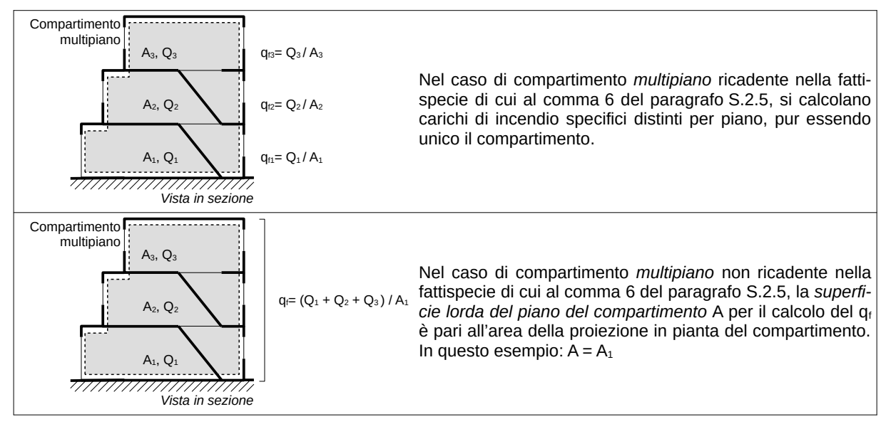

<span id="page-81-1"></span>*Tabella S.2-9: Esempi di calcolo del carico di incendio specifico q\_f per compartimenti multipiano* 

## S.2.9.1 Indicazioni aggiuntive sulla determinazione statistica del carico di incendio

- <span id="page-81-0"></span>1. Per calcolare il valore al frattile 80% del carico di incendio partendo da valori reperiti in letteratura tecnica, da considerare come valori medi, è necessario moltiplicare il valore medio per un coefficiente amplificativo, secondo i seguenti criteri:
 - a. per attività con variabilità molto limitate per quanto riguarda il mobilio o le merci in deposito, come ad esempio abitazioni, alberghi, ospedali, uffici e scuole è possibile scegliere un valore del coefficiente moltiplicativo compreso tra 1,20 e 1,50;
 - b. per attività con variabilità maggiori per quanto riguarda il mobilio o le merci in deposito, come ad esempio centri commerciali, grandi magazzini attività industriali è possibile scegliere un valore del coefficiente moltiplicativo compreso tra 1,20 e 1,75.

All'interno di tali intervalli può essere individuato il valore del coefficiente appropriato alla trattazione del caso in esame.

2. Nell'appendice E della norma UNI EN 1991-1-2 è presente la tabella S.2-10 ove sono riportate le densità di carico di incendio per diverse destinazioni d'uso, sia come valore medio che come frattile 80%.

| Attività | Valore medio [MJ/m²] | Frattile 80% [MJ/m²] |
|-----------------------------|----------------------|----------------------|
| Civili abitazioni | 780 | 948 |
| Ospedali (stanza) | 230 | 280 |
| Alberghi (stanza) | 310 | 377 |
| Biblioteche | 1500 | 1824 |
| Uffici | 420 | 511 |
| Scuole | 285 | 347 |
| Centri commerciali | 600 | 730 |
| Teatri (cinema) | 300 | 365 |
| Trasporti (spazio pubblico) | 100 | 122 |

<span id="page-82-1"></span>Tabella S.2-10: Densità di carico di incendio da UNI EN 1991-1-2

# S.2.9.2 Procedura per il calcolo del contributo al carico di incendio di strutture in legno

- <span id="page-82-0"></span>1. Il contributo degli elementi strutturali di legno può essere determinato attraverso il seguente procedimento:
 - a. si determina la classe del compartimento prescindendo inizialmente dalla presenza degli elementi strutturali lignei; tale classe, ai soli fini della determinazione di cui al successivo punto b, non potrà in ogni caso essere inferiore a 15 minuti;
 - b. si calcola lo spessore di carbonizzazione degli elementi strutturali di legno corrispondente alla classe determinata al punto precedente, adottando come valori di riferimento della velocità di carbonizzazione quelli contenuti nella norma UNI EN 1995-1-2 "Progettazione delle strutture di legno Parte 1–2: Regole generali Progettazione strutturale contro l'incendio" di cui si riporta uno stralcio nella tabella S.2-11.
 - In caso di elementi strutturali di legno dotati di rivestimenti protettivi antincendio si può procedere al calcolo dello spessore di carbonizzazione tenendo conto delle specifiche indicazioni fornite dalla norma UNI EN 1995-1-2.
 - c. si determina definitivamente la classe del compartimento, tenendo anche conto del carico di incendio specifico relativo alle parti di elementi strutturali di legno corrispondenti allo spessore di cui al punto b. che hanno partecipato alla combustione.
- 2. Per tipologie di legnami non espressamente riportate nella tabella S.2-11, ci si potrà regolare per analogia assumendo in ogni caso valori conservativi ai fini della sicurezza antincendio.

| Specie legnosa | Tipologia di legno | Velocità<br>[mm/min] |
|------------------------------|----------------------------------------------------------------------------------|----------------------|
| Legname tenero | Legno laminato incollato con densità caratteristica ≥ 290 kg/m³ | 0,70 |
| (conifere e faggio) | Legno massiccio con densità caratteristica ≥ 290 kg/m³ | 0,80 |
| Legname duro<br>(latifoglie) | Legno duro massiccio o laminato incollato con densità caratteristica ≥ 290 kg/m³ | 0,70 |
| | Legno duro massiccio o laminato incollato con densità caratteristica ≥ 450 kg/m³ | 0,55 |

<span id="page-82-2"></span>*Tabella S.2-11: Velocità di carbonizzazione del legno* 

### **S.2.10 Classificazione di resistenza al fuoco di prodotti ed elementi costruttivi di opere da costruzione**

- <span id="page-83-0"></span>1. I prodotti e gli elementi costruttivi sono classificati in base alle loro caratteristiche di resistenza al fuoco, secondo i simboli e le classi indicate nelle tabelle del presente capitolo, in conformità alle decisioni della Commissione dell'Unione europea 2000/367/CE del 3 maggio 2000, 2003/629/CE del 27 agosto 2003 e 2011/232/UE dell'11 aprile 2011. Ai contenuti di tali decisioni il presente documento aggiunge i richiami ad ulteriori norme.
- <span id="page-83-2"></span>2. Le prestazioni di resistenza al fuoco dei prodotti e degli elementi costruttivi possono essere determinate in base ai risultati di:
 - a. prove,
 - b. calcoli,
 - c. confronti con tabelle.
- <span id="page-83-1"></span>3. Le modalità per la classificazione di prodotti ed elementi costruttivi in base ai risultati di prove di resistenza al fuoco e di tenuta al fumo sono descritte nel paragrafo [S.2.13.](#page-93-0)
- 4. Le modalità per la classificazione di prodotti ed elementi costruttivi in base ai risultati di calcoli sono descritte nel paragrafo [S.2.14.](#page-94-0)
- 5. Le modalità per la classificazione di elementi costruttivi in base a confronti con tabelle sono descritte nel paragrafo [S.2.15](#page-95-0).

#### **S.2.11 Simboli**

<span id="page-84-0"></span>1. La tabella [S.2-12](#page-84-1) riporta l'elenco dei simboli utilizzati per le prestazioni di resistenza al fuoco di elementi costruttivi o strutturali. Per la descrizione dettagliata si rimanda alle pertinenti norme di classificazione della serie EN 13501 ed alle norme richiamate nel paragrafo [S.2.12](#page-85-2).

| Simbolo | Prestazione | Descrizione |
|---------|------------------------------------------------------------------------|-----------------------------------------------------------------------------------------------------------------------------------------------------------------------------------------------------------------------------------------------------------------------------------------------------------------------------------------------------------------------------------------|
| R | Capacità portante | Capacità di un elemento strutturale di portare i carichi presenti in<br>condizioni di incendio normalizzato, per un certo periodo di tempo |
| E | Tenuta | Capacità di un elemento costruttivo o strutturale di impedire il<br>passaggio di fumi e gas caldi per un certo periodo di tempo, in<br>condizioni di incendio normalizzate |
| I | Isolamento | Capacità di un elemento costruttivo o strutturale di impedire il<br>passaggio calore di un incendio normalizzato per un certo periodo<br>di tempo. A seconda dei limiti più o meno severi al trasferimento di<br>calore, il requisito si specializza in I1 o I2. L'assenza di indicazione<br>al pedice sottintende il requisito I2. |
| W | Irraggiamento | Capacità di un elemento costruttivo o strutturale di limitare, per un<br>certo periodo di tempo, l'irraggiamento termico da parte della<br>superficie non esposta in condizioni di incendio normalizzate. |
| M | Azione meccanica | Capacità di un elemento costruttivo o strutturale di resistere<br>all'impatto da parte di altri elementi senza perdere i requisiti di<br>resistenza al fuoco. |
| C | Dispositivo automatico di<br>chiusura | Capacità di chiusura di un varco da parte di un elemento costruttivo<br>in condizioni normalizzate di incendio e di sollecitazione<br>meccanica. |
| S | Tenuta di fumo | Capacità di un elemento di chiusura di limitare o ridurre il<br>passaggio di gas o fumi freddi in condizioni di prova normalizzate. Il<br>requisito si specializza in:<br>●<br>Sa: se la tenuta al passaggio dei gas o fumi è garantita a<br>temperatura ambiente;<br>●<br>Sm (o S200): se la tenuta al passaggio dei gas o fumi è<br>garantita sia a temperatura ambiente che a 200°C. |
| P o PH | Continuità di corrente<br>o capacità di segnalazione | Capacità di funzionamento di un cavo percorso da corrente o da<br>segnale ottico in condizioni di incendio normalizzate |
| G | Resistenza all'incendio della<br>fuliggine | Capacità di condotto di passaggio di fumi di resistere all'incendio di<br>fuliggine in condizioni di incendio normalizzate, garantendo la<br>tenuta al passaggio di gas caldi e l'isolamento termico. |
| K | Capacità di protezione al fuoco | Capacità di rivestimenti a parete o a soffitto di proteggere i materiali<br>o gli elementi costruttivi o strutturali su cui sono installati dalla<br>carbonizzazione, dall'accensione o da altro tipo di<br>danneggiamento, per un certo periodo di tempo in condizioni di<br>incendio normalizzate. |
| D | Durata della stabilità a<br>temperatura costante | Capacità delle barriere al fumo di conservare i requisiti di<br>resistenza al fuoco in condizioni di incendio normalizzate. |
| DH | Durata della stabilità lungo la<br>curva standard tempo<br>temperatura | |
| F | Funzionalità degli evacuatori<br>motorizzati di fumo e calore | Capacità degli evacuatori di fumo motorizzati (F) o naturali (B) di<br>conservare i requisiti di funzionamento in condizioni di incendio |
| B | Funzionalità degli evacuatori<br>naturali di fumo e calore | normalizzate. |

<span id="page-84-1"></span>*Tabella S.2-12: Simboli*

#### **S.2.12 Classi**

- <span id="page-85-2"></span>1. Le norme contenute nelle tabelle di cui al presente capitolo sono indicate genericamente con la classifica EN senza far riferimento allo status vigente (prEN, ENV, EN).
- 2. Alla classificazione REI-M di un prodotto per un dato intervallo di tempo corrisponde automaticamente anche la classificazione REI, RE, R per lo stesso periodo indipendentemente dalla presenza di tale valore nella tabella pertinente.
- 3. Alla classificazione EI-M di un prodotto per un dato intervallo di tempo corrisponde automaticamente anche la classificazione EI e E per lo stesso periodo indipendentemente dalla presenza di tale valore nella tabella pertinente.
- 4. Al requisito I di un prodotto per un dato intervallo di tempo corrisponde automaticamente anche il requisito W per lo stesso periodo indipendentemente dalla presenza di tale valore nella tabella pertinente.
- 5. Ai fini della resistenza al fuoco, gli elementi costruttivi ed i prodotti da costruzione non marcati CE possono essere classificati con qualsiasi classe discreta compresa tra 15 e 360 minuti (15, 20, 30, 45, 60, 90 120, 180, 240, 360). In caso di obbligo di marcatura CE successivo alla classificazione, le classi non ammesse non sono impiegabili.
- 6. La classificazione di resistenza al fuoco di un prodotto per un dato intervallo di tempo è estendibile a tutte le classi inferiori.

<span id="page-85-1"></span>Nota Ad esempio se un elemento strutturale è classificato REI 60-M, esso ricomprende anche le classi REI 45-M, REI 20-M e REI 15-M.

## **S.2.12.1 Elementi portanti privi di funzione di compartimento antincendio**

| Si applica a | Muri, solai, tetti, travi, colonne, balconi, scale, passerelle | | | | | | | | | |
|------------------|------------------------------------------------------------------------------------------------------------------|----|----|----|----|----|-----|-----|-----|-----|
| Norme | EN 13501-2; EN 1365-1,2,3,4,5,6; EN 1992-1.2; EN 1993-1.3; EN 1994-1.2; EN<br>1995-1.2; EN 1996-1.2; EN 1999-1.2 | | | | | | | | | |
| Classificazione: | | | | | | | | | | |
| R | 15 | 20 | 30 | 45 | 60 | 90 | 120 | 180 | 240 | 360 |

*Tabella S.2-13: Muri, solai, tetti, travi, colonne, balconi, scale, passerelle*

## <span id="page-85-0"></span>**S.2.12.2 Elementi portanti con funzione di compartimento antincendio**

| Si applica a | Muri | | | | | | | | | | |
|------------------|--------------------------------------------------------------------------------------------------------|----|----|----|----|----|-----|-----|-----|-----|--|
| Norme | EN 13501-2; EN 1365-1; EN 1992-1.2; EN 1993-1.3; EN 1994-1.2; EN 1995-1.2; EN<br>1996-1.2; EN 1999-1.2 | | | | | | | | | | |
| Classificazione: | | | | | | | | | | | |
| RE | | 20 | 30 | | 60 | 90 | 120 | 180 | 240 | 360 | |
| REI | 15 | 20 | 30 | 45 | 60 | 90 | 120 | 180 | 240 | 360 | |
| REI-M | | | 30 | | 60 | 90 | 120 | 180 | 240 | 360 | |
| REW | | 20 | 30 | | 60 | 90 | 120 | 180 | 240 | 360 | |

*Tabella S.2-14: Muri*

| Si applica a | Solai e tetti | | | | | | | | | |
|------------------|--------------------------------------------------------------------------------------------------------|----|----|----|----|----|-----|-----|-----|-----|
| Norme | EN 13501-2; EN 1365-2; EN 1992-1.2; EN 1993-1.3; EN 1994-1.2; EN 1995-1.2; EN<br>1996-1.2; EN 1999-1.2 | | | | | | | | | |
| Classificazione: | | | | | | | | | | |
| R | | | 30 | | | | | | | |
| RE | | 20 | 30 | | 60 | 90 | 120 | 180 | 240 | 360 |
| REI | 15 | 20 | 30 | 45 | 60 | 90 | 120 | 180 | 240 | 360 |

*Tabella S.2-15: Solai e tetti*

## <span id="page-86-1"></span>**S.2.12.3 Prodotti e sistemi per la protezione di parti o elementi portanti delle opere di costruzione**

| Si applica a | Controsoffitti privi di intrinseca resistenza al fuoco (membrane protettive) | | | | | |
|--------------------------------------------------------------------------------------------|---------------------------------------------------------------------------------------------------------------------------------------|--|--|--|--|--|
| Norme | EN 13501-2; EN 13381-1 | | | | | |
| Classificazione: espressa negli stessi termini previsti per gli elementi portanti protetti | | | | | | |
| Annotazioni | Alla classificazione viene aggiunto il simbolo "sn" se il prodotto è conforme ai requisiti<br>previsti per l'incendio "seminaturale". | | | | | |

*Tabella S.2-16: Controsoffitti privi di intrinseca resistenza al fuoco (membrane protettive)*

| Si applica a | Rivestimenti, pannelli, intonaci, vernici e schermi protettivi dal fuoco |
|--------------|--------------------------------------------------------------------------------------------|
| Norme | EN 13501-2; EN 13381-2,3,4,5,6,7,8 |
| | Classificazione: espressa negli stessi termini previsti per gli elementi portanti protetti |

*Tabella S.2-17: Rivestimenti, pannelli, intonaci, vernici e schermi protettivi dal fuoco*

## <span id="page-86-0"></span>**S.2.12.4 Parti o elementi non portanti di opere di costruzioni e prodotti afferenti**

| Si applica a | | Pareti divisorie<br>(comprese quelle che presentano parti non isolate e barriere tagliafiamma interne) | | | | | | | | | |
|----------------------------------------------------------------------------------|----|------------------------------------------------------------------------------------------------------------|----|----|----|----|-----|-----|-----|--|--|
| Norme | | EN 13501-2; EN 1364-1 [1]; EN 1992-1.2; EN 1993-1.3; EN 1994-1.2; EN 1995-1.2;<br>EN 1996-1.2; EN 1999-1.2 | | | | | | | | | |
| Classificazione: | | | | | | | | | | | |
| E | | 20 | 30 | | 60 | 90 | 120 | | | | |
| EI | 15 | 20 | 30 | 45 | 60 | 90 | 120 | 180 | 240 | | |
| EI-M | | | 30 | | 60 | 90 | 120 | 180 | 240 | | |
| EW | | 20 | 30 | | 60 | 90 | 120 | | | | |
| [1] Per le barriere tagliafiamma interne questa norma è integrata da EOTA TR 031 | | | | | | | | | | | |

*Tabella S.2-18: Pareti divisorie (comprese quelle che presentano parti non isolate e barriere tagliafiamma interne)*

| Si applica a | Controsoffitti dotati di intrinseca resistenza al fuoco | | | | | | | | | |
|------------------|--------------------------------------------------------------------------------------------------------------------------------------------------------------------------------------------------------------------------------|-----------------------|----|----|----|----|-----|-----|-----|--|
| Norme | | EN 13501-2; EN 1364-2 | | | | | | | | |
| Classificazione: | | | | | | | | | | |
| EI | 15 | | 30 | 45 | 60 | 90 | 120 | 180 | 240 | |
| Annotazioni | La classificazione è completata da "(a→b)", "(b←a)", o "(a↔b)", per indicare se<br>l'elemento è stato sottoposto a prova e rispetta i requisiti per l'incendio proveniente<br>dall'alto o dal basso o da ambedue le direzioni. | | | | | | | | | |

*Tabella S.2-19: Controsoffitti dotati di intrinseca resistenza al fuoco*

| Si applica a | Facciate (curtain walls) e muri esterni (che includono parti vetrate) | | | | | | | | | |
|------------------|--------------------------------------------------------------------------------------------------------------------------------------------------------------------------------------------------------------------------------------------------------------------------------------------------------------------------------------------------------------------------------------------------------------------------------------------|----|----|--|----|----|-----|--|--|--|
| Norme | EN 13501-2; EN 1364-3,4,5,6; EN 1992-1.2; EN 1993-1.3; EN 1994-1.2; EN 1995-<br>1.2; EN 1996-1.2; EN 1999-1.2 | | | | | | | | | |
| Classificazione: | | | | | | | | | | |
| E | 15 | | 30 | | 60 | 90 | 120 | | | |
| EI | 15 | | 30 | | 60 | 90 | 120 | | | |
| EI-W | | 20 | 30 | | 60 | | | | | |
| Annotazioni | La classificazione è completata da "(i→o)", "(o→i)", o "(i↔o)", per indicare se<br>l'elemento è stato sottoposto a prova e se rispetta i requisiti sull'incendio proveniente<br>dall'interno o dall'esterno o da ambedue le direzioni.<br>Laddove previsto, la "stabilità meccanica" indica che l'eventuale caduta di parti non è<br>suscettibile di provocare danni agli occupanti nel periodo indicato per la<br>classificazione E o EI. | | | | | | | | | |

## *Tabella S.2-20: Facciate (curtain walls) e muri esterni (che includono parti vetrate)*

| Si applica a | Pavimenti sopraelevati | | | | | | | | | |
|------------------|----------------------------------------------------------------------------------------------------------------------------------------------------------------------------------------------------------------------|----|--|--|--|--|--|--|--|--|
| Norme | EN 13501-2; EN 1366-6 | | | | | | | | | |
| Classificazione: | | | | | | | | | | |
| R | 15 | 30 | | | | | | | | |
| RE | | 30 | | | | | | | | |
| REI | | 30 | | | | | | | | |
| Annotazioni | La classificazione è completata mediante l'aggiunta del suffisso "f" per indicare la<br>resistenza ad un incendio pienamente sviluppato o "r" per indicare solo l'esposizione<br>a una temperatura costante ridotta. | | | | | | | | | |

## *Tabella S.2-21: Pavimenti sopraelevati*

| Si applica a | | Sistemi di sigillatura di fori passanti e di giunti lineari | | | | | | | | |
|------------------|----|-------------------------------------------------------------|----|----|----|----|-----|-----|-----|--|
| Norme | | EN 13501-2; EN 1366-3,4 | | | | | | | | |
| Classificazione: | | | | | | | | | | |
| E | 15 | | 30 | 45 | 60 | 90 | 120 | 180 | 240 | |
| EI | 15 | 20 | 30 | 45 | 60 | 90 | 120 | 180 | 240 | |

## *Tabella S.2-22: Sistemi di sigillatura di fori passanti e di giunti lineari*

| | Porte e chiusure resistenti al fuoco (comprese quelle che includono parti vetrate e | | | | | | | | |
|-----------------------------------------------------------------------------------------------------------------------------------------------------------------------------------------------------------------------------------------------------------------------------------|-------------------------------------------------------------------------------------|----|----|-----------------------|----|----------------------------------------------|-----|-----|--|
| | | | | | | | | | |
| | | | | | | | | | |
| 15 | 20 | 30 | 45 | 60 | 90 | 120 | 180 | 240 | |
| 15 | 20 | 30 | 45 | 60 | 90 | 120 | 180 | 240 | |
| | 20 | 30 | | 60 | | | | | |
| La classificazione I è completata dall'aggiunta del suffisso "1" o "2" per indicare quale<br>definizione di isolamento è utilizzata. L'aggiunta del simbolo "C" indica che il prodotto<br>soddisfa anche il criterio della "chiusura automatica" (prova di tipo "pass/fail") [1]. | | | | | | | | | |
| | | | | EN 13501-2; EN 1634-1 | | accessori), e rispettivi sistemi di chiusura | | | |

*Tabella S.2-23: Porte e chiusure resistenti al fuoco (comprese quelle che includono parti vetrate e accessori), e rispettivi sistemi di chiusura*

| Si applica a | Porte a tenuta di fumo | | | | | | | |
|----------------------------------------------------------------------------------------------------------------------------------------------------------------------------------------------------------------|------------------------|--|--|--|--|--|--|--|
| Norme | EN 13501-2; EN 1634-3 | | | | | | | |
| Classificazione: S200 o Sa a secondo delle condizioni di prova | | | | | | | | |
| Annotazioni<br>L'aggiunta del simbolo "C" indica che il prodotto soddisfa anche il criterio della<br>"chiusura automatica" (prova di tipo "pass/fail") [1] | | | | | | | | |
| [1] La classificazione "C" può essere completata dai numeri da 0 a 5 secondo le categorie di utilizzazione. Dei<br>dettagli dovranno essere inclusi nelle specifiche tecniche dei prodotti cui si riferiscono. | | | | | | | | |

## *Tabella S.2-24: Porte a tenuta di fumo*

| | Chiusure dei passaggi destinati ai nastri trasportatori e ai sistemi di trasporto su rotaia | | | | | | | | |
|---------------------------------------------------------------------------------------------------------------------------------------------------------------------------------------------------------------------------------------------------------------------------------------------------------------------------------------------------------------------------------------------------------------------------------------------------------------------------------------------------|---------------------------------------------------------------------------------------------|----|----|----|----|-----|-----|-----|--|
| | EN 13501-2; EN 1366-7 | | | | | | | | |
| Classificazione: | | | | | | | | | |
| 15 | | 30 | 45 | 60 | 90 | 120 | 180 | 240 | |
| 15 | 20 | 30 | 45 | 60 | 90 | 120 | 180 | 240 | |
| | 20 | 30 | | 60 | | | | | |
| Annotazioni<br>La classificazione I è completata dall'aggiunta del suffisso "1" o "2" per indicare quale<br>definizione di isolamento è utilizzata. Andrà generata una classificazione 1 nel caso in<br>cui l'esemplare di prova è una configurazione di tubazione o di condotta senza<br>valutazione della chiusura per il nastro trasportatore. L'aggiunta del simbolo "C" [1]<br>indica che il prodotto soddisfa anche il criterio della "chiusura automatica" (prova di<br>tipo "pass/fail"). | | | | | | | | | |
| | | | | | | | | | |

*Tabella S.2-25: Chiusure dei passaggi destinati ai nastri trasportatori e ai sistemi di trasporto su rotaia*

| Si applica a | | Canalizzazioni di servizio e cavedi | | | | | | | | |
|------------------|------------------------------------------------------------------------------------------------------------------------------------------------------------------------------------------------------------------------------------------------------------------------------------------------------------------|-------------------------------------|----|----|----|----|-----|-----|-----|--|
| Norme | | EN 13501-2; EN 1366-5 | | | | | | | | |
| Classificazione: | | | | | | | | | | |
| E | 15 | 20 | 30 | 45 | 60 | 90 | 120 | 180 | 240 | |
| EI | 15 | 20 | 30 | 45 | 60 | 90 | 120 | 180 | 240 | |
| Annotazioni | La classificazione è completata da "(i→o)", "(o→i)", o "(i↔o)" per indicare se<br>l'elemento è stato sottoposto a prova e se rispetta i requisiti sull'incendio proveniente<br>dall'interno o dall'esterno o entrambi. Inoltre, i simboli "ve" o "ho" indicano<br>l'adeguatezza all'uso verticale o orizzontale. | | | | | | | | | |

*Tabella S.2-26: Canalizzazioni di servizio e cavedi*

| Si applica a | Camini | | | | | | |
|-------------------------------------------------------------------|--------------------------------------------------|--|--|--|--|--|--|
| Norme | EN 13501-2; EN 13216 | | | | | | |
| Classificazione: G + distanza espressa in mm (ad esempio G<br>50) | | | | | | | |
| Annotazioni | Distanza non richiesta per prodotti da incassare | | | | | | |

*Tabella S.2-27: Camini*

| Si applica a | | Rivestimenti per pareti e soffitti | | | | | | | | |
|------------------|----|-----------------------------------------------------------------------------------------------------------------------------------------------------|----|--|----|--|--|--|--|--|
| Norme | | EN 13501-2; EN 14135 | | | | | | | | |
| Classificazione: | | | | | | | | | | |
| K1 | 10 | | | | | | | | | |
| K2 | 10 | | 30 | | 60 | | | | | |
| Annotazioni | | I suffissi "1" e "2" indicano quali substrati, criteri di comportamento al fuoco e regole di<br>estensione vengano usate in questa classificazione. | | | | | | | | |

*Tabella S.2-28: Rivestimenti per pareti e soffitti*

#### <span id="page-89-1"></span>**S.2.12.5 Prodotti destinati ai sistemi di ventilazione, esclusi i sistemi di estrazione del fumo e del calore**

| Si applica a | Condotte di ventilazione | | | | | | | | | |
|------------------|--------------------------|----|-------------------------------------------------------------------------|----|----|----|-----|-----|-----------------------------------------------------------------------------------------------------------------------------------------------------------------------------------------------------------------------------------------------------------------------------------------------------------------------------------------------------------|--|
| Norme | EN 13501-3; EN 1366-1 | | | | | | | | | |
| Classificazione: | | | | | | | | | | |
| EI | 15 | 20 | 30 | 45 | 60 | 90 | 120 | 180 | 240 | |
| E | | | 30 | | 60 | | | | | |
| Annotazioni | | | prodotto è conforme a una restrizione aggiuntiva relativa alle perdite. | | | | | | La classificazione è completata da "(i→o)", "(o→i)", o "(i↔o)" per indicare se<br>l'elemento è stato sottoposto a prova e se rispetta i requisiti sull'incendio proveniente<br>dall'interno o dall'esterno o entrambi. Inoltre, i simboli "ve" o "ho" indicano<br>l'adeguatezza all'uso verticale o orizzontale. L'aggiunta del simbolo "S" indica che il | |

## *Tabella S.2-29: Condotte di ventilazione*

| Si applica a | Serrande tagliafuoco | | | | | | | | | |
|------------------|----------------------|-----------------------|-------------------------------------------------------------------------|----|----|----|-----|-----|-----------------------------------------------------------------------------------------------------------------------------------------------------------------------------------------------------------------------------------------------------------------------------------------------------------------------------------------------------------|--|
| Norme | | EN 13501-3; EN 1366-2 | | | | | | | | |
| Classificazione: | | | | | | | | | | |
| EI | 15 | 20 | 30 | 45 | 60 | 90 | 120 | 180 | 240 | |
| E | | | 30 | | 60 | 90 | 120 | | | |
| Annotazioni | | | prodotto è conforme a una restrizione aggiuntiva relativa alle perdite. | | | | | | La classificazione è completata da "(i→o)", "(o→i)", o "(i↔o)" per indicare se<br>l'elemento è stato sottoposto a prova e se rispetta i requisiti sull'incendio proveniente<br>dall'interno o dall'esterno o entrambi. Inoltre, i simboli "ve" o "ho" indicano<br>l'adeguatezza all'uso verticale o orizzontale. L'aggiunta del simbolo "S" indica che il | |

*Tabella S.2-30: Serrande tagliafuoco*

#### <span id="page-89-0"></span>**S.2.12.6 Prodotti destinati all'uso nelle installazioni tecniche**

| Si applica a | | Cavi elettrici e in fibre ottiche e accessori; Condotte e sistemi di protezione dal fuoco<br>per cavi elettrici | | | | | | | | | |
|----------------------------------------------------------------------------------------|----|-----------------------------------------------------------------------------------------------------------------|----|--|----|----|-----|--|--|--|--|
| Norme | | EN 13501-3; EN 1366-11 [1] | | | | | | | | | |
| Classificazione: | | | | | | | | | | | |
| P | 15 | | 30 | | 60 | 90 | 120 | | | | |
| [1] Riferimento non richiamato dalle decisioni europee citate nel paragrafo<br>S.2.10. | | | | | | | | | | | |

*Tabella S.2-31: Cavi elettrici e in fibre ottiche e accessori; Condotte e sistemi di protezione dal fuoco per cavi elettrici*

| Si applica a | | Cavi e sistemi di cavi elettrici o per la trasmissione di segnali di diametro ridotto | | | | | | | | |
|-------------------------------------------------------------------------------|----|---------------------------------------------------------------------------------------|--|----|----|-----|--|--|--|--|
| Norme | | EN 13501-3; EN 50200 [1]; EN 50577 [2] | | | | | | | | |
| Classificazione: | | | | | | | | | | |
| PH | 15 | 30 | | 60 | 90 | 120 | | | | |
| P | 15 | 30 | | 60 | 90 | 120 | | | | |
| [1] Per cavi di diametro <<br>20<br>mm e muniti di conduttori <<br>2,5<br>mm2 | | | | | | | | | | |

*Tabella S.2-32: Cavi e sistemi di cavi elettrici o per la trasmissione di segnali di diametro ridotto*

[2] Riferimento non richiamato dalle decisioni europee citate nel paragrafo [S.2.10.](#page-83-0)

#### <span id="page-90-0"></span>**S.2.12.7 Prodotti da utilizzare nei sistemi di controllo del fumo e del calore**

| Si applica a | Condotti di estrazione del fumo per comparto singolo | | | | | | | | | |
|------------------|------------------------------------------------------|-----------------------------------------------------------------------------------------------------------------------------------------------------------------------------------------------------------------------------------------------------------------------------------------------------------------------------------------------------------------------------------------------------------------------------------------------------------------|--|----|----|-------------|-------------------------------------------------|----|--|--|
| Norme | EN 13501-4; EN 1363-1,2,3; EN 1366-9; EN 12101-7 | | | | | | | | | |
| Classificazione: | | | | | | | | | | |
| E300 | | 30 | | 60 | 90 | 120 | | | | |
| E600 | | 30 | | 60 | 90 | 120 | | | | |
| Annotazioni | | La classificazione è completata dal suffisso "singolo" per indicare l'adeguatezza<br>all'uso per un comparto singolo. Inoltre i simboli "Ve" o "ho" indicano l'adeguatezza<br>all'uso in verticale o in orizzontale.<br>"S" indica un tasso di perdite inferiore a<br>classificazione "S" devono presentare un tasso di perdite <<br>"500", "1000", "1500" indicano l'adeguatezza all'uso fino a questi valori di pressione,<br>misurata a condizioni ambiente. | | | 5 | m3<br>/h/m2 | (tutti i condotti privi di<br>10<br>m3<br>/h/m2 | ). | | |

## *Tabella S.2-33: Condotti di estrazione del fumo per comparto singolo*

| Si applica a | | Condotti di estrazione del fumo resistenti al fuoco per comparti multipli | | | | | | | | |
|------------------|--|-------------------------------------------------------------------------------------------------------|----|-----------------------------------------|---------------|------------------------------------------------------------------------------------------------------------------------------------------------------------------------------------------------------------------------------------------------------------------------------------------------|-----|------------------------------------------------|--|--|
| Norme | | EN 13501-4; EN 1363-1,2,3; EN 1366-8; EN 12101-7 | | | | | | | | |
| Classificazione: | | | | | | | | | | |
| EI | | | 30 | | 60 | 90 | 120 | | | |
| Annotazioni | | in verticale o in orizzontale.<br>"S" indica un tasso di perdite <<br>misurata a condizioni ambiente. | | devono presentare un tasso di perdite < | 5 m3<br>/h/m2 | La classificazione è completata dal suffisso "multipli" per indicare l'adeguatezza<br>all'uso per comparti multipli. Inoltre i simboli "Ve" o "ho" indicano l'adeguatezza all'uso<br>10 m3<br>/h/m2<br>"500", "1000", "1500" indicano l'adeguatezza all'uso fino a questi valori di pressione, | ). | (tutti i condotti privi di classificazione "S" | | |

*Tabella S.2-34: Condotti di estrazione del fumo resistenti al fuoco per comparti multipli*

| Si applica a | Serrande per il controllo del fumo di un comparto singolo | | | | | | | | | |
|------------------|-----------------------------------------------------------|------------------------------------------------------------------------------------------------------------------------------------------------------------------------------------------------------------------------------------------------------------------------------------------------------------------------------------------------------------------------------------------------------------------------------------------------------------------------------------------------------------------------------------------------------------------------------------------------------------------------------------------------------------------------------------------------------------------------------------------------------------------------------------------------------------------------------------------------------------------------------------------------------------------------------------------------------------------------------------------------------------------------------------------------------------------------------------------------------------------------------------------------------------------------------------------------------------------------------------------------------------------------------------------------------------------------------------------------------------------------------------------------------------------------------------|----------------|----------------------------------------------|----|-----------------------------------------------------------------------------------------------------------------------------|-------|----------------------------------------------------|--|--|
| Norme | EN 13501-4; EN 1363-1,3; EN 1366-9,10; EN 12101-8 | | | | | | | | | |
| Classificazione: | | | | | | | | | | |
| E300 | | 30 | | 60 | 90 | 120 | | | | |
| E600 | | 30 | | 60 | 90 | 120 | | | | |
| Annotazioni | parete o entrambi.<br>200 m3<br>/h/m2 | La classificazione è completata dal suffisso "singolo" per indicare l'adeguatezza<br>all'uso per un comparto singolo.<br>"HOT 400/30" (High Operational Temperature) indica che la serranda può aprirsi e<br>chiudersi per un periodo di 30 minuti a temperature inferiori a 400°C (da usarsi solo<br>con la classificazione E600).<br>"ved", "vew" "vedw" o "hed", "how" "hodw" indicano rispettivamente che il prodotto può essere<br>usato in senso verticale o orizzontale che può essere montato in un condotto o in una<br>"S" indica un tasso di perdite <<br>"S" devono presentare un tasso di perdite <<br>perdite inferiori a 200 m3<br>e 360 m3<br>misurano a temperatura ambiente e a temperature elevate.<br>"500", "1 000", "1 500" indicano l'adeguatezza all'uso fino a questi valori di pressione,<br>misurata a condizioni ambiente.<br>"AA" o "MA" indicano l'attivazione automatica o l'intervento manuale.<br>"(i→o)", "(o→i)", o "(i↔o)", indicano rispettivamente che il prodotto soddisfa i criteri di<br>prestazione dall'interno all'esterno, dall'esterno all'interno o entrambi.<br>"C300", "C10000" "Cmod" indicano rispettivamente che la serranda può essere utilizzata in<br>sistemi per il solo controllo del fumo, in sistemi combinati per il controllo del fumo e<br>ambientali o che si tratta di serrande modulari da utilizzare in sistemi combinati di<br>controllo del fumo e ambientali. | /h/m2<br>/h/m2 | 200 m3<br>/h/m2<br>adottano il valore 360 m3 | | . Tutte le serrande prive di classificazione<br>360 m3<br>/h/m2<br>adottano questo valore, tutte le valvole con perdite tra | /h/m2 | . Tutte le serrande con<br>. I tassi di perdite si | | |

*Tabella S.2-35: Serrande per il controllo del fumo di un comparto singolo*

| Si applica a | Serrande per il controllo del fumo di comparti multipli | | | | | | | | | |
|------------------|-----------------------------------------------------------------------------------------------------------------------------------------------------------------------------------------------------------------------------------------------------|-------------------------------------------------------|----|--|----|----|-----|--|--|--|
| Norme | | EN 13501-4; EN 1363-1,2,3; EN 1366-2,8,10; EN 12101-8 | | | | | | | | |
| Classificazione: | | | | | | | | | | |
| EI | | | 30 | | 60 | 90 | 120 | | | |
| E | | | 30 | | 60 | 90 | 120 | | | |
| Annotazioni | La classificazione è completata dal suffisso "multipli" per indicare l'adeguatezza<br>all'uso per comparti multipli.<br>Altre annotazioni sono identiche a quelle relative alle serrande per i sistemi di<br>controllo del fumo a comparto singolo. | | | | | | | | | |

## *Tabella S.2-36: Serrande per il controllo del fumo di comparti multipli*

| Si applica a | | Barriere al fumo | | | | | | | | | |
|--------------------|--|-------------------------------------------------------------------|----|--|----|----|-----|--|--|---|--|
| Norme | | EN 13501-4; EN 1363-1,2; EN 12101-1 | | | | | | | | | |
| Classificazione: D | | | | | | | | | | | |
| D600 | | | 30 | | 60 | 90 | 120 | | | A | |
| DH | | | 30 | | 60 | 90 | 120 | | | A | |
| Annotazioni | | "A" può essere qualsiasi periodo di tempo superiore a 120 minuti. | | | | | | | | | |

*Tabella S.2-37: Barriere al fumo*

| Si applica a | Evacuatori motorizzati di fumo e calore (ventilatori), giunti di connessione | | | | | | | | | |
|--------------------|------------------------------------------------------------------------------|----------------------------------------------|----|--|----|----|-----|--|--|--|
| Norme | | EN 13501-4; EN 1363-1, EN 12101-3; ISO 834-1 | | | | | | | | |
| Classificazione: F | | | | | | | | | | |
| F200 | | | | | | | 120 | | | |
| F300 | | | | | 60 | | | | | |
| F400 | | | | | | 90 | 120 | | | |
| F600 | | | | | 60 | | | | | |
| F842 | | | 30 | | | | | | | |

*Tabella S.2-38: Evacuatori motorizzati di fumo e calore (ventilatori), giunti di connessione*

| Si applica a | | Evacuatori naturali di fumo e calore | | | | | | | | |
|--------------------|------------------------------------------------------|--------------------------------------|--|--|----|----|-----|--|--|--|
| Norme | | EN 13501-4; EN 1363-1; EN 12101-2 | | | | | | | | |
| Classificazione: B | | | | | | | | | | |
| B300 | | | | | | | 120 | | | |
| B600 | | | | | 60 | | | | | |
| B400 | | | | | | 90 | 120 | | | |
| Fθ | | | | | 60 | | | | | |
| Annotazioni | θ indica le condizioni di esposizione (temperatura). | | | | | | | | | |

*Tabella S.2-39: Evacuatori naturali di fumo e calore*

#### **S.2.13 Modalità per la classificazione in base ai risultati di prove**

- <span id="page-93-1"></span><span id="page-93-0"></span>1. Le prove di resistenza al fuoco hanno l'obiettivo di valutare il comportamento al fuoco dei prodotti e degli elementi costruttivi, sotto specifiche condizioni di esposizione e attraverso il rispetto di misurabili criteri prestazionali.
- 2. Le condizioni di esposizione, i criteri prestazionali e le procedure di classificazione da utilizzare nell'ambito delle prove di cui al comma [1](#page-93-1), sono indicate nelle parti 2, 3 e 4 della norma EN 13501.
- 3. Le specifiche dei forni sperimentali, delle attrezzature di prova, degli strumenti di misura e di acquisizione, le procedure di campionamento, conservazione, condizionamento, invecchiamento, installazione e prova e le modalità di stesura del rapporto di prova sono indicate nelle norme EN o ENV, nelle loro versioni vigenti all'atto della prova, richiamate dalle parti 2, 3 e 4 della EN 13501.
- 4. Nel caso in cui una parte della EN 13501 oppure una delle norme EN o ENV in essa richiamate non sia ancora oggetto di una pubblicazione UNI, le prove sono effettuate e la classificazione rilasciata secondo le modalità seguenti:
 - a. si segue la norma EN o ENV prevista, se disponibile;
 - b. si segue il progetto di norma europeo (prEN o prENV) previsto, se disponibile e ritenuto sufficiente dal laboratorio di prova in mancanza della possibilità indicata al punto precedente.
- 5. Il rapporto di classificazione è il documento, redatto in conformità ai modelli previsti nella norma EN 13501 da parte del laboratorio di prova, che attesta, sulla base di uno o più rapporti di prova, la classe del prodotto o dell'elemento costruttivo oggetto della prova. In caso di prodotti testati in base alle norme della serie EN 13381 il rapporto di classificazione è sostituito dal rapporto di valutazione.
- 6. Il rapporto di prova deve essere rilasciato per prodotti o elementi costruttivi completamente definiti e referenziati nel complesso e nelle parti componenti. Queste definizioni e referenze, riportate sul rapporto di prova da parte del laboratorio, devono essere fornite dal committente della prova e verificate dal laboratorio.
- 7. I rapporti di prova sono redatti in conformità allo specifico paragrafo previsto dalle norme EN 1363-1, 2 e alle informazioni richieste dalle norme di prova proprie di ciascun prodotto o elemento costruttivo. In particolare il richiedente la prova deve fornire al laboratorio almeno:
 - a. la descrizione dettagliata del campione comprendente disegni ed elenchi identificativi dei componenti comprendenti le denominazioni commerciali e i produttori dei componenti;
 - b. il campione (o i campioni) destinati alla prova e quelli necessari all'identificazione dei componenti;
 - c. eventuali altri campioni o componenti degli stessi ritenuti necessari, a discrezione del laboratorio di prova, alla verifica sperimentale delle prestazioni dichiarate.
- 8. In caso di variazioni del prodotto o dell'elemento costruttivo classificato, non previste dal campo di diretta applicazione del risultato di prova, il produttore è tenuto a predisporre un fascicolo tecnico contenente almeno la seguente documentazione:
 - a. elaborati grafici di dettaglio del prodotto modificato;

- b. relazione tecnica, tesa a dimostrare il mantenimento della classe di resistenza al fuoco, basata su prove, calcoli e altre valutazioni sperimentali o tecniche, anche in conseguenza di migliorie apportate sui componenti e sul prodotto, tutto nel rispetto delle indicazioni e dei limiti contenuti nelle apposite norme EN o prEN sulle applicazioni estese dei risultati di prova laddove esistenti (EXAP);
- c. eventuali altre approvazioni maturate presso uno degli Stati dell'UE oppure uno degli altri Stati contraenti l'accordo SEE e la Turchia;
- d. parere tecnico positivo sulla completezza e correttezza delle ipotesi a supporto e delle valutazioni effettuate per l'estensione del risultato di prova rilasciato da un laboratorio di prova; ai fini del completamento del fascicolo tecnico, il rapporto di classificazione emesso in base ad una norma EXAP è da intendersi quale parere tecnico del laboratorio di prova.
- 9. Il produttore è tenuto a conservare suddetto fascicolo tecnico e a renderlo disponibile per il professionista che se ne avvale per la certificazione, citando gli estremi del fascicolo tecnico. Il fascicolo tecnico è altresì reso disponibile alla DCPST per eventuali controlli.

## **S.2.14 Modalità per la classificazione in base ai risultati di calcoli**

- <span id="page-94-0"></span>1. I metodi di calcolo della resistenza al fuoco hanno l'obiettivo di consentire la progettazione di elementi costruttivi portanti, separanti o non separanti, resistenti al fuoco anche prendendo in considerazione i collegamenti e le mutue interazioni con altri elementi, sotto specifiche condizioni di esposizione al fuoco e attraverso il rispetto di criteri prestazionali e l'adozione di particolari costruttivi.
- 2. Le condizioni di esposizione al fuoco sono definite in specifici regolamenti e basate sugli scenari di incendio di progetto in essi prescritti o su quelli attesi. Nei medesimi regolamenti sono definite le combinazioni di carico da considerare agenti insieme all'azione del fuoco e i coefficienti di sicurezza sui materiali e sui modelli.
- <span id="page-94-1"></span>3. I metodi di calcolo da utilizzare ai fini del presente documento sono quelli contenuti negli Eurocodici di seguito indicati, completi delle appendici contenenti i parametri definiti a livello nazionale (NDPs):
 - a. EN 1991-1-2 "*Azioni sulle strutture Parte 1-2: Azioni generali Azioni sulle strutture esposte al fuoco*";
 - b. EN 1992-1-2 "*Progettazione delle strutture di calcestruzzo Parte 1-2: Regole generali - Progettazione strutturale contro l'incendio*";
 - c. EN 1993-1-2 "*Progettazione delle strutture di acciaio Parte 1-2: Regole generali - Progettazione strutturale contro l'incendio*";
 - d. EN 1994-1-2 "*Progettazione delle strutture miste acciaio calcestruzzo Parte 1-2: Regole generali - Progettazione strutturale contro l'incendio*";
 - e. EN 1995-1-2 "*Progettazione delle strutture di legno Parte 1-2: Regole generali - Progettazione strutturale contro l'incendio*";
 - f. EN 1996-1-2 "*Progettazione delle strutture di muratura Parte 1-2: Regole generali - Progettazione strutturale contro l'incendio*";
 - g. EN 1999-1-2 "*Progettazione delle strutture di alluminio Parte 1-2: Regole generali - Progettazione strutturale contro l'incendio*";
- 4. I metodi di calcolo di cui al comma [3](#page-94-1) possono necessitare della determinazione, al variare delle temperature, dei parametri termofisici dei sistemi protettivi

eventualmente presenti sugli elementi costruttivi portanti. In questi casi i valori che assumono detti parametri vanno determinati esclusivamente attraverso le prove indicate nel paragrafo [S.2.13](#page-93-0). Elaborazioni numeriche dei valori di detti parametri, che esulano dall'ambito delle prove indicate nel paragrafo [S.2.13](#page-93-0) o dalle norme citate nel comma [3](#page-94-1), non sono valide ai fini della verifica della resistenza al fuoco degli elementi costruttivi portanti.

## **S.2.15 Modalità per la classificazione in base a confronti con tabelle**

- <span id="page-95-0"></span>1. Le tabelle seguenti propongono delle condizioni sufficienti per la classificazione di elementi costruttivi resistenti al fuoco. Dette condizioni non costituiscono un obbligo qualora si proceda alla determinazione delle prestazioni di resistenza al fuoco secondo gli altri metodi di cui ai paragrafi [S.2.13](#page-93-0) e [S.2.14](#page-94-0). I valori contenuti nelle tabelle sono il risultato di campagne sperimentali e di elaborazioni numeriche e si riferiscono alle tipologie costruttive e ai materiali di maggior impiego. Detti valori, pur essendo cautelativi, non consentono estrapolazioni o interpolazioni tra gli stessi oppure modifiche delle condizioni di utilizzo.
- 2. L'uso delle tabelle è strettamente limitato alla classificazione di elementi costruttivi per i quali è richiesta la resistenza al fuoco nei confronti della curva temperatura-tempo standard di cui al paragrafo [S.2.7](#page-76-0) comma [1](#page-76-1) e delle altre azioni meccaniche previste in caso di incendio.
- 3. Altre tabelle di natura sperimentale o analitica diverse da quelle sotto esposte non ricadono tra quelle previste al paragrafo [S.2.10,](#page-83-0) comma [2](#page-83-2), lettera [c.](#page-83-1)
- 4. La presenza di elementi di impianti a sviluppo lineare sotto traccia come cavi, condutture, tubazioni e canali in genere, può limitare in modo imprevedibile la resistenza al fuoco della muratura. Per tale motivo, l'impiego di tabelle ai fini della classificazione di murature è consentito alle seguenti condizioni:
 - a. In presenza di elementi di impianti lineari sotto traccia aventi profondità massima di incasso compresa tra 1/5 ed 1/3 dello spessore richiesto di murature non portanti, si deve adottare cautelativamente lo spessore del muro corrispondente alla classe superiore a quella richiesta. Questa disposizione non si applica a murature non portanti di classe 240.
 - b. In presenza di elementi di impianti lineari sotto traccia aventi profondità massima di incasso inferiore a 1/10 dello spessore richiesto di murature portanti, si deve adottare cautelativamente lo spessore del muro corrispondente alla classe superiore a quella richiesta. Questa disposizione non si applica a murature portanti di classe 240.

## **S.2.15.1 Murature non portanti di blocchi**

- <span id="page-96-0"></span>1. La tabella [S.2-40](#page-97-2) riporta i valori minimi espressi in millimetri dello spessore s di murature di blocchi di laterizio (escluso l'intonaco) esposte su un lato, sufficienti a garantire i requisiti EI o EI-M per le classi indicate, con le seguenti limitazioni:
 - a. altezza della parete fra i due solai o distanza fra due elementi di irrigidimento con equivalente funzione di vincolo dei solai ≤ 4 m;
 - b. per i requisiti EI, presenza di 10 mm di intonaco su ambedue le facce oppure 20 mm sulla sola faccia esposta al fuoco;
 - c. per i requisiti EI-M, presenza di 10 mm di intonaco su ambedue le facce.
- 2. La tabella [S.2-41](#page-97-1) riporta i valori minimi espressi in millimetri dello spessore s di murature di blocchi di calcestruzzo normale (escluso l'intonaco) esposte su un lato, sufficienti a garantire i requisiti EI o EI-M per le classi indicate, con le seguenti limitazioni:
 - a. altezza della parete fra i due solai o distanza fra due elementi di irrigidimento con equivalente funzione di vincolo dei solai ≤ 4 m;
 - b. per i requisiti EI, facciavista o con 10 mm di intonaco su ambedue le facce oppure 20 mm sulla sola faccia esposta al fuoco.
 - c. per i requisiti EI-M, presenza di 10 mm di intonaco su ambedue le facce.
- 3. La tabella [S.2-42](#page-97-0) riporta i valori minimi espressi in millimetri dello spessore s di murature di blocchi di calcestruzzo leggero (massa volumica netta ≤ 1700 kg/m<sup>3</sup> ) o aerato autoclavato, esposte su un lato, sufficienti a garantire i requisiti EI per le classi indicate, con la seguente limitazione:
 - a. altezza della parete fra i due solai o distanza fra due elementi di irrigidimento con equivalente funzione di vincolo dei solai ≤ 4 m.
- 4. La tabella [S.2-43](#page-98-1) riporta i valori minimi espressi in millimetri dello spessore s di murature di blocchi di pietra squadrata esposte su un lato, sufficienti a garantire i requisiti EI o EI-M per le classi indicate, con le seguenti limitazioni:
 - a. altezza della parete fra i due solai o distanza fra due elementi di irrigidimento con equivalente funzione di vincolo dei solai ≤ 4 m.
 - b. per i requisiti EI-M, presenza di 10 mm di intonaco su ambedue le facce.

| Classe | Blocco con<br>di foratu | percentuale<br>ra > 55% | Blocco con percentuale<br>di foratura ≤ 55% | | | | | |
|----------|-------------------------|---------------------------------|---------------------------------------------|---------------------------------|--|--|--|--|
| | Intonaco normale | Intonaco protettivo antincendio | Intonaco normale | Intonaco protettivo antincendio | | | | |
| EI 30 | s = 120 | 80 | 100 | 80 | | | | |
| EI 60 | s = 150 | 100 | 120 | 80 | | | | |
| EI 90 | s = 180 | 120 | 150 | 100 | | | | |
| EI 120 | s = 200 | 150 | 180 | 120 | | | | |
| EI 180 | s = 250 | 180 | 200 | 150 | | | | |
| EI 240 | s = 300 | 200 | 250 | 180 | | | | |
| EI 120-M | s = 200 | 200 | 200 | - | | | | |
| EI 180-M | s = 250 | 200 | 200 | - | | | | |
| EI 240-M | s = 300 | 200 | 250 | - | | | | |

Intonaco normale: intonaco tipo sabbia e cemento, sabbia cemento e calce, sabbia calce e gesso e simili caratterizzato da una massa volumica compresa tra 1000 e 1400 kg/m³

Intonaco protettivo antincendio: Intonaco tipo gesso, vermiculite o argilla espansa e cemento o gesso, perlite e gesso e simili caratterizzato da una massa volumica compresa tra $600 \ e \ 1000 \ kg/m^3$ 

<span id="page-97-2"></span>*Tabella S.2-40: Murature non portanti in blocchi di laterizio (Requisiti E, I, M)* 

| | Blocco con fori | Blocco con fori | Blocco con fori mono o multicamera o pieno | | | | | | | |
|-----------------------------------------------------|-----------------|------------------------|--------------------------------------------|---------------------------------|--|--|--|--|--|--|
| Classe | monocamera | multicamera<br>o pieno | Intonaco normale | Intonaco protettivo antincendio | | | | | | |
| EI 30 | s = 120 | 100 [1] | 100 [1] | 80 [1] | | | | | | |
| EI 60 | s = 150 | 120 [1] | 120 [1] | 100 [1] | | | | | | |
| EI 90 | s = 180 | 150 | 150 | 120 [1] | | | | | | |
| EI 120 | s = 240 | 180 | 200 | 150 | | | | | | |
| EI 180 | s = 280 | 240 | 250 | 180 | | | | | | |
| EI 240 | s = 340 | 300 | 300 | 200 | | | | | | |
| EI 120-M | s = 240 | 240 | 200 | 200 | | | | | | |
| EI 180-M | s = 280 | 240 | 250 | 200 | | | | | | |
| EI 240-M | s = 340 | 300 | 300 | 200 | | | | | | |
| [1] Solo blocchi pieni (percentuale foratura < 15%) | | | | | | | | | | |

<span id="page-97-1"></span>Tabella S.2-41: Murature non portanti in blocchi di calcestruzzo normale (Requisiti E, I, M)

| Classe | Blocco con fori monocamera | Blocco con fori multicamera o pieno<br>e calcestruzzo aerato autoclavato | | | | |
|---------------|----------------------------------------|--------------------------------------------------------------------------|--|--|--|--|
| 30 | s = 100 | 80 [1] | | | | |
| 60 | s = 120 | 80 [1] | | | | |
| 90 | s = 150 | 100 [1] | | | | |
| 120 | s = 200 | 150 | | | | |
| 180 | s = 240 | 200 | | | | |
| 240 | s = 300 | 240 | | | | |
| [1] Solo bloc | chi pieni (percentuale foratura < 15%) | | | | | |

<span id="page-97-0"></span>Tabella S.2-42: Murature non portanti in blocchi di calcestruzzo leggero o aerato autoclavato (Requisiti E, I)

| Classe | Blocco pieno di pietra squadrata | | | | | | |
|----------|----------------------------------|--|--|--|--|--|--|
| EI 30 | s = 150 | | | | | | |
| EI 60 | s = 150 | | | | | | |
| EI 90-M | s = 250 | | | | | | |
| EI 120-M | s = 250 | | | | | | |
| EI 180-M | s = 360 | | | | | | |
| EI 240-M | s = 360 | | | | | | |

<span id="page-98-1"></span>*Tabella S.2-43: Murature non portanti in blocchi di pietra squadrata (Requisiti E, I, M)*

## **S.2.15.2 Murature portanti di blocchi**

- <span id="page-98-0"></span>1. La tabella [S.2-44](#page-98-2) riporta i valori minimi espressi in millimetri dello spessore s di murature portanti di blocchi (escluso l'intonaco) esposte su un lato, sufficienti a garantire i requisiti REI o REI-M per le classi indicate, con le seguenti limitazioni:
 - a. rapporto h/s ≤ 20;
 - b. per i requisiti REI:
 - i. h ≤ 8 m, dove h è l'altezza della parete fra due solai o elementi di irrigidimento con equivalente funzione di vincolo dei solai;
 - c. per i requisiti REI-M:
 - i. h ≤ 4 m, dove h è l'altezza della parete fra due solai o elementi di irrigidimento con equivalente funzione di vincolo dei solai;
 - ii. presenza di 10 mm di intonaco su ambedue le facce.

| Materiale | Tipo blocco | REI<br>30 | REI<br>60 | REI<br>90 | REI<br>120 | REI<br>180 | REI<br>240 | REI<br>90-M | REI<br>120-M | REI<br>180-M | REI<br>240-M |
|---------------------------------------|----------------------------------------------------|-----------|-----------|-----------|------------|------------|------------|-------------|--------------|--------------|--------------|
| Laterizio [1] | Pieno<br>(foratura ≤<br>15%) | 120 | 150 | 170 | 200 | 240 | 300 | 200 | 200 | 240 | 300 |
| Laterizio [1] | Semipieno e forato<br>(15% <<br>foratura ≤<br>55%) | 170 | 170 | 200 | 240 | 280 | 330 | 240 | 240 | 280 | 330 |
| Calcestruzzo | Pieno, semipieno e forato<br>(foratura ≤<br>55%) | 170 | 170 | 170 | 200 | 240 | 300 | 200 | 200 | 240 | 300 |
| Calcestruzzo<br>leggero [2] | Pieno, semipieno e forato<br>(foratura ≤<br>55%) | 170 | 170 | 170 | 200 | 240 | 300 | 240 | 240 | 240 | 300 |
| Calcestruzzo<br>aerato<br>autoclavato | Pieno | 170 | 170 | 170 | 200 | 240 | 300 | 240 | 240 | 240 | 300 |
| Pietra<br>squadrata | Pieno<br>(foratura ≤<br>15%) | 170 | 170 | 250 | 280 | 360 | 400 | 250 | 280 | 360 | 400 |

<sup>[1]</sup> presenza di 10 mm di intonaco su ambedue le facce oppure 20 mm sulla sola faccia esposta al fuoco. I valori in tabella si riferiscono agli elementi di laterizio sia normale che alleggerito in pasta. [2] massa volumica netta ≤ 1700 kg/m<sup>3</sup> .

<span id="page-98-2"></span>*Tabella S.2-44: Murature portanti in blocchi (Requisiti R, E, I, M)*

## **S.2.15.3 Solette piene e solai alleggeriti**

- <span id="page-99-0"></span>1. La tabella [S.2-45](#page-99-1) riporta i valori minimi espressi in millimetri dello spessore totale H di solette e solai, della distanza a dall'asse delle armature longitudinali alla superficie esposta sufficienti a garantire il requisito R per le classi indicate.
- 2. Per garantire i requisiti di tenuta e isolamento i solai di cui alla tabella [S.2-45](#page-99-1) devono presentare uno strato pieno di materiale isolante, non combustibile e con conducibilità termica non superiore a quella del calcestruzzo, di cui almeno una parte in calcestruzzo armato. La tabella [S.2-46](#page-99-2) riporta i valori minimi espressi in millimetri dello spessore h dello strato di materiale isolante e della parte d di c.a., sufficienti a garantire i requisiti EI per le classi indicate.
- 3. Gli spessori h e d del precedente comma 2, sono sufficienti a garantire i requisiti EI anche per tipologie di solai diverse da quelle riportate nella tabella [S.2-45.](#page-99-1)

Nota Nel caso di interposizione di uno strato di materiale combustibile (es. strato di materiale per il contenimento energetico o per l'isolamento acustico, …) lo spessore di quest'ultimo non concorre a determinare lo spessore h.

| Classe | | 30 | | 60 | | 90 | | 120 | | 180 | | 240 | |
|--------------------------------------------------------------------------|-----|----|-----|----|-----|----|-----|-----|-----|-----|-----|-----|--|
| | | a | H | a | H | a | H | a | H | a | H | a | |
| Solette piene con armatura<br>monodirezionale o bidirezionale | 80 | 10 | 120 | 20 | 120 | 30 | 160 | 40 | 200 | 55 | 240 | 65 | |
| Solai misti di lamiera di acciaio<br>con riempimento di calcestruzzo [1] | 80 | 10 | 120 | 20 | 120 | 30 | 160 | 40 | 200 | 55 | 240 | 65 | |
| Solai a travetti con alleggerimento [2] | 160 | 15 | 200 | 30 | 240 | 35 | 240 | 45 | 300 | 60 | 300 | 75 | |
| Solai a lastra con alleggerimento [3] | 160 | 15 | 200 | 30 | 240 | 35 | 240 | 45 | 300 | 60 | 300 | 75 | |

I valori di a devono essere non inferiori ai minimi di regolamento per le opere di c.a. e c.a.p. In caso di armatura pre-tesa aumentare i valori di a di 15 mm. In presenza di intonaco i valori di H e a ne devono tenere conto nella seguente maniera:

- 10 mm di intonaco normale (definizione in tabella [S.2-40](#page-97-2)) equivalgono ad 10 mm di calcestruzzo;
- 10 mm di intonaco protettivo antincendio (definizione in tabella [S.2-40](#page-97-2)) equivalgono a 20 mm di calcestruzzo.

Per ricoprimenti di calcestruzzo superiori a 50 mm prevedere una armatura diffusa aggiuntiva che assicuri la stabilità del ricoprimento.

- [1] In caso di lamiera grecata H rappresenta lo spessore medio della soletta. Il valore di a non comprende lo spessore della lamiera. La lamiera ha unicamente funzione di cassero.
- [2] Deve essere sempre presente uno strato di intonaco normale di spessore ≥ 20 mm oppure uno strato di intonaco isolante di spessore ≥ 10 mm.
- [3] In caso di alleggerimento in polistirene o materiali affini prevedere opportuni sfoghi delle sovrappressioni.

<span id="page-99-1"></span>*Tabella S.2-45: Solai (requisito R)*

| Classe | | 30 | | 60 | | 90 | | 120 | | 180 | | 240 | |
|--------------------------------------------|--|----|----|----|-----|----|-----|-----|-----|-----|-----|-----|--|
| | | d | h | d | h | d | h | d | h | d | h | d | |
| Tutte le tipologie della tabella<br>S.2-45 | | 40 | 60 | 40 | 100 | 50 | 100 | 50 | 150 | 60 | 150 | 60 | |

In presenza di intonaco i valori di h e di d ne possono tenere conto nella maniera indicata nella tabella [S.2-45](#page-99-1). In ogni caso d non deve mai essere < 40 mm. In presenza di strati superiori di materiali di finitura incombustibile (es. massetto, malta di allettamento, pavimentazione, …) i valori di h ne possono tener conto.

<span id="page-99-2"></span>*Tabella S.2-46: Solai (requisiti E, I)*

## **S.2.15.4 Travi, pilastri e pareti in calcestruzzo armato ordinario e precompresso**

- <span id="page-100-0"></span>1. La tabella [S.2-47](#page-100-1) riporta i valori minimi espressi in millimetri della larghezza b della sezione, della distanza a dall'asse delle armature longitudinali alla superficie esposta e della larghezza d'anima bw di travi con sezione con bulbo inferiore sufficienti a garantire il requisito R per le classi indicate di travi. Per travi con sezione a larghezza variabile b è la larghezza in corrispondenza della linea media delle armature longitudinali tese.
- 2. La tabella [S.2-48](#page-101-2) riporta i valori minimi espressi in millimetri del lato più piccolo b di pilastri a sezione rettangolare oppure del diametro di pilastri a sezione circolare e della distanza a dall'asse delle armature longitudinali alla superficie esposta sufficienti a garantire il requisito R per le classi indicate di pilastri esposti su uno o più lati che rispettano entrambe le seguenti limitazioni:
 - a. lunghezza effettiva del pilastro (da nodo a nodo) ≤ 6 m (per pilastri di piani intermedi) oppure ≤ 4,5 m (per pilastri dell'ultimo piano o per edifici monopiano);
 - b. area complessiva di armatura A<sup>S</sup> ≤ 0,04 AC area della sezione trasversale del pilastro.
- 3. La tabella [S.2-49](#page-101-1) riporta i valori minimi (mm) dello spessore s e della distanza a dall'asse delle armature longitudinali alla superficie esposta sufficienti a garantire i requisiti REI o REI-M per le classi indicate di pareti portanti esposte su uno o due lati che rispettano le limitazione: altezza effettiva della parete (da nodo a nodo) ≤ 6 m (per pareti di piani intermedi) oppure ≤ 4,5 m (per pareti dell'ultimo piano o per edifici monopiano).
- 4. La tabella [S.2-50](#page-101-0) riporta i valori minimi (mm) dello spessore s sufficiente a garantire i requisiti EI o EI-M per le classi indicate di pareti non portanti esposte su un lato che rispettano entrambe le seguenti limitazioni:
 - a. altezza effettiva della parete (da nodo a nodo) ≤ 6 m (per pareti di piani intermedi) oppure ≤ 4,5 m (per pareti dell'ultimo piano o per edifici monopiano);
 - b. rapporto tra altezza di libera inflessione e spessore < 40.

| Classe | Combinazioni possibili di b e a | | | | |
|--------|---------------------------------|-----------------|-----------------|-----------------|-----|
| 30 | b = 80; a = 25 | b = 120; a = 20 | b = 160; a = 15 | b = 200; a = 15 | 80 |
| 60 | b = 120; a = 40 | b = 160; a = 35 | b = 200; a = 30 | b = 300; a = 25 | 100 |
| 90 | b = 150; a = 55 | b = 200; a = 45 | b = 300; a = 40 | b = 400; a = 35 | 100 |
| 120 | b = 200; a = 65 | b = 240; a = 60 | b = 300; a = 55 | b = 500; a = 50 | 120 |
| 180 | b = 240; a = 80 | b = 300; a = 70 | b = 400; a = 65 | b = 600; a = 60 | 140 |
| 240 | b = 280; a = 90 | b = 350; a = 80 | b = 500; a = 75 | b = 700; a = 70 | 160 |

I valori di a devono essere non inferiori ai minimi di regolamento per le opere di c.a. e c.a.p. In caso di armatura pre-tesa aumentare i valori di a di 15 mm. In presenza di intonaco i valori di b ed a ne possono tenere conto nella maniera indicata nella tabella [S.2-45](#page-99-1). Per ricoprimenti di calcestruzzo superiori a 50 mm prevedere una armatura diffusa aggiuntiva che assicuri la stabilità del ricoprimento.

<span id="page-100-1"></span>*Tabella S.2-47: Travi in cemento armato (requisito R)*

| Classe | Esposto su più lati | Esposto su un lato | |
|--------|---------------------|--------------------|-----------------|
| 30 | B = 200; a = 30 | B = 300; a = 25 | B = 160; a = 25 |
| 60 | B = 250; a = 45 | B = 350; a = 40 | B = 160; a = 25 |
| 90 | B = 350; a = 50 | B = 450; a = 40 | B = 160; a = 25 |
| 120 | B = 350; a = 60 | B = 450; a = 50 | B = 180; a = 35 |
| 180 | B = 450; a = 70 | - | B = 230; a = 55 |
| 240 | - | - | B = 300; a = 70 |

I valori di a devono essere non inferiori ai minimi di regolamento per le opere di c.a. e c.a.p. In caso di armatura pre-tesa aumentare i valori di a di 15 mm. In presenza di intonaco i valori di a ne possono tenere conto nella maniera indicata nella tabella [S.2-45](#page-99-1). Per ricoprimenti di calcestruzzo superiori a 50 mm prevedere una armatura diffusa aggiuntiva che assicuri la stabilità del ricoprimento.

<span id="page-101-2"></span>*Tabella S.2-48: Pilastri in cemento armato (requisito R)*

| Classe | Esposto su un lato | Esposto su due lati |
|-----------|--------------------|---------------------|
| REI 30 | s = 120; a = 10 | s = 120; a = 10 |
| REI 60 | s = 130; a = 10 | s = 140; a = 10 |
| REI 90-M | s = 140; a = 25 | s = 170; a = 25 |
| REI 120-M | s = 160; a = 35 | s = 220; a = 35 |
| REI 180-M | s = 210; a = 50 | s = 270; a = 55 |
| REI 240-M | s = 270; a = 60 | s = 350; a = 60 |

I valori di a devono essere non inferiori ai minimi di regolamento per le opere di c.a. e c.a.p. In caso di armatura pre-tesa aumentare i valori di a di 15 mm. In presenza di intonaco i valori di a ne possono tenere conto nella maniera indicata nella tabella [S.2-45](#page-99-1). Per ricoprimenti di calcestruzzo superiori a 50 mm prevedere una armatura diffusa aggiuntiva che assicuri la stabilità del ricoprimento.

<span id="page-101-1"></span>*Tabella S.2-49: Pareti portanti in cemento armato (requisiti R, E, I, M)*

| Classe | Esposto su un lato |
|----------|--------------------|
| EI 30 | s = 60 |
| EI 60 | s = 80 |
| EI 90 | s = 100 |
| EI 120-M | s = 120 |
| EI 180-M | s = 150 |
| EI 240-M | s = 175 |

<span id="page-101-0"></span>*Tabella S.2-50: Pareti non portanti in cemento armato (requisiti E, I, M)*

#### **S.2.16 Riferimenti**

- <span id="page-102-0"></span>1. Si indicano i seguenti riferimenti:
 - a. Commissione europea, Direzione generale per le Imprese e l'industria, Joint Research Center, *"Construction - Harmonised European Standards"*, documentazione da [
 - b. Commissione europea, Direzione generale per le Imprese e l'industria, *"Construction - Harmonised European Standards"*, documentazione da [

## **STRATEGIA ANTINCENDIO Capitolo S.3 Compartimentazione**

#### <span id="page-104-0"></span>[Premessa](#page-105-2)

#### [Livelli di prestazione](#page-105-1)

#### [Criteri di attribuzione dei livelli di prestazione](#page-105-0)

#### [Soluzioni progettuali](#page-106-3)

[Soluzioni conformi per il livello di prestazione II](#page-106-0) [Soluzioni conformi per il livello di prestazione III](#page-106-2) [Soluzioni alternative](#page-106-1)

#### [Caratteristiche generali](#page-108-3)

[Spazio scoperto](#page-108-2) [Compartimento](#page-108-1) [Compartimento a prova di fumo](#page-108-0) [Filtro](#page-109-1) [Filtro a prova di fumo](#page-109-0) [Superfici vulnerabili di chiusura esterna del compartimento](#page-110-1) [Segnaletica](#page-110-0)

#### [Progettazione dei compartimenti antincendio](#page-112-1)

[Regole generali](#page-112-0)

[Compartimenti multipiano](#page-113-0)

#### [Realizzazione dei compartimenti antincendio](#page-114-2)

[Determinazione della classe di resistenza al fuoco](#page-114-1) [Selezione delle prestazioni degli elementi](#page-114-0) [Continuità dei compartimenti](#page-115-0)

#### [Distanza di separazione per limitare la propagazione dell'incendio](#page-116-2)

[Ubicazione](#page-116-1)

#### [Comunicazioni tra attività](#page-116-0)

## [Metodi per la determinazione della distanza di separazione](#page-117-1)

[Generalità](#page-117-0)

[Procedura per la determinazione tabellare della distanza di separazione](#page-119-0) [Procedura per la determinazione analitica della distanza di separazione](#page-120-0)

[Riferimenti](#page-123-0)

#### **S.3.1 Premessa**

- <span id="page-105-2"></span>1. La finalità della *compartimentazione* è di limitare la propagazione dell'incendio e dei suoi effetti:
 - a. verso altre attività, afferenti ad altro *responsabile dell'attività* o di diversa *tipologia;*
 - b. all'interno della stessa attività.
- 2. La compartimentazione è realizzata mediante:
 - a. compartimenti antincendio, ubicati all'interno della stessa opera da costruzione;
 - b. interposizione di distanze di separazione, tra opere da costruzione o altri bersagli combustibili, anche ubicati in spazio a cielo libero.

## **S.3.2 Livelli di prestazione**

<span id="page-105-1"></span>1. La tabella [S.3-1](#page-105-4) riporta i livelli di prestazione attribuibili alle *opere da costruzione* per la presente misura antincendio.

| Livello di<br>prestazione | Descrizione |
|---------------------------|--------------------------------------------------------------------------------------------------------------------------------------------------------------------------------------------------------------------------|
| I | Nessun requisito |
| II | È contrastata per un periodo congruo con la durata dell'incendio:<br>●<br>la propagazione dell'incendio verso altre attività;<br>●<br>la propagazione dell'incendio all'interno della stessa attività. |
| III | È contrastata per un periodo congruo con la durata dell'incendio:<br>●<br>la propagazione dell'incendio verso altre attività;<br>●<br>la propagazione dell'incendio e dei fumi freddi all'interno della stessa attività. |

<span id="page-105-4"></span>*Tabella S.3-1: Livelli di prestazione*

#### **S.3.3 Criteri di attribuzione dei livelli di prestazione**

<span id="page-105-0"></span>1. La tabella [S.3-2](#page-105-3) riporta i criteri *generalmente accettati* per l'attribuzione dei singoli livelli di prestazione.

| Livello di<br>prestazione | Criteri di attribuzione |
|---------------------------|---------------------------------------------------------------------------------------------------------------------------------------------------------------------------------------------------------------------------------------------------------------------------------------------------------------------------------------------------------------------------------------------------------------------------------------------------------------------------------------------------------------------------------------------------------------------------------------------------------------------------------|
| I | Non ammesso nelle attività soggette |
| II | Attività non ricomprese negli altri criteri di attribuzione |
| III | In relazione alle risultanze della valutazione del rischio nell'ambito e in ambiti limitrofi della<br>stessa attività (es. attività con elevato affollamento, attività con geometria complessa o piani<br>interrati, elevato carico di incendio specifico qf, presenza di sostanze o miscele pericolose in<br>quantità significative, presenza di lavorazioni pericolose ai fini dell'incendio, …).<br>Si può applicare in particolare ove sono presenti compartimenti con profilo di rischio Rvita com<br>preso in D1, D2, Cii2, Cii3, Ciii2, Ciii3, per proteggere gli occupanti che dormono o che ricevo<br>no cure mediche. |

<span id="page-105-3"></span>*Tabella S.3-2: Criteri di attribuzione dei livelli di prestazione*

<span id="page-106-3"></span>Nota Il livello di prestazione I della presente misura antincendio non richiede l'applicazione di soluzioni progettuali.

## **S.3.4.1 Soluzioni conformi per il livello di prestazione II**

- <span id="page-106-0"></span>1. Al fine di limitare la propagazione dell'incendio *verso altre attività* deve essere impiegata almeno una delle seguenti soluzioni conformi:
 - a. inserire le diverse attività in compartimenti antincendio distinti, come descritto nei paragrafi [S.3.5](#page-108-3) ed [S.3.6](#page-112-1), con le caratteristiche di cui al paragrafo [S.3.7;](#page-114-2)
 - b. interporre distanze di separazione su spazio a cielo libero tra le diverse attività, come descritto nel paragrafo [S.3.8](#page-116-2).
- 2. Al fine di limitare la propagazione dell'incendio *all'interno della stessa attività* deve essere impiegata almeno una delle seguenti soluzioni conformi:
 - a. suddividere la volumetria dell'opera da costruzione contenente l'attività, in compartimenti antincendio, come descritto nei paragrafi [S.3.5](#page-108-3) ed [S.3.6](#page-112-1), con le caratteristiche di cui al paragrafo [S.3.7](#page-114-2);
 - b. interporre distanze di separazione su spazio a cielo libero tra ambiti della stessa attività, come descritto nel paragrafo [S.3.8.](#page-116-2)
- 3. L'*ubicazione* delle diverse attività nella stessa opera da costruzione deve essere stabilita secondo i criteri di cui al paragrafo [S.3.9](#page-116-1).
- 4. Sono ammesse *comunicazioni* tra le diverse attività presenti nella stessa opera da costruzione, realizzate con le limitazioni e le modalità descritte al paragrafo [S.3.10](#page-116-0).

## **S.3.4.2 Soluzioni conformi per il livello di prestazione III**

<span id="page-106-2"></span>1. Si applicano le soluzioni conformi per il livello di prestazione II, impiegando elementi a tenuta di fumo (Sa) per la realizzazione dei compartimenti antincendio.

#### **S.3.4.3 Soluzioni alternative**

- <span id="page-106-1"></span>1. Sono ammesse *soluzioni alternative* per tutti i livelli di prestazione.
- 2. Al fine di dimostrare il raggiungimento del *livello di prestazione*, il progettista deve impiegare uno dei metodi del paragrafo [G.2.7.](#page-45-0)
- 3. In tabella [S.3-3](#page-107-0) sono riportate alcune modalità *generalmente accettate* per la progettazione di soluzioni alternative. Il progettista può comunque impiegare modalità diverse da quelle elencate.

| Oggetto della soluzione | Modalità progettuale |
|----------------------------------------------------------------------------------------------------------------------------------------------------------------------------|-----------------------------------------------------------------------------------------------------------------------------------------------------------------------------------------------------------------------------------------------------------------------------------------------------------------------------------------------------------------------------------------------------------------------------------------------------------------------------------------------------------------------------------------------------------------------------------|
| Caratteristiche dello spazio<br>scoperto (§<br>S.3.5.1), del<br>compartimento, del filtro<br>(§<br>S.3.5.4), dell'ubicazione<br>(§<br>S.3.9) | Si dimostri, anche con modelli analitici, che non avviene propagazione<br>dell'incendio e dei suoi effetti nella configurazione considerata. |
| Compartimento a prova di fumo<br>(§<br>S.3.5.3), filtro a prova di fumo<br>(§<br>S.3.5.5), compartimentazione<br>multipiano (§<br>S.3.6.2),<br>comunicazioni (§<br>S.3.10) | Si dimostri che è comunque garantita la salvaguardia della vita degli occu<br>panti (capitolo<br>M.3) e, se applicabile, la protezione dei beni. |
| Distanza di separazione (§<br>S.3.8)<br>e suo calcolo (§<br>S.3.11) | Si dimostri che è limitata la propagazione dell'incendio e dei suoi effetti. Può<br>essere applicata la stessa procedura analitica del paragrafo<br>S.3.11.3, impie<br>gando ad esempio il valore di Esoglia adeguato al bersaglio effettivamente<br>esposto all'incendio, il fattore di vista F2-1 e la piastra radiante corrispondente<br>alla reale configurazione geometrica, la potenza termica radiante<br>E1 riferita<br>all'incendio naturale. Possono essere anche impiegati modelli numerici di si<br>mulazione dell'incendio, dei suoi effluenti e dell'irraggiamento. |

<span id="page-107-0"></span>*Tabella S.3-3: Modalità progettuali per soluzioni alternative*

#### S.3.5 Caratteristiche generali

#### S.3.5.1 Spazio scoperto

<span id="page-108-3"></span><span id="page-108-2"></span>Nota Lo *spazio scoperto* limita la propagazione dell'incendio e dei suoi effetti. Lo spazio scoperto non è un compartimento antincendio.

- <span id="page-108-4"></span>1. Lo *spazio scoperto* è uno spazio a cielo libero o superiormente grigliato, anche delimitato su tutti i lati, avente:
 - a. superficie lorda minima libera in pianta, espressa in m², non inferiore a quella calcolata moltiplicando per 3 l'altezza in metri della parete più bassa che lo delimita:
 - b. distanza fra le strutture verticali che delimitano lo spazio scoperto $\geq$ 3,50 m.
- 2. Se lo spazio scoperto è superiormente grigliato, il rapporto tra la *superficie utile* e la *superficie lorda* totale della griglia deve essere ≥ 75%.
- 3. Se le pareti delimitanti lo spazio a cielo libero o grigliato hanno strutture che aggettano o rientrano, detto spazio è considerato *scoperto* se sono rispettate le condizioni del comma 1 e se il rapporto fra la sporgenza (o rientranza) e la relativa altezza di impostazione è $\leq 1/2$ .
- 4. La superficie lorda minima libera in pianta dello *spazio scoperto* deve risultare al netto delle superfici aggettanti.
- 5. La minima distanza di 3,50 m deve essere computata fra le pareti più vicine in caso di rientranze, fra parete e limite esterno della proiezione dell'aggetto in caso di sporgenza, fra i limiti esterni delle proiezioni di aggetti prospicienti.

#### S.3.5.2 Compartimento

<span id="page-108-1"></span>Nota La funzione del *compartimento* è di limitare la progressione dell'incendio all'interno delle opere da costruzione, relegandone gli effetti a spazi circoscritti per un lasso temporale prestabilito.

1. Le caratteristiche generali del *compartimento antincendio* sono definite nel capitolo capitolo G.1.

#### S.3.5.3 Compartimento a prova di fumo

<span id="page-108-0"></span>Nota Nel *compartimento a prova di fumo* è impedito l'ingresso di effluenti dell'incendio da compartimenti comunicanti.

- 1. Per essere considerato a *prova di fumo* in caso di incendio che si sviluppi in compartimenti comunicanti, il *compartimento antincendio* deve essere realizzato in modo da garantire una delle seguenti misure antincendio aggiuntive verso i compartimenti comunicanti dai quali si intende garantire la protezione dall'ingresso di fumo:
 - a. il compartimento è dotato di un *sistema di pressione differenziale* progettato, installato e gestito secondo la norma UNI EN 12101-6;
 - b. i compartimenti comunicanti da cui si intende garantire la protezione dall'ingresso di fumo sono dotati di SEFC che mantengono i fumi al di sopra dei varchi di comunicazione (capitolo S.8);
 - c. il compartimento è dotato di SEFC, i compartimenti comunicanti da cui si intende garantire la protezione dall'ingresso di fumo sono dotati di SEFC (capitolo S.8);

- d. il compartimento è separato con *spazio scoperto* dai compartimenti comunicanti da cui si intende garantire la protezione dall'ingresso di fumo;
- e. il compartimento è separato con *filtro a prova di fumo* (paragrafo S.3.5.5) dai compartimenti comunicanti da cui si intende garantire la protezione dall'ingresso di fumo;
- f. il compartimento è separato con altri *compartimenti a prova di fumo* dai compartimenti comunicanti da cui si intende garantire la protezione dall'ingresso di fumo.

Nota Nella tabella S.3-5 sono riportati alcune applicazioni. Esempi di compartimento a prova di fumo sono: scala a prova di fumo, vano ascensore a prova di fumo, ...

#### **S.3.5.4** Filtro

<span id="page-109-1"></span>Nota Nel *filtro* si ritiene improbabile l'innesco di un incendio ed è limitato l'ingresso di effluenti dell'incendio da compartimenti comunicanti. Nel filtro è generalmente ammessa la presenza di reception, portinerie, sale d'attesa, limitate apparecchiature elettriche, impianti tecnologici e di servizio ausiliari al funzionamento dell'attività, ...

- 1. Il *filtro* è un *compartimento antincendio* dotato di tutte le seguenti ulteriori caratteristiche:
 - a. avente classe di resistenza al fuoco $\geq$ 30 minuti;
 - b. munito di due o più chiusure dei varchi almeno E 30-Sa;
 - c. avente carico di incendio specifico $q_f \le 50 \text{ MJ/m}^2$ ;
 - d. non vi si detengono o trattano sostanze o miscele pericolose;
 - e. non vi si effettuano lavorazioni pericolose ai fini dell'incendio.

## S.3.5.5 Filtro a prova di fumo

<span id="page-109-0"></span>Nota Per definizione, il *filtro a prova di fumo* è un *filtro* (paragrafo S.3.5.4), avente anche i requisiti di *compartimento antincendio a prova di fumo* (paragrafo S.3.5.3). Pertanto nel *filtro a prova di fumo* si ritiene improbabile l'innesco di un incendio ed è impedito l'ingresso di effluenti dell'incendio. Sono accettate anche le modalità realizzative tradizionali di cui al comma 1, perché si ritiene consentano il rapido smaltimento degli effluenti che eventualmente vi entrassero.

- 1. Se monopiano e di ridotta superficie lorda, è ammesso realizzare il *filtro a pro-va di fumo* come *filtro* (paragrafo S.3.5.4), dotato di una delle seguenti ulteriori caratteristiche:
 - a. mantenuto in sovrappressione, ad almeno 30 Pa in condizioni di emergenza, da specifico sistema progettato, realizzato e gestito secondo la regola dell'arte;

Nota La norma UNI EN 12101-6 riporta un metodo generalmente accettato per progettare il sistema di sovrappressione del filtro a prova di fumo.

- b. dotato di camino per lo smaltimento dei fumi d'incendio e di ripresa d'aria dall'esterno, *adeguatamente progettati* e di sezione ≥ 0,10 m²;
- c. areato direttamente verso l'esterno con aperture di superficie utile complessiva $\geq 1$ m². Tali aperture devono essere permanentemente aperte o dotate di chiusure apribili in modo automatico in caso di incendio. È escluso l'impiego di condotti.
- 2. Per i varchi del *filtro a prova di fumo* è ammesso l'impiego di chiusure E 30.

#### S.3.5.6 Superfici vulnerabili di chiusura esterna del compartimento

<span id="page-110-1"></span>1. L'adozione di particolari tipi di superfici di chiusura verso l'esterno (es. facciate continue, facciate ventilate, coperture, ...) non deve costituire pregiudizio per l'efficacia della compartimentazione di piano o di qualsiasi altra compartimentazione orizzontale e verticale presente all'interno dell'edificio.

#### S.3.5.7 Segnaletica

<span id="page-110-0"></span>1. Le porte tagliafuoco devono essere contrassegnate su entrambi i lati con segnale UNI EN ISO 7010-F007, riportante il messaggio "Porta tagliafuoco tenere chiusa" oppure "Porta tagliafuoco a chiusura automatica" se munite di fermo elettromagnetico in apertura (tabella S.3-4).

<span id="page-110-2"></span>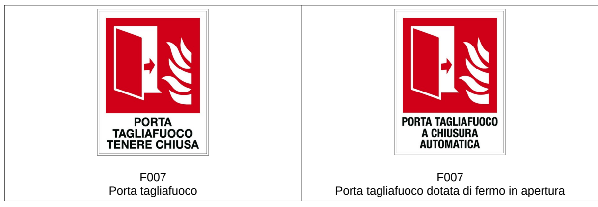

Tabella S.3-4: Esempi di segnali UNI EN ISO 7010-F007

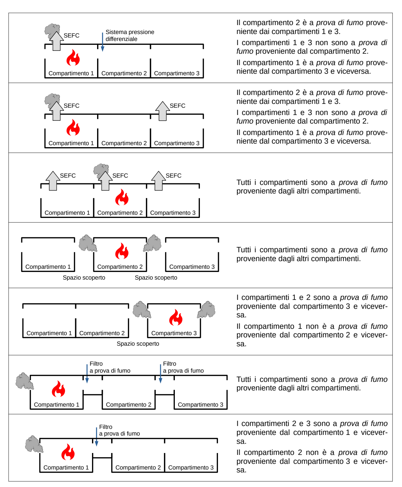

<span id="page-111-0"></span>*Tabella S.3-5: Esempi di compartimenti a prova di fumo: viste in pianta e descrizione*

#### **S.3.6 Progettazione dei compartimenti antincendio**

## **S.3.6.1 Regole generali**

- <span id="page-112-1"></span><span id="page-112-0"></span>1. Devono essere inseriti in compartimenti distinti:
 - a. *ciascun piano* interrato e fuori terra di attività multipiano;
 - b. aree dell'attività con *diverso* profilo di rischio;
 - c. *altre attività* ospitate nella medesima opera da costruzione.
- 2. È ammessa la presenza di *compartimenti multipiano* alle condizioni indicate al paragrafo [S.3.6.2.](#page-113-0)
- 3. La superficie lorda dei compartimenti non deve superare i valori massimi previsti in tabella [S.3-6](#page-112-2).

| Rvita | Quota del compartimento | | | | | | | | |
|-------------|-------------------------|------------|-----------|-----------|-----------|-----------|-----------|-----------|-----------|
| | < -15<br>m | < -10<br>m | < -5<br>m | < -1<br>m | ≤ 12<br>m | ≤ 24<br>m | ≤ 32<br>m | ≤ 54<br>m | > 54<br>m |
| A1 | 2000 | 4000 | 8000 | 16000 | [1] | 32000 | 16000 | 8000 | 4000 |
| A2 | 1000 | 2000 | 4000 | 8000 | 64000 | 16000 | 8000 | 4000 | 2000 |
| A3 | [na] | 1000 | 2000 | 4000 | 32000 | 4000 | 2000 | 1000 | [na] |
| A4 | [na] | [na] | [na] | [na] | 16000 | [na] | [na] | [na] | [na] |
| B1 | [na] | 2000 | 8000 | 16000 | 64000 | 16000 | 8000 | 4000 | 2000 |
| B2 | [na] | 1000 | 4000 | 8000 | 32000 | 8000 | 4000 | 2000 | 1000 |
| B3 | [na] | [na] | 1000 | 2000 | 16000 | 4000 | 2000 | 1000 | [na] |
| Cii1, Ciii1 | [na] | [na] | [na] | 2000 | 16000 | 8000 | 8000 | 8000 | 4000 |
| Cii2, Ciii2 | [na] | [na] | [na] | 1000 | 8000 | 4000 | 4000 | 2000 | 2000 |
| Cii3, Ciii3 | [na] | [na] | [na] | [na] | 4000 | 2000 | 2000 | 1000 | 1000 |
| D1 | [na] | [na] | [na] | 1000 | 2000 | 2000 | 1000 | 1000 | 1000 |
| D2 | [na] | [na] | [na] | 1000 | 2000 | 1000 | 1000 | 1000 | [na] |
| E1 | 2000 | 4000 | 8000 | 16000 | [1] | 32000 | 16000 | 8000 | 4000 |
| E2 | 1000 | 2000 | 4000 | 8000 | [1] | 16000 | 8000 | 4000 | 2000 |
| E3 | [na] | [na] | 2000 | 4000 | 16000 | 4000 | 2000 | [na] | [na] |

La massima superficie lorda è ridotta del 50%. per i compartimenti con Rambiente significativo.

<span id="page-112-2"></span>*Tabella S.3-6: Massima superficie lorda dei compartimenti in m<sup>2</sup>*

<sup>[</sup>na] Non ammesso

<sup>[1]</sup> Senza limitazione

#### S.3.6.2 Compartimenti multipiano

- <span id="page-113-0"></span>1. È ammessa la presenza di *compartimenti multipiano* alle condizioni della tabella S.3-7, in funzione del profilo di rischio $R_{\text{vita}}$ dei compartimenti e delle caratteristiche geometriche dell'opera da costruzione.
- 2. Deve essere comunque rispettata la massima superficie lorda di compartimento di cui alla tabella S.3-6 ed i vincoli dettati dalle altre misure antincendio (es. esodo, capitolo S.4).

| R <sub>vita</sub> | Compartimenti multipiano | Prescrizioni antincendio aggiuntive | | |
|----------------------------------------------------------------|-----------------------------------------------------------------------------------------------------------------------------|-------------------------------------|--|--|
| A1, A2, A3,<br>B1, B2, B3, E1, E2,<br>Cii1, Cii2, Ciii1, Ciii2 | I piani a quota > -1 m e ≤ 6 m possono essere inseriti in uno o<br>più compartimenti multipiano | Nessuna | | |
| A1, A2 | | Nessuna | | |
| A3, B1, B2,<br>Cii1, Cii2, Ciii1, Ciii2 | I piani a quota > -5 m e ≤ 12 m possono essere inseriti in uno<br>o più compartimenti multipiano (Esempio in tabella S.3-8) | [1], [2] | | |
| В3 | | [3] | | |
| A1, A2 | I piani a quota > 12 m e ≤ 32 m possono essere inseriti in uno | [3] | | |
| B1, B2 | o più compartimenti multipiano, con massimo dislivello tra i<br>piani inseriti ≤ 7 m (Esempio in tabella S.3-8) | [3], [4] | | |

- [1] Rivelazione ed allarme di livello di prestazione III (capitolo S.7)
- [2] Se q<sub>f</sub> < 600 MJ/m<sup>2</sup>, controllo dell'incendio di livello di prestazione III, altrimenti IV (capitolo S.6)
- [3] Rivelazione ed allarme di livello di prestazione IV (capitolo S.7)
- [4] Controllo dell'incendio di livello di prestazione IV (capitolo S.6).

<span id="page-113-2"></span>Tabella S.3-7: Condizioni per la realizzazione di compartimenti multipiano

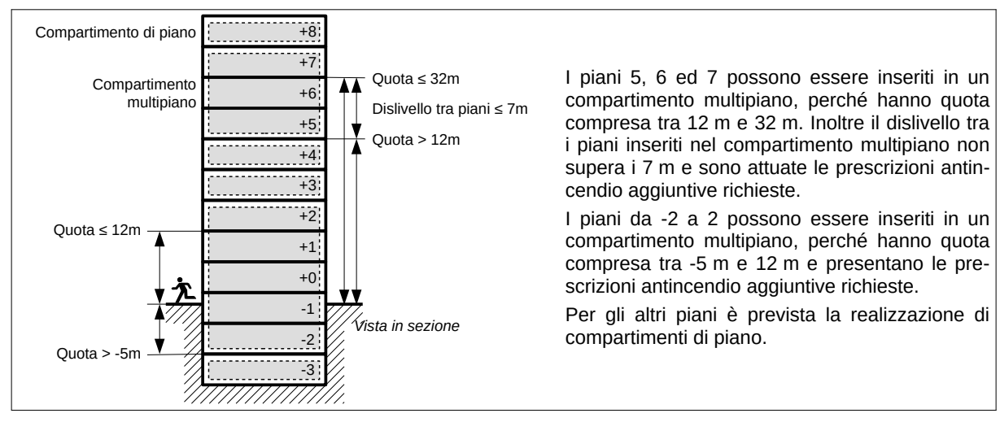

<span id="page-113-1"></span>Tabella S.3-8: Esempi di compartimenti multipiano

#### S.3.7 Realizzazione dei compartimenti antincendio

#### S.3.7.1 Determinazione della classe di resistenza al fuoco

<span id="page-114-2"></span><span id="page-114-1"></span>1. La classe di resistenza al fuoco minima di ogni compartimento è determinata secondo quanto previsto nel capitolo S.2.

Nel caso in cui il carico di incendio specifico di progetto $q_{\rm f,d}$ non imponga una classe minima di resistenza al fuoco, non è richiesto il compartimento, a meno che non sia altrimenti espressamente prescritta una classe minima di resistenza al fuoco.

Nota Ad esempio, per il *filtro* o per la *scala d'esodo protetta* è prescritta la classe minima di resistenza al fuoco pari a 30.

2. In caso di compartimenti adiacenti afferenti a diversi *responsabili di attività*, gli elementi di separazione tra tali compartimenti devono avere caratteristiche di resistenza al fuoco non inferiori a EI 60.

Nota L'obiettivo è di proteggere l'attività dai *terzi confinanti* mediante elementi di separazione dotati di un livello minimo di resistenza al fuoco.

## S.3.7.2 Selezione delle prestazioni degli elementi

- <span id="page-114-0"></span>1. Le prestazioni degli elementi di compartimentazione sono selezionate secondo i criteri di impiego riportati alla tabella S.3-9.
- 2. Tutte le chiusure dei varchi di comunicazione tra compartimenti devono possedere analoga classe di resistenza al fuoco ed essere munite di *dispositivo di autochiusura* (es. porte) o essere mantenute permanentemente chiuse (es. sportelli di cavedi impiantistici).
- 3. Tutte le chiusure dei varchi tra compartimenti e vie di esodo di una stessa attività dovrebbero essere almeno a tenuta (E) ed a tenuta di fumi freddi (S<sub>a</sub>). Non è normalmente richiesto il requisito di isolamento (I) e di irraggiamento (W).
- 4. Le porte tagliafuoco installate lungo le principali vie di passaggio degli occupanti dovrebbero essere preferibilmente munite di *fermo elettromagnetico in apertura*, asservito ad IRAI.

| Simbolo | Prestazione | Criterio di impiego |
|---------|-------------------|---------------------------------------------------------------------------------------------------------------------------------------------------------------------------------|
| R | Capacità portante | Per prodotti ed elementi costruttivi portanti |
| Е | Tenuta | Contenimento di fumi caldi, gas caldi e fiamme |
| I | Isolamento | Limitare la possibilità di propagazione dell'incendio per contatto tra materiale combustibile e faccia dell'elemento di compartimentazione non esposta all'incendio. |
| W | Irraggiamento | Limitare la possibilità di propagazione dell'incendio per irraggiamento dalla faccia dell'elemento di compartimentazione non esposta all'incendio verso materiale combustibile. |
| М | Azione meccanica | Limitare la possibilità di perdita di compartimentazione per effetto di azioni meccaniche accidentali. |
| S | Tenuta di fumo | Contenimento di fumi e gas freddi |

<span id="page-114-3"></span>Tabella S.3-9: Criteri di scelta delle principali prestazioni degli elementi di compartimentazione

#### **S.3.7.3 Continuità dei compartimenti**

- <span id="page-115-0"></span>1. Le chiusure d'ambito orizzontali e verticali dei compartimenti devono formare una barriera continua ed uniforme contro la propagazione degli effetti dell'incendio, ad esempio nel caso di:
 - a. *giunzioni* tra gli elementi di compartimentazione,
 - b. attraversamento degli impianti tecnologici o di processo con l'adozione di sistemi sigillanti resistenti al fuoco quando gli effetti dell'incendio possono attaccare l'integrità e la forma dell'impianto (es. tubazioni di PVC con collare, sacchetti penetranti nelle canaline portacavi, …) oppure con l'adozione di isolanti non combustibili su un tratto di tubazione oltre l'elemento di separazione quando gli effetti dell'incendio possono causare solo il riscaldamento dell'impianto (es. tubazioni metalliche rivestite, sul lato non esposto all'incendio dell'elemento di compartimentazione, con idonei materiali isolanti);
 - c. canalizzazioni aerauliche, per mezzo dell'installazione di serrande tagliafuoco o impiegando canalizzazioni resistenti al fuoco per l'attraversamento dei compartimenti;
 - d. camini di esaustione o di estrazione fumi impiegando canalizzazioni resistenti al fuoco per l'attraversamento dei compartimenti;
 - e. facciate continue;
 - f. ascensori o altri condotti verticali (es. cavedi per impianti, …).

#### S.3.8 Distanza di separazione per limitare la propagazione dell'incendio

<span id="page-116-2"></span>1. L'interposizione della *distanza di separazione* d in spazio a cielo libero tra ambiti della stessa attività o verso altre attività consente di limitare la propagazione dell'incendio.

Nota Ad esempio, ove non sia interposta idonea distanza di separazione su spazio a cielo libero o compartimentazione, edifici distinti sono assimilabili a porzioni dello stesso compartimento.

- 2. Ai fini della definizione di una *soluzione conforme* per la presente misura antincendio, il progettista impiega la *procedura tabellare* indicata al paragrafo S.3.11.2 oppure la *procedura analitica* del paragrafo S.3.11.3, imponendo ad un valore pari a 12,6 kW/m² la soglia $E_{soglia}$ di irraggiamento termico incidente sul *bersaglio* prodotto dall'incendio della *sorgente* considerata.
 - Tale soglia è considerata adeguatamente conservativa per limitare l'innesco di qualsiasi tipologia di materiale, in quanto rappresenta il valore limite convenzionale entro il quale non avviene innesco del *legno* in aria stazionaria.
- 3. Il progettista è tenuto a verificare almeno le seguenti tipologie di *sorgenti* e *ber-sagli*:
 - a. opere da costruzione,
 - b. depositi di materiali combustibili, anche ubicati in spazio a cielo libero.
- 4. Qualora il carico d'incendio q<sub>f</sub> nei compartimenti o dei depositi di materiali combustibili dell'attività sia < 600 MJ/m², si considera *soluzione conforme* anche l'interposizione di *spazio scoperto* tra sorgente e bersaglio.

#### S.3.9 Ubicazione

<span id="page-116-1"></span>1. È *generalmente* ammessa la coesistenza di più attività nella stessa opera da costruzione, anche afferenti a diversi *responsabili* o di tipologia diversa.

#### S.3.10 Comunicazioni tra attività

<span id="page-116-0"></span>1. Ove sia dimostrata necessità *funzionale*, sono *generalmente* ammesse comunicazioni tra le diverse attività inserite nella medesima opera da costruzione, anche afferenti a diversi *responsabili*.

Nota Se la comunicazione tra attività è impiegata anche per l'esodo, si consideri quanto previsto al paragrafo S.4.5.13.

2. In presenza di comunicazioni tra attività afferenti a *responsabili* diversi, i compartimenti con profilo di rischio R<sub>vita</sub> in D1, D2 devono comunque essere *a prova di fumo* proveniente dalle altre attività.

#### S.3.11 Metodi per la determinazione della distanza di separazione

#### S.3.11.1 Generalità

- <span id="page-117-1"></span><span id="page-117-0"></span>1. Nel presente paragrafo si illustrano i metodi per determinare la *distanza di se- parazione* d in spazio a cielo libero tra *sorgente* e *bersaglio*, che consente di limitare ad una soglia prefissata $E_{\text{soglia}}$ l'irraggiamento termico incidente sul *bersaglio*, prodotto dall'incendio della *sorgente* considerata.
- 2. Si definiscono *elementi radianti* le aperture ed i rivestimenti della facciata della sorgente tramite i quali viene emesso verso l'esterno il flusso di energia radiante dell'incendio (es. finestre, porte-finestre, rivestimenti di facciata combustibili, pannellature metalliche, vetrate, aperture in genere, ...).
- 3. Il *piano radiante* è una delle superfici convenzionali della sorgente. Il progettista individua, per ciascuna opera da costruzione, uno o più piani radianti rispetto ai quali determinare le distanze di separazione.
- 4. Per determinare ciascun piano radiante, si approssimano le chiusure d'ambito dell'opera da costruzione sorgente con piani verticali tangenti e non intersecanti la costruzione stessa come mostrato nell'illustrazione S.3-1. A tal fine possono essere omessi gli elementi aggettanti incombustibili (es. sbalzi aperti, balconi, sporti di gronda, ...). Eventuali arretramenti della facciata possono essere considerati a livello della facciata stessa.
- 5. Come mostrato nell'illustrazione S.3-2, sul piano radiante si proiettano ortogonalmente dalla sorgente:
 - a. la geometria degli elementi radianti;
 - b. i confini di compartimentazione (es. solai resistenti al fuoco, pareti resistenti al fuoco, $\dots$ ).
- 6. È definita *piastra radiante* ciascuna porzione del *piano radiante* impiegata per il calcolo semplificato dell'irraggiamento termico dalla sorgente a bersaglio. Per ciascun piano radiante sono individuate dal progettista una o più piastre radianti.

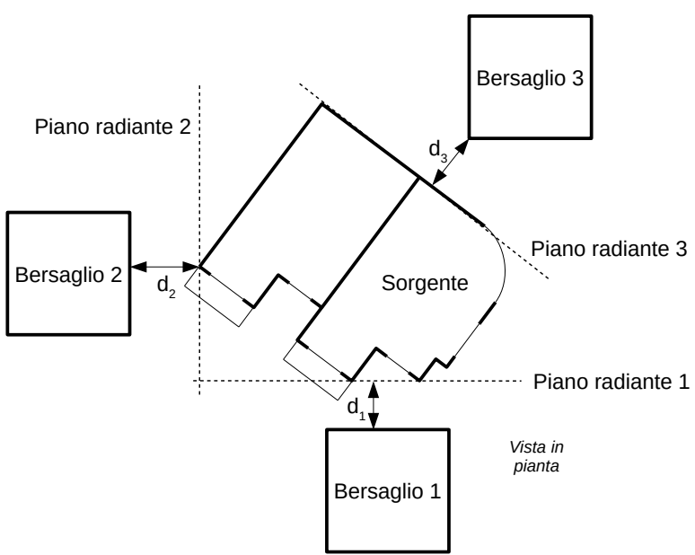

<span id="page-117-2"></span>Illustrazione S.3-1: Determinazione del piano radiante, vista in pianta delle costruzioni

7. Per determinare le piastre radianti, in ogni porzione di piano radiante delimitata dalle proiezioni dei confini di compartimentazione, si esegue l'inviluppo delle proiezioni degli elementi radianti prima definiti per mezzo di rettangoli di base Bi ed altezza Hi, come mostrato nell'illustrazione [S.3-2](#page-118-0) ed [S.3-3](#page-119-1). Tali rettangoli così ottenuti rappresentano le *piastre radianti* relative al *piano radiante* in esame.

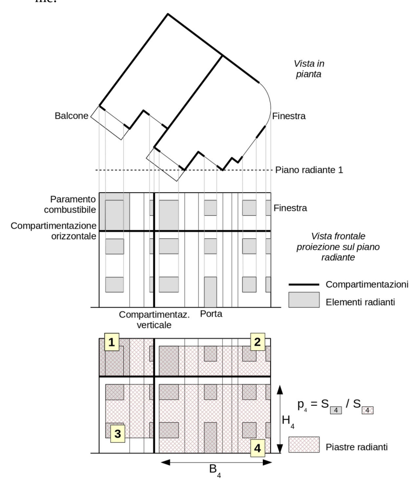

*Illustrazione S.3-2: Determinazione delle piastre radianti, vista in pianta e frontale*

<span id="page-118-0"></span>8. Per ciascuna *piastra radiante* si esegue il calcolo della *percentuale di foratura* pi, come mostrato nell'illustrazione [S.3-3](#page-119-1), il cui valore non può comunque risultare < 0,2:

$$p_i = S_{rad,i} / S_{pr,i}$$
 S.3-1

con:

p<sup>i</sup> percentuale di foratura;

Srad,i superficie complessiva delle proiezioni degli *elementi radianti* comprese nella i-esima *piastra radiante;*

Spr,i superficie complessiva della i-esima piastra radiante.

9. Qualora la sorgente non abbia pareti laterali (es. tettoia, deposito di materiale combustibile all'aperto, ...) la percentuale di foratura p<sub>i</sub> è assunta pari ad 1.

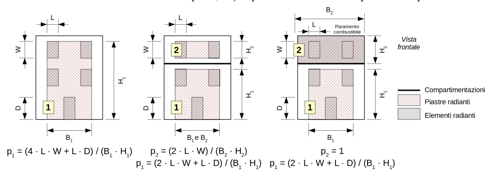

<span id="page-119-1"></span>Illustrazione S.3-3: Esempio percentuale di foratura della i-esima piastra radiante, vista frontale

# S.3.11.2 Procedura per la determinazione tabellare della distanza di separazione

- <span id="page-119-0"></span>1. La presente *procedura tabellare* consente di determinare la distanza di separazione che limita ad un valore $E_{soglia}$ pari a 12,6 kW/m² l'irraggiamento termico incidente sul *bersaglio*, prodotto dall'incendio della *sorgente* considerata.
- 2. Il progettista determina gli *elementi radianti*, il *piano radiante* di riferimento per la distanza oggetto di analisi, le relative *piastre radianti* come descritto al paragrafo S.3.11.1.
- 3. Per l'i-esima piastra radiante, la distanza di separazione $d_i$ è calcolata con la seguente relazione:

$$d_i = \alpha_i p_i + \beta_i$$
 S.3-2

con:

d<sub>i</sub> distanza di separazione

- p<sub>i</sub> percentuale di foratura per l'i-esima piastra radiante
- $\alpha_i$ , $\beta_i$ coefficienti ricavati alternativamente dalle tabelle S.3-10 o S.3-11 in relazione al carico di incendio specifico $q_f$ nella porzione d'edificio retrostante l'i-esima piastra radiante ed alle dimensioni della piastra radiante $B_i$ ed $H_i$ .
- 4. Qualora il compartimento retrostante l'i-esima piastra radiante sia dotato di misure di controllo dell'incendio di livello di prestazione IV (capitolo S.6), la relativa distanza di separazione $d_i$ può essere dimezzata.
- 5. Ai fini della procedura tabellare, la *distanza di separazione* d in spazio a cielo libero tra sorgente e bersaglio è assunta pari al massimo dei valori delle distanze d<sub>i</sub> ottenute per tutte le *piastre radianti* relative al *piano radiante* in esame.

[m]

## S.3.11.3 Procedura per la determinazione analitica della distanza di separazione

- <span id="page-120-0"></span>1. La presente *procedura analitica* consente di determinare la distanza di separazione che limita ad un qualsiasi valore E<sub>soglia</sub> l'irraggiamento termico incidente sul *bersaglio*, prodotto dall'incendio della *sorgente* considerata.
- 2. Il progettista determina gli *elementi radianti*, il *piano radiante* di riferimento per la distanza oggetto di analisi, le relative *piastre radianti* come descritto al paragrafo S.3.11.1.
- 3. La distanza d<sub>i</sub> misurata tra l'i-esima piastra radiante ed il bersaglio garantisce adeguata *separazione* se è verificata la seguente relazione:

$$F_{2-1} \cdot E_1 \cdot \varepsilon_f < E_{soglia}$$
 S.3-3

con:

F<sub>2-1</sub> fattore di vista

E<sub>1</sub> potenza termica radiante dovuta all'incendio convenzionale [kW/m²]

ε<sub>f</sub> emissività della fiamma

E<sub>soglia</sub> soglia di irraggiamento dell'incendio sul bersaglio [kW/m<sup>2</sup>]

4. Il *fattore di vista* F<sub>2-1</sub> relativo a piastra radiante rettangolare e bersaglio posizionato sull'asse di simmetria normale alla piastra è calcolato secondo la seguente relazione:

$$F_{2-1} = 2/\pi \left( \frac{X}{\sqrt{1+X^2}} \arctan \frac{Y}{\sqrt{1+X^2}} + \frac{Y}{\sqrt{1+Y^2}} \arctan \frac{X}{\sqrt{1+Y^2}} \right)$$
 S.3-4

Supponendo che gli *elementi radianti* siano distribuiti verticalmente al centro della piastra radiante, si calcola:

$$X = \frac{B_i \cdot p_i}{2d_i}, Y = \frac{H_i}{2d_i}$$
 S.3-5

con:

B<sub>i</sub> larghezza i-esima piastra radiante [m]

H<sub>i</sub> altezza i-esima piastra radiante [m]

p<sub>i</sub> percentuale di foratura dell'i-esima piastra radiante

d<sub>i</sub> distanza tra l'i-esima piastra radiante ed il bersaglio [m]

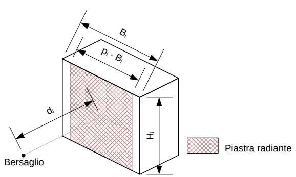

Illustrazione S.3-4: Schematizzazione della piastra radiante

5. La potenza termica radiante dell'incendio convenzionale E1 è imposta come segue in funzione del carico di incendio specifico qf del compartimento retrostante l'i-esima piastra radiante:

se qf > 1200 MJ/m<sup>2</sup> :

$$E_1 = \sigma \cdot T^4 = 5.67 \cdot 10^{-8} \cdot (1000 + 273.16)^4 = 149 \text{ kW/m}^2$$
 S.3-6

se qf ≤ 1200 MJ/m<sup>2</sup> :

$$E_1 = \sigma \cdot T^4 = 5,67 \cdot 10^{-8} \cdot (800 + 273,16)^4 = 75 \text{ kW/m}^2$$
 S.3-7

6. L'emissività della fiamma εf è ricavata dalla seguente relazione:

$$\varepsilon_{\mathbf{f}} = 1 - \mathrm{e}^{-0.3 \cdot \mathrm{d}_{\mathbf{f}}}$$
 S.3-8

con:

d<sup>f</sup> spessore della fiamma, pari a 2/3 dell'altezza del varco da cui esce la fiamma [m]

Nota Si specifica che per ricavare i valori delle tabelle [S.3-10](#page-122-1) e [S.3-11](#page-122-0) riferite alla *procedura tabellare* si è posto df pari a 2 m.

- 7. Qualora il compartimento retrostante l'i-esima piastra radiante sia dotato di misure di controllo dell'incendio di livello di prestazione IV (capitolo [S.6](#page-182-0)), la relativa distanza di separazione di può essere dimezzata.
- 8. Ai fini della presente procedura analitica, la *distanza di separazione* d in spazio a cielo libero tra sorgente e bersaglio è assunta pari al massimo dei valori delle distanze di ottenute per tutte le *piastre radianti* relative al *piano radiante* in esame.

Nota La distanza di separazione calcolata con metodo analitico può differire da quella ottenuta con il metodo tabellare di cui al paragrafo [S.3.11.2](#page-119-0), a causa delle approssimazioni introdotte nelle tabelle [S.3-10](#page-122-1) e [S.3-11.](#page-122-0)

| | | Hi [m] | | | | | | | | | | | | | | | | | | |
|-----------|-----|--------|-----|-----|------|------|------|------|------|------|------|------|------|------|------|------|------|------|------|------|
| Bi<br>[m] | 3 | | 6 | | 9 | | 12 | | 15 | | 18 | | 21 | | 24 | | 27 | | 30 | |
| | α | β | α | β | α | β | α | β | α | β | α | β | α | β | α | β | α | β | α | β |
| 3 | 2,5 | 1,0 | 4,0 | 0,9 | 5,0 | 0,7 | 5,7 | 0,6 | 6,2 | 0,5 | 6,5 | 0,4 | 6,8 | 0,4 | 7,0 | 0,3 | 7,1 | 0,3 | 7,2 | 0,3 |
| 6 | 3,2 | 1,6 | 5,2 | 1,8 | 6,8 | 1,7 | 8,1 | 1,5 | 9,2 | 1,4 | 10,1 | 1,2 | 10,9 | 1,1 | 11,5 | 1,0 | 12,0 | 0,9 | 12,5 | 0,8 |
| 9 | 3,5 | 2,1 | 6,0 | 2,5 | 8,0 | 2,6 | 9,6 | 2,5 | 11,0 | 2,4 | 12,3 | 2,2 | 13,4 | 2,1 | 14,4 | 1,9 | 15,3 | 1,7 | 16,0 | 1,6 |
| 12 | 3,7 | 2,6 | 6,6 | 3,1 | 8,8 | 3,3 | 10,7 | 3,3 | 12,4 | 3,3 | 13,9 | 3,2 | 15,2 | 3,0 | 16,5 | 2,9 | 17,6 | 2,7 | 18,6 | 2,6 |
| 15 | 3,7 | 2,9 | 7,0 | 3,6 | 9,5 | 3,9 | 11,6 | 4,1 | 13,4 | 4,1 | 15,1 | 4,1 | 16,6 | 4,0 | 18,1 | 3,9 | 19,4 | 3,7 | 20,6 | 3,6 |
| 18 | 3,7 | 3,3 | 7,3 | 4,1 | 10,0 | 4,5 | 12,3 | 4,8 | 14,3 | 4,9 | 16,1 | 4,9 | 17,8 | 4,9 | 19,4 | 4,8 | 20,9 | 4,7 | 22,3 | 4,5 |
| 21 | 3,6 | 3,6 | 7,5 | 4,5 | 10,4 | 5,0 | 12,9 | 5,4 | 15,1 | 5,6 | 17,0 | 5,7 | 18,9 | 5,7 | 20,6 | 5,7 | 22,2 | 5,6 | 23,7 | 5,5 |
| 24 | 3,5 | 3,9 | 7,6 | 4,9 | 10,7 | 5,5 | 13,4 | 6,0 | 15,7 | 6,2 | 17,8 | 6,4 | 19,8 | 6,5 | 21,6 | 6,5 | 23,3 | 6,5 | 24,9 | 6,4 |
| 27 | 3,3 | 4,1 | 7,6 | 5,3 | 11,0 | 6,0 | 13,8 | 6,5 | 16,3 | 6,8 | 18,5 | 7,0 | 20,6 | 7,2 | 22,5 | 7,3 | 24,3 | 7,3 | 26,0 | 7,2 |
| 30 | 3,2 | 4,4 | 7,7 | 5,6 | 11,2 | 6,4 | 14,2 | 7,0 | 16,8 | 7,4 | 19,1 | 7,7 | 21,3 | 7,9 | 23,3 | 8,0 | 25,2 | 8,0 | 27,0 | 8,1 |
| 40 | 2,6 | 5,1 | 7,5 | 6,7 | 11,6 | 7,8 | 15,0 | 8,5 | 18,0 | 9,1 | 20,8 | 9,5 | 23,3 | 9,9 | 25,6 | 10,2 | 27,8 | 10,4 | 29,8 | 10,5 |
| 50 | 2,2 | 5,6 | 7,0 | 7,7 | 11,5 | 8,9 | 15,4 | 9,9 | 18,8 | 10,6 | 21,9 | 11,2 | 24,7 | 11,7 | 27,3 | 12,1 | 29,7 | 12,4 | 32,0 | 12,7 |
| 60 | 1,8 | 6,1 | 6,5 | 8,5 | 11,3 | 10,0 | 15,5 | 11,1 | 19,3 | 12,0 | 22,6 | 12,7 | 25,7 | 13,3 | 28,6 | 13,8 | 31,2 | 14,2 | 33,8 | 14,6 |

Per valori di Bi e Hi intermedi a quelli riportati in tabella si approssima al valore immediatamente successivo. In alternativa può essere impiegata iterativamente la procedura analitica di cui al paragrafo [S.3.11.3](#page-120-0).

<span id="page-122-1"></span>*Tabella S.3-10: Coefficienti α e β per attività con carico di incendio specifico q<sup>f</sup> > 1200 MJ/m<sup>2</sup>*

| | | H [m] | | | | | | | | | | | | | | | | | | |
|----------|-----|-------|-----|-----|-----|-----|-----|-----|------|-----|------|-----|------|-----|------|-----|------|-----|------|-----|
| B<br>[m] | 3 | | 6 | | 9 | | 12 | | 15 | | 18 | | 21 | | 24 | | 27 | | 30 | |
| | α | β | α | β | α | β | α | β | α | β | α | β | α | β | α | β | α | β | α | β |
| 3 | 1,7 | 0,5 | 2,6 | 0,3 | 3,1 | 0,2 | 3,3 | 0,2 | 3,4 | 0,2 | 3,5 | 0,2 | 3,5 | 0,1 | 3,6 | 0,1 | 3,6 | 0,1 | 3,6 | 0,1 |
| 6 | 2,0 | 1,0 | 3,5 | 0,8 | 4,6 | 0,7 | 5,3 | 0,5 | 5,9 | 0,4 | 6,2 | 0,3 | 6,5 | 0,3 | 6,7 | 0,3 | 6,8 | 0,2 | 7,0 | 0,2 |
| 9 | 1,9 | 1,4 | 3,9 | 1,3 | 5,4 | 1,2 | 6,5 | 1,0 | 7,4 | 0,8 | 8,1 | 0,7 | 8,6 | 0,6 | 9,0 | 0,5 | 9,4 | 0,5 | 9,7 | 0,4 |
| 12 | 1,8 | 1,7 | 4,1 | 1,8 | 5,8 | 1,7 | 7,2 | 1,5 | 8,4 | 1,3 | 9,3 | 1,2 | 10,1 | 1,0 | 10,8 | 0,9 | 11,4 | 0,8 | 11,8 | 0,7 |
| 15 | 1,6 | 2,0 | 4,1 | 2,2 | 6,0 | 2,2 | 7,7 | 2,0 | 9,0 | 1,9 | 10,2 | 1,7 | 11,2 | 1,5 | 12,1 | 1,4 | 12,9 | 1,2 | 13,5 | 1,1 |
| 18 | 1,4 | 2,2 | 4,0 | 2,6 | 6,1 | 2,6 | 8,0 | 2,5 | 9,5 | 2,4 | 10,9 | 2,2 | 12,1 | 2,0 | 13,1 | 1,9 | 14,0 | 1,7 | 14,9 | 1,6 |
| 21 | 1,3 | 2,4 | 3,9 | 2,9 | 6,2 | 3,1 | 8,1 | 3,0 | 9,9 | 2,9 | 11,4 | 2,7 | 12,7 | 2,6 | 13,9 | 2,4 | 15,0 | 2,2 | 16,0 | 2,1 |
| 24 | 1,1 | 2,6 | 3,7 | 3,2 | 6,1 | 3,5 | 8,2 | 3,5 | 10,1 | 3,4 | 11,7 | 3,3 | 13,2 | 3,1 | 14,6 | 2,9 | 15,8 | 2,7 | 16,9 | 2,6 |
| 27 | 1,0 | 2,7 | 3,5 | 3,5 | 6,0 | 3,8 | 8,3 | 3,9 | 10,2 | 3,9 | 12,0 | 3,8 | 13,6 | 3,6 | 15,1 | 3,4 | 16,4 | 3,3 | 17,6 | 3,1 |
| 30 | 0,9 | 2,9 | 3,4 | 3,8 | 5,9 | 4,2 | 8,2 | 4,3 | 10,3 | 4,3 | 12,2 | 4,2 | 13,9 | 4,1 | 15,5 | 4,0 | 16,9 | 3,8 | 18,2 | 3,6 |
| 40 | 0,6 | 3,2 | 2,8 | 4,5 | 5,4 | 5,2 | 7,9 | 5,5 | 10,3 | 5,7 | 12,5 | 5,7 | 14,5 | 5,7 | 16,3 | 5,6 | 18,0 | 5,5 | 19,6 | 5,3 |
| 50 | 0,4 | 3,4 | 2,3 | 5,1 | 4,8 | 6,0 | 7,4 | 6,6 | 10,0 | 6,9 | 12,3 | 7,0 | 14,6 | 7,1 | 16,6 | 7,1 | 18,6 | 7,1 | 20,4 | 7,0 |
| 60 | 0,2 | 3,5 | 1,9 | 5,6 | 4,3 | 6,7 | 6,9 | 7,5 | 9,5 | 7,9 | 12,0 | 8,2 | 14,4 | 8,4 | 16,6 | 8,5 | 18,8 | 8,5 | 20,8 | 8,5 |

Per valori di Bi e Hi intermedi a quelli riportati in tabella si approssima al valore immediatamente successivo. In alternativa può essere impiegata iterativamente la procedura analitica di cui al paragrafo [S.3.11.3](#page-120-0).

<span id="page-122-0"></span>*Tabella S.3-11: Coefficienti α e β per attività con carico di incendio specifico q<sup>f</sup> ≤ 1200 MJ/m<sup>2</sup>*

#### **S.3.12 Riferimenti**

- <span id="page-123-0"></span>1. Si indicano i seguenti riferimenti in merito alla realizzazione di compartimenti antincendio:
 - a. Eurocodice 1, UNI EN 1991-1-2;
 - b. UNI EN 12101-6.
- 2. Si indicano i seguenti riferimenti in merito al calcolo della distanza di separazione:
 - a. R E H Read, *"External fire spread: building separation and boundary distances"*, BRE report Cl SfB 98 (F47) (K22), 1991
 - b. BS 9999, Section 36;
 - c. J R Howell, *"A Catalog of Radiation Heat Transfer Configuration Factors"*, University of Texas, Austin, 2nd edition, 2001;
 - d. T L Bergman, F P Incropera, *"Fundamentals of Heat and Mass Transfer"*, Wiley, 2011;
 - e. NFPA 80A, "*Recommended practice for protection of buildings from exterior fire exposures*";
 - f. NFPA 555, "*Guide on methods for evaluating potential for room flashover*".
- 3. Si indicano i seguenti riferimenti in merito al dimensionamento dei camini di smaltimento dei filtri a prova di fumo:
 - a. G T Tamura, C Y Shaw, "*Basis for the design of smoke shafts*", Fire Technology, Volume 9, Issue 3, September 1973.

#### <span id="page-124-0"></span>**STRATEGIA ANTINCENDIO**

## **Capitolo S.4 Esodo**

#### [Premessa](#page-125-1)

#### [Livelli di prestazione](#page-125-0)

#### [Criteri di attribuzione dei livelli di prestazione](#page-126-0)

#### [Soluzioni progettuali](#page-127-3)

[Soluzioni conformi per il livello di prestazione I](#page-127-2) [Soluzioni conformi per il livello di prestazione II](#page-127-1) [Soluzioni alternative](#page-127-0)

#### [Caratteristiche del sistema d'esodo](#page-129-2)

[Luogo sicuro](#page-129-1) [Luogo sicuro temporaneo](#page-129-0) [Vie d'esodo](#page-130-0) [Scale d'esodo](#page-133-2) [Scale e marciapiedi mobili d'esodo](#page-133-1) [Rampe d'esodo](#page-133-0) [Porte lungo le vie d'esodo](#page-134-0) [Uscite finali](#page-136-1) [Segnaletica d'esodo ed orientamento](#page-136-0) [Illuminazione di sicurezza](#page-137-1) [Disposizione dei posti a sedere fissi e mobili](#page-137-0) [Installazioni per gli spettatori](#page-138-0) [Sistemi d'esodo comuni](#page-139-0)

#### [Dati di ingresso per la progettazione del sistema d'esodo](#page-140-2)

[Profilo di rischio Rvita di riferimento](#page-140-1) [Affollamento](#page-140-0)

#### [Requisiti antincendio minimi per l'esodo](#page-142-0)

[Requisiti antincendio in caso di esodo per fasi](#page-143-0)

#### [Progettazione del sistema d'esodo](#page-144-1)

[Vie d'esodo ed uscite indipendenti](#page-144-0) [Corridoi ciechi](#page-147-0) [Lunghezze d'esodo](#page-150-0) [Altezza delle vie d'esodo](#page-151-2) [Larghezza delle vie d'esodo](#page-151-1) [Verifica di ridondanza delle vie d'esodo](#page-151-0) [Calcolo della larghezza minima delle vie d'esodo orizzontali](#page-152-0) [Calcolo della larghezza minima delle vie d'esodo verticali](#page-153-0) [Calcolo della larghezza minima delle uscite finali](#page-155-0) [Calcolo della larghezza minima per scale e marciapiedi mobili d'esodo](#page-156-0)

#### [Eliminazione o superamento delle barriere architettoniche per l'esodo](#page-160-0)

[Spazio calmo](#page-161-1)

[Esodo orizzontale progressivo](#page-161-0)

#### [Requisiti antincendio aggiuntivi per l'esodo](#page-163-0)

#### [Esodo per attività all'aperto](#page-164-2)

[Progettazione del sistema d'esodo all'aperto](#page-164-1) [Eliminazione o superamento delle barriere architettoniche per l'esodo all'aperto](#page-164-0)

#### [Riferimenti](#page-166-0)

#### S.4.1 Premessa

<span id="page-125-1"></span>1. La finalità del *sistema d'esodo* è di assicurare che gli occupanti dell'attività possano raggiungere un *luogo sicuro* o permanere al sicuro, autonomamente o con assistenza, prima che l'incendio determini condizioni *incapacitanti* negli ambiti dell'attività ove si trovano.

Nota Gli occupanti raggiungono l'*incapacitazione* quando diventano inabili a mettersi al sicuro a causa degli effetti dell'incendio (capitolo M.3).

2. Il sistema d'esodo deve assicurare la prestazione richiesta a prescindere dall'intervento dei Vigili del fuoco.

Nota Ad esempio, la funzione richiesta agli *spazi calmi* è quella di consentire agli occupanti di attendere l'assistenza dei soccorritori per completare l'esodo verso luogo sicuro.

- 3. Le modalità previste per l'esodo sono le seguenti:
 - a. esodo simultaneo;
 - b. esodo per fasi;

Nota L'esodo per fasi si attua ad esempio in: edifici di grande altezza, ospedali, multisale, centri commerciali, grandi uffici, attività distribuite, attività con profilo di rischio R<sub>ambiente</sub> significativo, ...

c. esodo orizzontale progressivo;

Nota L'esodo orizzontale progressivo si attua ad esempio nei reparti di degenza degli ospedali.

d. protezione sul posto.

Nota La protezione sul posto si attua ad esempio in: centri commerciali, mall, aerostazioni, ...

4. Il presente capitolo non tratta le tematiche riguardanti la *gestione della folla*.

Nota Le definizioni di *esodo simultaneo*, *esodo per fasi*, *esodo orizzontale progressivo*, *protezione sul posto*, *gestione della folla* sono reperibili nel capitolo G.1.

#### S.4.2 Livelli di prestazione

<span id="page-125-0"></span>1. La tabella S.4-1 riporta i livelli di prestazione attribuibili agli *ambiti* dell'attività per la presente misura antincendio.

| Livello di<br>prestazione | Descrizione | | | | | | | |
|---------------------------|-------------------------------------------------------------------------------------------------------------------------------------------------------------------|--|--|--|--|--|--|--|
| I | Gli occupanti raggiungono un <i>luogo sicuro</i> prima che l'incendio determini condizioni incapacitanti negli ambiti dell'attività attraversati durante l'esodo. | | | | | | | |
| II | Gli occupanti sono protetti dagli effetti dell'incendio nel luogo in cui si trovano. | | | | | | | |

<span id="page-125-2"></span>Tabella S.4-1: Livelli di prestazione

#### **S.4.3 Criteri di attribuzione dei livelli di prestazione**

<span id="page-126-0"></span>1. La tabella [S.4-2](#page-126-1) riporta i criteri *generalmente accettati* per l'attribuzione dei singoli livelli di prestazione.

| Livello di<br>prestazione | Criteri di attribuzione |
|---------------------------|-------------------------------------------------------------------------------------------------------------------------------------------------------------------------------------------------------------------------------------------------------|
| I | Tutte le attività |
| II | Ambiti per i quali non sia possibile assicurare il livello di prestazione<br>I (es. a causa di<br>dimensione, ubicazione, abilità degli occupanti, tipologia dell'attività, caratteristiche<br>geometriche particolari, vincoli architettonici,<br>…) |

<span id="page-126-1"></span>*Tabella S.4-2: Criteri di attribuzione dei livelli di prestazione*

#### **S.4.4 Soluzioni progettuali**

## **S.4.4.1 Soluzioni conformi per il livello di prestazione I**

- <span id="page-127-3"></span><span id="page-127-2"></span>1. Il sistema d'esodo deve essere progettato iterativamente come segue:
 - a. si definiscono i *dati di ingresso* di cui al paragrafo [S.4.6:](#page-140-2) profilo di rischio Rvita di riferimento ed affollamento;
 - b. si assicurano i *requisiti antincendio minimi* del paragrafo [S.4.7](#page-142-0);
 - c. si definisce lo schema delle vie d'esodo fino a *luogo sicuro* e lo si dimensiona secondo le indicazioni dei paragrafi [S.4.8](#page-144-1) ed [S.4.9](#page-160-0): numero di vie d'esodo ed uscite, corridoi ciechi, luoghi sicuri temporanei e lunghezze d'esodo, larghezza di vie d'esodo ed uscite finali, superficie dei luoghi sicuri e degli spazi calmi, …
 - d. si verifica la rispondenza del sistema d'esodo alle *caratteristiche* di cui al paragrafo [S.4.5.](#page-129-2) Qualora la verifica non sia soddisfatta, si reitera la procedura.
- 2. Possono essere eventualmente previsti i *requisiti antincendio aggiuntivi* del paragrafo [S.4.10.](#page-163-0)
- 3. Qualora l'attività sia svolta prevalentemente all'aperto, devono essere impiegate nella loro completezza anche le indicazioni di cui al paragrafo [S.4.11](#page-164-2).

## **S.4.4.2 Soluzioni conformi per il livello di prestazione II**

<span id="page-127-1"></span>1. Non è indicata soluzione conforme.

Nota Si può ricorrere alle soluzioni alternative di cui al paragrafo [S.4.4.3.](#page-127-0)

#### **S.4.4.3 Soluzioni alternative**

- <span id="page-127-0"></span>1. Sono ammesse *soluzioni alternative* per tutti i livelli di prestazione.
- 2. Al fine di dimostrare il raggiungimento del *livello di prestazione*, il progettista deve impiegare uno dei metodi del paragrafo [G.2.7.](#page-45-0)
- 3. In tabella [S.4-3](#page-128-0) sono riportate alcune modalità *generalmente accettate* per la progettazione di soluzioni alternative. Il progettista può comunque impiegare modalità diverse da quelle elencate.

| Oggetto della soluzione | Modalità progettuale |
|--------------------------------------------------------------------------------------------------------------------------------------------------|------------------------------------------------------------------------------------------------------------------------------------------------------------------------------------------------------------------------------------------------------------------------------------------|
| Caratteristiche del luogo sicuro (§ S.4.5.1) | Si dimostri che tali luoghi non siano investiti da effetti dell'incendio che determinano condizioni incapacitanti per gli occupanti. |
| Caratteristiche del luogo sicuro temporaneo (§ S.4.5.2), delle vie d'esodo (§ S.4.5.3) | Si dimostri che tali luoghi non siano investiti da effetti dell'incendio che determinano condizioni incapacitanti durante l'esodo degli occupanti. |
| Caratteristiche delle porte<br>(§ S.4.5.7), numero minimo uscite<br>indipendenti (§ S.4.8.1) | Si dimostri, anche tramite descrizione, come nella specifica attività il sovraf-<br>follamento localizzato alle uscite sia reso improbabile grazie a specifiche mi-<br>sure gestionali dell'esodo. |
| Disposizione dei posti a sedere (§ S.4.5.11) | Si dimostri che la diversa disposizione consenta di effettuare l'esodo in un tempo non superiore a quello di riferimento e senza ostacoli. |
| Numero minimo vie d'esodo indipendenti (§ S.4.8.1), corridoi ciechi (§ S.4.8.2) | Si dimostri che sia improbabile che l'esodo degli occupanti possa essere impedito dall'incendio lungo il corridoio cieco o negli ambiti collegati. |
| Lunghezze d'esodo (§ S.4.8.3) | Si dimostri che diverse lunghezze d'esodo consentano comunque di abbandonare il compartimento di primo innesco prima che l'incendio determini condizioni incapacitanti per gli occupanti. |
| Larghezze minime delle vie<br>d'esodo orizzontali (§ S.4.8.7),<br>delle vie d'esodo verticali<br>(§ S.4.8.8), delle uscite finali<br>(§ S.4.8.9) | Si dimostri che diverse larghezze delle vie d'esodo siano adeguate agli occupanti che le impiegano, grazie al basso affollamento effettivo che non determina la formazione di code, per specifiche misure gestionali che rendano improbabili condizioni di sovraffollamento localizzato. |
| Tutti i casi | Si dimostri il raggiungimento degli obiettivi di sicurezza per gli occupanti impiegando i metodi del capitolo M.3 e le informazioni reperibili nei riferimenti (§ S.4.12). |

<span id="page-128-0"></span>Tabella S.4-3: Modalità progettuali per soluzioni alternative

#### S.4.5 Caratteristiche del sistema d'esodo

<span id="page-129-2"></span>Nota Le definizioni di *sistema d'esodo*, *luogo sicuro*, *luogo sicuro temporaneo*, *via d'esodo*, *percorso d'esodo* e *spazio calmo* si trovano nel capitolo G.1.

## S.4.5.1 Luogo sicuro

- <span id="page-129-1"></span>1. Si considera *luogo sicuro* per l'attività *almeno* una delle seguenti soluzioni:
 - a. la pubblica via,
 - b. ogni altro *spazio a cielo libero* sicuramente collegato alla pubblica via in ogni condizione d'incendio, che non sia investito dai prodotti della combustione, in cui il massimo irraggiamento dovuto all'incendio sugli occupanti sia limitato a 2,5 kW/m², in cui non vi sia pericolo di crolli, che sia idoneo a contenere gli occupanti che lo impiegano durante l'esodo.
- 2. Si ritengono soddisfatte le condizioni del comma 1, lettera b applicando tutti i seguenti criteri:
 - i. la distanza di separazione che limita l'irraggiamento sugli occupanti è calcolata con i metodi previsti al capitolo S.3; tale distanza è da ritenersi cautelativa anche nei confronti dei prodotti della combustione;
 - ii. qualora all'opera da costruzione sia attribuito livello di prestazione per la resistenza al fuoco inferiore a III (capitolo S.2), a meno di valutazioni più approfondite da parte del progettista, la distanza minima per evitare il pericolo di crollo è pari alla sua massima altezza;
 - iii. la minima superficie lorda è calcolata tenendo in considerazione le superfici minime per occupante di tabella S.4-36.

Nota Nella tabella S.4-33 è riportato un esempio di calcolo della minima superficie lorda.

3. Il luogo sicuro dovrebbe essere contrassegnato con segnale UNI EN ISO 7010-E007, esemplificato in tabella S.4-8.

#### S.4.5.2 Luogo sicuro temporaneo

<span id="page-129-0"></span>1. Relativamente ad un compartimento, si considera *luogo sicuro temporaneo* qualsiasi altro *compartimento* o *spazio scoperto*, che può essere attraversato dagli occupanti per raggiungere il *luogo sicuro* tramite il sistema d'esodo senza rientrare nel compartimento in esame.

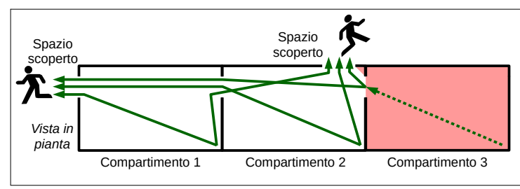

I compartimenti 1 e 2 sono *luogo sicuro temporaneo* per il compartimento 3.

Il compartimento 1 è *luogo sicuro tempo*raneo per il compartimento 2 e viceversa. I due spazi scoperti sono *luogo sicuro temporaneo* per tutti i compartimenti.

Tabella S.4-4: Esempi di luogo sicuro temporaneo

#### **S.4.5.3 Vie d'esodo**

- <span id="page-130-0"></span>1. Ai fini delle vie d'esodo, non devono essere considerati i seguenti percorsi:
 - a. scale portatili;
 - b. ascensori;
 - c. rampe con pendenza superiore al 20%;

Nota Le rampe con pendenza superiore al 5% sono considerate *vie d'esodo verticali*. In generale gli occupanti con disabilità motorie non possono percorrere autonomamente rampe di pendenza superiore all'8%. Rampe con pendenza superiore al 12% dovrebbero essere impiegate per l'esodo solo eccezionalmente.

- d. scale e marciapiedi mobili non progettati secondo le indicazioni del paragrafo [S.4.5.5](#page-133-1).
- 2. È ammesso l'uso di scale alla marinara a servizio di locali ove vi sia basso affollamento ed esclusiva presenza di personale specificatamente formato (es. locali impianti o di servizio, cabine di manovra, cavedi impiantistici, …).
- 3. Tutte le superfici di calpestio delle vie d'esodo non devono essere sdrucciolevoli, né presentare avvallamenti o sporgenze pericolose e devono essere in condizioni tali da rendere sicuro il movimento ed il transito degli occupanti.
- 4. Il fumo ed il calore dell'incendio smaltiti o evacuati dall'attività non devono interferire con le vie d'esodo.

Nota Ad esempio, non sono accettabili aperture di smaltimento o evacuatori di fumo e calore (capitolo [S.8](#page-208-0)) sottostanti o adiacenti a vie d'esodo esterne.

### S.4.5.3.1 Via d'esodo protetta

1. I *percorsi d'esodo protetti* (es. corridoi, scale, rampe, atri, …) devono essere inseriti in vani protetti ad essi dedicati.

In tali vani è generalmente ammessa la presenza di impianti tecnologici e di servizi ausiliari al funzionamento dell'attività, nel rispetto dei vincoli imposti nei capitoli [S.10](#page-226-0) e [V.3](#page-254-0).

Nota Ad esempio: ascensori, montacarichi, montalettighe, scale mobili, marciapiedi mobili, impianti elettrici civili, impianti antincendio, …

2. Le scale d'esodo protette devono condurre in luogo sicuro direttamente o almeno tramite percorso d'esodo protetto.

Nota Anche in tali percorsi vale quanto previsto in merito alla presenza di impianti tecnologici e di servizi.

## S.4.5.3.2 Via d'esodo a prova di fumo

1. I *percorsi d'esodo a prova di fumo* (es. corridoi, scale, rampe, atri, …) devono essere inseriti in vani a prova di fumo ad essi dedicati.

In tali vani è generalmente ammessa la presenza di impianti tecnologici e di servizi ausiliari al funzionamento dell'attività, nel rispetto dei vincoli imposti nei capitoli [S.10](#page-226-0) e [V.3](#page-254-0).

Nota Ad esempio: ascensori, montacarichi, montalettighe, scale mobili, marciapiedi mobili, impianti elettrici civili, impianti antincendio, …

2. Le scale d'esodo a prova di fumo devono condurre in luogo sicuro direttamente o tramite percorso d'esodo a prova di fumo.

Nota Anche in tali percorsi vale quanto previsto in merito alla presenza di impianti tecnologici e di servizi.

<span id="page-131-1"></span>1. Le *vie d'esodo esterne* (es. scale, rampe, passerelle, camminamenti, ...) devono essere completamente esterne alle opere da costruzione. Inoltre, durante l'esodo degli occupanti, non devono essere soggette ad irraggiamento dovuto all'incendio superiore a 2,5 kW/m² e non devono essere investite dai prodotti della combustione.

È generalmente ammessa la prossimità di impianti tecnologici e di servizi ausiliari al funzionamento dell'attività, nel rispetto dei vincoli imposti nei capitoli S.10 e V.3.

Nota Ad esempio: ascensori, montacarichi, montalettighe, scale mobili, marciapiedi mobili, impianti elettrici civili, impianti antincendio, ...

- 2. Si ritengono soddisfatte le condizioni del comma 1 applicando almeno uno dei criteri di cui alla tabella S.4-5.
- 3. Ai fini delle prestazioni, una via d'esodo esterna è considerata equivalente:
 - a. per piani con quota ≤ 24 m, ad una via d'esodo *a prova di fumo* con caratteristiche di *filtro*;
 - b. nei restanti casi, ad una via d'esodo *protetta* con caratteristiche di *filtro*.

Nota Ovunque nel testo si richieda una *via d'esodo a prova di fumo*, *via d'esodo a prova di fumo* con caratteristiche di *filtro*, *via d'esodo protetta*, *via d'esodo protetta* con caratteristiche di *filtro* può essere impiegata una via d'esodo esterna, con le limitazioni di cui al presente comma.

Nota La *via d'esodo esterna* ha un grado di protezione maggiore della semplice via d'esodo che attraversi uno spazio a cielo libero.

4. Le scale d'esodo esterne devono condurre in luogo sicuro direttamente o tramite percorso d'esodo a prova di fumo o via d'esodo esterna.

Nota Anche in tali percorsi vale quanto previsto in merito alla presenza di impianti tecnologici e di servizi.

#### S.4.5.3.4 Via d'esodo senza protezione

1. Le *vie d'esodo senza protezione* sono tutte quelle che non possono essere classificate come *protette*, *a prova di fumo* o *esterne*.

Nota Come descritto nell'illustrazione S.4-1, tra le vie d'esodo si distinguono quelle con un certo grado di protezione dall'incendio, da tutte le altre denominate *senza protezione*.

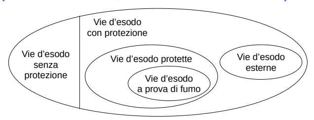

<span id="page-131-0"></span>*Illustrazione S.4-1: Classificazione delle vie d'esodo in funzione della protezione dall'incendio* 

| Criterio | Caratteristiche | Esempio |
|----------|----------------------------------------------------------------------------------------------------------------------------------------------------------------------------------------------------------------------------------------------------------------------------------------------------------------------------------------------------------------------------------------------------------------------------------------------------------------------------------------------------------------------------------------------------------------------------------------------------------------------------------------------------------------------------------------------------------------------------------|-------------------------------------------------------------------------------------------|
| 1 | La porzione di chiusura d'ambito dell'opera da costruzione su cui è collocata la via d'esodo esterna (orizzontale o verticale, anche adiacente all'opera da costruzione) deve possedere caratteristiche di resistenza al fuoco non inferiori a El 30, oppure E 30 nel caso di vie d'esodo realizzate con materiali e strutture incombustibili. Tale porzione è ottenuta come area di influenza della proiezione del piano di calpestio della via d'esodo sulla costruzione con roffset pari a 1,80 m. La porzione ottenuta è prolungata perpendicolarmente fino al più basso piano di riferimento o fino a terra. Gli infissi, anche parzialmente ricompresi nella porzione, devono avere pari classe di resistenza al fuoco. | Vista frontale El 30 El 30 o E 30 Nessun requisito ≥ 1,80 m Via d'esodo orizzontale |
| 2 | La via d'esodo esterna (orizzontale o verticale) deve essere distaccata di almeno 2,50 m dall'opera da costruzione, da aperture di smaltimento o di evacuazione di fumi e calore dell'incendio. Deve essere collegata alle porte di piano tramite passerelle realizzate con materiali incombustibili. Le passerelle devono essere protette dall'incendio tramite l'adozione della soluzione del criterio 1. | Porta e muri<br>El 30 o E 30<br>Vista in pianta |
| 3 | La via d'esodo esterna (orizzontale o verticale) deve essere distaccata di 2,50 m dall'opera da costruzione, da aperture di smaltimento o di evacuazione di fumi e calore dell'incendio. Se collegata alle porte di piano tramite passerelle, queste devono essere realizzate con materiali incombustibili. Le passerelle devono essere protette dall'incendio per mezzo di pavimentazione e setti laterali pieni, realizzati con materiale incombustibile; l'altezza dei setti laterali si deve estendere per non meno di 2 m dal piano di calpestio. | Pavimento e setti laterali pieni e incombustibili Pianta |

<span id="page-132-0"></span>Tabella S.4-5: Criteri per la realizzazione di vie d'esodo esterne orizzontali o verticali

#### **S.4.5.4 Scale d'esodo**

- <span id="page-133-2"></span>1. Quando un pavimento inclinato immette in una scala d'esodo, la pendenza deve interrompersi almeno ad una distanza dalla scala pari alla larghezza della stessa.
- 2. Le scale d'esodo devono essere dotate di corrimano laterale. Le scale d'esodo di larghezza maggiore di 2400 mm dovrebbero essere dotate di uno o più corrimano centrali.
- 3. Le scale d'esodo devono consentire l'esodo senza inciampo degli occupanti. A tal fine:
 - a. i gradini devono avere alzata e pedata costanti;
 - b. devono essere interrotte da pianerottoli di sosta.
- 4. Sono ammessi gradini con alzata o pedata variabili, per brevi tratti segnalati, lungo le vie d'esodo da ambiti ove vi sia esclusiva presenza di personale specificamente formato od occasionale e di breve durata di un numero limitato di occupanti (es. locali impianti o di servizio, piccoli depositi, …), oppure secondo le risultanze di specifica valutazione del rischio.
- 5. Dovrebbero essere evitate scale d'esodo composte da un solo gradino in quanto fonte d'inciampo. Se il gradino singolo non è eliminabile, deve essere opportunamente segnalato.

## **S.4.5.5 Scale e marciapiedi mobili d'esodo**

- <span id="page-133-1"></span>1. Le scale ed i marciapiedi mobili possono essere considerati ai fini del calcolo delle vie di esodo alle seguenti condizioni:
 - a. l'attività deve essere sorvegliata da IRAI con livello di prestazione IV (capitolo [S.7\)](#page-198-0);
 - b. l'attività deve avere livello di prestazione III per la gestione della sicurezza antincendio (capitolo [S.5](#page-168-0)) e la modalità di gestione delle scale e dei marciapiedi mobili deve essere inserita nel piano d'emergenza;
 - c. deve essere effettuata valutazione del rischio d'ostacolo all'esodo degli occupanti da parte di oggetti eventualmente presenti lungo il percorso (es. carrelli, merci, …).
- 2. Sono ammesse le seguenti modalità di gestione delle scale e dei marciapiedi mobili in caso d'emergenza: fermata e mantenimento in posizione, mantenimento del moto, fermata ed inversione del moto.
 - L'attuazione di ciascuna modalità di gestione deve essere finalizzata alla migliore gestione dell'esodo in sicurezza.
- Nota Ad esempio, attraverso modalità di fermata o di inversione del moto graduali, accompagnate da segnalazioni visive ed acustiche.
- Nota Le scale ed i marciapiedi mobili d'esodo devono soddisfare anche i requisiti previsti nel capitolo [S.10.](#page-226-0)

## **S.4.5.6 Rampe d'esodo**

<span id="page-133-0"></span>1. In corrispondenza di accessi o uscite, le rampe d'esodo devono prevedere pianerottoli di dimensioni pari almeno alla larghezza complessiva del varco.

Nota Se lo scopo della rampa è il superamento di barriere architettoniche, devono essere rispettate anche le relative disposizioni. Si veda anche il paragrafo [S.4.9.](#page-160-0)

#### **S.4.5.7 Porte lungo le vie d'esodo**

- <span id="page-134-0"></span>1. Le porte installate lungo le *vie d'esodo* devono essere facilmente identificabili ed apribili da parte di tutti gli occupanti.
- 2. L'apertura delle porte non deve ostacolare il deflusso degli occupanti lungo le vie d'esodo.

Nota Ad esempio, le porte che si aprono su pianerottoli o corridoi non devono ridurre la larghezza calcolata del percorso d'esodo, né creare pericolo per gli occupanti durante l'esodo.

- 3. Le porte devono aprirsi su aree piane orizzontali, di profondità almeno pari alla larghezza complessiva del varco.
- 4. Qualora, per necessità connesse a particolari esigenze d'esercizio dell'attività o di sicurezza antintrusione, sia necessario cautelarsi da un uso improprio delle porte, è consentita l'adozione di idonei e sicuri sistemi di controllo ed apertura delle porte. In tali casi, la gestione della sicurezza antincendio dell'attività (capitolo [S.5](#page-168-0)) deve prevedere le modalità di affidabile, immediata e semplice apertura di tali porte in caso di emergenza.

## S.4.5.7.1 Porte ad apertura manuale

<span id="page-134-1"></span>1. Al fine di consentire l'affidabile, immediata e semplice apertura delle porte ad apertura manuale in condizioni di elevata densità di affollamento, ciascuna porta deve possedere i requisiti della tabella [S.4-6](#page-135-0) in funzione delle caratteristiche dell'ambito servito e del numero di occupanti dell'ambito che impiegano tale porta nella condizione d'esodo più gravosa.

Nota Si riportano esempi di calcolo nella tabella [S.4-7.](#page-135-1)

2. In alternativa a porte munite dei dispositivi di apertura della tabella [S.4-6,](#page-135-0) sono comunque ammesse porte apribili nel verso dell'esodo, a condizione che le stesse siano progettate e realizzate a regola d'arte e che l'apertura durante l'esercizio possa avvenire a semplice spinta sull'intera superficie della porta.

#### S.4.5.7.2 Porte ad azionamento automatico

1. Lungo le vie d'esodo è consentito installare porte ad azionamento automatico dello specifico tipo previsto dalla norma UNI EN 16005. Tali porte non devono costituire intralcio all'esodo degli occupanti, in particolare in caso di emergenza, in assenza di alimentazione elettrica, in caso di guasto.

Nota Le porte ad azionamento automatico devono rispettare i requisiti essenziali di salute e di sicurezza previsti all'allegato I della direttiva 2006/42/CE del 17 maggio 2006.

2. Le porte ad azionamento automatico devono essere inserite nella progettazione della GSA dell'attività (capitolo [S.5](#page-168-0)).

#### S.4.5.7.3 Tornelli

1. È consentito installare tornelli e varchi automatici per il controllo degli accessi lungo le vie d'esodo. Tali tornelli non devono costituire intralcio all'esodo degli occupanti, in particolare in caso di emergenza, in assenza di alimentazione elettrica, in caso di guasto.

Nota Ad esempio, ciò può essere conseguito con un sistema di sgancio automatico dei tornelli asservito ad IRAI, mediante presidio dei tornelli e comando di sgancio anche da postazione remota o con meccanismi di apertura ridondanti.

2. I tornelli ed i relativi sistemi ed accessori di azionamento, controllo e comando devono essere inseriti nella progettazione della GSA dell'attività (capitolo [S.5](#page-168-0)).

| Ambito servito | Caratteristiche della porta | | |
|------------------------------------------------|-----------------------------|------------------------------------------------------|-------------------------|
| Allibito Servito | Occupanti serviti [1] | Verso di apertura | Dispositivo di apertura |
| Ambiti dell'attività<br>non aperti al pubblico | n > 50 occupanti | | |
| Ambiti dell'attività<br>aperti al pubblico | n > 25 occupanti | Nel senso dell'esodo [2] | UNI EN 1125 [3] |
| Aree a rischio specifico | n > 10 occupanti | | |
| | n > 5 occupanti | | UNI EN 179 [3] [4] |
| Altri casi | | Secondo risultanze della valutazione del rischio [5] | |

- [1] Numero degli occupanti che impiegano la singola porta nella condizione d'esodo più gravosa, considerando anche la verifica di ridondanza di cui al paragrafo S.4.8.6.
- [2] Qualora l'esodo possa avvenire nelle due direzioni devono essere previste specifiche misure (es. porte distinte per ciascuna direzione, porte apribili nelle due direzioni, porte ad azionamento automatico, segnaletica variabile, ...). Sono escluse dal verso di apertura le porte ad azionamento automatico del tipo a scorrimento.
- [3] Oppure dispositivo per specifiche necessità, da selezionare secondo risultanze della valutazione del rischio (es. EN 13633, EN 13637, ...).
- [4] I dispositivi UNI EN 179 sono progettati per l'impiego da parte di personale specificamente formato.
- [5] Ove possibile, è preferibile che il verso di apertura sia comunque nel senso dell'esodo, anche qualora si mantenga il dispositivo di apertura ordinario.

<span id="page-135-0"></span>*Tabella S.4-6: Caratteristiche delle porte ad apertura manuale lungo le vie d'esodo* 

| Esempio | | Calcolo | |
|--------------------------------------------------------------------|------------------------------------------|--------------------------------------------------------------------------------------|----------------------------------------------------------------------------------|
| R <sub>vita</sub> = B2 Locale 1 | Locale 2 | Locale 1 | [1] 120p : 3 = 40p > 25p [3]<br>[2] UNI EN 1125, nel senso dell'esodo |
| 120p 20p 20p P3 P4 P3 P4 P3 P4 P4 P4 P4 P4 P4 P4 P4 P4 P4 P4 P4 P4 | Locale 2 | [1] 20p ≤ 25p<br>[2] Secondo valutazione del rischio | |
| P1 P2 Corridoio | Vista in pianta | Corridoio | [1] 120p : 4 · 3 + 20p = 110p > 25p [4]<br>[2] UNI EN 1125, nel senso dell'esodo |
| R <sub>vita</sub> = B2 Locale 1 | R <sub>vita</sub> = B2 Locale 1 Locale 2 | Locale 1 | [1] 72p : 3 = 24p ≤ 25p [3]<br>[2] Secondo valutazione del rischio |
| 72p 10p 10p 10p 10p 10p 10p 10p 10p 10p 10 | Locale 2 | [1] 10p ≤ 25p<br>[2] Secondo valutazione del rischio | |
| | Corridoio | [1] $72p : 4 \cdot 3 + 10p = 64p > 25p [4]$<br>[2] UNI EN 1125, nel senso dell'esodo | |
| R <sub>vita</sub> = B2 Locale 1 | R <sub>vita</sub> = B2 Locale 1 Locale 2 | Locale 1 | [1] 28p : 3 ≈ 10p ≤ 25p [3]<br>[2] Secondo valutazione del rischio |
| 28p 4p 4p 4p 4p 4p 4p 4p 4p 4p 4p 4p 4p 4p | Locale 2 | [1] 4p ≤ 25p<br>[2] Secondo valutazione del rischio | |
| Corridoio | Vista in pianta | Corridoio | [1] $28p : 4 \cdot 3 + 4p = 25p \le 25p$ [4] [2] Secondo valutazione del rischio |

- [1] Numero occupanti serviti dalla singola porta nella condizione d'esodo più gravosa
- [2] Dispositivo e verso di apertura di tutte le porte del locale
- [3] Con verifica di ridondanza, ipotizzando indisponibile una qualsiasi delle vie d'esodo del locale 1
- [4] Nella condizione d'esodo più gravosa per verifica di ridondanza, ipotizzando indisponibile il varco U2 o U3

 Dispositivo di apertura manuale UNI EN 1125

<span id="page-135-1"></span>Tabella S.4-7: Esempi di determinazione caratteristiche delle porte lungo le vie d'esodo

#### **S.4.5.8 Uscite finali**

- <span id="page-136-1"></span>1. Le *uscite finali* devono essere posizionate in modo da consentire l'esodo rapido degli occupanti verso luogo sicuro.
- 2. Le uscite finali dovrebbero essere contrassegnate sul lato verso luogo sicuro con Segnale UNI EN ISO 7010-M001, riportante il messaggio *"Uscita di emergenza, lasciare libero il passaggio"* dell'illustrazione [S.4-2](#page-136-3).

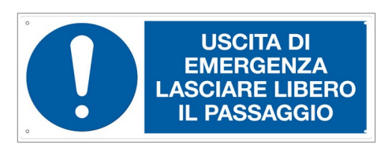

*Illustrazione S.4-2: Esempio di segnale per uscita finale*

## **S.4.5.9 Segnaletica d'esodo ed orientamento**

<span id="page-136-3"></span><span id="page-136-0"></span>1. Il sistema d'esodo (es. vie d'esodo, luoghi sicuri, spazi calmi, …) deve essere facilmente riconosciuto ed impiegato dagli occupanti grazie ad apposita *segnaletica di sicurezza*.

Ciò può essere conseguito anche con ulteriori *indicatori ambientali* quali:

- a. accesso visivo e tattile alle informazioni;
- b. grado di differenziazione architettonica;
- c. uso di segnaletica per la corretta identificazione direzionale, tipo UNI EN ISO 7010;
- d. ordinata configurazione geometrica dell'edificio, anche in relazione ad allestimenti mobili o temporanei.
- 2. La segnaletica d'esodo deve essere adeguata alla complessità dell'attività e consentire l'orientamento degli occupanti (*wayfinding*). A tal fine:
 - a. devono essere installate in ogni piano dell'attività apposite planimetrie semplificate, correttamente orientate, in cui sia indicata la posizione del lettore (es. *"Voi siete qui"*) ed il *layout* del sistema d'esodo (es. vie d'esodo, spazi calmi, luoghi sicuri, …). A tal proposito possono essere applicate le indicazioni contenute nella norma UNI ISO 23601 "*Identificazione di sicurezza - Planimetrie per l'emergenza*";
 - b. possono essere applicate le indicazioni supplementari contenute nella norma ISO 16069 "*Graphical symbols - Safety signs - Safety way guidance systems (SWGS)*".

<span id="page-136-2"></span>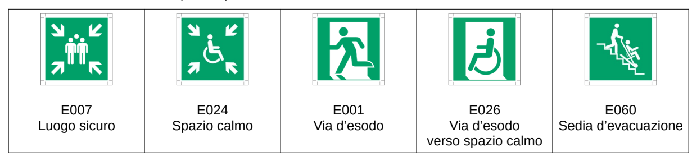

*Tabella S.4-8: Esempi di segnali UNI EN ISO 7010*

#### S.4.5.10 Illuminazione di sicurezza

<span id="page-137-1"></span>1. Lungo le vie d'esodo deve essere installato impianto di illuminazione di sicurezza, qualora l'illuminazione possa risultare anche occasionalmente insufficiente a consentire l'esodo degli occupanti.

Nota Ad esempio: attività esercite in orari pomeridiani e notturni, locali con scarsa illuminazione naturale....

2. Durante l'esodo, l'impianto di illuminazione di sicurezza deve assicurare un illuminamento orizzontale al suolo sufficiente a consentire l'esodo degli occupanti, in conformità alle indicazioni della norma UNI EN 1838 e comunque ≥ 1 lx lungo la linea centrale della via d'esodo.

Nota L'impianto di illuminazione di sicurezza deve soddisfare anche i requisiti previsti nel capitolo S.10.

3. Negli ambiti ove l'attività sia svolta con assente o ridotta illuminazione ordinaria (es. sale cinematografiche, sale teatrali, ...) eventuali gradini lungo le vie d'esodo devono essere provvisti di illuminazione segnapasso.

## S.4.5.11 Disposizione dei posti a sedere fissi e mobili

- <span id="page-137-0"></span>1. I posti a sedere (*sedili*) devono essere raggruppati in *settori* separati l'uno dall'altro mediante *passaggi tra i settori* longitudinali e trasversali. Tali passaggi tra i settori devono essere dimensionati come vie d'esodo oppure, se ogni settore contiene non più di 300 posti, avere larghezza ≥ 1200 mm.
- 2. I passaggi tra le file di sedili devono essere compresi nel computo della *lun-ghezza d'esodo* e di *corridoio cieco*, in quanto porzioni di via d'esodo.
- 3. La larghezza dei *passaggi tra le file di sedili* deve consentire il facile movimento in uscita degli occupanti. Tale larghezza è misurata orizzontalmente tra le massime sporgenze dei sedili. Se i sedili sono automaticamente ribaltabili la misura è effettuata con la seduta in posizione alzata.
- 4. Negli ambiti ove siano prevalentemente installati posti a sedere, sono ammessi anche occupanti in piedi. Le aree dedicate agli occupanti in piedi devono essere identificate e non devono interferire con il sistema d'esodo.

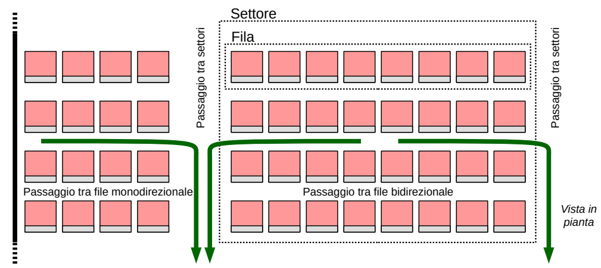

Illustrazione S.4-3: Disposizione dei posti a sedere in settori e file

#### S.4.5.11.1 Posti a sedere fissi

1. Il numero di sedili saldamente fissati al suolo che compongono la fila non deve essere superiore al numero previsto in tabella S.4-9 in funzione della larghezza del passaggio tra le file di sedili e della possibilità per gli occupanti di muoversi verso una o due direzioni di uscita dal settore.

#### S.4.5.11.2 Posti a sedere mobili

- 1. Ogni settore deve essere costituito al massimo da 10 file di sedili mobili collegati rigidamente tra loro per fila.
- 2. Il numero di sedili mobili che compongono la fila non deve essere superiore al numero previsto in tabella S.4-10 in funzione della possibilità per gli occupanti di muoversi verso una o due direzioni di uscita dal settore.
- 3. La larghezza dei *passaggi tra le file di sedili* deve essere ≥ 300 mm.
- 4. È ammesso l'impiego di sedili mobili, anche non collegati rigidamente tra loro, in ambiti dell'attività ove si dimostri che la presenza di sedili mobili non intralci l'esodo sicuro degli occupanti (es. locali con bassa densità di affollamento, palchi dei teatri, ristoranti, ...).

| Larghezza passaggio | Massimo numero di sedili per fila | |
|-------------------------|------------------------------------|----------------------------------|
| tra file di sedili [mm] | Passaggio tra file monodirezionale | Passaggio tra file bidirezionale |
| L < 300 | 1 | 2 |
| 300 ≤ L < 325 | 7 | 14 |
| 325 ≤ L < 350 | 8 | 16 |
| 350 ≤ L < 375 | 9 | 18 |
| 375 ≤ L < 400 | 10 | 20 |
| 400 ≤ L < 425 | 11 | 22 |
| 425 ≤ L < 450 | | 24 |
| 450 ≤ L < 475 | 12 | 26 |
| 475 ≤ L < 500 | | 28 |
| L≥500 | | Limitato dalla lunghezza d'esodo |

<span id="page-138-1"></span>Tabella S.4-9: Massimo numero di sedili fissi per fila del settore

| Massimo numero di sedili per fila | | |
|-----------------------------------|--------------------------|--|
| Per uscita monodirezionale | Per uscita bidirezionale | |
| 5 | 10 | |

<span id="page-138-3"></span>Tabella S.4-10: Massimo numero di sedili mobili per fila del settore

## S.4.5.12 Installazioni per gli spettatori

- <span id="page-138-0"></span>1. Sono ammesse installazioni per gli spettatori (es. tribune, ...) progettate, realizzate e gestite secondo la regola dell'arte (es. serie di norme UNI EN 13200, ...).
- 2. I posti a sedere (*sedili*) devono essere raggruppati in *settori* separati l'uno dall'altro mediante *passaggi tra i settori* longitudinali e trasversali. Tali passaggi tra i settori devono essere dimensionati come vie d'esodo oppure, se ogni settore contiene non più di 600 posti, avere larghezza ≥ 1200 mm.
- 3. Il numero di sedili che compongono la fila non deve essere superiore al numero previsto in tabella S.4-11 in funzione della possibilità per gli occupanti di muoversi verso una o due direzioni di uscita dal settore.

| Massimo numero di sedili per fila | | |
|-----------------------------------|--------------------------|--|
| Per uscita monodirezionale | Per uscita bidirezionale | |
| 20 | 40 | |

<span id="page-138-2"></span>*Tabella S.4-11: Massimo numero di sedili per fila del settore di installazioni per gli spettatori* 

#### **S.4.5.13 Sistemi d'esodo comuni**

<span id="page-139-0"></span>1. Al fine di evitare la propagazione di fumi e calore durante l'esodo, qualora nell'edificio siano esercite attività afferenti a diversi *responsabili dell'attività*, devono essere effettuate specifiche valutazioni atte a determinare se sia necessario prevedere sistemi d'esodo distinti o se siano sufficienti specifici accorgimenti progettuali.

Nota Ad esempio: vie d'esodo protette, a prova di fumo, misure gestionali, pianificazione d'emergenza e procedura d'allarme condivisa tra le diverse attività, …

2. Se un'attività civile condivide vie d'esodo con altre attività di qualsiasi tipologia, anche afferenti a diversi *responsabili d'attività*, dette vie d'esodo devono essere a prova di fumo, in assenza di specifici accorgimenti gestionali, di pianificazione d'emergenza e procedura d'allarme condivise.

#### S.4.6 Dati di ingresso per la progettazione del sistema d'esodo

<span id="page-140-2"></span>1. La progettazione del sistema d'esodo dipende da dati di ingresso per ogni compartimento specificati nei paragrafi S.4.6.1 e S.4.6.2.

## S.4.6.1 Profilo di rischio R<sub>vita</sub> di riferimento

<span id="page-140-1"></span>1. Ciascun componente del sistema d'esodo è dimensionato in funzione del *più gravoso ai fini dell'esodo* dei profili di rischio R<sub>vita</sub> dei compartimenti serviti.

#### S.4.6.2 Affoliamento

- <span id="page-140-3"></span><span id="page-140-0"></span>1. L'affollamento *massimo* di ciascun locale è determinato:
 - a. moltiplicando la *densità di affollamento* della tabella S.4-12 per la *superficie lorda* del locale stesso.
 - b. impiegando i criteri della tabella S.4-13;
 - c. secondo le indicazioni della regola tecnica verticale.

Qualora le indicazioni relative all'affollamento non siano reperibili secondo quanto indicato alle lettere a e b è comunque ammesso il riferimento a norme o documenti tecnici emanati da organismi europei o internazionali, riconosciuti nel settore della sicurezza antincendio.

- 2. Il responsabile dell'attività può dichiarare un valore dell'affollamento *inferiore* a quello determinato come previsto al comma 1.
- 3. Il responsabile dell'attività si impegna a rispettare l'*affollamento* e la *densità d'affollamento* dichiarati per ogni ambito ed in ogni condizione d'esercizio dell'attività.

| Tipologia di attività | Densità di affollamento | |
|-------------------------------------------------------------------------------------------------------------------------------------------------------------------------------------------------------|-------------------------|--|
| Ambiti all'aperto destinati ad attività di spettacolo o intrattenimento, delimitati<br>e privi di posti a sedere | | |
| Locali al chiuso di spettacolo o intrattenimento (es. sale concerti, trattenimenti<br>danzanti,<br>…) privi di posti a sedere e di arredi, con carico di incendio<br>specifico qf<br>≤<br>50<br>MJ/m2 | 2,0 persone/m2 | |
| Ambiti per mostre, esposizioni | | |
| Ambiti destinati ad attività di spettacolo o intrattenimento (es. sale concerti,<br>trattenimenti danzanti,<br>…) con presenza di arredi o con carico di incendio<br>specifico qf<br>><br>50<br>MJ/m2 | 1,2 persone/m2 | |
| Ambiti adibiti a ristorazione | 0,7 persone/m2 | |
| Ambiti adibiti ad attività scolastica e laboratori (senza posti a sedere) | | |
| Sale d'attesa | 0,4 persone/m2 | |
| Uffici | | |
| Ambiti di vendita di piccole attività commerciali al dettaglio con settore<br>alimentare o misto | | |
| Ambiti di vendita di medie e grandi attività commerciali al dettaglio con<br>settore alimentare o misto | | |
| Ambiti di vendita di attività commerciali al dettaglio senza settore alimentare | 0,2 persone/m2 | |
| Sale di lettura di biblioteche, archivi | | |
| Ambulatori | 0,1 persone/m2 | |
| Ambiti di vendita di attività commerciali all'ingrosso | | |
| Ambiti di vendita di piccole attività commerciali al dettaglio con specifica<br>gamma merceologica non alimentare | | |
| Civile abitazione | 0,05 persone/m2 | |

<span id="page-141-1"></span>*Tabella S.4-12: Densità di affollamento per tipologia di attività*

| Tipologia di attività | Criteri |
|------------------------------------------------------------------------------------------------|-----------------------------------------------------------|
| Autorimesse pubbliche | 2 persone per veicolo parcato |
| Autorimesse private | 1 persona per veicolo parcato |
| Degenza | 1 degente e 2 accompagnatori<br>per posto letto + addetti |
| Ambiti con posti a sedere o posti letto<br>(es. sale riunioni, aule scolastiche, dormitori, …) | Numero posti + addetti |
| Altri ambiti | Numero massimo presenti<br>(addetti + pubblico) |

<span id="page-141-0"></span>*Tabella S.4-13: Criteri per tipologia di attività*

#### S.4.7 Requisiti antincendio minimi per l'esodo

- <span id="page-142-0"></span>1. Il numero minimo di vie d'esodo verticali ed orizzontali per ciascun ambito dell'attività è determinato in relazione ai vincoli imposti dal paragrafo S.4.8.1 per il numero minimo di vie d'esodo e dal paragrafo S.4.8.2 per l'ammissibilità dei corridoi ciechi.
- 2. Al fine di evitare la diffusione degli effluenti dell'incendio alle vie d'esodo:
 - a. le vie di esodo verticali che collegano i compartimenti dell'attività devono essere *protette* da vani con resistenza al fuoco determinata secondo il capitolo S.2 e comunque non inferiore alla classe 30 con chiusure dei varchi di comunicazione almeno E 30-S<sub>a</sub>;

Nota Ad esempio, non è necessario proteggere la scala che scende da un soppalco inserito nello stesso compartimento e si possono impiegare *scale senza protezione* all'interno dei *compartimenti multipiano* (capitolo S.3).

- b. per le vie d'esodo verticali *a prova di fumo* proveniente dai compartimenti collegati è ammesso l'impiego di chiusure dei varchi di comunicazione almeno E 30.
- 3. Al fine di evitare la diffusione degli effluenti dell'incendio alle vie d'esodo fuori terra, qualora l'edificio abbia piani a quota < -5 m, le vie d'esodo interrate, se non a prova di fumo, devono essere inserite in compartimento distinto dalle vie d'esodo fuori terra.

Nota Ad esempio, a tal fine è sufficiente separare al piano terra le vie d'esodo verticali fuori terra da quelle interrate con chiusure tagliafuoco dei varchi di comunicazione.

- 4. Per assicurare l'esodo degli occupanti dai piani più remoti dell'opera da costruzione, in funzione del profilo di rischio $R_{\text{vita}}$ di riferimento (paragrafo S.4.6.1):
 - a. qualora esistano *piani a quota superiore* a quella prevista in tabella S.4-14, tutti i piani fuori terra devono essere serviti da almeno due vie d'esodo indipendenti;
 - b. qualora esistano *piani a quota inferiore* a quella prevista in tabella S.4-14, tutti i piani interrati devono essere serviti da almeno due vie d'esodo indipendenti.

| R <sub>vita</sub> | Piani a quota inferiore | Piani a quota superiore | | |
|--------------------------------------------------|-------------------------|-------------------------|--|--|
| B1, B2, B3 | < -5 m | > 32 m | | |
| B1 [1], B2 [1], B3 [1], D1, D2 | < -1 m | > 12 m | | |
| Cii1, Cii2, Cii3, Ciii1, Ciii2, Ciii3 | < -1 m | > 32 m | | |
| Altri casi < -5 m > 54 m | | | | |
| [1] Ambiti con densità d'affollamento > 0,4 p/m² | | | | |

<span id="page-142-1"></span>Tabella S.4-14: Quote dei piani soglia per due vie d'esodo indipendenti

- 5. Le vie d'esodo da *ambiti aperti al pubblico* non devono attraversare *ambiti non aperti al pubblico*, se non esclusivamente dedicati all'esodo, a meno di specifica valutazione del rischio e di misure aggiuntive al fine di consentire che tale passaggio avvenga in sicurezza in ogni condizione d'esercizio.
- Nota Ad esempio, l'esodo dalle aree aperte al pubblico di un'attività non può avvenire attraverso aree di processo o di stoccaggio, a meno di specifiche misure di protezione degli occupanti dai rischi presenti nelle aree attraversate.
 - 6. Per quanto possibile, il sistema d'esodo dovrebbe essere concepito tenendo conto che, in caso di emergenza, gli occupanti che non hanno familiarità con l'atti-

vità tendono solitamente ad uscire percorrendo in *senso inverso* la via che hanno impiegato per entrare.

- Nota Ad esempio, questa condizione può essere soddisfatta imponendo che alcune vie d'esodo corrispondano con le vie d'accesso ordinarie all'attività e che queste siano dimensionate per l'esodo di almeno il 60% dell'affollamento dei locali serviti.
 - 7. La *convergenza* dei flussi di occupanti da distinte vie d'esodo non deve essere ostacolata (es. da arredi fissi o mobili, da conformazioni geometriche del sito, dalle direzioni contrastanti di ingresso dei flussi di occupanti nell'area, …).
 - 8. In condizioni di elevato affollamento o densità di affollamento, deve essere evitato per quanto possibile il controflusso di soccorritori o di occupanti lungo le vie d'esodo. A tal fine possono essere previsti percorsi separati per le specifiche necessità.

## **S.4.7.1 Requisiti antincendio in caso di esodo per fasi**

- <span id="page-143-0"></span>1. In caso di *esodo per fasi* devono essere assicurati anche i seguenti requisiti:
 - a. tutti i piani dell'attività per cui si applica l'esodo per fasi devono essere serviti da almeno due vie d'esodo indipendenti;
 - b. l'attività deve essere sorvegliata da IRAI con livello di prestazione III e sistema EVAC (capitolo [S.7](#page-198-0));
 - c. nell'attività deve essere prevista gestione della sicurezza con livello di prestazione II (capitolo [S.5](#page-168-0));
 - d. ciascun piano dell'attività sia inserito in compartimento distinto e la compartimentazione deve avere livello di prestazione III (capitolo [S.3](#page-104-0));
- 2. La modalità d'*esodo per fasi* non può essere utilizzata per piani a quota < -5 m.

Capitolo S.4 Esodo Pagina S.4-19

#### S.4.8 Progettazione del sistema d'esodo

<span id="page-144-1"></span>Nota Il sistema d'esodo è dimensionato in modo da consentire agli occupanti di abbandonare il compartimento di primo innesco dell'incendio e raggiungere un *luogo sicuro temporaneo* (es. compartimento adiacente) o direttamente il *luogo sicuro*, prima che l'incendio determini condizioni *incapacitanti* negli ambiti dell'attività ove si trovano, come descritto nei riferimenti del paragrafo S.4.12.

## S.4.8.1 Vie d'esodo ed uscite indipendenti

<span id="page-144-0"></span>1. Vie d'esodo o uscite sono ritenute *indipendenti* quando sia minimizzata la probabilità che possano essere contemporaneamente rese indisponibili dagli effetti dell'incendio.

## S.4.8.1.1 Numero minimo di vie d'esodo indipendenti

- 1. Al fine di limitare la probabilità che l'esodo degli occupanti sia impedito dall'incendio, devono essere previste almeno due vie d'esodo indipendenti.
- 2. È ammessa la presenza di *corridoi ciechi* secondo le prescrizioni del paragrafo S.4.8.2.

## S.4.8.1.2 Numero minimo di uscite indipendenti

1. Al fine di limitare la probabilità che si sviluppi *sovraffollamento localizzato* alle uscite, da ciascun *locale* o *spazio a cielo libero* dell'attività deve essere previsto almeno il numero di uscite indipendenti previsto nella tabella S.4-15 in funzione del profilo di rischio $R_{vita}$ di riferimento e dell'affollamento dell'ambito servito.

| R <sub>vita</sub> | Affollamento<br>dell'ambito servito | Numero minimo uscite indipendenti | | |
|---------------------------------------------------------------------------|-------------------------------------|-----------------------------------|--|--|
| Qualsiasi | > 500 occupanti | 3 | | |
| B1 [1], B2 [1], B3 [1] | > 200 occupanti | | | |
| Altri | 2 | | | |
| Se ammesso corridoio cieco secondo le prescrizioni del paragrafo S.4.8.2. | | 1 | | |
| [1] Ambiti con densità d'affollamento > 0,4 p/m² | | | | |

<span id="page-144-2"></span>Tabella S.4-15: Numero minimo di uscite indipendenti da locale o spazio a cielo libero

Capitolo S.4 Esodo Pagina S.4-20

#### S.4.8.1.3 Determinazione dell'indipendenza tra vie d'esodo orizzontali e tra uscite

- 1. Si considerano *indipendenti* coppie di vie d'esodo orizzontali per le quali sia verificata almeno una delle seguenti condizioni:
 - a. l'angolo formato dai percorsi rettilinei sia ≥ 45°;
 - b. tra i percorsi esista separazione di adeguata resistenza al fuoco a tutta altezza con caratteristiche di resistenza al fuoco non inferiori a El 30.
- 2. Si considerano *indipendenti* coppie di uscite da un *locale* o da uno *spazio a cielo libero* per le quali sia verificata almeno una delle condizioni del comma 1 per i percorsi di raggiungimento.

Nota Si riportano esempi di vie d'esodo orizzontali ed uscite indipendenti nell'illustrazione S.4-4 e nella tabella S.4-16. Le aree campite rappresentano i punti dove non è assicurata l'indipendenza, cioè i corridoi ciechi.

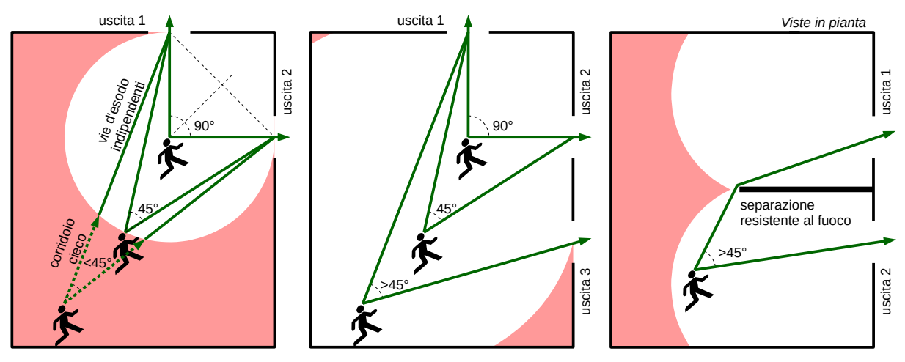

Illustrazione S.4-4: Esempi di vie d'esodo orizzontali ed uscite indipendenti

#### S.4.8.1.4 Determinazione dell'indipendenza tra vie d'esodo verticali

<span id="page-145-1"></span><span id="page-145-0"></span>1. Si considerano *indipendenti* coppie di vie d'esodo verticali se inserite in compartimenti distinti, oppure qualora almeno una delle due sia *via d'esodo esterna*.

Nota Ad esempio, sono indipendenti tra loro: due scale d'esodo protette distinte, una scala d'esodo protetta ed una senza protezione, due scale d'esodo senza protezione ma inserite in compartimenti verticali distinti, una scala senza protezione ed una scala esterna, due scale esterne, ...

- <span id="page-145-2"></span>2. È ammesso considerare *indipendenti* coppie di vie d'esodo verticali non protette, inserite nello stesso *compartimento*, alle seguenti condizioni:
 - a. ciascuna sia impiegata da non più di 100 occupanti,
 - b. nessun piano servito si trovi a quota < -1 m,
 - c. nei percorsi collegati a monte ed a valle non vi sia corridoio cieco.

Il massimo dislivello, tra tutti i piani serviti dalle vie d'esodo verticali non protette del compartimento, deve essere < 7 m.

Nota Ad esempio, possono essere considerate indipendenti tra loro due scale senza protezione, adeguatamente distanziate, al servizio di un soppalco inserito nello stesso compartimento. Si riporta un esempio nella tabella S.4-17.

3. È ammesso considerare *indipendenti* coppie di vie d'esodo verticali non protette che colleghino diversi piani di uno stesso *locale a gradoni o inclinato*, a condizione che le vie d'esodo ad esse collegate a valle siano indipendenti.

Nota Ad esempio, possono essere considerate indipendenti tra loro due scale senza protezione, adeguatamente distanziate, all'interno di aule a gradoni, auditorium, sale cinematografiche, ...

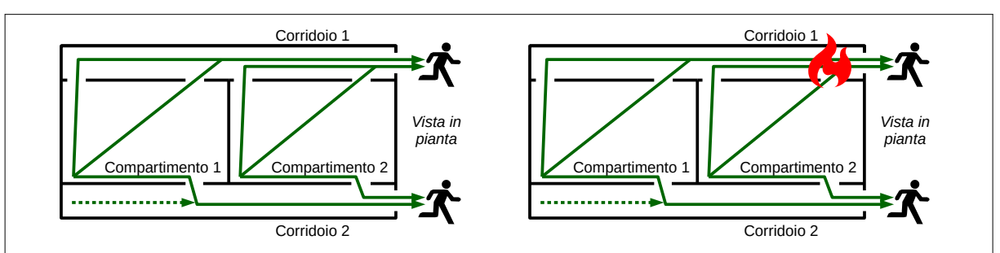

Ciascun compartimento ha due vie d'esodo in corridoio protetto e tre uscite *indipendenti*. In caso d'incendio nel corridoio 1, una via d'esodo e due uscite di ciascun compartimento sono rese indisponibili. Il primo tratto del corridoio 2 è un *corridoio cieco* perché unidirezionale.

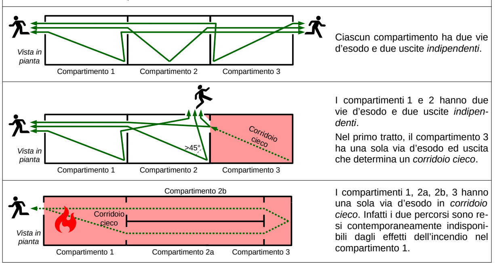

<span id="page-146-1"></span>Tabella S.4-16: Esempi di vie d'esodo indipendenti, uscite indipendenti e corridoio cieco

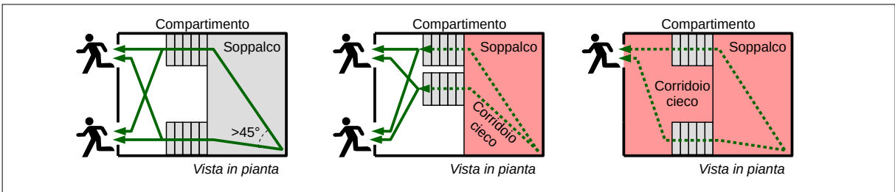

Con le limitazioni di cui al comma 2 del paragrafo S.4.8.1.4, nel primo caso sono considerate indipendenti tra loro le due scale *senza protezione* nello stesso compartimento. Nel secondo caso le due scale non sono indipendenti, perché a monte c'è un corridoio cieco. Nel terzo caso le due scale non sono indipendenti, perché a valle c'è un corridoio cieco.

<span id="page-146-0"></span>*Tabella S.4-17: Esempi di vie d'esodo indipendenti senza protezione* 

#### S.4.8.2 Corridoi ciechi

<span id="page-147-0"></span>Nota Le definizioni di *corridoio cieco* e di *lunghezza di corridoio cieco* si trovano nel capitolo G.1.

- 1. Dall'ambito servito, il *corridoio cieco* offre agli occupanti *una sola via d'esodo* senza alternative. Per quanto possibile, è preferibile evitare la realizzazione di percorsi unidirezionali.
- 2. Per ogni *corridoio cieco* devono essere verificate le seguenti condizioni, in funzione del profilo di rischio $R_{\text{vita}}$ di riferimento:
 - a. per limitare il *numero degli occupanti* eventualmente bloccati dall'incendio, l'*affollamento* complessivo degli ambiti serviti dal corridoio cieco non deve superare i valori massimi previsti nella tabella S.4-18,
 - b. per limitare la *probabilità* che gli occupanti siano bloccati dall'incendio, la *lunghezza del corridoio cieco* non deve superare i valori massimi $L_{cc}$ della tabella S.4-18.

Nota Si riporta un esempio nella tabella S.4-19.

| R <sub>vita</sub> | Max affollamento | Max lunghezza Lcc | R <sub>vita</sub> | Max affollamento | Max lunghezza Lcc |
|-------------------|------------------|-------------------|-------------------|-----------------------|-------------------|
| A1 | | ≤ 45 m | B1, E1 | | ≤ 25 m |
| A2 | ≤ 100 occupanti | ≤ 30 m | B2, E2 | | ≤ 20 m |
| A3 | | ≤ 15 m | B3, E3 | < <u>FO</u> annumenti | ≤ <b>15</b> m |
| A4 | ≤ 50 occupanti | ≤ 10 m | Cii1, Ciii1 | ≤ 50 occupanti | ≤ 20 m |
| D1 | | ≤ 20 m | Cii2, Ciii2 | | ≤ 15 m |
| D2 | | ≤ 15 m | Cii3, Ciii3 | | ≤ 10 m |

I valori delle massime lunghezze di corridoio cieco di riferimento $L_{\infty}$ possono essere incrementati in relazione a requisiti antincendio aggiuntivi, secondo la metodologia del paragrafo S.4.10.

<span id="page-147-1"></span>Tabella S.4-18: Condizioni per il corridoio cieco

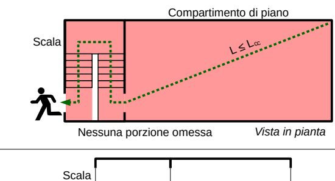

Se non viene omessa alcuna porzione di corridoio cieco, è necessario verificare l'affollamento e la lunghezza di corridoio cieco $L_{\rm cc}$ (tabella S.4-18) per l'intero percorso unidirezionale. In questo caso l'affollamento da considerare nella scala è quello totale dei piani serviti a prescindere dalla modalità d'esodo selezionata (es. simultaneo o per fasi).

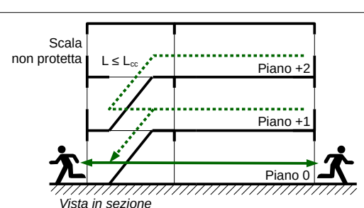

Ad esempio, i piani +1 e +2 sono serviti da un'unica scala (corridoio cieco).

Per la verifica del corridoio cieco (tabella S.4-18), se $R_{vi}$ = A2, l'affollamento complessivo di tali due piani deve essere $\leq$ 100 occupanti e la lunghezza di ciascun corridoio cieco deve essere $\leq$ 30 m ( $L_{cc}$ ).

La lunghezza massima $L_{\rm cc}$ può essere incrementata secondo la metodologia del paragrafo S.4.10.

<span id="page-147-2"></span>Tabella S.4-19: Esempio senza omissione di porzione di corridoio cieco

3. In relazione alla maggiore protezione offerta, è ammesso *omettere* dalla verifica delle condizioni della tabella S.4-18 la porzione di corridoio cieco *continua* e *finale*, avente una delle caratteristiche della tabella S.4-20.

Nota La porzione omessa è *finale* perché termina nel punto dove diventano disponibili almeno due vie d'esodo indipendenti o direttamente in luogo sicuro.

Nota La lunghezza della scala è misurata con il metodo del filo teso. Generalmente negli edifici civili la lunghezza della scala per un singolo piano è pari a circa 12,50 m.

Nota Anche nel caso sia ammesso omettere porzione di corridoio cieco, devono essere rispettati i requisiti del paragrafo S.4.7.

| Caratteristiche porzione omessa | Max lunghezza<br>omessa L <sub>om</sub> [1] | Prescrizioni<br>aggiuntive |
|------------------------------------------------------------------------------------------------------------------|---------------------------------------------|----------------------------|
| Con caratteristiche di <i>filtro</i> (esempio in tabella S.4-21) | ≤ 45 m | Nessuna |
| | ≤ 90 m | [2] |
| Con caratteristiche di filtro ed a prova di fumo | ≤ 120 m | Nessuna |
| | Illimitata | [2] |
| Anche senza protezione, che termini direttamente all'uscita finale o in luogo sicuro (esempio in tabella S.4-23) | ≤ 15 m | Nessuna |
| Dall'uscita finale fino al luogo sicuro, in via d'esodo esterna (esempio in tabella S.4-24) | Illimitata | Nessuna |

Gli ambiti serviti devono avere densità di affollamento $\leq 0.4 \text{ p/m}^2 \text{ e}$ , se aperti al pubblico, affollamento complessivo $\leq 300$ occupanti, altrimenti affollamento complessivo $\leq 500$ occupanti. In tali ambiti non è ammessa presenza di sostanze o miscele pericolose in quantità significative, o di lavorazioni pericolose ai fini dell'incendio. Ciascun locale dove gli occupanti possono dormire deve essere protetto ed avere chiusure almeno E 30-S<sub>a</sub>.

[1] Se costituita da più porzioni continue con caratteristiche differenti, la max lunghezza omessa $L_{om}$ è calcolata come media pesata, senza considerare le porzioni con $L_{om}$ illimitata (esempio in tabella S.4-22). Le caratteristiche di protezione dovrebbero essere crescenti nel senso dell'esodo.

[2] Gli ambiti serviti siano sorvegliati da IRAI di livello di prestazione III (capitolo S.7) e sia prevista gestione della sicurezza di livello di prestazione II (capitolo S.5).

<span id="page-148-0"></span>Tabella S.4-20: Condizioni per l'omissione di porzione di corridoio cieco

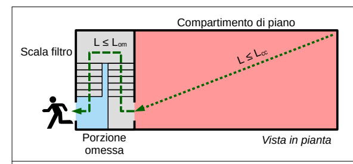

Se viene omessa l'unica scala al servizio dell'edificio multipiano, le verifiche dell'affollamento e della massima lunghezza di corridoio cieco $L_{\rm cc}$ (tabella S.4-18) sono condotte solo per le parti di corridoio cieco che terminano all'uscita di piano, per ogni piano.

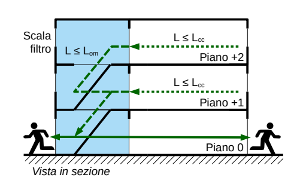

Ad esempio, i piani +1 e +2 sono serviti da un'unica scala (corridoio cieco).

Secondo una delle possibilità della tabella S.4-20, se l'unica scala ha caratteristiche di *filtro* e lunghezza $\leq$ 45 m ( $L_{om}$ ), essa può essere omessa dalle verifiche della tabella S.4-18.

Per la verifica del corridoio cieco (tabella S.4-18), se $R_{\text{vi-}}$ = A2, l'affollamento complessivo di *ciascuno* dei due piani deve essere $\leq$ 100 occupanti e la lunghezza di ciascun corridoio cieco fino all'uscita di piano deve essere $\leq$ 30 m (L $_{\text{cc}}$ ).

La lunghezza massima $L_{\infty}$ può essere incrementata secondo la metodologia del paragrafo S.4.10.

<span id="page-148-1"></span>Tabella S.4-21: Esempio di omissione di porzione di corridoio cieco con protezione

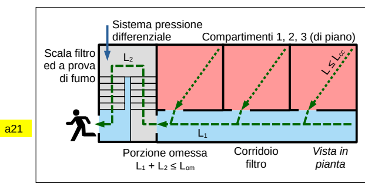

In questo caso vengono omessi l'unica scala al servizio dell'edificio multipiano ed i corridoi di piano, che hanno caratteristiche differenti. La $max\ lunghezza\ omessa\ L_{om}$ è pari alla $media\ pesata$ dei relativi valori da tabella S.4-20:

$$L_{om} \!\!=\!\! \frac{\sum L_{om(i)} \!\cdot\! L_i}{\sum L_i} \; con \; L_i \!\!\leq\!\! L_{om(i)}$$

<span id="page-149-0"></span>Tabella S.4-22: Esempio di omissione di porzioni di corridoio cieco differenti

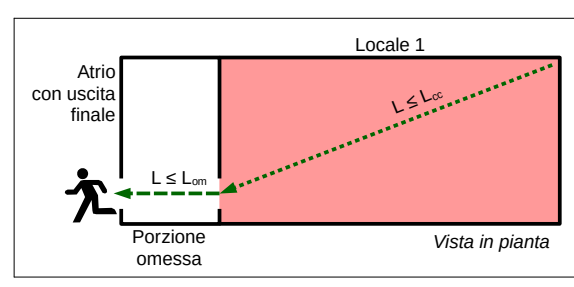

L'atrio, anche senza protezione, termina direttamente all'uscita finale (es. atrio condominiale). Se ha le caratteristiche richieste dalla tabella S.4-20, può essere considerato porzione di corridoio cieco omessa.

<span id="page-149-2"></span>Tabella S.4-23: Esempio di omissione di porzione di corridoio cieco verso uscita finale

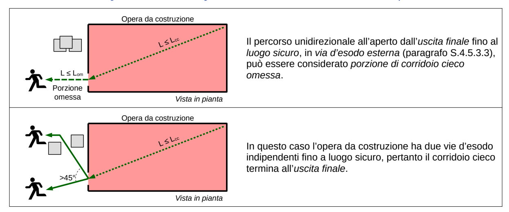

<span id="page-149-1"></span>Tabella S.4-24: Esempio di omissione di porzione di corridoio cieco in via d'esodo esterna

#### S.4.8.3 Lunghezze d'esodo

<span id="page-150-0"></span>Nota La definizione di *lunghezza d'esodo* si trova nel capitolo G.1.

- 1. Al fine di limitare il tempo necessario agli occupanti per abbandonare il compartimento di primo innesco dell'incendio, almeno una delle *lunghezze d'esodo* determinate da qualsiasi punto dell'attività non deve superare i valori massimi L<sub>es</sub> della tabella S.4-25 in funzione del profilo di rischio R<sub>vita</sub> di riferimento, come mostrato nella tabella S.4-26.
- 2. Quando la prima porzione della via d'esodo è costituita da *corridoio cieco*, devono essere contemporaneamente verificate la limitazione relativa alla *lunghezza d'esodo*, comprensiva del percorso effettuato in corridoio cieco, e le condizioni del paragrafo S.4.8.2 per i corridoi ciechi.
- 3. È ammesso *omettere* la verifica della *lunghezza d'esodo* di cui al comma 1 nelle vie d'esodo verticali con caratteristiche di *filtro* e nelle vie d'esodo esterne.

Nota Ad esempio, non è necessario verificare la lunghezza d'esodo nelle scale d'esodo protette, che abbiano caratteristiche di *filtro*.

Nota Si riportano esempi di verifica della lunghezza d'esodo nella tabella S.4-26.

| R <sub>vita</sub> | Max lunghezza d'esodo L <sub>es</sub> | R <sub>vita</sub> | Max lunghezza d'esodo L <sub>es</sub> |
|-------------------|---------------------------------------|-------------------|---------------------------------------|
| A1 | ≤ 70 m | B1, E1 | ≤ 60 m |
| A2 | ≤ 60 m | B2, E2 | ≤ 50 m |
| A3 | ≤ 45 m | B3, E3 | ≤ 40 m |
| A4 | ≤ 30 m | Cii1, Ciii1 | ≤ 40 m |
| D1 | ≤ 30 m | Cii2, Ciii2 | ≤ 30 m |
| D2 | ≤ 20 m | Cii3, Ciii3 | ≤ 20 m |

I valori delle massime lunghezze d'esodo di riferimento possono essere incrementati in relazione a *requisiti antincendio aggiuntivi*, secondo la metodologia del paragrafo S.4.10.

<span id="page-150-2"></span>Tabella S.4-25: Massime lunghezze d'esodo

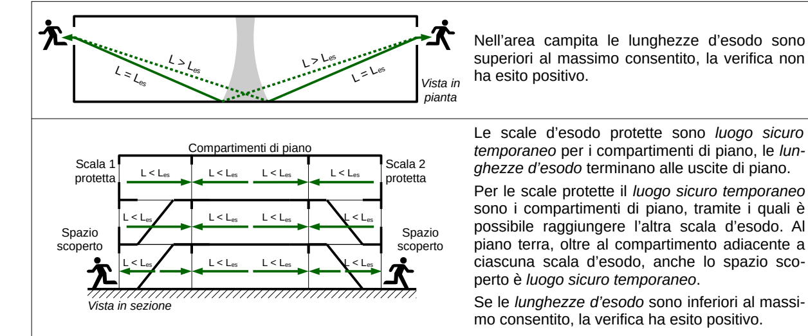

<span id="page-150-1"></span>Tabella S.4-26: Esempi di verifica della lunghezza d'esodo

Capitolo S.4 Esodo

Pagina S.4-26

#### S.4.8.4 Altezza delle vie d'esodo

- <span id="page-151-2"></span>1. L'altezza minima delle vie di esodo è pari a 2 m.
- 2. Sono ammesse altezze inferiori, per brevi tratti segnalati, lungo le vie d'esodo da ambiti ove vi sia esclusiva presenza di personale specificamente formato od occasionale e di breve durata di un numero limitato di occupanti (es. locali impianti o di servizio, piccoli depositi, ...), oppure secondo le risultanze di specifica valutazione del rischio.

## S.4.8.5 Larghezza delle vie d'esodo

- <span id="page-151-1"></span>1. La *larghezza* della vie di esodo è la minima misurata, dal piano di calpestio fino all'altezza di 2 m, deducendo l'ingombro di eventuali elementi sporgenti con esclusione degli estintori. Tra gli elementi sporgenti non vanno considerati i corrimano e i dispositivi di apertura delle porte con sporgenza ≤ 80 mm.
- 2. La larghezza delle vie d'esodo deve essere valutata lungo tutta la via d'esodo.
- 3. Dopo aver individuato le condizioni più gravose per i componenti del sistema d'esodo tramite la verifica di ridondanza prevista al paragrafo S.4.8.6, si determina la *larghezza minima* delle vie d'esodo come previsto ai paragrafi S.4.8.7, S.4.8.8, S.4.8.9, S.4.8.10.

Nota Si riportano esempi di calcolo nelle tabelle S.4-33, S.4-34 e S.4-35.

- 4. Nelle attività con densità di affollamento ≥ 0,7 persone/m², ciascuna via d'esodo orizzontale non *deve* presentare riduzioni di larghezza da monte a valle nella direzione dell'esodo, al fine di limitare la probabilità che si sviluppi *sovraffollamento localizzato*. Ciò *dovrebbe* essere previsto anche nelle altre attività.
- 5. Per le porzioni di via d'esodo impiegate come *percorso di accesso ai piani per soccorritori* deve essere applicato quanto previsto al paragrafo S.9.6.

#### S.4.8.6 Verifica di ridondanza delle vie d'esodo

- <span id="page-151-0"></span>1. Se un ambito (es. compartimento, piano, soppalco, locale, ...) è servito da più di una via d'esodo, l'incendio può renderne una indisponibile.
- 2. Ai fini della verifica di ridondanza, si deve rendere indisponibile una via d'esodo alla volta e verificare che le restanti vie d'esodo indipendenti da questa abbiano larghezza complessiva sufficiente a consentire l'esodo degli occupanti.

Nota Per le considerazioni del paragrafo S.4.8.1, eventuali vie d'esodo non indipendenti tra loro devono essere rese contemporaneamente indisponibili.

- 3. Le vie d'esodo a *prova di fumo* aventi le caratteristiche di *filtro* sono considerate *sempre disponibili* e non devono essere sottoposte a verifica di ridondanza, a meno di più restrittiva valutazione del rischio da parte del progettista.
- Nota Ad esempio, le scale d'esodo *a prova di fumo* aventi le caratteristiche di *filtro* non richiedono verifica di ridondanza, a differenza dei corridoi di piano non protetti che vi adducono.
 - 4. Nella verifica di ridondanza non è necessario procedere ad ulteriore verifica dei *corridoi ciechi* e delle *lunghezze d'esodo*.

## **S.4.8.7 Calcolo della larghezza minima delle vie d'esodo orizzontali**

<span id="page-152-0"></span>1. La larghezza minima LO della via d'esodo orizzontale (es. corridoio, porta, uscita, …), che consente il regolare esodo degli occupanti che la impiegano, è calcolata come segue:

$$L_{O} = L_{U} \cdot n_{O}$$
 S.4-1

con:

L<sup>O</sup> larghezza minima della via d'esodo orizzontale [mm]

<span id="page-152-3"></span>

L<sup>U</sup> *larghezza unitaria* per le vie d'esodo orizzontali determinata dalla tabella [S.4-27](#page-152-2) in funzione del profilo di rischio Rvita di riferimento

[mm/persona]

- n<sup>O</sup> numero degli occupanti che impiegano tale via d'esodo orizzontale, nelle condizioni d'esodo più gravose (paragrafo [S.4.8.6](#page-151-0)).
- 2. La larghezza LO può essere suddivisa tra più percorsi. Al fine di limitare la probabilità che si sviluppi *sovraffollamento localizzato*, in particolare in caso di affollamenti o densità di affollamento significativi oppure laddove gli occupanti si distribuiscano in modo imprevisto, la larghezza di ciascun percorso deve rispettare i criteri della tabella [S.4-28](#page-152-1), oppure essere oggetto di specifica valutazione del rischio.

Nota Si riportano esempi in tabella [S.4-33](#page-157-0).

| Rvita | Larghezza unitaria | Δtcoda | Rvita | Larghezza unitaria | Δtcoda |
|-------|--------------------|----------|---------------------|--------------------|----------|
| A1 | 3,40 | 330<br>s | B1, C1, E1 | 3,60 | 310<br>s |
| A2 | 3,80 | 290<br>s | B2, C2, D1, E2 | 4,10 | 270<br>s |
| A3 | 4,60 | 240<br>s | B1 [1], B2 [1], B3, | 6,20 | 180<br>s |
| A4 | 12,30 | 90<br>s | C3, D2, E3 | | |

I valori delle larghezze unitarie sono espressi in mm/persona ed assicurano una durata dell'attesa in coda, per gli occupanti che impiegano la specifica via d'esodo, non superiore a Δtcoda.

[1] Per occupanti prevalentemente in piedi e densità d'affollamento > 0,7 p/m<sup>2</sup> .

<span id="page-152-2"></span>*Tabella S.4-27: Larghezze unitarie per vie d'esodo orizzontali*

| Larghezza | Criterio |
|-----------------|---------------------------------------------------------------------------------------------------------------------------------------------------------------------------------------------------------------------------------|
| 1200<br>mm<br>≥ | Affollamento dell'ambito servito ><br>1000<br>occupanti<br>oppure ><br>200<br>occupanti prevalentemente in piedi e densità d'affollamento<br>><br>0,7<br>p/m2 |
| ≥<br>1000<br>mm | Affollamento dell'ambito servito ><br>300<br>occupanti |
| 900<br>mm<br>≥ | Affollamento dell'ambito servito ≤<br>300<br>occupanti<br>Larghezza adatta anche a coloro che impiegano ausili per il movimento |
| ≥<br>800<br>mm | Varchi da ambito servito con affollamento ≤<br>50<br>occupanti |
| ≥<br>700<br>mm | Varchi da ambito servito con affollamento ≤<br>10<br>occupanti<br>(es. singoli uffici, camere d'albergo, locali di abitazione, appartamenti,<br>…) |
| ≥<br>600<br>mm | Ambito servito ove vi sia esclusiva presenza di personale specificamente formato,<br>oppure occasionale e di breve durata di un numero limitato di occupanti<br>(es.<br>locali impianti o di servizio, piccoli depositi,<br>…). |

L'*affollamento dell'ambito servito* corrisponde al totale degli occupanti che impiegano ciascuna delle vie d'esodo che si dipartono da tale ambito.

<span id="page-152-1"></span>*Tabella S.4-28: Larghezze minime per vie d'esodo orizzontali*

#### S.4.8.8 Calcolo della larghezza minima delle vie d'esodo verticali

- <span id="page-153-0"></span>1. In funzione della modalità d'esodo adottata (paragrafo S.4.1), la larghezza minima $L_{\nu}$ della via d'esodo verticale (es. scala, ...), che consente il regolare esodo degli occupanti che la impiegano, è calcolata come specificato nei paragrafi S.4.8.8.1 o S.4.8.8.2.
- 2. La larghezza L<sub>V</sub> può essere suddivisa tra più percorsi. Al fine di limitare la probabilità che si sviluppi *sovraffollamento localizzato*, in particolare in caso di affollamenti o densità di affollamento significativi oppure laddove gli occupanti si distribuiscano in modo imprevisto, la larghezza di ciascun percorso deve rispettare i criteri della tabella S.4-32, oppure essere oggetto di specifica valutazione del rischio.

Nota Si riportano esempi in tabella S.4-34.

#### S.4.8.8.1 Calcolo in caso di esodo simultaneo

- <span id="page-153-2"></span>1. Se nell'attività si applica la modalità d'*esodo simultaneo*, le vie d'esodo verticali devono essere in grado di consentire l'evacuazione contemporanea di *tutti* gli occupanti in evacuazione da tutti i piani serviti.
- 2. La larghezza $L_v$ è calcolata come segue:

 $L_{V} = L_{U} \cdot n_{V}$ S.4-2

con:

 $L_{\scriptscriptstyle V}$ larghezza minima della via d'esodo verticale

<span id="page-153-4"></span>[mm]

- $\begin{array}{ll} L_{\text{U}} & \textit{larghezza unitaria} \text{ determinata da tabella S.4-29 in funzione del profilo di} \\ & \text{rischio } R_{\text{vita}} \text{ di riferimento e del numero totale dei piani serviti dalla via} \\ & \text{d'esodo verticale} \end{array}$
- $n_V$ numero totale degli occupanti che impiegano tale via d'esodo verticale, provenienti da tutti i piani serviti, nelle condizioni d'esodo più gravose (paragrafo S.4.8.6).

#### S.4.8.8.2 Calcolo in caso di esodo per fasi

- <span id="page-153-1"></span>1. Se nell'attività si applica la modalità d'*esodo per fasi*, le vie d'esodo verticali devono essere in grado di consentire l'evacuazione degli occupanti dei piani serviti durante *ciascuna fase*.
- 2. La larghezza L<sub>v</sub>, è calcolata come segue:

 $L_{V} = L_{U} \cdot n_{V}$ S.4-3

con:

L<sub>v</sub> larghezza minima della via d'esodo verticale

<span id="page-153-3"></span>[mm]

- $L_U$ *larghezza unitaria* determinata da tabella S.4-29 in funzione del profilo di rischio $R_{vita}$ di riferimento ed imponendo pari a 2 il numero totale dei piani serviti dalla via d'esodo verticale [mm/persona]
- $n_V$ numero totale degli occupanti che impiegano tale via d'esodo verticale, provenienti da due dei piani serviti, considerando i due piani, anche non consecutivi, aventi maggiore affollamento, nelle condizioni d'esodo più gravose (paragrafo S.4.8.6).

| Rvita | Numero totale dei piani serviti dalla via d'esodo verticale | | | | | | | | Δtcoda | | |
|-----------------------------------|-------------------------------------------------------------|-------|------|------|------|------|------|------|--------|--------|----------|
| | 1 | 2 [F] | 3 | 4 | 5 | 6 | 7 | 8 | 9 | ><br>9 | |
| A1 | 4,00 | 3,60 | 3,25 | 3,00 | 2,75 | 2,55 | 2,40 | 2,25 | 2,10 | 2,00 | 330<br>s |
| B1, C1, E1 | 4,25 | 3,80 | 3,40 | 3,10 | 2,85 | 2,65 | 2,45 | 2,30 | 2,15 | 2,05 | 310<br>s |
| A2 | 4,55 | 4,00 | 3,60 | 3,25 | 3,00 | 2,75 | 2,55 | 2,40 | 2,25 | 2,10 | 290<br>s |
| B2, C2, D1, E2 | 4,90 | 4,30 | 3,80 | 3,45 | 3,15 | 2,90 | 2,65 | 2,50 | 2,30 | 2,15 | 270<br>s |
| A3 | 5,50 | 4,75 | 4,20 | 3,75 | 3,35 | 3,10 | 2,85 | 2,60 | 2,45 | 2,30 | 240<br>s |
| B1 [1], B2 [1], B3,<br>C3, D2, E3 | 7,30 | 6,40 | 5,70 | 5,15 | 4,70 | 4,30 | 4,00 | 3,70 | 3,45 | 3,25 | 180<br>s |
| A4 | 14,60 | 11,40 | 9,35 | 7,95 | 6,90 | 6,10 | 5,45 | 4,95 | 4,50 | 4,15 | 90<br>s |

I valori delle larghezze unitarie sono espressi in mm/persona ed assicurano una durata dell'attesa in coda, per gli occupanti che impiegano la specifica via d'esodo, non superiore a Δtcoda.

I valori delle larghezze unitarie devono essere incrementati per le *scale* secondo le indicazioni della tabella [S.4-](#page-154-3) [30,](#page-154-3) oppure per le *rampe* secondo le indicazioni della tabella [S.4-31](#page-154-2).

- [F] Impiegato anche nell'esodo *per fasi*
- [1] Per occupanti prevalentemente in piedi e densità d'affollamento > 0,7 p/m<sup>2</sup> .

<span id="page-154-0"></span>*Tabella S.4-29: Larghezze unitarie per vie di esodo verticali*

| Alzata gradini | Pedata gradini | | | | | |
|----------------------------|-----------------|----------------------------|----------------------------|--|--|--|
| | p ≥<br>30<br>cm | 25<br>cm ≤ p <<br>30<br>cm | 22<br>cm ≤ p <<br>25<br>cm | | | |
| a ≤<br>17<br>cm | 0% | +10% | +25% [1] | | | |
| 17<br>cm < a ≤<br>18<br>cm | +5% | +15% | +50% [1] | | | |
| 18<br>cm < a ≤<br>19<br>cm | +15% | +25% | +100% [1] | | | |
| 19<br>cm < a ≤<br>22<br>cm | +25% [1] | +100% [1] | +200% [1] | | | |

Non sono ammessi gradini con pedata < 22 cm o alzata > 22 cm, salvo da locali ove vi sia esclusiva presenza di personale specificatamente formato, oppure occasionale e di breve durata di un numero limitato di occupanti. Sono ammessi gradini a ventaglio; pedata ed alzata sono misurate a 300 mm dal lato interno della scala.

[1] Queste combinazioni sono ammesse solo a seguito di specifica valutazione del rischio.

<span id="page-154-3"></span>*Tabella S.4-30: Incremento larghezza unitaria delle scale d'esodo in relazione ai gradini*

| Pendenza rampa | | | | | |
|-------------------------------------------------------------------------------------------|--|--|--|--|--|
| p ≤ 8%<br>8% < p ≤ 12%<br>12% < p ≤ 20% | | | | | |
| 0%<br>+50%<br>+200% [1] | | | | | |
| [1] Queste combinazioni sono ammesse solo a seguito di specifica valutazione del rischio. | | | | | |

<span id="page-154-2"></span>*Tabella S.4-31: Incremento larghezza unitaria delle rampe d'esodo in relazione alla pendenza*

| Larghezza | Criterio |
|-----------------|---------------------------------------------------------------------------------------------------------------------------------------------------------------------------------------------------------------------------------|
| ≥<br>1200<br>mm | Affollamento dell'ambito servito ><br>1000<br>occupanti<br>oppure ><br>200<br>occupanti prevalentemente in piedi e densità d'affollamento<br>><br>0,7<br>p/m2 |
| ≥<br>1000<br>mm | Affollamento dell'ambito servito ><br>300<br>occupanti |
| ≥<br>900<br>mm | Affollamento dell'ambito servito ≤<br>300<br>occupanti |
| ≥<br>600<br>mm | Ambito servito ove vi sia esclusiva presenza di personale specificamente formato,<br>oppure occasionale e di breve durata di un numero limitato di occupanti<br>(es.<br>locali impianti o di servizio, piccoli depositi,<br>…). |

L'*affollamento dell'ambito servito* corrisponde al totale degli occupanti che impiegano ciascuna delle vie d'esodo che si dipartono da tale ambito.

<span id="page-154-1"></span>*Tabella S.4-32: Larghezze minime per vie d'esodo verticali*

#### S.4.8.9 Calcolo della larghezza minima delle uscite finali

<span id="page-155-0"></span>1. La larghezza minima dell'uscita finale $L_{\text{F}}$ , che consente il regolare esodo degli occupanti provenienti da vie d'esodo orizzontali o verticali, è calcolata come segue:

$$L_F = \sum_i L_{O,i} + \sum_j L_{V,j}$$
 S.4-4

con:

L<sub>F</sub> larghezza minima dell'uscita finale

[mm]

 $L_{\text{O,i}}$ larghezza della i-esima via d'esodo orizzontale che adduce all'uscita finale, come calcolata con l'equazione S.4-1 [mm]

 $L_{V,j}$ larghezza della j-esima via d'esodo verticale che adduce all'uscita finale, come calcolata con le equazioni S.4-2 o S.4-3, rispettivamente in caso di esodo simultaneo o per fasi [mm]

- 2. La larghezza L<sub>F</sub> può essere suddivisa tra più percorsi. La larghezza di ciascun percorso deve rispettare i criteri della tabella S.4-28.
- 3. La *convergenza* dei flussi di occupanti dalle vie d'esodo orizzontali e verticali verso l'uscita finale non deve essere ostacolata (es. da arredi fissi o mobili, ...).

A tal fine, qualora *almeno due* delle vie d'esodo convergenti verso la stessa uscita finale siano impiegate da più di 50 occupanti ciascuna, la distanza misurata in pianta tra l'uscita finale e lo sbarco di tutte le vie d'esodo ad essa convergenti deve essere $\geq 2$ m, come mostrato nell'illustrazione S.4-5.

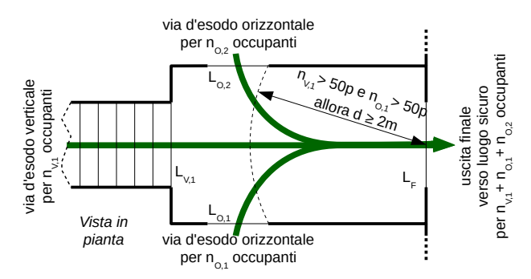

<span id="page-155-1"></span>Illustrazione S.4-5: Esempio di flussi convergenti (merging flows) verso uscita finale

#### S.4.8.10 Calcolo della larghezza minima per scale e marciapiedi mobili d'esodo

<span id="page-156-0"></span>Nota Le scale ed i marciapiedi mobili devono rispettare i requisiti essenziali di salute e di sicurezza previsti all'allegato I della direttiva 2006/42/CE del 17 maggio 2006.

Nota In quanto parte di vie d'esodo, scale e marciapiedi mobili d'esodo devono essere considerati in tutte le verifiche di cui al presente paragrafo anche se impiegate in moto (es. verifica di ridondanza, lunghezze d'esodo, ...).

## S.4.8.10.1 Scale e marciapiedi mobili mantenuti in posizione

1. La larghezza minima di scale e marciapiedi mobili d'esodo *mantenuti in posizione* durante l'emergenza (paragrafo S.4.5.5) è calcolata come previsto per le vie d'esodo orizzontali (paragrafo S.4.8.7) o verticali (paragrafo S.4.8.8), in funzione della loro pendenza.

## S.4.8.10.2 Scale e marciapiedi mobili impiegati in moto

- <span id="page-156-1"></span>1. La larghezza minima di scale e marciapiedi mobili d'esodo impiegati *in moto* durante l'emergenza (paragrafo S.4.5.5) è verificata secondo la seguente procedura:
 - a. si determina la *capacità di trasporto teorica* (es. secondo norma EN 115-1) e la si riduce del 50%;
 - b. si determina il tempo, dalla ricezione dell'allarme, necessario per l'eventuale inversione del moto nel senso dell'esodo;
 - c. si somma il tempo necessario al trasporto degli occupanti che impiegano tale via d'esodo con il tempo per l'inversione del moto, ottenendo la durata massima dell'attesa in coda per gli occupanti;
 - d. se il tempo così calcolato è inferiore ai valori $\Delta t_{coda}$ delle tabelle S.4-27 ed S.4-29, in funzione del profilo di rischio $R_{vita}$ di riferimento, allora l'uso per l'esodo degli occupanti della scala o del marciapiede mobile è verificato.

#### Nota Si riporta un esempio di calcolo in tabella S.4-35.

2. La *larghezza del gradino o segmento* di scale e marciapiedi mobili d'esodo deve essere ≥ 800 mm.

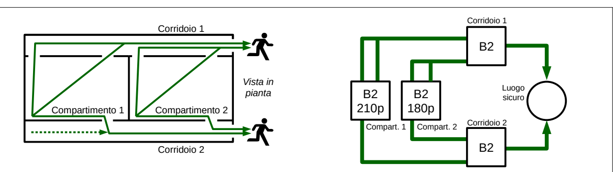

Dalla geometria dell'attività si elabora lo *schema* delle vie d'esodo e si definiscono i dati di ingresso (§ S.4.6): profilo di rischio $R_{vita}$ di riferimento ed affollamento. Nel caso specifico si ritiene trascurabile l'affollamento nei corridoi di transito. Tenendo conto dei requisiti antincendio minimi (§ S.4.7), dopo aver definito il numero minimo di vie d'esodo ed uscite (§ S.4.8.1), si verificano eventuali corridoi ciechi (§ S.4.8.2) e le lunghezze d'esodo (§ S.4.8.3).

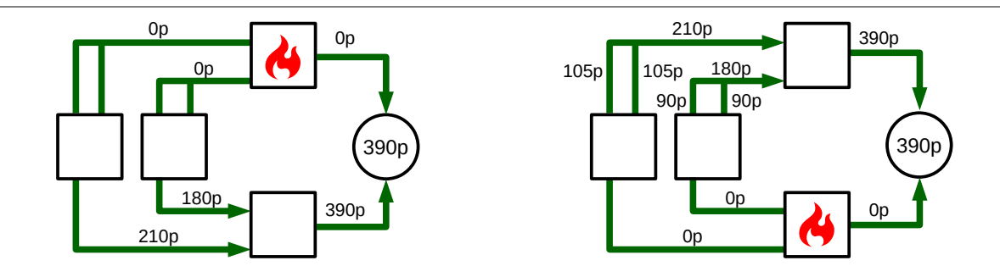

Si esegue la verifica di ridondanza (§ S.4.8.6), individuando le condizioni più gravose per i componenti del sistema d'esodo. Nelle figure soprastanti sono riportati solo gli esiti più gravosi.

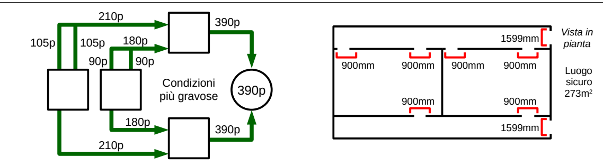

Impiegando le condizioni più gravose, si calcolano le larghezze minime (§ S.4.8.5), ad esempio:

- $L_0 = 390 \text{ p} \cdot 4,10 \text{ mm/p} = 1599 \text{ mm} \ge 1000 \text{ mm}$ (affollamento ambito: 210 p +180 p = 390 p)
- $L_0 = 210 \text{ p} \cdot 4,10 \text{ mm/p} = 861 \text{ mm} < 900 \text{ mm} \text{ (affollamento ambito: 210 p)}$

• ..

Si verifica quindi la superficie lorda minima del luogo sicuro (§ S.4.5.1): $S = 390 \text{ p} \cdot 0.70 \text{ m}^2/\text{p} = 273 \text{ m}^2$ Infine si determina il senso ed i dispositivi di apertura delle porte manuali (§ S.4.5.7.1).

<span id="page-157-0"></span>Tabella S.4-33: Esempio di dimensionamento delle vie d'esodo orizzontali

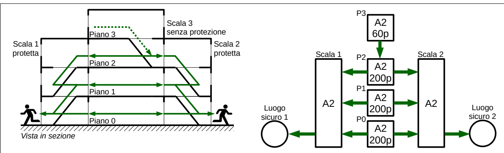

Dalla geometria dell'attività si elabora lo *schema* delle vie d'esodo e si definiscono i dati di ingresso (§ S.4.6): profilo di rischio $R_{vita}$ di riferimento ed affollamento. Tenendo conto dei requisiti antincendio minimi (§ S.4.7), dopo aver definito il numero minimo di vie d'esodo ed uscite (§ S.4.8.1), si verificano eventuali corridoi ciechi (§ S.4.8.2) e le lunghezze d'esodo (§ S.4.8.3).

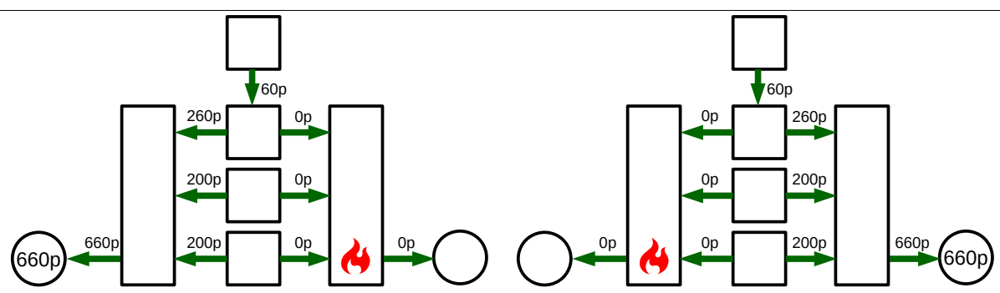

Si esegue la verifica di ridondanza (§ S.4.8.6), individuando le condizioni più gravose per i componenti del sistema d'esodo. Nelle figure soprastanti sono riportati solo gli esiti più gravosi.

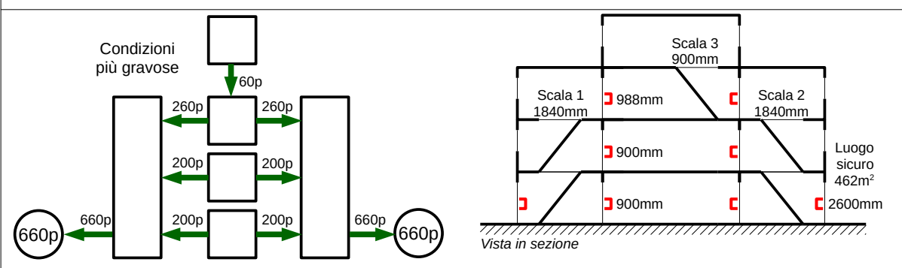

Impiegando le condizioni più gravose, si calcolano le larghezze minime (§ S.4.8.5), ad esempio:

- $L_0 = 260 \text{ p} \cdot 3,80 \text{ mm/p} = 988 \text{ mm} \ge 900 \text{ mm} \text{ (affollamento ambito: 260 p)}$
- $L_0 = 200 \text{ p} \cdot 3,80 \text{ mm/p} = 760 \text{ mm} < 900 \text{ mm} \text{ (affollamento ambito: 200 p)}$
- Scala 3: $L_V = 60 \text{ p} \cdot 4,55 \text{ mm/p} = 273 \text{ mm} < 900 \text{ mm}$ (1 piano, affollamento ambito: 60 p)
- Scale 1 e 2: L<sub>V</sub> = (260 p +200 p) · 4,00 mm/p = 1840 mm ≥ 1000 mm (2 piani, affollamento ambito: 460 p)
- Uscite finali: L<sub>F</sub> = 1840 mm + 760 mm = 2600 mm ≥ 1000 mm (affollamento ambito: 660 p)

Si verifica quindi la superficie lorda minima dei luoghi sicuri (§ S.4.5.1): $S = 660 \text{ p} \cdot 0.70 \text{ m}^2/\text{p} = 462 \text{ m}^2$ Infine si determina il senso ed i dispositivi di apertura delle porte manuali (§ S.4.5.7.1).

<span id="page-158-0"></span>Tabella S.4-34: Esempio di dimensionamento delle vie d'esodo orizzontali e verticali

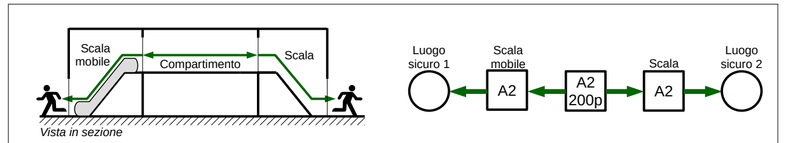

Si intende impiegare una scala mobile ed una scala ordinaria per l'esodo di 200 occupanti da un compartimento. Per la verifica di ridondanza (§ [S.4.8.6\)](#page-151-0), nelle condizioni più gravose, ciascuna scala può essere impiegata da tutti i 200 occupanti.

La scala mobile ha larghezza pari a 1000 mm, superiore al minimo ammesso pari a 800 mm. La sua velocità nominale è pari a 0,65 m/s, quindi ha una *capacità di trasporto teorica* pari a 2 persone/s, secondo norma EN 115- 1. Si supponga che, dalla ricezione dell'allarme, il tempo per completare l'inversione del moto nel senso dell'esodo sia pari a 30 s.

Secondo il paragrafo [S.4.8.10.2](#page-156-1), il tempo di attesa in coda alla scala mobile per gli occupanti vale:

200 p : (2 p/s · 50%) + 30 s = 230 s

Se Rvita per il compartimento è pari ad A2, dalla tabella [S.4-29](#page-154-0) si ottiene Δtcoda = 290 s, che è superiore al tempo di 230 s di calcolo.

Quindi è ammesso impiegare tale scala mobile per l'esodo.

Per la scala ordinaria e per le uscite finali vale:

LV = LF = 200 p · 4,55 mm/p = 910 mm ≥ 900 mm (1 piano, affollamento ambito: 200 p)

<span id="page-159-0"></span>*Tabella S.4-35: Esempio di dimensionamento di scala mobile d'esodo*

#### S.4.9 Eliminazione o superamento delle barriere architettoniche per l'esodo

- <span id="page-160-0"></span>Nota La progettazione del sistema d'esodo deve comunque rispettare le disposizioni di cui al decreto del Presidente della Repubblica 6 giugno 2001, n. 380 "*Testo unico delle disposizioni legislative e regolamentari in materia edilizia*", anche in tema di eliminazione o superamento delle barriere architettoniche.
 - 1. In tutti i piani dell'attività nei quali vi può essere presenza non occasionale di occupanti che non abbiano sufficienti abilità per raggiungere *autonomamente* un luogo sicuro tramite vie d'esodo verticali, deve essere adottata almeno una delle seguenti modalità:
 - a. impiego di spazi calmi secondo le indicazioni del paragrafo S.4.9.1;
 - b. esodo orizzontale progressivo secondo le indicazioni del paragrafo S.4.9.2;
 - c. esodo orizzontale verso luogo sicuro.

Per gli altri piani devono comunque essere previste apposite misure per gestire le specifiche necessità degli occupanti (capitolo S.5).

Nota Specifici accorgimenti costruttivi previsti nell'attività per tali occupanti sono indicatori di presenza non occasionale (es. stalli per disabili nelle autorimesse, servizi igienici per disabili, montascale, ...).

- 2. I compartimenti con profilo di rischio $R_{\text{vita}}$ compreso in D1, D2:
 - a. devono disporre di almeno un ascensore antincendio dimensionato in modo da consentirne l'impiego da parte di tutti gli occupanti anche non deambulanti (es. sedia a ruote, barella, ...);
 - b. devono avere vie d'esodo orizzontali di dimensioni tali da consentire l'agevole movimentazione di letti e barelle dell'attività in caso d'incendio.

Nota Al fine di consentire a tutti gli occupanti, a prescindere dalle loro abilità, di impiegare autonomamente il sistema d'esodo dell'attività possono essere applicati i requisiti e le raccomandazioni contenute nella norma ISO 21542 "Building construction - Accessibility and usability of the built environment"

## **S.4.9.1 Spazio calmo**

<span id="page-161-1"></span>Nota La definizione di *spazio calmo* è reperibile nel capitolo [G.1.](#page-6-0) Si riporta un esempio nell'illustrazione [S.4-6](#page-162-2).

- 1. Al fine di consentire agli occupanti di attendere e ricevere assistenza, lo spazio calmo deve:
 - a. essere contiguo e comunicante con una via d'esodo o in essa inserito, senza costituire intralcio all'esodo;
 - b. avere dimensioni tali da poter ospitare tutti gli occupanti del piano che ne abbiano necessità, nel rispetto delle superfici minime per occupante di tabella [S.4-36](#page-162-0).
- 2. In ciascuno spazio calmo devono essere presenti:
 - a. un sistema di comunicazione bidirezionale per permettere agli occupanti di segnalare la loro presenza e richiedere assistenza ai soccorritori;

Nota Il sistema di comunicazione bidirezionale è un impianto di sicurezza (capitoli G.2 ed S.10).

- b. eventuali attrezzature da impiegare per l'assistenza (es. sedia o barella di evacuazione, …);
- c. indicazioni sui comportamenti da tenere in attesa dell'arrivo dell'assistenza dei soccorritori.
- 3. Lo spazio calmo deve essere contrassegnato con segnale UNI EN ISO 7010- E024, esemplificato in tabella [S.4-8.](#page-136-2)

## **S.4.9.2 Esodo orizzontale progressivo**

<span id="page-161-0"></span>Nota La definizione di *esodo orizzontale progressivo* si trova nel capitolo [G.1](#page-6-0). Si riportano esempi nella tabella [S.4-37.](#page-162-1)

- 1. Al fine di consentire l'esodo orizzontale progressivo, il piano dell'attività deve essere suddiviso in almeno due compartimenti. Ciascun compartimento deve:
 - a. poter contenere in emergenza, oltre ai suoi normali occupanti, il massimo numero di occupanti che lo impiegano per l'esodo orizzontale progressivo, secondo le superfici minime per occupante di tabella [S.4-36](#page-162-0);
 - b. avere vie d'esodo adeguate ad evacuare il numero dei suoi occupanti, maggiorato del 50% del massimo numero di occupanti che lo impiegano per l'esodo orizzontale progressivo;
 - c. avere almeno due vie d'esodo indipendenti verso distinti compartimenti adiacenti, oppure una via d'esodo *a prova di fumo* con caratteristiche di *filtro*.
- 2. Quando l'esodo orizzontale progressivo *sia assistito* da personale specificamente formato, il verso di apertura delle porte tra i compartimenti può essere limitato alla sola direzione prevalente dell'esodo.
- 3. Quando l'esodo orizzontale progressivo *non sia assistito* da personale specificamente formato, i compartimenti interessati devono avere anche le caratteristiche degli *spazi calmi* (es. sistema di comunicazione bidirezionale, segnaletica, …).

Capitolo S.4 Esodo Pagina S.4-37

| Tipologia | Superficie minima per occupante |
|----------------------------|---------------------------------|
| Occupante deambulante | 0,70<br>m2<br>/persona |
| Occupante su sedia a ruote | 1,77<br>m2<br>/persona |
| Occupante allettato | 2,25<br>m2<br>/persona |

Alla superficie minima destinata agli occupanti devono essere aggiunti gli spazi di manovra necessari per l'utilizzo di eventuali ausili per il movimento (es. letto, sedia a ruote, …).

<span id="page-162-0"></span>*Tabella S.4-36: Superfici minime per occupante*

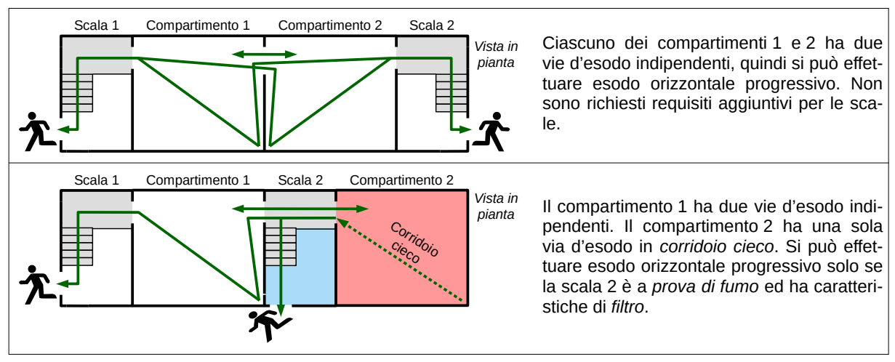

<span id="page-162-1"></span>*Tabella S.4-37: Esempi di esodo orizzontale progressivo*

<span id="page-162-2"></span>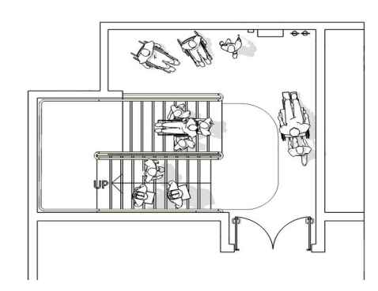

*Illustrazione S.4-6: Esempio di spazio calmo (area of rescue assistance) secondo norma ISO 21542*

## **S.4.10 Requisiti antincendio aggiuntivi per l'esodo**

- <span id="page-163-0"></span>1. In relazione alla presenza di *requisiti antincendio aggiuntivi*, è possibile modificare alcune delle misure indicate nel presente capitolo come di seguito specificato.
- 2. È possibile incrementare la massima *lunghezza d'esodo* Les della tabella [S.4-25](#page-150-2) come segue:

$$L_{es,d} = (1 + \delta_m) \cdot L_{es}$$
 S.4-5

con:

Les,d max lunghezza d'esodo di progetto [m]

δ<sup>m</sup> fattore calcolato secondo comma [4](#page-163-2)

3. È possibile incrementare la massima *lunghezza di corridoio cieco* Lcc della tabella [S.4-18](#page-147-1) come segue:

$$L_{cc,d} = (1 + \delta_m) \cdot L_{cc}$$
 S.4-6

con:

Lcc,d max lunghezza corridoio cieco di progetto [m]

δ<sup>m</sup> fattore calcolato secondo comma [4](#page-163-2)

<span id="page-163-2"></span>4. Il fattore δm tiene conto dei differenti *requisiti antincendio aggiuntivi* del compartimento servito dalla via d'esodo ed è calcolato come segue:

$$\delta_{m} = \sum_{i} \delta_{m,i}$$
 S.4-7

con:

δm,i fattore relativo a *requisito antincendio aggiuntivo* della tabella [S.4-38](#page-163-1) In nessun caso δm può superare la massima variazione ammessa pari al 36%.

5. Per i compartimenti con profilo di rischio Rvita pari ad A4 non è ammesso effettuare alcuna variazione dei valori delle tabelle [S.4-18](#page-147-1) e [S.4-25](#page-150-2).

| Requisiti antincendio aggiuntivi | δm,i | | |
|------------------------------------------------------------------------|---------------------------|-----|--|
| Rivelazione ed allarme di livello di prestazione IV (capitolo | S.7) | 15% | |
| Controllo di fumi e calore di livello di prestazione III (capitolo | S.8) | 20% | |
| | ≤<br>3<br>m | 0% | |
| Altezza media del locale servito<br>dalla via d'esodo, hm in metri [1] | ><br>3<br>m, ≤<br>4<br>m | 5% | |
| | ><br>4<br>m, ≤<br>5<br>m | 10% | |
| | ><br>5<br>m, ≤<br>6<br>m | 15% | |
| | ><br>6<br>m, ≤<br>7<br>m | 18% | |
| | ><br>7<br>m, ≤<br>8<br>m | 21% | |
| | ><br>8<br>m, ≤<br>9<br>m | 24% | |
| | ><br>9<br>m, ≤<br>10<br>m | 27% | |
| | ><br>10<br>m | 30% | |

<span id="page-163-1"></span>*Tabella S.4-38: Parametri per la definizione dei fattori δm,i*

#### S.4.11 Esodo per attività all'aperto

<span id="page-164-2"></span>Nota La definizione di attività all'aperto si trova nel capitolo G.1.

Nota Il sistema d'esodo delle *attività all'aperto* è dimensionato limitando la massima durata di tempo $\Delta t_{coda}$ che gli occupanti passano in coda lungo le vie d'esodo prima di potersi allontanare, come descritto nei riferimenti di cui al paragrafo S.4.12.

1. Nelle *attività all'aperto* la probabilità che gli effetti dell'incendio impediscano l'esodo degli occupanti è considerata meno rilevante rispetto alle altre attività, perché fumo e calore dell'incendio si disperdono direttamente in atmosfera.

Il sistema d'esodo delle attività all'aperto deve essere progettato come descritto in questo capitolo, applicando nella loro completezza le indicazioni complementari di cui al presente paragrafo.

Nota È esclusa dal presente paragrafo la progettazione del sistema d'esodo fino a *luogo sicuro* di eventuali porzioni al chiuso di *attività all'aperto*.

<span id="page-164-1"></span>2. I requisiti antincendio aggiuntivi del paragrafo S.4.10 non sono applicabili.

## S.4.11.1 Progettazione del sistema d'esodo all'aperto

#### S.4.11.1.1 Corridoi ciechi

1. I massimi affollamenti e le massime lunghezze di corridoio cieco $L_{cc}$ della tabella S.4-18 sono raddoppiati.

## S.4.11.1.2 Lunghezze d'esodo

1. La verifica delle lunghezze d'esodo $L_{\mbox{\tiny es}}$ del paragrafo S.4.8.3 può essere omessa.

#### S.4.11.1.3 Larghezza delle vie d'esodo

- 1. La tabella S.4-27, relativa a "*Larghezze unitarie per vie d'esodo orizzontali*", è *sostituita* dalla tabella S.4-39.
- 2. La tabella S.4-29, relativa a "Larghezze unitarie per vie di esodo verticali", è sostituita dalla tabella S.4-40.

# S.4.11.2 Eliminazione o superamento delle barriere architettoniche per l'esodo all'aperto

- <span id="page-164-0"></span>1. È possibile impiegare come *spazio calmo* uno *spazio a cielo libero* con caratteristiche pari a quelle del *luogo sicuro* (paragrafo S.4.5.1), chiaramente delimitato e contiguo ad una via d'esodo, a tal scopo esclusivamente destinato e facilmente raggiungibile dai soccorritori.
- 2. È possibile effettuare *esodo orizzontale progressivo* verso *spazio a cielo libero* con caratteristiche pari a quelle del *luogo sicuro* (paragrafo S.4.5.1), chiaramente delimitato e contiguo ad una via d'esodo, a tal scopo esclusivamente destinato e facilmente raggiungibile dai soccorritori.

| Rvita | Larghezza unitaria | Δtcoda |
|--------------------|--------------------|----------|
| A1, A2 | 1,90 | 600<br>s |
| B1, B2, C1, E1, E2 | 2,40 | 460<br>s |
| Altri casi | 3,70 | 300<br>s |

I valori delle larghezze unitarie sono espressi in mm/persona ed assicurano una durata dell'attesa in coda, per gli occupanti che impiegano la specifica via d'esodo, non superiore a Δtcoda.

<span id="page-165-1"></span>*Tabella S.4-39: Larghezze unitarie per vie d'esodo orizzontali da attività all'aperto*

| Rvita | Numero totale dei piani serviti dalla via d'esodo verticale | | | | | | | | Δtcoda | | |
|--------------------|-------------------------------------------------------------|------|------|------|------|------|------|------|--------|--------|----------|
| | 1 | 2 | 3 | 4 | 5 | 6 | 7 | 8 | 9 | ><br>9 | |
| A1, A2 | 2,20 | 2,10 | 1,95 | 1,85 | 1,75 | 1,70 | 1,60 | 1,55 | 1,50 | 1,40 | 600<br>s |
| B1, B2, C1, E1, E2 | 2,85 | 2,65 | 2,45 | 2,30 | 2,15 | 2,05 | 1,95 | 1,85 | 1,75 | 1,65 | 460<br>s |
| Altri casi | 4,40 | 4,05 | 3,75 | 3,50 | 3,30 | 3,10 | 2,95 | 2,75 | 2,65 | 2,50 | 300<br>s |

I valori delle larghezze unitarie sono espressi in mm/persona ed assicurano una durata dell'attesa in coda, per gli occupanti che impiegano la specifica via d'esodo, non superiore a Δtcoda.

I valori delle larghezze unitarie devono essere incrementati per le *scale* secondo le indicazioni della tabella [S.4-](#page-154-3) [30,](#page-154-3) oppure per le *rampe* secondo le indicazioni della tabella [S.4-31](#page-154-2).

<span id="page-165-0"></span>*Tabella S.4-40: Larghezze unitarie per vie d'esodo verticali da attività all'aperto*

#### S.4.12 Riferimenti

- <span id="page-166-0"></span>1. Si indicano i seguenti riferimenti:
 - a. ISO 13571 "Life-threatening components of fire Guidelines for the estimation of time to compromised tenability in fires";
 - b. ISO/TR 16738 "Fire-safety engineering Technical information on methods for evaluating behaviour and movement of people".
 - c. ISO 21542 "Building construction Accessibility and usability of the built environment";
 - d. UNI EN 17210 "Accessibilità e fruibilità dell'ambiente costruito Requisiti funzionali";
 - e. BS 9999, Section 5 "Designing means of escape";
 - f. IFC, "International Fire Code 2009", Chapter 10;
 - g. NFPA 101 "Life safety code", Chapter 7;
 - h. "The SFPE Handbook of fire protection engineering", 5<sup>th</sup> edition, SFPE/NF-PA, 2016;
 - i. UK (England) Department of Health, "Health Technical Memorandum 05-02: Firecode Guidance in support of functional provisions (Fire safety in the design of healthcare premises)", 2014;
 - j. UK (England) Department for Communities and Local Government Publications, "Technical Risk Assessment Guide on Transport Premises and Facilities", 2007;
 - k. UK (England) Sports Grounds Safety Authority (SGSA), "Safety of Sports Grounds Guidance Green Guide", 6th Edition, 2018;
 - l. Gissi E, Ronchi E, Purser D A, "*Transparency vs magic numbers: The development of stair design requirements in the Italian Fire Safety Code*", Fire Safety Journal, 91, 882–891, 2017;
 - m. Fruin J J, "*The causes and prevention of crowd disasters*", First International Conference on Engineering for Crowd Safety, London, England, 1993.
 - n. Still G K, "Introduction to Crowd Science", CRC Press, 2014.

## **STRATEGIA ANTINCENDIO Capitolo S.5 Gestione della sicurezza antincendio**

<span id="page-168-0"></span>[Premessa](#page-169-2)

[Livelli di prestazione](#page-169-1)

[Criteri di attribuzione dei livelli di prestazione](#page-169-0)

[Soluzioni progettuali](#page-170-1)

[Soluzioni conformi](#page-170-0) [Soluzioni alternative](#page-171-0)

[Misure di prevenzione degli incendi](#page-172-0)

[Progettazione della gestione della sicurezza](#page-173-0)

[Gestione della sicurezza nell'attività in esercizio](#page-175-2)

[Registro dei controlli](#page-175-1)

[Piano per il mantenimento del livello di sicurezza antincendio](#page-175-0)

[Controllo e manutenzione di impianti ed attrezzature antincendio](#page-177-1)

[Preparazione all'emergenza](#page-177-0)

[Preparazione all'emergenza in attività caratterizzate da promiscuità strutturale, impiantistica, dei sistemi di vie d'esodo](#page-179-0)

[Centro di gestione delle emergenze](#page-180-2)

[Unità gestionale GSA](#page-180-1)

[Revisione periodica](#page-180-0)

[Gestione della sicurezza in emergenza](#page-181-0)

[Riferimenti](#page-181-1)

#### **S.5.1 Premessa**

<span id="page-169-2"></span>1. La *gestione della sicurezza antincendio* (GSA) rappresenta la misura antincendio organizzativa e gestionale dell'attività atta a garantirne, nel tempo, un adeguato livello di sicurezza in caso di incendio.

## **S.5.2 Livelli di prestazione**

<span id="page-169-1"></span>1. La tabella [S.5-1](#page-169-4) riporta i livelli di prestazione attribuibili all'*attività* per la presente misura antincendio.

| Livello di<br>prestazione | Descrizione |
|---------------------------|----------------------------------------------------------------------------------------------------------------------------------------------------------|
| I | Gestione della sicurezza antincendio per il mantenimento delle condizioni di esercizio e di<br>risposta all'emergenza |
| II | Gestione della sicurezza antincendio per il mantenimento delle condizioni di esercizio e di<br>risposta all'emergenza con struttura di supporto |
| III | Gestione della sicurezza antincendio per il mantenimento delle condizioni di esercizio e di<br>risposta all'emergenza con struttura di supporto dedicata |

<span id="page-169-4"></span>*Tabella S.5-1: Livelli di prestazione*

## **S.5.3 Criteri di attribuzione dei livelli di prestazione**

<span id="page-169-0"></span>1. La tabella [S.5-2](#page-169-3) riporta i criteri *generalmente accettati* per l'attribuzione dei singoli livelli di prestazione.

| Livello di<br>prestazione | Criteri di attribuzione |
|---------------------------|-----------------------------------------------------------------------------------------------------------------------------------------------------------------------------------------------------------------------------------------------------------------------------------------------------------------------------------------------------------------------------------------------------------------------------------------------------------------------------------------------------------------------------------------------------------------------------------------------------------------------------------------------------------------------------------------|
| I | Attività ove siano verificate tutte le seguenti condizioni:<br>●<br>profili di rischio:<br>○<br>Rvita compresi in A1, A2;<br>○<br>Rbeni pari a 1;<br>○<br>Rambiente non significativo;<br>●<br>non prevalentemente destinata ad occupanti con disabilità;<br>●<br>tutti i piani dell'attività situati a quota compresa tra -10<br>m e 54<br>m;<br>●<br>carico di incendio specifico qf ≤<br>1200<br>MJ/m2<br>;<br>●<br>non si detengono o trattano sostanze o miscele pericolose in quantità significative;<br>●<br>non si effettuano lavorazioni pericolose ai fini dell'incendio. |
| II | Attività non ricomprese negli altri criteri di attribuzione |
| III | Attività ove sia verificato almeno una delle seguenti condizioni:<br>●<br>profilo di rischio Rbeni compreso in 3, 4;<br>●<br>se aperta al pubblico: affollamento complessivo ><br>300<br>occupanti;<br>●<br>se non aperta al pubblico: affollamento complessivo ><br>1000<br>occupanti;<br>●<br>numero complessivo di posti letto ><br>100 e profili di rischio Rvita compresi in D1, D2, Ciii1,<br>Ciii2, Ciii3;<br>●<br>si detengono o trattano sostanze o miscele pericolose in quantità significative ed affolla<br>mento complessivo ><br>25<br>occupanti;<br>●<br>si effettuano lavorazioni pericolose ai fini dell'incendio ed affollamento complessivo<br>><br>25<br>occupanti. |

<span id="page-169-3"></span>*Tabella S.5-2: Criteri di attribuzione dei livelli di prestazione*

## **S.5.4 Soluzioni progettuali**

#### **S.5.4.1 Soluzioni conformi**

<span id="page-170-1"></span><span id="page-170-0"></span>1. Le soluzioni conformi per ciascun livello di prestazione sono riportate nelle tabelle [S.5-3,](#page-170-3) [S.5-4](#page-170-2) e [S.5-5.](#page-171-1)

| Struttura<br>organizzativa minima | Compiti e funzioni | | |
|----------------------------------------|---------------------------------------------------------------------------------------------------------------------------------------------------------------------------------------------------------------------------------------------------------------------------------------------------------------------------|--|--|
| Responsabile<br>dell'attività | ●<br>organizza la GSA in esercizio;<br>●<br>organizza la GSA in emergenza;<br>●<br>[1] predispone, attua e verifica periodicamente il piano d'emergenza;<br>●<br>[1] provvede alla formazione ed informazione del personale su procedure ed at<br>trezzature;<br>●<br>[1] nomina le figure della struttura organizzativa. | | |
| [1] Addetti al servizio<br>antincendio | Attuano la GSA in esercizio ed in emergenza. | | |
| GSA in esercizio | Come prevista al paragrafo<br>S.5.7, limitatamente ai paragrafi<br>S.5.7.1, S.5.7.3, S.5.7.4,<br>S.5.7.5 e<br>S.5.7.8. | | |
| GSA in emergenza | Come prevista al paragrafo<br>S.5.8 | | |
| [1] Solo se attività lavorativa | | | |

<span id="page-170-3"></span>*Tabella S.5-3: Soluzioni conformi per il livello di prestazione I*

| Struttura<br>organizzativa minima | Compiti e funzioni | |
|---------------------------------------------------------------|--------------------------------------------------------------------------------------------------------------------------------------------------------------------------------------------------------------------------------------------------------------------------------------------------------------------------------------------------------------------------------------------------------------------------------------------------------------------------------------------------------|--|
| Responsabile<br>dell'attività | ●<br>organizza la GSA in esercizio;<br>●<br>organizza la GSA in emergenza;<br>●<br>[1] predispone, attua e verifica periodicamente il piano d'emergenza;<br>●<br>[1] provvede alla formazione ed informazione del personale su procedure ed at<br>trezzature. | |
| [1] Coordinatore degli<br>addetti del servizio<br>antincendio | Addetto al servizio antincendio, individuato dal responsabile dell'attività, che:<br>●<br>sovraintende ai servizi relativi all'attuazione delle misure antincendio previste;<br>●<br>coordina operativamente gli interventi degli addetti al servizio antincendio e la<br>messa in sicurezza degli impianti;<br>●<br>si interfaccia con i responsabili delle squadre dei soccorritori;<br>●<br>segnala al responsabile dell'attività eventuali necessità di modifica delle procedu<br>re di emergenza. | |
| [1] Addetti al servizio<br>antincendio | Attuano la GSA in esercizio ed in emergenza. | |
| GSA in esercizio | Come prevista al paragrafo<br>S.5.7, escluse le prescrizioni del paragrafo<br>S.5.7.7, con<br>possibilità di prevedere il centro di gestione delle emergenze di cui al paragra<br>fo<br>S.5.7.6. | |
| GSA in emergenza | Come prevista al paragrafo<br>S.5.8 | |
| [1] Solo se attività lavorativa | | |

<span id="page-170-2"></span>*Tabella S.5-4: Soluzioni conformi per il livello di prestazione II*

| Struttura organizzativa minima | Compiti e funzioni |
|---------------------------------------------------------------|--------------------------------------------------------------------------------------------------------------------------------------------------------------------------------------------------------------------------------------------------------------------------------------------------------------------------------------------------------------------------------------------------------------------------------------------------------------------------------------------------------------------------------------------------------------------------------------------------------------|
| Responsabile<br>dell'attività | <ul> <li>organizza la GSA in esercizio;</li> <li>organizza la GSA in emergenza;</li> <li>[1] predispone, attua e verifica periodicamente il piano d'emergenza;</li> <li>[1] provvede alla formazione ed informazione del personale su procedure ed attrezzature;</li> <li>[1] nomina le figure della struttura organizzativa;</li> <li>istituisce l'unità gestionale GSA (paragrafo S.5.7.7).</li> </ul> |
| [1] Coordinatore unità gestionale GSA | Coordina le attività di cui al paragrafo S.5.7.7. |
| [1] Coordinatore degli<br>addetti del servizio<br>antincendio | <ul> <li>Addetto al servizio antincendio, individuato dal responsabile dell'attività, che:</li> <li>sovraintende ai servizi relativi all'attuazione delle misure antincendio previste;</li> <li>programma la turnazione degli addetti del servizio antincendio;</li> <li>coordina operativamente gli interventi degli addetti al servizio antincendio e la messa in sicurezza degli impianti;</li> <li>si interfaccia con i responsabili delle squadre dei soccorritori;</li> <li>segnala al coordinatore dell'unità gestionale GSA eventuali necessità di modifica delle procedure di emergenza.</li> </ul> |
| [1] Addetti al servizio<br>antincendio | Attuano la GSA in esercizio ed in emergenza. |
| GSA in esercizio | Come prevista al paragrafo S.5.7 |
| GSA in emergenza | Come prevista al paragrafo S.5.8 |
| [1] Solo se attività lavora | tiva |

<span id="page-171-1"></span>Tabella S.5-5: Soluzioni conformi per il livello di prestazione III

#### S.5.4.2 Soluzioni alternative

- <span id="page-171-0"></span>1. Sono ammesse *soluzioni alternative* per tutti i livelli di prestazione.
- 2. Al fine di dimostrare il raggiungimento del *livello di prestazione*, il progettista deve impiegare uno dei metodi del paragrafo G.2.7.
- 3. In tabella S.5-6 sono riportate alcune modalità *generalmente accettate* per la progettazione di soluzioni alternative. Il progettista può comunque impiegare modalità diverse da quelle elencate.

| Oggetto della soluzione | Modalità progettuale |
|-------------------------|-------------------------------------------------------------------------------------------------------------------------------------------------------------------------------------------------------------------------------|
| Qualsiasi | Si applichi volontariamente all'attività un <i>sistema di gestione di sicurezza e</i> salute sui luoghi di lavoro (SGSSL) (es. secondo linee guida UNI INAIL, norma UNI ISO 45001,), nel rispetto dei livelli di prestazione. |

<span id="page-171-2"></span>*Tabella S.5-6: Modalità progettuali per soluzioni alternative* 

#### **S.5.5 Misure di prevenzione degli incendi**

- <span id="page-172-0"></span>1. Le misure di prevenzione degli incendi devono essere individuate nella prima fase della valutazione del rischio (capitolo [G.2\)](#page-36-0). Per ciascun elemento identificato come pericoloso ai fini antincendio, è necessario valutare se esso possa essere eliminato, ridotto, sostituito, separato o protetto da altre parti dell'attività.
- 2. Si riportano, a titolo esemplificativo, alcune azioni elementari per la prevenzione degli incendi:
 - a. *pulizia* dei luoghi ed *ordine* ai fini della riduzione sostanziale:
 - i. della probabilità di innesco di incendi (es. riduzione delle polveri, dei materiali stoccati scorrettamente o al di fuori dei locali deputati, …),
 - ii. della velocità di crescita dei focolari (es. la stessa quantità di carta correttamente archiviata in armadi metallici riduce la velocità di propagazione dell'incendio);
 - b. riduzione degli *inneschi;*

Nota Siano identificate e controllate le potenziali sorgenti di innesco (es. uso di fiamme libere non autorizzato, fumo in aree ove sia vietato, apparecchiature elettriche malfunzionanti o impropriamente impiegate, …); a tal fine si può far riferimento anche agli inneschi definiti al capitolo [V.2;](#page-240-0)

- c. riduzione del *carico di incendio;*
- d. sostituzione di materiali combustibili con velocità di propagazione dell'incendio rapida, con altri con velocità d'incendio più lenta;
- e. controllo e manutenzione regolare dei sistemi, dispositivi, attrezzature e degli impianti rilevanti ai fini della sicurezza antincendio;
- f. controllo degli accessi e sorveglianza, senza che ciò possa limitare la disponibilità del sistema d'esodo;
- g. gestione dei lavori di manutenzione o di modifica dell'attività; il rischio d'incendio aumenta notevolmente quando si effettuano lavori di manutenzione ordinaria e straordinaria e di modifica, in quanto possono essere:
 - i. condotte operazioni pericolose (es. lavori a caldo, …);
 - ii. temporaneamente disattivati impianti di sicurezza;
 - iii. temporaneamente sospesa la continuità di compartimentazione;
 - iv. impiegate sostanze o miscele pericolose (es. solventi, colle, …).

Tali sorgenti di rischio aggiuntive, generalmente non considerate nella progettazione antincendio iniziale, devono essere specificamente affrontate (es. se previsto nel DVR, …).

- h. in attività lavorative, *formazione* ed *informazione* del personale ai rischi specifici dell'attività, secondo la normativa vigente;
- i. istruzioni e segnaletica contenenti i divieti e le precauzioni da osservare.
- 3. Le misure di prevenzione degli incendi identificate nella fase di valutazione del rischio sono vincolanti per l'esercizio dell'attività.

## **S.5.6 Progettazione della gestione della sicurezza**

- <span id="page-173-0"></span>1. La corretta progettazione della gestione della sicurezza implica uno scambio di informazioni tra progettista e responsabile dell'attività come indicato in tabella [S.5-7](#page-174-0).
- 2. Il processo progettuale descritto nella tabella [S.5-7](#page-174-0) deve essere esplicitato nella relazione tecnica. Tutte le informazioni indispensabili al responsabile dell'attività per la gestione della sicurezza antincendio durante il normale esercizio ed in emergenza devono essere elencate in apposita sezione della relazione tecnica.
- 3. Nella relazione tecnica devono essere documentate:
 - a. limitazioni d'esercizio dell'attività (es. tipologia degli occupanti, massimo affollamento dei locali, tipologia degli arredi e dei materiali, massime quantità di materiali combustibili stoccabili, …) assunte come ipotesi della progettazione antincendio durante la valutazione del rischio di incendio e la conseguente identificazione dei profili di rischio dell'attività;
 - b. indicazioni sulle misure antincendio specifiche per la tipologia d'attività, risultanti dalla valutazione del rischio di incendio;
 - c. indicazioni sulla manutenzione ed il controllo periodico dei sistemi rilevanti ai fini della sicurezza antincendio;
 - d. indicazioni sul numero di occupanti, sul livello di formazione ed addestramento richiesto per il personale o per gli addetti al servizio antincendio in riferimento a particolari scelte progettuali di sicurezza antincendio. Ad esempio:
 - i. se l'attività è lavorativa, la relazione tecnica deve riportare i contenuti principali del piano di emergenza, ivi inclusi il numero di addetti alla gestione delle emergenze ed il loro livello di formazione;
 - ii. se è prevista la procedura d'*esodo per fasi* in un'attività lavorativa, il personale addetto al servizio antincendio deve essere in grado di assistere l'esodo degli occupanti, anche coloro con specifiche esigenze, affinché il sistema d'esodo sia impiegato efficacemente secondo le condizioni progettuali; a tal fine il suddetto personale deve essere adeguatamente formato;
 - iii. se è prevista l'attivazione di sistemi di protezione attiva, il personale deve essere formato ed addestrato a tale scopo.
 - e. i rischi d'incendio relativi alla presenza di aree a rischio specifico, di cui si è tenuto conto nella progettazione dei sistemi protettivi, e le relative misure antincendio;
 - f. indicazioni per la gestione dell'emergenza: modalità di gestione dell'esodo, di lotta all'incendio, di protezione dei beni e dell'ambiente dagli effetti dell'incendio, come previsti durante la progettazione dell'attività.

| Responsabile dell'attività | Progettista | |
|------------------------------------------------------------------------------------------------------------------------------------------------------------------------------------------------------------------------------------------------------------------------------------------------------------------------|-----------------------------------------------------------------------------------------------------------------------------------------------------------------------------------------------------------------------------------------------------------------------------------------------------------------------------------------------------------------------------|--|
| Fornisce al progettista le informazioni relative ai pericoli<br>di incendio e tutti gli altri dati di input sull'attività neces<br>sari ai fini della valutazione del rischio di incendio (capi<br>tolo<br>G.2). [1] | Riceve le informazioni dal responsabile dell'attività | |
| Valutano congiuntamente le misure di prevenzione incendi come da paragrafo<br>S.5.5<br>[1] | | |
| Valutano il rischio di incendio dell'attività e ne definiscono la strategia antincendio [1] | | |
| Contribuisce all'attività di progettazione della GSA. [1] | Definisce e documenta il modello della GSA. | |
| Attua le limitazioni e le modalità d'esercizio ammesse<br>per l'appropriata gestione della sicurezza antincendio<br>dell'attività, al fine di limitare la probabilità d'incendio,<br>garantire il corretto funzionamento dei sistemi di sicu<br>rezza e la gestione dell'emergenza qualora si sviluppi<br>un incendio, | Fornisce al responsabile dell'attività le indicazioni, le li<br>mitazioni e le modalità d'esercizio ammesse per<br>l'appropriata gestione della sicurezza antincendio<br>dell'attività, al fine di limitare la probabilità d'incendio,<br>garantire il corretto funzionamento dei sistemi di sicu<br>rezza e la gestione dell'emergenza qualora si sviluppi<br>un incendio, | |
| [1] Il committente si relaziona direttamente con il progettista nel caso in cui il responsabile dell'attività non sia<br>noto in fase di progettazione. | | |

<span id="page-174-0"></span>*Tabella S.5-7: Compiti di progettista e responsabile dell'attività in materia di progettazione della GSA*

#### **S.5.7 Gestione della sicurezza nell'attività in esercizio**

- <span id="page-175-2"></span>1. La corretta gestione della sicurezza antincendio in esercizio contribuisce all'efficacia delle altre misure antincendio adottate.
- 2. La gestione della sicurezza antincendio durante l'esercizio dell'attività deve prevedere almeno:
 - a. la riduzione della probabilità di insorgenza di un incendio, adottando misure di prevenzione incendi, buona pratica nell'esercizio e programmazione della manutenzione, come riportato al paragrafo [S.5.5](#page-172-0);
 - b. il controllo e manutenzione di impianti e attrezzature antincendio, di cui ai paragrafi [S.5.7.1](#page-175-1) e [S.5.7.3;](#page-177-1)
 - c. la preparazione alla gestione dell'emergenza, tramite la pianificazione delle azioni da eseguire in caso di emergenza, esercitazioni antincendio e prove d'evacuazione periodiche, di cui ai paragrafi [S.5.7.4](#page-177-0) e [S.5.7.5](#page-179-0).

Nota La pianificazione deve prevedere tutte le azioni fino al ripristino delle condizioni di sicurezza dell'attività.

## **S.5.7.1 Registro dei controlli**

- <span id="page-175-1"></span>1. Il responsabile dell'attività deve predisporre un registro dei controlli periodici dove siano annotati:
 - a. i controlli, le verifiche, gli interventi di manutenzione su sistemi, dispositivi, attrezzature e le altre misure antincendio adottate;
 - b. le attività di informazione, formazione ed addestramento, ai sensi della normativa vigente per le attività lavorative;
 - c. le prove di evacuazione.
- 2. Tale registro deve essere mantenuto costantemente aggiornato e disponibile per gli organi di controllo.

#### **S.5.7.2 Piano per il mantenimento del livello di sicurezza antincendio**

- <span id="page-175-0"></span>1. Ove previsto dalla soluzione progettuale individuata, il responsabile dell'attività deve curare la predisposizione di un piano finalizzato al mantenimento delle condizioni di sicurezza, al rispetto dei divieti, delle limitazioni e delle condizioni di esercizio.
- 2. Sulla base della valutazione del rischio dell'attività e delle risultanze della progettazione, il piano deve prevedere:
 - a. le attività di controllo per prevenire gli incendi secondo le disposizioni vigenti;
 - b. la programmazione dell'attività di informazione, formazione e addestramento del personale addetto alla struttura, comprese le esercitazioni all'uso dei mezzi antincendio e di evacuazione in caso di emergenza, tenendo conto della valutazione del rischio dell'attività;
 - c. la specifica informazione agli occupanti;
 - d. i controlli delle vie di esodo per garantirne la fruibilità e della segnaletica di sicurezza;

- e. la programmazione della manutenzione di sistemi, dispositivi, attrezzature e impianti rilevanti ai fini della sicurezza antincendio;
- f. le procedure per l'esecuzione delle manutenzioni ordinarie e straordinarie e delle modifiche, che comprendano almeno:
 - i. l'individuazione dei pericoli e la valutazioni dei rischi legati all'intervento di modifica o di manutenzione;
- Nota La valutazione dei rischi legati all'intervento deve evidenziare anche se la modifica o la manutenzione, ai fini della sicurezza antincendio, è non rilevante, rilevante ma senza aggravio di rischio, con aggravio di rischio.
 - ii. le misure di sicurezza da implementare;
 - iii. l'assegnazione delle responsabilità;
 - iv. le eventuali altre azioni necessarie in fase di esecuzione o successivamente all'intervento;
- Nota Tra le azioni necessarie possono essere incluse attività di informazione o formazione, aggiorna menti di piani di manutenzione, aggiornamento del DVR, aggiornamento dei documenti della GSA, …
 - g. la programmazione della revisione periodica di cui al paragrafo [S.5.7.8](#page-180-0).

## **S.5.7.3 Controllo e manutenzione di impianti ed attrezzature antincendio**

- <span id="page-177-1"></span>1. Il controllo e la manutenzione degli impianti e delle attrezzature antincendio devono essere effettuati nel rispetto delle disposizioni legislative e regolamentari vigenti, secondo la regola dell'arte in accordo a norme, TS e TR pertinenti, ed al manuale di uso e manutenzione dell'impianto e dell'attrezzatura.
- 2. Il manuale di uso e manutenzione degli impianti e delle attrezzature antincendio è predisposto secondo la regolamentazione applicabile o normativa tecnica ed è fornito al responsabile dell'attività.

Nota La definizione di *manuale d'uso e manutenzione dell'impianto* è reperibile nel capitolo [G.1](#page-6-0).

- 3. Le operazioni di controllo e manutenzione sugli impianti e sulle attrezzature antincendio e la loro cadenza temporale sono almeno quelle indicate da norme, TS e TR pertinenti, nonché dal manuale d'uso e manutenzione dell'impianto.
- 4. La manutenzione sugli impianti e sulle attrezzature antincendio è svolta da personale esperto in materia, sulla base della regola dell'arte, che garantisce la corretta esecuzione delle operazioni svolte.
- 5. La tabella [S.5-8](#page-177-2) indica le principali norme di riferimento per la manutenzione ed il controllo di impianti ed attrezzature antincendio.

| Impianto o attrezzatura antincendio | Norme e TS<br>per verifica, controllo, manutenzione |
|-----------------------------------------------|-----------------------------------------------------|
| Estintori | UNI 9994-1 |
| RI | UNI 10779, UNI EN 671-3, UNI EN 12845 |
| SPK | UNI EN 12845 |
| IRAI | UNI 11224 |
| SEFC | UNI 9494-3 |
| Sistemi a pressione differenziale | UNI EN 12101-6 |
| Sistemi a polvere | UNI EN 12416-2 |
| Sistemi a schiuma | UNI EN 13565-2 |
| Sistemi spray ad acqua | UNI CEN/TS 14816 |
| Sistema estinguente ad aerosol condensato | UNI ISO 15779 |
| Sistemi a riduzione di ossigeno | UNI EN 16750 |
| Porte e finestre apribili resistenti al fuoco | UNI 11473 |
| Sistemi di spegnimento ad estinguente gassoso | UNI 11280 |

<span id="page-177-2"></span>*Tabella S.5-8: Norme e TS per verifica, controllo e manutenzione di impianti e attrezzature antincendio*

#### **S.5.7.4 Preparazione all'emergenza**

- <span id="page-177-0"></span>1. La preparazione all'emergenza, nell'ambito della gestione della sicurezza antincendio, si esplica:
 - a. tramite pianificazione delle azioni da eseguire in caso d'emergenza, in risposta agli scenari incidentali ipotizzati;
 - b. nelle attività lavorative, con la formazione ed addestramento periodico del personale addetto all'attuazione del piano d'emergenza e con prove di eva-

- cuazione. La frequenza delle prove di attuazione del piano di emergenza deve tenere conto della complessità dell'attività e dell'eventuale sostituzione del personale impiegato.
- 2. Gli adempimenti minimi per la preparazione all'emergenza sono riportati in tabella S.5-9.
- 3. La preparazione all'emergenza deve includere planimetrie e documenti nei quali siano riportate tutte le informazioni necessarie alla gestione dell'emergenza, comprese le istruzioni o le procedure per l'esodo degli occupanti, indicando in particolare le misure di assistenza agli occupanti con specifiche necessità.
- Nota Ad esempio: indicazione dei compiti e funzioni in emergenza mediante predisposizione di una *catena di comando e controllo*, destinazioni delle varie aree dell'attività, compartimentazioni antincendio, sistema d'esodo, aree a rischio specifico, dispositivi di disattivazione degli impianti e di attivazione di sistemi di sicurezza, ...
 - 4. In prossimità degli accessi di ciascun piano dell'attività, devono essere esposte:
 - a. planimetrie esplicative del sistema d'esodo e dell'ubicazione delle attrezzature antincendio;
 - b. istruzioni sul comportamento degli occupanti in caso di emergenza.

| Livello di<br>prestazione | Preparazione all'emergenza | |
|---------------------------|-------------------------------------------------------------------------------------------------------------------------------------------------------------------------------------------------------------------------------------------------------------------------------------------------------------------------------------------------------------------------------------|--|
| I | La preparazione all'emergenza può essere limitata all'informazione al personale ed agli occu<br>panti sui comportamenti da tenere. Essa deve comprendere: | |
| | ●<br>istruzioni per la chiamata del soccorso pubblico e le informazioni da fornire per consentire<br>un efficace soccorso; | |
| | ●<br>istruzioni di primo intervento antincendio, attraverso: | |
| | ○<br>azioni del responsabile dell'attività in rapporto alle squadre di soccorso; | |
| | ○<br>azioni degli eventuali addetti antincendio in riferimento alla lotta antincendio ed all'eso<br>do, ivi compreso l'impiego di dispositivi di protezione ed attrezzature; | |
| | ○<br>azioni per la messa in sicurezza di apparecchiature ed impianti; | |
| | ●<br>istruzioni per l'esodo degli occupanti, anche per mezzo di idonea segnaletica; | |
| | ●<br>istruzioni generali per prestare assistenza agli occupanti con specifiche necessità; | |
| | ●<br>istruzioni specifiche per prestare assistenza agli occupanti con specifiche necessità, in ca<br>so di presenza non occasionale; | |
| | ●<br>Istruzioni per il ripristino delle condizioni di sicurezza dopo l'emergenza. | |
| II, III | La preparazione all'emergenza deve prevedere le procedure per la gestione dell'emergenza. In<br>particolare: | |
| | ●<br>procedure di allarme: modalità di allarme, informazione agli occupanti, modalità di diffusio<br>ne dell'ordine di evacuazione; | |
| | ●<br>procedure di attivazione del centro di gestione delle emergenze, se previsto; | |
| | ●<br>procedure di comunicazione interna e verso gli enti di soccorso pubblico: devono essere<br>chiaramente definite le modalità e strumenti di comunicazione tra gli addetti del servizio<br>antincendio e il centro di gestione dell'emergenza, ove previsto, individuate le modalità di<br>chiamata del soccorso pubblico e le informazioni da fornire alle squadre di soccorso; | |
| | ●<br>procedure di primo intervento antincendio, che devono prevedere le azioni della squadra<br>antincendio per lo spegnimento di un principio di incendio, per l'assistenza degli occupanti<br>nella evacuazione, per la messa in sicurezza delle apparecchiature o impianti; | |
| | ●<br>procedure per l'esodo degli occupanti e le azioni di facilitazione dell'esodo; | |
| | ●<br>procedure per assistere occupanti con ridotte o impedite capacità motorie, sensoriali e co<br>gnitive o con specifiche necessità; | |
| | ●<br>procedure di messa in sicurezza di apparecchiature ed impianti: in funzione della tipologia<br>di impianto e della natura dell'attività, occorre definire apposite sequenze e operazioni per<br>la messa in sicurezza delle apparecchiature o impianti; | |
| | ●<br>procedure di ripristino delle condizioni di sicurezza al termine dell'emergenza: in funzione<br>della complessità della struttura devono essere definite le modalità con le quali garantire il<br>rientro in condizioni di sicurezza degli occupanti ed il ripristino dei processi ordinari<br>dell'attività. | |

<span id="page-179-1"></span>*Tabella S.5-9: Preparazione all'emergenza*

## **S.5.7.5 Preparazione all'emergenza in attività caratterizzate da promiscuità strutturale, impiantistica, dei sistemi di vie d'esodo**

- <span id="page-179-0"></span>1. Qualora attività caratterizzate da promiscuità strutturale, impiantistica, o dei sistemi di vie d'esodo siano esercite da responsabili dell'attività diversi, le pianificazioni d'emergenza delle singole attività devono tenere conto di eventuali interferenze o relazioni con le attività limitrofe.
- 2. Deve essere prevista una pianificazione delle azioni d'emergenza di sito in cui siano descritte le procedure di risposta all'emergenza per le parti comuni e per le eventuali interferenze tra le attività ai fini della sicurezza antincendio.

#### **S.5.7.6 Centro di gestione delle emergenze**

- <span id="page-180-2"></span>1. Ove previsto dalla soluzione progettuale individuata, deve essere predisposto apposito *centro di gestione delle emergenze* ai fini del coordinamento delle operazioni d'emergenza, commisurato alla complessità dell'attività.
- 2. Se previsto, il centro di gestione delle emergenze deve essere costituito:
 - a. nelle *piccole attività* con profili di rischio compresi in A1, A2, A3, B1, B2, B3, C1, C2: in locale ad uso non esclusivo (es. portineria, reception, centralino, …);
 - b. nelle *altre attività*: in apposito locale ad uso esclusivo, costituente compartimento antincendio, dotato di accesso dall'esterno, anche tramite percorso protetto, segnalato.
- 3. Il centro di gestione delle emergenze deve essere fornito almeno di:
 - a. informazioni necessarie alla gestione dell'emergenza (es. pianificazioni, planimetrie, schemi funzionali di impianti, numeri telefonici, …);
 - b. strumenti di comunicazione con le squadre di soccorso, il personale e gli occupanti;
 - c. centrali di controllo degli impianti di protezione attiva o ripetizione dei segnali d'allarme.
- 4. Il centro di gestione dell'emergenza deve essere chiaramente individuato da apposita segnaletica di sicurezza.

## **S.5.7.7 Unità gestionale GSA**

- <span id="page-180-1"></span>1. L'unità gestionale GSA provvede al monitoraggio, alla proposta di revisione ed al coordinamento della GSA in emergenza.
- 2. L'unità gestionale GSA in esercizio:
 - a. attua la gestione della sicurezza antincendio attraverso la predisposizione delle procedure gestionali ed operative e di tutti i documenti della GSA;
 - b. provvede direttamente o attraverso le procedure predisposte al rilievo delle non conformità del sistema e della sicurezza antincendio, segnalandole al responsabile dell'attività;
 - c. aggiorna la documentazione della GSA in caso di modifiche.
- 3. Il coordinatore dell'unità gestionale GSA, o il suo sostituto, in emergenza:
 - a. prende i provvedimenti, in caso di pericolo grave ed immediato, anche di interruzione delle attività, fino al ripristino delle condizioni di sicurezza;
 - b. coordina il centro di gestione delle emergenze.

## **S.5.7.8 Revisione periodica**

<span id="page-180-0"></span>1. I documenti della GSA devono essere oggetto di revisione periodica a cadenza stabilita e, in ogni caso, devono essere aggiornati in occasione di modifiche dell'attività.

Nota Ad esempio, per modifiche significative ai fini della sicurezza antincendio, modifiche organizzative, variazioni delle figure addette alle funzioni indicate nelle tabelle [S.5-3](#page-170-3), [S.5-4](#page-170-2) e [S.5-5](#page-171-1), …

#### **S.5.8 Gestione della sicurezza in emergenza**

- <span id="page-181-0"></span>1. La gestione della sicurezza antincendio durante l'*emergenza* nell'attività deve prevedere almeno:
 - a. se si tratta di attività lavorativa: attivazione ed attuazione del piano di emergenza, di cui al paragrafo [S.5.7.4](#page-177-0);
 - b. se non si tratta di attività lavorativa: attivazione dei servizi di soccorso pubblico, esodo degli occupanti, messa in sicurezza di apparecchiature ed impianti;
 - c. qualora previsto, attivazione del centro di gestione delle emergenze secondo indicazioni del paragrafo [S.5.7.6](#page-180-2) o della unità gestionale GSA di cui al paragrafo [S.5.7.7](#page-180-1).
- 2. Alla rivelazione manuale o automatica dell'incendio segue generalmente:
 - a. l'immediata attivazione delle procedure d'emergenza;
 - b. nelle attività più complesse, la verifica dell'effettiva presenza di un incendio e la successiva attivazione delle procedure d'emergenza.
- 3. Nelle attività lavorative, deve essere assicurata la presenza continuativa di addetti del servizio antincendio in modo da poter attuare in ogni momento le azioni previste in emergenza.

#### **S.5.9 Riferimenti**

- <span id="page-181-1"></span>1. Si indicano i seguenti riferimenti:
 - a. UNI, INAIL, "*Linee guida per un sistema di gestione di sicurezza e salute sui luoghi di lavoro (SGSSL)*", 2011, da <
 - b. UNI ISO 45001 "*Sistemi di gestione per la salute e sicurezza sul lavoro - Requisiti e guida per l'uso*";
 - c. BS OHSAS 18001 e Linee guida BS OHSAS 18002 per la *"Valutazione della Salute e Sicurezza sul lavoro (Occupational Health and Safety Assessment Series, OHSAS)"*;
 - d. European guideline CFPA-E No 1:2014 F "*Fire protection management system*".

## **STRATEGIA ANTINCENDIO Capitolo S.6 Controllo dell'incendio**

#### <span id="page-182-0"></span>[Premessa](#page-183-1)

[Livelli di prestazione](#page-183-0)

[Criteri di attribuzione dei livelli di prestazione](#page-184-0)

#### [Soluzioni progettuali](#page-185-4)

[Soluzioni conformi per il livello di prestazione II](#page-185-3) [Soluzioni conformi per il livello di prestazione III](#page-185-2) [Soluzioni conformi per il livello di prestazione IV](#page-185-1) [Soluzioni conformi per il livello di prestazione V](#page-185-0) [Soluzioni alternative](#page-186-0)

[Classificazione dei fuochi e degli agenti estinguenti](#page-187-0)

#### [Estintori d'incendio](#page-188-2)

[Caratteristiche](#page-188-1) [Progettazione](#page-188-0)

[Estintori d'incendio carrellati](#page-191-0)

#### [Reti di idranti](#page-192-2)

[Caratteristiche](#page-192-1) [Progettazione](#page-192-0)

[Sistemi automatici di inibizione, controllo o estinzione dell'incendio](#page-193-1)

[Caratteristiche generali](#page-193-0)

[Progettazione](#page-194-0)

[Indicazioni complementari](#page-195-1)

[Segnaletica](#page-195-0)

[Riferimenti](#page-196-0)

#### **S.6.1 Premessa**

- <span id="page-183-1"></span>1. La presente misura antincendio ha come scopo l'individuazione dei presidi antincendio da installare nell'attività per:
 - a. la protezione nei confronti di un *principio di incendio*;
 - b. la protezione manuale o automatica, finalizzata all'*inibizione* o al *controllo* dell'incendio;
 - c. la protezione mediante completa *estinzione* di un incendio.
- 2. I presidi antincendio considerati sono gli estintori d'incendio ed i seguenti sistemi di protezione attiva contro l'incendio, di seguito denominati *impianti*: la rete di idranti, gli impianti manuali o automatici di inibizione controllo o di estinzione, ad acqua e ad altri agenti estinguenti.

#### **S.6.2 Livelli di prestazione**

<span id="page-183-0"></span>1. La tabella [S.6-1](#page-183-2) riporta i livelli di prestazione attribuibili agli *ambiti* dell'attività per la presente misura antincendio.

| Livello di<br>prestazione | Descrizione |
|---------------------------|-------------------------------------------------------------------------------------------------------|
| I | Nessun requisito |
| II | Estinzione di un principio di incendio |
| III | Controllo o estinzione manuale dell'incendio |
| IV | Inibizione, controllo o estinzione dell'incendio con sistemi automatici estesi a porzioni di attività |
| V | Inibizione, controllo o estinzione dell'incendio con sistemi automatici estesi a tutta l'attività |

<span id="page-183-2"></span>*Tabella S.6-1: Livelli di prestazione*

#### **S.6.3 Criteri di attribuzione dei livelli di prestazione**

<span id="page-184-0"></span>1. La tabella [S.6-2](#page-184-1) riporta i criteri *generalmente accettati* per l'attribuzione dei singoli livelli di prestazione.

| Livello di<br>prestazione | Criteri di attribuzione |
|---------------------------|--------------------------------------------------------------------------------------------------------------------------------------------------------------------------------------------------------------------------------------------------------------------------------------------------------------------------------------------------------------------------------------------------------------------------------------------------------------------------------------------------------------------------------------------------------------------------------------------------------------------------------------------------------------------------------------------------------------------------------------------|
| I | Non ammesso nelle attività soggette |
| II | Ambiti dove siano verificate tutte le seguenti condizioni:<br>●<br>profili di rischio:<br>○<br>Rvita compresi in A1, A2, B1, B2, Cii1, Cii2, Ciii1, Ciii2;<br>○<br>Rbeni pari a 1, 2;<br>○<br>Rambiente non significativo;<br>●<br>tutti i piani dell'attività situati a quota compresa tra -5<br>m e 32<br>m;<br>●<br>carico di incendio specifico qf ≤<br>600<br>MJ/m2<br>;<br>●<br>per compartimenti con qf<br>><br>200<br>MJ/m2<br>: superficie lorda ≤<br>4000<br>m2<br>;<br>●<br>per compartimenti con qf<br>≤<br>200<br>MJ/m2<br>: superficie lorda qualsiasi;<br>●<br>non si detengono o trattano sostanze o miscele pericolose in quantità significative;<br>●<br>non si effettuano lavorazioni pericolose ai fini dell'incendio. |
| III | Ambiti non ricompresi negli altri criteri di attribuzione. |
| IV | In relazione alle risultanze della valutazione del rischio nell'ambito e in ambiti limitrofi della<br>stessa attività (es.<br>ambiti di attività con elevato affollamento, ambiti di attività con geometria<br>complessa o piani interrati, elevato carico di incendio specifico qf, presenza di sostanze o mi<br>scele pericolose in quantità significative, presenza di lavorazioni pericolose ai fini dell'incen<br>dio,<br>…). |
| V | Su specifica richiesta del committente, previsti da capitolati tecnici di progetto, richiesti dalla<br>autorità competente per costruzioni destinate ad attività di particolare importanza, previsti da<br>regola tecnica verticale. |

<span id="page-184-1"></span>*Tabella S.6-2: Criteri di attribuzione dei livelli di prestazione*

#### S.6.4 Soluzioni progettuali

<span id="page-185-4"></span>Nota Il livello di prestazione I della presente misura antincendio non richiede l'applicazione di soluzioni progettuali.

- 1. La presente misura antincendio è progettata come segue:
 - a. in relazione alle risultanze della valutazione del rischio, si selezionano gli agenti estinguenti secondo le indicazioni del paragrafo S.6.5;
 - b. si dimensiona la protezione dell'intera attività o di suoi ambiti con uno o più approcci di cui ai paragrafi S.6.6, S.6.7, S.6.8 e S.6.9.
- 2. Devono essere rispettate le indicazioni dei paragrafi S.6.10 ed S.6.11 in merito alle indicazioni complementari ed alla segnaletica.

## S.6.4.1 Soluzioni conformi per il livello di prestazione II

<span id="page-185-3"></span>1. Devono essere installati estintori d'incendio a protezione dell'*intera attività*, secondo le indicazioni del paragrafo S.6.6 ed, eventualmente, S.6.7.

## S.6.4.2 Soluzioni conformi per il livello di prestazione III

- <span id="page-185-2"></span>1. Devono essere rispettate le prescrizioni del livello di prestazione II.
- 2. Deve essere installata una *rete idranti* (RI) a protezione dell'*intera attività* o di *singoli compartimenti* in relazione alle risultanze della valutazione del rischio, secondo le indicazioni del paragrafo S.6.8.

## S.6.4.3 Soluzioni conformi per il livello di prestazione IV

- <span id="page-185-1"></span>1. Devono essere rispettate le prescrizioni del livello di prestazione III.
- 2. Deve essere previsto un sistema automatico di inibizione, controllo o estinzione dell'incendio a protezione di *ambiti dell'attività* in relazione alle risultanze della valutazione del rischio, secondo le indicazioni del paragrafo S.6.9 per sistemi sprinkler o altre tipologie impiantistiche.

#### S.6.4.4 Soluzioni conformi per il livello di prestazione V

- <span id="page-185-0"></span>1. Devono essere rispettate le prescrizioni del livello di prestazione IV.
- 2. Il sistema automatico di inibizione, controllo o estinzione dell'incendio deve essere esteso a protezione dell'intera attività.

#### **S.6.4.5 Soluzioni alternative**

- <span id="page-186-0"></span>1. Sono ammesse *soluzioni alternative* per tutti i livelli di prestazione.
- 2. Al fine di dimostrare il raggiungimento del *livello di prestazione*, il progettista deve impiegare uno dei metodi del paragrafo [G.2.7.](#page-45-0)
- 3. In tabella [S.6-3](#page-186-1) sono riportate alcune modalità *generalmente accettate* per la progettazione di soluzioni alternative. Il progettista può comunque impiegare modalità diverse da quelle elencate.

| Oggetto della soluzione | Modalità progettuale |
|-------------------------------------------------------------------------------------------|----------------------------------------------------------------------------------------------------------------------------------------------------------------------------------------------------------------|
| Reti di idranti (§<br>S.6.8) | Si descriva come gli incendi, specifici dell'ambito considerato, possano esse<br>re controllati manualmente, impiegando altre soluzioni impiantistiche o altre<br>procedure operative. |
| Sistemi automatici di inibizione,<br>controllo o estinzione<br>dell'incendio (§<br>S.6.9) | Si descriva come gli incendi, specifici dell'ambito considerato, possano esse<br>re inibiti, controllati o estinti automaticamente, impiegando altre soluzioni im<br>piantistiche o altre procedure operative. |
| | Ad esempio, qualora si abbia una configurazione non prevista dalla norma<br>UNI EN<br>12845, il progettista può ricorrere alla NFPA<br>13. |

<span id="page-186-1"></span>*Tabella S.6-3: Modalità progettuali per soluzioni alternative*

#### **S.6.5 Classificazione dei fuochi e degli agenti estinguenti**

- <span id="page-187-0"></span>1. Ai fini della selezione degli agenti estinguenti, i fuochi sono classificati come indicato nella tabella [S.6-4](#page-187-1). Questa classificazione è definita secondo la natura del combustibile e non prevede una classe particolare per gli incendi in presenza di un rischio dovuto all'elettricità.
- 2. La tabella [S.6-4](#page-187-1) riporta anche alcuni estinguenti idonei per ciascuna classe di incendio.
- 3. Le classi di fuoco estinguibili dai dispositivi sono sempre indicate con appropriati *pittogrammi* definiti dalla regola dell'arte.
- 4. Nel caso di fuochi coinvolgenti impianti o apparecchiature elettriche sotto tensione, la scelta di estinguenti o mezzi di lotta contro l'incendio, deve essere effettuata a seguito di valutazione del rischio di elettrocuzione cui potrebbe essere sottoposto l'utilizzatore durante le operazioni di estinzione. La possibilità di utilizzare mezzi manuali di lotta all'incendio sulle apparecchiature elettriche sotto tensione, compresi i limiti di impiego, devono essere chiaramente indicati sulla etichettatura del mezzo manuale individuato.

| Classe di<br>fuoco | Descrizione | Estinguente |
|--------------------|-------------------------------------------------------------------------------------------------------------|------------------------------------------------------------------------------------------------------------------------------------------------------------------------------------------------------------------------------------------------------------------------------------------------------------------------------------------------------------------------------------------------------------------|
| A | Fuochi di materiali solidi,<br>usualmente di natura<br>organica, che portano alla<br>formazione di braci | L'acqua, l'acqua con additivi per classe<br>A, la schiuma e la polvere sono<br>le sostanze estinguenti più comunemente utilizzate per tali fuochi. |
| B | Fuochi di materiali liquidi o<br>solidi liquefacibili | Per questo tipo di fuochi gli estinguenti più comunemente utilizzati sono<br>costituiti da acqua con additivi per classe<br>B, schiuma, polvere e biossi<br>do di carbonio. |
| C | Fuochi di gas | L'intervento principale contro tali fuochi è quello di bloccare il flusso di<br>gas chiudendo la valvola di intercettazione o otturando la falla. A tale<br>proposito si richiama il fatto che esiste il rischio di esplosione se un in<br>cendio di gas viene estinto prima di intercettare il flusso del gas. |
| D | Fuochi di metalli | Nessuno degli estinguenti normalmente utilizzati per i fuochi di classe<br>A<br>e<br>B è idoneo per fuochi di sostanze metalliche che bruciano (alluminio,<br>magnesio, potassio, sodio). In tali condizioni occorre utilizzare delle pol<br>veri speciali ed operare con personale specificamente addestrato. |
| F | Fuochi che interessano<br>mezzi di cottura (oli e<br>grassi vegetali o animali)<br>in apparecchi di cottura | Gli estinguenti per fuochi di classe<br>F spengono principalmente per azio<br>ne chimica intervenendo sui prodotti intermedi della combustione di olii<br>vegetali o animali. Gli estintori idonei per la classe<br>F hanno superato<br>positivamente la prova dielettrica. L'utilizzo di estintori a polvere e di<br>estintori a biossido di carbonio contro fuochi di classe<br>F è considerato<br>pericoloso. |

<span id="page-187-1"></span>*Tabella S.6-4: Classi dei fuochi secondo la norma europea EN 2 ed agenti estinguenti*

#### **S.6.6 Estintori d'incendio**

#### **S.6.6.1 Caratteristiche**

- <span id="page-188-2"></span><span id="page-188-1"></span>1. L'estintore è un presidio di base complementare alle altre misure di protezione attiva e di sicurezza in caso d'incendio.
- 2. La capacità estinguente di un estintore, determinata sperimentalmente, ne indica la prestazione antincendio convenzionale.
- 3. L'impiego di un estintore è riferibile solo ad un principio d'incendio e l'entità della capacità estinguente ad esso associata fornisce un grado comparativo della semplicità nelle operazioni di estinzione.
- 4. Ulteriori aspetti che contraddistinguono gli estintori utili alla valutazione del rischio sono: il peso o la capacità, connessi alla carica di estinguente, la dielettricità del getto, connessa alla natura dell'estinguente. Informazioni su caratteristiche usualmente indesiderate del getto, come tossicità, residui e temperature pericolose, completano il quadro necessario per l'individuazione dell'estintore più appropriato.
- 5. La carica degli estintori non può essere superiore a 6 kg o 6 litri; estintori con cariche superiori sono utilizzabili solo negli ambienti destinati ad attività di processo non accessibili al pubblico se non permanentemente accompagnato.
- 6. Gli estintori idonei per solventi polari riportano sull'etichetta l'espressione "*adatti anche per l'uso su solventi polari*", immediatamente al di sotto dei pittogrammi rappresentanti i tipi di incendio.

Nota Ad esempio, l'acetone è un solvente polare.

7. Gli estintori a polvere e gli estintori a biossido di carbonio (CO2) sono considerati idonei per l'intervento sui solventi polari.

### **S.6.6.2 Progettazione**

- <span id="page-188-0"></span>1. La tipologia degli estintori installati deve essere selezionata sulla base della valutazione del rischio e, in particolare:
 - a. in riferimento alle classi di fuoco di cui alla tabella [S.6-4](#page-187-1) (es. estintori per classe A, estintori polivalenti per classi AB, estintori per la classe F, …);
 - b. tenendo conto degli effetti causati sugli occupanti dall'erogazione dell'agente estinguente e, qualora richiesto, anche degli effetti causati sui beni protetti (ad esempio apparecchiature elettromedicali, dispositivi elettronici, libri antichi o opere d'arte, beni tutelati, …).
 - c. nei luoghi chiusi, nei confronti dei principi di incendio di classe A o classe B, è opportuno l'utilizzo di estintori a base d'acqua (estintori idrici).

Nota L'impiego di estintori a polvere in luoghi chiusi causa, generalmente, un'improvvisa riduzione della visibilità che potrebbe compromettere l'orientamento degli occupanti durante l'esodo in emergenza o altre operazioni di messa in sicurezza; inoltre la polvere potrebbe causare irritazioni sulla pelle e sulle mucose degli occupanti.

- 2. Gli estintori devono essere sempre disponibili per l'uso immediato, pertanto devono essere collocati:
 - a. in posizione facilmente visibile e raggiungibile, lungo i percorsi d'esodo in prossimità delle uscite dei locali, di piano o finali,
 - b. in prossimità delle aree a rischio specifico.

- 3. Per consentire a tutti gli occupanti di impiegare gli estintori per rispondere immediatamente ad un principio di incendio, le impugnature dei presidi manuali dovrebbero essere collocate ad una quota pari a circa 110 cm dal piano di calpestio.
- 4. Gli estintori che richiedono competenze particolari per il loro impiego devono essere segnalati in modo da poter essere impiegati solo da personale specificamente addestrato.

#### Nota Ad esempio: estintori per fuochi di classe D, estintori carrellati, …

5. Laddove sia necessario installare estintori efficaci per più classi di fuoco, è preferibile utilizzare estintori polivalenti; si raccomanda di minimizzare il numero di tipi diversi di estintori, nel rispetto delle massime distanze da percorrere.

#### Nota Ad esempio, nel caso in cui non vi sia la possibilità di impiegare estintori polivalenti.

6. Negli ambiti protetti con sistema automatico di inibizione, controllo o estinzione dell'incendio in cui sia prevista esclusivamente presenza occasionale e di breve durata di personale addetto (es. magazzini automatizzati, …), è necessario prevedere estintori esclusivamente in prossimità degli accessi a tali ambiti.

#### S.6.6.2.1 Estintori di classe A

- 1. Il numero, la capacità estinguente e la posizione degli estintori di classe A sono determinati nel rispetto delle prescrizioni indicate nei seguenti punti.
- 2. La protezione con estintori di classe A deve essere estesa all'intera attività.
- 3. In ciascun piano, soppalco o compartimento, in funzione del profilo di rischio Rvita di riferimento, deve essere installato un numero di estintori di classe A nel rispetto della distanza massima di raggiungimento indicata nella tabella [S.6-5](#page-189-0).
- 4. Deve essere installato almeno un estintore di classe A per piano, soppalco o compartimento.

| Profilo di rischio Rvita | Max distanza di<br>raggiungimento | Minima<br>capacità estinguente | Minima<br>carica nominale |
|------------------------------------|-----------------------------------|--------------------------------|---------------------------|
| A1, A2 | 40 m | 13 A | |
| A3, B1, B2, C1, C2, D1, D2, E1, E2 | 30 m | 21 A | 6 litri o 6 kg |
| A4, B3, C3, E3 | 20 m | 27 A | |

<span id="page-189-0"></span>*Tabella S.6-5: Criteri per l'installazione degli estintori di classe A*

#### S.6.6.2.2 Estintori di classe B

- 1. Il numero, la capacità estinguente e la posizione degli estintori di classe B sono determinati nel rispetto delle prescrizioni indicate nei seguenti punti.
- 2. La protezione con estintori di classe B può essere limitata ai compartimenti ove tale tipo di rischio è presente.
- 3. La capacità estinguente ed il numero degli estintori di classe B è determinata in funzione della quantità di liquidi infiammabili stoccati o in lavorazione in ciascun piano, soppalco o compartimento come indicato nella tabella [S.6-6](#page-190-0)
- 4. Gli estintori devono essere idoneamente posizionati a distanza ≤ 15 m dalle sorgenti di rischio.
- 5. Laddove fosse necessaria un'elevata capacità estinguente, si possono impiegare anche estintori carrellati secondo le indicazioni del paragrafo [S.6.7](#page-191-0).

6. Nel caso di piani, soppalchi o compartimenti nei quali non siano presenti liquidi infiammabili stoccati o in lavorazione, ma dove è possibile prevedere un principio di incendio di classe B dovuto a solidi liquefattibili (es. cera, paraffina, materiale plastico liquefacibile, …), gli estintori installati per il principio di incendio di classe A secondo la tabella [S.6-5](#page-189-0) devono possedere ciascuno anche una capacità estinguente non inferiore alla classe 89 B.

Nota I materiali plastici che bruciando formano braci sono classificati fuochi di classe A

| Quantità di liquido infiammabile<br>stoccato o in lavorazione L | Minima<br>capacità estinguente | Numero<br>di estintori | Minima<br>carica nominale |
|-----------------------------------------------------------------|--------------------------------|------------------------|---------------------------|
| L ≤ 50 litri | 70 B | 1 | 4<br>kg o 3<br>litri, |
| 50 < L ≤ 100 litri | 89 B | 2 | 5<br>kg se a CO2 |
| 100 < L ≤ 200 litri | 113 B | 3 | |
| | 144 B | 2 | 6<br>kg o 6<br>litri |
| L ≥ 200 litri | 233 B | ≥ 3 [1] | |

<sup>[1]</sup> Il numero deve essere determinato sulla base della valutazione del rischio, tenendo conto della quantità e della tipologia di liquido infiammabile stoccato o in lavorazione, della geometria dei contenitori e della superficie esposta; in queste circostanze è preferibile prevedere anche l'installazione di estintori carrellati.

<span id="page-190-0"></span>*Tabella S.6-6: Criterio per l'installazione degli estintori di classe B*

#### S.6.6.2.3 Estintori di classe F

1. Gli estintori di classe F devono essere installati negli ambiti dell'attività nel rispetto dei requisiti minimi di cui alla tabella [S.6-7](#page-190-1).

Nota Per la protezione della apparecchiature di cottura si può fare riferimento anche alla norma UNI 11198 "*Impianti di estinzione che utilizzano agenti estinguenti liquidi per la protezione antincendio nelle cucine di ristorazione - Proprietà fisiche, progettazione dell'impianto e metodi di prova - Requisiti generali*".

2. Gli estintori di classe F devono essere installati in prossimità della superficie di cottura protetta.

| Estintori da installare | Superficie di cottura protetta [1] | |
|--------------------------------------------------------------------------------------------------------------------|------------------------------------|--|
| n°1 estintore 5 F | 0,05 m2 | |
| n°1 estintore 25 F | 0,11 m2 | |
| n°1 estintore 40 F | 0,18 m2 | |
| n°2 estintori 25 F | 0,30 m2 | |
| n°1 estintore 75 F | 0,33 m2 | |
| n°1 estintore 25 F, n°1 estintore 40 F | 0,39 m2 | |
| n°2 estintori 40 F | 0,49 m2 | |
| n°1 estintore 5 F, n°1 estintore 75 F | 0,51 m2 | |
| n°1 estintore 25 F, n°1 estintore 75 F | 0,60 m2 | |
| n°1 estintore 40 F, n°1 estintore 75 F | 0,69 m2 | |
| n°2 estintori 75 F | 0,90 m2 | |
| [1] Superficie lorda in pianta delle sole aree delle apparecchiature di cottura contenenti olii vegetali o animali | | |

<span id="page-190-1"></span>*Tabella S.6-7: Requisiti estintori per classe di incendio F*

#### S.6.6.2.4 Estintori per altri fuochi o per rischi specifici

1. Estintori per altri fuochi o rischi specifici devono essere installati nell'attività sulla base della valutazione del rischio di incendio e nel rispetto dei requisiti minimi di cui alla tabella [S.6-8.](#page-191-2)

| Classe di incendio<br>o altri rischi | Requisiti minimi |
|----------------------------------------------------------|----------------------------------------------------------------------------------------------------------------------------------------------------------------------------------------------------------------------------|
| Classe C | Nessuno, in quanto l'estinzione in sicurezza di un fuoco di classe<br>C da parte di<br>occupanti non specificamente formati si effettua tramite la chiusura della valvola<br>di intercettazione disponibile in prossimità. |
| Classe D | Siano installati, in prossimità della sorgente di rischio, estintori adatti ad operare<br>su incendi di classe D, idonei all'uso previsto [1]. |
| Impianti ed apparecchiature<br>elettriche sotto tensione | Siano installati estintori adatti ad operare su impianti ed apparecchiature<br>elettriche sotto tensione in prossimità della sorgente di rischio, idonei all'uso<br>previsto [2]. |
| Solventi polari | Siano installati, in prossimità della sorgente di rischio, estintori adatti ad operare<br>su solventi polari, idonei all'uso previsto. |

<sup>[1]</sup> Gli estintori per fuochi di classe D non sono idonei per altre classi di fuoco.

<span id="page-191-2"></span>*Tabella S.6-8: Requisiti estintori per altri fuochi o rischi specifici*

#### **S.6.7 Estintori d'incendio carrellati**

- <span id="page-191-0"></span>1. Gli estintori carrellati sono utilizzabili in aree ampie, prive di ostacoli alla movimentazione, in assenza di scalini e senza percorsi vincolati. Generalmente gli estintori carrellati vengono impiegati negli ambiti ove risulti necessario fronteggiare principi di incendio dovuti a fuochi di classe B (es. raffinerie, depositi o stabilimenti di lavorazione di olii minerali, …).
- 2. Nell'attività dotata di estintore carrellato devono essere disponibili almeno due operatori antincendio addestrati all'utilizzo.
- 3. La capacità estinguente di fuochi di classe B degli estintori carrellati è riportata:
 - a. nella tabella [S.6-9](#page-191-1) con riferimento all'indice di classificazione secondo noma UNI 9492:1989;
 - b. nella tabella [S.6-10](#page-192-3) con riferimento ai tipi di focolari, secondo la norma UNI EN 1866-1.

| Indice<br>di classificazione | Capacità estinguente<br>per classe B | Indice<br>di classificazione | Capacità estinguente<br>per classe B |
|------------------------------|--------------------------------------|------------------------------|--------------------------------------|
| 10 | 55 B | 5 | 144 B |
| 9 | 55 B | 4 | 233 B |
| 8 | 89 B | 3 | 233 B |
| 7 | 89 B | 2 | 233 B |
| 6 | 144 B | 1 | 233 B |

<span id="page-191-1"></span>*Tabella S.6-9: Indice di classificazione e capacità estinguente per gli estintori carrellati*

<sup>[2]</sup> Gli estintori portatili conformi alla norma EN 3-7 con agente estinguente privo di conducibilità elettrica (es. polvere, anidride carbonica, …) sono idonei all'utilizzo su impianti e apparecchiature elettriche sino a 1000 V ed alla distanza di 1 m. Gli estintori a base d'acqua conformi alla norma EN 3-7 devono superare la prova dielettrica per poter essere utilizzati su impianti ed apparecchiature elettriche sino a 1000 V e alla distanza di 1 m.

| Tipo | Numero di focolari 233 B Numero di focolari | |
|-------|---------------------------------------------|---|
| ΙΒ | 1 | 1 |
| II B | 1 | 2 |
| III B | 1 | 3 |
| IV B | 1 | 4 |

<span id="page-192-3"></span>Tabella S.6-10: Tipi dei focolari e capacità estinguente per gli estintori carrellati

#### S.6.8 Reti di idranti

#### S.6.8.1 Caratteristiche

- <span id="page-192-2"></span><span id="page-192-1"></span>1. La *rete di idranti* (RI) è costituita da un sistema di tubazioni per l'alimentazione idrica di uno o più apparecchi di erogazione. Le RI si distinguono in:
 - a. RI ordinarie destinate alla protezione di attività ubicate all'interno di opere da costruzione;
 - b. RI all'aperto destinate alla protezione di attività ubicate all'aperto.
- 2. Le RI comprendono i seguenti componenti principali: alimentazione idrica; rete di tubazioni fisse, preferibilmente chiuse ad anello, ad uso esclusivo; attacchi di mandata per autopompa; valvole; apparecchi erogatori.
- 3. Le RI non devono essere installate nelle aree in cui il contatto con acqua possa costituire pericolo o presentare controindicazioni.
- 4. Nel caso in cui la RI sia utilizzata insieme ad altri sistemi antincendio di protezione attiva (es. sprinkler, ...) deve essere garantito il corretto funzionamento (es. contemporaneità, ...) di tutti i sistemi di protezione presenti.

#### S.6.8.2 Progettazione

- <span id="page-192-0"></span>1. La RI progettata, installata ed esercita secondo la norma UNI 10779 è considerata soluzione conforme.
- 2. I livelli di pericolosità, le tipologie di protezione (protezione interna o protezione esterna) e le caratteristiche dell'alimentazione idrica della RI sono stabiliti dal progettista sulla base della valutazione del rischio di incendio.
- Nota $\,$ Ad esempio la protezione esterna potrebbe essere prevista in attività con $R_{ambiente}$ significativo, o con $q_f \geq 1800 \, \text{MJ/m}^2$ , in compartimenti con superficie maggiori di 4000 m² non protetti da un impianto automatico di controllo dell'incendio.
- Nota Ad esempio l'alimentazione idrica di tipo superiore potrebbe essere prevista qualora il livello di pericolosità secondo la norma UNI 10779 sia pari a 3, o quando sia prevista la protezione esterna.
 - 3. Per la protezione interna delle *attività civili* (es. strutture sanitarie, scolastiche, alberghiere, ...) è preferibile l'installazione di naspi, mentre per le *altre attività* è preferibile l'installazione di idranti a muro.
 - 4. Qualora prevista, previa valutazione del Comando dei Vigili del fuoco competente, la protezione esterna può essere sostituita dalla rete pubblica se utilizzabile anche per il servizio antincendio, a condizione che la stessa sia rispondente alle seguenti indicazioni:
 - a. gli idranti siano posti nelle immediate vicinanze dell'attività stessa; si considera accettabile un percorso sempre fruibile di massimo 100 m fra un idrante della rete pubblica ed il confine dell'attività;

- b. la rete sia in grado di erogare la portata totale prevista per la protezione esterna specificata; tale prestazione deve essere attestata dal progettista tramite dati forniti dall'ente erogatore o da prove pratiche di erogazione.
- 5. Nelle attività con livello di pericolosità 3, valutato secondo la norma UNI 10779, per le quali non sia prevista dal progettista alcuna protezione esterna, deve comunque essere garantito almeno il livello di prestazione III della misura *operatività antincendio* (capitolo [S.9](#page-218-0)).
- 6. Negli ambiti protetti con sistema automatico di inibizione, controllo o estinzione dell'incendio in cui sia prevista esclusivamente presenza occasionale e di breve durata di personale addetto (es. magazzini automatizzati, …) non è necessario prevedere la RI.
- 7. Ai fini della determinazione della continuità dell'alimentazione idrica dell'impianto da acquedotto, la disponibilità può essere attestata mediante dati statistici relativi agli anni precedenti come specificato dalla norma UNI 10779 o criterio equivalente. Le predette attestazioni sono rilasciate dagli enti erogatori o da professionista antincendio.

## **S.6.9 Sistemi automatici di inibizione, controllo o estinzione dell'incendio**

## **S.6.9.1 Caratteristiche generali**

- <span id="page-193-1"></span><span id="page-193-0"></span>1. Tra i sistemi automatici di controllo o estinzione dell'incendio si annoverano quelli che basano il loro funzionamento su agenti estinguenti di tipo gassoso, ad aerosol, a polvere, a schiuma o ad acqua nebulizzata o frazionata, a diluvio.
 - Fra i sistemi automatici di inibizione dell'incendio rientrano gli impianti a deplezione (riduzione della concentrazione) di ossigeno.
- 2. Nella scelta delle tipologie impiantistiche si deve tener conto dell'eventuale incompatibilità degli agenti estinguenti con il materiale presente nell'attività, nonché degli effetti della scarica dell'estinguente sugli occupanti eventualmente presenti.

### S.6.9.1.1 Caratteristiche dei sistemi sprinkler

- 1. I *sistemi sprinkler* (SPK) sono impianti antincendio automatici in grado di erogare acqua secondo appropriate configurazioni. Essi sono progettati per rilevare la presenza di un incendio ed estinguerlo nello stadio iniziale, oppure per tenere sotto controllo l'incendio così che l'estinzione possa essere completata con altri mezzi.
- 2. Gli SPK comprendono i seguenti componenti principali: alimentazione idrica; rete di tubazioni fisse, principali e terminali; stazione di controllo e allarme; valvole; erogatori sprinkler.

Nota Ad esempio per SPK a servizio di ambiti di attività classificati OH3, HHS o HHP secondo la norma UNI EN 12845 è opportuno adottare l'alimentazione idrica di tipo singolo superiore.

- 3. Gli erogatori sprinkler funzionano a temperature predeterminate per scaricare l'acqua sopra le parti interessate dell'area sottostante. La loro temperatura di intervento è in genere selezionata perché si adatti alle ordinarie condizioni di temperatura dell'ambiente di installazione garantendone quindi l'attivazione solo in prossimità dell'incendio.
- 4. Gli SPK non devono essere installati nelle aree in cui il contatto con acqua possa costituire pericolo o presentare controindicazioni.

5. La presenza di uno SPK non esclude l'eventuale necessità di altri mezzi o sistemi di controllo o estinzione degli incendi. In caso di contemporanea presenza di SPK e sistemi di protezione diversi (es. RI, sistemi per il controllo di fumo e calore, …) deve essere garantito il corretto funzionamento di tutti i sistemi di protezione presenti, evitando interferenze sia nell'attivazione dell'impianto che in quella di controllo o estinzione dell'incendio.

## **S.6.9.2 Progettazione**

- <span id="page-194-0"></span>1. La scelta della tipologia del sistema automatico di inibizione, controllo o estinzione, in relazione ad estinguente, efficacia della protezione e sicurezza degli occupanti, deve essere effettuata sulla base della valutazione del rischio incendio dell'attività.
- 2. Ai fini della definizione di soluzioni conformi per la progettazione dei sistemi di inibizione, controllo o estinzione degli incendi, si applicano le norme elencate nella tabella [S.6-11.](#page-194-1)
- 3. Nella progettazione del sistema si deve prendere in considerazione qualunque eventuale pericolo per gli occupanti dovuto dalla scarica degli agenti estinguenti.
- Nota Si deve evitare l'esposizione non necessaria degli occupanti agli agenti estinguenti del sistema. Le precauzioni di sicurezza richieste non devono riguardare anche gli effetti tossicologici o fisiologici associati ai prodotti della combustione causati dall'incendio.
 - 4. Devono essere sempre verificate interazioni ed interferenze tra gli impianti di protezione attiva (es. SPK, sistemi per il controllo di fumo e calore, …).
 - 5. Se presente un IRAI, deve essere prevista la funzione di comunicazione per la segnalazione dello stato del sistema automatico di inibizione, controllo o estinzione dell'incendio.
- Nota I sistemi automatici di protezione attiva devono comunicare all'IRAI lo stato di eventuali anoma lie, l'eventuale attivazione in caso di incendio e tutte le informazioni necessarie alla conoscenza dello stato dell'impianto. Alcuni sistemi automatici, per la loro attivazione in caso di incendio, devono essere comandati da un IRAI (es. sistemi a diluvio, …).
 - 6. Se non presente un IRAI, per la segnalazione dello stato del sistema automatico di inibizione, controllo o estinzione dell'incendio, devono essere previste misure al fine della gestione dell'emergenza (es. diffusione degli allarmi agli occupanti, procedure di verifica da parte degli addetti alla gestione delle emergenze, …).

| Tipo | Riferimento | Sistema di inibizione, controllo o estinzione |
|---------------|------------------|---------------------------------------------------------------------------------------------------|
| Norma tecnica | UNI EN 12845 | Sistemi sprinkler |
| Norma tecnica | UNI EN 15004-1 | Sistemi a estinguenti gassosi |
| Norma tecnica | UNI EN 12416-2 | Sistemi a polvere |
| Norma tecnica | UNI EN 13565-2 | Sistemi a schiuma |
| TS | UNI CEN/TS 14816 | Sistemi spray ad acqua |
| TS | UNI CEN/TS 14972 | Sistemi ad acqua nebulizzata (water mist) |
| TS | UNI/TS 11512 | Componenti per impianti di estinzione a gas - Requisiti e metodi<br>di prova per la compatibilità |
| Norma tecnica | UNI ISO 15779 | Sistema estinguente ad aerosol condensato |
| Norma tecnica | UNI EN 16750 | Sistemi a riduzione di ossigeno - Progettazione, installazione,<br>pianificazione e manutenzione |

<span id="page-194-1"></span>*Tabella S.6-11: Principali norme, TS e TR di riferimento per i sistemi di inibizione, controllo o estinzione dell'incendi*

#### **S.6.10 Indicazioni complementari**

<span id="page-195-1"></span>1. Gli estintori di incendio devono essere conformi alle vigenti disposizioni ed essere manutenuti a regola d'arte secondo quanto prescritto dalla specifiche regolamentazioni, dalle norme di buona tecnica e dalle istruzioni fornite dal fabbricante.

## **S.6.11 Segnaletica**

<span id="page-195-0"></span>1. I presidi antincendio devono essere indicati da segnaletica di sicurezza UNI EN ISO 7010.

#### **S.6.12 Riferimenti**

- <span id="page-196-0"></span>1. Si indicano i seguenti riferimenti:
 - a. UNI EN 2 "*Classificazione dei fuochi*";
 - b. UNI EN 3-7 "*Estintori d'incendio portatili Parte 7: Caratteristiche, requisiti di prestazione e metodi di prova*";
 - c. UNI EN 1866-1 "*Estintori d'incendio carrellati Parte 1: Caratteristiche, prestazioni e metodi di prova*";
 - d. ISO/TS 11602-1 "*Fire protection Portable and wheeled fire extinguishers - Part 1: Selection and installation*";
 - e. BS 5306-8 "*Fire extinguishing installations and equipment on premises. Selection and positioning of portable fire extinguishers. Code of practice*";
 - f. EUROFEU technical paper "*Portable fire extinguisher section fire protection guideline for the selection and installation of portable and mobile fire extinguishers*", [
 - g. BS 5306-0 "*Fire protection installations and equipment on premises. Guide for selection of installed systems and other fire equipment*";
 - h. Australian Standard AS 2444 "*Portable fire extinguishers and fire blankets Selection and location*";
 - i. International Fire Code, 2018 edition, Chapter 9 "*Fire Protection and Life Safety Systems;*
 - j. "*The SFPE Handbook of fire protection engineering*", 5th edition, SFPE/NF-PA, 2016:
 - i. Chapter 42 "*Automatic Sprinkler System Calculations*",
 - ii. Chapter 44 "*Clean Agent Total Flooding Fire Extinguishing Systems*",
 - iii. Chapter 45 "*Carbon Dioxide Systems*",
 - iv. Chapter 46 "*Water Mist Fire Suppression Systems Foam*",
 - v. Chapter 47 "*Agents and AFFF System Design Considerations*";
 - k. NFPA 101, Life Safety Code, 2018 Edition, Chapter 9 "*Building Service and Fire Protection Equipment"*;
 - l. VdS 2815en : 2001-03 (01) *"Interaction of water extinguishing systems and smoke and heat extractors"*.

## **STRATEGIA ANTINCENDIO Capitolo S.7 Rivelazione ed allarme**

<span id="page-198-0"></span>[Premessa](#page-199-1)

[Livelli di prestazione](#page-199-0)

[Criteri di attribuzione dei livelli di prestazione](#page-200-0)

#### [Soluzioni progettuali](#page-201-3)

[Soluzioni conformi per il livello di prestazione I](#page-201-2) [Soluzioni conformi per il livello di prestazione II](#page-201-1) [Soluzioni conformi per il livello di prestazione III](#page-201-0) [Soluzioni conformi per il livello di prestazione IV](#page-202-0) [Soluzioni alternative](#page-203-0)

[Impianti di rivelazione ed allarme incendio](#page-204-0)

[Sistema di diffusione dei messaggi di emergenza ad altoparlante](#page-205-1)

[Segnaletica](#page-205-0)

[Riferimenti](#page-206-0)

#### **S.7.1 Premessa**

- <span id="page-199-1"></span>1. Gli *impianti di rivelazione incendio e segnalazione allarme incendi* (IRAI) sono realizzati con l'obiettivo di sorvegliare gli ambiti di una attività, rivelare precocemente un incendio e diffondere l'allarme al fine di:
 - a. attivare le misure protettive (es. impianti automatici di inibizione, controllo o estinzione, ripristino della compartimentazione, evacuazione di fumi e calore, controllo o arresto di impianti tecnologici di servizio e di processo, …);
 - b. attivare le misure gestionali (es. piano e procedure di emergenza e di esodo, …) progettate e programmate in relazione all'incendio rivelato ed all'ambito ove tale principio di incendio si è sviluppato rispetto all'intera attività sorvegliata.

## **S.7.2 Livelli di prestazione**

<span id="page-199-0"></span>1. La tabella [S.7-1](#page-199-2) riporta i livelli di prestazione attribuibili agli *ambiti* dell'attività per la presente misura antincendio.

| Livello di<br>prestazione | Descrizione |
|---------------------------|-------------------------------------------------------------------------------------------------------------------------------------------------------|
| I | Rivelazione e diffusione dell'allarme di incendio mediante sorveglianza degli ambiti da parte<br>degli occupanti dell'attività. |
| II | Rivelazione manuale dell'incendio mediante sorveglianza degli ambiti da parte degli occupanti<br>dell'attività e conseguente diffusione dell'allarme. |
| III | Rivelazione automatica dell'incendio e diffusione dell'allarme mediante sorveglianza di ambiti<br>dell'attività. |
| IV | Rivelazione automatica dell'incendio e diffusione dell'allarme mediante sorveglianza dell'intera<br>attività. |

<span id="page-199-2"></span>*Tabella S.7-1: Livelli di prestazione*

#### **S.7.3 Criteri di attribuzione dei livelli di prestazione**

<span id="page-200-0"></span>1. La tabella [S.7-2](#page-200-1) riporta i criteri *generalmente accettati* per l'attribuzione dei singoli livelli di prestazione.

| Livello di<br>prestazione | Criteri di attribuzione | | |
|---------------------------|-----------------------------------------------------------------------------------------------------------------------------------------------------------------------------------------------------------------------------------------------------------------------------------------------------------------------------------------------------------------------------------------------------------------------------------------------------------------------------------------------------------------------------------------------------------------------------------------------------------------------------------------------------------------------------------------------------------------------------------------------------------|--|--|
| I | Ambiti dove siano verificate tutte le seguenti condizioni:<br>●<br>profili di rischio:<br>○<br>Rvita compresi in A1, A2;<br>○<br>Rbeni pari a 1;<br>○<br>Rambiente non significativo;<br>●<br>attività non aperta al pubblico;<br>●<br>densità di affollamento ≤<br>0,2<br>persone/m2<br>;<br>●<br>non prevalentemente destinata ad occupanti con disabilità;<br>●<br>tutti i piani dell'attività situati a quota compresa tra -5<br>m e 12<br>m;<br>●<br>carico di incendio specifico qf ≤<br>600 MJ/m2<br>;<br>●<br>superficie lorda di ciascun compartimento ≤<br>4000<br>m2<br>;<br>●<br>non si detengono o trattano sostanze o miscele pericolose in quantità significative;<br>●<br>non si effettuano lavorazioni pericolose ai fini dell'incendio. | | |
| II | Ambiti dove siano verificate tutte le seguenti condizioni:<br>●<br>profili di rischio:<br>○<br>Rvita compresi in A1, A2, B1, B2;<br>○<br>Rbeni pari a 1;<br>○<br>Rambiente non significativo;<br>●<br>densità di affollamento ≤<br>0,7<br>persone/m2<br>;<br>●<br>tutti i piani dell'attività situati a quota compresa tra -10<br>m e 54<br>m;<br>●<br>carico di incendio specifico qf ≤<br>600 MJ/m2<br>;<br>●<br>non si detengono o trattano sostanze o miscele pericolose in quantità significative;<br>●<br>non si effettuano lavorazioni pericolose ai fini dell'incendio. | | |
| III | Ambiti non ricompresi negli altri criteri di attribuzione. | | |
| IV | In relazione alle risultanze della valutazione del rischio nell'ambito e in ambiti limitrofi della<br>stessa attività (es. ambiti o attività con elevato affollamento, ambiti o attività con geometria<br>complessa o piani interrati, elevato carico di incendio specifico qf, presenza di sostanze o<br>miscele pericolose in quantità significative, presenza di lavorazioni pericolose ai fini<br>dell'incendio,<br>presenza di inneschi significativi,…). | | |

<span id="page-200-1"></span>*Tabella S.7-2: Criteri di attribuzione dei livelli di prestazione*

#### S.7.4 Soluzioni progettuali

- <span id="page-201-3"></span>1. La presente misura antincendio conduce all'individuazione ed alla progettazione dei sistemi più adatti alla rivelazione dell'incendio negli ambiti sorvegliati ed alla successiva diffusione dell'allarme incendio all'attività.
- 2. Qualora l'IRAI sia impiegato esclusivamente al fine della salvaguardia dei beni in ambiti caratterizzati da presenza occasionale e di breve durata di personale addetto, possono essere omesse le prescrizioni della tabella S.7-3 dedicate esclusivamente alla salvaguardia degli occupanti (es. sistema EVAC, ...).
- 3. Devono essere rispettate le indicazioni del paragrafo S.7.7 in merito alla segnaletica
- 4. Per i compartimenti aventi R<sub>vita</sub> compreso in Ci1, Ci2, Ci3, tenendo conto della maggiore familiarità degli occupanti con l'attività e dello specifico rischio di incendio, può essere omessa l'installazione di IRAI e possono essere impiegati *rivelatori autonomi di fumo con avvisatore acustico* secondo la norma UNI EN 14604, installati ed eserciti secondo norma UNI 11497.

Nota I rivelatori autonomi di fumo con avvisatore acustico non sono considerati IRAI.

## S.7.4.1 Soluzioni conformi per il livello di prestazione I

- <span id="page-201-2"></span>1. Per la rivelazione e la diffusione dell'allarme incendio demandata alla sorveglianza da parte degli occupanti devono essere codificate idonee procedure finalizzate al rapido e sicuro allertamento degli occupanti in caso di incendio, nelle procedure di emergenza previste nel capitolo S.5.
- 2. Devono inoltre essere soddisfatte le prescrizioni aggiuntive indicate nella tabella S.7-3, ove pertinenti, secondo valutazione del rischio d'incendio.

#### S.7.4.2 Soluzioni conformi per il livello di prestazione II

- <span id="page-201-1"></span>1. Deve essere installato un IRAI progettato secondo le indicazioni del paragrafo S.7.5, implementando la funzione principale D (*segnalazione manuale di incendio da parte degli occupanti*) e la funzione principale C (*allarme incendio*) estesa a tutta l'attività.
- 2. Devono inoltre essere soddisfatte le prescrizioni aggiuntive indicate nella tabella S.7-3, ove pertinenti, secondo valutazione del rischio d'incendio.

#### S.7.4.3 Soluzioni conformi per il livello di prestazione III

- <span id="page-201-0"></span>1. Devono essere rispettate le prescrizioni del livello di prestazione II.
- 2. Deve essere implementata la funzione principale A (*rivelazione automatica dell'incendio*) estesa a porzioni dell'attività.
- 3. Qualora sia richiesta la protezione dei beni (es. beni tutelati, *business continuity*, ...), devono essere sorvegliate anche quelle aree ove l'incendio possa compromettere la produzione dei beni o servizi dell'attività.
- 4. In esito alle risultanze della valutazione del rischio, facendo riferimento alle funzioni secondarie di cui alla tabella S.7-6, può essere previsto:
 - a. l'avvio automatico di sistemi di protezione attiva, compresi i sistemi di ripristino delle compartimentazione (es. chiusura delle serrande tagliafuoco, sgancio delle porte tagliafuoco, ...);

- b. il controllo o arresto degli impianti tecnologici, di servizio o di processo non destinati a funzionare in caso di incendio.
- 5. Devono inoltre essere soddisfatte le prescrizioni aggiuntive indicate nella tabella S.7-3, ove pertinenti, secondo valutazione del rischio d'incendio.

#### S.7.4.4 Soluzioni conformi per il livello di prestazione IV

- <span id="page-202-0"></span>1. Devono essere rispettate le prescrizioni del livello di prestazione III.
- 2. La funzione principale A (*rivelazione automatica dell'incendio*) deve essere estesa a tutta l'attività.
- 3. Devono essere previste le funzioni secondarie per consentire:
 - a. il controllo e l'avvio automatico di sistemi di protezione attiva, compresi i sistemi di chiusura dei varchi nella compartimentazione (es. chiusura delle serrande tagliafuoco, sgancio delle porte tagliafuoco, ...);
 - b. il controllo e l'arresto degli impianti tecnologici, di servizio o di processo non destinati a funzionare in caso di incendio.
- 4. In esito alle risultanze della valutazione del rischio, in attività con affollamenti elevati o geometrie complesse può essere prevista l'installazione di un sistema EVAC secondo le indicazioni del paragrafo S.7.6.
- 5. Devono inoltre essere soddisfatte le prescrizioni aggiuntive indicate nella tabella S.7-3, ove pertinenti, secondo valutazione del rischio d'incendio.

| Livello di | Aree<br>sorvegliate | Funzioni minime degli IRAI | | Funzioni di | Funzioni di |
|-------------|---------------------|----------------------------|------------------------------------|---------------------------|--------------|
| prestazione | | Funzioni principali | Funzioni secondarie | evacuazione<br>ed allarme | impianti [1] |
| I | - | [2] | | [3] | [4] |
| II | - | B, D, L, C | - | [9] | [4] |
| III | [12] | A, B, D, L, C | E, F [5], G, H, N [6] | [9] | [4] o [11] |
| IV | Tutte | A, B, D, L, C | E, F [5],<br>G, H, M [7], N, O [8] | [9] o [10] | [11] |

- [1] Funzioni di avvio protezione attiva ed arresto o controllo di altri impianti o sistemi.
- [2] Non sono previste funzioni, la rivelazione e l'allarme sono demandate agli occupanti.
- [3] L'allarme è trasmesso tramite segnali convenzionali codificati nelle procedure di emergenza (es. a voce, suono di campana, accensione di segnali luminosi, ...) comunque percepibili da parte degli occupanti.
- [4] Demandate a procedure operative nella pianificazione d'emergenza.
- [5] Funzioni E ed F previste solo quando è necessario trasmettere e ricevere l'allarme incendio.
- [6] Funzioni G, H ed N non previste ove l'avvio dei sistemi di protezione attiva e controllo o arresto altri impianti sia demandato a procedure operative nella pianificazione d'emergenza.
- [7] Funzione M prevista solo se richiesta l'installazione di un EVAC.
- [8] Funzione O prevista solo in attività dove si prevedono applicazioni domotiche (building automation).
- [9] Con dispositivi di diffusione visuale e sonora o altri dispositivi adeguati alle capacità percettive degli occupanti ed alle condizioni ambientali (es. segnalazione di allarme ottica, a vibrazione, ...).
- [10] Per elevati affollamenti, geometrie complesse, può essere previsto un sistema EVAC secondo norma UNI ISO 7240-19.
- [11] Automatiche su comando della centrale o mediante centrali autonome di azionamento (asservite alla centrale master), richiede le funzioni secondarie E, F, G, H ed N della EN 54-1.
- [12] Spazi comuni, percorsi d'esodo (anche facenti parte di sistema d'esodo comune) e spazi limitrofi, compartimenti con profili di rischio $R_{vita}$ in Cii1, Cii2, Cii3, Ciii1, Cii2, Cii3, D1 e D2, aree dei beni da proteggere, aree a rischio specifico.

<span id="page-202-1"></span>Tabella S.7-3: Soluzioni conformi per rivelazione ed allarme incendio

#### **S.7.4.5 Soluzioni alternative**

- <span id="page-203-0"></span>1. Sono ammesse *soluzioni alternative* per tutti i livelli di prestazione.
- 2. Al fine di dimostrare il raggiungimento del *livello di prestazione*, il progettista deve impiegare uno dei metodi del paragrafo [G.2.7.](#page-45-0)
- 3. In tabella [S.7-4](#page-203-1) sono riportate alcune modalità *generalmente accettate* per la progettazione di soluzioni alternative. Il progettista può comunque impiegare modalità diverse da quelle elencate.

| Oggetto della soluzione | Modalità progettuale |
|----------------------------------------------------|-----------------------------------------------------------------------------------------------------------------------------------------------------------------------------------------------------------------------------------------|
| IRAI funzione A (§<br>S.7.5) | Si descriva come l'ambito considerato possa essere sorvegliato, impiegando<br>altri sistemi automatici (es. videosorveglianza,<br>…) o dagli occupanti stessi,<br>specificamente formati, presenti con continuità nell'ambito medesimo. |
| IRAI funzione C (§<br>S.7.5) | Si descriva come nell'ambito considerato possano essere efficacemente im<br>piegati sistemi esistenti o procedure gestionali per la diffusione dell'allarme<br>in modo affidabile e continuativo. |
| IRAI funzione D (§<br>S.7.5) | Si descriva come nell'ambito considerato possano essere efficacemente im<br>piegati sistemi esistenti o procedure gestionali per la segnalazione manuale<br>di incendio in modo affidabile e continuativo. |
| IRAI funzioni M (§<br>S.7.5),<br>EVAC (§<br>S.7.6) | Si descriva come nell'ambito considerato possano essere efficacemente im<br>piegati sistemi esistenti o procedure gestionali per la diffusione dell'allarme<br>vocale in modo affidabile e continuativo. |

<span id="page-203-1"></span>*Tabella S.7-4: Modalità progettuali per soluzioni alternative*

#### S.7.5 Impianti di rivelazione ed allarme incendio

- <span id="page-204-0"></span>1. Gli *impianti di rivelazione ed allarme incendio* (IRAI) progettati ed installati secondo la norma UNI 9795 sono considerati soluzione conforme. Le soluzioni conformi sono descritte in relazione alle funzioni principali e secondarie descritte nella norma UNI EN 54-1 e riportate nelle tabelle S.7-5 e S.7-6.
- 2. Per la corretta progettazione, installazione ed esercizio di un IRAI deve essere prevista, in conformità alla vigente regolamentazione e alle norme adottate dall'ente di normazione nazionale, la *verifica della compatibilità* e della *corretta interconnessione dei componenti*, compresa la specifica sequenza operativa delle funzioni da svolgere. I componenti degli IRAI verificati secondo la norma UNI EN 54-13 sono considerati soluzione conforme.
- 3. Per consentire a tutti gli occupanti, anche a quelli che impiegano ausili di movimento, di inviare l'allarme d'incendio, i pulsanti manuali della funzione D dovrebbero essere collocati ad una quota pari a circa 110 cm dal piano di calpestio.
- Nota Qualora i pulsanti manuali d'allarme incendio non siano adeguati alle specifiche necessità degli occupanti, si può ricorrere anche a sistemi prensili (es. interruttori a corda pendenti da soffitto o pareti, ...).
 - 4. La comunicazione dell'allarme con la funzione principale C deve essere veicolata attraverso modalità *multisensoriali* cioè percepibili dai vari sensi (almeno due), a seconda della condizione degli occupanti cui è diretta, per ottenerne una partecipazione collaborativa adeguata alla situazione di emergenza.
- Nota Per adattarsi alle esigenze degli occupanti, possono essere utilizzati differenti dispositivi quali pannelli visivi, cercapersone di nuova generazione (es. *wi-fi paging systems*, ...), apparecchi vibranti (es. sveglie interconnesse sulle postazioni di lavoro, vibrazioni su smartphone individuali o segnali sonori entro bande di frequenza specificatamente selezionate, ...).
 - 5. I segnali acustici di *pre-allarme*, ove previsto dalla GSA, e di *allarme incendio* della funzione principale C dovrebbero avere caratteristiche rispondenti alla norma UNI 11744.
- A, Rivelazione automatica dell'incendio
- B, Funzione di controllo e segnalazione
- D, Funzione di segnalazione manuale
- L. Funzione di alimentazione
- C, Funzione di allarme incendio

#### <span id="page-204-2"></span>Tabella S.7-5: Funzioni principali degli IRAI secondo EN 54-1 e UNI 9795

- E, Funzione di trasmissione dell'allarme incendio
- F. Funzione di ricezione dell'allarme incendio
- G. Funzione di comando del sistema o attrezzatura di protezione contro l'incendio
- H, Sistema o impianto automatico di protezione contro l'incendio
- J, Funzione di trasmissione dei segnali di guasto
- K, Funzione di ricezione dei segnali di guasto
- M, Funzione di controllo e segnalazione degli allarmi vocali
- N, Funzione di ingresso e uscita ausiliaria
- O, Funzione di gestione ausiliaria (building management)

<span id="page-204-1"></span>Tabella S.7-6: Funzioni secondarie degli IRAI secondo EN 54-1 e UNI 9795

## S.7.6 Sistema di diffusione dei messaggi di emergenza ad altoparlante

- <span id="page-205-1"></span>1. Si considera soluzione conforme un sistema di diffusione dei messaggi di emergenza ad altoparlante (EVAC) progettato ed installato secondo la norma UNI ISO 7240-19 o UNI CEN/TS 54-32.
- 2. La selezione della categoria del sistema EVAC da installare nell'attività deve essere effettuata tenendo conto del livello di prestazione della GSA (capitolo S.5) come indicato in tabella S.7-7.

| Livello di prestazione della GSA | Categoria EVAC |
|----------------------------------|----------------|
| I | 1 |
| II | 2 0 3 |
| III | 4 |

<span id="page-205-2"></span>Tabella S.7-7: Relazione fra categoria dell'EVAC e livello di prestazione della GSA

## S.7.7 Segnaletica

<span id="page-205-0"></span>1. I presidi antincendio devono essere indicati da segnaletica di sicurezza UNI EN ISO 7010.

#### **S.7.8 Riferimenti**

- <span id="page-206-0"></span>1. Si indicano i seguenti riferimenti:
 - a. ISO 7240-1 "*Fire detection and alarm systems Part 1: General and definitions*";
 - b. ISO 7240-14 "*Fire detection and alarm systems Part 14: Design, installation, commissioning and service of fire detection and fire alarm systems in and around buildings*";
 - c. UNI CEN/TS 54-14 *"Sistemi di rivelazione e di segnalazione d'incendio - Parte 14: Linee guida per la pianificazione, la progettazione, l'installazione, la messa in servizio, l'esercizio e la manutenzione"*;
 - d. UNI EN 54-1 "*Sistemi di rivelazione e di segnalazione d'incendio Parte 1: Introduzione*";
 - e. UNI EN 54-13 "*Sistemi di rivelazione e di segnalazione d'incendio Parte 13 - Valutazione della compatibilità dei componenti di un sistema*";
 - f. UNI 9795 "*Sistemi fissi automatici di rivelazione e di segnalazione allarme d'incendio - Progettazione, installazione ed esercizio*";
 - g. UNI 11744 "*Sistemi fissi automatici di rivelazione e di segnalazione allarme d'incendio - Caratteristica del segnale acustico unificato di pre-allarme e allarme incendio*";
 - h. BS 5839-1 "*Fire detection and fire alarm systems for buildings. Code of practice for design, installation, commissioning and maintenance of systems in non-domestic premises*";
 - i. CEA Base requirements for Installers of Automatic Fire Detection and Alarm Systems (AFDS), Intruder Alarm Systems (IAS) or CCTV-Systems CEA 4048: June 2006;
 - j. NFPA 72 "*National fire alarm and signaling code*", National Fire Protection Association, Quincy (Massachusetts), USA;
 - k. UNI 11224 "*Sistemi fissi di rivelazione e di segnalazione allarme d'incendio - Controllo iniziale e manutenzione dei sistemi di rivelazione incendi*";
 - l. UNI ISO 7240-19 "*Sistemi fissi di rivelazione e di segnalazione allarme d'incendio: Progettazione, installazione, messa in servizio, manutenzione ed esercizio dei sistemi di allarme vocale per scopi d'emergenza*";
 - m. UNI CEN/TS 54-32 "*Sistemi di rivelazione e di segnalazione di incendio - Parte 32: Pianificazione, progettazione, installazione, messa in servizio, esercizio e manutenzione dei sistemi di allarme vocale*";
 - n. UNI/TR 11607:2015 "*Linea guida per la progettazione, l'installazione, la messa in servizio, l'esercizio e la manutenzione degli avvisatori acustici e luminosi di allarme incendio*";
 - o. UNI/TR 11694:2017 "*Linea guida per la progettazione, l'installazione, la messa in servizio, la verifica funzionale, l'esercizio e la manutenzione dei sistemi di rivelazione fumo ad aspirazione*";
 - p. UNI EN 14604 "*Rivelatori autonomi di fumo con avvisatore acustico*";
 - q. UNI 11497 "*Progettazione, installazione ed esercizio dei rivelatori autonomi di fumo trattati dalla UNI EN 14604*".

## **STRATEGIA ANTINCENDIO Capitolo S.8 Controllo di fumi e calore**

<span id="page-208-0"></span>[Premessa](#page-209-1)

[Livelli di prestazione](#page-209-0)

[Criteri di attribuzione dei livelli di prestazione](#page-210-0)

[Soluzioni progettuali](#page-211-3)

[Soluzioni conformi per il livello di prestazione II](#page-211-2) [Soluzioni conformi per il livello di prestazione III](#page-211-1) [Soluzioni alternative](#page-211-0)

[Aperture di smaltimento di fumo e calore d'emergenza](#page-213-1)

[Caratteristiche](#page-213-0)

[Dimensionamento](#page-214-1)

[Verifica della distribuzione uniforme delle aperture di smaltimento](#page-214-0)

[Sistemi di ventilazione forzata orizzontale del fumo e del calore](#page-215-1)

[Sistemi per l'evacuazione di fumo e calore](#page-215-0)

[Segnaletica](#page-216-0)

[Riferimenti](#page-216-1)

#### **S.8.1 Premessa**

<span id="page-209-1"></span>1. La presente misura antincendio ha come scopo l'individuazione dei presidi antincendio da installare nell'attività per consentire il *controllo*, l'*evacuazione* o lo *smaltimento* dei prodotti della combustione in caso di incendio.

Nota I sistemi a pressione differenziale per rendere a prova di fumo le compartimentazioni, sono trattati nel capitolo [S.3](#page-104-0).

- 2. In generale, la misura antincendio di cui al presente capitolo si attua attraverso la realizzazione di:
 - a. *aperture di smaltimento di fumo e calore d'emergenza* del paragrafo [S.8.5](#page-213-1);
 - b. *sistemi di ventilazione orizzontale forzata del fumo e del calore* (SVOF) di cui al paragrafo [S.8.6;](#page-215-1)
 - c. *sistemi per l'evacuazione di fumo e calore* (SEFC) descritti al paragrafo [S.8.7.](#page-215-0)

## **S.8.2 Livelli di prestazione**

<span id="page-209-0"></span>1. La tabella [S.8-1](#page-209-2) riporta i livelli di prestazione attribuibili ai *compartimenti* dell'attività per la presente misura antincendio.

| Livello di<br>prestazione | Descrizione | |
|---------------------------|---------------------------------------------------------------------------------------------------------------------------------------------------------------------------------------------------------------------------------------------------------------------------------------------------|--|
| I | Nessun requisito | |
| II | Deve essere possibile smaltire fumi e calore dell'incendio dai compartimenti al fine di facilitare<br>le operazioni delle squadre di soccorso. | |
| III | Deve essere mantenuto nel compartimento uno strato libero dai fumi che permetta:<br>●<br>la salvaguardia degli occupanti e delle squadre di soccorso,<br>●<br>la protezione dei beni, se richiesta.<br>Fumi e calore generati nel compartimento non devono propagarsi ai compartimenti limitrofi. | |

<span id="page-209-2"></span>*Tabella S.8-1: Livelli di prestazione*

#### **S.8.3 Criteri di attribuzione dei livelli di prestazione**

<span id="page-210-0"></span>1. La tabella [S.8-2](#page-210-1) riporta i criteri *generalmente accettati* per l'attribuzione dei singoli livelli di prestazione.

| Livello di<br>prestazione | Criteri di attribuzione |
|---------------------------|------------------------------------------------------------------------------------------------------------------------------------------------------------------------------------------------------------------------------------------------------------------------------------------------------------------------------------------------------------------------------------------------------------------------------------------------------------------------------------------------------|
| I | Compartimenti dove siano verificate tutte le seguenti condizioni:<br>●<br>carico di incendio specifico qf ≤<br>600<br>MJ/m2<br>;<br>●<br>per compartimenti con qf<br>><br>200<br>MJ/m2<br>: superficie lorda ≤<br>25<br>m2<br>;<br>●<br>per compartimenti con qf<br>≤<br>200<br>MJ/m2<br>: superficie lorda ≤<br>100<br>m2<br>;<br>●<br>non si detengono o trattano sostanze o miscele pericolose in quantità significative;<br>●<br>non si effettuano lavorazioni pericolose ai fini dell'incendio. |
| II | Compartimento non ricompreso negli altri criteri di attribuzione. |
| III | In relazione alle risultanze della valutazione del rischio nell'ambito e in ambiti limitrofi della<br>stessa attività (es. attività con elevato affollamento, attività con geometria complessa o piani<br>interrati, elevato carico di incendio specifico qf, presenza di sostanze o miscele pericolose in<br>quantità significative, presenza di lavorazioni pericolose ai fini dell'incendio, …). |

<span id="page-210-1"></span>*Tabella S.8-2: Criteri di attribuzione dei livelli di prestazione*

#### S.8.4 Soluzioni progettuali

<span id="page-211-3"></span>Nota Il livello di prestazione I della presente misura antincendio non richiede l'applicazione di soluzioni progettuali.

- 1. La presente misura antincendio è progettata secondo le indicazioni dei paragrafi S.8.5, S.8.6 o S.8.7.
- 2. Devono essere rispettate le indicazioni del paragrafo S.8.8 in merito alla segnaletica

## S.8.4.1 Soluzioni conformi per il livello di prestazione II

- <span id="page-211-2"></span>1. Per ogni compartimento deve essere prevista la possibilità di effettuare lo *smaltimento di fumo e calore d'emergenza* secondo quanto indicato al paragrafo S.8.5.
- 2. In esito alle risultanze della valutazione del rischio, è ammesso installare *sistemi di ventilazione forzata orizzontale del fumo e del calore* (SVOF) secondo quanto indicato al paragrafo S.8.6, anche in luogo delle aperture di smaltimento di fumo e calore d'emergenza, in particolare in attività complesse dove risulti necessario garantire la sicurezza delle squadre di soccorso creando una via da accesso libera da fumi e calore sino alla posizione dell'incendio.

## S.8.4.2 Soluzioni conformi per il livello di prestazione III

<span id="page-211-1"></span>1. Deve essere installato un *sistema di evacuazione di fumi e calore* (SEFC), *naturale* (SENFC) o *forzato* (SEFFC) secondo quanto indicato al paragrafo S.8.7.

#### S.8.4.3 Soluzioni alternative

- <span id="page-211-0"></span>1. Sono ammesse soluzioni alternative per tutti i livelli di prestazione.
- 2. Al fine di dimostrare il raggiungimento del *livello di prestazione*, il progettista deve impiegare uno dei metodi del paragrafo G.2.7.
- 3. In tabella S.8-3 sono riportate alcune modalità *generalmente accettate* per la progettazione di soluzioni alternative. Il progettista può comunque impiegare modalità diverse da quelle elencate.

| Oggetto della soluzione | Modalità progettuale |
|------------------------------------------------------------------|--------------------------------------------------------------------------------------------------------------------------------------------------------------------------------------------------------------------------------------------------------------------------------------------------------------------|
| Aperture di smaltimento di fumo e calore d'emergenza (§ S.8.5) | Si dimostri, anche con metodi analitici, che i soccorritori possano smaltire fumo e calore dell'incendio nella configurazione considerata o grazie ad un impianto di smaltimento meccanico. |
| | Possono essere impiegati i metodi di progettazione descritti nell'Appendice G "Smaltimento di fumo e calore di emergenza" della norma UNI 9494-1 e nell'Appendice H "Requisiti del sistemi meccanici per lo smaltimento del fumo e calore di emergenza" della norma UNI 9494-2. |
| Distribuzione uniforme delle aperture di smaltimento (§ S.8.5.3) | Sia garantita l'accessibilità protetta per i soccorritori a tutti i piani dell'attività e la disponibilità in prossimità di attrezzature e dispositivi di protezione antincendio, oppure si dimostri il raggiungimento degli obiettivi di sicurezza per i soccorritori impiegando i metodi di cui al capitolo M.3. |
| Caratteristiche degli SVOF (§ S.8.6) | In assenza di norme, TS o TR adottati dall'ente nazionale di normazione, possono essere utilizzati i principi di progettazione e le modalità di installazione e gestione contenute in prCEN/TS 12101-11. |
| Tutti i casi | Si dimostri il raggiungimento degli obiettivi di sicurezza per gli occupanti ed i soccorritori impiegando i metodi di cui al capitolo M.3. |

<span id="page-212-0"></span>Tabella S.8-3: Modalità progettuali per soluzioni alternative

#### S.8.5 Aperture di smaltimento di fumo e calore d'emergenza

- <span id="page-213-1"></span>1. A differenza dei SEFC, correttamente dimensionati, lo *smaltimento di fumo e calore d'emergenza* non ha la funzione di creare un adeguato strato libero dai fumi durante lo sviluppo dell'incendio, ma solo quello di facilitare l'opera di estinzione dei soccorritori.
- 2. Lo *smaltimento di fumo e calore d'emergenza* può essere realizzato per mezzo di *aperture di smaltimento* dei prodotti della combustione verso l'esterno dell'edificio. Tali aperture coincidono generalmente con quelle già ordinariamente disponibili per la funzionalità dell'attività (es. finestre, lucernari, porte, ...).

#### S.8.5.1 Caratteristiche

- <span id="page-213-0"></span>1. Le aperture di smaltimento devono essere realizzate in modo che:
 - a. sia possibile smaltire fumo e calore da tutti gli ambiti del compartimento;
 - b. fumo e calore smaltiti non interferiscano con il sistema delle vie d'esodo, non propaghino l'incendio verso altri locali, piani o compartimenti.
- 2. Le *aperture di smaltimento* devono essere protette dall'ostruzione accidentale durante l'esercizio dell'attività.
- 3. Devono essere previste indicazioni specifiche per la gestione in emergenza delle aperture di smaltimento (capitolo S.5).
- 4. Le *aperture di smaltimento* sono realizzate secondo uno dei tipi d'impiego previsti nella tabella S.8-4.

In relazione agli esiti della valutazione del rischio, una porzione della superficie utile delle *aperture di smaltimento* dovrebbe essere realizzata con una modalità di tipo SEa, SEb, SEc.

Nota Ad esempio, la presenza esclusiva di aperture di smaltimento in posizione difficilmente accessibile è un fattore di rischio da valutare.

| Tipo di<br>impiego | Descrizione |
|--------------------|---------------------------------------------------------------------------------------------------------------------------------------------------------------------------------------------------------------------------------------------------------------------------------------------------------------------------------------------------------------------|
| SEa | Permanentemente aperte |
| SEb | Dotate di sistema automatico di apertura con attivazione asservita ad IRAI |
| SEc | Provviste di elementi di chiusura (es. infissi,) ad apertura comandata da posizione protetta e segnalata |
| SEd | Provviste di elementi di chiusura non permanenti (es. infissi,) apribili anche da posizione non protetta |
| SEe | Provviste di elementi di chiusura permanenti (es. lastre in polimero PMMA, policarbonato,) per cui sia possibile l'apertura nelle effettive condizioni d'incendio (es. condizioni termiche generate da incendio naturale sufficienti a fondere efficacemente l'elemento di chiusura,) o la possibilità di immediata demolizione da parte delle squadre di soccorso. |

<span id="page-213-2"></span>Tabella S.8-4: Tipi di realizzazione delle aperture di smaltimento

#### S.8.5.2 Dimensionamento

- <span id="page-214-1"></span>1. La superficie utile minima complessiva SE delle aperture di smaltimento di piano è calcolata come indicato in tabella S.8-5 in funzione del carico di incendio specifico $q_{\rm f}$ (capitolo S.2) e della superficie lorda di ciascun piano del compartimento A.
- 2. La superficie utile SE può essere suddivisa in più aperture. Ciascuna apertura dovrebbe avere forma regolare e superficie utile $\geq$ 0,10 m<sup>2</sup>.

| Tipo di<br>dimensionamento | Carico di incendio<br>specifico q <sub>f</sub> | SE [1] [2] | Requisiti aggiuntivi |
|----------------------------|------------------------------------------------|--------------------------------------|-----------------------------------|
| SE1 | q <sub>f</sub> ≤ 600 MJ/m <sup>2</sup> | A / 40 | - |
| SE2 | $600 < q_f \le 1200 \text{ MJ/m}^2$ | A · q <sub>f</sub> / 40000 + A / 100 | - |
| SE3 | q <sub>f</sub> > 1200 MJ/m <sup>2</sup> | A / 25 | 10% di SE di tipo SEa o SEb o SEc |

<sup>[1]</sup> Con SE superficie utile delle aperture di smaltimento in m²

<span id="page-214-3"></span>*Tabella S.8-5: Tipi di dimensionamento per le aperture di smaltimento* 

## S.8.5.3 Verifica della distribuzione uniforme delle aperture di smaltimento

- <span id="page-214-0"></span>1. Le *aperture di smaltimento* dovrebbero essere distribuite uniformemente nella porzione superiore di tutti i locali, al fine di facilitare lo smaltimento dei fumi caldi dagli ambiti del compartimento.
- 2. L'uniforme distribuzione *in pianta* delle aperture di smaltimento può essere verificata imponendo che il compartimento sia completamente coperto in pianta dalle *aree di influenza* delle aperture di smaltimento ad esso pertinenti (illustrazione S.8-1), imponendo nel calcolo un *raggio di influenza* r<sub>offset</sub> pari a 20 m o altrimenti determinato secondo le risultanze della valutazione del rischio.

<span id="page-214-2"></span>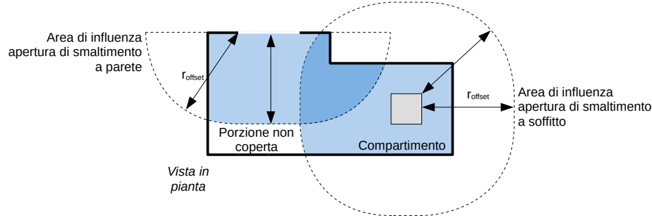

Illustrazione S.8-1: Verifica dell'uniforme distribuzione in pianta delle aperture di smaltimento

<sup>[2]</sup> Con A superficie lorda di ciascun piano del compartimento in m<sup>2</sup>

#### **S.8.6 Sistemi di ventilazione forzata orizzontale del fumo e del calore**

- <span id="page-215-1"></span>1. I *sistemi di ventilazione orizzontale forzata* possono essere progettati per uno o più dei seguenti obiettivi di sicurezza in caso di incendio:
 - a. fornire condizioni *tenibili* per le squadre di soccorso da un punto di accesso sino alla posizione dell'incendio;

Nota Per la descrizione delle condizioni di *tenibilità* si faccia riferimento al capitolo [M.3.](#page-386-0)

- b. proteggere le vie di esodo, ad esclusione di quelle nel compartimento di primo innesco;
- c. agevolare lo smaltimento di fumo e calore dall'attività dopo l'incendio e ripristinare rapidamente le condizioni di sicurezza.

Nota Come le *aperture di smaltimento di fumo e calore d'emergenza*, anche gli SVOF non hanno la funzione di creare un adeguato strato libero dai fumi durante lo sviluppo dell'incendio. Gli SVOF possono perturbare la stratificazione di fumo e calore, in particolare nel compartimento di primo innesco dell'incendio. Gli SVOF possono essere installati anche limitatamente ad aree a rischio specifico.

- 2. Devono essere inoltre soddisfatti i seguenti requisiti:
 - a. l'attivazione dello SVOF deve essere effettuata solo dopo l'evacuazione degli occupanti dal compartimento di primo innesco;
 - b. in caso di presenza di sistemi automatici di inibizione, controllo o estinzione dell'incendio (es. sprinkler, …) deve essere garantita la compatibilità di funzionamento con lo SVOF utilizzato;
 - c. in presenza di IRAI devono essere previste funzioni di comunicazione e controllo dello stato dello SVOF.
- 3. Devono essere previste indicazioni specifiche per la gestione in emergenza dello SVOF (capitolo [S.5](#page-168-0)).

#### **S.8.7 Sistemi per l'evacuazione di fumo e calore**

- <span id="page-215-0"></span>1. I SEFC creano e mantengono uno strato d'aria sostanzialmente indisturbato nella porzione inferiore dell'ambiente protetto mediante l'evacuazione di fumo e calore prodotti dall'incendio. Mantengono le vie di esodo libere da fumo e calore, agevolano le operazioni antincendio, ritardano o prevengono il *flashover* e quindi la generalizzazione dell'incendio, limitano i danni agli impianti di servizio o di processo ed al contenuto dell'ambito protetto, riducono gli effetti termici sulle strutture dell'ambiente protetto, agevolano il ripristino delle condizioni di sicurezza dell'attività dopo l'emergenza.
- 2. Si considerano soluzione conforme i SEFC progettati, installati e gestiti in conformità alle norme:
 - a. UNI 9494-1, per SEFC ad evacuazione *naturale* (SENFC),
 - b. UNI 9494-2, per SEFC ad evacuazione *forzata* (SEFFC).

Nota Le soluzioni conformi per i SEFC risultano essere praticabili solo nel campo di diretta applicazione delle norme UNI 9494-1 ed UNI 9494-2. Al di fuori del campo di applicazione diretta, si deve ricorrere ad altra norma tecnica o ad una soluzione alternativa.

- 3. Devono inoltre essere soddisfatti i seguenti requisiti:
 - a. in caso di presenza di sistemi automatici di inibizione, controllo o estinzione dell'incendio (es. sprinkler, …) deve essere garantita la compatibilità di funzionamento con il SEFC utilizzato;

b. in presenza di IRAI devono essere previste funzioni di comunicazione e controllo dello stato dell'impianto SEFC.

## **S.8.8 Segnaletica**

<span id="page-216-0"></span>1. I presidi antincendio devono essere indicati da segnaletica di sicurezza UNI EN ISO 7010.

#### **S.8.9 Riferimenti**

- <span id="page-216-1"></span>1. Si indicano i seguenti riferimenti:
 - a. UNI 9494-1 "*Sistemi per il controllo di fumo e calore Parte 1: Progettazione ed installazione dei sistemi di evacuazione naturale di fumo e calore (SENFC)*";
 - b. UNI 9494-2 "*Sistemi per il controllo di fumo e calore Parte 2: Progettazione e installazione dei sistemi di evacuazione forzata di fumo e calore (SEF-FC)*";
 - c. UNI 9494-3 "*Sistemi per il controllo di fumo e calore Parte 3: Controllo iniziale e manutenzione dei sistemi di evacuazione di fumo e calore*";
 - d. NFPA 92 *Standard for smoke control systems*, National Fire Protection Association, Quincy (Massachusetts), USA;
 - e. CEN prEN 12101-5 *Smoke and Heat Control Systems Part 5 Guidelines on Functional Recommendations and Calculation Methods for Smoke and Heat Exhaust Ventilation Systems*;
 - f. AAVV, "*Fire safety in buildings, smoke management guidelines*", REHVA guidebook no. 24, 2018.

## **STRATEGIA ANTINCENDIO Capitolo S.9 Operatività antincendio**

<span id="page-218-0"></span>[Premessa](#page-219-1)

[Livelli di prestazione](#page-219-0)

[Criteri di attribuzione dei livelli di prestazione](#page-220-0)

[Soluzioni progettuali](#page-221-2)

[Soluzioni conformi per il livello di prestazione II](#page-221-1) [Soluzioni conformi per il livello di prestazione III](#page-221-0) [Soluzioni conformi per il livello di prestazione IV](#page-222-0) [Soluzioni alternative](#page-223-0)

[Accostabilità dell'autoscala](#page-224-2)

[Accesso ai piani per soccorritori](#page-224-0)

[Colonna a secco](#page-224-1)

[Riferimenti](#page-225-0)

#### **S.9.1 Premessa**

<span id="page-219-1"></span>1. L'operatività antincendio ha lo scopo di agevolare l'efficace conduzione di interventi di soccorso dei Vigili del fuoco in tutte le attività.

## **S.9.2 Livelli di prestazione**

<span id="page-219-0"></span>1. La tabella [S.9-1](#page-219-2) riporta i livelli di prestazione attribuibili alle *opere da costruzione* per la presente misura antincendio.

| Livello di<br>prestazione | Descrizione |
|---------------------------|--------------------------------------------------------------------------------------------------------------------------------------------------------------------------------------------------------------------------------------------------------------------------------------------------------------------------------------------------------------------------------|
| I | Nessun requisito |
| II | Accessibilità per mezzi di soccorso antincendio |
| III | Accessibilità per mezzi di soccorso antincendio<br>Pronta disponibilità di agenti estinguenti<br>Possibilità di controllare o arrestare gli impianti tecnologici e di servizio dell'attività, compresi<br>gli impianti di sicurezza |
| IV | Accessibilità per mezzi di soccorso antincendio<br>Pronta disponibilità di agenti estinguenti<br>Possibilità di controllare o arrestare gli impianti tecnologici e di servizio dell'attività, compresi<br>gli impianti di sicurezza<br>Accessibilità protetta per i Vigili del fuoco a tutti i piani dell'attività<br>Possibilità di comunicazione affidabile per soccorritori |

<span id="page-219-2"></span>*Tabella S.9-1: Livelli di prestazione*

#### **S.9.3 Criteri di attribuzione dei livelli di prestazione**

<span id="page-220-0"></span>1. La tabella [S.9-2](#page-220-1) riporta i criteri *generalmente accettati* per l'attribuzione dei singoli livelli di prestazione.

| Livello di<br>prestazione | Criteri di attribuzione | |
|---------------------------|-----------------------------------------------------------------------------------------------------------------------------------------------------------------------------------------------------------------------------------------------------------------------------------------------------------------------------------------------------------------------------------------------------------------------------------------------------------------------------------------------------------------------------------------------------------------------------------------------------------------------------------------------------------------------------------------------------------------------------------------------------------------------------------------|--|
| I | Non ammesso nelle attività soggette | |
| II | Opere da costruzione dove siano verificate tutte le seguenti condizioni:<br>●<br>profili di rischio:<br>○<br>Rvita compresi in A1, A2, B1, B2;<br>○<br>Rbeni pari a 1;<br>○<br>Rambiente non significativo;<br>●<br>densità di affollamento ≤<br>0,2<br>persone/m2<br>;<br>●<br>tutti i piani dell'attività situati a quota compresa tra -5<br>m e 12<br>m;<br>●<br>carico di incendio specifico qf ≤<br>600<br>MJ/m2<br>;<br>●<br>per compartimenti con qf<br>><br>200<br>MJ/m2<br>: superficie lorda ≤<br>4000<br>m2<br>;<br>●<br>per compartimenti con qf<br>≤<br>200<br>MJ/m2<br>: superficie lorda qualsiasi;<br>●<br>non si detengono o trattano sostanze o miscele pericolose in quantità significative;<br>●<br>non si effettuano lavorazioni pericolose ai fini dell'incendio. | |
| III | Opere da costruzione non ricomprese negli altri criteri di attribuzione. | |
| IV | Opere da costruzione dove sia verificata almeno una delle seguenti condizioni:<br>●<br>profilo di rischio Rbeni compreso in 3, 4;<br>●<br>se aperta al pubblico: affollamento complessivo ><br>300<br>occupanti;<br>●<br>se non aperta al pubblico: affollamento complessivo ><br>1000<br>occupanti;<br>●<br>numero totale di posti letto ><br>100 e profili di rischio Rvita compresi in D1, D2, Ciii1, Ciii2,<br>Ciii3;<br>●<br>si detengono o trattano sostanze o miscele pericolose in quantità significative ed affolla<br>mento complessivo ><br>25<br>occupanti;<br>●<br>si effettuano lavorazioni pericolose ai fini dell'incendio ed affollamento complessi<br>vo<br>><br>25<br>occupanti. | |

<span id="page-220-1"></span>*Tabella S.9-2: Criteri di attribuzione dei livelli di prestazione*

<span id="page-221-2"></span>Nota Il livello di prestazione I della presente misura antincendio non richiede l'applicazione di soluzioni progettuali.

## S.9.4.1 Soluzioni conformi per il livello di prestazione II

- <span id="page-221-1"></span>1. Deve essere permanentemente assicurata la possibilità di avvicinare i mezzi di soccorso antincendio, adeguati al rischio d'incendio, a distanza ≤ 50 m dagli *accessi per soccorritori* dell'attività. Il progettista può impiegare i criteri di cui alla tabella S.9-5, quali parametri di riferimento per l'accesso dei mezzi dei Vigili del fuoco.
- 2. In caso di attività progettata per i livelli di prestazione I o II di resistenza al fuoco previsti nel capitolo S.2, la distanza di cui al comma 1 non deve comunque essere inferiore alla massima altezza dell'opera da costruzione. Tale distanza deve essere segnalata mediante un cartello UNI EN ISO 7010-M001 riportante il messaggio "Costruzione progettata per livello di prestazione di resistenza al fuoco inferiore a III" di cui all'illustrazione S.9-1.

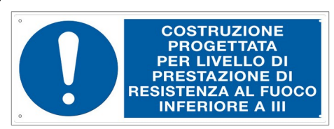

Illustrazione S.9-1: Esempio di segnale per livello di prestazione di resistenza al fuoco inferiore a III

## S.9.4.2 Soluzioni conformi per il livello di prestazione III

- <span id="page-221-3"></span><span id="page-221-0"></span>1. Devono essere rispettate le prescrizioni previste per le soluzioni conformi del livello di prestazione II.
- 2. In assenza di protezione interna della rete idranti, nelle attività a più piani fuori terra o interrati, deve essere prevista la *colonna a secco* di cui al paragrafo S.9.7.
- 3. In assenza di protezione esterna della rete idranti propria dell'attività, deve essere disponibile almeno un idrante, derivato dalla rete interna oppure collegato alla rete pubblica, raggiungibile con un percorso massimo di 500 m dai confini dell'attività; tale idrante deve assicurare un'erogazione minima di 300 litri/minuto per una durata ≥ 60 minuti.
- 4. I sistemi di controllo e comando dei servizi di sicurezza destinati a funzionare in caso di incendio (es. quadri di controllo dei SEFC, degli impianti di spegnimento, degli IRAI, ...) devono essere ubicati nel *centro di gestione delle emergenze*, se previsto, e comunque in posizione segnalata e facilmente raggiungibile durante l'incendio. La posizione e le logiche di funzionamento devono essere considerate nella gestione della sicurezza antincendio (capitolo S.5), anche ai fini di agevolare l'operato delle squadre dei Vigili del fuoco.
- 5. Gli organi di intercettazione, controllo, arresto e manovra degli impianti tecnologici e di processo al servizio dell'attività rilevanti ai fini dell'incendio (es. impianto elettrico, adduzione gas naturale, impianti di ventilazione, impianti di produzione, ...) devono essere ubicati in posizione segnalata e facilmente raggiungibile durante l'incendio. La posizione e le logiche di funzionamento devono essere considerate nella gestione della sicurezza antincendio (capitolo S.5), anche ai fini di agevolare l'operato delle squadre dei Vigili del fuoco.

#### **S.9.4.3 Soluzioni conformi per il livello di prestazione IV**

- <span id="page-222-0"></span>1. Devono essere rispettate le prescrizioni previste per le soluzioni conformi del livello di prestazione III.
- 2. Deve essere assicurata almeno una delle seguenti soluzioni per consentire ai soccorritori di raggiungere tutti i piani dell'attività:
 - a. *accostabilità* a tutti i piani dell'autoscala o mezzo equivalente dei Vigili del fuoco secondo paragrafo [S.9.5](#page-224-2);
 - b. presenza di *percorsi d'accesso ai piani per soccorritori* almeno di tipo protetto (es. scala protetta, scala esterna, scala a prova di fumo, …) secondo paragrafo [S.9.6](#page-224-0).

Nota La definizione di *percorso d'accesso ai piani per soccorritori* è riportata nel capitolo [G.1.](#page-6-0)

- 3. In funzione della geometria dell'attività, devono essere soddisfatte le prescrizioni di cui alla tabella [S.9-3](#page-222-1).
- 4. Per consentire l'eventuale accesso dei soccorritori dall'alto, nelle attività con massima quota dei piani > 54 m almeno una scala d'esodo deve condurre anche al piano di copertura dell'edificio, qualora praticabile.

| Geometria attività | Prescrizioni aggiuntive |
|-------------------------------------------------------------|--------------------------------------------------------------------------------------------------------------------------------------------------------------------------------------------------------------------------------------------------------|
| Attività con piani<br>a quota ><br>32<br>m e ≤<br>54<br>m | Deve essere installato almeno un ascensore antincendio che rag<br>giunga tutti i piani fuori terra dell'attività. |
| Attività con piani<br>a quota ><br>54<br>m | Deve essere installato almeno un ascensore di soccorso che rag<br>giunga tutti i piani fuori terra dell'attività.<br>Deve essere installata un'infrastruttura per le comunicazioni in emer<br>genza dei soccorritori in tutti gli ambiti dell'attività |
| Attività con piani<br>a quota <<br>-10<br>m e ≥<br>-15<br>m | Deve essere installato almeno un ascensore antincendio che rag<br>giunga tutti i piani interrati dell'attività. |
| Attività con piani<br>a quota <<br>-15<br>m | Deve essere installato almeno un ascensore di soccorso che rag<br>giunga tutti i piani interrati dell'attività.<br>Deve essere installata un'infrastruttura per le comunicazioni in emer<br>genza dei soccorritori in tutti gli ambiti dell'attività |

<span id="page-222-1"></span>*Tabella S.9-3: Prescrizioni in relazione alla geometria dell'attività*

#### **S.9.4.4 Soluzioni alternative**

- <span id="page-223-0"></span>1. Sono ammesse *soluzioni alternative* per tutti i livelli di prestazione.
- 2. Al fine di dimostrare il raggiungimento del *livello di prestazione*, il progettista deve impiegare uno dei metodi del paragrafo [G.2.7.](#page-45-0)
- 3. In tabella [S.9-4](#page-223-1) sono riportate alcune modalità *generalmente accettate* per la progettazione di soluzioni alternative. Il progettista può comunque impiegare modalità diverse da quelle elencate.

| Oggetto della soluzione | Modalità progettuale |
|--------------------------------------------------------------------------------|------------------------------------------------------------------------------------------------------------------------------------------------------------------------------------------------------------------------------------------------|
| Accessibilità per mezzi di<br>soccorso antincendio | Sia garantita l'accessibilità protetta per i Vigili del fuoco a tutti i piani dell'atti<br>vità e la disponibilità in prossimità di attrezzature e dispositivi di protezione<br>per l'operatività antincendio. |
| Pronta disponibilità di agenti<br>estinguenti | Si descriva come gli incendi, specifici dell'ambito considerato, possano esse<br>re controllati manualmente, oppure inibiti, controllati o estinti automaticamen<br>te, impiegando altre soluzioni impiantistiche o altre procedure operative. |
| Accessibilità protetta per i Vigili<br>del fuoco a tutti i piani dell'attività | Si dimostri che gli accessi ai piani per soccorritori non siano investiti da effet<br>ti dell'incendio che determinano condizioni incapacitanti durante l'operatività<br>antincendio. |
| Possibilità di comunicazione<br>affidabile per soccorritori | Si descriva come possa essere garantita la comunicazione affidabile per<br>soccorritori con modalità tecniche o procedurali alternative, nelle specifiche<br>condizioni d'incendio dell'attività. |

<span id="page-223-1"></span>*Tabella S.9-4: Modalità progettuali per soluzioni alternative*

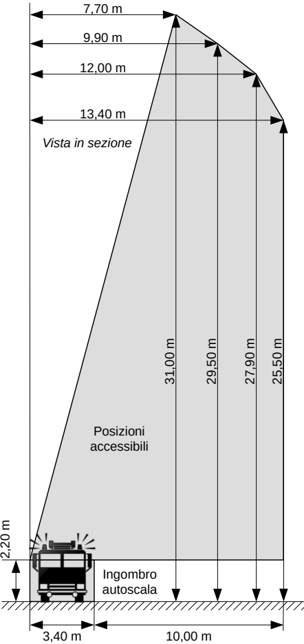

<span id="page-223-2"></span>*Illustrazione S.9-2: Sviluppo autoscala e posizioni accessibili*

#### S.9.5 Accostabilità dell'autoscala

- <span id="page-224-2"></span>1. Per consentire l'intervento dell'autoscala dei Vigili del fuoco, gli accessi all'attività dalla via pubblica devono possedere i requisiti minimi di cui alla tabella S.9-5.
- 2. Deve essere assicurata la possibilità d'accostamento agli edifici dell'autoscala sviluppata come nell'illustrazione S.9-2 ad almeno una finestra o balcone di ogni piano a quota > 12 m.

Larghezza: 3,50 m; Altezza libera: 4,00 m; Raggio di volta: 13,00 m; Pendenza: ≤ 10%;

Resistenza al carico: almeno 20 tonnellate, di cui 8 sull'asse anteriore e 12 sull'asse posteriore con passo 4 m.

<span id="page-224-3"></span>Tabella S.9-5: Requisiti minimi accessi all'attività da pubblica via per mezzi di soccorso

## S.9.6 Accesso ai piani per soccorritori

<span id="page-224-0"></span>1. Le porzioni di via d'esodo impiegate come *percorso d'accesso ai piani per soc-corritori* devono avere una larghezza maggiorata di 500 mm rispetto a quanto calcolato per le finalità dell'esodo (capitolo S.4), al fine di facilitare l'accesso dei soccorritori in senso contrario all'esodo degli occupanti.

Nota Ad esempio, la larghezza minima di una scala d'esodo al servizio di 4 piani fuori terra di un'attività con $R_{vita}$ pari ad A2 ed $R_{beni}$ pari a 3, impiegata da 90 occupanti, che sia anche percorso d'accesso ai piani per soccorritori, è calcolata come segue: $L_v = 90 \text{ p} \cdot 3,25 \text{ mm/p} + 500 \text{ mm} = 793 \text{ mm}$ . Poiché $L_v$ risulta inferiore al minimo ammesso nel capitolo S.4, allora $L_v = 900 \text{ mm}$ .

#### S.9.7 Colonna a secco

- <span id="page-224-1"></span>1. La *colonna a secco* consente ai Vigili del fuoco di evitare di effettuare stendimenti di tubazioni flessibili lungo i percorsi di accesso e le vie di esodo verticali dell'attività.
- 2. La *colonna a secco* deve essere progettata, realizzata, esercita e manutenuta a regola d'arte, secondo quanto prescritto dalle specifiche regolamentazioni, dalle norme di buona tecnica e dalle istruzioni fornite dal fabbricante.
- 3. All'estremità esterna di ciascuna colonna a secco deve essere installato un attacco di mandata per autopompa dei Vigili del fuoco.
- 4. In corrispondenza dei singoli piani delle vie d'esodo verticali, deve essere installata una valvola manuale di intercettazione con attacco DN 45, munita del relativo tappo di chiusura. Le valvole in corrispondenza dei piani devono essere facilmente accessibili e protette dagli urti e non devono costituire elemento di ostacolo all'esodo.
- 5. Per la progettazione, realizzazione ed esercizio della *colonna a secco*, si devono impiegare le indicazioni di cui alla tabella S.9-6.
- 6. Gli attacchi di mandata per autopompa per la colonna a secco devono:
 - a. essere posizionati in modo che sia consentito il sicuro collegamento della motopompa dei Vigili del fuoco ai dispositivi stessi;
 - b. essere contrassegnati in modo da permettere l'immediata individuazione dei dispositivi mediante cartelli recanti la dicitura di tabella S.9-7 riportante, so-

lo in presenza di più attacchi per autopompa, la specificazione dell'area servita.

- 7. Le valvole manuali di intercettazione con attacco DN 45 presso i piani dell'attività devono essere contrassegnate mediante cartelli UNI EN ISO 7010-F004.
- 8. La colonna a secco deve essere sottoposta a verifiche periodiche di funzionalità e ad operazioni di manutenzione (capitolo [S.5\)](#page-168-0). Le modalità di verifica di funzionalità e le operazioni di manutenzione possono essere ricavate dalle indicazioni applicabili delle norme UNI 10779 e UNI TS 11559.

Siano adottate le indicazioni della UNI 10779 e di UNI TS 11559, per quanto applicabili.

Sia garantito il simultaneo impiego, da parte dei Vigili del fuoco, di non meno di 3 valvole DN 45 (o tutte, se meno di 3) nella posizione idraulicamente più sfavorevole, con una portata minima per ciascuna pari a 120 l/min ed una pressione residua alla valvola non minore di 0,2 MPa.

Siano previsti dispositivi di sfiato dell'aria, in numero, dimensione e posizione, idonei ad assicurare, in relazione alla caratteristiche plano-altimetriche della tubazione, l'utilizzo in sicurezza dell'installazione.

Le tubazioni devono essere completamente drenabili.

Si consideri una pressione dell'alimentazione da autopompa dei Vigili del fuoco pari a 0,8 MPa.

## <span id="page-225-2"></span>*Tabella S.9-6: Indicazioni progettuali per la colonna a secco*

| ATTACCO DI MANDATA PER AUTOPOMPA |
|------------------------------------------|
| Pressione massima 1,2 MPa |
| COLONNA A SECCO PER VVF<br>AREA SERVITA: |

<span id="page-225-1"></span>*Tabella S.9-7: Cartello per colonna a secco*

#### **S.9.8 Riferimenti**

- <span id="page-225-0"></span>1. Si indicano i seguenti riferimenti:
 - a. BS 9999:2008, Section 6 *Access and facilities for fire-fighting*.
 - b. UNI 10779 "*Impianti di estinzione incendi Reti di idranti Progettazione, installazione ed esercizio*";
 - c. UNI/TS 11559 "*Impianti di estinzione incendi Reti di idranti a secco Progettazione, installazione ed esercizio*";
 - d. OSHA 3256-09R 2015 "*Fire Service Features of Buildings and Fire Protection Systems*".

## <span id="page-226-0"></span>**STRATEGIA ANTINCENDIO Capitolo S.10 Sicurezza degli impianti tecnologici e di servizio**

#### [Premessa](#page-227-2)

[Livelli di prestazione](#page-227-1)

[Criteri di attribuzione dei livelli di prestazione](#page-227-0)

#### [Soluzioni progettuali](#page-228-2)

[Soluzioni conformi](#page-228-1) [Soluzioni alternative](#page-228-0)

#### [Obiettivi di sicurezza antincendio](#page-229-2)

#### [Prescrizioni aggiuntive di sicurezza antincendio](#page-229-1)

[Impianti per la produzione, trasformazione, trasporto, distribuzione e di utilizzazione dell'energia elettrica](#page-229-0) [Impianti fotovoltaici](#page-230-2) [Infrastrutture per la ricarica di veicoli elettrici](#page-230-1)

[Protezione contro le scariche atmosferiche](#page-230-0) [Impianti di sollevamento e trasporto di cose e persone](#page-231-2) [Impianti di distribuzione gas combustibili](#page-231-1) [Deposito di combustibili](#page-231-0) [Impianti di distribuzione di gas medicali](#page-232-2) [Opere di evacuazione dei prodotti della combustione](#page-232-1)

[Impianti di climatizzazione e condizionamento](#page-232-0)

#### [Riferimenti](#page-233-0)

#### **S.10.1 Premessa**

- <span id="page-227-2"></span>1. Ai fini della sicurezza antincendio devono essere considerati *almeno* i seguenti impianti tecnologici e di servizio:
 - a. produzione, trasformazione, trasporto, distribuzione e di utilizzazione dell'energia elettrica;
 - b. protezione contro le scariche atmosferiche;
 - c. sollevamento o trasporto di cose e persone;

Nota Ad esempio: ascensori, montacarichi, montalettighe, scale mobili, marciapiedi mobili, …

- d. deposito, trasporto, distribuzione e utilizzazione di solidi, liquidi e gas combustibili, infiammabili e comburenti;
- e. riscaldamento, climatizzazione, condizionamento e refrigerazione, comprese le opere di evacuazione dei prodotti della combustione, e di ventilazione ed aerazione dei locali.
- 2. Per gli impianti tecnologici e di servizio inseriti nei processi produttivi dell'attività il progettista effettua la valutazione del rischio di incendio e prevede adeguate misure antincendio di tipo preventivo, protettivo e gestionale. Tali misure devono essere in accordo con gli obiettivi di sicurezza riportati al paragrafo [S.10.5](#page-229-2).

## **S.10.2 Livelli di prestazione**

<span id="page-227-1"></span>1. La tabella [S.10-1](#page-227-3) riporta i livelli di prestazione attribuibili alle *attività* per la presente misura antincendio.

| Livello di<br>prestazione | Descrizione | |
|---------------------------|-------------------------------------------------------------------------------------------------------------------------------------------------------------------------------------------------|--|
| I | Impianti progettati, realizzati, eserciti e mantenuti in efficienza secondo la regola d'arte, in<br>conformità alla regolamentazione vigente, con requisiti di sicurezza antincendio specifici. | |

<span id="page-227-3"></span>*Tabella S.10-1: Livelli di prestazione*

#### **S.10.3 Criteri di attribuzione dei livelli di prestazione**

<span id="page-227-0"></span>1. Il livello di prestazione I deve essere attribuito a tutte le attività.

#### **S.10.4 Soluzioni progettuali**

#### **S.10.4.1 Soluzioni conformi**

- <span id="page-228-2"></span><span id="page-228-1"></span>1. Si ritengono conformi gli impianti tecnologici e di servizio progettati, installati, verificati, eserciti e manutenuti a regola d'arte, in conformità alla regolamentazione vigente, secondo le norme applicabili.
- 2. Tali impianti devono garantire gli obiettivi di sicurezza antincendio riportati al paragrafo [S.10.5](#page-229-2) ed essere altresì conformi alle prescrizioni tecniche riportate al paragrafo [S.10.6](#page-229-1) per la specifica tipologia dell'impianto.

#### **S.10.4.2 Soluzioni alternative**

- <span id="page-228-0"></span>1. Sono ammesse *soluzioni alternative* alle sole prescrizioni riportate al paragrafo [S.10.6](#page-229-1).
- 2. Al fine del raggiungimento del *livello di prestazione*, il progettista deve dimostrare il soddisfacimento degli obiettivi di sicurezza di cui al paragrafo [S.10.5,](#page-229-2) impiegando uno dei metodi del paragrafo [G.2.7](#page-45-0).

#### **S.10.5 Obiettivi di sicurezza antincendio**

- <span id="page-229-2"></span>1. Gli impianti tecnologici e di servizio di cui al paragrafo [S.10.1](#page-227-2) devono rispettare i seguenti obiettivi di sicurezza antincendio:
 - a. limitare la probabilità di costituire causa di incendio o di esplosione;
 - b. limitare la propagazione di un incendio all'interno degli ambienti di installazione e contigui;
 - c. non rendere inefficaci le altre misure antincendio, con particolare riferimento agli elementi di compartimentazione;
 - d. consentire agli occupanti di lasciare gli ambienti in condizione di sicurezza;
 - e. consentire alle squadre di soccorso di operare in condizioni di sicurezza;
 - f. essere disattivabili, o altrimenti gestibili, a seguito di incendio.
- 2. La gestione e la disattivazione di impianti tecnologici e di servizio, anche quelli destinati a rimanere in servizio durante l'emergenza, deve:
 - a. poter essere effettuata da posizioni protette, segnalate e facilmente raggiungibili;
 - b. essere prevista e descritta nel piano d'emergenza.

Nota Per l'operatività (capitolo [S.9\)](#page-218-0) sono previste specifiche prescrizioni in merito alle modalità di disattivazione degli impianti, compresi quelli destinati a funzionare durante l'emergenza.

## **S.10.6 Prescrizioni aggiuntive di sicurezza antincendio**

<span id="page-229-1"></span>1. Le seguenti prescrizioni tecniche si applicano alle specifiche tipologie di impianti tecnologici e di servizio di seguito indicati.

## **S.10.6.1 Impianti per la produzione, trasformazione, trasporto, distribuzione e di utilizzazione dell'energia elettrica**

- <span id="page-229-0"></span>1. Gli impianti per la produzione, trasformazione, trasporto, distribuzione e di utilizzazione dell'energia elettrica devono possedere caratteristiche strutturali e possibilità di intervento, individuate nel piano di emergenza, tali da non costituire pericolo durante le operazioni di estinzione dell'incendio e di messa in sicurezza dell'attività.
- Nota Le costruzioni elettriche vengono realizzate tenendo conto della classificazione del rischio elettrico dei luoghi in cui sono installate (es. luoghi ordinari, a maggior rischio in caso di incendio, a rischio di esplosione, …). Generalmente, gli impianti elettrici sono suddivisi in più circuiti terminali in modo che un guasto non possa generare situazioni di pericolo all'interno dell'attività. Qualora necessario, i dispositivi di protezione devono essere scelti in modo da garantire una corretta selettività. Di norma i quadri elettrici contenenti circuiti che alimentano servizi di sicurezza devono essere ubicati in posizioni protette, segnalate e facilmente raggiungibili.
 - 2. Deve essere valutata, in funzione della destinazione dei locali, del tempo di evacuazione dagli stessi, del tipo di posa delle condutture elettriche, dell'incidenza dei cavi elettrici su gli altri materiali o impianti presenti, la necessità di utilizzare cavi realizzati con materiali in grado di ridurre al minimo l'emissione di fumo, la produzione di gas acidi e corrosivi.
 - 3. I quadri elettrici possono essere installati lungo le vie di esodo a condizione che non costituiscano ostacolo al deflusso degli occupanti.
 - 4. Qualora i quadri elettrici siano installati in ambienti aperti al pubblico, essi devono essere protetti almeno con una porta frontale con chiusura a chiave.

- 5. Gli apparecchi di manovra dovranno sempre riportare chiare indicazioni dei circuiti a cui si riferiscono.
- 6. Gli impianti di cui al paragrafo [S.10.1](#page-227-2), che abbiano una funzione ai fini della gestione dell'emergenza, devono disporre di alimentazione elettrica di sicurezza con le caratteristiche minime indicate nella tabella [S.10-2](#page-230-3).

Nota Tutti i sistemi di protezione attiva e l'illuminazione di sicurezza, devono disporre di alimentazione elettrica di sicurezza.

7. I circuiti di sicurezza devono essere chiaramente identificati. Su ciascun dispositivo di protezione del circuito o impianto elettrico di sicurezza deve essere apposto un segnale riportante la dicitura "*Non manovrare in caso d'incendio*".

| Utenza | Interruzione | Autonomia |
|------------------------------------------------------------------------------------------|------------------------------------|---------------|
| Illuminazione di sicurezza, IRAI, sistemi di<br>comunicazione in emergenza | Interruzione breve (≤<br>0,5<br>s) | ><br>30' [1] |
| Scale e marciapiedi mobili utilizzati per<br>l'esodo<br>[3], ascensori antincendio, SEFC | Interruzione media (≤<br>15<br>s) | ><br>30' [1] |
| Sistemi di controllo o estinzione degli incendi | Interruzione media (≤<br>15<br>s) | ><br>120' [2] |
| Ascensori di soccorso | Interruzione media (≤<br>15<br>s) | ><br>120' |
| Altri Impianti | Interruzione media (≤<br>15<br>s) | ><br>120' |

<sup>[1]</sup> L'autonomia deve essere comunque congrua con il tempo disponibile per l'esodo dall'attività

<span id="page-230-3"></span>*Tabella S.10-2: Autonomia minima ed interruzione dell'alimentazione elettrica di sicurezza*

## **S.10.6.2 Impianti fotovoltaici**

- <span id="page-230-2"></span>1. In presenza di impianti fotovoltaici installati sulle coperture e sulle facciate degli edifici, devono essere utilizzati materiali, adottate soluzioni progettuali ed accorgimenti tecnici che limitino la probabilità di innesco dell'incendio e la successiva propagazione dello stesso anche all'interno dell'opera da costruzione e ad altre limitrofe.
- 2. L'installazione degli impianti fotovoltaici deve garantire la sicurezza degli operatori addetti alle operazioni di manutenzione nonché la sicurezza dei soccorritori.

Nota Utili riferimenti sono costituiti dalle circolari DCPST n°1324 del 7 febbraio 2012 e DCPST n°6334 del 4 maggio 2012.

#### **S.10.6.3 Infrastrutture per la ricarica di veicoli elettrici**

- <span id="page-230-1"></span>1. In presenza di infrastrutture per la ricarica dei veicoli elettrici devono essere utilizzati materiali, adottate soluzioni progettuali ed accorgimenti tecnici che limitino la probabilità di innesco dell'incendio e la successiva propagazione dello stesso anche all'interno dell'opera da costruzione e ad altre limitrofe.
- 2. L'installazione di tali infrastrutture deve garantire la sicurezza degli operatori addetti alle operazioni di manutenzione nonché la sicurezza dei soccorritori.

Nota Utile riferimento è costituito dalla circolare DCPST n°2 del 5 novembre 2018.

#### **S.10.6.4 Protezione contro le scariche atmosferiche**

<span id="page-230-0"></span>1. Per tutte le attività deve essere eseguita una valutazione del rischio dovuto ai fulmini.

<sup>[2]</sup> L'autonomia può essere inferiore e pari al tempo di funzionamento dell'impianto

<sup>[3]</sup> Solo se utilizzate in movimento durante l'esodo

2. Sulla base dei risultati della valutazione di tale rischio, gli impianti di protezione contro le scariche atmosferiche devono essere realizzati nel rispetto delle relative norme tecniche.

## **S.10.6.5 Impianti di sollevamento e trasporto di cose e persone**

<span id="page-231-2"></span>1. Tutti gli impianti di sollevamento e trasporto di cose e persone non specificatamente progettati per funzionare in caso di incendio, devono essere dotati di accorgimenti gestionali, organizzativi e tecnici che ne impediscano l'utilizzo in caso di emergenza.

Nota Ad esempio: ascensori, montacarichi, montalettighe, scale mobili, marciapiedi mobili, …

## **S.10.6.6 Impianti di distribuzione gas combustibili**

<span id="page-231-1"></span>1. Le condutture principali dei gas combustibili a valle dei punti di consegna quando raggiungono un'opera da costruzione (es. edificio civile, fabbricato industriale, …), devono essere installate a vista ed all'esterno dell'opera da costruzione servita.

Nota Ad esempio: le tubazioni del servizio comune di utenze di un edificio di civile abitazione alimentato dall'impianto gas, cioè le sottocolonne e le colonne montanti, devono essere installate all'esterno, sulla facciata dell'edificio servito.

- 2. In caso di eventuali brevi attraversamenti di locali, le tubazioni di cui al comma 1 devono essere poste in guaina di classe europea A1 di reazione al fuoco, aerata alle due estremità verso l'esterno e di diametro superiore di almeno 20 mm rispetto alla tubazione interna.
- 3. È consentita l'installazione delle condutture all'interno delle opere da costruzione, a condizione che sia effettuata la valutazione del rischio di atmosfere esplosive (capitolo [V.2](#page-240-0)).

#### **S.10.6.7 Deposito di combustibili**

- <span id="page-231-0"></span>1. Devono essere adottate misure al fine di evitare la dispersione del combustibile, ad esempio:
 - a. bacino di contenimento impermeabile, protetto dagli agenti atmosferici, di volume pari alla capacità complessiva dei serbatoi di combustibili liquidi;
 - b. dispositivi di intercettazione delle linee con comando in posizione accessibile, protetta e segnalata;
 - c. dispositivi di arresto delle pompe di alimentazione;
 - d. dispositivi di rivelazione ed allarme;
 - e. protezione contro gli urti accidentali da parte di veicoli o altri elementi;
 - f. protezione dei serbatoi e delle linee contro la corrosione;
 - g. predisposizione di aree dedicate, attacchi idonei per il carico e scarico in sicurezza dei serbatoi;
 - h. dispositivi automatici per impedire il sovra-riempimento dei serbatoi
 - i. procedure ordinarie e d'emergenza.
- 2. Devono essere adottate misure al fine di evitare la propagazione dell'incendio e di mitigarne gli effetti. Ad esempio:
 - a. impianti di protezione attiva;

- b. interposizione di idonee distanze di separazione tra lo stoccaggio del combustibile e l'impianto servito;
- c. inserimento del deposito di combustibile e del relativo impianto servito in compartimenti distinti;
- d. qualora lo stoccaggio del combustibile non avvenga all'aperto o in compartimento distinto, la quantità di combustibile stoccato sia limitata al minimo indispensabile per la funzionalità delle attività servite.
- 3. Il tubo di sfiato dei vapori da serbatoi sia adeguatamente dimensionato, sfociante ad almeno 2,5 m dal piano di calpestio e posto ad idonea distanza da altre attività.

## S.10.6.8 Impianti di distribuzione di gas medicali

- <span id="page-232-2"></span>1. La distribuzione dei gas medicali deve avvenire, di norma, mediante impianti centralizzati.
- 2. Detti impianti devono essere rispondenti ai seguenti criteri:
 - a. la disposizione geometrica delle tubazioni della rete primaria deve essere tale da garantire l'alimentazione di altri compartimenti non interessati dall'incendio. L'impianto di un compartimento non deve essere derivato da un altro compartimento, ma direttamente dalla rete di distribuzione primaria;
 - b. l'impianto deve essere compatibile con il sistema di compartimentazione antincendio e deve permettere l'interruzione della erogazione dei gas mediante dispositivi di intercettazione manuale posti all'esterno di ogni compartimento in posizione accessibile, protetta e segnalata; idonea segnaletica, inoltre, devono indicare i tratti di impianto sezionabili a seguito della manovre di intercettazione;
 - c. le reti di distribuzione dei gas medicali devono essere disposte in modo tale da non interferire in alcun modo con reti di altri impianti tecnologici e di servizio.
 - d. i cavedi attraversati dagli impianti di gas medicali devono essere ventilati con aperture la cui posizione sarà funzione della densità dei gas interessati.

Nota Le norme di riferimento per la progettazione, installazione, esercizio e manutenzione degli impianti per la distribuzione dei gas medicali sono la UNI EN ISO 7396-1 "Impianti di distribuzione dei gas medicali - Parte 1: Impianti di distribuzione dei gas medicali compressi e per vuoto", la UNI EN ISO 7396-2 "Impianti di distribuzione dei gas medicali - Parte 2: Impianti di evacuazione dei gas anestetici" e la norma UNI 11100 "Impianti di distribuzione dei gas medicali compressi e per vuoto e impianti di evacuazione dei gas anestetici - Guida all'accettazione, alla messa in servizio, all'autorizzazione all'uso e alla gestione operativa".

#### S.10.6.9 Opere di evacuazione dei prodotti della combustione

<span id="page-232-1"></span>1. Nel caso in cui le canne fumarie attraversino o lambiscano materiali combustibili le stesse dovranno essere opportunamente distanziate. Utili indicazioni in merito sono fornite nel paragrafo S.2.12 del presente documento.

#### S.10.6.10 Impianti di climatizzazione e condizionamento

- <span id="page-232-0"></span>1. Gli impianti di condizionamento o di ventilazione devono possedere requisiti che garantiscano il raggiungimento dei seguenti ulteriori specifici obiettivi:
 - a. evitare il ricircolo dei prodotti della combustione o di altri gas ritenuti pericolosi:

- b. non produrre, a causa di avarie o guasti propri, fumi che si diffondano nei locali serviti;
- c. non costituire elemento di propagazione di fumi o fiamme, anche nella fase iniziale degli incendi.
- 2. Negli ambiti dell'attività ove gli occupanti possano essere esposti agli effetti dei gas refrigeranti, dovrebbero essere impiegati gas refrigeranti classificati A1 o A2L secondo norma ISO 817 "Refrigerants Designation and safety classification".

Nota La serie delle norme UNI EN 378 "Sistemi di refrigerazione e pompe di calore - Requisiti di sicurezza e ambientali" specifica i requisiti per la sicurezza degli occupanti e dei beni, fornisce una guida per la tutela dell'ambiente e stabilisce procedure per il funzionamento, la manutenzione e la riparazione di impianti di refrigerazione e per il recupero dei refrigeranti. Ove si impieghino gas refrigeranti infiammabili, la serie delle UNI EN 378 contiene previsioni specifiche di sicurezza antincendio.

#### S.10.7 Riferimenti

- <span id="page-233-0"></span>1. Si indicano i seguenti riferimenti:
 - a. Norme CEI ed UNI applicabili.
 - b. S Mannan, "Lees' Loss Prevention in the Process Industries: Hazard Identification, Assessment and Control", Ed. Butterworth-Heinemann, 2012.

## <span id="page-234-0"></span>**Sezione V Regole tecniche verticali**

[Capitolo V.1 Aree a rischio specifico](#page-236-0)

[Capitolo V.2 Aree a rischio per atmosfere esplosive](#page-240-0)

[Capitolo V.3 Vani degli ascensori](#page-254-0)

[Capitolo V.4 Uffici](#page-258-0)

[Capitolo V.5 Attività ricettive turistico-alberghiere](#page-264-0)

[Capitolo V.6 Autorimesse](#page-272-0)

[Capitolo V.7 Attività scolastiche](#page-284-0)

[Capitolo V.8 Attività commerciali](#page-290-0)

[Capitolo V.9 Asili nido](#page-302-0)

[Capitolo V.10 Musei, gallerie, esposizioni, mostre, biblioteche e archivi in edifici tutelati](#page-308-0)

[Capitolo V.11 Strutture sanitarie](#page-316-0)

[Capitolo V.12 Altre attività in edifici tutelati](#page-328-0)

[Capitolo V.13 Chiusure d'ambito degli edifici civili](#page-334-0)

[Capitolo V.14 Edifici di civile abitazione](#page-344-0)

[Capitolo V.15 Attività di intrattenimento e di spettacolo a carattere pubblico](#page-352-0)

## **REGOLE TECNICHE VERTICALI Capitolo V.1 Aree a rischio specifico**

<span id="page-236-0"></span>[Campo di applicazione](#page-237-0) [Strategia antincendio](#page-237-1)

#### V.1.1 Campo di applicazione

- <span id="page-237-0"></span>1. La presente regola tecnica reca le indicazioni di prevenzione incendi che si applicano alle aree a rischio specifico.
- 2. Le aree a rischio specifico possono essere fissate dalle regole tecniche verticali applicabili all'attività. Sono inoltre individuate dal progettista sulla base della *valutazione del rischio d'incendio* e dei seguenti criteri:
 - a. aree in cui si detengono o trattano sostanze o miscele pericolose, materiali combustibili, in quantità significative;
 - b. aree in cui si effettuano lavorazioni pericolose ai fini dell'incendio;
 - c. aree in cui vi è presenza di impianti o loro componenti rilevanti ai fini della sicurezza antincendio di cui al capitolo S.10;
 - d. aree con carico di incendio specifico $q_{\rm f} > 1200~{\rm MJ/m^2}$ , non occupate o con presenza occasionale e di breve durata di personale addetto;
 - e. aree in cui vi è presenza di impianti ed attrezzature con fluidi di processo in pressione o ad alta temperatura;
 - f. aree in cui vi è presenza di superfici esposte ad elevate temperature o fiamme libere;
 - g. aree in cui vi è presenza di reazioni chimiche pericolose ai fini dell'incendio;
 - h. ambiti dell'attività con R<sub>ambiente</sub> significativo.
- 3. Lo stoccaggio di *limitate quantità* di liquidi infiammabili in armadi metallici per impieghi funzionali all'attività principale non è generalmente considerato *rischio specifico*.

#### V.1.2 Strategia antincendio

- <span id="page-237-1"></span>1. Per la valutazione del rischio e delle caratteristiche delle aree a rischio specifico, devono essere considerate almeno le informazioni desumibili dalle seguenti documentazioni:
 - a. schede di sicurezza di sostanze o miscele pericolose;
 - b. norme applicabili;
 - c. specifiche e manuali dei fabbricanti degli impianti e delle macchine.
- 2. In relazione alle risultanze della valutazione del rischio di incendio ed alle caratteristiche delle aree a rischio specifico, il progettista valuta, almeno, l'applicazione delle seguenti misure:
 - a. inserimento delle aree a rischio specifico in compartimenti distinti per ambiti aventi caratteristiche di rischio omogenee, interposizione di distanze di separazione, riduzione delle superfici lorde di compartimento, ubicazione fuori terra o su piani poco interrati;
 - b. controllo dell'incendio con livello di prestazione III (capitolo S.6);
 - c. installazione di sistemi manuali o automatici di inibizione, controllo o estinzione dell'incendio *a bordo macchina* per la protezione specifica degli impianti e delle apparecchiature a rischio specifico di incendio;
 - d. installazione di un impianto IRAI con livello di prestazione III (capito-lo S.7);

- e. installazioni di sistemi *a bordo macchina* per il rilevamento automatico di anomalie o guasti che comportino la deviazione dai parametri di funzionamento ordinario degli impianti e delle attrezzature di processo, con le funzioni automatiche di allarme ed intercettazione delle alimentazioni elettriche e dei fluidi pericolosi;
- f. effettuazione della valutazione del rischio per atmosfere esplosive (capitolo [V.2](#page-240-0));
- g. adozione di accorgimenti impiantistici e costruttivi per limitare e confinare i rilasci di sostanze o miscele pericolose;
- Nota Ad esempio: bacini di contenimento, disponibilità di polveri o dispositivi assorbenti, inserimento di valvole di eccesso di flusso, intercettazioni automatiche e manuali dei sistemi di distribuzione, incamiciatura delle tubazioni, …
 - h. adozione di accorgimenti per limitare l'impatto esterno di eventuali rilasci di sostanze o miscele pericolose;
- Nota Ad esempio: distanze di separazione che tengano conto della propagazione degli effluenti nelle matrici ambientali, …
 - i. adozione di sistemi di rilevazione ed allarme, di procedure gestionali per la sorveglianza ed il controllo dei parametri critici dei processi;
- Nota Ad esempio: allarmi di massimo livello per i serbatoi, …
 - j. formazione, informazione ed addestramento degli addetti alla gestione delle lavorazioni e dei processi pericolosi;
- Nota Tale formazione, informazione ed addestramento deve prevedere nozioni riguardanti i parametri critici di funzionamento delle lavorazioni e dei processi pericolosi, le modalità e le procedure di avvio e fermo degli impianti in sicurezza, la gestione degli stati di allarme e di emergenza, …
 - k. disponibilità di specifiche attrezzature di soccorso, dispositivi di protezione collettiva ed individuale;
 - 3. Nel caso di compartimentazione multipiano dell'attività (capitolo [S.3](#page-104-0)), le aree a rischio specifico devono comunque essere inserite in compartimento distinto.
 - 4. Le risultanze della specifica valutazione del rischio e le relative misure preventive, protettive e gestionali adottate devono essere considerate ai fini della gestione della sicurezza dell'attività (capitolo [S.5\)](#page-168-0).

## **REGOLE TECNICHE VERTICALI Capitolo V.2 Aree a rischio per atmosfere esplosive**

#### <span id="page-240-0"></span>[Campo di applicazione](#page-241-1)

#### [Valutazione del rischio di esplosione](#page-241-0)

[Individuazione delle condizioni generali di pericolo di esplosione](#page-242-1) [Identificazione delle caratteristiche delle sostanze infiammabili o polveri combustibili](#page-242-0) [Classificazione delle zone con pericolo di esplosione](#page-243-0) [Identificazione dei potenziali pericoli di innesco](#page-244-0) [Valutazione dell'entità degli effetti prevedibili di un'esplosione](#page-245-1) [Quantificazione del livello di protezione](#page-245-0)

#### [Misure di prevenzione, protezione e gestionali](#page-246-0)

[Prodotti](#page-248-1)

[Impianti](#page-248-0)

[Opere da costruzione progettate per resistere alle esplosioni](#page-249-0)

#### [Riferimenti](#page-251-0)

## <span id="page-241-1"></span>Campo di applicazione

- 1. La presente regola tecnica verticale tratta i criteri di valutazione e riduzione del rischio per atmosfere esplosive nelle attività soggette.
- 2. Negli ambiti delle attività in cui sono presenti sostanze infiammabili allo stato di gas, vapori, nebbie o polveri combustibili in deposito, in ciclo di lavorazione o di trasformazione, in sistemi di trasposto, manipolazione o movimentazione, deve essere valutato il rischio per atmosfere esplosive, individuando le misure tecniche necessarie al conseguimento dei seguenti obiettivi, in ordine di priorità decrescente:
 - a. prevenire la formazione di atmosfere esplosive,
 - b. evitare le sorgenti d'accensione di atmosfere esplosive.
 - c. attenuare i danni di un'esplosione in modo da garantire la salute e la sicurezza degli occupanti.

Ove non fosse possibile prevenire la formazione di atmosfere esplosive o eliminare le sorgenti d'accensione, dovrebbe essere ridotta la probabilità di contemporanea presenza di atmosfere esplosive e sorgenti di accensione per quanto ragionevolmente praticabile od ottenibile, secondo gli approcci ALARP (as low as reasonably practicable) o ALARA (as low as reasonably achievable).

- 3. Gli obiettivi del comma 2 sono conseguiti tramite:
 - a. la valutazione del rischio di esplosione di cui al paragrafo V.2.2;
 - b. l'adozione delle misure di prevenzione, protezione e gestionali di cui al paragrafo V.2.3.

#### V.2.2 Valutazione del rischio di esplosione

- <span id="page-241-0"></span>1. La valutazione del rischio di esplosione deve essere effettuata secondo le seguenti fasi, dettagliate nei seguenti paragrafi:
 - a. individuazione delle condizioni generali di pericolo di esplosione:
- Nota In questa fase devono essere individuati gli ambiti dell'attività con presenza di sostanze infiammabili o polveri combustibili. Ad esempio: sistemi di contenimento dai quali è possibile il rilascio di sostanze infiammabili o polveri combustibili, sia nel funzionamento normale o in caso di malfunzionamenti; condizioni ambientali per la miscelazione delle sostanze rilasciate e la formazione di atmosfere esplosive; installazioni con presenza di sorgenti di accensione efficaci nel funzionamento normale o in caso di malfunzionamenti:
 - b. identificazione delle *caratteristiche* delle sostanze infiammabili o polveri combustibili che possono dar luogo ad atmosfere esplosive;
 - c. classificazione delle zone con pericolo di esplosione, tramite stima della probabilità di presenza, della durata e dell'estensione delle atmosfere esplosive;
 - d. identificazione dei potenziali *pericoli di innesco* e stima della probabilità che le sorgenti di accensione individuate possano diventare efficaci;
 - e. valutazione dell'entità degli *effetti* prevedibili di un'esplosione;
 - f. quantificazione del livello di protezione.

#### **V.2.2.1 Individuazione delle condizioni generali di pericolo di esplosione**

- <span id="page-242-1"></span>1. L'individuazione delle condizioni generali di pericolo di esplosione comporta lo studio degli ambiti pericolosi dell'attività, delle apparecchiature e degli impianti di processo e tecnologici presenti, considerando anche l'organizzazione del lavoro e le funzioni svolte negli ambiti oggetto di valutazione.
- 2. Le analisi da condurre sulle apparecchiature e sugli impianti di processo e tecnologici devono essere mirate all'individuazione:
 - a. delle potenziali sorgenti di emissione;
 - b. delle potenziali sorgenti di accensione presenti;
 - c. delle caratteristiche costruttive, di installazione, d'uso e di manutenzione verificando la conformità:
 - i. alle eventuali specifiche disposizioni legislative o specifiche tecniche armonizzate di prodotto;
 - ii. alle norme applicabili;
 - iii. alle istruzioni dei fabbricanti.

## **V.2.2.2 Identificazione delle caratteristiche delle sostanze infiammabili o polveri combustibili**

<span id="page-242-0"></span>1. Per le sostanze infiammabili e le polveri combustibili devono essere individuate le caratteristiche chimico-fisiche pertinenti all'esplosione, in tutte le condizioni ambientali significative e le caratteristiche dei sistemi di trattamento, di deposito o di stoccaggio previsti.

## **V.2.2.3 Classificazione delle zone con pericolo di esplosione**

- <span id="page-243-0"></span>1. Le attività, dove vengono lavorate o depositate sostanze infiammabili o polveri combustibili, devono essere progettate, realizzate, esercite e manutenute in modo da ridurre al minimo le emissioni di sostanze infiammabili e le conseguenti estensioni delle aree interessate dal rilascio, con riferimento a *frequenza* o *probabilità di accadimento, durata* e *quantità* delle emissioni.
- 2. Gli ambiti a rischio di esplosione devono essere ripartiti in zone in base alla probabilità di presenza dell'atmosfera esplosiva così come definito nella tabella [V.2-1.](#page-243-1) L'individuazione delle zone pericolose e della relativa probabilità di accadimento deve essere condotta secondo le norme applicabili.
- 3. La suddivisione in zone dei luoghi con pericolo di esplosione può essere effettuata anche attraverso l'utilizzo di codici di calcolo riconosciuti che consentano una classificazione secondo la tabella [V.2-1.](#page-243-1)
- 4. Ai fini della rispondenza alle indicazioni della tabella [V.2-1](#page-243-1), la classificazione delle zone dovrebbe essere basata sui ratei di guasto delle sorgenti di emissione e dei sistemi di controllo ambientale (es. ventilazione, aspirazione, pressurizzazione, …).

| Zona per la<br>presenza di<br>gas, vapori<br>e nebbie | Zona per la<br>presenza di<br>polveri | Classificazione<br>delle aree a rischio di esplosione | P [1] | D [2] | | |
|-----------------------------------------------------------|-----------------------------------------------------------------------------------------------------------------------------------------------------------------|----------------------------------------------------------------------------------------------------------------------------------------------------------------------------------------------------------------------------|-----------------|---------------|--|--|
| 0 | Luogo in cui un'atmosfera esplosiva è presente in<br>permanenza o per lunghi periodi o frequentemente<br>20<br>(il pericolo è presente sempre o frequentemente) | | P > 10-1 | D > 103 | | |
| 1 | 21 | Luogo in cui è probabile che un'atmosfera esplosiva<br>si presenti occasionalmente durante il funzionamen<br>to normale (il pericolo è presente talvolta) | 10-3 < P ≤ 10-1 | 10 < D ≤ 103 | | |
| 2 | 22 | Luogo in cui è improbabile che un'atmosfera esplo<br>siva si presenti durante il normale funzionamento,<br>ma che, se si presenta, persiste solo per un breve<br>periodo (il pericolo è presente raramente o quasi<br>mai) | 10-5 < P ≤ 10-3 | 10-1 < D ≤ 10 | | |
| NP | | Luogo in cui è trascurabile la probabilità di presenza<br>dell'atmosfera esplosiva (negligible presence). Le<br>zone NP sono considerate non pericolose. | P ≤ 10-5 | - | | |
| NE | | Luogo in cui il volume dell'atmosfera esplosiva è di<br>estensione trascurabile (negligible extent). General<br>mente le zone NE sono considerate non pericolose. | - | - | | |
| [1] Probabilità P di presenza su base annua [eventi/anno] | | | | | | |

<span id="page-243-1"></span>*Tabella V.2-1: Classificazione delle zone con presenza di atmosfera esplosiva.*

[2] Durata D di presenza ATEX su base annua [ore/anno]

#### **V.2.2.4 Identificazione dei potenziali pericoli di innesco**

- <span id="page-244-0"></span>1. I pericoli di innesco sono strettamente legati alla presenza di *sorgenti di accensione* ed alle *proprietà di accensione* delle miscele potenzialmente esplosive.
- 2. Un elenco di possibili sorgenti di accensione da ricercare nelle apparecchiature, negli impianti di processo e negli impianti tecnologici e di servizio è indicato in tabella [V.2-2](#page-244-1).
- 3. L'accensione di un'atmosfera esplosiva è strettamente dipendente dalla possibilità con cui le sorgenti di accensione si manifestano e diventano efficaci, a contatto con la miscela esplosiva. A tale fine, le sorgenti di accensione possono essere così classificate:
 - a. sorgenti di accensione che possono manifestarsi *continuamente o frequentemente*, in genere presenti durante le normali operazioni;
 - b. sorgenti di accensione che possono manifestarsi in circostanze *rare*, in genere a seguito di malfunzionamenti prevedibili;
 - c. sorgenti di accensione che possono manifestarsi in circostanze *molto rare*, in genere a seguito di malfunzionamenti estremamente rari.
- 4. In termini di apparecchi, sistemi di protezione e componenti utilizzati, la classificazione del comma precedente deve essere ritenuta equivalente a:
 - a. sorgenti di accensione che possono manifestarsi durante il *normale funzionamento*;
 - b. sorgenti di accensione che possono manifestarsi unicamente a seguito di *malfunzionamenti previsti*;
 - c. sorgenti di accensione che possono manifestarsi unicamente a seguito di *malfunzionamenti rari*.
- 5. Essendo necessario assicurare un livello di protezione adeguato, in nessuna delle zone pericolose della tabella [V.2-1](#page-243-1) (0/20, 1/21, 2/22) sono consentite sorgenti d'accensione frequenti o continue.

Nota Possono essere considerati come riferimento i valori di probabilità delle sorgenti di accensione riportati nella tabella C10 della norma EI 15:2015 "*Model code of safe practice Part 15: Area classification for installations handling flammable fluids*".

| Superfici calde | | | |
|-----------------------------------------------------|--|--|--|
| Fiamme, gas, particelle calde | | | |
| Scintille di origine meccanica | | | |
| Materiale ed impianti elettrici | | | |
| Correnti vaganti, protezione catodica | | | |
| Elettricità statica | | | |
| Fulmini | | | |
| Radio frequenza da 104<br>Hz a 3 · 1011 Hz | | | |
| Onde elettromagnetiche da 3 · 1011 Hz a 3 · 1015 Hz | | | |
| Radiazioni ionizzanti | | | |
| Ultrasuoni | | | |
| Compressione adiabatica ed onde d'urto | | | |
| Reazioni esotermiche | | | |
| | | | |

<span id="page-244-1"></span>*Tabella V.2-2: Sorgenti di accensione tratte dalla norma UNI EN 1127-1*

## **V.2.2.5 Valutazione dell'entità degli effetti prevedibili di un'esplosione**

- <span id="page-245-1"></span>1. Ai fini della valutazione degli effetti prevedibili di un'esplosione è necessario tener conto delle conseguenze sugli eventuali occupanti esposti, sulle strutture e sugli impianti dei seguenti *effetti fisici* di un'esplosione:
 - a. fiamme e gas caldi;
 - b. irraggiamento termico;
 - c. onde di pressione;
 - d. proiezione di frammenti o oggetti;
 - e. rilasci di sostanze pericolose.
- 2. Per la verifica dell'obiettivo di salvaguardia degli occupanti, devono essere considerati almeno i seguenti effetti:
 - a. danneggiamento degli elementi di compartimentazione non resistenti all'esplosione secondo NTC ed in generale agli impatti meccanici;
 - b. fuori servizio degli impianti di protezione attiva interni al locale di origine dell'esplosione;
 - c. effetto domino (es. danneggiamento di altri sistemi di contenimento, impianti o apparecchiature con rilascio di sostanze pericolose, …);
 - d. danneggiamento delle misure di protezione adottate sulle sorgenti di accensione con conseguente innesco delle atmosfere esplosive prodotte dalle sostanze rilasciate.

Nota Particolare attenzione deve essere posta alla eventuale presenza di occupanti all'interno degli effetti previsti dall'esplosione con specifico riferimento alle lavorazioni che avvengano in adiacenza alle zone ATEX (es. operazioni di caricamento o svuotamento di liquidi infiammabili o polveri combustibili, …).

- 3. Nei casi in cui l'esplosione potrebbe essere seguita da un incendio, si deve valutare quest'ultimo scenario tenendo conto dell'indisponibilità di quanto danneggiato dall'esplosione.
- 4. Nei casi in cui a seguito di un incendio potrebbe verificarsi un'esplosione, si deve valutare quest'ultimo scenario tenendo conto dell'indisponibilità di quanto danneggiato dall'incendio.
- 5. Per la *eventuale* determinazione delle sovrappressioni che si sviluppano nelle esplosioni possono essere utilizzate formulazioni semplificate presenti in normativa o espressioni empiriche che collegano fra loro le grandezze più significative di una esplosione. I modelli empirici semplificati di calcolo maggiormente utilizzati sono il TNT equivalente, il TNO Multienergy ed il CCPS QRA.
- 6. Oltre ai metodi empirici ed ai modelli semplificati, per la stima delle sovrappressioni che si sviluppano a seguito di esplosioni, si può ricorrere a codici di calcolo riconosciuti.

#### **V.2.2.6 Quantificazione del livello di protezione**

<span id="page-245-0"></span>1. In generale, il livello di protezione contro le esplosioni è considerato adeguato quando si deve verificare il fallimento di tre *mezzi di protezione* indipendenti affinché un'atmosfera esplosiva possa essere innescata da una sorgente di accensione efficace.

Nota Per il concetto di *mezzo di protezione* si richiamano le disposizioni in materia di apparecchi e sistemi di protezione destinati ad essere utilizzati in atmosfera esplosiva nonché le disposizioni in materia di salute e sicurezza sui luoghi di lavoro.

#### **V.2.3 Misure di prevenzione, protezione e gestionali**

- <span id="page-246-0"></span>1. Le misure che possono essere adottate contro il rischio di esplosione per il conseguimento del livello di protezione stabilito, si distinguono in:
 - a. misure di *prevenzione*, che riguardano la riduzione delle probabilità di presenza ed innesco di una miscela esplosiva, riportate in tabella [V.2-3](#page-246-1);
 - b. misure di *protezione*, che comportano la mitigazione degli effetti di un'esplosione entro limiti accettabili, riportate in tabella [V.2-4](#page-247-1);
 - c. misure *gestionali*, che prevedono la riduzione del rischio di esplosione mediante adozione di procedure di corretta organizzazione delle lavorazioni e dei processi produttivi, riportate in tabella [V.2-5.](#page-247-0)
- 2. Le misure di prevenzione e gestionali sono sempre da preferire alle misure di protezione; si deve ricorrere alle misure di protezione quando non è possibile ricondurre il livello di rischio ad un livello accettabile con la sola applicazione di misure di prevenzione e gestionali.
- 3. Le attività con presenza di rischio derivante da atmosfere esplosive devono disporre della documentazione tecnica attestante l'idoneità dei prodotti ed impianti installati per lo specifico uso nel luogo di impiego, in conformità anche del gruppo e della categoria, nonché di tutte le indicazioni fornite dal fabbricante e necessarie per il funzionamento sicuro degli stessi.

#### **Misure di prevenzione**

Riduzione del numero di sorgenti di emissione presenti sui sistemi di contenimento, della probabilità di rilascio in ambiente o della durata del rilascio di sostanze infiammabili.

Realizzazione di sistemi di dispersione, diluizione o bonifica dei rilasci di sostanze infiammabili in ambiente in modo da conseguire uno dei seguenti obiettivi:

- mantenere la concentrazione delle miscele potenzialmente esplosive al di fuori dei limiti di esplosività;
- ridurre l'estensione dell'atmosfera pericolosa a volumi trascurabili, secondo le norme applicabili, ai fini delle conseguenze in caso di accensione;
- confinare l'atmosfera pericolosa in aree dove non sono presenti sorgenti di accensione efficaci.

Installazione di impianti di rivelazione sostanze infiammabili per:

- attivazione delle misure di messa in sicurezza delle sorgenti di emissione e delle sorgenti d'accensione;
- evacuazione delle persone preventivamente all'accensione dell'atmosfera esplosiva.

Installazione all'interno delle zone con pericolo di esplosione di impianti, attrezzature e relativi sistemi di connessione non in grado di provocarne l'accensione.

Installazione di impianti di rivelazione delle sorgenti d'accensione (es. scintille, superfici calde, …).

Installazione di sistemi di inertizzazione delle apparecchiature in modo da ridurre la concentrazione di ossigeno al di sotto della concentrazione limite (LOC).

Installazione di prodotti conformi alla legislazione comunitaria sui luoghi con pericolo di esplosione.

<span id="page-246-1"></span>*Tabella V.2-3: Misure di prevenzione*

#### **Misure di protezione**

Installazione di sistemi di mitigazione degli effetti di un'esplosione per ridurre al minimo i rischi rappresentati per gli occupanti dalle conseguenze fisiche di un'esplosione, scelti tra i seguenti:

- sistemi di protezione mediante sfogo dell'esplosione di gas;
- sistemi di protezione mediante sfogo dell'esplosione di polveri;
- sistemi di isolamento dell'esplosione;
- sistemi di soppressione dell'esplosione;
- apparecchi resistenti alle esplosioni.

Adozione di un layout dell'opera da costruzione e degli impianti con l'obiettivo di ridurre il numero di occupanti esposti agli effetti di un'esplosione (es. sovrappressione, calore, proiezione di frammenti, …), installando le lavorazioni pericolose:

- all'esterno dei fabbricati occupati dalle persone, opportunamente schermate o distanziate;
- all'interno di fabbricati dove è prevista solo la presenza occasionale e di breve durata di occupanti;
- in locali dotati di misure (es. impianto di rivelazione di sostanze infiammabili, …) tali da consentire agli occupanti di raggiungere un luogo sicuro ai fini dell'esplosione prima dell'accensione;
- all'interno di opere da costruzione resistenti alle esplosioni, in posizione opportunamente schermata rispetto alle postazioni fisse di lavoro.

## <span id="page-247-1"></span>*Tabella V.2-4: Misure di protezione*

#### **Misure gestionali**

Formazione professionale dei lavoratori addetti ai luoghi dove possono formarsi atmosfere esplosive in materia di protezione contro le esplosioni.

Predisposizione di permessi di lavoro per le attività pericolose e per le attività che possono diventare pericolose quando interferiscono con altre operazioni di lavoro.

Assegnazione ai lavoratori addetti di attrezzature portatili e di indumenti di lavoro non in grado di innescare un'atmosfera esplosiva.

Assegnazione ai lavoratori addetti di attrezzature portatili per la rivelazione di atmosfere esplosive.

Predisposizione di specifiche procedure di lavoro e di comportamento per i lavoratori addetti.

Segnalazione dei pericoli di formazione di atmosfere esplosive.

Adozione di procedure specifiche in caso di emergenza per la messa in sicurezza delle sorgenti di emissione e delle sorgenti di accensione.

Attuazione di verifiche di sicurezza (verifica iniziale, controllo periodico e manutenzione) degli impianti e delle attrezzature installate nei luoghi di lavoro con aree in cui possano formarsi atmosfere esplosive, nel rispetto delle norme applicabili.

<span id="page-247-0"></span>*Tabella V.2-5: Misure gestionali*

#### V.2.3.1 Prodotti

<span id="page-248-1"></span>1. I prodotti possono essere utilizzati o essere messi in servizio in un'atmosfera esplosiva solamente dopo aver verificato la compatibilità della zona nella quale sono chiamati a svolgere la propria funzione.

Tali prodotti devono essere rispondenti alla direttiva ATEX di prodotto, che prevede differenti categorie in relazione all'impiego in ciascuna zona classificata.

- 2. Per i prodotti impiegabili in industrie ed attività di superficie (II Gruppo della direttiva di prodotto ATEX), vengono definite le seguenti categorie:
 - a. Categoria 1 livello di protezione molto elevato.

I prodotti non devono essere causa di innesco anche in caso di guasto eccezionale. I mezzi di protezione sono tali che in caso di guasto di uno dei mezzi di protezione, almeno un secondo mezzo indipendente assicura il livello di sicurezza richiesto, oppure qualora si manifestino due guasti indipendenti uno dall'altro, è garantito il livello di protezione richiesto;

b. Categoria 2 - livello di protezione elevato.

I mezzi di protezione garantiscono il livello di protezione richiesto anche in presenza di anomalie ricorrenti o difetti di funzionamento degli apparecchi di cui occorre abitualmente tener conto.

c. Categoria 3 - livello di protezione normale.

I mezzi di protezione garantiscono il livello di protezione richiesto a funzionamento normale.

3. La tabella V.2-6 riporta la compatibilità dei prodotti con le zone classificate per la presenza di atmosfere esplosive.

| Atmosfera esplosiva | Zona | Categoria ATEX [1] | | |
|--------------------------------------|------|--------------------|--|--|
| | 0 | 1G | | |
| Gas | 1 | 1G, 2G | | |
| | 2 | 1G, 2G, 3G | | |
| | 20 | 1D | | |
| Polveri | 21 | 1D, 2D | | |
| | 22 | 1D, 2D, 3D | | |
| [1] G per gas e D per dust (polvere) | | | | |

<span id="page-248-2"></span>Tabella V.2-6: Compatibilità dei prodotti per la presenza di atmosfere esplosive

#### V.2.3.2 Impianti

- <span id="page-248-0"></span>1. Per *impianti* si intendono le attrezzature, i sistemi e i relativi dispositivi di collegamento che non sono *prodotti* ai sensi della direttiva ATEX, qualora rappresentino un pericolo di accensione o di emissione di sostanze infiammabili.
- 2. Gli impianti e tutti i loro dispositivi di collegamento possono essere utilizzati o essere messi in servizio in un'atmosfera esplosiva solamente dopo aver verificato la compatibilità della zona nella quale sono chiamati a svolgere la propria funzione.
- 3. Il livello di sicurezza degli impianti deve essere conforme alle indicazioni contenute nelle norme scelte per la progettazione e realizzazione. Per impianti privi di norme con tale finalità possono essere utilizzate tecniche di analisi di affidabilità quali *Failure Mode and Effect Analysis* (FMEA, EN 60812), *Fault tree*

*analysis* (FTA, EN 61025), *Markov* (EN 61165) o mediante applicazione della progettazione basata sulla sicurezza funzionale (IEC 61511 "Functional safety - Safety instrumented systems for the process industry sector").

## V.2.3.3 Opere da costruzione progettate per resistere alle esplosioni

- <span id="page-249-0"></span>1. In generale, le opere da costruzione possono essere progettate in modo tale da limitare gli effetti di esplosioni all'interno delle stesse o nei confronti di costruzioni limitrofe.
- 2. Le strategie di progettazione strutturale dipendono dagli obiettivi di sicurezza prefissati:
 - a. salvaguardia della vita degli occupanti all'interno della costruzione;
 - b. salvaguardia della vita degli occupanti di costruzioni limitrofe;
 - c. tutela di beni contenuti nelle costruzioni:
 - d. limitazione di danni alla costruzione in cui si origina l'esplosione;
 - e. limitazione di danni a costruzioni limitrofe;
 - f. limitazione di effetti domino.
- 3. Le fasi della progettazione di strutture resistenti alle esplosioni, al fine di salvaguardare la vita degli occupanti e limitare il danneggiamento strutturale, sono:
 - a. modellazione degli effetti dell'esplosione, quantificazione delle azioni;
 - b. analisi strutturale;
 - c. progettazione costruttiva e verifica.
- 4. La *modellazione degli effetti dell'esplosione* è condotta con riferimento agli effetti provocati ed alle relative conseguenze così come indicato nella tabella V.2-7, tratta dalle NTC e dal NAD della norma UNI EN 1991-1-7.
- 5. Ai fini della *quantificazione delle azioni* agenti sulle strutture in caso di esplosione, deve essere impiegata la combinazione di carico per azioni eccezionali di cui alle NTC tenendo presente che:
 - a. per le opere da costruzione con rischio di esplosione con effetti di categoria 1 (ricadenti quindi nella classe di conseguenza CC1), non vanno considerate le azioni derivanti da esplosione;
 - b. per le opere da costruzione con rischio di esplosione con effetti di categoria 2 (ricadenti quindi nelle classi di conseguenza CC2), la quantificazione delle azioni si effettua con riferimento a:
 - i. NTC, per la sovrappressione di progetto da impiegare per le verifiche in caso di esplosioni confinate di gas, vapori o nebbie;
 - ii. UNI EN 1991-1-7 integrata dal rispettivo NAD, per la sovrappressione di progetto per esplosioni di polveri;
 - c. per le opere da costruzione con rischio di esplosione con effetti di categoria 3 (ricadenti quindi nella classe di conseguenza CC3) devono essere effettuate analisi mediante metodi avanzati che tengano conto:
 - i. degli effetti del *venting* e della geometria degli ambienti nel calcolo della sovrappressione;
 - ii. del comportamento dinamico non lineare delle strutture;
 - iii. di analisi del rischio effettuate con metodi probabilistici;

- iv. di aspetti economici per l'ottimizzazione delle soluzioni.
- 6. L'*analisi strutturale* può essere condotta con modelli semplificati di tipo statico equivalenti nel caso di opere da costruzione in classe CC2 o con analisi dinamiche non lineari per opere da costruzione in classe CC3.
- 7. La *progettazione costruttiva* di opere da costruzione caratterizzate dal rischio di esplosione prevede, in genere, l'adozione di misure di riduzione del danno da esplosione.
- 8. Ai fini delle *verifiche*, per le opere da costruzione ricadenti nella categoria di azione 1 non sono richieste verifiche strutturali. Per le opere da costruzione ricadenti in categoria 2 o 3 è richiesta la verifica degli elementi strutturali per la combinazione delle azioni eccezionali, che dimostri, oltre ai requisiti di robustezza, che la capacità portante dell'intera struttura sia garantita per un tempo sufficiente affinché siano attuate le previste misure di emergenza (es. evacuazione e soccorso degli occupanti, …).

| Categoria delle azioni<br>dovute alle esplosioni (NTC) | | Classi di conseguenza<br>(NAD EN<br>1991-1-7) | | |
|--------------------------------------------------------|-------------------------------------------------|-----------------------------------------------|--------------------------------------------------------------------------------------------------------------------------------------------------------------------------------------------------------------------------------------------------------------------------------------------------------------------------------------------------------|--|
| 1 | Effetti trascurabili<br>sulle strutture | CC1 | ●<br>Opere da costruzione con presenza solo occasionale di occu<br>panti, edifici agricoli. | |
| 2 | Effetti localizzati su<br>parte delle strutture | CC2<br>rischio<br>inferiore | ●<br>Opere da costruzione il cui uso preveda normali affollamenti,<br>senza contenuti pericolosi per l'ambiente e senza funzioni pub<br>bliche e sociali essenziali.<br>●<br>Industrie con attività non pericolose per l'ambiente.<br>●<br>Ponti, opere infrastrutturali, reti viarie non ricadenti nelle classi<br>di conseguenza superiori. | |
| | | CC2<br>rischio<br>superiore | ●<br>Opere da costruzione il cui uso preveda affollamenti significati<br>vi.<br>●<br>Industrie con attività pericolose per l'ambiente.<br>●<br>Reti viarie extraurbane non ricadenti in classe di conseguen<br>za<br>3.<br>●<br>Ponti e reti ferroviarie la cui interruzione provochi situazioni di<br>emergenza. | |
| 3 | Effetti generalizzati<br>sulle strutture | CC3 | ●<br>Opere da costruzione con funzioni pubbliche o strategiche im<br>postanti, anche con riferimento alla gestione della protezione<br>civile in caso di calamità.<br>●<br>Industrie con attività particolarmente pericolose per l'ambiente.<br>●<br>Ponti e reti ferroviarie di importanza critica per il mantenimento<br>delle vie di comunicazione. | |

<span id="page-250-0"></span>*Tabella V.2-7: Classificazione delle azioni dovute alle esplosioni (NTC) e delle relative classi di conseguenze (NAD EN 1991-1-7)*

#### **V.2.4 Riferimenti**

- <span id="page-251-0"></span>1. Decreto legislativo n. 81 del 9 aprile 2008 *"Testo unico sulla salute e sicurezza sul lavoro".*
- 2. Decreto legislativo n. 85 del 19 maggio 2016 "*Attuazione della direttiva 2014/34/UE concernente l'armonizzazione delle legislazioni degli Stati membri relative agli apparecchi e sistemi di protezione destinati ad essere utilizzati in atmosfera potenzialmente esplosiva*"
- 3. Decreto del Presidente della Repubblica n. 126 del 23 marzo 1998 *"Regolamento recante norme per l'attuazione della direttiva 94/9/CE in materia di apparecchi e sistemi di protezione destinati ad essere utilizzati in atmosfera potenzialmente esplosiva"*.
- 4. Direttiva 1999/92/CE del Parlamento europeo e del Consiglio del 16 dicembre 1999 relativa alle prescrizioni minime per il miglioramento della tutela della sicurezza della salute dei lavoratori che possono essere esposti al rischio di atmosfere esplosive.
- 5. Direttiva 94/9/CE del Parlamento europeo e del Consiglio, del 23 marzo 1994, concernente il ravvicinamento delle legislazioni degli Stati membri relative agli apparecchi e sistemi di protezione destinati a essere utilizzati in atmosfera potenzialmente esplosiva.
- 6. Direttiva 2014/34/UE Del Parlamento Europeo e del Consiglio del 26 febbraio 2014 concernente l'armonizzazione delle legislazioni degli Stati membri relative agli apparecchi e sistemi di protezione destinati a essere utilizzati in atmosfera potenzialmente esplosiva.
- 7. Decreto del Ministro delle infrastrutture 17 gennaio 2018 *"Aggiornamento delle norme tecniche per le costruzioni"*.
- 8. Decreto del Ministro delle infrastrutture e dei trasporti 31 luglio 2012 *"Approvazione delle Appendici nazionali recanti i parametri tecnici per l'applicazione degli Eurocodici"*.
- 9. CEI EN 60079-10-1 (CEI 31-87) "*Atmosfere esplosive Parte 10-1: Classificazione dei luoghi. Atmosfere esplosive per la presenza di gas*".
- 10. CEI EN 60079-10-2 (CEI 31-88) "*Atmosfere esplosive Parte 10-2: Classificazione dei luoghi - Atmosfere esplosive per la presenza di polveri combustibili*".
- 11. IEC 61511 series "*Functional safety Safety instrumented systems for the process industry sector*".
- 12. CEI 65-186 "*Linea guida per l'applicazione della norma della serie CEI EN 61511 Sicurezza funzionale - sistemi strumentati di sicurezza per il settore dell'industria di processo*".
- 13. IEC 61508 series "*Functional safety of electrical/electronic/programmable electronic safety-related systems*".
- 14. ISO/IEC 80079-20-1 "*Explosive atmospheres Part 20-1: Material characteristics for gas and vapour classification - Test methods and data*".
- 15. ISO/IEC 80079-20-2 "*Explosive atmospheres Part 20-2: Material characteristics - Combustible dusts test methods*".
- 16. "*Guidelines for Mechanical Integrity Systems*", Center for chemical process safety (CCPS), AIChE, 2006.

- 17. "*Layer of Protection Analysis: Simplified Process Risk Assessment*", Center for chemical process safety (CCPS), AIChE, 2001.
- 18. EI 15:2015 "*Model code of safe practice Part 15: Area classification for installations handling flammable fluids*", Energy Institute.
- 19. IGEM/SR/25 Ed. 2 "*Hazardous area classification of Natural Gas installations Communication number 1748*", Institute of Engineers and Managers.

## **REGOLE TECNICHE VERTICALI Capitolo V.3 Vani degli ascensori**

<span id="page-254-0"></span>[Campo di applicazione](#page-255-3)

[Classificazioni](#page-255-2)

#### [Strategia antincendio](#page-255-1)

[Prescrizioni comuni](#page-255-0) [Prescrizioni per il tipo SB](#page-256-2) [Prescrizioni per il tipo SC](#page-256-1) [Prescrizioni per il tipo SD](#page-256-0) [Prescrizioni per il tipo SE](#page-256-3)

#### **V.3.1 Campo di applicazione**

- <span id="page-255-3"></span>1. La presente regola tecnica verticale ha per scopo l'emanazione di disposizioni di prevenzione incendi riguardanti i vani degli *ascensori per trasporto di persone e merci* installati nelle attività soggette.
- 2. Per *vani degli ascensori* devono intendersi:
 - a. i locali macchinario;
 - b. i locali pulegge di rinvio;
 - c. i vani di corsa;
 - d. le aree di lavoro destinate agli impianti di sollevamento.

#### **V.3.2 Classificazioni**

<span id="page-255-2"></span>1. I vani degli ascensori sono classificati come segue:

**SA**: vani aperti;

**SB**: vani protetti;

**SC**: vani a prova di fumo;

**SD**: vani per ascensori antincendio; **SE**: vani per ascensori di soccorso.

## **V.3.3 Strategia antincendio**

<span id="page-255-1"></span>1. Devono essere applicate le prescrizioni del presente capitolo, senza determinare profili di rischio.

#### **V.3.3.1 Prescrizioni comuni**

- <span id="page-255-0"></span>1. Devono essere costituiti da materiale appartenente al gruppo GM0 di reazione al fuoco (capitolo [S.1](#page-60-0)):
 - a. le pareti, le porte ed i portelli di accesso;
 - b. i setti di separazione tra vano di corsa, locale del macchinario, locale delle pulegge di rinvio;
 - c. l'intelaiatura di sostegno della cabina.
- 2. I fori di comunicazione attraverso i setti di separazione per passaggio di funi, cavi o tubazioni, devono avere le dimensioni minime indispensabili.
- 3. L'ascensore dovrebbe essere realizzato in conformità alla norma UNI EN 81-73.

Nota Ad esempio, se i compartimenti sono serviti da impianto IRAI, dovrebbero essere previsti mezzi per riportare l'ascensore al piano di riferimento principale o ad uno alternativo, non interessato dall'incendio, e poi fermarlo. Altrimenti dovrebbe essere prevista una misura gestionale per riportare l'ascensore al piano di riferimento principale o ad uno alternativo, non interessato dall'incendio, e poi fermarlo.

Nota Gli ascensori devono rispondere ai requisiti essenziali di salute e di sicurezza previsti all'allega to I della direttiva 2014/33/UE del 26 febbraio 2014.

4. In caso di incendio, è vietato l'utilizzo degli ascensori non specificatamente progettati a tale fine. Tali ascensori devono essere contrassegnati da appositi segnali conformi alla regola dell'arte e facilmente visibili a tutti i piani.

5. In prossimità dell'accesso degli spazi o locale del macchinario, ove presente, deve essere posizionato un estintore secondo i criteri previsti al capitolo S.6.

#### V.3.3.2 Prescrizioni per il tipo SB

- <span id="page-256-2"></span>1. Il vano degli ascensori di tipo SB deve essere di tipo protetto o essere inserito in vano scale protetto.
- 2. La classe di resistenza al fuoco deve essere corrispondente a quella dei compartimenti serviti e comunque $\geq$ 30.
- 3. Le pareti, il pavimento ed il tetto della cabina devono essere costituiti da materiali appartenenti al gruppo GM2 di reazione al fuoco come definito nel capitolo S.1.
- 4. Per i vani degli ascensori deve essere soddisfatto il livello di prestazione II della misura controllo di fumi e calore (capitolo S.8).

#### V.3.3.3 Prescrizioni per il tipo SC

- <span id="page-256-1"></span>1. Devono essere rispettate le prescrizioni di cui per il tipo SB.
- 2. Il vano degli ascensori di tipo SC deve essere di tipo *a prova di fumo proveniente dall'attività* o essere inserito in vano scale *a prova di fumo proveniente dall'attività*.

## V.3.3.4 Prescrizioni per il tipo SD

- <span id="page-256-0"></span>1. Devono essere rispettate le prescrizioni di cui per il tipo SC.
- 2. L'ascensore dovrebbe essere realizzato in conformità alla norma UNI EN 81-72.

Nota Gli ascensori devono rispondere ai requisiti essenziali di salute e di sicurezza previsti all'allegato I della direttiva 2014/33/UE del 26 febbraio 2014.

- 3. La classe di resistenza al fuoco del vano degli ascensori deve essere corrispondente a quella dei compartimenti serviti e comunque $\geq 60$ .
- 4. Gli atri protetti devono possedere almeno le caratteristiche previste per il filtro (capitolo S.3). La superficie lorda dell'atrio protetto non può essere < 5 m².
- 5. Lo sbarco dell'ascensore al piano di riferimento deve immettere su luogo sicuro direttamente o mediante percorso protetto.
- 6. Le pareti, il pavimento ed il tetto della cabina devono essere realizzati con materiale non combustibile.

#### V.3.3.5 Prescrizioni per il tipo SE

- <span id="page-256-3"></span>1. Devono essere rispettate tutte le prescrizioni di cui per il tipo SD.
- 2. Gli atri protetti degli ascensori di soccorso devono essere indipendenti dal sistema delle vie d'esodo dell'attività, per evitare interferenze tra l'opera dei Vigili del fuoco e l'esodo.
- 3. Il numero degli ascensori di soccorso deve essere definito in modo da servire con essi l'intera superficie di ciascun piano dell'edificio.
- 4. Le dimensioni interne della cabina e degli atrii protetti devono essere stabilite dal progettista in conformità alla serie delle norme UNI EN 81.
- 5. Le porte di piano e di cabina devono essere ad azionamento manuale, la porta di cabina deve essere ad una o più ante scorrevoli orizzontali.

- 6. Un interruttore a chiave, posto a ogni piano servito, deve consentire ai vigili del fuoco di chiamare direttamente l'ascensore di soccorso.
- 7. L'ascensore deve essere dotato di idoneo sistema di comando, azionabile anche in assenza di alimentazione elettrica, in grado di riportare la cabina al *piano di riferimento del compartimento*. Tale comando deve essere segnalato e facilmente accessibile per i soccorritori.
- 8. Al fine di assicurare la disponibilità dell'impianto, anche in caso di uso improprio, deve essere installato un dispositivo che, quando il tempo di sosta della cabina ad un piano diverso da quello di riferimento del compartimento supera i 2 minuti, riporti automaticamente la cabina al *piano di riferimento del compartimento*. Un allarme luminoso ed acustico deve segnalare il fallimento di questa manovra al personale dell'edificio; tale allarme non deve essere operativo quando l'ascensore è sotto il controllo dei Vigili del fuoco.

## **REGOLE TECNICHE VERTICALI Capitolo V.4 Uffici**

<span id="page-258-0"></span>[Campo di applicazione](#page-259-2)

[Classificazioni](#page-259-1)

[Valutazione del rischio di incendio](#page-259-0)

[Strategia antincendio](#page-260-2)

[Reazione al fuoco](#page-260-1) [Resistenza al fuoco](#page-260-0) [Compartimentazione](#page-261-1) [Gestione della sicurezza antincendio](#page-261-0) [Controllo dell'incendio](#page-262-0) [Rivelazione ed allarme](#page-263-0) [Sicurezza degli impianti tecnologici e di servizio](#page-263-1)

### V.4.1 Campo di applicazione

<span id="page-259-2"></span>1. La presente regola tecnica verticale reca disposizioni di prevenzione incendi riguardanti attività di ufficio con oltre 300 occupanti.

Nota Include le aree destinate ad attività non strettamente riconducibili all'ufficio stesso, ma in ogni caso funzionali e compatibili con tale destinazione d'uso quali ad esempio: pubblici esercizi per la somministrazione di alimenti e bevande, agenzie di servizi, aree commerciali di modeste superfici con quantitativi di materiali combustibili non significativi, ...

#### V.4.2 Classificazioni

- <span id="page-259-1"></span>1. Ai fini della presente regola tecnica, gli uffici sono classificati come segue:
 - a. in relazione al numero degli occupanti n:

**OA**: $300 < n \le 500$ ;

**OB**: $500 < n \le 800$ ;

**OC**: n > 800.

b. in relazione alla massima *quota dei piani* h:

**HA**: $h \le 12 \text{ m}$ ;

**HB**: $12 \text{ m} < h \le 24 \text{ m}$ ;

**HC**: $24 \text{ m} < h \le 32 \text{ m}$ ;

**HD**: 32 m <h $\le$ 54 m;

**HE**: h > 54 m.

2. Le aree dell'attività sono classificate come segue:

TA: locali destinati agli uffici e a spazi comuni;

**TM**: depositi o archivi di superficie lorda $> 25 \text{ m}^2$ e carico di incendio specifico $q_f > 600 \text{ MJ/m}^2$ ;

**TO**: locali con affollamento > 100 persone;

Nota Ad esempio: sale conferenza, sala riunione, mense, ...

**TK**: locali con carico di incendio specifico $q_f > 1200 \text{ MJ/m}^2$ ;

**TT**: locali in cui siano presenti quantità significative di apparecchiature elettriche ed elettroniche, locali tecnici rilevanti ai fini della sicurezza antincendio;

Nota Ad esempio: centri elaborazione dati, stamperie, cabine elettriche, ...

TZ: altre aree.

3. Sono considerate aree a rischio specifico (capitolo V.1) almeno le seguenti aree: aree TK.

#### V.4.3 Valutazione del rischio di incendio

- <span id="page-259-0"></span>1. La progettazione della sicurezza antincendio deve essere effettuata attuando la metodologia di cui al capitolo G.2.
- 2. I *profili di rischio* sono determinati secondo la metodologia di cui al capitolo G.3.

#### V.4.4 Strategia antincendio

- <span id="page-260-2"></span>1. Devono essere applicate *tutte* le misure antincendio della *regola tecnica oriz- zontale* attribuendo i livelli di prestazione secondo i criteri in esse definiti, fermo restando quanto indicato al successivo comma 3.
- 2. Devono essere applicate le prescrizioni del capitolo V.1 in merito alle aree a rischio specifico e le prescrizioni delle altre *regole tecniche verticali*, ove pertinenti.
- 3. Nei paragrafi che seguono sono riportate indicazioni complementari o sostitutive delle *soluzioni conformi* previste dai corrispondenti livelli di prestazione della RTO.

#### V.4.4.1 Reazione al fuoco

- <span id="page-260-1"></span>1. Nelle vie d'esodo verticali, *percorsi d'esodo* (es. corridoi, atri, filtri, ...) e *spazi calmi* devono essere impiegati materiali appartenenti almeno al gruppo GM2 di reazione al fuoco (capitolo S.1).
- 2. Negli ambienti del comma 1 è ammesso l'impiego di materiali appartenenti al gruppo GM3 di reazione al fuoco (capitolo S.1) con l'incremento di un livello di prestazione delle misure richieste per il controllo dell'incendio (capitolo S.6) e per la rivelazione ed allarme (capitolo S.7).

#### V.4.4.2 Resistenza al fuoco

- <span id="page-260-0"></span>1. La classe di resistenza al fuoco dei compartimenti (capitolo S.2) non può essere inferiore a quanto previsto in tabella V.4-1.
- 2. Qualora l'attività occupi un unico piano a quota ≥ -1 m e < 1 m, in opera da costruzione destinata esclusivamente a tale attività e compartimentata rispetto ad altre opere da costruzione, e tutte le aree TA e TO dispongano di vie d'esodo che non attraversino altre aree è ammessa la classe 15 di resistenza al fuoco (capitolo S.2).

| Compression and | Attività | | | | | |
|-----------------|----------|----|----|----|----|--|
| Compartimenti | НА | НВ | НС | HD | HE | |
| Fuori terra | 30 | 60 | | | 90 | |
| Interrati | 60 | | | 90 | | |

<span id="page-260-3"></span>Tabella V.4-1: Classe di resistenza la fuoco

## **V.4.4.3 Compartimentazione**

- <span id="page-261-1"></span>1. Le aree di tipo TA, TO devono essere ubicate a quota di piano ≥ -5 m.
- 2. Le aree di tipo TA e TO con controllo dell'incendio (capitolo [S.6](#page-182-0)) di livello di prestazione IV e con vie di esodo verticali protette possono essere ubicate a quote ≥ -10 m.
- 3. Le aree dell'attività devono avere le caratteristiche di compartimentazione (capitolo [S.3](#page-104-0)) previste in tabella [V.4-2](#page-261-2).
- 4. Gli uffici afferenti a responsabili dell'attività diversi possono essere ubicati all'interno dello stesso compartimento, avere comunicazioni dirette (capitolo [S.3\)](#page-104-0) e sistema d'esodo comune.

| Area | Attività | | | | | |
|------------|--------------------------------------------------|----------------------|--------------------------------------------------------------------------------|----|----|--|
| | HA | HB | HC | HD | HE | |
| TA | Nessun requisito aggiuntivo | | | | | |
| TM, TO, TT | Di tipo protetto | | | | | |
| TK | | Di tipo protetto [1] | Il resto dell'attività deve essere<br>a prova di fumo proveniente dall'area TK | | | |
| TZ | Secondo risultanze della valutazione del rischio | | | | | |

<sup>[1]</sup> Di tipo protetto, se ubicate a quota ≥ -5 m; in caso l'area TK sia ubicata a quota < -5 m, il resto dell'attività deve essere a prova di fumo proveniente dall'area TK.

<span id="page-261-2"></span>*Tabella V.4-2: Compartimentazione*

#### **V.4.4.4 Gestione della sicurezza antincendio**

<span id="page-261-0"></span>1. Per gli uffici non aperti al pubblico afferenti a responsabili dell'attività diversi, con sistema di esodo comune, deve essere previsto l'incremento di un livello di prestazione della misura gestionale della sicurezza antincendio (capitolo [S.5](#page-168-0)).

#### **V.4.4.5 Controllo dell'incendio**

- <span id="page-262-0"></span>1. Le aree dell'attività devono essere dotate di misure di controllo dell'incendio (capitolo [S.6](#page-182-0)) secondo i livelli di prestazione previsti in tabella [V.4-3](#page-262-3).
- 2. Ai fini della eventuale applicazione della norma UNI 10779, devono essere adottati i parametri riportati in tabella [V.4-4](#page-262-2).
- 3. Per la progettazione dell'eventuale impianto automatico di controllo o estinzione dell'incendio di tipo sprinkler secondo norma UNI EN 12845 devono essere adottati i parametri riportati in tabella [V.4-5](#page-262-1).

| Area | Attività | | | | | |
|---------------------------------------------------------------------------------------------------------|-----------------------------------------------------|---------------|----|----|----|--|
| | HA | HB | HC | HD | HE | |
| TA, TM, TO, TT | II | III | | | | |
| TK | | III [1]<br>IV | | | | |
| TZ | Secondo le risultanze della valutazione del rischio | | | | | |
| [1] Livello di prestazione<br>IV qualora ubicati a quota <<br>-10<br>m o di superficie<br>><br>50<br>m2 | | | | | | |

<span id="page-262-3"></span>*Tabella V.4-3: Livelli di prestazione per controllo dell'incendio*

| Attività | Livello di pericolosità | Protezione esterna | Alimentazione idrica |
|----------|-------------------------|------------------------|----------------------|
| OA | 1 | Non richiesta<br>2 [2] | Singola [3] |
| OB | | | Singola |
| OC | 3 [2] | Sì [1] | Singola superiore |

[1] Non richiesta per attività classificate HA.

[2] Per le eventuali aree TK presenti nella attività classificate HA, è richiesto almeno il livello di pericolosità 1.

<span id="page-262-2"></span>[3] È consentita *alimentazione promiscua* secondo UNI 10779.

*Tabella V.4-4: Parametri progettuali per rete idranti secondo UNI 10779 e caratteristiche minime alimentazione idrica UNI EN 12845*

| Area | Alimentazione idrica | | | | |
|-------------------------------------------------------------------------------------------------|-----------------------|--|--|--|--|
| TK | Singola superiore [1] | | | | |
| [1] Per le eventuali aree TK inserite in attività OA, OB, alimentazione idrica di tipo singolo. | | | | | |

<span id="page-262-1"></span>*Tabella V.4-5: Parametri progettuali impianto sprinkler e caratteristiche minime alimentazione idrica secondo UNI EN 12845*

#### **V.4.4.6 Rivelazione ed allarme**

- <span id="page-263-0"></span>1. L'attività deve essere dotata di misure di rivelazione ed allarme (capitolo [S.7\)](#page-198-0) secondo i livelli di prestazione di cui alla tabella [V.4-6](#page-263-2).
- 2. Per il livello di prestazione IV deve essere previsto il sistema EVAC esteso almeno alle aree TA e TO.

| Attività | Attività | | | | | |
|----------|------------|----|------------|---------|----|--|
| | HA | HB | HC | HD | HE | |
| OA | II [1] | | II [1] [2] | III [2] | IV | |
| OB | II [1] [2] | | III [2] | IV | | |
| OC | III [2] | | IV | | | |

<sup>[1]</sup> Se presenti, le aree TM, TK, TT devono essere sorvegliate da rilevazione automatica d'incendio (funzione A, capitolo [S.7\)](#page-198-0).

<span id="page-263-2"></span>*Tabella V.4-6: Livelli di prestazione per rivelazione ed allarme*

## **V.4.4.7 Sicurezza degli impianti tecnologici e di servizio**

<span id="page-263-1"></span>1. I gas refrigeranti negli impianti di climatizzazione e condizionamento (capitolo [S.10](#page-226-0)) inseriti in aree TA o TO devono essere classificati A1 o A2L secondo ISO 817.

<sup>[2]</sup> Incremento di un livello di prestazione per attività aperte al pubblico.

## **REGOLE TECNICHE VERTICALI Capitolo V.5 Attività ricettive turistico-alberghiere**

<span id="page-264-0"></span>[Campo di applicazione](#page-265-1)

[Classificazioni](#page-265-0)

[Valutazione del rischio di incendio](#page-266-3)

[Strategia antincendio](#page-266-2)

[Reazione al fuoco](#page-266-1) [Resistenza al fuoco](#page-266-0) [Compartimentazione](#page-267-2) [Esodo](#page-267-1) [Gestione della sicurezza antincendio](#page-267-0) [Controllo dell'incendio](#page-268-0) [Rivelazione ed allarme](#page-269-1) [Sicurezza degli impianti tecnologici e di servizio](#page-269-0)

[Opera da costruzione con un numero di posti letto ≤](#page-270-0) 25

#### V.5.1 Campo di applicazione

<span id="page-265-1"></span> La presente regola tecnica verticale reca disposizioni di prevenzione incendi riguardanti attività ricettive turistico-alberghiere con oltre 25 posti letto: alberghi, pensioni, motel, villaggi albergo, residenze turistico-alberghiere, studentati, alloggi agrituristici, ostelli per la gioventù, bed & breakfast, dormitori, case per ferie.

#### V.5.2 Classificazioni

- <span id="page-265-0"></span>1. Ai fini della presente regola tecnica, le attività ricettive sono classificate come segue:
 - a. in relazione al numero dei posti letto p:

```
PA: 25 ;
```

**PB**: 
$$50 ;$$

**PC**: 
$$100 ;$$

**PD**: 
$$500 ;$$

**PE**: 
$$p > 1000$$
;

b. in relazione alla massima quota dei piani h:

**HA**: $h \le 12 \text{ m}$ ;

**HB**: $12 \text{ m} < h \le 24 \text{ m}$ ;

**HC**: $24 \text{ m} < h \le 32 \text{ m}$ ;

**HD**: $32 \text{ m} < h \le 54 \text{ m}$ :

**HE**: h > 54 m.

2. Le aree dell'attività sono classificate come segue:

**TA**: spazi riservati, aree in cui la maggior parte degli occupanti è in stato di veglia e conosce l'edificio (spazi ad uso del personale);

**TB**: spazi comuni, aree in cui la maggior parte degli occupanti è in stato di veglia e non conosce l'edificio;

**TC**: spazi di riposo, aree in cui la maggior parte degli occupanti può essere addormentata;

**TM:** depositi o archivi di superficie lorda > 25 m² e carico di incendio specifico $q_f > 600 \text{ MJ/m}^2$ ;

**TO**: locali con affollamento > 100 persone;

Nota Ad esempio: sale conferenza, sala riunione, sala ristorazione, ...

**TK**: locali con carico di incendio specifico q<sub>f</sub> > 1200 MJ/m<sup>2</sup>;

**TT**: locali in cui siano presenti quantità significative di apparecchiature elettriche ed elettroniche, locali tecnici rilevanti ai fini della sicurezza antincendio;

Nota Ad esempio: CED, stamperie, sala server, cabine elettriche, ...

TZ: altre aree.

3. Sono considerate aree a rischio specifico (capitolo V.1) almeno le seguenti aree: aree TK e TZ quali lavanderie, stirerie, locali di cottura, locali con apparecchiature che utilizzano fiamme libere.

#### V.5.3 Valutazione del rischio di incendio

- <span id="page-266-3"></span>1. La progettazione della sicurezza antincendio deve essere effettuata attuando la metodologia di cui al capitolo G.2.
- 2. I *profili di rischio* sono determinati secondo la metodologia di cui al capito-lo G.3.

#### V.5.4 Strategia antincendio

- <span id="page-266-2"></span>1. Devono essere applicate *tutte* le misure antincendio della *regola tecnica oriz- zontale* attribuendo i livelli di prestazione secondo i criteri in esse definiti, fermo restando quanto indicato al successivo comma 3.
- 2. Devono essere applicate le prescrizioni del capitolo V.1 in merito alle aree a rischio specifico e le prescrizioni delle altre *regole tecniche verticali*, ove pertinenti.
- 3. Nei paragrafi che seguono sono riportate indicazioni complementari o sostitutive delle *soluzioni conformi* previste dai corrispondenti livelli di prestazione della RTO.
- 4. Per le attività esercite in diverse opere da costruzione, anche adiacenti, purché tra loro compartimentate, le *misure antincendio* devono essere correlate al numero di posti letto della singola opera da costruzione.
- 5. Per le attività di cui al precedente comma 4, aventi in una singola opera da costruzione un numero di posti letto ≤ 25, devono essere applicate, a queste, le misure antincendio indicate al paragrafo V.5.5.

#### V.5.4.1 Reazione al fuoco

- <span id="page-266-1"></span>1. All'interno delle aree TC i mobili imbottiti e i tendaggi devono appartenere al gruppo di materiali GM2 (capitolo S.1).
- 2. Ad esclusione delle aree TC, sono comunque ammessi rivestimenti in legno, installati a parete o a pavimento, compresi nel gruppo di materiali GM4 (capitolo S.1), per una superficie ≤ 25% della superficie lorda interna delle vie d'esodo o dei locali dell'attività (es. somma delle superfici lorde di soffitto, pareti, pavimento ed aperture del locale, …).

#### V.5.4.2 Resistenza al fuoco

- <span id="page-266-0"></span>1. La classe di resistenza al fuoco dei compartimenti (capitolo S.2) non può essere inferiore a quanto previsto in tabella V.5-1.
- 2. Qualora l'attività occupi un unico piano a quota ≥ -1 m e < 1 m, in opera da costruzione destinata esclusivamente a tale attività e compartimentata rispetto ad altre opere da costruzione, e tutte le aree TB, TC e TO dispongano di vie d'esodo che non attraversino altre aree è ammessa la classe 15 di resistenza al fuoco (capitolo S.2).

| Compartimenti | Attività | | | | | |
|---------------|----------|----|----|----|----|--|
| | НА | НВ | НС | HD | HE | |
| Fuori terra | 30 | 60 | | | 90 | |
| Interrati | 60 | | | 90 | | |

<span id="page-266-4"></span>Tabella V.5-1: Classe di resistenza la fuoco

#### **V.5.4.3 Compartimentazione**

- <span id="page-267-2"></span>1. I piani delle aree di tipo TC e TO devono essere ubicati a quota ≥ -5 m. Fanno eccezione i successivi commi 2 e 3.
- 2. I locali delle aree TC, con piani a quota < -1 m, devono essere compartimentati con classe di resistenza al fuoco determinata secondo il capitolo [S.2,](#page-68-0) comunque ≥ 30 e con chiusure dei vani di comunicazione almeno E 30-Sa.
- 3. I piani delle aree TO possono essere ubicati a quota < -5 m e ≥ -10 m se le stesse sono:
 - a. inserite in compartimenti di classe ≥ 30 e con chiusure dei vani di comunicazione almeno E 30-Sa;
 - b. dotate di vie di esodo verticali almeno di tipo protetto;
 - c. dotate di controllo dell'incendio (capitolo [S.6\)](#page-182-0) di livello di prestazione IV;
 - d. dotate di rivelazione ed allarme (capitolo [S.7](#page-198-0)) di livello di prestazione IV con sistema EVAC.
- 4. Le aree dell'attività devono avere le caratteristiche di compartimentazione (capitolo [S.3](#page-104-0)) previste in tabella [V.5-2](#page-267-3).

| Area | Attività | | | | |
|------------|----------------------------------------------------------------------------------------------------------------------------------------------|----|----|----|--|
| | HA | HB | HD | HE | |
| TA, TB, TC | Nessun requisito aggiuntivo | | | | |
| TO, TT, TM | Di tipo protetto | | | | |
| TK | Di tipo protetto<br>Il resto dell'attività deve essere<br>e chiusure con requisiti<br>Sa [1]<br>a prova di fumo proveniente dall'area TK [2] | | | | |
| TZ | Secondo risultanze della valutazione del rischio | | | | |

<sup>[1]</sup> Di tipo protetto e chiusure con requisiti Sa, se ubicate a quota ≥ -5 m; in caso l'area TK sia ubicata a quota < -5 m, il resto dell'attività deve essere a prova di fumo proveniente dall'area TK.

<span id="page-267-3"></span>*Tabella V.5-2: Compartimentazione*

#### **V.5.4.4 Esodo**

<span id="page-267-1"></span>1. Per le camere o gli appartamenti per ospiti con affollamento ≤ 10 occupanti si applicano le specifiche disposizioni relative alle larghezze delle vie d'esodo previste al capitolo [S.4.](#page-124-0)

#### **V.5.4.5 Gestione della sicurezza antincendio**

<span id="page-267-0"></span>1. All'interno di ciascuna camera, devono essere esposte planimetrie esplicative del sistema d'esodo e dell'ubicazione delle attrezzature antincendio, istruzioni multilingue sul comportamento degli occupanti in caso di emergenza.

<sup>[2]</sup> I locali destinati a lavanderia, stireria e locali cottura almeno di tipo protetto

#### **V.5.4.6 Controllo dell'incendio**

- <span id="page-268-0"></span>1. In relazione al tipo di aree presenti, l'attività deve essere dotata di misure di controllo dell'incendio (capitolo [S.6](#page-182-0)) secondo i livelli di prestazione previsti in tabella [V.5-3](#page-268-3).
- 2. Ai fini della eventuale applicazione della norma UNI 10779, devono essere adottati i parametri riportati in tabella [V.5-4](#page-268-2).
- 3. Per la progettazione dell'*eventuale* impianto automatico di controllo o estinzione dell'incendio di tipo sprinkler secondo norma UNI EN 12845 devono essere adottati i parametri riportati in tabella [V.5-5](#page-268-1).

| Posti letto | Area | Attività | | | | | |
|-------------------------------------------------------------------------------------------------------------|------------------------|-----------------------------------------------------|----|----|----|----|--|
| | | HA | HB | HC | HD | HE | |
| PA, PB | TA, TB, TC, TM, TO, TT | II<br>III | | | | | |
| PC | TA, TB, TC, TM, TO, TT | III | | | | | |
| PD, PE | TA, TB, TC, TM, TO, TT | III | | IV | | V | |
| Qualsiasi | TK | III [1]<br>IV | | | | | |
| Qualsiasi | TZ | Secondo le risultanze della valutazione del rischio | | | | | |
| [1] Livello di prestazione IV, qualora ubicati a quota <<br>-10<br>m o di superficie lorda<br>><br>50<br>m2 | | | | | | | |

<span id="page-268-3"></span>*Tabella V.5-3: Livelli di prestazione per controllo dell'incendio*

| Posti letto | Quota dei piani | Livello di pericolosità [1] | Protezione<br>esterna | Alimentazione<br>idrica [1] |
|--------------------|-----------------|-----------------------------|-----------------------|-----------------------------|
| PA, PB | HB, HC | 1 | Non richiesta | Singola |
| PC | HA, HB, HC | 2 | Non richiesta | Singola |
| PD, PE | HA, HB, HC | 2 | Sì | Singola superiore |
| PA, PB, PC, PD, PE | HD, HE | 2 | Sì | Doppia |

<sup>[1]</sup> Per attività PA+HB, PB+HB e PC+HA e per le eventuali aree TK che ricadono in attività PA+HA, PA+HB, PB+HB, PC+HA, l'alimentazione idrica può essere di tipo promiscuo ed il livello di pericolosità può essere assunto pari ad 1.

<span id="page-268-2"></span>*Tabella V.5-4: Parametri progettuali per rete idranti secondo UNI 10779 e caratteristiche minime alimentazione idrica UNI EN 12845*

| Posti letto | Area | Quota dei piani | Alimentazione idrica | | |
|-----------------------------------------------------------------------------------------------------|------------------------|-----------------|----------------------|--|--|
| PD | TA, TB, TC, TM, TO, TT | HC, HD, HE | Singola superiore | | |
| PE | TA, TB, TC, TM, TO, TT | HC, HD, HE | Doppia | | |
| Qualsiasi<br>TK<br>HA, HB, HC, HD, HE<br>Singola superiore [1] | | | | | |
| [1] Per le eventuali aree TK inserite in attività HA, HB, HC, alimentazione idrica di tipo singolo. | | | | | |

<span id="page-268-1"></span>*Tabella V.5-5: Parametri progettuali impianto sprinkler e caratteristiche minime alimentazione idrica secondo UNI EN 12845*

#### **V.5.4.7 Rivelazione ed allarme**

- <span id="page-269-1"></span>1. In relazione al tipo di aree presenti, l'attività deve essere dotata di misure di rivelazione ed allarme (capitolo [S.7\)](#page-198-0) secondo i livelli di prestazione di cui alla tabella [V.5-6](#page-269-2).
- 2. Per il livello di prestazione IV deve essere sempre previsto sistema EVAC.
- 3. Nelle aree TC dove sono installati apparecchi a fiamma libera (es. camini, stufe, …) la funzione A (capitolo [S.7](#page-198-0)) deve comprendere anche rivelatori di monossido di carbonio.

| Posti letto | Attività | | | | |
|-------------|----------|----|---------|---------|----|
| | HA | HB | HC | HD | HE |
| PA, PB | III | | | III [1] | |
| PC | III | | III [1] | | IV |
| PD, PE | IV | | | | |

<sup>[1]</sup> Le funzioni E, F, G ed H devono essere automatiche su comando della centrale o con centrali autonome di azionamento asservite alla centrale master.

<span id="page-269-2"></span>*Tabella V.5-6: Livelli di prestazione per rivelazione ed allarme*

## **V.5.4.8 Sicurezza degli impianti tecnologici e di servizio**

<span id="page-269-0"></span>1. I gas refrigeranti negli impianti di climatizzazione e condizionamento (capitolo [S.10](#page-226-0)) inseriti in aree TA, TB, TC o TO devono essere classificati A1 o A2L secondo ISO 817.

## **V.5.5 Opera da costruzione con un numero di posti letto ≤ 25**

- <span id="page-270-0"></span>1. Le misure antincendio per le aree TB e TC si applicano con i livelli di prestazione indicati nella tabella [V.5-7](#page-270-1).
- 2. Per le aree TM, TK, TT e TZ si applicano le misure di cui al comma 1 integrate da quelle derivanti da una specifica valutazione del rischio.

| Misura antincendio | Livello di prestazione |
|--------------------------------------------------------|------------------------|
| Reazione al fuoco (capitolo<br>S.1) | I [1] |
| Resistenza al fuoco (capitolo<br>S.2) | III [2] |
| Compartimentazione (capitolo<br>S.3) | I |
| Esodo (capitolo<br>S.4) | I |
| Gestione della sicurezza antincendio (capitolo<br>S.5) | [3] |
| Controllo dell'incendio (capitolo<br>S.6) | II |
| Rivelazione ed allarme (capitolo<br>S.7) | I |
| Controllo dei fumi e del calore (capitolo<br>S.8) | I |
| Operatività antincendio (capitolo<br>S.9) | II |

<sup>[1]</sup> Nelle aree TC si applica quanto indicato al paragrafo [V.5.4.1](#page-266-1) comma 1.

<span id="page-270-1"></span>*Tabella V.5-7: Livelli di prestazione per attività in opere da costruzione con posti letto ≤ 25*

<sup>[2]</sup> La classe di resistenza al fuoco deve essere ≥ 30, oppure ≥ 15 nel caso indicato al paragrafo [V.5.4.2](#page-266-0).

<sup>[3]</sup> Livello di prestazione da determinare in funzione del numero di posti letto complessivo per l'intera attività.

## **REGOLE TECNICHE VERTICALI Capitolo V.6 Autorimesse**

<span id="page-272-0"></span>[Campo di applicazione](#page-273-1)

[Definizioni](#page-273-0)

[Classificazioni](#page-274-0)

[Valutazione del rischio di incendio](#page-275-2)

#### [Strategia antincendio](#page-275-1)

[Reazione al fuoco](#page-275-0) [Resistenza al fuoco](#page-276-2) [Compartimentazione](#page-276-1) [Esodo](#page-276-0) [Gestione della sicurezza antincendio](#page-277-0) [Controllo dell'incendio](#page-278-1) [Controllo di fumi e calore](#page-278-0) [Sicurezza impianti tecnologici e di servizio](#page-279-0)

[Metodi](#page-280-1)

[Scenari per la verifica della capacità portante in caso di incendio](#page-280-0)

[Riferimenti](#page-283-0)

#### **V.6.1 Campo di applicazione**

<span id="page-273-1"></span>1. La presente regola tecnica verticale reca disposizioni di prevenzione incendi riguardanti autorimesse di superficie complessiva superiore a 300 m 2 .

#### **V.6.2 Definizioni**

- <span id="page-273-0"></span>1. Autorimessa: area coperta, con servizi annessi e pertinenze, destinata al ricovero, alla sosta ed alla manovra di veicoli. Non sono considerate *autorimesse* le aree coperte destinate al ricovero, alla sosta ed alla manovra di veicoli in cui:
 - a. ciascun posto auto sia accessibile direttamente da spazio scoperto con un percorso massimo inferiore a due volte l'altezza del piano di parcamento (es. box a schiera, piccole tettoie, …);
 - b. il ricovero sia destinato all'esposizione, alla vendita o al deposito di veicoli provvisti di quantitativi limitati di carburante per la movimentazione nell'area (es. autosaloni, …).

Nota Per le autorimesse costituite da più compartimenti la classificazione può essere riferita anche a un singolo compartimento.

2. Superficie complessiva dell'autorimessa: superficie lorda dell'autorimessa al netto delle pertinenze compartimentate.

Nota La superficie complessiva dell'autorimessa è data dalla somma delle superfici delle aree TA, TB e delle aree TM1 non compartimentate.

- 3. Autorimessa isolata: autorimessa situata in opera da costruzione esclusivamente destinata a tale uso ed eventualmente adiacente ad opere da costruzione destinate ad altri usi, strutturalmente e funzionalmente separata da queste.
- 4. In relazione alla organizzazione delle *aperture di smaltimento* (capitolo [S.8](#page-208-0)) le autorimesse possono essere definite:
 - a. aperte: munite di aperture SEa di superficie utile non inferiore al 15% della superficie lorda del compartimento, distribuite secondo le prescrizioni del paragrafo [V.6.5.7.](#page-278-0)
 - b. chiuse: non aperte.
- 5. Veicolo: macchina munita di motore con qualsiasi tipologia di alimentazione destinata al trasporto di persone o cose.
- 6. Posto auto: spazio destinato al parcamento del singolo veicolo.
- 7. Autosilo: compartimento destinato al ricovero, alla sosta ed alla manovra di veicoli, esclusivamente a mezzo di sistemi automatizzati.
- 8. Montauto: apparecchio elevatore destinato alla movimentazione dei veicoli da e verso l'autorimessa.

#### V.6.3 Classificazioni

- <span id="page-274-0"></span>1. Ai fini della presente regola tecnica, le autorimesse sono classificate come segue:
 - a. in relazione alle caratteristiche prevalenti degli occupanti:

**SA**: $\delta_{\text{occ}} = A$ ;

**SB**: $\delta_{\text{occ}} = B$ ;

SC: autosilo.

b. in relazione alla superficie lorda A:

**AA**: $300 \text{ m}^2 < A \le 1000 \text{ m}^2$ ;

**AB**: $1000 \text{ m}^2 < A \le 5000 \text{ m}^2$ ;

**AC**: $5000 \text{ m}^2 < A \le 10000 \text{ m}^2$ ;

**AD**: $A > 10000 \text{ m}^2$ .

c. in relazione alla *quota di tutti i piani* h:

**HA**: -1 m $\leq$ h $\leq$ 6 m;

**HB**: $-5 \text{ m} \le h \le 12 \text{ m}$ ;

**HC**: $-10 \text{ m} \le h \le 24 \text{ m}$ ;

**HD**: tutti i casi non rientranti nelle classificazioni precedenti.

2. La classificazione HB può avere limite inferiore pari a -6 m qualora i piani di parcamento siano limitati a due.

Nota Le classificazioni sono di tipo estensivo, ovvero le classificazioni superiori comprendono quelle inferiori. Ad esempio: un'autorimessa con *quota di tutti i piani* h compresa tra +5 m e +10 m è classificata HB, così come un'autorimessa con *quota di tutti i piani* h compresa tra -3 m e +3 m.

3. Le aree dell'autorimessa sono classificate come segue:

**TA**: aree destinate al ricovero, alla sosta ed alla manovra di veicoli;

TB: aree destinate ai servizi annessi all'autorimessa.

Nota Ad esempio: stazioni di lavaggio, stazioni di lubrificazione, stazioni di minuta manutenzione dei veicoli, guardiania ed uffici, ...

Le aree destinate a stazioni di minuta manutenzione dei veicoli devono avere una superficie lorda non superiore al 30% del compartimento in cui sono inserite e devono essere collocate a quota superiore a -6 m.

Le pertinenze delle autorimesse sono classificate come segue:

**TM1:** depositi di materiale combustibile, con esclusione di sostanze o miscele pericolose, con carico di incendio specifico $q_f \le 300 \text{ MJ/m}^2$ e superficie lorda $\le 25 \text{ m}^2$ ;

Nota Ad esempio: aree o locali destinati a cantine di civili abitazioni, deposito cicli, ...

**TM2**: depositi di materiale combustibile con carico di incendio specifico $q_f \le 1200 \text{ MJ/m}^2$ e superficie lorda $\le 300 \text{ m}^2$ ;

Nota Ad esempio: aree o locali destinati a deposito di attività di vendita, ...

TT: locali tecnici rilevanti ai fini della sicurezza antincendio;

Nota Ad esempio: cabine elettriche, centrali termiche, gruppi elettrogeni.

TZ: altre aree.

#### **V.6.4 Valutazione del rischio di incendio**

- <span id="page-275-2"></span>1. La progettazione della sicurezza antincendio deve essere effettuata attuando la metodologia di cui al capitolo [G.2](#page-36-0).
- 2. Tutti i riferimenti della RTO alla quota -5 m devono intendersi sostituiti dal riferimento alla quota -6 m qualora i piani di parcamento siano limitati a due.
- 3. I profili di rischio sono determinati secondo la metodologia di cui al capitolo [G.3.](#page-50-0)
- 4. Le aree TZ sono trattate in base a specifica valutazione del rischio.

## **V.6.5 Strategia antincendio**

- <span id="page-275-1"></span>1. Devono essere applicate *tutte* le misure antincendio della regola tecnica orizzontale attribuendo i livelli di prestazione secondo i criteri in esse definiti, fermo restando quanto indicato al successivo punto 4.
- 2. Devono essere applicate le prescrizioni del capitolo [V.1](#page-236-0) in merito alle aree a rischio specifico e le prescrizioni delle altre regole tecniche verticali, ove pertinenti.
- 3. Nelle autorimesse progettate e gestite secondo la presente RTV è ammesso omettere le valutazioni relative alle aree a rischio per atmosfere esplosive (capitolo [V.2\)](#page-240-0).

Nota Le eventuali perdite non prevedibili di combustibile da veicoli parcati in un'autorimessa possono comportare la formazione di zone in cui si ritiene trascurabile che un'atmosfera esplosiva si presenti (zone NP). Le zone NP, in accordo al capitolo [V.2,](#page-240-0) sono considerate non pericolose.

4. Nei paragrafi che seguono sono riportate le indicazioni complementari o sostitutive delle soluzioni conformi previste dai corrispondenti livelli di prestazione della RTO. Sono inoltre riportati gli scenari di progetto da impiegare per le soluzioni alternative di resistenza al fuoco nei casi specifici indicati.

#### **V.6.5.1 Reazione al fuoco**

<span id="page-275-0"></span>1. Nelle aree TA non è ammesso il livello di prestazione I (capitolo [S.1\)](#page-60-0) ad eccezione delle pavimentazioni.

Nota I rivestimenti a pavimento non sono da intendersi *pavimentazioni*. Sono esempi di rivestimenti a pavimento: parquet, laminati, mattonelle, moquette, …

#### **V.6.5.2 Resistenza al fuoco**

- <span id="page-276-2"></span>1. La classe di resistenza al fuoco (capitolo [S.2\)](#page-68-0) non può essere inferiore a quanto previsto in tabella [V.6-1.](#page-276-4)
- 2. Per *autorimesse isolate* possono non essere rispettati i valori minimi previsti in tabella [V.6-1](#page-276-4).

| Autorimessa | | Autorimessa SA; SB |
|-------------|--------|--------------------|
| | Aperta | Chiusa |
| HA | 30 [1] | 60 [2] |
| HB | 60 | 60 [2] |
| HC | 60 | 90 |
| HD | 60 | 90 |

<sup>[1]</sup> Classe 60 in caso di altezza antincendi dell'opera da costruzione di cui fa parte l'autorimessa > 24 m [2] Classe 90 in caso di altezza antincendi dell'opera da costruzione di cui fa parte l'autorimessa > 24 m

<span id="page-276-4"></span>*Tabella V.6-1: Classi minime di resistenza al fuoco per autorimesse non isolate*

## **V.6.5.3 Compartimentazione**

- <span id="page-276-1"></span>1. I locali TM1, TM2, TT e SC costituiscono compartimento distinto ad eccezione delle aree TM1 inserite in compartimenti SA, AB, HB.
- 2. Le comunicazioni con l'autorimessa sono disciplinate come indicato nella tabella [V.6-2.](#page-276-3)

| Tipologia | Verso le<br>pertinenze<br>dell'autorimessa | | Verso compartimenti<br>di altre attività | Vie d'esodo comuni<br>con altre attività | | |
|----------------|--------------------------------------------|--------------------------------------------|------------------------------------------|------------------------------------------|--------------------------------------------|--|
| autorimessa | TM1 [1]; TM2;<br>TT; TZ | In prevalenza<br>non aperti al<br>pubblico | In prevalenza<br>aperti al<br>pubblico | In prevalenza<br>aperte al<br>pubblico | In prevalenza<br>non aperte al<br>pubblico | |
| SA, AB, HB [2] | Protetta come da<br>paragrafo<br>V.6.5.2 | Filtro [3] [5] | Filtro | [4] | Filtro [5] | |
| Altre | Come da<br>paragrafo<br>V.6.5.2 | Filtro [3] | Filtro | [4] | | |
| SC | Protetta come da<br>capitolo<br>S.2 | Filtro [3] | A prova di fumo | Non ammessa alcuna comunicazione | | |

- [1] Solo se l'area TM1 è inserita in compartimento distinto.
- [2] In caso di altezza antincendi dell'opera da costruzione di cui fa parte l'autorimessa ≤ 24 m.
- [3] Il requisito Sa per le porte non è richiesto.
- [4] Via d'esodo a prova di fumo proveniente dall'autorimessa.
- [5] Per autorimesse AA la comunicazione può avvenire mediante porta E 30.

<span id="page-276-3"></span>*Tabella V.6-2: Caratteristiche minime delle comunicazioni tra compartimenti*

#### **V.6.5.4 Esodo**

<span id="page-276-0"></span>1. Nei compartimenti SC non è ammessa presenza di occupanti, ad esclusione di quella occasionale e di breve durata di personale addetto.

#### **V.6.5.5 Gestione della sicurezza antincendio**

- <span id="page-277-0"></span>1. Nelle autorimesse è vietato:
 - a. fumare;
 - b. l'uso di fiamme libere o l'esecuzione di lavorazioni a caldo (es. saldatura, taglio smerigliatura, …) e l'effettuazione di lavorazioni pericolose ai fini dell'incendio;
 - c. eseguire manutenzione, riparazioni dei veicoli o prove di motori, al di fuori delle aree TB;
 - d. il deposito o il travaso di fluidi infiammabili o carburante;
 - e. la presenza di sostanze o miscele pericolose in quantità significative;
 - f. il riempimento o lo svuotamento di serbatoi di carburante;
 - g. l'accesso o il parcamento di veicoli con perdite di carburante;

Nota Il parcamento di veicoli con emissioni strutturali di carburante prevedibili può essere ammesso a seguito di specifica valutazione del rischio (es. veicoli alimentati a GNL, …).

h. il parcamento di veicoli trasportanti sostanze o miscele pericolose se non in presenza di specifica valutazione del rischio;

Nota Ad esempio i veicoli che trasportano sostanze o miscele pericolose potrebbero essere parcati in compartimenti distinti costituenti area a rischio specifico (capitolo [V.1](#page-236-0)).

- i. il parcamento di un numero di veicoli superiore a quello previsto;
- j. il parcamento di veicoli alimentati a GPL privi del sistema di sicurezza conforme al regolamento ECE/ONU 67-01 ai piani interrarti;
- k. il parcamento di veicoli alimentati a GPL muniti del sistema di sicurezza conforme al regolamento ECE/ONU 67-01 ai piani a quota inferiore a -6 m;
- l. il parcamento di veicoli con motori endotermici non in regola con gli obblighi di revisione periodica a meno che non siano provvisti di quantitativi limitati di carburante.
- 2. Nelle autorimesse è obbligatorio:
 - a. individuare i posti auto distinti per tipologia (es. auto, moto, …) indicando l'eventuale presenza di infrastrutture per la ricarica di veicoli elettrici o impianti similari;
 - b. in presenza di montauto, esporre all'esterno dell'autorimessa, in prossimità del vano di caricamento, il regolamento per l'utilizzazione dell'impianto con le limitazioni e le prescrizioni di esercizio.
- 3. Nelle autorimesse deve essere predisposta idonea segnaletica riferita agli specifici divieti ed obblighi da osservare.

#### V.6.5.6 Controllo dell'incendio

- <span id="page-278-1"></span>1. L'attività deve essere dotata di misure di controllo dell'incendio (capitolo S.6) secondo i livelli di prestazione previsti in tabella V.6-3 per ciascun compartimento.
- 2. Ai fini della eventuale applicazione della norma UNI 10779, devono essere adottati i parametri di progettazione minimi riportati in tabella V.6-4.
- 3. Per la progettazione dell'eventuale impianto automatico di controllo o estinzione dell'incendio di tipo sprinkler secondo norma UNI EN 12845, l'alimentazione idrica deve essere almeno di tipo singolo superiore.

| Autorimessa SA SB AA AB AC AD AA AB AC AD | | | | | | | |
|-----------------------------------------------------------------------------------------------------------------------------|----------------|-------|------|---------|--------|------|-------------|
| AA AB AC AD AA AB AC AD | | ` | | Α | s | | Autorimessa |
| | AA AB AC AD SC | AA AB | AD | AC | AB | AA | |
| HA | H H H H 141 N/ | | 15.7 | III [4] | II [1] | | НА |
| HB | | " " | IV | [1] | III | - II | НВ |
| HC; HD IV IV | IV | | IV | | | | HC; HD |

<sup>[1]</sup> Incremento di un livello di prestazione per autorimesse chiuse.

<span id="page-278-3"></span>Tabella V.6-3: Livelli di prestazione per il controllo dell'incendio

| Classificazione attività | | Livello di | | Caratteristiche | |
|--------------------------|-----------------|--------------|--------------------|----------------------------------------|--|
| Superficie lorda | Quota dei piani | pericolosità | Protezione esterna | alimentazione idrica<br>(UNI EN 12845) | |
| AA | HA, HB | | | | |
| AA | HC, HD | 1 | Non richiesta | Singola [1] | |
| AD | HA, HB, HC | 1 | Non richiesta | Singola [1] | |
| AB | HD | 2 | Non richiesta | Singola superiore [2] | |
| AC | HA, HB, HC | 2 | Sì [3] | Singola | |
| AC | HD | 2 | Sì [3] | Singola superiore | |
| AD | Qualsiasi | 3 | Sì [4] | Singola superiore | |

<sup>[1]</sup> Per le autorimesse SA è ammessa l'alimentazione promiscua.

<span id="page-278-2"></span>Tabella V.6-4: Parametri progettuali per la rete idranti secondo UNI 10779

#### V.6.5.7 Controllo di fumi e calore

- <span id="page-278-0"></span>1. Ciascuna apertura di smaltimento deve avere superficie utile minima commisurata alla superficie lorda del compartimento e, comunque, non inferiore a $0.2\ m^2$ .
- 2. Almeno il 10% di SE deve essere di tipo SEa, SEb o SEc. L'uniforme distribuzione di tali aperture di smaltimento può essere verificata con $R_{\text{offset}} = 30 \text{ m}$ .
- 3. Nel caso di autorimesse con aperture esclusivamente di tipo SEa ed aventi altezza media $h_m$ dei locali non inferiore a 3,50 m, $R_{\text{offset}}$ può essere calcolato con la formula $R_{\text{offset}} = 30 + 10 \cdot (h_m$ 3,50) [m], con $h_m \le 5$ m.
- 4. Se previsto, si considera soluzione conforme uno SVOF progettato ed installato in conformità al *Technical Specification* prCEN/TS 12101-11 o equivalente.

<sup>[2]</sup> Per le autorimesse SA è ammessa l'alimentazione singola.

<sup>[3]</sup> Protezione esterna non richiesta se si adotta livello di pericolosità 3.

<sup>[4]</sup> Protezione esterna non richiesta per autorimesse isolate e completamente interrate se si adotta livello di pericolosità 3.

5. In presenza di box auto privi di aperture di smaltimento, gli eventuali serramenti devono essere provvisti di aperture in alto e in basso di superficie utile complessiva non inferiore a 1/100 della superficie lorda in pianta del box.

## **V.6.5.8 Sicurezza impianti tecnologici e di servizio**

<span id="page-279-0"></span>1. Se l'accesso avviene tramite montauto, l'autorimessa deve essere dotata di rivelazione ed allarme di livello di prestazione III. La funzione secondaria G dell'IRAI deve essere tale da comandare il riallineamento in sicurezza del montauto al piano.

Nota I possibili piani di riallineamento in emergenza devono essere previsti in fase di progettazione in funzione degli scenari di incendio ipotizzabili.

- 2. Se la movimentazione di veicoli con montauto avviene con occupanti a bordo, devono essere garantiti i seguenti requisiti minimi:
 - a. la dimensione della cabina consenta l'apertura delle porte per l'abbandono del veicolo in caso necessità ed il movimento degli occupanti, anche in relazione alle specifiche necessità degli stessi;
 - b. presenza di sistemi di apertura automatica delle porte di cabina e di piano, in caso di emergenza;
 - c. rispondenza ai requisiti di sicurezza previsti per gli ascensori per il trasporto di persone (norme della serie EN 81 o equivalenti);
 - d. installazione di sistema di comunicazione bidirezionale per permettere agli occupanti di segnalare la loro presenza e richiedere assistenza;
 - e. il montauto costituisca compartimento distinto oppure sia inserito in aree TA provviste di misure di controllo dell'incendio con livello di prestazione IV;
 - f. il montauto sia dotato di alimentazione di sicurezza ad interruzione breve (≤ 0,5 s) ed autonomia ≥ 30'.
- 3. La progettazione del sistema d'esodo in presenza di montauto con occupanti a bordo deve essere effettuata impiegando i metodi quantitativi di cui al capitolo [M.3](#page-386-0) della RTO.

Nota Ad esempio il progettista tiene conto dei tempi aggiuntivi di allarme, pre-movimento e movimento degli occupanti in relazione almeno agli scenari di incendio interno o esterno al montauto.

#### **V.6.6 Metodi**

## **V.6.6.1 Scenari per la verifica della capacità portante in caso di incendio**

- <span id="page-280-1"></span><span id="page-280-0"></span>1. Ai fini dell'applicazione dei metodi dell'ingegneria della sicurezza antincendio, possono essere adottate le indicazioni di seguito riportate.
- 2. Possono essere impiegati gli *scenari d'incendio di progetto* (capitolo [M.2\)](#page-374-0) descritti nel presente paragrafo per le autorimesse aventi le seguenti caratteristiche:
 - a. autorimesse aperte le cui aperture di smaltimento costituiscano almeno il 50% della superficie complessiva della facciata su cui sono attestate;
 - b. autorimesse con compartimenti fuori terra organizzate senza box auto.
- 3. Per la definizione degli incendi naturali di progetto, si considerano le curve RHR(t) di cui alle tabelle [V.6-5](#page-282-4), [V.6-6](#page-282-3), [V.6-7](#page-282-2) in cui il tempo è riferito all'istante d'innesco del veicolo.
- 4. Con riferimento alla disposizione tipica di parcheggio all'interno di un'autorimessa, il tempo di propagazione dell'incendio da un veicolo al veicolo adiacente può essere assunto pari a 12 minuti.
- 5. Gli scenari di incendio di progetto da impiegare (illustrazione [V.6-1\)](#page-282-1) sono i seguenti:
 - a. scenario S1: caratterizzato dall'incendio di un *autoveicolo commerciale* in corrispondenza della mezzeria della trave o del solaio;
 - b. scenario S2: caratterizzato dalla propagazione simmetrica dell'incendio a partire dall'*autoveicolo* centrale con un tempo di ritardo dell'innesco pari a 12 minuti, coinvolgendo complessivamente 7 veicoli. Tra questi deve essere prevista la presenza di un *autoveicolo commerciale* posto al centro, quindi incendiato per primo, o di fianco al primo *autoveicolo* innescato;
 - c. scenario S3: caratterizzato dall'incendio di 4 veicoli posti intorno ad una colonna. L'incendio si avvia da uno di essi, dopo 12 minuti si propaga a 2 veicoli, dopo ulteriori 12 minuti si propaga all'ultimo veicolo; uno dei veicoli deve essere un *autoveicolo commerciale*.
- 6. Gli scenari descritti sono adattati caso per caso in relazione ad eventuali conformazioni particolari del piano di parcamento.
- 7. Nell'illustrazione [V.6-2](#page-282-0) si riportano a titolo esemplificativo le curve RHR(t) nel caso dello scenario di incendio di progetto S3, supponendo che il secondo veicolo ad incendiarsi sia un *autoveicolo commerciale*.
- 8. Nel caso di adozione di modelli di incendio numerici semplificati dell'Eurocodice UNI EN 1991-1-2 rappresentativi di incendi localizzati, gli stessi vanno applicati con le seguenti prescrizioni, in assenza di indicazioni più precise:

#### Nota Ad esempio, un utile riferimento di dettaglio è costituito dal metodo LOCAFI.

- a. per la determinazione della temperatura di una colonna ci si riferisce cautelativamente al riscaldamento della trave posta sulla sua sommità;
- a. per gli scenari S2 ed S3, nel caso di modello di incendio localizzato con fiamma non impattante il soffitto, la definizione del flusso termico necessaria per il modello di riscaldamento degli elementi strutturali è condotta cautelativamente con riferimento all'incendio con fiamma impattante il soffitto.

- 9. In caso di presenza di sistemi di controllo dell'incendio di tipo automatico, all'istante tx di entrata in funzione dell'impianto automatico (capitolo [M.2](#page-374-0)):
 - a. le curve di progetto di cui alle tabelle [V.6-5](#page-282-4), [V.6-7](#page-282-2) possono essere ridotte fino al 50% della potenza termica indicata, mantenendo l'analogo andamento temporale;
 - b. può essere escluso l'effetto di propagazione dell'incendio ad altri autoveicoli.

Nota A differenza degli incendi di materiali in deposito, la carrozzeria degli autoveicoli influenza l'efficacia dei sistemi automatici di controllo dell'incendio; pertanto la curva di rilascio della potenza termica non può essere limitata al valore raggiunto dall'incendio all'istante t <sup>x</sup> di attivazione degli stessi sistemi ma si possono comunque ridurre percentualmente i valori della potenza termica rilasciata, conservandone lo stesso andamento nel tempo. Utili riferimenti sono acquisibili dalla norma prEN 12101-11.

| Tempo dopo l'innesco [s] | 0 | 240 | 960 | 1440 | 1500 | 1620 | 2280 | 4200 |
|--------------------------|---|------|------|------|------|------|------|------|
| RHR(t) [kW] | 0 | 1400 | 1400 | 5500 | 8300 | 4500 | 1000 | 0 |

<span id="page-282-4"></span>*Tabella V.6-5: Curva RHR(t) per autoveicolo (primo innesco; carico di incendio pari a 6789 MJ)*

| Tempo dopo l'innesco [s] | 0 | 60 | 600 | 960 | 1020 | 1140 | 1800 | 3720 |
|--------------------------|---|------|------|------|------|------|------|------|
| RHR(t) [kW] | 0 | 2400 | 2400 | 5500 | 8300 | 4500 | 1000 | 0 |

<span id="page-282-3"></span>*Tabella V.6-6: Curva RHR(t) per autoveicolo (propagazione al successivo veicolo; carico di incendio pari a 6747 MJ)*

| Tempo dopo l'innesco [s] | 0 | 300 | 900 | 1500 |
|--------------------------|---|-------|-------|------|
| RHR(t) [kW] | 0 | 18000 | 18000 | 0 |

*Tabella V.6-7: Curva RHR(t) per autoveicolo commerciale (primo innesco e propagazione al successivo veicolo; carico di incendio pari a 18900 MJ)*

<span id="page-282-2"></span>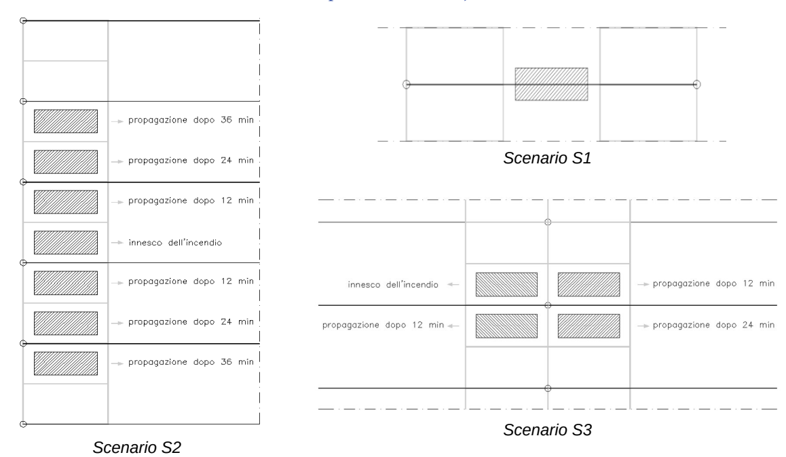

*Illustrazione V.6-1: Schematizzazione degli scenari di incendio di progetto*

<span id="page-282-1"></span>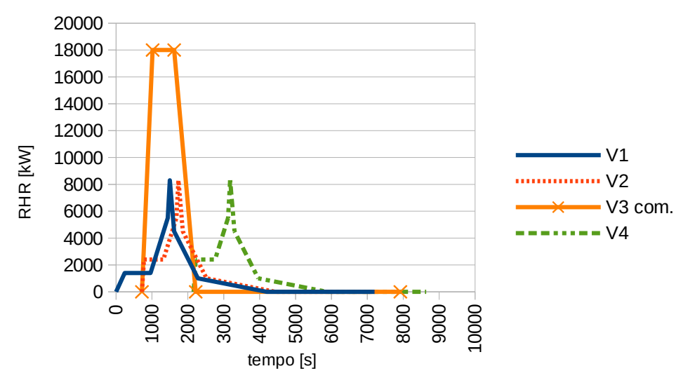

<span id="page-282-0"></span>*Illustrazione V.6-2: Curve RHR(t) per lo scenario S3*

#### V.6.7 Riferimenti

- <span id="page-283-0"></span>1. Si indicano i seguenti riferimenti bibliografici in merito al controllo di fumi e calore nelle autorimesse:
 - a. prCEN/TR 12101-11 "Smoke and heat control systems. Part 11: Indoor vehicle parks";
 - b. BS 7346-7:2013 "Components for smoke and heat control systems. Code of practice on functional recommendations and calculation methods for smoke and heat control systems for covered car parks";
 - c. CEN TC 191 SCI WG9 prEN TS 12101-11 nineteenth draft SHVC car parks 10-6-2015;
 - d. UNI 9494-2 "Sistemi per il controllo di fumo e calore Parte 2: Progettazione e installazione dei Sistemi di Evacuazione Forzata di Fumo e Calore (SEFFC)" Appendice H (informativa) "Requisiti dei sistemi meccanici per lo smaltimento del fumo e del calore di emergenza".
 - e. Arrêté du 9 mai 2006 "Approbation de dispositions complétant et modifiant le règlement de sécurité contre les risques d'incendie et de panique dans les établissements recevant du public (parcs de stationnement couverts) (ERP)", Francia:
 - f. prCEN/TS 12101-11 "Smoke and heat control systems Part 11: Horizontal flow powered ventilation systems for enclosed car parks";
 - g. Directorate-General for Research and Innovation (European Commission) "Temperature assessment of a vertical steel member subjected to localised fire (LOCAFI)", 2018;

## **REGOLE TECNICHE VERTICALI Capitolo V.7 Attività scolastiche**

<span id="page-284-0"></span>[Campo di applicazione](#page-285-1)

[Classificazioni](#page-285-0)

[Valutazione del rischio di incendio](#page-286-2)

[Strategia antincendio](#page-286-1)

[Reazione al fuoco](#page-286-0) [Resistenza al fuoco](#page-287-2) [Compartimentazione](#page-287-1) [Gestione della sicurezza antincendio](#page-287-0) [Controllo dell'incendio](#page-288-0) [Rivelazione ed allarme](#page-289-0) [Sicurezza degli impianti tecnologici e di servizio](#page-289-1)

#### V.7.1 Campo di applicazione

- <span id="page-285-1"></span>1. La presente regola tecnica verticale reca disposizioni di prevenzione incendi riguardanti attività scolastiche di ogni ordine, grado e tipo, collegi ed accademie con affollamento superiore a 100 occupanti.
- 2. Sono esclusi dal campo applicazione le scuole aziendali e gli ambienti didattici ubicati all'interno di attività non scolastiche per le quali le presenti norme possono costituire un utile riferimento.

#### V.7.2 Classificazioni

- <span id="page-285-0"></span>1. Ai fini della presente regola tecnica, le attività scolastiche sono classificate come segue:
 - a. in relazione al numero degli *occupanti* n:

**OA**: $100 < n \le 300$ ;

**OB**: $300 < n \le 500$ ;

**OC**: $500 < n \le 800$ ;

**OD**: $800 < n \le 1200$ :

**OE**: n > 1200;

b. in relazione alla massima quota dei piani h:

**HA**: $h \le 12 \text{ m}$ ;

**HB**: $12 \text{ m} < h \le 24 \text{ m}$ ;

**HC**: 24 m <h $\le$ 32 m:

**HD**: 32 m <h $\le$ 54 m;

**HE**: h > 54 m.

2. Le aree dell'attività sono classificate come segue:

TA: locali destinati ad attività didattica e spazi comuni;

**TM**: depositi o archivi di superficie lorda $> 25 \text{ m}^2$ e carico di incendio specifico $q_f > 600 \text{ MJ/m}^2$ ;

**TO**: locali con affollamento > 100 persone;

Nota Ad esempio: aula magna, mensa, ...

**TK**: locali ove si detengano o trattino sostanze o miscele pericolose o si effettuino lavorazioni pericolose ai fini dell'incendio o dell'esplosione; locali con carico di incendio specifico $q_f > 1200 \text{ MJ/m}^2$ ;

Nota Ad esempio: laboratori chimici, officine, sale prova motori, laboratori di saldatura, locali per lo stoccaggio di liquidi infiammabili, ...

**TT**: locali in cui siano presenti quantità significative di apparecchiature elettriche ed elettroniche, locali tecnici rilevanti ai fini della sicurezza antincendio;

Nota Ad esempio: centri elaborazione dati, stamperie, cabine elettriche, ...

Nota Ad esempio, le aule di informatica possono rientrare sia in TA che in TT, in tal caso devono rispettare tutte le relative prescrizioni.

TZ: altre aree.

3. Sono considerate *aree a rischio specifico* (capitolo V.1) almeno le aree TK.

#### V.7.3 Valutazione del rischio di incendio

- <span id="page-286-2"></span>1. La progettazione della sicurezza antincendio deve essere effettuata attuando la metodologia di cui al capitolo G.2.
- 2. I *profili di rischio* sono determinati secondo la metodologia di cui al capito-lo G.3.

## V.7.4 Strategia antincendio

- <span id="page-286-1"></span>1. Devono essere applicate *tutte* le misure antincendio della *regola tecnica oriz- zontale* attribuendo i livelli di prestazione secondo i criteri in esse definiti, fermo restando quanto indicato al successivo comma 3.
- 2. Devono essere applicate le prescrizioni del capitolo V.1 in merito alle aree a rischio specifico e le prescrizioni delle altre *regole tecniche verticali*, ove pertinenti.
- 3. Nei paragrafi che seguono sono riportate indicazioni complementari o sostitutive delle *soluzioni conformi* previste dai corrispondenti livelli di prestazione della RTO.
- 4. È ammesso l'uso dei locali per altre attività non funzionalmente connesse all'attività scolastica (es. attività sportive di società esterne, conferenze aperte al pubblico, attività teatrali, ...) nel rispetto delle regole tecniche di prevenzione incendi applicabili e compatibilmente con la sicurezza di tutte le attività contemporaneamente esercite.

#### V.7.4.1 Reazione al fuoco

- <span id="page-286-0"></span>1. Nelle vie d'esodo verticali, *percorsi d'esodo* (es. corridoi, atri, filtri, ...) e *spazi calmi* devono essere impiegati materiali appartenenti almeno al gruppo GM2 di reazione al fuoco (capitolo S.1).
- 2. Negli ambienti del comma 1 è ammesso l'impiego di materiali appartenenti al gruppo GM3 di reazione al fuoco (capitolo S.1) con l'incremento di un livello di prestazione delle misure richieste per il controllo dell'incendio (capitolo S.6) e per la rivelazione ed allarme (capitolo S.7).

#### **V.7.4.2 Resistenza al fuoco**

- <span id="page-287-2"></span>1. La classe di resistenza al fuoco dei compartimenti (capitolo [S.2\)](#page-68-0) non può essere inferiore a quanto previsto in tabella [V.7-1.](#page-287-4)
- 2. Qualora l'attività scolastica si sviluppi al solo piano terra, in opere da costruzione destinate esclusivamente a tale attività e non adiacenti ad altre opere da costruzione, e tutte le aree TA e TO dispongano di uscite dirette su luogo sicuro, è ammesso il livello di prestazione I per la misura antincendio *resistenza al fuoco* (capitolo [S.2](#page-68-0)).

| Compartimenti | Attività | | | | | | |
|---------------|----------|----|----|----|----|--|--|
| | HA | HB | HD | HE | | | |
| Fuori terra | 30 | 60 | | | 90 | | |
| Interrati | 60 | | | 90 | | | |

<span id="page-287-4"></span>*Tabella V.7-1: Classe di resistenza la fuoco*

## **V.7.4.3 Compartimentazione**

- <span id="page-287-1"></span>1. Le aree di tipo TA, TO devono essere ubicate a quota di piano ≥ -5 m.
- 2. Le aree dell'attività devono avere le caratteristiche di compartimentazione (capitolo [S.3](#page-104-0)) previste in tabella [V.7-2](#page-287-3).

| Area | Attività | | | | | |
|------------|-----------------------------------------------------------------------------------------------------------|----|----|----|----|--|
| | HA | HB | HC | HD | HE | |
| TA | Nessun requisito aggiuntivo | | | | | |
| TM, TO, TT | Di tipo protetto | | | | | |
| TK | Il resto dell'attività deve essere<br>Di tipo protetto [1]<br>a prova di fumo proveniente dall'area<br>TK | | | | | |
| TZ | Secondo risultanze della valutazione del rischio | | | | | |

<sup>[1]</sup> Di tipo protetto se ubicate a quota ≥ -5 m; in caso l'area TK sia ubicata a quota < -5 m il resto dell'attività deve essere a prova di fumo proveniente dall'area TK.

<span id="page-287-3"></span>*Tabella V.7-2: Compartimentazione*

#### **V.7.4.4 Gestione della sicurezza antincendio**

- <span id="page-287-0"></span>1. Nelle aree TA e TO deve essere affissa segnaletica indicante il massimo affollamento consentito (capitolo [S.4\)](#page-124-0).
- 2. Nella attività in cui è richiesto il livello di prestazione I di rivelazione ed allarme (capitolo [S.7\)](#page-198-0), deve essere prevista una procedura gestionale di sorveglianza periodica, durante l'orario di svolgimento dell'attività, delle aree TM e TK, se presenti.

Nota La sorveglianza periodica, che deve essere codificata nella pianificazione di emergenza (capitolo [S.5](#page-168-0)), si esplica attraverso ispezioni visive delle aree, effettuate da parte di personale addetto appositamente incaricato, per la verifica dell'assenza di anomalie rispetto alle normali condizioni di esercizio.

#### **V.7.4.5 Controllo dell'incendio**

- <span id="page-288-0"></span>1. Le aree dell'attività devono essere dotate di misure di controllo dell'incendio (capitolo [S.6](#page-182-0)) secondo i livelli di prestazione previsti in tabella [V.7-3](#page-288-3).
- 2. Ai fini della eventuale applicazione della norma UNI 10779, devono essere adottati i parametri riportati in tabella [V.7-4](#page-288-2).
- 3. Per la progettazione dell'eventuale impianto automatico di controllo o estinzione dell'incendio di tipo sprinkler secondo norma UNI EN 12845 devono essere adottati i parametri riportati in tabella [V.7-5](#page-288-1).

| Area | Attività | | | | | | |
|------------------------------------------------------------------------|-----------------------------------------------------|---------------|----|--|--|--|--|
| | HA | HB | HE | | | | |
| TA, TM, TO, TT | II | III | | | | | |
| TK | | III [1]<br>IV | | | | | |
| TZ | Secondo le risultanze della valutazione del rischio | | | | | | |
| [1] Livello di prestazione<br>IV qualora ubicati a quota <<br>-5<br>m. | | | | | | | |

<span id="page-288-3"></span>*Tabella V.7-3: Livelli di prestazione per controllo dell'incendio*

| Attività | Livello di pericolosità | Protezione esterna | Alimentazione idrica | |
|------------|-------------------------|--------------------|----------------------|--|
| OA, OB, OC | 1 | Non richiesta | Singola [3] | |
| OD, OE | 2 [2] | Sì [1] | Singola superiore | |

[1] Non richiesta per HA.

[2] Per le eventuali aree TK presenti nella attività classificate HA, è richiesto almeno il livello di pericolosità 1.

[3] È ammessa *alimentazione idrica di tipo promiscuo*.

<span id="page-288-2"></span>*Tabella V.7-4: Parametri progettuali per rete idranti secondo UNI 10779 e caratteristiche minime alimentazione idrica UNI EN 12845*

| Area | Alimentazione idrica | | | |
|----------------------------------------------------------------------------------------------------------|-----------------------|--|--|--|
| TK | Singola superiore [1] | | | |
| [1] Per le eventuali aree<br>TK inserite in attività<br>OA, OB, OC alimentazione idrica di tipo singolo. | | | | |

<span id="page-288-1"></span>*Tabella V.7-5: Parametri progettuali impianto sprinkler e caratteristiche minime alimentazione idrica secondo UNI EN 12845*

#### **V.7.4.6 Rivelazione ed allarme**

<span id="page-289-0"></span>1. L'attività deve essere dotata di misure di rivelazione ed allarme (capitolo [S.7\)](#page-198-0) secondo i livelli di prestazione di cui alla tabella [V.7-6](#page-289-2).

| Attività | Attività | | | | |
|----------|----------|--------|-----|----|----|
| | HA | HB | HC | HD | HE |
| OA | I [2] | II [1] | III | | IV |
| OB | II [1] | | III | IV | |
| OC | III | | | IV | |
| OD | III | | IV | | |
| OE | | | IV | | |

<sup>[1]</sup> Se presenti, le aree TM, TK e TT devono essere sorvegliate da rivelazione automatica d'incendio (funzione A, capitolo [S.7](#page-198-0))

<span id="page-289-2"></span>*Tabella V.7-6: Livello di prestazione per rivelazione ed allarme*

## **V.7.4.7 Sicurezza degli impianti tecnologici e di servizio**

<span id="page-289-1"></span>1. I gas refrigeranti negli impianti di climatizzazione e condizionamento (capitolo [S.10](#page-226-0)) inseriti in aree TA o TO devono essere classificati A1 o A2L secondo ISO 817.

<sup>[2]</sup> Il livello di prestazione I può essere garantito anche dallo stesso impianto a campanelli usato normalmente per l'attività scolastica, purché sia convenuto e codificato un particolare suono nella pianificazione di emergenza (capitolo [S.5\)](#page-168-0).

## **REGOLE TECNICHE VERTICALI Capitolo V.8 Attività commerciali**

<span id="page-290-0"></span>[Campo di applicazione](#page-291-2)

[Definizioni](#page-291-1)

[Classificazioni](#page-291-0)

[Valutazione del rischio di incendio](#page-292-0)

#### [Strategia antincendio](#page-293-2)

[Reazione al fuoco](#page-293-1) [Resistenza al fuoco](#page-293-0) [Compartimentazione](#page-294-0) [Esodo](#page-296-1) [Gestione della sicurezza antincendio](#page-296-0)

[Controllo dell'incendio](#page-297-0) [Rivelazione ed allarme](#page-298-0) [Controllo di fumi e calore](#page-299-3) [Operatività antincendio](#page-299-2)

[Sicurezza impianti tecnologici e di servizio](#page-299-1)

[Altre indicazioni](#page-299-0)

[Riferimenti](#page-300-0)

#### **V.8.1 Campo di applicazione**

<span id="page-291-2"></span>1. La presente regola tecnica verticale reca disposizioni di prevenzione incendi riguardanti le attività commerciali, ove sia prevista la vendita e l'esposizione di beni, con superficie lorda superiore a 400 m 2 comprensiva di servizi, depositi e spazi comuni coperti.

#### **V.8.2 Definizioni**

- <span id="page-291-1"></span>1. Attività commerciale: attività costituita da una o più aree di vendita comunicanti anche afferenti a responsabili diversi, comprensiva di servizi, depositi e spazi comuni coperti.
- 2. Spazio comune: area a servizio di più aree di vendita (es. atrii, gallerie, sistemi di collegamento quali corridoi, scale, …).
- 3. Mall: galleria interna all'attività commerciale anche su più piani su cui si affacciano le aree di vendita, i relativi servizi e depositi.
- 4. Vendita da retrobanco: attività commerciale con limitati spazi aperti al pubblico per la vendita e l'esposizione dei beni.

Nota In queste attività la vendita viene effettuata al banco, ordinando i beni che vengono prelevati dagli addetti dell'attività commerciale (es. autoricambi, ferramenta, distributori di materiale elettrico, idraulico, …).

5. Articoli pirotecnici NSL: *articoli pirotecnici* non soggetti a *licenza per la minuta vendita di esplosivi* ai sensi del Regio Decreto 18 giugno 1931, n. 773.

#### **V.8.3 Classificazioni**

- <span id="page-291-0"></span>1. Ai fini della presente regola tecnica, le attività commerciali sono classificate come segue:
 - a. in relazione alla *superficie lorda utile* A:

**AA**: A ≤ 1500 m 2 ;

**AB**: 1500 m 2 < A ≤ 3000 m 2 ;

**AC**: 3000 m 2 < A ≤ 5000 m 2 ;

**AD**: 5000 m 2 < A ≤ 10000 m 2 ;

**AE**: A > 10000 m 2 .

Nota Nel computo della *superficie lorda utile* A, oltre alle aree destinate alla vendita, devono essere considerate solo le aree destinate a servizi, depositi e spazi comuni coperti direttamente funzionali all'attività commerciale, così come definite al successivo comma 2. Ad esempio, non si considerano aree direttamente funzionali quelle delle attività produttive o artigianali eventualmente presenti nell'opera da costruzione, anche se comunicanti con l'attività commerciale.

Nota La *superficie lorda utile* A è impiegata per l'individuazione delle misure di sicurezza e non ai fini del campo di applicazione della presente regola tecnica.

b. in relazione alla *quota dei piani* h:

**HA**: -1 m ≤ h ≤ 6 m;

**HB**: -5 m ≤ h ≤ 12 m;

**HC**: -10 m ≤ h ≤ 24 m;

**HD**: tutti gli altri casi non rientranti nella classificazione precedente.

Nota Per la classificazione in relazione alla quota dei piani h possono essere omesse le quote dei piani dei percorsi di collegamento dell'attività commerciale con altre attività (es. autorimesse, locali di pubblico spettacolo, ...).

2. Le aree dell'attività direttamente funzionali sono classificate come segue:

**TA**: aree di vendita ed esposizione comprensive di spazi comuni, accessibili al pubblico;

**TB1**: aree di vendita ed esposizione comprensive di spazi comuni, accessibili al pubblico in numero limitato ed accompagnato da addetti;

Nota Ad esempio: *showroom* aziendale inserito in un'attività produttiva, artigianale o di servizio.

Nota Fanno parte delle aree TA eventuali showrooms inseriti in un centro commerciale.

**TB2**: aree per vendita da retrobanco comprensive di spazi comuni, accessibili al pubblico, di superficie $\leq 100 \text{ m}^2$ ;

Nota Ad esempio: punti vendita di ricambi o componenti, ...

**TC**: aree non aperte al pubblico, adibite ad uffici e servizi, di superficie $> 200 \text{ m}^2$ ;

**TK1**: aree collegate ad aree TA ove si effettuano lavorazioni pericolose ai fini dell'incendio o dell'esplosione, aventi superficie > 150 m²;

Nota Ad esempio: aree di taglio legno, officine di montaggio o riparazione di parti, aree per la miscelazione di vernici, ...

**TK2**: aree esterne all'opera da costruzione, coperte o scoperte, destinate anche temporaneamente allo stoccaggio, alla movimentazione ed al carico/scarico delle merci, al deposito dei materiali di scarto e degli imballaggi;

**TM1**: depositi con carico di incendio specifico $q_{\rm f} > 600~{\rm MJ/m^2}$ , aventi superficie $> 200~{\rm m^2}$ ;

**TM2**: depositi con carico di incendio specifico $q_f > 1200 \text{ MJ/m}^2$ ;

**TM3**: depositi di *articoli pirotecnici NSL*, con quantitativi netti di manufatti ≤ 150 kg;

**TT1**: locali in cui siano presenti quantità significative di apparecchiature elettriche ed elettroniche, locali tecnici rilevanti ai fini della sicurezza antincendio;

Nota Ad esempio: CED, sala server, cabine elettriche, ...

**TT2**: aree destinate alla ricarica di accumulatori elettrici di trazione;

Nota Ad esempio muletti, *transpallet*, macchine per la pulizia con uomo a bordo. ...

TZ: altre aree.

3. Sono considerate aree a rischio specifico (capitolo V.1) almeno le seguenti aree: aree TK1, TK2, TM2, TM3, TT2.

#### V.8.4 Valutazione del rischio di incendio

- <span id="page-292-0"></span>1. La progettazione della sicurezza antincendio deve essere effettuata attuando la metodologia di cui al capitolo G.2.
- 2. I *profili di rischio* sono determinati secondo la metodologia di cui al capito-lo G.3.

#### V.8.5 Strategia antincendio

- <span id="page-293-2"></span>1. Devono essere applicate *tutte* le misure antincendio della *regola tecnica oriz- zontale* attribuendo i livelli di prestazione secondo i criteri in esse definiti, fermo restando quanto indicato al successivo comma 3.
- 2. Devono essere applicate le prescrizioni del capitolo V.1 in merito alle aree a rischio specifico e le prescrizioni delle altre *regole tecniche verticali*, ove pertinenti.
- 3. Nei paragrafi che seguono sono riportate indicazioni complementari o sostitutive delle *soluzioni conformi* previste dai corrispondenti livelli di prestazione della RTO.

#### V.8.5.1 Reazione al fuoco

- <span id="page-293-1"></span>1. Nelle vie d'esodo verticali, *percorsi d'esodo* (es. corridoi, atri, filtri, ...) e *spazi calmi* devono essere impiegati materiali appartenenti almeno al gruppo GM2 di reazione al fuoco (capitolo S.1).
- 2. Negli spazi di esposizione e vendita delle aree TA devono essere impiegati materiali almeno appartenenti al gruppo GM3, limitatamente ai materiali per *rivestimento e completamento*, per *isolamento*, per *impianti* (paragrafo S.1.5).

#### V.8.5.2 Resistenza al fuoco

<span id="page-293-0"></span>1. La classe di resistenza al fuoco dei compartimenti (capitolo S.2) non può essere inferiore a quanto previsto in tabella V.8-1.

| Comportimenti | Attività | | | |
|---------------|----------|----|----|----|
| Compartimenti | НА | НВ | HC | HD |
| Fuori terra | 30 [1] | 60 | | 90 |
| Interrati | - | 90 | | |

[1] Per le attività classificate AA o AB, che occupino un unico piano a quota compresa fra -1 m e +1 m, in opere da costruzione destinate esclusivamente a tali attività e compartimentate rispetto ad altre opere da costruzione, senza comunicazioni, è ammessa classe di resistenza al fuoco $\geq$ 15.

<span id="page-293-3"></span>Tabella V.8-1: Classe di resistenza al fuoco

## **V.8.5.3 Compartimentazione**

- <span id="page-294-0"></span>1. Le aree di tipo TA devono rispettare le quote di piano, le limitazioni e le misure antincendio della tabella [V.8-2](#page-295-1).
- 2. Le aree dell'attività devono avere le caratteristiche di compartimentazione (capitolo [S.3](#page-104-0)) previste in tabella [V.8-3](#page-295-0)
- 3. Per le attività con controllo dell'incendio (capitolo [S.6\)](#page-182-0) di livello di prestazione IV, la quota 12 m dei piani del paragrafo [S.3.6.2](#page-113-0) per la *compartimentazione multipiano* è riferibile a 15 m.
- 4. Le aree TA devono essere compartimentate rispetto alle aree TK2, oppure devono essere interposte distanze di separazione (capitolo [S.3](#page-104-0)) assumendo il carico d'incendio specifico delle aree TK2 q<sup>f</sup> ≥ 600 MJ/m<sup>2</sup> .
- 5. Sono ammesse le seguenti comunicazioni tra diverse attività (capitolo [S.3\)](#page-104-0):
 - a. di tipo protetto e chiusure almeno E 30-Sa tra le attività commerciali con aree di tipo TB1 o TB2 ed *altre attività*, con sistemi d'esodo indipendenti;

Nota Si ammettono comunicazioni delle aree TB1 o TB2 anche verso attività industriali produttive o artigianali.

- b. di tipo a prova di fumo tra le attività commerciali classificate AA+HA o AA+HB ed altre *attività civili* con sistemi d'esodo comuni;
- c. senza requisiti di compartimentazione tra le attività commerciali classificate AA+HA o AA+HB ed altre attività con δocc = E (capitolo [G.3\)](#page-50-0) con sistemi di esodo comuni;
- d. senza requisiti di compartimentazione tra le attività commerciali dotate di controllo dell'incendio (capitolo [S.6](#page-182-0)) di livello di prestazione V e controllo di fumo e calore (capitolo [S.8](#page-208-0)) di livello di prestazione III ed altre attività con δocc = E (capitolo [G.3](#page-50-0)) con sistemi d'esodo comuni;
- e. di tipo protetto tra le attività commerciali ed altre *attività civili* con sistemi d'esodo indipendenti;
- f. di tipo a prova di fumo tra le attività commerciali ed *altre attività* con sistemi d'esodo indipendenti.

| Quote dei piani | Limitazioni | Misure antincendio aggiuntive | | |
|---------------------|-----------------------------------|--------------------------------------------------------------------------------------------------------------------------------------------------------------------------------------------------------------------------------------------------------------|--|--|
| -1 m ≤ h ≤ 12 m | Nessuna | Nessun requisito aggiuntivo | | |
| h > 12 m | Nessuna | ●<br>Rivelazione ed allarme (capitolo<br>S.7) di livello di prestazione<br>IV;<br>●<br>Tutte le vie d'esodo verticali di tipo protetto<br>[1]. | | |
| -5 m ≤ h < -1 m [3] | AA con<br>qf<br>≤<br>600<br>MJ/m2 | Nessun requisito aggiuntivo | | |
| -5 m ≤ h < -1 m [3] | Nessuna | ●<br>Controllo dell'incendio (capitolo<br>S.6) di livello di prestazione<br>IV [2];<br>●<br>Rivelazione ed allarme (capitolo<br>S.7) di livello di prestazione<br>IV;<br>●<br>Controllo di fumi e calore (capitolo<br>S.8) di livello di prestazione<br>III. | | |

<sup>[1]</sup> Per attività con quota dei piani h > 24 m, vie di esodo verticali di tipo a prova di fumo.

<span id="page-295-1"></span>*Tabella V.8-2: Quote di piano, limitazioni e misure antincendio delle aree di tipo TA*

| Area | Attività | | | | |
|------------------------|---------------------------------|----|------------------------------------------------------------------------|----|--|
| | HA | HB | HC | HD | |
| TA, TB1, TB2 | Nessun requisito aggiuntivo | | | | |
| TC, TM1, TM3, TT1, TT2 | Di tipo protetto [1] | | | | |
| TK1, TM2 | Di tipo protetto [2] | | Resto dell'attività a prova di fumo<br>proveniente dalle aree TK1, TM2 | | |
| TZ | Secondo valutazione del rischio | | | | |

<sup>[1]</sup> Nessun requisito aggiuntivo per le aree TM1 rispetto alle aree TB2.

<span id="page-295-0"></span>*Tabella V.8-3: Compartimentazione*

<sup>[2]</sup> Per attività con carico d'incendio specifico qf ≤ 600 MJ/m<sup>2</sup> è ammesso il livello di prestazione III per il controllo dell'incendio (capitolo [S.6](#page-182-0)).

<sup>[3]</sup> Nel caso di un solo piano interrato è ammessa quota dei piani h sino a -7,5 m.

<sup>[2]</sup> Per attività HB, se le aree TK1 o TM2 sono ubicate a quota < -1 m, il resto dell'attività accessibile al pubblico deve essere a prova di fumo proveniente dalle medesime aree.

#### V.8.5.4 Esodo

<span id="page-296-1"></span>1. La progettazione dell'esodo (capitolo S.4) deve prevedere densità di affollamento almeno pari a 0,2 persone/m² per gli spazi comuni aperti al pubblico considerando, inoltre, gli eventuali ulteriori affollamenti provenienti da altre attività.

Nota Ad esempio, si considerano affollamenti provenienti da altre attività quelli provenienti dalle banchine delle stazioni, aerostazioni, dagli alberghi, autorimesse, impianti sportivi, che eventualmente adducano negli spazi comuni aperti al pubblico.

- 2. Ai fini della determinazione dell'*affollamento* (capitolo S.4) si considerano:
 - a. aree di vendita di piccole attività commerciali al dettaglio con settore alimentare o misto le aree TA delle attività AA o AB;
 - b. aree di vendita di piccole attività commerciali al dettaglio con specifica gamma merceologica non alimentare le aree TA delle attività AA;
- 3. Le vie d'esodo (capitolo S.4) delle aree TA non devono attraversare le altre tipologie di aree.
- 4. Ai fini del computo della lunghezza di esodo, la *mall* può essere assimilata a *luogo sicuro temporaneo* se sono verificate tutte le condizioni di cui alla tabella V.8-4.

Carico di incendio specifico nella mall $q_f \le 50$ MJ/m<sup>2</sup>, anche in presenza di allestimenti a carattere temporaneo.

Distanza minima L fra facciate contrapposte che si affacciano sulla mall pari a $\sqrt{(7H)}$ con H altezza della facciata più alta ed L comunque $\geq$ 7 m.

Controllo dell'incendio (capitolo S.6) di livello di prestazione IV, esteso a tutti gli ambiti non compartimentati che si affacciano nella mall.

Rivelazione e allarme (capitolo S.7) di livello di prestazione IV, esteso alla mall e a tutti gli ambiti non compartimentati che vi si affacciano.

Controllo fumo e calore (capitolo S.8) di livello di prestazione III, esteso alla mall e a tutti gli ambiti non compartimentati che vi si affacciano.

<span id="page-296-2"></span>Tabella V.8-4: Condizioni per assimilare la mall a luogo sicuro temporaneo

#### V.8.5.5 Gestione della sicurezza antincendio

- <span id="page-296-0"></span>1. Le attività commerciali con sistemi d'esodo comuni rispetto ad altre attività (capitolo S.3) devono adottare la GSA (capitolo S.5) di livello di prestazione III.
- 2. La GSA in condizione ordinarie (capitolo S.5) deve prevedere specifiche procedure per la verifica e l'osservanza delle limitazioni e delle condizioni di esercizio previste nella progettazione delle singole aree dell'attività.
- Nota Le limitazioni e le condizioni previste nella progettazione (es. per i gruppi di materiali ai fini della reazione al fuoco, i valori del carico d'incendio specifico, le larghezze utili delle vie d'esodo, ...) devono essere garantiti anche durante le fasi di approvvigionamento e movimentazione delle merci o in occasione di allestimenti temporanei promozionali o di spettacolo viaggiante.
 - 3. Le attività classificate AD+HB, AD+HC, AE o HD devono prevedere il centro di gestione delle emergenze in apposito locale (capitolo S.5).

#### V.8.5.6 Controllo dell'incendio

- <span id="page-297-0"></span>1. L'attività deve essere dotata di misure di controllo dell'incendio (capitolo S.6) secondo i livelli di prestazione previsti in tabella V.8-5.
- 2. Per la scelta del tipo di estintori, nella aree TA, TB1 e TB2, è necessario tener conto degli effetti causati sugli occupanti dall'erogazione dell'agente estinguente

Nota Al fine dell'efficacia nei confronti dei principi di incendio di classe A o classe B, è preferibile l'utilizzo di estintori a base d'acqua (estintori idrici).

- 3. Nella aree TK2 con $q_f > 1200 \text{ MJ/m}^2$ deve essere prevista la protezione mediante una *rete idranti all'aperto*. Ai fini della eventuale applicazione della norma UNI 10779, devono essere adottati i parametri riportati in tabella V.8-6.
- 4. Ai fini della eventuale applicazione della norma UNI 10779 per le reti idranti ordinarie, devono essere adottati i parametri riportati in tabella V.8-7.
- 5. Per la progettazione dell'eventuale impianto automatico di controllo o estinzione dell'incendio di tipo sprinkler secondo norma UNI EN 12845 devono essere adottati i parametri riportati in tabella V.8-8.

| Attività | Area | Attività | | | |
|-----------|---------------|---------------------------------|-----|------------|-------|
| | | НА | НВ | НС | HD |
| AA | | II | [1] | III | IV |
| AB | TA, TB1 | III [2], [3] | | III [3] | IV |
| AC | | III [3] | | IV | V [5] |
| AD | | III [3] | IV | V [4], [5] | V [5] |
| AE | Qualsiasi | V [5] | | | |
| Qualsiasi | TK1, TM1, TM3 | III [3] | | IV | |
| Qualsiasi | TM2 | IV | | | |
| Qualsiasi | TZ | Secondo valutazione del rischio | | | |

<sup>[1]</sup> Livello di prestazione III per le attività con carico d'incendio specifico $q_f > 600 \text{ MJ/m}^2$ .

<span id="page-297-2"></span>Tabella V.8-5: Livelli di prestazione per il controllo dell'incendio

| Livello di pericolosità | Tipo di protezione | Alimentazione idrica |
|-------------------------|--------------------|----------------------|
| 2 | Capacità ordinaria | Singola |

<span id="page-297-1"></span>Tabella V.8-6: Parametri progettuali per rete idranti all'aperto secondo UNI 10779 e caratteristiche minime alimentazione idrica UNI EN 12845

<sup>[2]</sup> Livello di prestazione II per le attività con carico d'incendio specifico $q_f < 100 \text{ MJ/m}^2$ .

<sup>[3]</sup> Livello di prestazione IV con carico d'incendio specifico $q_f > 900 \text{ MJ/m}^2$ , oppure con carico d'incendio specifico $q_f > 600 \text{ MJ/m}^2$ se ubicate in opere da costruzione con presenza di altre attività (fabbricato o edificio di tipo misto).

<sup>[4]</sup> Livello di prestazione IV con carico d'incendio specifico $q_f \le 600 \text{ MJ/m}^2$ .

<sup>[5]</sup> Per le aree TK2, livello di prestazione III

| Attività | | Livello di | Protezione | Alimentazione |
|------------|-----------------|--------------|---------------|-----------------------|
| Superficie | Quota dei piani | pericolosità | esterna | idrica |
| AA | Qualsiasi | 1 [1] | Non richiesta | Singola [2] |
| AB, AC | HA, HB, HC | 2 | Non richiesta | Singola |
| AB, AC | HD | 2 [3] | Sì | Singola superiore |
| AD | Qualsiasi | 2 [3] | Sì | Singola superiore |
| AE | Qualsiasi | 3 | Sì | Singola superiore [4] |

<sup>[1]</sup> Per le attività HC o HD si indica il livello di pericolosità 2.

<span id="page-298-2"></span>Tabella V.8-7: Parametri progettuali per rete idranti ordinarie secondo UNI 10779 e caratteristiche minime alimentazione idrica UNI EN 12845

| Attività | Alimentazione idrica |
|----------------|----------------------------|
| AA, AB, AC, AD | Singola superiore [1], [2] |
| AE | Singola superiore [3] |

<sup>[1]</sup> Per le eventuali aree TK1 o TM inserite in attività AA o AB si indica alimentazione idrica di tipo singolo.

<span id="page-298-1"></span>Tabella V.8-8: Parametri progettuali impianto sprinkler e caratteristiche minime alimentazione idrica secondo UNI EN 12845

#### V.8.5.7 Rivelazione ed allarme

- <span id="page-298-0"></span>1. L'attività deve essere dotata di misure di rivelazione ed allarme (capitolo S.7) secondo i livelli di prestazione di cui alla tabella V.8-9.
- 2. Per il livello di prestazione IV deve essere previsto il sistema EVAC esteso almeno alle aree TA.

| Attività | | | | |
|------------|--------------|---------|----|----|
| Superficie | НА | НВ | НС | HD |
| AA | III [1], [2] | III [2] | | IV |
| AB, AC | III [2] | IV | | |
| AD, AE | IV | | | |

<sup>[1]</sup> Per attività con carico d'incendio specifico $q_f \le 600 \text{ MJ/m}^2$ o ubicata in un'opera da costruzione monopiano è consentito il livello di prestazione II.

<span id="page-298-3"></span>Tabella V.8-9: Livelli di prestazione per rivelazione ed allarme

<sup>[2]</sup> Per le attività AA+HA è ammessa alimentazione idrica di tipo promiscuo; per le attività HD si indica alimentazione idrica di tipo singola superiore.

<sup>[3]</sup> Per le attività con carico di incendio specifico $q_f > 1200 \text{ MJ/m}^2$ si indica il livello di pericolosità 3.

<sup>[4]</sup> Per le attività AE con superficie lorda utile > 50000 m² si indica alimentazione doppia.

<sup>[2]</sup> Per le eventuali aree TZ secondo valutazione del rischio.

<sup>[3]</sup> Per le attività AE con superfici lorda utile > 50000 m² si indica alimentazione doppia.

<sup>[2]</sup> Le eventuali funzioni E, F, G ed H devono essere automatiche su comando della centrale o con centrali autonome di azionamento asservite alla centrale master.

#### **V.8.5.8 Controllo di fumi e calore**

<span id="page-299-3"></span>1. Le aree TA devono essere dotate di misure per il controllo di fumi e calore (capitolo [S.8](#page-208-0)) secondo i livelli di prestazione di cui alla tabella [V.8-10](#page-299-4).

| Attività | Condizioni | Livello di prestazione |
|----------------|------------------------------------------------------------------------------------------------------------------------------------------------------|------------------------|
| AA | Nessuna | II |
| AB, AC | Carico d'incendio specifico qf <<br>600<br>MJ/m2<br>e velocità caratteristica<br>prevalente di crescita dell'incendio δa<br><<br>3 (capitolo<br>G.3) | II |
| AB, AC, AD, AE | Nessuna | III |

<span id="page-299-4"></span>*Tabella V.8-10: Livelli di prestazione per il controllo di fumi e calore per le aree TA*

## **V.8.5.9 Operatività antincendio**

<span id="page-299-2"></span>1. Le attività di tipo HC e HD devono essere dotate di almeno un ascensore antincendio (capitolo [S.9](#page-218-0) e capitolo [V.3\)](#page-254-0) a servizio di tutti i piani dell'attività.

## **V.8.5.10 Sicurezza impianti tecnologici e di servizio**

<span id="page-299-1"></span>1. I gas refrigeranti negli impianti centralizzati di climatizzazione e condizionamento (capitolo [S.10](#page-226-0)) e di refrigerazione alimentare, inseriti in aree TA, devono essere classificati A1 o A2L secondo ISO 817.

#### **V.8.6 Altre indicazioni**

<span id="page-299-0"></span>1. All'interno delle aree TA, TB1 e TB2 non è ammesso l'impiego di apparecchiature alimentate a combustibile liquido o gassoso.

Nota Ad esempio, è ammesso l'impiego di apparecchi di cottura a combustibile solido (es. forni di cottura, …) o alimentati ad energia elettrica (es. piastre di cottura, …).

- 2. All'interno delle aree TA, TB1 e TB2 sono comunque ammessi, per ciascun compartimento antincendio:
 - a. fluidi combustibili o prodotti contenuti in recipienti a pressione (es. insetticida, prodotti spray in genere, cosmetici, alcooli in concentrazione > 60% in volume, olii lubrificanti, …) ≤ 1 m 3 di cui massimo 0,3 m 3 di liquidi con punto di infiammabilità < 21°C;
 - b. recipienti di GPL di singola capacità ≤ 5 kg, in quantitativi ≤ 75 kg, in locali posti a quota h ≥ -1 m;
 - c. *articoli pirotecnici NSL*, con quantitativi netti di manufatti ≤ 50 kg.

#### V.8.7 Riferimenti

- <span id="page-300-0"></span>1. Si indicano i seguenti riferimenti:
 - a. Instruction technique n°263 relative à la construction et au désenfumage des volumes libres intérieurs dans les établissements recevant du public, France.
 - b. ISO 817 "Refrigerants Designation and safety classification".
 - c. "Fire safety management of shopping centres with covered malls", Issue No. 1 November 2012, Dublin Fire Brigade.
 - d. "Fire safety design of a large shopping mall using extended quantitative risk analysis", The Swedish Case Study for the 3rd International Conference on Performance Based Codes and Fire Safety Design Methods, Lund, Sweden, June 15th-17th, 2000.
 - e. I D Bennetts, K W Poh, I R Thomas, "*Design of sprinklered shopping centre buildings for fire safety*", OneSteel, Australia, November 2000.
 - f. McMillan, Jenny, "*A guideline for the fire design of shopping centres*", Fire Engineering Research Report 00/16, University of Canterbury, New Zeland.

## **REGOLE TECNICHE VERTICALI Capitolo V.9 Asili nido**

<span id="page-302-0"></span>[Campo di applicazione](#page-303-2)

[Definizioni](#page-303-1)

[Classificazioni](#page-303-0)

[Valutazione del rischio di incendio](#page-304-3)

[Strategia antincendio](#page-304-2)

[Reazione al fuoco](#page-304-1) [Resistenza al fuoco](#page-304-0) [Compartimentazione](#page-305-2) [Esodo](#page-305-1) [Gestione della sicurezza antincendio](#page-305-0) [Controllo dell'incendio](#page-306-1) [Rivelazione ed allarme](#page-306-0) [Sicurezza degli impianti tecnologici e di servizio](#page-306-2)

#### V.9.1 Campo di applicazione

<span id="page-303-2"></span>1. La presente regola tecnica verticale si applica agli asili nido con numero di occupanti > 30.

#### V.9.2 Definizioni

- <span id="page-303-1"></span>1. Bambini: occupanti di età compresa tra i 3 ed i 36 mesi.
- 2. Asili nido: strutture educative destinate ai bambini.
- 3. Attestato di idoneità tecnica: attestato previsto dall'articolo 3 del decreto legge 1 ottobre 1996 n. 512 convertito, con modificazioni, dalla legge 28 novembre 1996 n. 609.

#### V.9.3 Classificazioni

- <span id="page-303-0"></span>1. Ai fini della presente regola tecnica, gli asili nido sono classificati come segue:
 - a. in relazione alla massima *quota dei piani* h:

**HA**: $h \le 12 \text{ m}$ ;

**HB**: $12 \text{ m} < h \le 32 \text{ m}$ ;

**HC**: $32 \text{ m} < h \le 54 \text{ m}$ :

**HD**: h > 54 m.

2. Le aree dell'attività sono classificate come segue:

**TA**: aree destinate principalmente alla presenza di bambini;

**TB**: aree destinate ad uffici o servizi;

Nota Per servizi si intendono, ad esempio: servizi igienici, ambulatori, spogliatoi, ... Per servizi non sono da intendersi aree destinate ad impianti.

**TC**: aree destinate al confezionamento dei pasti nel caso vi sia presenza di impianti a gas;

**TM1:** locali destinati a lavaggio della biancheria o a deposito con carico di incendio specifico $q_f > 300 \ MJ/m^2$ ;

**TM2**: locali destinati a lavaggio della biancheria o a deposito con carico d'incendio specifico $q_f > 900 \text{ MJ/m}^2$ ;

**TO**: aree destinate a spazi comuni;

TZ: altre aree.

3. Sono considerate *aree a rischio specifico* (capitolo V.1) almeno le seguenti aree dell'attività: aree TM2.

Capitolo V.9 Asili nido

#### V.9.4 Valutazione del rischio di incendio

- <span id="page-304-3"></span>1. La progettazione della sicurezza antincendio deve essere effettuata attuando la metodologia di cui al capitolo G.2.
- 2. I *profili di rischio* sono determinati secondo la metodologia di cui al capito-lo G 3
- 3. La valutazione del rischio di incendio deve tenere conto della vulnerabilità e delle capacità motorie, che non consentono di raggiungere autonomamente un luogo sicuro, nonché delle condizioni di permanenza dei bambini nella struttura (es. in culla, nei lettini, ...), soprattutto ai fini della progettazione del sistema di esodo (capitolo S.4) e della gestione della sicurezza antincendio (capitolo S.5).

#### V.9.5 Strategia antincendio

- <span id="page-304-2"></span>1. Devono essere applicate *tutte* le misure antincendio della *regola tecnica oriz- zontale* (RTO) attribuendo i livelli di prestazione secondo i criteri in esse definiti, fermo restando quanto indicato al successivo punto 4.
- 2. Devono essere applicate le prescrizioni del capitolo V.1 in merito alle aree a rischio specifico e le prescrizioni delle altre *regole tecniche verticali*, ove pertinenti.
- 3. Non sono ammesse aree a rischio per *atmosfere esplosive*.
- 4. Nei paragrafi che seguono sono riportate le indicazioni complementari o sostitutive delle *soluzioni conformi* previste dai corrispondenti livelli di prestazione della RTO.

#### V.9.5.1 Reazione al fuoco

<span id="page-304-1"></span>1. Nelle aree TA sono ammessi solo materiali del gruppo GM1.

Nota I corredi personali dei bambini (es. coperte, copriletti, cuscini, ...) ed i giochi non sono da considerarsi materiali.

#### V.9.5.2 Resistenza al fuoco

<span id="page-304-0"></span>1. La classe di resistenza al fuoco dei compartimenti (capitolo S.2) non può essere comunque inferiore a quanto previsto in tabella V.9-1.

| Comportimenti | Attività | | | |
|---------------|----------|----|----|----|
| Compartimenti | НА | НВ | HC | HD |
| Fuori terra | 30 | 60 | | 90 |
| Interrati | 60 | | 90 | |

<span id="page-304-4"></span>Tabella V.9-1: Classe di resistenza al fuoco

Capitolo V.9 Asili nido Pagina V.9-3

## **V.9.5.3 Compartimentazione**

- <span id="page-305-2"></span>1. Le aree TA devono essere ubicate *a quota di piano* ≥ -1 m.
- 2. Le aree dell'attività devono avere le caratteristiche di compartimentazione (capitolo [S.3](#page-104-0)) previste in tabella [V.9-2](#page-305-3).

| Area | | Attività | | |
|-------------|---------------------------------------------------------------------------------|----------|----|----|
| | HA | HB | HC | HD |
| TA, TB e TO | Di tipo protetto con superficie lorda massima del compartimento ≤<br>1000<br>m2 | | | |
| TC | Di tipo protetto | | | |
| TM1 | Di tipo protetto | | | |
| TM2 | Il resto dell'attività deve essere a prova di fumo proveniente dall'area TM2 | | | |
| TZ | Secondo risultanze della valutazione del rischio | | | |

<span id="page-305-3"></span>*Tabella V.9-2: Compartimentazione*

#### **V.9.5.4 Esodo**

- <span id="page-305-1"></span>1. Nelle aree TA l'affollamento è pari al numero massimo di occupanti previsto.
- 2. Da ciascuna area TA e TO è ammessa lunghezza di corridoio cieco Lcc ≤ 20 m ed affollamento degli ambiti serviti ≤ 50 occupanti.
- 3. Nelle aree TA, TB e TO deve essere prevista segnaletica di sicurezza a pavimento finalizzata ad indicare le vie d'esodo fino al luogo sicuro in ogni condizione di esercizio dell'attività.

Nota La segnaletica a pavimento può essere di tipo retroilluminato o catarifrangente.

#### **V.9.5.5 Gestione della sicurezza antincendio**

- <span id="page-305-0"></span>1. Ai soli fini dell'attribuzione del livello di prestazione della gestione della sicurezza antincendio, il *numero di posti letto* è da assumersi pari al numero dei bambini.
- 2. La frequenza delle prove di attuazione del piano di emergenza deve essere ≥ 3 volte l'anno e, comunque, la prima prova deve essere effettuata entro due mesi dall'apertura dell'anno educativo.

Nota Nel piano di emergenza si deve tenere conto dell'eventuale impiego di specifici ausili, anche carrellati, per l'evacuazione dei bambini.

3. Tutto il personale addetto all'attività deve ricevere formazione antincendio specifica secondo la normativa vigente. Di esso, un numero ≥ 4 fino a 50 *occupanti* deve essere in possesso di specifico attestato di idoneità tecnica. In caso di più di 50 *occupanti*, la necessità di un numero superiore di addetti in possesso di *attestato di idoneità tecnica* è frutto di specifica valutazione del rischio.

#### **V.9.5.6 Controllo dell'incendio**

<span id="page-306-1"></span>1. Le aree dell'attività devono essere dotate di misure di controllo dell'incendio (capitolo [S.6](#page-182-0)) secondo i livelli di prestazione previsti in tabella [V.9-3](#page-306-3).

Nota È preferibile l'impiego di estintori con agente estinguente a base d'acqua.

- 2. Ai fini dell'applicazione della norma UNI 10779 devono essere previsti i seguenti parametri minimi di progettazione:
 - a. protezione interna;
 - b. livello di pericolosità 1;
 - c. alimentazione singola secondo UNI EN 12845.

Nota In caso di alimentazione singola con livello di pericolosità 1 è ammessa alimentazione idrica di tipo promiscuo.

| Area | Attività | | | |
|-------------------------------------------------------------------------------------|-----------------------------------------------------|-----|----|----|
| | HA | HB | HC | HD |
| TA, TB, TM1, TM2, TO | III [1] | III | | |
| TZ | Secondo le risultanze della valutazione del rischio | | | |
| [1] È ammesso il livello di prestazione<br>II se il numero di occupanti è <<br>100. | | | | |

<span id="page-306-3"></span>*Tabella V.9-3: Livelli di prestazione per controllo dell'incendio*

#### **V.9.5.7 Rivelazione ed allarme**

<span id="page-306-0"></span>1. L'attività deve essere dotata di misure di rivelazione ed allarme (capitolo [S.7](#page-198-0)) di livello di prestazione IV.

Nota Non è richiesto il sistema EVAC.

#### **V.9.5.8 Sicurezza degli impianti tecnologici e di servizio**

<span id="page-306-2"></span>1. I gas refrigeranti negli impianti di climatizzazione e condizionamento (capitolo [S.10](#page-226-0)) inseriti in aree TA o TO devono essere classificati A1 o A2L secondo ISO 817.

Capitolo V.9 Asili nido Pagina V.9-5

## <span id="page-308-0"></span>**REGOLE TECNICHE VERTICALI Capitolo V.10 Musei, gallerie, esposizioni, mostre, biblioteche e archivi in edifici tutelati**

[Campo di applicazione](#page-309-2)

[Definizioni](#page-309-1)

[Classificazioni](#page-309-0)

[Valutazione del rischio di incendio](#page-310-2)

#### [Strategia antincendio](#page-310-1)

[Reazione al fuoco](#page-310-0) [Resistenza al fuoco](#page-311-1) [Compartimentazione](#page-311-0) [Esodo](#page-312-0) [Gestione della sicurezza antincendio](#page-313-0) [Controllo dell'incendio](#page-314-2) [Rivelazione ed allarme](#page-314-1) [Controllo di fumi e calore](#page-314-0) [Sicurezza degli impianti tecnologici e di servizio](#page-314-3)

#### **V.10.1 Campo di applicazione**

<span id="page-309-2"></span>1. La presente regola tecnica verticale reca disposizioni di prevenzione incendi riguardanti gli edifici sottoposti a tutela ai sensi del decreto legislativo 22 gennaio 2004, n. 42, aperti al pubblico, destinati a contenere musei, gallerie, esposizioni, mostre, biblioteche e archivi.

#### **V.10.2 Definizioni**

<span id="page-309-1"></span>1. Bene tutelato: bene mobile o immobile soggetto alle disposizioni di tutela ai sensi del decreto legislativo 22 gennaio 2004, n. 42.

Nota Nei beni immobili tutelati sono compresi gli eventuali arredi di interesse culturale (es. mobili, tendaggi, rivestimenti, …).

- 2. Museo o galleria: struttura permanente che acquisisce, cataloga, conserva, ordina ed espone beni culturali per finalità di educazione e di studio.
- 3. Edifici destinati a esposizioni o mostre: edifici destinati permanentemente all'esibizione di manufatti, oggetti, beni mobili ed opere d'arte, al fine di consentirne la fruizione al pubblico.
- 4. Biblioteca: struttura permanente che raccoglie, cataloga e conserva un insieme organizzato di libri, materiali e informazioni, comunque editi o pubblicati su qualunque supporto, e ne assicura la consultazione al fine di promuovere la lettura e lo studio.
- 5. Archivio: struttura permanente che raccoglie, inventaria e conserva documenti originali d'interesse storico e ne assicura la consultazione per finalità di studio e di ricerca.
- 6. Deposito di beni tutelati: locale non aperto al pubblico adibito a contenere beni tutelati.

Nota Dal campo di applicazione della presente RTV sono escluse le attività temporanee collocate in opere da costruzione non permanentemente dedicate alle attività di cui al paragrafo [V.10.1](#page-309-2), per le quali la presente RTV può comunque costituire un utile riferimento.

#### **V.10.3 Classificazioni**

<span id="page-309-0"></span>1. Ai fini della presente regola tecnica, le aree dell'attività sono classificate come segue:

**TA**: locali aperti al pubblico dedicati a sale espositive, sala lettura, sala di consultazione e relativi servizi;

Nota Ad esempio: biglietteria, guardaroba, bookshop, caffetteria, sala fotocopie, …

**TC**: aree non aperte al pubblico, adibite ad uffici e servizi, di superficie > 200 m²;

**TM**: depositi aventi superficie lorda > 25 m² e carico di incendio specifico q<sup>f</sup> > 600 MJ/m²;

**TK1**: locali ove si detengano o trattino sostanze o miscele pericolose o si effettuino lavorazioni pericolose ai fini dell'incendio o dell'esplosione; locali con carico di incendio specifico q<sup>f</sup> > 1200 MJ/m²;

Nota Ad esempio: laboratori restauro, officine, falegnamerie, …

**TK2**: deposito beni tutelati;

**TO**: locali con affollamento > 100 persone;

Nota Ad esempio: sala conferenze, sala didattica, …

**TT**: locali in cui siano presenti quantità significative di apparecchiature elettriche ed elettroniche, locali tecnici rilevanti ai fini della sicurezza antincendio;

Nota Ad esempio: centri elaborazione dati, sala server, cabine elettriche, …

**TZ**: altre aree non ricomprese nelle precedenti, anche accessibili al pubblico con particolari condizioni e limitazioni di accesso.

Nota Ad esempio: zone ipogee, torri, sottotetti, …

2. Sono considerate aree a rischio specifico (capitolo [V.1](#page-236-0)) almeno le seguenti aree: aree TK1.

#### **V.10.4 Valutazione del rischio di incendio**

- <span id="page-310-2"></span>1. La progettazione della sicurezza antincendio deve essere effettuata attuando la metodologia di cui al capitolo [G.2](#page-36-0).
- 2. I profili di rischio sono determinati secondo la metodologia di cui al capitolo [G.3.](#page-50-0)

## **V.10.5 Strategia antincendio**

- <span id="page-310-1"></span>1. Devono essere applicate tutte le misure antincendio della regola tecnica orizzontale attribuendo i livelli di prestazione secondo i criteri in esse definiti, fermo restando quanto indicato al successivo comma 3.
- 2. Devono essere applicate le prescrizioni del capitolo [V.1](#page-236-0) in merito alle aree a rischio specifico e le prescrizioni delle altre regole tecniche verticali, ove pertinenti.
- 3. Nei paragrafi che seguono sono riportate le indicazioni complementari o sostitutive delle soluzioni conformi previste dai corrispondenti livelli di prestazione della RTO.

#### **V.10.5.1 Reazione al fuoco**

- <span id="page-310-0"></span>1. Nelle vie d'esodo verticali, percorsi d'esodo (es. corridoi, atri, filtri, …) e spazi calmi devono essere impiegati materiali appartenenti almeno al gruppo GM2 di reazione al fuoco (capitolo [S.1\)](#page-60-0).
- 2. Non è richiesta la verifica dei requisiti di reazione al fuoco dei beni tutelati ivi compresi i beni costituenti arredo storico (es. librerie, cassettonati, tendaggi, poltrone, mobilio, …).

#### **V.10.5.2 Resistenza al fuoco**

- <span id="page-311-1"></span>1. La classe di resistenza al fuoco dei compartimenti (capitolo [S.2\)](#page-68-0) non può essere inferiore a quanto previsto in tabella [V.10-1](#page-311-3).
- 2. Per le aree TA, TC, TO, ove la natura di bene tutelato non renda possibile l'adeguamento o la determinazione della classe di resistenza al fuoco richiesta, devono essere adottati tutti i seguenti requisiti aggiuntivi:
 - a. valore di qf,d < 200 MJ/m², calcolato escludendo gli elementi strutturali portanti combustibili e i beni tutelati;
 - b. sistema di gestione della sicurezza antincendio di livello di prestazione III.

| Quota di piano dei compartimenti | Classe |
|----------------------------------|--------|
| > -1<br>m | 30 |
| ≤ -1<br>m | 60 |

<span id="page-311-3"></span>*Tabella V.10-1: Classe di resistenza al fuoco*

## **V.10.5.3 Compartimentazione**

- <span id="page-311-0"></span>1. Le aree di tipo TA e TO non devono essere ubicate a quota < -5 m.
- 2. Le aree dell'attività devono avere le caratteristiche di compartimentazione (capitolo [S.3](#page-104-0)) previste in tabella [V.10-2.](#page-311-2)
- 3. Per le particolari caratteristiche costruttive e architettoniche proprie degli edifici tutelati, la quota 12 m dei piani del paragrafo [S.3.6.2](#page-113-0) per la compartimentazione multipiano è riferibile a 18 m.
- 4. Sono ammesse comunicazioni tra le attività di cui al paragrafo [V.10.1](#page-309-2) e altre attività civili (capitolo [S.3](#page-104-0)), anche se afferenti a responsabili diversi pur in assenza di necessità funzionale. Nel caso in cui tali comunicazioni avvengano tramite un sistema di esodo comune, i compartimenti dovranno essere:
 - a. di tipo protetto per attività con profili di rischio Rvita A1, A2, B1 o B2;
 - b. a prova di fumo in tutti gli altri casi.

| Area | Requisiti aggiuntivi | |
|------------------|-----------------------------------------------------|--|
| TA, TC, TO | Nessun requisito aggiuntivo | |
| TM, TT, TK1, TK2 | Di tipo protetto | |
| TZ | Secondo le risultanze della valutazione del rischio | |

<span id="page-311-2"></span>*Tabella V.10-2: Compartimentazione*

#### **V.10.5.4 Esodo**

- <span id="page-312-0"></span>1. Sono ammesse le soluzioni conformi (capitolo [S.4\)](#page-124-0) di cui alla tabella [V.10-3](#page-312-1) alle seguenti condizioni aggiuntive:
 - a. nelle vie di esodo verticali, percorsi d'esodo (corridoi, atri, filtri, …) e spazi calmi devono essere impiegati materiali appartenenti al gruppo GM0 o GM1 di reazione al fuoco, fatto salvo quanto previsto al comma 2 del paragrafo [V.10.5.1](#page-310-0);
 - b. la porzione di impianto di illuminazione di sicurezza in corrispondenza delle criticità sia progettato per garantire il doppio dell'illuminamento minimo previsto dalla norma UNI EN 1838;
 - c. siano previste specifiche misure gestionali (capitolo [S.5\)](#page-168-0).

Nota Ad esempio: informazione a tutti gli occupanti, segnaletica, opuscoli, applicazioni per smartphone, tablet e similari, planimetrie, …

- 2. Lungo le vie d'esodo, sono ammesse porte anche non facilmente identificabili ed apribili da parte di tutti gli occupanti a condizione che siano mantenute costantemente aperte durante l'esercizio dell'attività.
- 3. L'affollamento massimo complessivo degli ambiti serviti dal corridoio cieco in relazione ai profili di rischio Rvita B1, B2 o B3 può essere raddoppiato se si adotta il sistema di gestione della sicurezza antincendio (capitolo [S.5\)](#page-168-0) di livello di prestazione III.

Nota La massima lunghezza Lcc del corridoio cieco è quella prevista nel capitolo [S.4.](#page-124-0)

Altezze ≥ 1,80 m lungo le vie d'esodo.

Tutte le combinazioni di alzata e pedata dei gradini delle scale previste nel capitolo [S.4](#page-124-0).

Variazioni di alzata e pedata dei gradini nella medesima rampa.

Larghezza minima ≥ 800 mm per ciascun percorso delle vie di esodo orizzontali o verticali [1].

[1] Le larghezze minime per le vie d'esodo orizzontali < 800 mm della tabella S.4-28 (capitolo [S.4](#page-124-0)) possono essere applicate ai varchi da ambiti serviti con i criteri previsti.

<span id="page-312-1"></span>*Tabella V.10-3: Soluzioni conformi per l'esodo*

#### **V.10.5.5 Gestione della sicurezza antincendio**

- <span id="page-313-0"></span>1. Ad integrazione delle soluzioni conformi relative ai livelli di prestazione previsti, deve essere attuato quanto riportato nella tabella [V.10-4.](#page-313-2)
- 2. Qualora il centro di gestione delle emergenze (capitolo [S.5](#page-168-0)) non possa garantire il rispetto dei requisiti di accesso previsti, le dotazioni (es. planimetrie, schemi funzionali di impianti, strumenti di comunicazione, controllo degli impianti di protezione attiva, …) devono essere duplicate in un *compartimento distinto*.
- 3. Le attività di cui al paragrafo [V.10.1](#page-309-2) con sistemi d'esodo comuni rispetto ad altre attività (capitolo [S.4](#page-124-0)) devono adottare la GSA (capitolo [S.5](#page-168-0)) di livello di prestazione III.
- 4. I sottotetti (aree TZ) devono essere mantenuti liberi da materiali di ogni genere.

| Struttura organizzativa | Compiti e funzioni | | |
|-------------------------------------------------------|------------------------------------------------------------------------------------------------------------------------------------------------------------------------------------------------------------------------------------------|--|--|
| Responsabile dell'attività | Nomina il coordinatore dell'unità gestionale GSA | | |
| | Adotta il piano per il mantenimento del livello di sicurezza antincendio (capitolo<br>S.5)<br>con le misure necessarie in presenza di eventuali cantieri temporanei e mobili<br>[1] | | |
| | Assicura che la pianificazione di emergenza (capitolo<br>S.5) sia integrata da un piano<br>di limitazione dei danni (paragrafo<br>V.10.5.5.1) che individui una procedura di messa<br>in sicurezza dei beni tutelati in caso d'incendio. | | |
| Coordinatore degli addetti<br>al servizio antincendio | Controlla che i materiali combustibili presenti nei vari compartimenti non superino le<br>quantità ammesse in sede di progetto, con particolare riferimento alle aree non pre<br>sidiate (es.<br>sottotetti, locali interrati,<br>…) | | |
| | Verifica l'osservanza delle misure di prevenzione incendi da parte delle ditte appal<br>tatrici, dei fornitori e di tutto il personale esterno che, a vario titolo, opera all'interno<br>dell'edificio. | | |
| | | | |

[1] Ad esempio disalimentazione impianti elettrici fuori dall'orario di lavoro, adeguamento segnaletica di sicurezza, impedimento vie di esodo, controllo lavorazioni a caldo, …

## <span id="page-313-2"></span>*Tabella V.10-4: Requisiti aggiuntivi per la GSA*

#### V.10.5.5.1 Piano di limitazione dei danni

- <span id="page-313-1"></span>1. Il responsabile dell'attività deve predisporre il piano di limitazione dei danni.
- 2. Il piano di limitazione danni contiene misure e procedure per la salvaguardia dell'edificio e dei beni tutelati in esso presenti, da mettere in atto in caso di incendio.
- 3. Il piano di limitazione dei danni deve individuare:
 - a. i soggetti, adeguatamente formati, incaricati dell'attuazione delle procedure in esso contenute;
 - b. la distribuzione qualitativa e quantitativa dei beni tutelati presenti;
 - c. le procedure di allontanamento dei beni dettagliando, ove possibile, anche le priorità di evacuazione e specifici provvedimenti per la rimozione e il trasporto presso i luoghi di ricovero;
 - d. gli eventuali luoghi di ricovero dei beni rimossi in caso di emergenza, con particolare riferimento alle condizioni di sicurezza e di conservazione degli stessi;
 - e. le procedure per la protezione in loco dei beni inamovibili o difficilmente spostabili;

Nota Ad esempio: copertura con materiali di protezione, puntellamenti, riadesioni di parti staccate, barriere contro schegge, …

Nota Ad esempio: zone in cui è necessario evitare o limitare l'uso di acqua per minimizzare i danni ai beni tutelati in esso contenuti …

#### **V.10.5.6 Controllo dell'incendio**

- <span id="page-314-2"></span>1. Il valore del carico di incendio specifico qf da impiegare per i criteri di attribuzione generalmente accettati dei livelli di prestazione del capitolo [S.6,](#page-182-0) può non tenere conto del contributo degli elementi strutturali portanti combustibili e dei beni tutelati presenti.
- 2. Nelle attività con superficie lorda > 400 m² deve essere attribuito almeno il livello di prestazione IV per la misura antincendio controllo dell'incendio (capitolo [S.6](#page-182-0)) nelle seguenti aree:
 - a. TK1;
 - b. TK2, limitatamente ai depositi di beni tutelati combustibili;
 - c. TZ, limitatamente ai sottotetti con struttura portante combustibile che non costituiscono *compartimento distinto*.
- 3. La scelta degli agenti estinguenti deve essere effettuata secondo quanto previsto al capitolo [S.6](#page-182-0) tenendo in considerazione anche la compatibilità degli stessi con i beni tutelati presenti.

#### **V.10.5.7 Rivelazione ed allarme**

<span id="page-314-1"></span>1. L'attività deve essere dotata di misure di rivelazione ed allarme (capitolo [S.7](#page-198-0)) di livello di prestazione IV.

Nota Le funzioni secondarie dovranno essere realizzate se pertinenti e secondo le risultanze della valutazione del rischio.

#### **V.10.5.8 Controllo di fumi e calore**

<span id="page-314-0"></span>1. Per il dimensionamento delle aperture di smaltimento (capitolo [S.8](#page-208-0)) il valore del carico di incendio specifico qf può non tenere conto del contributo degli elementi strutturali portanti combustibili e dei beni tutelati presenti.

## **V.10.5.9 Sicurezza degli impianti tecnologici e di servizio**

<span id="page-314-3"></span>1. I gas refrigeranti negli impianti di climatizzazione e condizionamento (capitolo [S.10](#page-226-0)) inseriti in aree TA e TO devono essere classificati A1 o A2L secondo ISO 817.

## **REGOLE TECNICHE VERTICALI Capitolo V.11 Strutture sanitarie**

<span id="page-316-0"></span>[Campo di applicazione](#page-317-2)

[Definizioni](#page-317-1)

[Classificazioni](#page-317-0)

[Valutazione del rischio di incendio](#page-319-0)

#### [Strategia antincendio](#page-320-2)

[Resistenza al fuoco](#page-320-1) [Compartimentazione](#page-320-0)

[Esodo](#page-322-2)

[Gestione della sicurezza antincendio](#page-322-1)

[Controllo dell'incendio](#page-322-0) [Rivelazione ed allarme](#page-324-2) [Controllo di fumi e calore](#page-324-1) [Operatività antincendio](#page-324-0)

[Sicurezza degli impianti tecnologici e di servizio](#page-325-1)

[Altre indicazioni](#page-325-0)

[Opera da costruzione con un numero di posti letto](#page-326-0) P ≤ 25

#### **V.11.1 Campo di applicazione**

- <span id="page-317-2"></span>1. La presente regola tecnica verticale reca disposizioni di prevenzione incendi riguardanti:
 - a. le strutture sanitarie che erogano prestazioni in regime di ricovero ospedaliero o residenziale a ciclo continuativo o diurno con numero di posti letto P > 25;
 - b. le residenze sanitarie assistenziali (RSA) con numero di posti letto P > 25;
 - c. le strutture sanitarie che erogano prestazioni di assistenza specialistica in regime ambulatoriale, ivi comprese quelle riabilitative, di diagnostica strumentale e di laboratorio, di superficie complessiva superiore a 500 m 2 .

Nota Per superficie complessiva si considera la superficie lorda della struttura comprensiva di servizi e depositi funzionali alla struttura sanitaria medesima.

#### **V.11.2 Definizioni**

- <span id="page-317-1"></span>1. Apparecchiatura ad alta energia di tipo ionizzante: apparecchiatura in grado di accelerare particelle ad energia superiore a 10 MeV, per la quale non è possibile escludere a priori la presenza di radioattività, nei pressi della apparecchiatura, anche dopo lo spegnimento della stessa (es. ciclotroni per la produzione di radiofarmaci, betatroni, …).
- 2. Apparecchiatura ad elevata tecnologia: apparecchiatura in grado di accelerare particelle ad energia non superiore a 10 MeV, per la quale è possibile escludere a priori la presenza di radioattività, nei pressi dell'apparecchiatura stessa e macchina magnetica che non produce radiazioni ionizzanti (es. risonanza magnetica, tomografia computerizzata, …).

## **V.11.3 Classificazioni**

- <span id="page-317-0"></span>1. Ai fini della presente regola tecnica, le *strutture sanitarie* sono classificate come segue:
 - a. in relazione alla tipologia delle prestazioni erogate:

**SA**: attività che erogano prestazioni in regime di ricovero ospedaliero a ciclo continuativo o diurno;

**SB**: attività che erogano prestazioni in regime residenziale a ciclo continuativo o diurno;

**SC**: attività che erogano prestazioni di assistenza specialistica in regime ambulatoriale, ivi comprese quelle riabilitative, di diagnostica strumentale e di laboratorio.

Nota Le RSA possono essere classificate SA o SB a seconda della prestazione erogata dalla attività.

b. in relazione alla quota di tutti i piani h:

**HA**: -1 m < h ≤ 12 m; **HB**: -5 m < h ≤ 24 m; **HC**: -10 m < h ≤ 32 m; **HD**: -15 m < h ≤ 54 m;

**HE**: non ricomprese nelle precedenti;

c. in relazione al numero di posti letto P:

**PA**: 25 < n ≤ 50 posti letto;

**PB**: 50 < n ≤ 100 posti letto;

**PC**: 100 < n ≤ 500 posti letto;

**PD**: 500 < n ≤ 1000 posti letto;

**PE**: n > 1000 posti letto.

Nota Le attività SA o SB con numero di posti letto P ≤ 25 devono rispettare le indicazioni di cui al paragrafo [V.11.7](#page-326-0).

2. Le aree dell'attività sono classificate come segue:

**TA**: aree destinate a ricovero in regime ospedaliero o residenziale, aree adibite ad unità speciali, suddivise in:

**TA1**: aree destinate a ricovero in regime ospedaliero o residenziale;

Nota Si tratta generalmente delle aree destinate alla degenza.

**TA2**: aree adibite ad unità speciali o cure intensive, nelle quali il paziente è collegato ad apparecchiature salvavita o endoscopiche tali da impedire il suo rapido spostamento.

Nota Ad esempio: aree adibite alla terapia intensiva, sale operatorie, servizio di dialisi, terapie partico lari come radioterapia o medicina nucleare quando è previsto il ricovero, terapia iperbarica, …

**TB**: aree destinate a prestazioni medico-sanitarie di tipo ambulatoriale in cui non è previsto il ricovero, suddivise in:

**TB1**: ambulatori, centri specialistici, centri di diagnostica, consultori, aree con apparecchiature ad elevata tecnologia, esclusi gli ambienti dove sussiste il rischio dovuto a radiazioni ionizzanti;

Nota Per rischio dovuto a radiazioni ionizzanti si intende il rischio di esposizione, contaminazione e diffusione di sostanze radioattive.

**TB2**: ambulatori, centri specialistici, centri di diagnostica con presenza di sorgenti di radiazioni ionizzanti sigillate o non sigillate o con presenza di apparecchiature ad alta energia di tipo ionizzante.

**TC**: aree destinate ad altri servizi pertinenti (es. uffici amministrativi, scuole e convitti professionali, spazi per riunioni e convegni, mensa aziendale, spazi per visitatori inclusi bar, aree commerciali, aree di culto, …).

**TK**: aree a rischio specifico, suddivise in:

**TK1**: aree od impianti a rischio specifico normalmente non presidiati (es. impianti di produzione calore, gruppi elettrogeni, centrali di sterilizzazione e produzione del vuoto, …);

Nota Aree o impianti dotati di regola tecnica verticale di prevenzione incendi devono essere progettati in accordo alle specifiche indicazioni ivi contenute (es. gruppi elettrogeni con P > 25 kW, autorimesse di superficie superiore a 300 m , …)

**TK2**: aree a rischio specifico, normalmente presidiate, accessibili al solo personale dipendente (es. laboratori di analisi e ricerca, lavanderie, cucine, …);

**TK3**: aree destinate a deposito e ricarica gas medicali e gas tecnici di laboratorio.

**TM**: depositi inseriti nella stessa opera da costruzione dell'attività sanitaria, suddivisi in:

**TM0**: depositi aventi superficie lorda $S \le 10 \text{ m}^2$ e con carico di incendio specifico $q_f \le 50 \text{ MJ/m}^2$ ;

**TM1:** depositi aventi superficie lorda $S \le 10~m^2$ e con carico di incendio specifico $50~MJ/m^2 < q_f \le 450~MJ/m^2$ ;

**TM2:** depositi aventi superficie lorda $S \le 10 \text{ m}^2$ e con carico di incendio specifico $q_f$ tale che 450 MJ/m² < $q_f \le 600$ MJ/m² oppure aventi superficie lorda $10 \text{ m}^2 < S \le 50 \text{ m}^2$ e con carico di incendio specifico $q_f \le 600 \text{ MJ/m}^2$ ;

**TM3**: depositi aventi superficie lorda 50 m² < $S \le 500$ m² e con carico di incendio specifico $q_f \le 600$ MJ/m²;

**TM4**: aree esterne all'opera da costruzione contenenti aree di tipo TA o TB, coperte o scoperte, destinate anche temporaneamente allo stoccaggio, alla movimentazione ed al carico o scarico delle merci, al deposito dei materiali di scarto e degli imballaggi;

**TT1**: locali in cui siano presenti quantità significative di apparecchiature elettriche ed elettroniche, locali tecnici rilevanti ai fini della sicurezza antincendio;

Nota Ad esempio: CED, sala server, cabine elettriche, ...

**TT2**: aree destinate alla ricarica di accumulatori elettrici di trazione o stazionari;

**TZ**: altre aree.

#### V.11.4 Valutazione del rischio di incendio

- <span id="page-319-0"></span>1. La progettazione della sicurezza antincendio deve essere effettuata attuando la metodologia di cui al capitolo G.2.
- 2. La valutazione del rischio di incendio, effettuata secondo la metodologia di cui al capitolo G.2, deve tener conto della necessaria *continuità*, anche in caso di incendio, delle cure salvavita eventualmente erogate nell'attività sanitaria.
- 3. In tabella V.11-1 si riporta un'indicazione, non esaustiva, del profilo di rischio $R_{\text{vita}}$ per alcune aree delle attività sanitarie. Qualora il progettista scelga valori diversi da quelli proposti, è tenuto a indicare le motivazioni della scelta nei documenti progettuali.

| Area presente nel compartimento | R <sub>vita</sub> | | |
|------------------------------------------------------------------------------------------------------------------------------------------------------------------------|-------------------|--|--|
| TA | D1, D2 | | |
| ТВ | B1, B2 | | |
| TC | B1, B2 [1] | | |
| TK, TM, TT, TZ Determinati secondo la metodologia di cui al capitolo G.3 [1] Per uffici non aperti al pubblico è possibile adottare R <sub>vita</sub> pari a A1 o A2 | | | |

<span id="page-319-1"></span>Tabella V.11-1: Profili di rischio per le attività sanitarie in funzione delle aree presenti nel compartimento

#### **V.11.5 Strategia antincendio**

- <span id="page-320-2"></span>1. Devono essere applicate *tutte* le misure antincendio della regola tecnica orizzontale (RTO) attribuendo i livelli di prestazione secondo i criteri in esse definiti, fermo restando quanto indicato al successivo comma 3.
- 2. Devono essere applicate le prescrizioni del capitolo [V.1](#page-236-0) in merito alle aree a rischio specifico, e, ove pertinenti, le prescrizioni delle altre regole tecniche verticali.
- 3. Nei paragrafi che seguono sono riportate indicazioni complementari o sostitutive, delle soluzioni conformi previste dai corrispondenti livelli di prestazione della RTO.

#### **V.11.5.1 Resistenza al fuoco**

<span id="page-320-1"></span>1. La classe di resistenza al fuoco dei compartimenti (capitolo [S.2\)](#page-68-0) non può essere inferiore a quanto previsto in tabella [V.11-2.](#page-320-3)

| Attività | Classificazione | | | | |
|-----------------|-----------------|----|----|----|----|
| | HA | HB | HC | HD | HE |
| SA fuori terra | 60<br>30<br>60 | | 90 | | |
| SB fuori terra | | | 60 | | |
| Piani interrati | | | | 90 | |

<span id="page-320-3"></span>*Tabella V.11-2: Classe di resistenza al fuoco*

## **V.11.5.2 Compartimentazione**

- <span id="page-320-0"></span>1. I compartimenti destinati ad aree di tipo TA:
 - a. devono soddisfare il livello di prestazione III per la compartimentazione (capitolo [S.3](#page-104-0));
 - b. devono essere a prova di fumo proveniente dalle altre aree; i compartimenti destinati ad aree TA1 devono essere a prova di fumo rispetto a compartimenti destinati ad aree TA2 e viceversa.

Nota I compartimenti destinati ad aree TA1 possono non essere a prova di fumo verso altri compartimenti destinati ad aree TA1 comunicanti; i compartimenti destinati ad aree TA2 possono non essere a prova di fumo verso altri compartimenti destinati ad aree TA2 comunicanti.

- 2. Le aree di tipo TK, TM1, TM2, TM3 e TT devono essere inserite in compartimenti distinti.
- 3. Le aree TM4 devono essere compartimentate rispetto alle opere da costruzione destinate ad attività SA o SB, oppure devono essere interposte distanze di separazione (capitolo [S.3](#page-104-0)) assumendo il carico d'incendio specifico delle aree TM4 q<sup>f</sup> ≥ 600 MJ/m<sup>2</sup> .
- 4. Le aree di tipo TB devono costituire compartimenti a prova di fumo proveniente dai compartimenti destinati alle aree TT, TM2 e TM3.
- 5. Le aree con presenza di sorgenti di radiazioni ionizzanti in forma non sigillata:
 - a. devono essere inserite in compartimenti distinti e a prova di fumo;
 - b. il resto dell'attività deve essere a prova di fumo proveniente da tali aree.

Nota Ad esempio, le aree di consegna, preparazione, somministrazione e tutti gli altri ambiti comunque necessari alla terapia con radiofarmaco possono essere inseriti nello stesso compartimento.

Nota Sono escluse le aree contenenti sorgenti di radiazioni ionizzanti costituite da apparecchiature ad alta energia (es. macchine radiogene, ciclotroni, …).

- 6. Le aree di tipo TC devono essere di tipo protetto, inoltre:
 - a. la superficie lorda delle aree commerciali inserite in attività SA o SB deve essere ≤ 400 m 2 ;
 - b. la singola attività commerciale deve avere un carico di incendio specifico q<sup>f</sup> ≤ 200 MJ/m<sup>2</sup> ;
 - c. la superficie lorda S delle aree commerciali inserite in attività di tipo SA o SB può essere ≤ 600 m 2 se inserite in un compartimento distinto e il resto dell'attività è a prova di fumo;
 - d. la superficie lorda S delle aree commerciali inserite in attività di tipo SA o SB può essere ≤ 1000 m 2 se inserite in un compartimento distinto, dotate di controllo dell'incendio (capitolo [S.6\)](#page-182-0) con livello di prestazione IV e il resto dell'attività è a prova di fumo.
- 7. Le attività di tipo SC possono essere inserite all'interno delle attività commerciali che rientrano nel campo di applicazione del capitolo [V.8](#page-290-0); eventuali porzioni di esse classificate come aree TA2 o TB2 devono costituire compartimenti distinti e a prova di fumo proveniente dalle altre aree con sistema d'esodo indipendente dall'attività commerciale nella quale sono inserite.

Nota Le aree TA2 e TB2 inserite in attività SC possono erogare prestazioni sanitarie solo in regime ambulatoriale (non può essere previsto il ricovero o la degenza).

#### V.11.5.2.1 Ubicazione

- 1. Le aree di tipo TA1 non possono essere ubicate a quota di piano < -1 m.
- 2. Le aree di tipo TM2 con carico di incendio specifico q<sup>f</sup> > 450 MJ/m<sup>2</sup> e inserite in opere da costruzione contenenti attività di tipo SA o SB devono essere ubicate fuori terra o avere accesso diretto da spazio scoperto esterno all'opera da costruzione anche mediante percorso protetto.
- 3. Le aree di tipo TK3 e i depositi aventi superficie S > 500 m 2 o carico di incendio specifico q<sup>f</sup> > 600 MJ/m<sup>2</sup> devono essere ubicate all'esterno delle opere da costruzione contenenti aree di tipo TA o TB2.
- 4. I depositi TM0 possono essere ubicati in compartimenti di aree di tipo TA, TB o TC.
- 5. I compartimenti delle aree di tipo TM3 possono essere ubicati nella stessa opera da costruzione contenente aree TA o TB se:
 - a. le comunicazione con i compartimenti delle aree di tipo TA, TB o TC della attività sono a prova di fumo;
 - b. l'accesso all'area di tipo TM3 avviene da spazio scoperto esterno all'opera da costruzione, anche mediante percorso protetto.
- 6. Le aree di tipo TM3 ubicate nella stessa opera da costruzione delle attività di tipo SA o SB con superficie lorda S > 300 m 2 o carico di incendio specifico q<sup>f</sup> > 450 MJ/m<sup>2</sup> devono essere ubicate fuori terra.

#### V.11.5.2.2 Comunicazioni

- 1. Le attività di tipo SA e SB possono comunicare con le attività ad esse funzionali (es. convitti, scuole mediche, …).
- 2. Le aree TM1 con carico di incendio specifico q<sup>f</sup> ≤ 200 MJ/m<sup>2</sup> possono comunicare con le aree di tipo TA.

- 3. Le aree di tipo TM1 con carico di incendio specifico q<sup>f</sup> > 200 MJ/m<sup>2</sup> dotate di misura di controllo dell'incendio (capitolo [S.6\)](#page-182-0) di livello di prestazione IV possono comunicare con le aree di tipo TA.
- 4. Sono ammesse comunicazioni di tipo protetto con chiusure almeno E 30-Sa tra le attività di tipo SC prive di aree di tipo TA e altre attività.

#### **V.11.5.3 Esodo**

- <span id="page-322-2"></span>1. Le aree di tipo TA devono consentire l'esodo orizzontale progressivo.
- 2. Le aree di tipo TA2 devono consentire l'esodo orizzontale progressivo nell'ambito delle stesse aree.

Nota I varchi e le porte di comunicazione devono essere dimensionati per lo spostamento di pazienti su barella considerando anche l'ingombro delle *eventuali* apparecchiature elettromedicali da trasportare assieme al paziente.

#### **V.11.5.4 Gestione della sicurezza antincendio**

- <span id="page-322-1"></span>1. Le attività di tipo SC con sistemi di esodo comuni con altre attività (capitolo [S.3\)](#page-104-0) devono adottare la GSA (capitolo [S.5\)](#page-168-0) di livello di prestazione III.
- 2. Nelle attività di tipo SC il centro di gestione delle emergenze può essere ubicato in locale non distinto (es. ricevimento, reception, portineria, …).

#### **V.11.5.5 Controllo dell'incendio**

- <span id="page-322-0"></span>1. Le attività di tipo SA devono essere dotate di misure di controllo dell'incendio (capitolo [S.6](#page-182-0)) con livello di prestazione non inferiore a III.
- 2. Per le aree di seguito indicate, se ubicate in opere da costruzione contenenti aree TA o TB, deve essere assicurato il livello di prestazione IV:
 - a. TK2 se ubicate in piani a quota < -10 m o se di superficie lorda S > 200 m 2 ;
 - b. TM2 se ubicate:
 - i. in piani interrati;
 - ii. in piani fuori terra con carico di incendio q<sup>f</sup> > 450 MJ/m<sup>2</sup> ;
 - c. TM3 se ubicate:
 - i. in piani interrati;
 - ii. in piani fuori terra e almeno una delle seguenti condizioni risulta essere verificata:
 - 1. carico di incendio specifico q<sup>f</sup> > 450 MJ/m<sup>2</sup> ;
 - 2. superficie lorda S > 300 m 2 ;
 - 3. superficie lorda 50 m <sup>2</sup> < S ≤ 300 m 2 e q<sup>f</sup> > (530 - 1,6 · S) MJ/m<sup>2</sup> ;
 - d. TC se di superficie lorda S > 3000 m 2 ;
 - e. TT1 di superficie lorda S > 100 m 2 ;
- 3. Ai fini della eventuale applicazione della norma UNI 10779, devono essere adottati i parametri riportati in tabella [V.11-3](#page-323-1).
- 4. Nella aree di tipo TM4 con q<sup>f</sup> > 1200 MJ/m<sup>2</sup> deve essere prevista la protezione mediante rete idranti all'aperto. Ai fini della eventuale applicazione della norma UNI 10779, devono essere adottati i parametri riportati in tabella [V.11-4](#page-323-0).

5. Per la progettazione dell'eventuale impianto automatico di controllo o estinzione dell'incendio di tipo sprinkler secondo norma UNI EN 12845 devono essere adottati i parametri riportati in tabella V.11-5.

| Numero di posti letto P<br>delle attività SA o SB | Livello di pericolosità [1] | Protezione<br>esterna [2] | Alimentazione idrica [2] |
|---------------------------------------------------|-----------------------------|---------------------------|--------------------------|
| PA | 1 [3] | Non richiesta | Singola |
| PB, PC, PD | 2 | Sì | Singola superiore |
| PE | 2 | Sì | Doppia |

- [1] Per attività SA o SB distribuite in più opere da costruzione, il livello di pericolosità per il dimensionamento della rete idranti a protezione interna, può essere selezionato in riferimento ai posti letto di ciascuna opera da costruzione.
- [2] Per attività SA o SB distribuite in più opere da costruzione, la protezione esterna e le caratteristiche della alimentazione idrica devono essere selezionati in riferimento ai posti letto dell'intera attività.
- [3] È consentita alimentazione promiscua secondo UNI 10779.

<span id="page-323-1"></span>Tabella V.11-3: Parametri progettuali per rete idranti ordinaria secondo UNI 10779 e caratteristiche minime alimentazione idrica UNI EN 12845

| Livello di pericolosità | Tipo di protezione | Alimentazione idrica |
|-------------------------|--------------------|----------------------|
| 2 | Capacità ordinaria | Singola |

<span id="page-323-0"></span>Tabella V.11-4: Parametri progettuali per rete idranti all'aperto secondo UNI 10779 e caratteristiche minime alimentazione idrica UNI EN 12845

| Numero di posti letto P delle attività SA o SB | Alimentazione idrica |
|------------------------------------------------|----------------------|
| PA, PB | Singola |
| PC, PD | Singola superiore |
| PE | Doppia |

<span id="page-323-2"></span>Tabella V.11-5: Parametri progettuali impianto sprinkler e caratteristiche minime alimentazione idrica

#### **V.11.5.6 Rivelazione ed allarme**

<span id="page-324-2"></span>1. L'attività deve essere dotata di misure di rivelazione ed allarme (capitolo [S.7](#page-198-0)) secondo i livelli di prestazione di cui alla tabella [V.11-6.](#page-324-3)

| Classificazione attività | | Classificazione attività | | | | |
|--------------------------|--------|--------------------------|--------------|---------|-------------|-------------|
| | | HA | HB | HC | HD | HE |
| SA, SB | PA, PB | III [2], [5] | III [2], [5] | | IV [3], [4] | |
| | PC, PD | III [2], [3], [5] | IV [3], [4] | | | |
| | PE | IV [3], [4] | | | | |
| SC | | III [1], [2] | | III [2] | | IV [3], [4] |

<sup>[1]</sup> Per attività di tipo SC ubicate in un'opera da costruzione monopiano è consentito il livello di prestazione II.

<span id="page-324-3"></span>*Tabella V.11-6: Livelli di prestazione per la rivelazione ed allarme*

#### **V.11.5.7 Controllo di fumi e calore**

- <span id="page-324-1"></span>1. Nei compartimenti destinati ad aree di tipo TA2, le *aperture di smaltimento* per il livello di prestazione II (capitolo [S.8\)](#page-208-0) devono essere realizzate secondo il tipo d'impiego SEb.
- 2. Le aree di tipo TB2 con presenza di sorgenti di radiazioni ionizzanti non sigillate e in generale ogni area ove, a seguito d'incendio, non si può escludere la presenza di contaminazione radiologica dei prodotti della combustione, devono essere dotate di sistemi di ventilazione meccanica dotati di filtri assoluti (es. filtri assoluti a carboni attivi, …), realizzati in modo da evitare la dispersione di sostanze radiologiche eventualmente contenute nei prodotti della combustione.
- 3. I sistemi di ventilazione meccanica delle aree di tipo TB2 devono essere in grado di garantire la prestazione in caso di incendio. L'alimentazione elettrica dell'impianto deve essere garantita, oltre che dalla sorgente di alimentazione ordinaria, da alimentazione di sicurezza con caratteristiche di autonomia ed interruzione previste per "*altri impianti*" (capitolo [S.10\)](#page-226-0).

#### **V.11.5.8 Operatività antincendio**

<span id="page-324-0"></span>Nota Nel capitolo [S.4](#page-124-0) per i compartimenti con profilo di rischio D1 e D2 è richiesta la presenza di un ascensore (montalettighe) antincendio.

<sup>[2]</sup> Le eventuali funzioni E, F, G ed H devono essere automatiche su comando della centrale o con centrali autonome di azionamento asservite alla centrale master.

<sup>[3]</sup> Deve essere previsto il sistema EVAC.

<sup>[4]</sup> Nelle aree TA e TB devono essere implementate le funzioni secondarie E ed F per il monitoraggio, in tempo reale, dello stato di trasmissione e ricezione dell'allarme incendio.

<sup>[5]</sup> La funzione A (*rivelazione automatica*) deve essere estesa alle aree TM0, TM1, TM2 e TM3.

## **V.11.5.9 Sicurezza degli impianti tecnologici e di servizio**

- <span id="page-325-1"></span>1. Nelle attività di tipo SA, allo scopo di evitare che un incendio sviluppatosi in un'area dell'attività comporti l'interruzione dell'alimentazione elettrica anche in aree non coinvolte dall'incendio, la distribuzione elettrica dal quadro principale di distribuzione, sino ai quadri dei compartimenti delle aree di tipo TA o TB, deve essere protetta dall'incendio per una durata pari alla classe di resistenza al fuoco più elevata dei compartimenti attraversati.
- 2. Gli impianti tecnologici e di servizio di ciascun compartimento delle aree di tipo TA2 devono essere realizzati in modo da garantire la continuità delle prestazioni sanitarie anche in caso di incendio coinvolgente un qualunque altro compartimento dell'attività.
- 3. La parte di cablaggio strutturato necessaria per la sicurezza delle attività di tipo SA deve garantire la continuità della prestazione in caso di incendio per la durata prevista nel piano di emergenza.

Nota Per cablaggio strutturato si intende la struttura in grado di supportare le applicazioni per la tecno logia dell'informazione per la gestione dell'attività.

- 4. Lo stato di funzionamento degli impianti tecnologici a servizio delle aree di tipo TA e TB deve essere monitorato nel centro di gestione delle emergenze o in altro luogo presidiato.
- Nota Possono essere esentati dal monitoraggio a distanza gli impianti non contenenti sostanze pericolose o non strettamente necessari alla gestione dell'emergenza (es. impianti idrico sanitari, posta pneumatica, …).
 - 5. I gas refrigeranti negli impianti di climatizzazione e condizionamento (capitolo [S.10](#page-226-0)) inseriti in aree di tipo TA, TB o TC, devono essere classificati A1 o A2L secondo la norma ISO 817.

#### **V.11.6 Altre indicazioni**

- <span id="page-325-0"></span>1. Nelle attività di tipo SA e SB è consentito detenere bombole di gas medicali nelle aree di tipo TA e TB, con esclusione dei percorsi di esodo e nelle aree degli ambienti con presenza di visitatori non autorizzati all'assistenza, sotto l'osservanza delle seguenti prescrizioni:
 - a. il numero di bombole deve essere strettamente limitato alle esigenze sanitarie in caso di emergenza;
 - b. il riduttore e i flussometri devono essere protetti dalle sollecitazioni meccaniche;
 - c. all'interno delle aree le bombole devono essere posizionate e fissate al fine di evitare cadute accidentali;
 - d. l'erogazione di gas medicali attraverso le bombole nelle attività di tipo SA deve essere prevista solo in caso di emergenza o per il trasferimento di degenti da un reparto all'altro della attività.
- 2. È consentito detenere, nelle aree diverse dalle aree di tipo TK3, bombole di gas tecnici non infiammabili collegate alle apparecchiature di laboratorio e simili per le esigenze strettamente indispensabili delle stesse.

Nota Ubicazione e quantità massima devono essere stabiliti sulla base della valutazione del rischio.

3. In armadi metallici dotati di bacino di contenimento è consentito detenere sostanze infiammabili per esigenze igienico sanitarie (es. pulizia, igienizzazione, processi di analisi, …), in quantità compatibili con il carico di incendio e sulla

- base delle risultanze della valutazione del rischio. Nelle aree TA o TB gli armadi metallici devono essere ubicati nelle infermerie di piano o nei locali TM0.
- 4. Nelle aree di tipo TK2 sono ammesse esclusivamente zone con pericolo di esplosione classificate NE o NP (capitolo [V.2\)](#page-240-0).
- 5. Per le attività esercite in diverse opere da costruzione per le quali sono verificate le distanze di separazione di cui al capitolo [S.3,](#page-104-0) i livelli di prestazione delle misure antincendio, ad esclusione delle misure gestionali di cui al capitolo [S.5,](#page-168-0) possono essere correlati ai criteri di classificazione di cui al paragrafo [V.11.3](#page-317-0) applicabili alla singola opera da costruzione.
- 6. Per le attività di cui al precedente comma 5, ove ciascuna opera da costruzione ha un numero di posti letto P ≤ 25, possono essere applicate le misure antincendio indicate al paragrafo [V.11.7](#page-326-0).

## **V.11.7 Opera da costruzione con un numero di posti letto P ≤ 25**

- <span id="page-326-0"></span>1. Per le attività di tipo SA o SB con numero di posti letto P ≤ 25 si applicano le prescrizioni della regola tecnica orizzontale (RTO) con le seguenti soluzioni progettuali complementari o sostitutive e prescrizioni aggiuntive:
 - a. Le misure antincendio per le aree TA si applicano con i livelli di prestazione indicati nella tabella [V.11-7](#page-326-1).

| Misura antincendio | Livello di prestazione |
|--------------------------------------------------------|--------------------------------------------------------------------------------|
| Compartimentazione (capitolo<br>S.3) | III |
| Gestione della sicurezza antincendio (capitolo<br>S.5) | II, con centro gestione emergenze, anche in locale non<br>ad uso esclusivo [1] |
| Controllo dell'incendio (capitolo<br>S.6) | II |
| Rivelazione e allarme (capitolo<br>S.7) | III |

<sup>[1]</sup> Il livello di prestazione del sistema di gestione della sicurezza antincendio delle opere da costruzione in cui sono eventualmente distribuiti i complessi ospedalieri, deve essere corrispondente a quello dell'intero complesso.

<span id="page-326-1"></span>*Tabella V.11-7: Livelli di prestazione per attività in opere da costruzione con un numero di posti letto P ≤ 25*

## **REGOLE TECNICHE VERTICALI Capitolo V.12 Altre attività in edifici tutelati**

<span id="page-328-0"></span>[Campo di applicazione](#page-329-4)

[Definizioni](#page-329-3)

[Classificazioni](#page-329-2)

[Valutazione del rischio di incendio](#page-329-1)

[Strategia antincendio](#page-329-0)

[Reazione al fuoco](#page-330-2) [Resistenza al fuoco](#page-330-1) [Esodo](#page-330-0) [Gestione della sicurezza antincendio](#page-331-1) [Controllo dell'incendio](#page-331-0) [Rivelazione ed allarme](#page-332-0) [Controllo di fumi e calore](#page-332-1)

#### **V.12.1 Campo di applicazione**

- <span id="page-329-4"></span>1. La presente regola tecnica verticale reca disposizioni di prevenzione incendi riguardanti edifici sottoposti a tutela ai sensi del decreto legislativo 22 gennaio 2004, n. 42, aperti al pubblico, contenenti una o più *attività soggette*, ad esclusione di quelli destinati a musei, gallerie, esposizioni, mostre, biblioteche e archivi.
- 2. Le suddette disposizioni si applicano a tutte le attività di cui al comma 1 caratterizzate da Rbeni pari a 2 o 4.
- 3. Le disposizioni di cui al comma 1, possono essere di riferimento per la progettazione, realizzazione ed esercizio degli edifici sottoposti a tutela contenenti attività soggette non aperte al pubblico.

#### **V.12.2 Definizioni**

- <span id="page-329-3"></span>1. Edificio o bene tutelato: edificio o bene soggetto alle disposizioni di tutela ai sensi del decreto legislativo 22 gennaio 2004, n. 42 "*Codice dei beni culturali e del paesaggio, ai sensi dell'articolo 10 della legge 6 luglio 2002 n. 137*".
- 2. Piano di limitazione dei danni: documento sottoscritto dal responsabile dell'attività, contenente le misure e le procedure per la salvaguardia dei beni tutelati presenti, da mettere in atto in caso di incendio.

#### **V.12.3 Classificazioni**

<span id="page-329-2"></span>1. Per le attività di cui al paragrafo [V.12.1](#page-329-4) oggetto di specifiche regole tecniche verticali (RTV) valgono le classificazioni previste nelle stesse RTV.

#### **V.12.4 Valutazione del rischio di incendio**

- <span id="page-329-1"></span>1. La progettazione della sicurezza antincendio deve essere effettuata attuando la metodologia di cui al capitolo G.2.
- 2. I profili di rischio sono determinati secondo la metodologia di cui al capitolo G.3.

## **V.12.5 Strategia antincendio**

- <span id="page-329-0"></span>1. Devono essere applicate tutte le misure antincendio della regola tecnica orizzontale attribuendo i livelli di prestazione secondo i criteri in esse definiti, fermo restando quanto indicato al comma 3.
- 2. Devono essere applicate le prescrizioni del capitolo V.1 in merito alle aree a rischio specifico e le prescrizioni delle altre regole tecniche verticali, ove pertinenti.
- 3. Nei paragrafi che seguono sono riportate le indicazioni complementari o sostitutive delle soluzioni conformi previste dai corrispondenti livelli di prestazione della RTO e delle pertinenti RTV.

#### **V.12.5.1 Reazione al fuoco**

<span id="page-330-2"></span>1. Non è richiesta la verifica dei requisiti di reazione al fuoco dei beni tutelati, ivi compresi i beni costituenti arredo storico (es. librerie, cassettonati, tendaggi, poltrone, mobilio, …), ad eccezione dei beni tutelati posti in vie d'esodo verticali, percorsi d'esodo (corridoi, atri, filtri, …) e spazi calmi in ambiti di attività con profili di rischio Rvita ricompresi in C, D o E.

#### **V.12.5.2 Resistenza al fuoco**

- <span id="page-330-1"></span>1. Negli ambiti delle attività ove la natura dell'edificio tutelato non renda possibile l'adeguamento o la determinazione della classe richiesta dalla RTO e dalle pertinenti RTV sono ammessi unicamente i profili di rischio Rvita pari ad A1, A2, B1, B2, E1, E2 e devono essere adottati tutti i seguenti requisiti aggiuntivi:
 - a. valore di qf,d ≤ 200 MJ/m², calcolato escludendo il contributo degli elementi strutturali portanti combustibili e dei beni tutelati presenti;
 - b. incremento di un livello di prestazione della gestione della sicurezza antincendio (capitolo S.5) e del controllo dell'incendio (capitolo S.6).
- 2. Ove non sia possibile l'adeguamento o la determinazione della classe richiesta dalla RTO e dalle pertinenti RTV dei sottotetti con struttura portante combustibile devono essere adottati tutti i seguenti requisiti aggiuntivi:
 - a. se il sottotetto non costituisce *compartimento distinto*:
 - i. controllo dell'incendio con livello di prestazione IV (capitolo S.6) riferito all'ambito contenente il sottotetto;
 - ii. sistema di gestione della sicurezza antincendio (capitolo S.5) di livello di prestazione III.
 - b. se il sottotetto costituisce *compartimento distinto*:
 - i. il sottotetto deve essere mantenuto libero da materiali combustibili di ogni genere.

#### **V.12.5.3 Esodo**

- <span id="page-330-0"></span>1. Sono ammesse le soluzioni conformi (capitolo S.4) di cui alla tabella [V.12-1](#page-330-3) alle seguenti condizioni aggiuntive:
 - a. la porzione di impianto di illuminazione di sicurezza in corrispondenza delle criticità sia progettato per garantire il doppio dell'illuminamento minimo previsto dalla norma UNI EN 1838;
 - b. siano previste specifiche misure gestionali (capitolo S.5).

Nota Ad esempio: informazione a tutti gli occupanti, segnaletica, opuscoli, applicazioni per smartphone, tablet e similari, planimetrie, …

2. Le porte di interesse storico artistico presenti lungo le vie di esodo, che non possiedono le caratteristiche riportate nella tabella S.4-6, devono essere mantenute costantemente aperte durante l'esercizio dell'attività.

Altezze ≥ 1,8 m lungo le vie d'esodo.

Tutte le combinazioni di alzata e pedata dei gradini delle scale previste nel capitolo S.4.

Variazioni di alzata e pedata dei gradini nella medesima rampa.

<span id="page-330-3"></span>*Tabella V.12-1: Soluzioni conformi per l'esodo*


#### **V.12.5.4 Gestione della sicurezza antincendio**

- <span id="page-331-1"></span>1. Oltre a quanto previsto nel capitolo S.5 in funzione di Rbeni devono essere garantiti i seguenti requisiti aggiuntivi:
 - a. la frequenza delle prove di attuazione del piano di emergenza deve essere non inferiore a 3 volte l'anno e la prima prova deve essere effettuata entro due mesi dall'apertura dell'attività;
 - b. deve essere predisposto il piano di limitazione dei danni di cui al paragrafo [V.12.5.4.1](#page-331-2).
- 2. In presenza di cantieri temporanei e mobili, il responsabile dell'attività integra il piano per il mantenimento del livello di sicurezza antincendio (paragrafo S.5.7.2), verificando l'osservanza delle misure di prevenzione incendi da parte delle ditte appaltatrici, dei fornitori e di tutto il personale esterno che, a vario titolo, opera all'interno dell'edificio.

Nota Ad esempio: disalimentazione impianti elettrici fuori dall'orario di lavoro, adeguamento segnaletica di sicurezza, impedimento vie di esodo, controllo lavorazioni a caldo, …

#### V.12.5.4.1 Piano di limitazione dei danni

- <span id="page-331-2"></span>1. Il piano di limitazione dei danni, predisposto dal responsabile dell'attività, deve essere aggiornato e adeguato anche a seguito di specifiche esercitazioni.
- 2. Il piano di limitazione dei danni contiene misure e procedure per la salvaguardia dei beni tutelati presenti, da mettere in atto in caso di incendio.
- 3. Il piano di limitazione dei danni deve individuare:
 - a. i soggetti, adeguatamente formati, incaricati dell'attuazione delle procedure in esso contenute;
 - b. la distribuzione qualitativa e quantitativa dei beni tutelati presenti;
 - c. le procedure di allontanamento dei beni dettagliando, ove possibile, anche le priorità di evacuazione e specifici provvedimenti per la rimozione e il trasporto presso i luoghi di ricovero;
 - d. gli eventuali luoghi di ricovero dei beni rimossi in caso di emergenza, con particolare riferimento alle condizioni di sicurezza e di conservazione degli stessi;
 - e. le procedure per la protezione in loco dei beni inamovibili o difficilmente spostabili;

Nota Ad esempio: copertura con materiali di protezione, puntellamenti, riadesioni di parti staccate, barriere contro schegge, …

f. le eventuali restrizioni nell'utilizzo di sostanze estinguenti.

Nota Ad esempio: zone in cui è necessario evitare o limitare l'uso di acqua per minimizzare i danni ai beni tutelati in esso contenuti …

#### **V.12.5.5 Controllo dell'incendio**

- <span id="page-331-0"></span>1. In considerazione della natura dell'edificio tutelato e delle misure aggiuntive previste nella presente RTV, nella determinazione del valore del carico di incendio specifico qf (tabella S.6-2), è ammesso non tenere conto del contributo degli elementi strutturali portanti combustibili e dei beni tutelati presenti.
- 2. La scelta degli agenti estinguenti deve essere effettuata secondo quanto previsto al capitolo S.6 tenendo in considerazione anche la compatibilità degli stessi con i beni tutelati presenti.

#### **V.12.5.6 Rivelazione ed allarme**

<span id="page-332-0"></span>1. L'attività deve essere dotata di misure di rivelazione ed allarme (capitolo S.7) di livello di prestazione IV.

#### **V.12.5.7 Controllo di fumi e calore**

<span id="page-332-1"></span>1. In considerazione della natura dell'edificio tutelato e delle misure aggiuntive previste nella presente RTV, nella determinazione del valore del carico di incendio specifico qf (tabella S.8-5), è ammesso non tenere conto del contributo degli elementi strutturali portanti combustibili e dei beni tutelati presenti.

## **REGOLE TECNICHE VERTICALI Capitolo V.13 Chiusure d'ambito degli edifici civili**

<span id="page-334-0"></span>[Campo di applicazione](#page-335-1)

[Definizioni](#page-335-0)

[Classificazione](#page-336-0)

[Strategia antincendio](#page-337-1)

[Reazione al fuoco](#page-337-0) [Resistenza al fuoco e compartimentazione](#page-338-0) [Sicurezza degli impianti tecnologici e di servizio](#page-340-0)

[Realizzazione di fasce di separazione](#page-341-2) [Caratteristiche](#page-341-1) [Geometria](#page-341-0)

[Verifica dei requisiti di resistenza al fuoco](#page-342-0)

#### V.13.1 Campo di applicazione

- <span id="page-335-1"></span>1. La presente regola tecnica verticale si applica alle chiusure d'ambito degli *edifici ci civili* (es. strutture sanitarie, scolastiche, alberghiere, commerciali, uffici, residenziali ...) e persegue i seguenti obiettivi di sicurezza antincendio:
 - a. limitare la probabilità di propagazione di un incendio originato all'interno dell'edificio, attraverso le sue chiusure d'ambito;
 - b. limitare la probabilità di propagazione di un incendio originato all'esterno dell'edificio, attraverso le sue chiusure d'ambito;

Nota Ad esempio, incendio in edificio adiacente, incendio a livello stradale o alla base dell'edificio, ...

c. evitare o limitare la caduta di parti della chiusura d'ambito dell'edificio (es. frammenti di facciata o altre parti comunque disgregate o incendiate, ...) in caso d'incendio, che possano compromettere l'esodo degli occupanti o l'operatività delle squadre di soccorso.

Nota La presente regola tecnica verticale può costituire utile riferimento per la progettazione di chiusure d'ambito di altre opere da costruzione (es. edifici industriali, ...).

#### V.13.2 Definizioni

<span id="page-335-0"></span>1. Chiusura d'ambito dell'edificio: frontiera esterna dell'edificio ad andamento orizzontale o verticale.

Nota Sono ricomprese nella definizione anche frontiere esterne *interrate*, frontiere tra ambiti diversi dell'edificio (es. intercapedini, pozzi luce, ...) o frontiere tra diversi edifici, se si affacciano verso volume d'aria.

Nota Ai fini della presente RTV si impiega la locuzione *chiusura d'ambito* intendendo la *chiusura d'ambito dell'edificio*.

- 2. Copertura: insieme dei componenti che costituiscono la porzione di chiusura d'ambito sommitale dell'edificio, inclinata con un angolo $\alpha \le 45^\circ$ rispetto al piano di riferimento.
- 3. Facciata: insieme dei componenti che costituiscono una porzione di chiusura d'ambito dell'edificio non ricompresa nella *copertura*.

Nota Nella facciata sono compresi intradossi di porticati ed aggetti.

- 4. Pelle: ciascuno degli strati, anche realizzati con più materiali, di cui si compone una chiusura d'ambito dotata di intercapedine.
- 5. Intercapedine: volume d'aria di separazione tra le pelli di una chiusura d'ambito.
- 6. Fascia di separazione: porzione di chiusura d'ambito costituita da uno o più elementi costruttivi aventi classe di resistenza al fuoco determinata e materiali classificati per reazione al fuoco, atta a limitare la propagazione orizzontale o verticale dell'incendio.
- 7. Facciata a doppia pelle: facciata dotata di intercapedine.

Nota Le facciate a doppia pelle possono avere pelli opache o vetrate.

8. Facciata semplice: facciata non a doppia pelle.

Nota Sono considerati come unico strato elementi forati (es. laterizi, blocchetti in calcestruzzo, ...) e vetricamera. Sono incluse le facciate rivestite con elementi prefabbricati, fissati con legante a umido o a secco in aderenza alla parete esistente sottostante, denominati *cappotti termici*, e le facciate in mattoni o blocchi dotati di camera d'aria non ventilata per l'isolamento termico.

- 9. Facciata a doppia pelle ventilata: facciata a doppia pelle nella cui intercapedine si attiva una circolazione d'aria di tipo meccanico o naturale.
- 10. Facciata a doppia pelle ispezionabile: facciata a doppia pelle nella cui intercapedine è consentito il passaggio di occupanti (es. addetti alle operazioni di manutenzione, …), generalmente di spessore > 60 cm.
- Nota Tale tipologia di facciata è generalmente composta da un pelle esterna vetrata e una pelle interna che può essere semplice, con o senza infissi, di tipo *curtain walling* opaca o vetrata. L'intercapedine può avere spessori superiori a 60 cm. Nel caso di intercapedini superiori a 120 cm le due pelli sono considerate come singole facciate indipendenti dal punto di vista della sicurezza antincendio.
- 11. *Curtain walling* (facciata continua): facciata costituita di elementi d'intelaiatura orizzontali e verticali assemblati tra loro e vincolati alla struttura portante dell'edificio, riempita a formare una pelle continua leggera e avvolgente, che fornisce, di per sé o insieme all'edificio, tutte le normali funzioni di una parete esterna, ma tale da non avere funzioni portanti per lo stesso edificio. È caratterizzata da una continuità dell'involucro rispetto alla struttura portante, che in genera resta interamente arretrata rispetto al piano della facciata (UNI EN 13119, EN 13830).
- 12. Facciata aperta: facciata costituita, per almeno il 50% della sua superficie, da giunti, griglie fisse o mobili, che si aprono automaticamente in caso di incendio di almeno 60° rispetto alla posizione di chiusura, distribuiti in modo uniforme, o da elementi di chiusura permanenti (es. lastre in polimero PMMA, policarbonato, superfici vetrate, …) che ne consentono l'apertura nelle effettive condizioni d'incendio (es. condizioni termiche generate da incendio naturale sufficienti a fondere o rompere efficacemente l'elemento di chiusura, …).
- 13. Facciata chiusa: facciata che non rispetta i criteri della facciata aperta.

#### **V.13.3 Classificazione**

<span id="page-336-0"></span>1. Ai fini della presente regola tecnica, le chiusure d'ambito sono classificate come segue in relazione alle *caratteristiche dell'edificio* su cui sono installate:

**SA**: chiusure d'ambito di:

- i. edifici aventi le quote di tutti i piani comprese tra -1 m < h ≤ 12 m, affollamento complessivo ≤ 300 occupanti e che non includono compartimenti con Rvita pari a D1, D2;
- ii. edifici fuori terra, ad un solo piano;

**SB**: chiusure d'ambito di edifici aventi quote di tutti i piani ad h ≤ 24 m e che non includono compartimenti con Rvita pari a D1, D2;

**SC**: chiusure d'ambito di altri edifici.

Nota Ad esempio, la chiusura d'ambito di un edificio avente massima quota dei piani h = 10 m con affollamento pari a 400 occupanti è classificata SB; qualsiasi edificio in cui sono inclusi compartimenti con Rvita pari a D1, D2 è classificato SC.

#### V.13.4 Strategia antincendio

- <span id="page-337-1"></span>1. Nei paragrafi che seguono sono riportate soluzioni conformi.
- 2. Sono comunque ammesse *soluzioni alternative* (capitolo G.2), ad esempio relative alla valutazione del comportamento al fuoco dell'intero sistema di chiusure d'ambito, che limiti la probabilità di propagazione dell'incendio attraverso le chiusure d'ambito stesse.

#### V.13.4.1 Reazione al fuoco

- <span id="page-337-0"></span>1. I seguenti componenti delle *facciate* di tipo SB ed SC, comunque realizzate, devono possedere i requisiti di reazione al fuoco (capitolo S.1) di cui alla tabella V.13-1:
 - a. isolanti termici (es. cappotti non in kit, ...);
 - b. sistemi di isolamento esterno in kit (es. ETICS, cappotti in kit, ...);
 - c. guarnizioni, sigillanti e materiali di tenuta, qualora occupino complessivamente una superficie > 10% dell'intera superficie lorda della chiusura d'ambito;
 - d. gli altri componenti, ad esclusione dei componenti in vetro, qualora occupino complessivamente una superficie > 40% dell'intera superficie lorda della chiusura d'ambito.

Nota Sono inclusi gli elementi in vetro rivestiti da materiali combustibili (es. pellicole filtranti, ...).

Nota Nel caso in cui la funzione isolante della facciata sia garantita da un insieme di elementi unitamente commercializzati come kit, la classe di reazione a fuoco è riferita al kit nelle sue condizioni finali di esercizio e considerato il *materiale di rivestimento*. Negli altri casi gli elementi sono considerati *materiali per l'isolamento*, ai fini della prestazione di reazione al fuoco secondo il capitolo S.1.

2. Non sono richiesti requisiti di reazione al fuoco per le *coperture* e per le *faccia-te* di tipo SA.

Nota In relazione alla valutazione del rischio, può essere consigliato l'impiego di materiali classificati per reazione al fuoco almeno del gruppo GM3.

| Chiusura d'ambito | Gruppo di materiali | |
|-------------------|---------------------|--|
| SB | GM2 | |
| SC | GM1 | |

<span id="page-337-2"></span>Tabella V.13-1: Gruppi di materiali per la reazione al fuoco degli elementi delle chiusure d'ambito

#### V.13.4.2 Resistenza al fuoco e compartimentazione

- <span id="page-338-0"></span>1. Le *chiusure d'ambito* di tipo SB ed SC devono possedere i requisiti di resistenza al fuoco di cui ai seguenti paragrafi.
- 2. Non sono richiesti requisiti di resistenza al fuoco per le chiusure d'ambito di edifici:
 - a. che hanno carico d'incendio specifico $q_{\rm f} \leq 200~{\rm MJ/m^2}$ in tutti i compartimenti, al netto del contributo rappresentato dagli isolanti eventualmente presenti in facciata ed in copertura;
 - b. dotati di misure di controllo dell'incendio di livello di prestazione V (capitolo S.6).
- 3. Non sono richiesti requisiti di resistenza al fuoco per le chiusure d'ambito di tipo SA.
- 4. Le *fasce di separazione* devono essere realizzate con le caratteristiche e la geometria descritte al paragrafo V.13.5.
- 5. La conformità della chiusura d'ambito ai requisiti di resistenza al fuoco è comprovata con riferimento ad uno dei metodi indicati nel paragrafo V.13.6.

## V.13.4.2.1 Copertura

- 1. In corrispondenza delle proiezioni degli elementi costruttivi di compartimentazione orizzontale e verticale sulla *copertura*, devono essere realizzate le *fasce di separazione*.
- 2. Le *coperture* di tipo SC devono essere interamente realizzate con le caratteristiche descritte nel paragrafo V.13.5.

#### V.13.4.2.2 Facciata semplice e curtain walling

- 1. In corrispondenza delle proiezioni degli elementi costruttivi di compartimentazione orizzontale e verticale sulle chiusure d'ambito, nelle *facciate semplici* e nelle *curtain walling* devono essere realizzate le *fasce di separazione*.
- 2. Se l'elemento di facciata non poggia direttamente sul solaio e nelle *curtain walling*, deve essere realizzato un elemento di giunzione tra la facciata e le compartimentazioni orizzontali e verticali con classe di resistenza al fuoco almeno EI 30. Per *chiusure d'ambito* di tipo SC, detto elemento di giunzione deve avere classe di resistenza al fuoco almeno EI 60.

<span id="page-338-1"></span>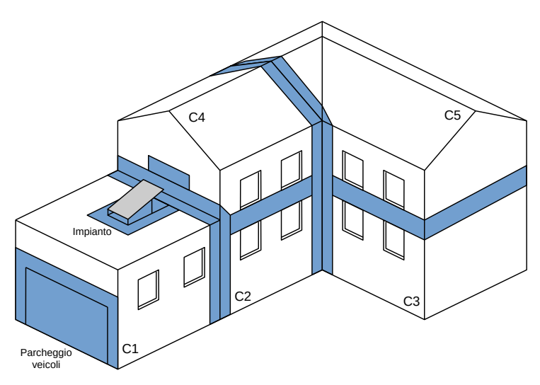

Illustrazione V.13-1: Esempio di fasce di separazione e protezioni per impianti e combustibili

#### V.13.4.2.3 Facciata a doppia pelle ventilata

1. Per le *facciate a doppia pelle ventilata* sono ammesse le soluzioni conformi di cui alla tabella V.13-2.

| Facciata | Caratteristiche intercapedine | Caratteristiche delle pelli |
|-----------------------------------------------------------|---------------------------------------------------------------------------------------------------------------------------------------------------------------------------------------------------|------------------------------------------------------------------------------------------------------------------------------------------------------------------------------------|
| Non<br>ispezionabile,<br>con pelle<br>esterna<br>chiusa | In corrispondenza di ogni piano [1], l'intercape-<br>dine è interrotta da setti di compartimentazione<br>E 30, o E 60 per chiusure d'ambito di tipo SC. | Per la <i>pelle interna</i> devono essere applicate le stesse prescrizioni previste per le <i>facciate</i> semplici. |
| | Qualsiasi | Per l'intera altezza e per tutti i piani [1], la <i>pelle interna</i> deve essere EW 30, o EW 60 per chiusure d'ambito di tipo SC. |
| Non<br>ispezionabile,<br>con pelle<br>esterna aperta | In corrispondenza di ogni piano [1], l'intercape-<br>dine è interrotta da setti di compartimentazione<br>E 30, o E 60 per chiusure d'ambito di tipo SC. | Per la <i>pelle interna</i> devono essere applicate le stesse prescrizioni previste per le <i>facciate</i> semplici. |
| esterna aperta | Qualsiasi | Per l'intera altezza e per tutti i piani [1], la <i>pelle interna</i> deve essere EW 30, o EW 60 per chiusure d'ambito di tipo SC. |
| Ispezionabile,<br>con pelle<br>esterna<br>chiusa | In corrispondenza di ogni piano [1], l'intercape-<br>dine è interrotta da setti di compartimentazione<br>E 30, o E 60 per chiusure d'ambito di tipo SC. | Per le <i>pelli interna</i> ed <i>esterna</i> devono essere applicate le stesse prescrizioni previste per le <i>facciate semplici</i> . |
| Ciliusa | Qualsiasi | Per l'intera altezza e per tutti i piani [1], la <i>pelle interna</i> deve essere EW 30 ( $i \rightarrow 0$ ), o EW 60 ( $i \rightarrow 0$ ) per chiusure d'ambito di tipo SC. [2] |
| Ispezionabile,<br>con pelle<br>esterna aperta | Qualsiasi | Per le <i>pelli interna ed esterna</i> devono essere applicate le stesse prescrizioni previste per le <i>facciate semplici</i> . |
| Ispezionabile,<br>con pelle<br>esterna aperta<br>o chiusa | L'intercapedine è provvista di sistema automatico di inibizione, controllo o estinzione dell'incendio esteso a tutta la facciata [3] (capitolo S.6) e dotata di smaltimento di fumi e calore [4]. | Nessuna |

<sup>[1]</sup> Sono ammesse aperture nella compartimentazione se provviste di serranda tagliafuoco o sistema equivalente a chiusura automatica in caso di incendio, con i medesimi requisiti di resistenza al fuoco della facciata.

[4] Ad esempio tramite superfici di ventilazione naturale, alla base ed in sommità della facciata, ciascuna di area pari al 10% della sezione orizzontale dell'intercapedine stessa.

<span id="page-339-0"></span>*Tabella V.13-2: Caratteristiche di resistenza al fuoco per facciate a doppia pelle ventilate* 

#### V.13.4.2.4 Presenza di combustibili

1. Qualora sulla chiusura d'ambito o in adiacenza ad essa possano essere presenti materiali combustibili in quantità significative, la porzione di chiusura d'ambito interessata deve essere protetta con le caratteristiche descritte nel paragrafo V.13.5 e circoscritta da *fasce di separazione*.

Nota Ad esempio, ove sia ammesso il parcheggio di veicoli o il posizionamento di contenitori di rifiuti.

<sup>[2]</sup> Se l'elemento di facciata non poggia direttamente sul solaio e nelle facciate *curtain walling*, l'elemento di giunzione tra la facciata e le compartimentazioni, orizzontali e verticali, deve avere classe di resistenza al fuoco El 30, o El 60 per chiusure d'ambito di tipo SC.

<sup>[3]</sup> Se ad acqua, dimensionato per densità di scarica $\geq 10 \ l/min \cdot m^2$ . Sono ammesse superfici vetrate in vetro temperato. La portata dell'impianto è aggiuntiva a quella di altri eventuali impianti di spegnimento previsti. Deve essere garantito il funzionamento contemporaneo in erogazione degli ugelli del piano immediatamente superiore a quello interessato dall'incendio, per una durata pari a 60 minuti. I dispositivi di erogazione devono essere orientati verso la pelle interna.

#### V.13.4.3 Sicurezza degli impianti tecnologici e di servizio

- <span id="page-340-0"></span>1. Qualora sulla chiusura d'ambito o in adiacenza ad essa siano installati *impianti di produzione* o *trasformazione d'energia* (es. impianti fotovoltaici, impianti di produzione calore, impianti di condizionamento, ...) la porzione di chiusura d'ambito interessata deve essere protetta con le caratteristiche descritte nel paragrafo V.13.5 e circoscritta da *fasce di separazione* delle medesime caratteristiche.
- 2. Le canne fumarie devono essere dotate di adeguato isolamento termico o distanza di separazione da elementi combustibili negli attraversamenti al fine di non costituire causa d'incendio.

Nota Ad esempio, come previsto dalla norma UNI 10683, ove applicabile, oppure utilizzando materiali di opportuna classe di resistenza al fuoco G (capitolo S.2).

#### V.13.5 Realizzazione di fasce di separazione

#### V.13.5.1 Caratteristiche

- <span id="page-341-2"></span><span id="page-341-1"></span>1. In *facciata*, le fasce di separazione ed eventuali altre protezioni devono avere le seguenti caratteristiche:
 - a. realizzate con materiali in classe di reazione al fuoco non inferiore a A2-s1,d0;
 - b. costituite da uno o più elementi costruttivi aventi classe di resistenza al fuoco E 30-ef ( $o \rightarrow i$ ) o, se portanti, RE 30-ef ( $o \rightarrow i$ ).
- 2. In *copertura*, le fasce di separazione ed eventuali altre protezioni devono avere classe di comportamento al fuoco esterno $B_{ROOF}(t2)$ , $B_{ROOF}(t3)$ , $B_{ROOF}(t4)$ oppure essere di classe di resistenza al fuoco EI 30.

Nota Nell'illustrazione V.13-1 si riporta un esempio di realizzazione di *fasce di separazione* e *protezioni*.

3. Le porzioni di *chiusura d'ambito* comprese nelle fasce di separazione ed in eventuali altre protezioni possono presentare aperture solo se provviste di serranda tagliafuoco o sistema equivalente a chiusura automatica in caso di incendio, con i medesimi requisiti di resistenza al fuoco della fascia di separazione, oppure devono essere testate in *configurazione totale* come da EN 1364-3.

#### V.13.5.2 Geometria

<span id="page-341-0"></span>1. In facciata, la *fascia di separazione orizzontale* tra compartimenti limita la propagazione verticale dell'incendio ed è realizzata garantendo uno *svilup*- $po \ge 1,00$ m in totale (illustrazione V.13-2, vista in sezione verticale).

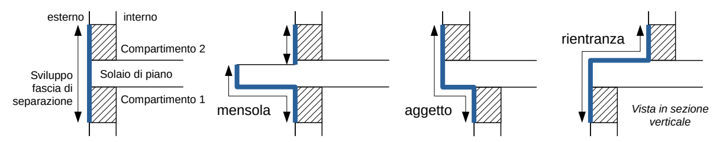

Illustrazione V.13-2: Esempi di fascia di separazione orizzontale in facciata

<span id="page-341-4"></span><span id="page-341-3"></span>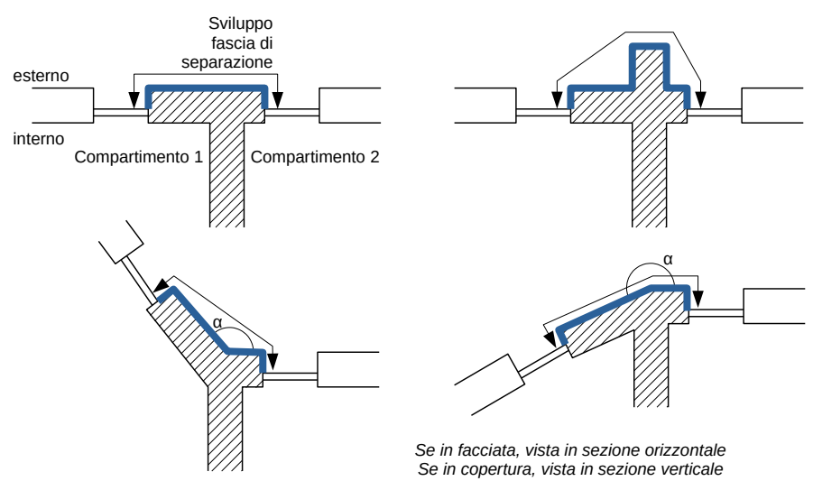

Illustrazione V.13-3: Esempi di fascia di separazione verticale in facciata o in copertura

- 2. In facciata, la *fascia di separazione verticale* tra compartimenti limita la propagazione orizzontale dell'incendio ed è realizzata garantendo uno *svilup*- $po \ge 1,00$ m (illustrazione V.13-3, vista in sezione orizzontale).
 - Se la separazione forma un diedro di ampiezza $\alpha$ < 90°, lo *sviluppo* deve avere larghezza $\geq$ 1,00 + (d<sub>S.3</sub> 1) · cos $\alpha$ , espressa in metri, con d<sub>S.3</sub> *distanza di separazione* tra i compartimenti in metri calcolata secondo paragrafo S.3.11.
- 3. In copertura, la *fascia di separazione* tra compartimenti limita la propagazione orizzontale dell'incendio ed è realizzata garantendo uno *sviluppo* $\geq$ 1,00 m (illustrazione V.13-3, vista in sezione verticale).

## V.13.6 Verifica dei requisiti di resistenza al fuoco

- <span id="page-342-0"></span>1. La *fascia di separazione*, per la quale è previsto il requisito di resistenza al fuoco, può essere verificata sperimentalmente secondo le seguenti norme:
 - a. EN 1364-1, per facciate semplici poggianti sui solai;
 - b. EN 1364-4, nel caso in cui la facciata di tipo *curtain walling* abbia una fascia di separazione che non includa anche le vetrate; in tal caso, il requisito di resistenza al fuoco può essere garantito per lo sviluppo della facciata facente parte della fascia di separazione;
 - c. EN 1364-3, nel caso in cui la facciata di tipo *curtain walling* abbia una fascia di separazione che includa anche le vetrate; in tal caso, il requisito di resistenza al fuoco deve essere garantito per tutto lo sviluppo della facciata;
 - d. EN 1366-4 per sigillature dei giunti lineari.
- Nota La norma di classificazione EN 13501-2 fornisce la procedura di classificazione delle facciate semplici e *curtain walling* secondo i criteri E, I con i suffissi "i" (*inside*) e "o" (*outside*) legati da una freccia per indicare il verso di esposizione al fuoco, nonché il suffisso "ef" nel caso in cui la classificazione sia resa nei confronti dell'esposizione al fuoco esterno, così come definito al capitolo S.2. La norma di classificazione EN 13501-2 fornisce altresì le indicazioni circa le norme per le applicazioni estese dei risultati di prova (EXAP) che dovessero rendersi disponibili.
 - 2. Per facciate semplici poggiate sui solai realizzati con elementi pesanti in calcestruzzo, pietra o muratura, oppure costituiti da materiali poco deformabili alle alte temperature, la verifica ai fini della classificazione di resistenza al fuoco può essere eseguita facendo ricorso ai metodi di cui al capitolo S.2.
- Nota Al tale proposito si rammenta che il requisito EI 30 di una parete garantisce automaticamente anche il requisito E 30-ef oppure E 30-i.
- Nota Per gli elementi di facciata realizzati con elementi di tipo leggero sono al momento indisponibili soluzioni basate su calcoli o riferimento a tabelle.
 - 3. Per gli elementi strutturali la verifica ai fini della classificazione R 30-ef può essere eseguita facendo ricorso ai metodi di cui al capitolo S.2.
 - 4. Le sigillature tra la facciata continua (*curtain walling*) e la costruzione possono essere verificate secondo la norma EN 1364-4.

## **REGOLE TECNICHE VERTICALI Capitolo V.14 Edifici di civile abitazione**

<span id="page-344-0"></span>[Campo di applicazione](#page-345-2)

[Classificazioni](#page-345-1)

[Valutazione del rischio di incendio](#page-345-0)

#### [Strategia antincendio](#page-346-2)

[Reazione al fuoco](#page-346-1) [Resistenza al fuoco](#page-346-0) [Compartimentazione](#page-347-2) [Esodo](#page-347-1) [Gestione della sicurezza antincendio](#page-347-0) [Controllo dell'incendio](#page-350-0) [Rivelazione ed allarme](#page-351-1) [Operatività antincendio](#page-351-0)

[Sicurezza degli impianti tecnologici e di servizio](#page-351-2)

#### V.14.1 Campo di applicazione

<span id="page-345-2"></span>1. La presente regola tecnica verticale reca disposizioni di prevenzione incendi riguardanti gli edifici destinati prevalentemente a civile abitazione di altezza antincendio > 24 m.

Nota Ad esempio, edifici destinati prevalentemente ad abitazione includenti anche attività artigiane o commerciali, magazzini, attività professionali, uffici, ...

#### V.14.2 Classificazioni

<span id="page-345-1"></span>1. Ai fini della presente regola tecnica, gli edifici di civile abitazione sono classificati come segue, in relazione alla massima quota dei piani h:

**HC**: $h \le 32$ m; **HD**: $h \le 54$ m; **HE**: $h \le 80$ m; **HF**: h > 80 m;

2. Le aree dell'attività sono classificate come segue:

**TA**: unità adibite a civile abitazione o ad uso esclusivo (es. appartamenti, ...);

**TB**: unità destinate a piccole attività di tipo civile (es. attività artigiane o commerciali, magazzini, attività professionali, uffici, ...);

**TC**: spazi comuni (es. scale e corridoi condominiali, atri, androni, terrazzi condominiali, rampe e passaggi in genere, sale riunioni con basso affollamento, ...);

**TM1**: depositi o archivi di superficie lorda $\leq 25 \text{ m}^2$ con carico di incendio specifico $q_f \leq 1200 \text{ MJ/m}^2$ , oppure di superficie lorda $\leq 100 \text{ m}^2$ con carico di incendio specifico $q_f \leq 600 \text{ MJ/m}^2$ ;

**TM2**: depositi o archivi di superficie lorda $\leq 400 \text{ m}^2$ con carico di incendio specifico $q_f \leq 1200 \text{ MJ/m}^2$ , oppure di superficie lorda $\leq 1000 \text{ m}^2$ con carico di incendio specifico $q_f \leq 600 \text{ MJ/m}^2$ ;

**TO**: locali con affollamento > 100 occupanti (es. locali ad uso collettivo, sale conferenze, sale riunioni, ...);

TT: locali tecnici rilevanti ai fini della sicurezza antincendio;

TZ: altre aree.

#### V.14.3 Valutazione del rischio di incendio

- <span id="page-345-0"></span>1. La progettazione della sicurezza antincendio deve essere effettuata attuando la metodologia di cui al capitolo G.2.
- 2. I *profili di rischio* sono determinati secondo la metodologia di cui al capitolo G.3.

#### V.14.4 Strategia antincendio

- <span id="page-346-2"></span>1. Devono essere applicate *tutte* le misure antincendio della *regola tecnica oriz- zontale* attribuendo i livelli di prestazione secondo i criteri in esse definiti, fermo restando quanto indicato al successivo comma 4.
- 2. Devono essere applicate le prescrizioni del capitolo V.1 in merito alle aree a rischio specifico e le prescrizioni delle altre *regole tecniche verticali*, ove pertinenti.
- 3. Devono essere applicate le prescrizioni del capitolo V.13 in merito alle chiusure d'ambito degli edifici civili.
- 4. Nei paragrafi che seguono sono riportate indicazioni complementari o sostitutive delle *soluzioni conformi* previste dai corrispondenti livelli di prestazione della RTO.

#### V.14.4.1 Reazione al fuoco

- <span id="page-346-1"></span>1. Nelle aree TA non sono richiesti requisiti minimi di reazione al fuoco.
- 2. Nelle vie d'esodo verticali, percorsi d'esodo (corridoi, atri, filtri, ...) e spazi calmi devono essere impiegati materiali appartenenti almeno al gruppo GM2 di reazione al fuoco (capitolo S.1).
- 3. Nelle vie d'esodo verticali, percorsi d'esodo (corridoi, atri, filtri, ...) e spazi calmi degli edifici di tipo HE ed HF devono essere impiegati materiali appartenenti almeno al gruppo GM1 di reazione al fuoco (capitolo S.1).
- 4. Ad esclusione degli edifici di tipo HE ed HF, è ammesso l'impiego di materiali appartenenti al gruppo GM3 di reazione al fuoco (capitolo S.1) nei percorsi d'esodo degli edifici ove il livello di prestazione per la rivelazione ed allarme (capitolo S.7) sia incrementato di almeno un livello rispetto a quanto prescritto.

#### V.14.4.2 Resistenza al fuoco

<span id="page-346-0"></span>1. La classe di resistenza al fuoco dei compartimenti (capitolo S.2) non può essere comunque inferiore a quanto previsto in tabella V.14-1.

| Compartimenti | Attività | | | |
|---------------|----------|----|----|----|
| | НС | HD | HE | HF |
| Fuori terra | 60 | | | 90 |
| Interrati | 60 | | | 90 |

<span id="page-346-3"></span>Tabella V.14-1: Classe di resistenza la fuoco

#### V.14.4.3 Compartimentazione

- <span id="page-347-2"></span>1. Sono ammessi compartimenti multipiano per piani con quota > -5 m e $\le 12$ m.
- 2. Sono ammessi compartimenti multipiano per piani con quota > 12 m e $\le 32$ m con massimo dislivello fra i piani $\le 7$ m.
- 3. Le aree dell'attività devono avere le caratteristiche di compartimentazione (capitolo S.3) previste in tabella V.14-2.

Nota Come previsto ai capitoli S.3 e V.3, deve essere posta particolare attenzione al mantenimento della continuità della compartimentazione, ad esempio in corrispondenza dei varchi di vani ascensori, cavedi impianti, scale di servizio, ...

| Aroo | Attività | | | |
|-----------------|--------------------------------------------------|----|----|----|
| Aree | НС | HD | HE | HF |
| TA, TB, TC, TM1 | Nessun requisito aggiuntivo | | | |
| TM2, TO, TT | Di tipo protetto | | | |
| TZ | Secondo risultanze della valutazione del rischio | | | |

<span id="page-347-3"></span>Tabella V.14-2: Compartimentazione

#### V.14.4.4 Esodo

- <span id="page-347-1"></span>1. Oltre a quanto previsto nel capitolo S.4, l'affollamento massimo di ciascun locale può essere determinato anche in relazione ad altre disposizioni legislative e regolamentari in merito a requisiti igienico-sanitari dei locali di abitazione.
- 2. Per piani a quota > 32 m o < -5 m devono essere previste due vie di esodo indipendenti.
- 3. Oltre a quanto previsto al capitolo S.4, è ammesso *omettere* dalla verifica delle condizioni di corridoio cieco la porzione di corridoio cieco *continua* e *finale*, avente caratteristiche di *filtro* e massima lunghezza omessa L<sub>om</sub> pari a 135 m.

Nota Ad esempio, se un edificio è servito da una sola scala d'esodo, questa deve rispettare le condizioni previste per il *corridoio cieco* (capitolo S.4). Qualora non siano rispettate tali condizioni, si rammenta la possibilità di ricorrere a *soluzioni alternative*, ad esempio prevedendo scale d'esodo a prova di fumo, nonché rilevazione ed allarme.

#### V.14.4.5 Gestione della sicurezza antincendio

<span id="page-347-0"></span>1. Devono essere adottate almeno le misure indicate nel presente paragrafo, in sostituzione delle *soluzioni conformi* previste al capitolo S.5 per tutti i livelli di prestazione.

#### V.14.4.5.1 Compiti e funzioni

- 1. Il responsabile dell'attività organizza la GSA tramite:
 - a. adozione e verifica periodica delle misure antincendio preventive di cui al paragrafo V.14.4.5.2;
 - b. per le aree TC, verifica dell'osservanza dei divieti, delle limitazioni e delle condizioni normali di esercizio;
 - c. mantenimento in efficienza dei sistemi, dispositivi, attrezzature e delle altre misure antincendio adottate, effettuando verifiche di controllo ed interventi di manutenzione, riportando gli esiti in un *registro dei controlli*;
 - d. predisposizione, verifica ed aggiornamento periodico della pianificazione d'emergenza;

- e. apposizione di segnaletica di sicurezza (es. divieti, avvertimenti, evacuazione, ...);
- f. informazione agli occupanti sulle misure antincendio preventive da osservare e sulle procedure di emergenza da adottare in caso d'incendio, anche tramite invio telematico o pubblicazione, nelle aree comuni dell'edificio, di sintetiche schede informative, comprensibili a tutti gli occupanti, riportanti:
 - i. divieti e precauzioni da osservare;
 - ii. numeri telefonici per l'attivazione dei servizi di emergenza;
 - iii. istruzioni per garantire l'allarme e l'esodo in caso d'incendio.
- 2. Negli edifici di tipo HE ed HF, oltre a quanto previsto nel precedente comma, il *responsabile dell'attività* designa uno o più *coordinatori dell'emergenza* e comunica loro le necessarie informazioni e procedure contenute nella pianificazione d'emergenza.

I *coordinatori dell'emergenza* devono essere formati come *addetti antincendio*, secondo le norme vigenti in relazione al livello di rischio dell'attività, e sovrintendere all'attuazione della pianificazione d'emergenza e delle relative misure di evacuazione, interfacciandosi con i responsabili delle squadre di soccorso.

Almeno uno dei *coordinatori dell'emergenza* deve essere sempre presente presso l'attività, oppure deve essere sempre garantito un servizio di pronta disponibilità entro 30 minuti dalla chiamata.

Nota Il ruolo di coordinatore dell'emergenza può essere svolto da un servizio di vigilanza esterno oppure anche dagli stessi occupanti dell'attività, se opportunamente formati come addetti antincendio.

- 3. Negli edifici di tipo HF, oltre a quanto previsto nei precedenti commi, il *responsabile dell'attività* predispone ed organizza apposito *centro di gestione delle emergenze* di cui al paragrafo V.14.4.5.5.
- 4. In condizioni ordinarie, gli *occupanti* osservano le disposizioni della GSA, in particolare:
 - a. osservano le misure antincendio, i divieti, le limitazioni e le condizioni di esercizio preventive predisposte dal responsabile dell'attività;
 - b. non alterano la fruibilità delle vie d'esodo e l'efficacia delle misure di protezione attiva e passiva.

In condizioni d'emergenza, gli *occupanti* attuano quanto previsto nella pianificazione d'emergenza, in particolare le procedure di allarme e di evacuazione.

#### V.14.4.5.2 Misure preventive

- <span id="page-348-0"></span>1. Le misure preventive che devono essere attuate consistono almeno in:
 - a. corretto deposito ed impiego dei materiali combustibili, di sostanze e miscele pericolose;
 - b. garanzia costante di disponibilità delle vie d'esodo, sgombre e sicuramente fruibili:
 - c. corretta manutenzione ed esercizio delle chiusure tagliafuoco dei varchi tra compartimenti;
 - d. riduzione delle sorgenti di innesco (es. limitazioni nell'uso di fiamme libere senza le opportune precauzioni, rispetto del divieto di fumo ove previsto, divieto di impiego di apparecchiature elettriche malfunzionanti o impropriamente impiegate, ...);

- e. gestione dei lavori di manutenzione, valutazione dei relativi rischi aggiuntivi e di interferenza, con particolare riguardo a lavorazioni pericolose ai fini dell'incendio (es. lavori a caldo, …), temporanea disattivazione di impianti di sicurezza, temporanea sospensione della continuità della compartimentazione, impiego delle sostanze o miscele pericolose (es. solventi, colle, …);
- f. valutazione dei rischi di incendio in caso di modifiche all'attività (es. alle strutture, alle finiture, al rivestimento delle facciate, all'isolamento termico e acustico e agli impianti, …).

#### V.14.4.5.3 Pianificazione d'emergenza

- 1. La pianificazione d'emergenza deve riguardare almeno:
 - a. le istruzioni per la chiamata di soccorso, comprensive delle informazioni da fornire per consentire un efficace soccorso;
 - b. le istruzioni per diffondere l'allarme a tutti gli occupanti; ove presente l'IRAI, la pianificazione d'emergenza deve contenere le procedure di attivazione e diffusione dell'allarme;
 - c. le istruzioni per l'esodo degli occupanti, anche in relazione alla presenza di occupanti con specifiche esigenze;
 - d. le azioni da eseguire per la messa in sicurezza di apparecchiature ed impianti (es. sezionamento della distribuzione del gas naturale, …);
 - e. le informazioni da fornire alle squadre di soccorso intervenute sul posto (es. planimetrie, ubicazione dei quadri di controllo degli impianti, presenza di occupanti con specifiche esigenze, …);
 - f. il divieto di utilizzo degli ascensori per l'evacuazione in caso di incendio, ad eccezione degli eventuali ascensori antincendio da utilizzare secondo le modalità previste;
 - g. il divieto di rientrare nell'edificio fino al termine dell'emergenza.
- 2. Per gli edifici di tipo HF, la pianificazione d'emergenza deve prevedere le procedure di attivazione e funzionamento del centro di gestione dell'emergenza.

## V.14.4.5.4 Preparazione all'emergenza in attività caratterizzate da promiscuità strutturale, impiantistica, dei sistemi di vie d'esodo

- 1. Qualora attività caratterizzate da promiscuità strutturale, impiantistica, o dei sistemi di vie d'esodo siano esercite da responsabili dell'attività diversi, le pianificazioni d'emergenza delle singole attività devono tenere conto di eventuali interferenze o relazioni con le attività limitrofe.
- 2. Deve essere prevista una pianificazione d'emergenza di sito in cui siano descritte le procedure di risposta all'emergenza per le parti comuni e per le eventuali interferenze tra le attività ai fini della sicurezza antincendio.

### V.14.4.5.5 Centro di gestione dell'emergenza

- <span id="page-349-0"></span>1. Ove previsto dalla soluzione progettuale individuata, deve essere predisposto il *centro di gestione delle emergenze* per il coordinamento delle operazioni d'emergenza, commisurato alla complessità dell'attività.
- 2. Il centro di gestione delle emergenze può essere realizzato in locale ad uso non esclusivo (es. portineria, reception, centralino, …), preferibilmente di tipo protetto.
- 3. Il centro di gestione delle emergenze deve essere fornito almeno di:

- a. informazioni necessarie alla gestione dell'emergenza (es. pianificazioni, planimetrie, schemi funzionali di impianti, numeri telefonici, …);
- b. strumenti di comunicazione con le squadre di soccorso, con il personale e con gli occupanti;
- c. centrali di controllo degli impianti di protezione attiva o ripetizione dei segnali d'allarme.
- 4. Il centro di gestione delle emergenze deve essere chiaramente individuato da apposita segnaletica di sicurezza.

#### **V.14.4.6 Controllo dell'incendio**

<span id="page-350-0"></span>1. In relazione al tipo di aree presenti, l'attività, ad esclusione delle aree TA, deve essere dotata di misure di controllo dell'incendio (capitolo S.6) secondo i livelli di prestazione di cui alla tabella [V.14-3](#page-350-2).

Nota Per consentire la pronta estinzione di piccoli focolai domestici può essere consigliato agli occupanti di installare *coperte antincendio*, ad esempio del tipo UNI EN 1869.

2. Per la progettazione della rete idranti, se riferite alla norma UNI 10779 e UNI EN 12845, devono essere adottati i parametri riportati in tabella [V.14-4](#page-350-1).

| Aree | Tipo attività | | | |
|-----------|--------------------------------------------------|-----|----|----|
| | HC | HD | HE | HF |
| Qualsiasi | II | III | | |
| TM2 | III | | | |
| TZ | Secondo risultanze della valutazione del rischio | | | |

<span id="page-350-2"></span>*Tabella V.14-3: Livello di prestazione per controllo dell'incendio*

| Tipo attività | Livello di pericolosità | Protezione esterna | Caratteristiche<br>alimentazione idrica | | |
|---------------------------------------------------------------|-------------------------|--------------------|-----------------------------------------|--|--|
| HC, HD | 1 | Non richiesta | Singola [1] | | |
| HE, HF | 2 | Sì | Singola superiore | | |
| [1] È consentita l'alimentazione promiscua secondo UNI 10779. | | | | | |

<span id="page-350-1"></span>*Tabella V.14-4: Parametri progettuali per rete idranti secondo UNI 10779 e UNI EN 12845*

#### **V.14.4.7 Rivelazione ed allarme**

- <span id="page-351-1"></span>1. Le aree dell'attività devono essere dotate di misure di rivelazione ed allarme (capitolo S.7) secondo i livelli di prestazione di cui alla tabella [V.14-5.](#page-351-3)
- 2. Per gli edifici di tipo HF deve essere previsto anche il sistema EVAC (capitolo S.7).
- 3. Nelle aree TA degli edifici di tipo HE ed HF, ove non presente IRAI, devono essere previsti *rivelatori autonomi di fumo con avvisatore acustico*.

Nota In tutti gli altri edifici, per consentire la pronta rivelazione di piccoli focolai domestici, può essere consigliato agli occupanti di installare *rivelatori autonomi di fumo con avvisatore acustico*, ad esempio secondo la norma UNI EN 14604, installati ed eserciti secondo norma UNI 11497.

Nota I *rivelatori autonomi di fumo con avvisatore acustico* non sono considerati IRAI.

| Aree | Tipo attività | | | | |
|---------------------------------------------------------|--------------------------------------------------|-----|----|-----|--|
| | HC | HD | HE | HF | |
| TB | [1] | III | | | |
| TC, TO, TM1 | I | II | | III | |
| TM2 | III | | | | |
| TT, TZ | Secondo risultanze della valutazione del rischio | | | | |
| [1] Rivelatori autonomi di fumo con avvisatore acustico | | | | | |

<span id="page-351-3"></span>*Tabella V.14-5: Livello di prestazione per rivelazione ed allarme*

## **V.14.4.8 Operatività antincendio**

<span id="page-351-0"></span>1. Per edifici di tipo HE, HF, deve essere previsto il livello di prestazione IV per l'operatività antincendio (capitolo S.9).

## **V.14.4.9 Sicurezza degli impianti tecnologici e di servizio**

<span id="page-351-2"></span>1. Le canne fumarie devono essere dotate di adeguato isolamento termico o distanza di separazione da elementi combustibili negli attraversamenti al fine di non costituire causa d'incendio.

Nota Ad esempio, come previsto dalla norma UNI 10683, ove applicabile, oppure utilizzando materiali di opportuna classe di resistenza al fuoco G (capitolo S.2).

## <span id="page-352-0"></span>**REGOLE TECNICHE VERTICALI Capitolo V.15 Attività di intrattenimento e di spettacolo a carattere pubblico**

[Campo di applicazione](#page-353-1)

[Definizioni](#page-353-0)

[Classificazioni](#page-354-0)

[Valutazione del rischio di incendio](#page-355-1)

#### [Strategia antincendio](#page-355-0)

[Reazione al fuoco](#page-356-1) [Resistenza al fuoco](#page-356-0) [Compartimentazione](#page-357-0) [Esodo](#page-358-1) [Gestione della sicurezza antincendio](#page-358-0) [Controllo dell'incendio](#page-359-0) [Rivelazione ed allarme](#page-360-1) [Controllo di fumi e calore](#page-360-0) [Sicurezza impianti tecnologici](#page-361-0) [Altre indicazioni](#page-361-1)

#### **V.15.1 Campo di applicazione**

- <span id="page-353-1"></span>1. La presente regola tecnica verticale reca disposizioni di prevenzione incendi riguardanti le attività di intrattenimento e di spettacolo in genere, a carattere pubblico, svolte al chiuso o all'aperto, anche a carattere temporaneo.
- 2. Sono esclusi dal campo di applicazione della regola tecnica:
 - a. i luoghi non delimitati;
 - b. gli esercizi pubblici dove sono impiegati strumenti musicali o apparecchi musicali, in assenza di attività danzanti o di spazi ed allestimenti specifici per gli avventori;

Nota Ad esempio bar o ristoranti con esibizioni musicali, con musica diffusa, con apparecchi karaoke, …, privi di spazi ed allestimenti dedicati agli avventori per assistere alle rappresentazioni o per danzare.

c. attrazioni di spettacolo viaggiante di cui alla legge 18 marzo 1968 n. 337, per cui si applica la normativa vigente.

#### **V.15.2 Definizioni**

<span id="page-353-0"></span>1. Attività di intrattenimento e di spettacolo: attività destinate a intrattenimenti e attrazioni a carattere pubblico soggette alla disciplina del regio decreto 18 giugno 1931 n. 773.

Nota Ad esempio, attività quali la danza (es. sale da ballo, discoteche, …), i concerti, gli spettacoli vari in esercizi pubblici con aree o spazi specifici per gli spettatori, i locali in cui sono allestite le attrazioni di spettacolo viaggiante, le sale giochi, le agenzie di scommesse, le sale bingo, le rappresentazioni teatrali (es. spettacoli lirici, drammatici, coreografici, di rivista e varietà, …), le conferenze, i congressi, le proiezioni cinematografiche (es. teatri, cinema-teatri, auditorium, sale convegno, cinematografi, teatri di posa per riprese cinematografiche o televisive con presenza di pubblico, …).

2. Complessi multifunzionali: attività comprendenti ambiti di intrattenimento e di spettacolo ed ulteriori ambiti con attività diverse, caratterizzati da organicità funzionale, anche afferenti a diversi soggetti responsabili.

Nota Ad esempio: attività quali cinema, auditorium, sale convegni, …, inseriti in centri commerciali o poli fieristici.

- 3. Sala: ambito dell'attività destinato agli spettatori o agli avventori per assistere o partecipare a intrattenimenti o spettacoli vari.
- 4. Scena: ambito dell'attività destinato alla rappresentazione di spettacoli; la scena comprende il palcoscenico, gli scenari, le ulteriori attrezzature e gli allestimenti necessari all'effettuazione di rappresentazioni teatrali e di spettacoli in genere. In relazione all'ubicazione, la scena può essere:
 - a. di tipo separato dalla sala, quando è separata dalla sala e dai locali di servizio e retropalco con elementi resistenti al fuoco, ad eccezione del boccascena, per il quale è ammessa la comunicazione diretta con la sala;
 - b. di tipo integrato nella sala, quando costituisce un unico ambito con la sala.

Nota L'ambito costituito da sala e scena integrata è unico ai fini della determinazione delle misure antincendio.

5. Deposito di servizio alla scena: locale destinato agli scenari e le attrezzature per lo spettacolo in programmazione.

#### V.15.3 Classificazioni

- <span id="page-354-0"></span>1. Ai fini della presente regola tecnica, le attività sono classificate come segue:
 - a. in relazione al numero di occupanti n:

**OA**: $n \le 200$ ;

**OB**: $200 < n \le 1000$ :

**OC**: $1000 < n \le 5000$ ;

**OD**: n > 5000.

Nota Il *numero degli occupanti* (es. spettatori, avventori, addetti, artisti, tecnici, ...) è in genere superiore alla *capienza*, parametro utilizzato ai fini amministrativi o autorizzativi per definire il numero di *spettatori*.

Nota Si veda anche il comma 4 per la classificazione in relazione al numero degli occupanti.

b. in relazione alla quota dei piani h accessibili al pubblico:

**HA**: -1 m $\leq$ h $\leq$ 6 m;

**HB**: -5 m $\leq$ h $\leq$ 12 m;

**HC**: $-10 \text{ m} \le \text{h} \le 24 \text{ m}$ ;

**HD**: tutti gli altri casi non rientranti nella classificazione precedente.

Nota Si evidenzia che la tabella V.15-2 può essere utilizzata per le limitazioni delle quote dei piani accessibili al pubblico.

Nota Per ambiti con più piani (es. tribune, gradinate, ...), si considera la quota più sfavorevole dei piani accessibili al pubblico.

2. Le aree dell'attività sono classificate come segue:

**TA1**: ambiti non aperti al pubblico adibiti a sale prove o camerini, di superficie $> 100 \text{ m}^2$ ;

**TA2:** ambiti non aperti al pubblico adibiti a camerini o servizi, comunicanti direttamente con la scena, di superficie complessiva > 50 m²;

Nota Ai fini della classificazione TA2 devono essere sommate le superfici dei camerini e dei locali servizi direttamente comunicanti con la scena, anche se posti distanziati e di singola superficie $\leq 50~\text{m}^2$ .

**TA3**: ambiti non aperti al pubblico adibiti ad uffici o servizi, di superficie $> 200 \text{ m}^2$ ;

**TO1**: ambiti al chiuso ed accessibili al pubblico;

**TO2**: ambiti, comprensivi delle relative vie d'esodo, all'aperto ed accessibili al pubblico;

Nota Le attività all'aperto sono definite al capitolo G.1.

**TK1**: ambiti dove si effettuano lavorazioni pericolose ai fini dell'incendio o dell'esplosione, di superficie > 100 m²;

Nota Ad esempio: laboratori ed attrezzerie per le scenografie, ...

TK2: scena di tipo separato;

**TM1**: depositi con carico di incendio specifico $q_f > 600$ MJ/m², aventi superficie > 200 m²;

**TM2**: depositi con carico di incendio specifico $q_f > 1200 \text{ MJ/m}^2$ ;

**TM3**: depositi di servizio alla scena di superficie > 50 m<sup>2</sup>;

**TT1**: locali in cui siano presenti quantità significative di apparecchiature elettriche ed elettroniche, locali tecnici rilevanti ai fini della sicurezza antincendio;

Nota Ad esempio: CED, sala server, cabine elettriche, …

**TT2**: aree destinate alla ricarica di accumulatori elettrici di trazione;

Nota Ad esempio: muletti, transpallet, macchine per la pulizia con uomo a bordo, …

**TZ**: altre aree non ricomprese nelle precedenti.

Nota Ad esempio: cabine per la proiezione di film su supporto combustibile, …

- 3. Sono considerate aree a rischio specifico (capitolo V.1) almeno le seguenti aree: TK1, TM2 e TM3.
- 4. È ammessa la classificazione in relazione al numero degli occupanti della singola sala dell'attività, quando le sale ed i relativi ambiti (es. foyer, connettivi, …) siano funzionalmente indipendenti, compartimentati ed abbiano sistemi d'esodo indipendenti.

#### **V.15.4 Valutazione del rischio di incendio**

<span id="page-355-1"></span>1. La progettazione della sicurezza antincendio deve essere effettuata applicando la metodologia di cui al capitolo G.2.

Nota Nei luoghi occasionalmente dedicati ad attività di pubblico spettacolo (es. piazze, …), il progettista considera il rischio determinato da eventuali ulteriori aspetti di contesto, quali ad esempio: arredo urbano, interferenze con attività limitrofe, punti di somministrazione di cibo e bevande, delimitazioni e barriere alla libera circolazione determinate da altre esigenze (es. antintrusione, protezione di impianti tecnologici, …), …

- 2. I profili di rischio sono determinati secondo la metodologia di cui al capitolo G.3.
- 3. L'impiego di articoli pirotecnici, fiamme libere, sostanze o miscele pericolose, armi scenografiche deve essere oggetto di specifica valutazione del rischio ed autorizzato secondo le procedure di legge.
- 4. Gli allestimenti e gli impianti temporanei, privi di normativa di riferimento, devono essere oggetto di specifica valutazione del rischio.

## **V.15.5 Strategia antincendio**

- <span id="page-355-0"></span>1. Devono essere applicate tutte le misure antincendio della regola tecnica orizzontale, attribuendo i livelli di prestazione secondo i criteri in esse definiti, fermo restando quanto indicato al successivo comma 3.
- 2. Devono essere applicate le prescrizioni del capitolo V.1 in merito alle aree a rischio specifico e le prescrizioni delle altre regole tecniche verticali, ove pertinenti.
- 3. Nei paragrafi che seguono sono riportate le indicazioni complementari o sostitutive delle soluzioni conformi previste dai corrispondenti livelli di prestazione della RTO.

#### V.15.5.1 Reazione al fuoco

- <span id="page-356-1"></span>1. Nelle vie d'esodo verticali, nei passaggi di comunicazione delle vie d'esodo orizzontali (es. corridoi, atri, spazi calmi, filtri, ...) devono essere impiegati materiali appartenenti almeno al gruppo GM2 di reazione al fuoco (capitolo S.1).
- 2. Nelle sale delle aree TO1:
 - a. devono essere impiegati materiali appartenenti almeno al gruppo GM2 di reazione al fuoco;
 - b. per le pavimentazioni, possono essere impiegati materiali appartenenti gruppo GM3 di reazione al fuoco;
 - c. per le pavimentazioni in legno, è ammesso omettere i requisiti di reazione al fuoco, in assenza di condotte di ventilazione o riscaldamento, condutture elettriche sottostanti.
- 3. Anche nel caso di scena integrata, è ammesso omettere i requisiti di reazione al fuoco delle pavimentazioni in legno del palcoscenico.

Nota Per il capitolo S.1 è altresì ammesso omettere i requisiti di reazione al fuoco per materiale scenico non incluso in quinte, velari, tendaggi e simili.

4. Nelle aree TO2 e per le *strutture vulnerabili in condizioni d'incendio* possono essere impiegati materiali del gruppo GM3.

Nota Come specificato nel capitolo S.2, le *strutture vulnerabili in condizioni d'incendio* sono ad esempio: tensostrutture, tunnel mobili, strutture a tenda, ...

#### V.15.5.2 Resistenza al fuoco

- <span id="page-356-0"></span>1. La classe di resistenza al fuoco dei compartimenti (capitolo S.2) non può essere inferiore a quanto previsto in tabella V.15-1.
- 2. Le indicazioni del precedente comma 1 non si applicano alle *strutture vulnerabili in condizioni d'incendio* con carico di incendio specifico di progetto $q_{f,d} \leq 200 \text{ MJ/m}^2$ .

Nota Come previsto al capitolo S.2, anche per le *strutture vulnerabili in condizioni d'incendio* non separate dalle opere da costruzione, il valore del carico d'incendio specifico q<sup>f</sup> può essere riferito all'effettiva distribuzione dello stesso.

| Compartimenti | Attività | | | | |
|---------------|----------|----|----|----|--|
| | НА | НВ | НС | HD | |
| Fuori terra | 30 [1] | 60 | | 90 | |
| Interrati | - | 90 | | | |

[1] Per le attività che occupano un unico piano a quota compresa fra -1 m e +1 m, in opere da costruzione destinate esclusivamente a tali attività e compartimentate rispetto ad altre opere da costruzione, senza comunicazioni, si applica la classe minima di resistenza al fuoco indicata nel capitolo S.2.

<span id="page-356-2"></span>Tabella V.15-1: Classe di resistenza al fuoco

## **V.15.5.3 Compartimentazione**

- <span id="page-357-0"></span>1. Le aree TO1, TA1 devono rispettare le quote di piano, le limitazioni e le misure antincendio della tabella [V.15-2.](#page-357-1)
- 2. Le aree dell'attività devono avere le caratteristiche di compartimentazione (capitolo S.3) previste in tabella [V.15-3.](#page-358-2)
- 3. Per ciascuna sala:
 - a. non si applicano i limiti della massima superficie lorda dei compartimenti del capitolo S.3;
 - b. è ammessa la compartimentazione multipiano del capitolo S.3 indipendentemente dalle quote dei piani accessibili al pubblico.

Nota Ad esempio: per i piani dei soppalchi, delle gallerie, delle gradinate, dei loggioni, …

- 4. Ove sia dimostrata necessità funzionale, sono ammesse le seguenti comunicazioni:
 - a. di tipo a prova di fumo, tra l'attività ed altre attività con sistemi d'esodo indipendenti;
 - b. di tipo a prova di fumo, tra l'attività classificata OA+HA o OA+HB ed altre attività civili con sistemi d'esodo comuni;
 - c. di tipo protetto con chiusure almeno E 30-Sa, tra l'attività ed altre attività civili con sistemi d'esodo indipendenti;
 - d. di tipo protetto, tra l'attività ed altre attività dei complessi multifunzionali con sistemi d'esodo comuni;
 - e. senza requisiti di compartimentazione:
 - i. tra l'attività classificata OA+HA ed altre attività dei complessi multifunzionali con sistemi d'esodo comuni;
 - ii. tra l'attività dotata di controllo dell'incendio (capitolo S.6) di livello di prestazione V e di controllo fumo e calore (capitolo S.8) di livello di prestazione III ed altre attività dei complessi multifunzionali con sistemi d'esodo comuni.

| Quote dei piani | Attività | Misure antincendio aggiuntive |
|----------------------------|------------------|--------------------------------------------------------------------------------------------------------------------------------------------------------------------------------------------------------------------------------------------------------------------------------------------------------------------------------|
| -5<br>m ≤ h < -1<br>m [1] | OA | Almeno una via d'esodo verticale di tipo protetto. |
| | Tutte eccetto OA | Controllo di fumi e calore (capitolo<br>S.8) di livello di prestazione<br>III<br>[2]<br>ed almeno due vie d'esodo verticali di tipo protetto. |
| -10<br>m ≤ h < -5<br>m [3] | Tutte | ●<br>Gestione dell'emergenza (capitolo<br>S.5) di livello di prestazione<br>III;<br>●<br>Controllo dell'incendio (capitolo<br>S.6) di livello di prestazione<br>IV;<br>●<br>Controllo di fumi e calore (capitolo<br>S.8) di livello di<br>prestazione<br>III<br>[2];<br>●<br>Almeno due vie d'esodo verticali a prova di fumo. |
| h > 24<br>m | Tutte eccetto OA | Tutte le vie d'esodo a prova di fumo |

<sup>[1]</sup> Nel caso di un solo piano interrato è ammesso che h arrivi fino a -7,5 m.

<span id="page-357-1"></span>*Tabella V.15-2: Quote di piano, limitazioni e misure antincendio delle aree TO1 e TA1*

<sup>[2]</sup> Per le singole sale di superficie ≤ 600 m<sup>2</sup> è ammesso il livello di prestazione II con aperture di smaltimento di tipo SEb o SEc.

<sup>[3]</sup> Nel limite massimo di due piani interrati.

| Area | Attività | | | |
|------------------------------------------------------------------------------------------------------------------------------------------------------------------------------------------------------------------|---------------------------------|------------|----|--------------------------------------|
| Alea | НА | НВ | НС | HD |
| TO1, TA1 | Nessun requisito | | | |
| TA2, TA3, TK2 [1],<br>TM1 [2], TM3, TT1, TT2 | Di tipo protetto | | | |
| TK1, TM2 | Di tipo pr | otetto [3] | | à a prova di fumo<br>e aree TK1, TM2 |
| TZ | Secondo valutazione del rischio | | | |
| <ul> <li>[1] Nessun requisito per il boccascena.</li> <li>[2] Nessun requisito per i locali guardaroba permanentemente presidiati.</li> <li>[3] Di tipo a prova di fumo se ubicati a quota &lt; -1 m.</li> </ul> | | | | |

<span id="page-358-2"></span>Tabella V.15-3: Compartimentazione

#### V.15.5.4 Esodo

- <span id="page-358-1"></span>1. Il sistema d'esodo delle aree TO1 e TO2:
 - a. non può prevedere tornelli;
 - b. non può prevedere porte ad apertura automatica, in caso di occupanti che assistono alle rappresentazioni prevalentemente in piedi e con densità d'affollamento > 0.7 pp/m<sup>2</sup>;
 - c. non deve attraversare le altre tipologie di aree classificate al paragrafo V.15.3, comma 2.

Nota L'affollamento complessivo è calcolato con riferimento alle *densità di affollamento* ed ai *criteri* del capitolo S.4 per ciascun ambito oppure impiegando soluzioni alternative o in deroga.

#### V.15.5.5 Gestione della sicurezza antincendio

- <span id="page-358-0"></span>1. La GSA in esercizio deve prevedere la *verifica* delle condizioni di sicurezza prima dell'apertura al pubblico dell'attività e la successiva *sorveglianza* durante l'esercizio, con particolare riguardo ai locali e alle vie d'esodo, ai sistemi di protezione attiva ed agli impianti rilevanti ai fini della sicurezza antincendio.
- 2. Nelle attività di tipo OC+HC, OC+HD o OD il centro di gestione delle emergenze deve essere ubicato in apposito locale ad uso esclusivo (capitolo S.5).

#### V.15.5.6 Controllo dell'incendio

- <span id="page-359-0"></span>1. Le attività devono essere dotate di misure di controllo dell'incendio (capito-lo S.6) conformi ai livelli di prestazione previsti in tabella V.15-4.
- 2. Ai fini della eventuale applicazione della norma UNI 10779, nella progettazione delle *reti di idranti*, devono essere adottati i parametri minimi riportati in tabella V.15-5.
- 3. Per la progettazione dell'eventuale impianto automatico di controllo o estinzione dell'incendio di tipo sprinkler, secondo la norma UNI EN 12845, devono essere adottati i parametri riportati in tabella V.15-6.

| Attività | Area | Attività | | | | |
|-----------|---------------|---------------------------------|----|----|-----|--|
| | | НА | НВ | НС | HD | |
| ОВ | TO1, TA1, TA3 | II [1] | | ı | III | |
| OC, OD | TO1, TA1, TA3 | III | | | | |
| OD | TO2 [2] | III | | | | |
| Qualsiasi | TA2, TK1, TK2 | III [3] | | ۲ | V | |
| Qualsiasi | TM2 | IV | | | | |
| Qualsiasi | TZ | Secondo valutazione del rischio | | | | |

<sup>[1]</sup> Livello di prestazione III per i compartimenti delle attività con carico d'incendio specifico $q_f > 600 \text{ MJ/m}^2$ .

<span id="page-359-3"></span>Tabella V.15-4: Livelli di prestazione per controllo dell'incendio

| Attività | | Livello di | Protezione | Alimentazione |
|-----------|-----------------|--------------|---------------|-------------------|
| Occupanti | Quota dei piani | pericolosità | esterna | idrica |
| ОВ | HA, HB | 1 | Non richiesta | Singola |
| ОС | HA | <b>T</b> | | |
| ОВ | HC | 2 | | |
| ОС | НВ, НС | | | |
| OB, OC | HD | | | Singola superiore |
| OD | Qualsiasi | | Sì | |

<span id="page-359-2"></span>Tabella V.15-5: Parametri progettuali per la rete idranti secondo UNI 10779 e caratteristiche minime dell'alimentazione idrica secondo UNI EN 12845

| Attività | Alimentazione idrica | |
|-------------------------------------------------------------------------------------------------------------|----------------------|--|
| OA, OB, OC | Singola [1] | |
| OD | Singola superiore | |
| [1] Se presenti aree TK1 di superficie > 150 m², si indica l'alimentazione idrica di tipo singolo superiore | | |

<span id="page-359-1"></span>Tabella V.15-6: Parametri progettuali per gli impianti sprinkler e caratteristiche minime dell'alimentazione idrica secondo UNI EN 12845

<sup>[2]</sup> Livello di prestazione riferito alle attività soggette.

<sup>[3]</sup> Livello di prestazione IV con carico d'incendio specifico $q_f > 900 \text{ MJ/m}^2$ , oppure con carico d'incendio specifico $q_f > 600 \text{ MJ/m}^2$ se ubicate in opere da costruzione con presenza di altre attività (fabbricato o edificio di tipo misto).

#### **V.15.5.7 Rivelazione ed allarme**

<span id="page-360-1"></span>1. Le attività devono essere dotate di misure di rivelazione ed allarme (capitolo S.7) secondo i livelli di prestazione di cui alla tabella [V.15-7](#page-360-4).

Nota Ad esempio, sono ammesse soluzioni alternative alla funzione A degli IRAI (impianti di rivelazione e allarme automatici dell'incendio) nelle sale con impieghi di effetti scenici che possano comportare falsi allarmi, ad esempio: discoteche, teatri, complessi multifunzionali, …

2. Deve essere previsto il sistema EVAC per le aree dell'attività riportate nella tabella [V.15-8.](#page-360-3)

| Attività | Area | Livello di prestazione |
|------------|------|------------------------|
| Qualsiasi | TO2 | I |
| OA, OB [1] | TO1 | |
| OB, OC, OD | - | IV |

<sup>[1]</sup> Attività non soggette, costituite da un'unica sala che si sviluppa al solo piano di riferimento, con uscite dirette su luogo sicuro, prive di aree TA1, TA3, TK1, TK2, TM1, TM2, TM3, TT1 o TT2.

<span id="page-360-4"></span>*Tabella V.15-7: Livelli di prestazione per rivelazione ed allarme*

| Attività | Area |
|----------|---------------|
| OB [1] | TO1, TA1, TA2 |
| OC, OD | |
| OC, OD | TO2 [2] |

<sup>[1]</sup> Per attività con densità d'affollamento ≤ 0,7 pp/m<sup>2</sup> , costituite da un'unica sala che si sviluppa al solo piano di riferimento, con uscite dirette su luogo sicuro, prive di aree TA1, TA3, TK1, TK2, TM1, TM2, TM3, TT1 o TT2 è possibile omettere il sistema EVAC.

<span id="page-360-3"></span>*Tabella V.15-8: Aree di installazione del sistema EVAC*

#### **V.15.5.8 Controllo di fumi e calore**

- <span id="page-360-0"></span>1. Le aree TO1 delle attività devono essere dotate di misure di controllo fumi e calore (capitolo S.8) secondo i livelli di prestazione della tabella [V.15-9](#page-360-2).
- 2. Le indicazioni del precedente comma 1 non si applicano alle attività svolte in *strutture vulnerabili in condizioni d'incendio*.
- 3. Nelle aree TK2 deve essere installato un sistema di evacuazione di fumi e calore (SEFC), proteggendo le aree limitrofe (es. platea, servizi, foyer, …) tramite *compartimenti a soffitto* appositamente dimensionati, ad esempio secondo le norme UNI 9494.

| Attività | | | |
|----------|----|---------|----|
| OA | OB | OC | OD |
| II [1] | | III [2] | |

<sup>[1]</sup> Per i teatri con scena integrata è richiesto il livello di prestazione III.

<span id="page-360-2"></span>*Tabella V.15-9: Livelli di prestazione per il controllo fumi e calore*

<sup>[2]</sup> Nelle attività con aree accessibili al pubblico esclusivamente all'aperto è possibile omettere i requisiti di resistenza al fuoco dei componenti del sistema EVAC.

<sup>[2]</sup> Per le singole sale di superficie ≤ 600 m<sup>2</sup> è ammesso il livello di prestazione II con aperture di smaltimento di tipo SEb o SEc.

#### **V.15.5.9 Sicurezza impianti tecnologici**

- <span id="page-361-0"></span>1. I gas refrigeranti degli impianti centralizzati di climatizzazione e condizionamento (capitolo S.10), inseriti in aree TO1 e TA1, devono essere classificati A1 o A2L secondo ISO 817.
- 2. Gli impianti di produzione calore alimentati a combustibili solidi, liquidi o gassosi di potenza ≤ 35 kW devono essere ubicati all'esterno delle attività oppure in compartimenti di classe di resistenza al fuoco ≥ 30.
- 3. Gli *impianti temporanei* non devono costituire causa di inciampo negli ambiti aperti al pubblico. Devono essere realizzati tenendo conto delle prevedibili sollecitazioni ambientali, con particolare riferimento al rischio di danneggiamento meccanico. Prima del loro utilizzo, devono essere sottoposti a verifica secondo le norme tecniche di riferimento.

#### **V.15.5.10 Altre indicazioni**

<span id="page-361-1"></span>1. È vietato l'impiego di apparecchi riscaldanti con resistenza elettrica in vista.

## <span id="page-362-0"></span>**Sezione M Metodi**

[Capitolo M.1 Metodologia per l'ingegneria della sicurezza antincendio](#page-364-0)

[Capitolo M.2 Scenari di incendio per la progettazione prestazionale](#page-374-0)

[Capitolo M.3 Salvaguardia della vita con la progettazione prestazionale](#page-386-0)

## <span id="page-364-0"></span>**METODI Capitolo M.1 Metodologia per l'ingegneria della sicurezza antincendio**

#### [Premessa](#page-365-1)

#### [Fasi della metodologia](#page-365-0)

[Prima fase: analisi preliminare](#page-366-3)

[Definizione del progetto](#page-366-2) [Identificazione degli obiettivi di sicurezza antincendio](#page-366-1) [Definizione delle soglie di prestazione](#page-366-0) [Individuazione degli scenari di incendio di progetto](#page-367-0)

[Seconda fase: analisi quantitativa](#page-368-4) [Elaborazione delle soluzioni progettuali](#page-368-3) [Valutazione delle soluzioni progettuali](#page-368-2) [Selezione delle soluzioni progettuali idonee](#page-368-1)

[Documentazione di progetto](#page-368-0)

[Sommario tecnico](#page-369-1)

[Relazione tecnica](#page-369-0)

[Requisiti aggiuntivi per la gestione della sicurezza antincendio](#page-370-0)

[Criteri di scelta e d'uso dei modelli e dei codici di calcolo](#page-371-0)

[Riferimenti](#page-372-0)

#### M.1.1 Premessa

<span id="page-365-1"></span>1. L'applicazione dei principi dell'ingegneria della sicurezza antincendio consente, analogamente alle altre discipline ingegneristiche, di definire soluzioni idonee al raggiungimento di obiettivi progettuali mediante analisi di tipo *quantitativo*.

Il progettista definisce lo *scopo* della progettazione, quindi specifica gli *obiettivi di sicurezza antincendio* che intende garantire e li traduce in *soglie di prestazione* quantitative. Successivamente identifica gli *scenari d'incendio di progetto*, i più gravosi eventi che possono ragionevolmente verificarsi nell'attività.

Dopodiché, grazie a strumenti di modellazione analitici o numerici, descrive o calcola gli effetti degli *scenari d'incendio di progetto* in relazione alla *soluzione progettuale* ipotizzata per l'attività. Se gli effetti così calcolati conservano un adeguato *margine di sicurezza* rispetto alle *soglie di prestazione* precedentemente stabilite, allora la soluzione progettuale analizzata è considerata accettabile.

Nota Non è sempre necessario impiegare *modelli numerici* (es. CFAST, FDS, ...) per la valutazione degli effetti degli scenari d'incendio, spesso sono sufficienti considerazioni oggettive che impieghino motivatamente gli strumenti messi a disposizione dal presente documento. Ad esempio, il progettista può concludere che gli effetti dell'incendio non si propaghino verso un compartimento *a prova di fumo* realizzato secondo soluzione conforme, evitando il ricorso a simulazioni numeriche

Nota Non è sempre necessario impiegare *modelli numerici avanzati* (es. FDS, ...) per la valutazione degli effetti degli scenari d'incendio. Ad esempio, il progettista può concludere che un compartimento sia *a prova di fumo*, se la quota dello strato dei fumi caldi valutata semplicemente con CFAST non scende al di sotto delle architravi dei varchi di comunicazione tra i compartimenti.

- 2. Nel presente capitolo si descrive in dettaglio la metodologia di progettazione dell'ingegneria della sicurezza antincendio (o *progettazione antincendio prestazionale*)
- 3. Per altri aspetti tecnici della progettazione antincendio prestazionale devono essere impiegate le indicazioni riportati nei seguenti capitoli:
 - a. capitolo M.2 Scenari di incendio per la progettazione prestazionale;
 - b. capitolo M.3 Salvaguardia della vita con la progettazione prestazionale.
- 4. Per gli aspetti della progettazione antincendio prestazionale non esplicitamente definiti nel presente documento si può fare riferimento alla regola dell'arte internazionale.

#### M.1.2 Fasi della metodologia

- <span id="page-365-0"></span>1. La metodologia di progettazione prestazionale si compone di due fasi:
 - a. prima fase, *analisi preliminare*:

sono formalizzati i passaggi che conducono ad individuare le condizioni più rappresentative del rischio al quale l'attività è esposta e quali sono le *soglie di prestazion*e cui riferirsi in relazione agli obiettivi di sicurezza da perseguire;

b. seconda fase, analisi quantitativa:

impiegando modelli di calcolo, si esegue l'analisi quali-quantitativa degli effetti dell'incendio in relazione agli obiettivi assunti, confrontando i risultati ottenuti con le *soglie di prestazione* già individuate e definendo il progetto da sottoporre a definitiva approvazione.

#### M.1.3 Prima fase: analisi preliminare

<span id="page-366-3"></span>1. La fase di analisi preliminare si compone delle seguenti sotto-fasi necessarie per definire i rischi da contrastare e, di conseguenza, i criteri oggettivi di quantificazione degli stessi necessari per la successiva analisi numerica.

#### M.1.3.1 Definizione del progetto

<span id="page-366-2"></span>Nota Nei riferimenti internazionali, Define project scope

- 1. In questa sotto-fase viene definito lo *scopo* della progettazione antincendio.
- 2. Il professionista antincendio identifica e documenta almeno i seguenti aspetti:
 - a. destinazione d'uso dell'attività;
 - b. finalità della progettazione antincendio prestazionale;
 - c. eventuali vincoli progettuali derivanti da previsioni normative o da esigenze peculiari dell'attività;
 - d. pericoli di incendio connessi con la destinazione d'uso prevista;
 - e. condizioni al contorno per l'individuazione dei dati necessari per la valutazione degli effetti che si potrebbero produrre;
 - f. caratteristiche degli occupanti in relazione alla tipologia di edificio ed alla destinazione d'uso prevista.

## M.1.3.2 Identificazione degli obiettivi di sicurezza antincendio

<span id="page-366-1"></span>Nota Nei riferimenti internazionali, Identify goals, define objectives

- 1. Dopo aver stabilito lo scopo del progetto, in particolare la destinazione e le modalità di impiego dell'attività, il professionista antincendio specifica gli *obiettivi di sicurezza antincendio*, tra quelli previsti nel presente documento, in relazione alle specifiche esigenze dell'attività in esame ed alle finalità della progettazione.
- 2. Con gli obiettivi di sicurezza antincendio si specificano qualitativamente, ad esempio, il livello di salvaguardia dell'incolumità degli occupanti, il massimo danno tollerabile all'attività ed al suo contenuto, la continuità d'esercizio a seguito di un evento incidentale.

#### M.1.3.3 Definizione delle soglie di prestazione

<span id="page-366-0"></span>Nota Nei riferimenti internazionali, Develop performance criteria

- 1. Il passo successivo consiste nella traduzione degli obiettivi antincendio in *so-glie di prestazione (performance criteria)*. Si tratta di soglie di tipo quantitativo e qualitativo rispetto alle quali si può svolgere la valutazione oggettiva di sicurezza antincendio.
- 2. Con la scelta delle *soglie di prestazione* si rendono quindi *quantitativi* gli effetti termici sulle strutture, la propagazione dell'incendio, i danni agli occupanti, ai beni ed all'ambiente.
- 3. Tali *soglie di prestazione* devono poter essere utilizzate nella seconda fase della progettazione per discriminare in modo oggettivo le soluzioni progettuali che soddisfano gli obiettivi antincendio da quelle che invece non raggiungono le prestazioni richieste.

- 4. Ai fini della progettazione per la salvaguardia della vita si stabiliscono le *soglie di prestazione per la vita* (*life safety criteria*). Si tratta delle soglie impiegate per definire l'*incapacitazione* degli occupanti esposti al fuoco ed ai suoi effetti. Nel capitolo M.3 sono riportati esempi di valori numerici utilizzabili per tali progettazioni.
- 5. Per definizione, gli occupanti raggiungono l'*incapacitazione* quando diventano inabili a mettersi al sicuro autonomamente. A tale condizione segue, in breve tempo, il decesso del soggetto.
- 6. Il capitolo S.2 definisce le *soglie di prestazione* per le progettazioni la cui finalità sia il mantenimento della capacità portante di tutta o parte di un'opera da costruzione.

## M.1.3.4 Individuazione degli scenari di incendio di progetto

<span id="page-367-0"></span>Nota Nei riferimenti internazionali, Develop fire scenarios

- 1. Gli scenari di incendio rappresentano la schematizzazione dei più gravosi eventi che possono ragionevolmente verificarsi nell'attività (*credible worst-case scenarios*), in relazione alle caratteristiche del focolare, dell'edificio e degli occupanti.
- 2. La procedura di identificazione, selezione e quantificazione degli scenari di incendio di progetto è descritta nel capitolo M.2.

#### M.1.4 Seconda fase: analisi quantitativa

<span id="page-368-4"></span>1. La fase di analisi quantitativa si compone di alcune sotto-fasi necessarie per effettuare le verifiche di sicurezza degli scenari individuati nella fase preliminare.

## M.1.4.1 Elaborazione delle soluzioni progettuali

<span id="page-368-3"></span>Nota Nei riferimenti internazionali, Develop trial designs

1. Il professionista antincendio elabora una o più soluzioni progettuali per l'attività, congruenti con le finalità già definite al paragrafo M.1.3.1, da sottoporre alla successiva verifica di soddisfacimento degli obiettivi di sicurezza antincendio.

## M.1.4.2 Valutazione delle soluzioni progettuali

<span id="page-368-2"></span>Nota Nei riferimenti internazionali, Evaluate trial designs

- 1. In questa fase il professionista antincendio calcola gli effetti che gli scenari d'incendio di progetto determinerebbero nell'attività per ciascuna soluzione progettuale elaborata nella fase precedente.
- 2. A tal fine il professionista antincendio impiega un modello di calcolo *analitico* o *numerico*: l'applicazione del modello fornisce i risultati quantitativi che consentono di descrivere l'evoluzione dell'incendio e dei suoi effetti sulle strutture, sugli occupanti o sull'ambiente, secondo le finalità della progettazione.
- 3. La modellazione degli effetti dell'incendio consente di calcolare gli effetti dei singoli scenari per ciascuna soluzione progettuale.
- 4. I risultati della modellazione sono utilizzati per la verifica del rispetto delle soglie di prestazione per le soluzioni progettuali per ciascuno scenario d'incendio di progetto.
- 5. Le soluzioni progettuali che non rispettano tutte le soglie di prestazione per ogni scenario di incendio di progetto devono essere scartate.

#### M.1.4.3 Selezione delle soluzioni progettuali idonee

<span id="page-368-1"></span>Nota Nei riferimenti internazionali, Select final design

1. Il professionista antincendio seleziona la soluzione progettuale finale tra quelle che sono state verificate positivamente rispetto agli scenari di incendio di progetto.

#### M.1.5 Documentazione di progetto

- <span id="page-368-0"></span>1. La documentazione di progetto deve essere integrata da:
 - a. per la prima fase (analisi preliminare):
 - i. sommario tecnico, firmato congiuntamente dal professionista antincendio e dal responsabile dell'attività, ove è sintetizzato il processo seguito per individuare gli scenari di incendio di progetto e le soglie di prestazione, come descritto al paragrafo M.1.6;
 - b. per la seconda fase (analisi quantitativa):
 - i. specifica *relazione tecnica* ove si presentino i risultati dell'analisi ed il percorso progettuale seguito, come descritto al paragrafo M.1.7;

ii. *programma per la gestione della sicurezza antincendio*, come descritto nel paragrafo M.1.8, con le specifiche modalità d'attuazione delle misure di *gestione della sicurezza antincendio* di cui al capitolo S.5.

#### M.1.6 Sommario tecnico

- <span id="page-369-1"></span>1. Il sommario tecnico deve contenere le seguenti informazioni:
 - a. indicazione del responsabile dell'attività;
 - b. individuazione del responsabile della progettazione antincendio generale;
 - c. individuazione dei professionisti antincendio che utilizzano l'ingegneria della sicurezza antincendio e che definiscono le specifiche misure di gestione della sicurezza antincendio, qualora diversi dal responsabile della progettazione antincendio generale;
 - d. finalità per le quali è applicato il metodo prestazionale (es. analisi dei campi termici, della diffusione dei fumi e verifica delle vie di esodo, valutazione dei tempi di esodo, valutazione della capacità portante delle strutture, protezione di beni o ambiente in caso d'incendio, continuità di esercizio dell'attività). Devono essere chiaramente evidenziati gli aspetti della progettazione antincendio esclusi dalla progettazione prestazionale.
- 2. Il sommario tecnico deve essere firmato dal responsabile dell'attività e da tutti i soggetti coinvolti nella progettazione.

#### M.1.7 Relazione tecnica

- <span id="page-369-0"></span>1. Nella relazione tecnica devono risultare le soluzioni progettuali agli scenari di incendio di progetto.
- 2. L'esito dell'analisi deve essere sintetizzato con tabelle, disegni, schemi grafici, immagini, che presentino in maniera quantitativa i parametri rilevanti ai fini del raggiungimento degli obiettivi di sicurezza antincendio.
- 3. Nello specifico si devono fornire le seguenti indicazioni:
 - a. modelli di calcolo utilizzati: il professionista antincendio deve fornire elementi a sostegno della scelta del modello utilizzato affinché sia dimostrata la coerenza delle scelte operate con lo scenario di incendio di progetto adottato;
 - b. parametri e valori associati: la scelta iniziale dei valori da assegnare ai parametri alla base dei modelli di calcolo, deve essere giustificata in modo adeguato, facendo specifico riferimento a norme, letteratura tecnico-scientifica, prove sperimentali;
 - c. origine e caratteristiche dei codici di calcolo: devono essere fornite indicazioni in merito all'origine ed alle caratteristiche dei codici di calcolo utilizzati, con riferimento alla denominazione, all'autore o distributore, nonché sull'inquadramento teorico della metodologia di calcolo e sulla sua traduzione numerica e indicazioni riguardanti la riconosciuta affidabilità dei codici. Inoltre, tramite riferimento ai manuali d'uso, deve essere indicato che il codice di calcolo è impiegato nel suo campo di applicazione e nel rispetto delle limitazioni d'impiego per applicazioni ingegneristiche, validato per applicazioni analoghe a quella oggetto di modellazione, verificato;
 - d. confronto fra risultati della modellazione e soglie di prestazione: in funzione della metodologia adottata per effettuare le valutazioni relative allo scenario di incendio considerato, devono essere adeguatamente illustrati tutti gli ele-

menti che consentono di verificare il rispetto delle soglie di prestazione indicate nell'analisi preliminare, al fine di evidenziare l'adeguatezza delle misure antincendio che si intendono adottare;

4. Devono essere resi disponibili i tabulati relativi al calcolo e i relativi dati di input.

Nota La documentazione riportante i risultati e il percorso progettuale assicura che tutti i soggetti interessati comprendano le limitazioni imposte all'attività in relazione alla soluzione progettuale. Tale documentazione deve esplicitare il criterio con cui sono state valutate le condizioni di sicurezza del progetto, al fine di garantire la realizzazione corretta e il mantenimento nel tempo delle scelte concordate.

## M.1.8 Requisiti aggiuntivi per la gestione della sicurezza antincendio

- <span id="page-370-0"></span> Con l'applicazione della metodologia prestazionale il professionista antincendio basa l'individuazione delle misure antincendio di prevenzione e protezione di progetto su specifiche ipotesi e limitazioni d'esercizio: devono pertanto essere previste specifiche misure di *gestione della sicurezza antincendio* (capitolo S.5) affinché non possa verificarsi la riduzione del livello di sicurezza assicurato inizialmente.
- 2. Le specifiche misure di *gestione della sicurezza antincendio* devono essere *rife-rite* agli aspetti trattati nella progettazione prestazionale, con particolare riguardo alle specifiche soluzioni progettuali, alle misure antincendio di prevenzione e protezione adottate, al mantenimento delle condizioni di esercizio da cui discendono i valori dei parametri di ingresso nella progettazione prestazionale.
- 3. Su specifiche misure di *gestione della sicurezza antincendio* sono sottoposte a verifiche periodiche da parte del responsabile dell'attività secondo le cadenze temporali già definite nel progetto.
- 4. Nell'ambito del programma per l'attuazione della gestione della sicurezza antincendio devono essere valutati ed esplicitati i provvedimenti presi relativamente ai seguenti punti:
 - a. organizzazione del personale;
 - b. identificazione e valutazione dei pericoli derivanti dall'attività;
 - c. controllo operativo;
 - d. gestione delle modifiche;
 - e. pianificazione di emergenza;
 - f. sicurezza delle squadre di soccorso;
 - g. controllo delle prestazioni;
 - h. manutenzione dei sistemi di protezione;
 - i. controllo e revisione.
- 5. Qualora i sistemi di protezione attiva siano considerati ai fini della riduzione della potenza termica rilasciata dall'incendio RHR(t) (capitolo M.2) o comunque contribuiscano a mitigare gli effetti dell'incendio, devono essere installati sistemi a disponibilità superiore.

Nota La definizione di *sistema a disponibilità superiore* è riportata nel capitolo G.1.

#### **M.1.9 Criteri di scelta e d'uso dei modelli e dei codici di calcolo**

- <span id="page-371-0"></span>1. Il professionista antincendio può optare tra i modelli di calcolo che le conoscenze tecniche di settore mettono a disposizione, sulla base di valutazioni inerenti la complessità del progetto.
- 2. Il professionista antincendio che adotta modelli di calcolo sofisticati, deve possedere una particolare competenza nel loro utilizzo, nonché un'approfondita conoscenza sia dei fondamenti teorici che ne sono alla base che della dinamica dell'incendio.
- 3. Allo stato attuale i modelli più frequentemente utilizzati sono:
 - a. modelli analitici,

Nota Ad esempio, le correlazioni per i modelli di incendio localizzati o *fire plumes* di Zukoski, Heskestad, McCaffrey, Thomas, Hasemi e Nishiata, Alpert, …

- b. modelli numerici tra cui:
 - i. modelli di simulazione dell'incendio a zone per ambienti confinati,

Nota Ad esempio, codici di calcolo CFAST, Ozone, …

ii. modelli di simulazione dell'incendio di campo,

Nota Ad esempio, codici di calcolo CFX, FDS, Fluent, …

iii. modelli di simulazione dell'esodo,

Nota Ad esempio, codice di calcolo FDS+EVAC, …

iv. modelli di analisi termostrutturale.

Nota Ad esempio, codici di calcolo Abaqus, Adina, Ansys, Diana, Safir, …

- 4. Nel loro campo di applicazione, i modelli analitici garantiscono stime accurate di effetti specifici dell'incendio (es. il calcolo del tempo di *flashover* in un locale). Per analisi più complesse che coinvolgano interazioni dipendenti dal tempo di più processi di tipo fisico e chimico presenti nello sviluppo di un incendio si ricorre generalmente ai modelli numerici.
- 5. Per i parametri di input del modello più rilevanti deve essere svolta analisi di *sensibilità* dei risultati alla variazione del parametro di input. Ad esempio, i risultati dell'analisi non devono essere significativamente dipendenti dalle dimensioni della griglia di calcolo.
- 6. È ammesso l'utilizzo contemporaneo di più tipologie di modelli. Ad esempio:
 - a. si possono usare modelli specifici per la valutazione del tempo di attivazione di un impianto di rivelazione o di spegnimento e della rottura di un vetro in funzione della temperatura, per poi inserire i dati ricavati in una modellazione effettuata con modelli di campo;
 - b. si può utilizzare un modello a zone per valutare in una prima fase le condizioni di maggiore criticità del fenomeno, per poi approfondire la trattazione degli effetti con modelli di campo.

#### **M.1.10 Riferimenti**

- <span id="page-372-0"></span>1. Il principali riferimenti sull'argomento sono i seguenti:
 - a. ISO 23932 "*FSE General principles*";
 - b. BS 7974 "*Application of FSE principles to the design of buildings Code of practice*";
 - c. BS PD 7974-0 "*Application of FSE principles to the design of buildings - Part 0: Guide to design framework and FSE procedures*";
 - d. "*SFPE Engineering Guide to Performance-Based Fire Protection*", 2nd ed., 2007;
 - e. B Karlsson, J Quintiere, "*Enclosure Fire Dynamics*", CRC Press, 1999.

## <span id="page-374-0"></span>**METODI Capitolo M.2 Scenari di incendio per la progettazione prestazionale**

#### [Premessa](#page-375-1)

[Identificazione dei possibili scenari d'incendio](#page-375-0)

[Selezione degli scenari d'incendio di progetto](#page-376-1)

[Descrizione quantitativa degli scenari d'incendio di progetto](#page-376-0)

[Attività](#page-377-0) [Occupanti](#page-378-1) [Incendio](#page-378-0)

[Durata degli scenari d'incendio di progetto](#page-379-1)

#### [Stima della curva RHR](#page-379-0)

[Fase di propagazione dell'incendio](#page-380-2) [Effetto dei sistemi di protezione attiva antincendio](#page-380-1) [Fase dell'incendio stazionario](#page-380-0) [Fase di decadimento](#page-382-1) [Altre indicazioni](#page-382-0)

[Focolare predefinito](#page-384-0)

[Riferimenti](#page-385-0)

#### M.2.1 Premessa

- <span id="page-375-1"></span>1. Il presente capitolo descrive la procedura di *identificazione*, *selezione* e *quantificazione* degli *scenari di incendio di progetto* che sono impiegati nell'analisi quantitativa da parte del *professionista antincendio* che si avvale dell'ingegneria della sicurezza antincendio.
- 2. Gli *scenari d'incendio* rappresentano la descrizione dettagliata degli eventi che possono ragionevolmente verificarsi in relazione a tre aspetti fondamentali:
 - a. caratteristiche dell'incendio;
 - b. caratteristiche dell'attività;
 - c. caratteristiche degli occupanti.
- 3. La documentazione della procedura di *identificazione*, *selezione* e *quantificazione* degli *scenari di incendio di progetto* deve essere conforme alle indicazioni di questo documento, per consentire la valutazione del progetto da parte delle competenti strutture dei Vigili del fuoco.
- 4. Tale procedura consiste nei seguenti passi:
 - a. *identificazione* dei possibili *scenari d'incendio* che possono svilupparsi nell'attività, da cui dipende l'esito dell'intera valutazione secondo il metodo prestazionale;
 - b. *selezione* degli *scenari d'incendio di progetto* tra tutti i possibili scenari d'incendio identificati;
 - c. descrizione quantitativa degli scenari d'incendio di progetto selezionati.

## M.2.2 Identificazione dei possibili scenari d'incendio

<span id="page-375-0"></span>1. Il primo passo della procedura consiste nell'*identificare tutti i possibili scenari d'incendio* che possono svilupparsi durante la vita utile dell'attività. In relazione a ciò si devono considerare *tutte le condizioni di esercizio* ragionevolmente prevedibili.

Nota Ad esempio: allestimenti temporanei, diverse configurazioni spaziali dei materiali combustibili, modifica delle vie d'esodo e dell'affollamento, ...

- 2. Per individuare gli scenari d'incendio, il professionista antincendio può sviluppare uno specifico *albero degli eventi* a partire da ogni evento iniziatore pertinente e credibile. Il processo può essere svolto in maniera *qualitativa*, oppure in maniera *quantitativa* se sono disponibili dati statistici desunti da fonti autorevoli e condivise.
- 3. Ogni scenario d'incendio identificato deve essere compiutamente ed univocamente descritto in relazione ai suoi tre aspetti fondamentali: le caratteristiche dell'incendio, le caratteristiche dell'attività e le caratteristiche degli occupanti.
- 4. In ogni caso, il professionista antincendio deve specificare se lo scenario d'incendio ipotizzato sia relativo ad una condizione di *pre-flashover* oppure ad una condizione di *post-flashover*, a seconda dell'obiettivo da raggiungere.

Nota Ad esempio: salvaguardia degli occupanti, mantenimento della capacità portante delle strutture, ...

5. Nella fase di identificazione degli scenari, il professionista antincendio deve tenere conto degli incendi che hanno interessato edifici o attività simili a quella in esame mediante analisi storica e deve descrivere:

- a. *evento iniziatore* caratterizzato da un focolaio di incendio e dalle condizioni dell'ambiente circostante:
- b. *propagazione* dell'incendio e dei prodotti della combustione;
- c. azione degli impianti tecnologici e di protezione attiva contro l'incendio;
- d. azioni eseguite dai componenti della *squadra aziendale* dedicata alla lotta antincendio presenti nell'ambiente;
- e. distribuzione e comportamento degli occupanti.

## M.2.3 Selezione degli scenari d'incendio di progetto

- <span id="page-376-1"></span>1. Nel primo passo della procedura viene in genere identificato un elevato numero di scenari d'incendio possibili nell'attività. Lo scopo di questo secondo passo della procedura consiste nel ridurre il numero degli scenari d'incendio al minimo numero ragionevole, al fine di alleggerire il successivo lavoro di verifica delle soluzioni progettuali.
- 2. Il professionista antincendio seleziona gli *scenari di incendio* ed estrae il sottoinsieme degli *scenari d'incendio di progetto*, esplicitando nella documentazione progettuale i motivi che portano ad escluderne alcuni dalla successiva analisi quantitativa, facendo riferimento agli alberi degli eventi già sviluppati nel precedente passo o con altra modalità.
- 3. Il professionista antincendio seleziona i *più gravosi* tra gli scenari di incendio *credibili*.
- 4. Gli *scenari d'incendio di progetto* così selezionati rappresentano per l'attività un livello di rischio d'incendio non inferiore a quello compiutamente descritto dall'insieme di tutti gli *scenari d'incendio*. Le soluzioni progettuali, rispettose delle *soglie di prestazione* richieste nell'ambito degli *scenari d'incendio di progetto*, garantiscono quindi lo stesso grado di sicurezza anche nei confronti di tutti gli altri *scenari d'incendio*.
- 5. La selezione degli scenari d'incendio è fortemente influenzata dall'obiettivo che il professionista antincendio intende raggiungere. Ad esempio, se si intende principalmente perseguire la salvaguardia degli occupanti durante la fase di esodo, possono essere selezionati scenari come quelli di seguito indicati:
 - a. un incendio di breve durata e con crescita veloce, che è accompagnato da elevata produzione di fumo e gas di combustione (ad esempio, l'incendio di un mobile imbottito), risulta più critico di uno che rilascia maggiore potenza termica, ma che ha una crescita lenta e dura più a lungo, anche se quest'ultimo sollecita termicamente in modo più severo gli elementi costruttivi presenti;
 - b. un incendio di limitate dimensioni, che però si sviluppa in prossimità delle vie di esodo di un locale ad alta densità di affollamento, può risultare più pericoloso di uno che emette una maggiore potenza termica, ma che si origina in un ambiente confinato e che si trova lontano dalle zone dove è prevista la presenza di occupanti.

#### M.2.4 Descrizione quantitativa degli scenari d'incendio di progetto

<span id="page-376-0"></span>1. Terminata la selezione degli scenari di incendio di progetto, il professionista antincendio deve procedere con la *descrizione quantitativa* di ciascuno di essi.

- 2. Il professionista antincendio traduce la descrizione qualitativa degli scenari d'incendio di progetto, già elaborata nel primo passo, in dati numerici di input appropriati per la metodologia di calcolo scelta per la verifica delle ipotesi progettuali.
- 3. In relazione alle finalità dell'analisi, il professionista antincendio specifica i dati di input per attività, occupanti ed incendio, dettagliatamente elencati nei prossimi paragrafi.

#### **M.2.4.1 Attività**

- <span id="page-377-0"></span>1. Le caratteristiche dell'attività influenzano l'esodo degli occupanti, lo sviluppo dell'incendio e la diffusione dei prodotti della combustione. A seconda dell'obiettivo dell'analisi, la descrizione quantitativa dell'attività potrà comprendere i seguenti elementi:
 - a. Caratteristiche architettoniche e strutturali:
 - i. localizzazione e geometria dell'attività, dimensioni e distribuzione degli ambienti interni;
 - ii. descrizione strutturale, caratteristiche dei relativi elementi costruttivi portanti e separanti;
 - iii. descrizione materiali non strutturali e di finitura;
 - iv. sistema d'esodo: dimensioni, distribuzione e uscite di sicurezza;
 - v. dimensione, localizzazione e stato di apertura/chiusura/rottura efficace delle aperture di ventilazione di progetto e potenziali, come porte, finestre, lucernari, superfici vetrate;
 - vi. barriere che influenzano il movimento dei prodotti della combustione.

#### b. Impiantistica:

- i. impianti di protezione attiva conto l'incendio;
- ii. impianti di rivelazione, di segnalazione e di allarme incendio;
- iii. impianti tecnologici a servizio dell'attività, come gli impianti di condizionamento, di distribuzione o di processo.
- c. Aspetti gestionali ed operativi:
 - i. destinazione d'uso dell'attività e processo produttivo che vi si svolge;
 - ii. organizzazione dell'attività ospitata;
 - iii. eventuali azioni attuate dai soccorritori, previste nel piano di emergenza, in grado di alterare la propagazione dei prodotti della combustione; tali azioni devono essere considerate solo in via eccezionale e valutate caso per caso.
- Nota Ad esempio: chiusura di porte e attivazione manuale di sistemi di allarme che possono influire sullo sviluppo dell'incendio e sull'esodo degli occupanti.
 - d. Fattori ambientali che influenzano le prestazioni antincendio dell'attività.
- Nota Ad esempio: temperature esterne, ventosità dell'area, livello di rumore che ha impatto sulla percezione dell'allarme.

#### M.2.4.2 Occupanti

- <span id="page-378-1"></span>1. A seconda dell'obiettivo dell'analisi, il professionista antincendio descrive dettagliatamente le caratteristiche degli occupanti, in relazione all'impatto che esse possono avere sullo scenario di incendio.
- 2. In particolare, la descrizione deve tener conto almeno dei seguenti aspetti ove rilevanti ai fini della tipologia dell'analisi:
 - a. affollamento complessivo e distribuzione degli occupanti negli ambienti dell'attività;
 - b. tipologia degli occupanti;

Nota Ad esempio: lavoratori, visitatori occasionali, anziani, bambini, degenti, ...

- c. familiarità degli occupanti con l'attività e con il sistema di vie d'esodo;
- d. stato di veglia/sonno degli occupanti.

#### M.2.4.3 Incendio

- <span id="page-378-0"></span>1. A seconda dell'obiettivo dell'analisi, la descrizione dell'incendio consiste nella caratterizzazione quantitativa del focolare, in quanto sorgente di *energia termica* e di *prodotti della combustione*, secondo i seguenti parametri ove rilevanti ai fini della tipologia dell'analisi:
 - a. localizzazione del focolare;
 - b. tipologia di focolare: covante o con fiamma;
 - c. quantità, qualità e distribuzione spaziale del materiale combustibile;
 - d. fonti d'innesco:
 - e. curva RHR (*rate of heat release*), quale potenza termica prodotta dal focolare al variare del tempo RHR(t);
 - f. generazione dei prodotti della combustione presi in considerazione (es. CO e particolato).
- 2. Ai fini della caratterizzazione quantitativa del focolare il professionista antincendio può:
 - a. impiegare dati sperimentali ottenuti da misura diretta in laboratorio secondo metodologia scientifica consolidata;
 - b. usare dati pubblicati da fonti autorevoli e condivise. Il professionista antincendio *cita sempre* con precisione tali fonti e *verifica la corrispondenza* del campione di prova sperimentale (quantità, composizione, geometria e modalità di prova) con quello previsto nello scenario di incendio di progetto, utilizzando un approccio ragionevolmente conservativo;
 - c. impiegare delle *metodologie di stima*. Nel paragrafo M.2.6 si descrivono alcune metodologie di stima mutuate dalla letteratura citata al paragrafo M.2.8.
- 3. In alternativa, può impiegare i focolari predefiniti di cui al paragrafo M.2.7 nell'ambito delle limitazioni ivi specificate.

#### M.2.5 Durata degli scenari d'incendio di progetto

<span id="page-379-1"></span>1. Deve essere descritta tutta la sequenza di evoluzione dell'incendio, a partire dall'evento iniziatore per un intervallo di tempo che dipende dagli obiettivi di sicurezza da raggiungere come riportato in tabella M.2-1.

| Obiettivo di sicurezza antincendio | Durata minima degli scenari di incendio di progetto |
|---------------------------------------------------------|---------------------------------------------------------------------------------------------------------------------------------------------------------------------------------------------------------------------------------------------------------------------------------------------------------------------------------------|
| Salvaguardia della vita degli occupanti | Dall'evento iniziatore fino al momento in cui tutti gli occupanti dell'attività raggiungono o permangono in un luogo sicuro. |
| | Se il luogo sicuro è prossimo o interno all'opera da costruzione, devo-<br>no essere valutate eventuali interazioni tra il mantenimento della ca-<br>pacità portante dell'opera da costruzione ed il luogo sicuro. |
| Salvaguardia della vita dei soccorritori | Dall'evento iniziatore fino a 5 minuti dopo il termine delle operazioni previste per i soccorritori o l'arrivo delle squadre dei Vigili del fuoco presso l'attività. |
| | Il tempo di riferimento per l'arrivo dei Vigili del fuoco può essere assunto pari alla media dei tempi d'arrivo desunti dall' <i>Annuario statistico dei Vigili del fuoco</i> ( <a href=" ), considerando i dati dell'ultimo anno disponibile, riferiti all'ambito provinciale. |
| Mantenimento della capacità portante in caso d'incendio | Dall'evento iniziatore fino all'arresto dell'analisi strutturale, in fase di raffreddamento, al momento in cui gli effetti dell'incendio sono ritenuti non significativi in termini di variazione temporale delle caratteristiche della sollecitazione e degli spostamenti |

<span id="page-379-3"></span>Tabella M.2-1: Durata minima degli scenari d'incendio di progetto

#### M.2.6 Stima della curva RHR

- <span id="page-379-0"></span>1. La definizione quantitativa delle varie fasi dell'incendio qui riportata si riferisce alla curva qualitativa dell'illustrazione M.2-1.
- 2. La presente metodologia può essere utilizzata per:
 - a. costruire le curve naturali con un modello di incendio numerico avanzato di cui al capitolo S.2, per la valutazione della capacità portante in condizioni d'incendio delle opere da costruzione;
 - b. valutare la portata di fumo emessa durante l'incendio per la progettazione dei sistemi SEFC.

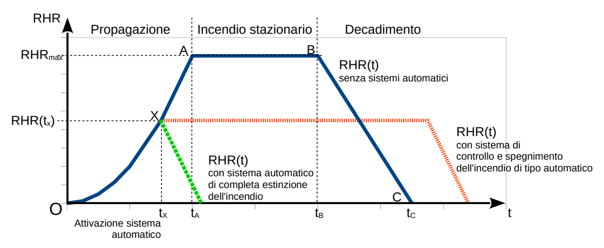

<span id="page-379-2"></span>*Illustrazione M.2-1: Fasi dell'incendio* 

#### M.2.6.1 Fase di propagazione dell'incendio

<span id="page-380-2"></span>1. Durante la fase di propagazione, la potenza termica rilasciata dall'incendio al variare del tempo RHR(t) può essere rappresentata da:

RHR(t)=1000 
$$\left(\frac{t}{t_{\alpha}}\right)^2$$
 per t < t<sub>A</sub> M.2-1

dove:

RHR(t) potenza termica rilasciata dall'incendio

[kW]

t tempo

[s]

 $t_{\alpha}$ tempo necessario affinché la potenza termica rilasciata raggiunga il valore di 1000 kW, come definito nel capitolo G.3. [s]

Per alcune attività, tale valore può essere desunto dai prospetti dell'appendice E dell'Eurocodice 1, UNI EN 1991-1-2. Per le altre attività il valore di $t_{\alpha}$ può essere determinato con considerazioni basate sul giudizio esperto per analogia.

## M.2.6.2 Effetto dei sistemi di protezione attiva antincendio

<span id="page-380-1"></span>1. Se nell'attività sono previsti *sistemi di controllo dell'incendio di tipo automati-co* (es. impianto sprinkler), l'andamento della potenza termica rilasciata RHR(t) non raggiunge il valore massimo RHR $_{max}$ , calcolato secondo quanto previsto al paragrafo M.2.6.3, che avrebbe potuto raggiungere in relazione alle condizioni del combustibile ed a quelle ambientali, ma può essere assunta costante e pari al valore di RHR( $t_x$ ) raggiunto all'istante $t_x$ di entrata in funzione dell'impianto automatico. Tale valore permane per un intervallo di tempo pari alla durata di alimentazione prevista per l'impianto, entro cui si presume che l'incendio controllato venga definitivamente estinto mediante l'intervento manuale.

Nota Allo stato attuale, in assenza di rapporti tecnici di validazione, i sistemi a deplezione di ossigeno non possono essere considerati per la modifica dell'andamento della potenza termica rilasciata RHR(t).

Nota $\,$ L'assunzione del valore di RHR( $t_x$ ) di entrata in funzione dell'impianto automatico dovrebbe essere supportata da dati di letteratura o normazione tecnica consolidata.

- 2. Se nell'attività sono invece previsti *sistemi automatici di estinzione completa dell'incendio* (es. ESFR, water mist, ...), il loro effetto deve essere valutato caso per caso in relazione alla loro efficacia ed all'affidabilità di funzionamento.
- 3. In ogni caso il progettista è tenuto a attuare le misure e le limitazioni d'esercizio previste in GSA per i sistemi automatici di protezione attiva antincendio considerati in fase progettuale, affinché non possa verificarsi la riduzione del livello di sicurezza assicurato (capitolo M.1).
- 4. A differenza dell'attivazione dei sistemi automatici, l'intervento manuale effettuato dalle *squadre antincendio* non può essere considerato in fase progettuale ai fini della modifica dell'andamento della curva RHR(t).

#### M.2.6.3 Fase dell'incendio stazionario

<span id="page-380-0"></span>1. Nella maggioranza dei casi l'energia termica potenzialmente contenuta nel compartimento antincendio è sufficiente a produrre la condizione di *flashover* e si ipotizza che, anche dopo il flashover, la curva cresca con andamento ancora proporzionale a t² fino al tempo t<sub>A</sub> che corrisponde alla massima potenza RHR<sub>max</sub> rilasciata dall'incendio nello specifico compartimento antincendio.

2. Se nell'attività non sono previsti impianti di controllo o estinzione automatica dell'incendio, si suppone che dal tempo $t_A$ fino a $t_B$ la potenza termica prodotta dall'incendio si stabilizzi al valore massimo RHR<sub>max</sub>:

$$RHR(t) = RHR_{max}$$
 per $t_A \le t < t_R$ M.2-2

3. Se lo sviluppo dell'incendio risulta *controllato dal combustibile*, come accade *all'aperto* o in edifici con *elevata superficie di ventilazione*, il valore di RHR<sub>max</sub> può essere fornito dalla seguente espressione:

$$RHR_{max} = RHR_f A_f \qquad M.2-3$$

dove:

 $RHR_{\rm f}$ valore della potenza termica massima rilasciata per unità di superficie lorda. Per alcune attività, tale valore può essere desunto dai prospetti dell'appendice E.4 dell'Eurocodice 1, UNI EN 1991-1-2. [kW/m²]

- $A_{\rm f}$ superficie lorda del compartimento in caso di distribuzione uniforme del carico d'incendio, oppure superficie lorda effettivamente occupata dal combustibile oppure area operativa di sistemi automatici di controllo dell'incendio $\lceil m^2 \rceil$
- 4. Se lo sviluppo dell'incendio risulta *limitato dal valore della superficie di ventilazione*, come generalmente si verifica in edifici con superficie di *ventilazione ordinaria*, allora il valore di RHR<sub>max</sub> deve essere ridotto in conseguenza della quantità di comburente disponibile che può affluire dalle superfici di ventilazione presenti nella fase di post-flashover. In tal caso, se le pareti del compartimento presentano solo aperture verticali, è possibile determinare il valore di RHR<sub>max</sub> ridotto tramite la seguente espressione semplificata:

$$RHR_{max} = 0.10 \, \text{mH}_{u} A_{v} \sqrt{h_{eq}} \qquad M.2-4$$

con:

m fattore di partecipazione alla combustione di cui al capitolo S.2 del presente documento.

H<sub>u</sub> potere calorifico inferiore del legno pari a 17500 kJ/kg.

 $A_{\nu}$ area totale delle *aperture verticali* su tutte le pareti del compartimento $\lceil m^2 \rceil$ 

L'altezza equivalente delle aperture verticali $h_{\text{eq}}$ si calcola con la seguente relazione:

$$h_{eq} = \frac{\sum_{i} A_{v,i} h_{i}}{\sum_{i} A_{v,i}}$$
 M.2-5

con:

h<sub>eq</sub> altezza equivalente delle aperture verticali [m]

 $A_{v,i}$ area dell'apertura verticale i-esima [m<sup>2</sup>]

h<sub>i</sub> altezza dell'apertura verticale i-esima [m]

Se invece le pareti del compartimento presentano anche *aperture orizzontali* (ad es. SEFC), l'eventuale riduzione del valore di RHR $_{max}$ deve essere valutata con modelli più sofisticati, ad esempio i modelli di campo di simulazione dell'incendio considerando tutte le superfici di ventilazione aperte sin dall'innesco dell'incendio.

5. Noto il valore di RHRmax, il tempo tA di inizio della fase di incendio stazionario si calcola con la seguente espressione:

$$t_{A} = \sqrt{RHR_{max} \frac{t_{\alpha}^{2}}{1000}}$$
 M.2-6

con:

t<sup>A</sup> tempo di inizio della fase di incendio stazionario [s]

- 6. La fase di incendio stazionario termina al tempo tB, tempo di inizio della fase di decadimento, in cui il 70% dell'*energia termica inizialmente disponibile* q<sup>f</sup> · A<sup>f</sup> è stata rilasciata nel compartimento antincendio. Il valore dell'energia qf è valutato conformemente alle indicazioni contenute nel capitolo [S.2.](#page-68-0)
- 7. Se l'energia termica inizialmente disponibile è *sufficiente* affinché l'incendio superi la fase di propagazione e raggiunga la potenza massima RHRmax, cioè:

70% 
$$q_f A_f \ge \frac{1}{3} \frac{1000}{t_\alpha^2} t_A^3$$
 M.2-7

allora il tempo tB di fine della fase di incendio stazionario si calcola con la seguente espressione:

$$t_{B} = t_{A} + \frac{70\% \ q_{f} A_{f} - \frac{1}{3} \frac{1000}{t_{\alpha}^{2}} t_{A}^{3}}{RHR_{max}}$$
 M.2-8

dove:

t<sup>B</sup> tempo di fine della fase di incendio stazionario [s]

q<sup>f</sup> carico di incendio specifico [kJ/m<sup>2</sup> ]

8. Se l'energia termica inizialmente disponibile non è *sufficiente* affinché l'incendio superi la fase di propagazione, la curva RHR raggiunge il valore massimo per qualche secondo poi passa direttamente alla fase di decadimento.

#### **M.2.6.4 Fase di decadimento**

<span id="page-382-1"></span>1. Il tempo tC, trascorso il quale la potenza termica rilasciata dall'incendio si annulla, viene calcolato considerando che nella fase di decadimento è consumato il restante 30% dell'energia termica inizialmente disponibile:

$$t_{C} = t_{B} + \frac{2.30\% \ q_{f} A_{f}}{RHR_{max}}$$
 M.2-9

dove:

t<sup>C</sup> tempo con potenza termica rilasciata dall'incendio nulla [s]

2. Durante la fase di decadimento l'andamento della potenza prodotta dall'incendio è lineare e quindi:

$$RHR(t) = RHR_{max} \frac{t_C - t}{t_C - t_B} \quad pert_B \le t \le t_C$$
 M.2-10

#### **M.2.6.5 Altre indicazioni**

<span id="page-382-0"></span>1. Qualora la definizione della fase di propagazione della curva RHR(t) basata esclusivamente sul tempo caratteristico tα fosse ritenuta non rappresentativa della reale evoluzione dell'incendio durante la fase di propagazione, in particolare negli edifici civili, si renderà necessaria una più dettagliata definizione della

- curva di crescita dell'incendio, con specifica attenzione alla propagazione dell'incendio e dei prodotti della combustione, che rappresentano i fenomeni di maggiore interesse per i problemi di *salvaguardia della vita*.
- 2. Il professionista antincendio può pertanto valutare le possibilità che l'incendio si propaghi dagli oggetti già coinvolti dalle fiamme ad altri elementi combustibili, per mezzo di un'appropriata valutazione del rischio di incendio. Tale valutazione deve essere giustificata durante l'analisi quantitativa.
- 3. Un esempio di tale approccio è chiaramente affrontato nelle NFPA 92 e NF-PA 555. Questi documenti riportano alcune correlazioni impiegabili per verificare se, nelle prime fasi di sviluppo di un incendio, la potenza termica rilasciata da un oggetto incendiato possa provocare la propagazione dell'incendio ad altri oggetti per effetto dell'irraggiamento termico, in relazione alla tipologia dei materiali ed alla distanza che li separa dagli oggetti già innescati.
- 4. La curva RHR può essere così ricostruita nel seguente modo:
 - a. ipotizzare il materiale combustibile iniziatore dell'incendio;
 - b. valutare la sequenza con la quale i diversi elementi combustibili presenti nell'ambiente vengono coinvolti dalla propagazione dell'incendio;
 - c. calcolare la curva RHR(t) complessiva, per somma dei contributi nel tempo dei singoli oggetti. Le curve RHR(t) di molte tipologie di oggetti combustibili presenti negli edifici civili possono essere facilmente reperite in letteratura.

#### M.2.7 Focolare predefinito

- <span id="page-384-0"></span>1. Qualora si intenda omettere le valutazioni in merito alla descrizione quantitativa del focolare di cui al paragrafo M.2.4, possono essere impiegati i *focolari predefiniti* descritti quantitativamente secondo il metodo indicato nel paragrafo M.2.6, impiegando i valori dei parametri di cui alla tabella M.2-2.
- 2. È escluso l'impiego dei focolari predefiniti nei casi in cui si valuti che i focolari attesi risultino più gravosi di quelli previsti in tabella M.2-2.

| Doromotro | Focolare predefinito | | |
|-----------------------------------------------------------------------------------------------|---------------------------------------------------------------------|-----------------------------------------------------------------|--|
| Parametro | per attività civile | per altre attività | |
| Velocità caratt. di crescita dell'incendio t <sub>α</sub> | 150 s (fast) | 75 s (ultra-fast) | |
| RHR <sub>max</sub> totale<br>RHR <sub>max</sub> per m <sup>2</sup> di superficie del focolare | 5 MW<br>250-500 kW/m² [1] | 50 MW<br>500 -1000 kW/m² [1] | |
| Resa in particolato Y <sub>soot</sub> | Pre flashover: 0,07 kg/kg [2,3]<br>Post flashover: 0,14 kg/kg [2,3] | Pre flashover: 0,18 kg/kg [4]<br>Post flashover: 0,36 kg/kg [4] | |
| Resa in monossido di carbonio Y <sub>co</sub> | Pre flashover: 0,10 kg/kg [5]<br>Post flashover: 0,40 kg/kg [5] | | |
| lore di combustione effettivo ΔH <sub>C</sub> 20 MJ/kg [3] | | /kg [3] | |
| Resa in biossido di carbonio Y <sub>CO2</sub> 1,5 kg/k | | kg [3,6] | |
| Resa in acqua Y <sub>H2O</sub> | 0,82 kg/kg [3,6] | | |
| Frazione di RHR in irraggiamento (Radiative fraction) | 35% [3] | | |

<sup>[1]</sup> Da impiegare in alternativa all'RHR $_{max}$ totale, considerando la massima superficie del focolare, pari al compartimento antincendio nel caso di carico di incendio uniformemente distribuito, ma che può essere un valore inferiore nel caso d'incendio localizzato.

- [3] "C/VM2 Verification method: Framework for fire safety design", New Zealand Building Code
- [4] "SFPE handbook of fire protection engineering", NFPA, $4^{th}$ ed., 2008. Tabella 3-4.16, pag. 3-142, da polyure-thane flexible foams.
- [5] Stec AA, Hull TR, "Fire Toxicity", Woodhead Pub., 2010. § 2.4 con $\Phi$ = 1,25 (underventilated fire)
- [6] In alternativa alle rese Y<sub>CO2</sub> e Y<sub>H2O</sub>, si può imporre nel codice di calcolo il combustibile generico CH<sub>2</sub>O<sub>0.5</sub>.

<span id="page-384-1"></span>*Tabella M.2-2: Focolari predefiniti* 

<sup>[2]</sup> Robbins A P, Wade C A, Study Report no 185 "Soot Yield Values for Modelling Purposes - Residential Occupancies", BRANZ, 2008

#### **M.2.8 Riferimenti**

- <span id="page-385-0"></span>1. I seguenti documenti forniscono un'utile guida al professionista antincendio dal punto di vista metodologico.
- 2. Identificazione degli scenari d'incendio:
 - a. ISO 16732-1 *"Fire safety engineering Fire risk assessment",* descrive l'applicazione alla valutazione del rischio di incendio delle metodologie proprie dell'analisi di rischio, come l'albero dei guasti e l'albero degli eventi;
 - b. NFPA 551 *"Guide for the evaluation of fire risk assessment"*.
- 3. Selezione degli scenari di incendio di progetto:
 - a. ISO/TS 16733 *"Fire safety engineering Selection of design fire scenarios and design fires";*
 - b. NFPA 101 *"Life Safety Code"*.
- 4. Stima della curva RHR:
 - a. Eurocodice 1, UNI EN 1991-1-2 "*Parte 1-2: Azioni in generale Azioni sulle strutture esposte al fuoco*";
 - b. NFPA 92 *"Standard for smoke control systems";*
 - c. NFPA 555 *"Guide on methods for evaluating potential for room flash over"*.
- 5. Descrizione quantitativa del focolare:
 - a. "*The SFPE Handbook of fire protection engineering*", 5th edition, SFPE/NF-PA, 2016.

## <span id="page-386-0"></span>**METODI Capitolo M.3 Salvaguardia della vita con la progettazione prestazionale**

#### [Premessa](#page-387-0)

[Progettazione prestazionale per la salvaguardia della vita](#page-388-2) [Criterio ideale](#page-388-1) [Criterio di ASET > RSET](#page-388-0)

[Calcolo di ASET](#page-389-1)

[Metodo di calcolo avanzato per ASET](#page-389-0) [Metodo di calcolo semplificato per ASET](#page-391-1) [Campo di applicabilità del metodo semplificato](#page-391-0)

[Calcolo di RSET](#page-392-3)

[Tempo di rivelazione](#page-392-2) [Tempo di allarme generale](#page-392-1) [Tempo di attività pre-movimento](#page-392-0) [Tempo di movimento](#page-394-0)

[Soglie di prestazione per la salvaguardia della vita](#page-395-0)

[Riferimenti](#page-396-0)

#### **M.3.1 Premessa**

- <span id="page-387-0"></span>1. Nell'applicazione del metodo prestazionale alla sicurezza antincendio per la salvaguardia della vita, gli obiettivi del professionista antincendio possono essere:
 - a. la dimostrazione diretta ed esplicita della possibilità per tutti gli occupanti di un'attività di raggiungere o permanere in un luogo sicuro, senza che ciò sia impedito da un'eccessiva esposizione agli effetti dell'incendio;
 - b. la dimostrazione della possibilità per i soccorritori di operare in sicurezza, secondo le indicazioni delle tabelle [M.3-2](#page-395-1) e [M.3-3](#page-396-1).
- 2. La progettazione deve seguire una delle procedure riconosciute a livello internazionale per valutare la posizione e la condizione degli occupanti durante l'evoluzione degli scenari d'incendio previsti per l'attività.

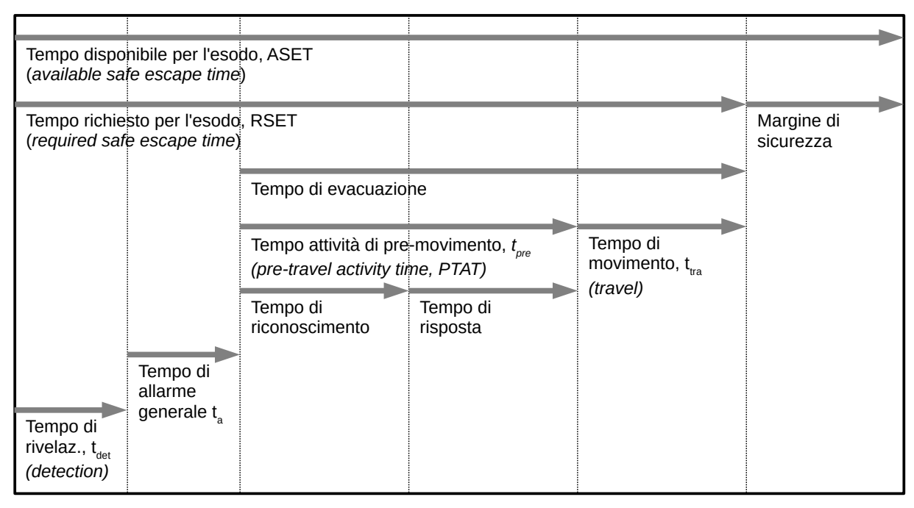

<span id="page-387-1"></span>*Illustrazione M.3-1: Confronto tra ASET ed RSET*

#### **M.3.2 Progettazione prestazionale per la salvaguardia della vita**

#### **M.3.2.1 Criterio ideale**

- <span id="page-388-4"></span><span id="page-388-2"></span><span id="page-388-1"></span>1. La progettazione ideale di un sistema d'esodo dovrebbe assicurare agli occupanti la possibilità di raggiungere un luogo sicuro in sicurezza o di permanervi, senza mai incontrare gli effetti dell'incendio. Questo è dunque il primo criterio da impiegare per la maggior parte degli occupanti dell'attività.
- <span id="page-388-3"></span>2. Esistono situazioni ove il criterio del comma [1](#page-388-4) non è applicabile, in particolare per gli occupanti che si trovano nel compartimento di primo innesco dell'incendio.

#### **M.3.2.2 Criterio di ASET > RSET**

<span id="page-388-0"></span>1. Per risolvere quanto previsto al comma [2](#page-388-3) del paragrafo [M.3.2.1](#page-388-1), la norma introduce il criterio ASET > RSET, esemplificato nell'illustrazione [M.3-1.](#page-387-1)

La progettazione prestazionale del sistema di vie d'esodo consiste sostanzialmente nel calcolo e nel confronto tra due intervalli di tempo così definiti:

- a. ASET, tempo disponibile per l'esodo (*available safe escape time);*
- b. RSET, tempo richiesto per l'esodo (*required safe escape time)*.
- 2. Si considera efficace il sistema d'esodo se ASET > RSET, se cioè il tempo in cui permangono condizioni ambientali non incapacitanti per gli occupanti è superiore al tempo necessario perché essi possano raggiungere un luogo sicuro, non soggetto a tali condizioni ambientali sfavorevoli dovute all'incendio.
- 3. La differenza tra ASET ed RSET rappresenta il *margine di sicurezza* della progettazione prestazionale per la salvaguardia della vita:

$$t_{marg} = ASET - RSET$$
 M.3-1

Nel confronto tra diverse soluzioni progettuali, il professionista antincendio rende massimo il margine di sicurezza tmarg in relazione alle ipotesi assunte, al fine di considerare l'incertezza nel calcolo dei tempi di ASET ed RSET.

A meno di specifiche valutazioni si assume tmarg ≥ 100% · RSET. In caso di specifiche valutazioni sull'affidabilità dei dati di input impiegati nella progettazione prestazionale, è consentito assumere tmarg ≥ 10% · RSET.

In ogni caso, deve essere tmarg ≥ 30 secondi.

Nota Le specifiche valutazioni sul tmarg ≥ 10% · RSET dovrebbero essere supportate da dati di letteratura o di normazione tecnica consolidata.

#### M.3.3 Calcolo di ASET

- <span id="page-389-2"></span><span id="page-389-1"></span>1. *ASET*, il tempo a disposizione degli occupanti per mettersi in salvo, dipende strettamente dalle interazioni nel sistema incendio-edificio-occupanti: l'incendio si innesca, si propaga e diffonde nell'edificio i suoi effetti, fumi e calore. L'edificio resiste all'incendio per mezzo delle misure protettive attive e passive: impianti antincendio, compartimentazioni, sistemi di controllo di fumo e calore. Gli occupanti sono esposti agli effetti dell'incendio in relazione alla attività che svolgono, alla loro posizione iniziale, al loro percorso nell'edificio ed alla condizione fisica e psicologica.
- 2. In conseguenza di quanto indicato al comma 1, ciascun occupante possiede un proprio valore di ASET. Tale complessità viene risolta dal professionista antincendio con considerazioni statistiche, con modelli di calcolo numerici o assumendo le ipotesi semplificative descritte nel paragrafo M.3.3.2.
- 3. Nei seguenti paragrafi si presentano i *metodi di calcolo* di ASET ammessi dalle norme:
 - a. metodo di calcolo avanzato;
 - b. metodo di calcolo semplificato.

## M.3.3.1 Metodo di calcolo avanzato per ASET

- <span id="page-389-0"></span>1. Il calcolo di ASET richiede la stima delle concentrazioni di prodotti tossici, delle temperature e delle densità del fumo negli ambienti a seguito dell'incendio e la loro variazione nel tempo, in quanto gli occupanti possono muoversi nel fumo, che nei casi complessi può essere ragionevolmente elaborata solo con modelli di calcolo fluidodinamici. Sono infatti la tipologia dell'incendio e dell'attività che determinano complessivamente l'andamento di tali variabili con il tempo.
- 2. La norma ISO 13571 è il riferimento più autorevole per il calcolo ASET. ASET globale è ivi definito come il più piccolo tra gli ASET calcolati secondo quattro modelli:
 - a. modello dei *gas tossici*;
 - b. modello dei *gas irritanti*;
 - c. modello del calore:
 - d. modello dell'oscuramento della visibilità da fumo.

#### M.3.3.1.1 Modello gas tossici

1. Il modello dei gas tossici impiega il concetto di dose inalata (*exposure dose*) e di *FED* (*fractional effective dose*). La *exposure dose* è definita come la misura della dose di un gas tossico disponibile per inalazione, cioè presente nell'aria inspirata, calcolata per integrazione della curva concentrazione-tempo della sostanza per il tempo di esposizione. La *FED* è il rapporto tra questa *exposure dose* e la dose del gas tossico che determina effetti incapacitanti sul soggetto medio esposto. Quando FED = 1 si considera incapacitato il soggetto medio.

Nota Per esempio, la dose incapacitante di CO, monossido di carbonio, prevista nella norma ISO 13571:2012 è pari a 35000 ppm·min. Ciò significa ipotizzare che il soggetto medio esposto ad una concentrazione di 3500 ppm per 10 minuti risulti incapacitato. In tal caso la sua FED è pari a 1 ed il suo ASET per il CO è pari a 10 minuti.

#### M.3.3.1.2 Modello gas irritanti

- 1. Il modello dei gas irritanti impiega il concetto di *FEC*, *fractional effective concentration*. La *FEC* è definita come il rapporto tra la concentrazione di un gas irritante disponibile per inalazione e la concentrazione dello stesso gas che determina effetti incapacitanti sul soggetto medio esposto.
- 2. Al fine di semplificare l'analisi, qualora negli scenari di incendio di progetto non siano identificati nel focolare materiali combustibili suscettibili di costituire specifica sorgente di gas irritanti (es. sostanze o miscele pericolose, cavi elettrici in quantità significative, ...) la verifica del modello dei gas irritanti può essere omessa.

#### M.3.3.1.3 Modello calore

1. Per il modello del calore irraggiato e convettivo la norma propone un approccio, basato sulla FED, simile a quello dei dei gas tossici. L'equazione proposta è la seguente:

$$X_{\text{FED}} = \sum_{t=1}^{t^2} \left( \frac{1}{t_{\text{Irad}}} + \frac{1}{t_{\text{Iconv}}} \right) \Delta t$$
 M.3-2

I valori di $t_{Irad}$ e $t_{Iconv}$ sono i tempi di incapacitazione per calore radiante e calore convettivo calcolati con altre relazioni in funzione della condizione di abbigliamento dei soggetti, reperibili nella norma ISO 13571.

- 2. La verifica del modello del calore può essere semplificata assumendo conservativamente le seguenti *soglie di prestazione*:
 - a. irraggiamento sugli occupanti $\leq 2.5 \text{ kW/m}^2$ ;
 - b. temperatura ambiente sugli occupanti ≤ 60°C.
- 3. Tali valori corrispondono ad un ASET oltre i 30 minuti per qualsiasi condizione di abbigliamento.

#### M.3.3.1.4 Modello visibilità

- 1. Il modello dell'oscuramento della visibilità da fumo è basato sul concetto del minimo contrasto percettibile, cioè la minima differenza di luminosità visibile tra un oggetto e lo sfondo.
- 2. Per legare il valore della visibilità L alla massa volumica dei fumi $\rho_{\text{smoke}}$ , si ricorre alla seguente correlazione sperimentale, applicata ad ogni punto del dominio di calcolo:

$$C = \sigma \rho_{\text{smoke}} L$$
 M.3-3

dove:

L visibilità [m]

- C costante adimensionale pari a 3 per segnaletica di esodo riflettente non illuminata o 8 per segnaletica retroilluminata
- $\sigma$ coefficiente massico di estinzione della luce pari a 8,7 m²/g o diverso valore adeguatamente giustificato dal progettista $$[m^2/g]$$

 $\rho_{smoke}$ massa volumica dei fumi (*smoke aerosol mass concentration*) [g/m<sup>3</sup>]

Grazie a questa correlazione, i codici di calcolo fluidodinamico restituiscono direttamente la $\rho_{smoke}$ e calcolano la visibilità L per ogni punto degli ambienti simulati.

### M.3.3.1.5 Soglia di prestazione per FED e FEC

- 1. I valori di FED e FEC pari ad 1 sono associati ad effetti *incapacitanti* dell'esodo calibrati su occupanti di media sensibilità agli effetti dei prodotti dell'incendio.
- 2. Per tenere conto delle categorie più deboli o più sensibili della popolazione, che risulterebbero incapacitate ben prima del raggiungimento di FED o FEC uguale a 1, si considera ragionevole impiegare il valore 0,1 come *soglia di prestazione* per FED e FEC (limitando a 1,1% la porzione di occupanti incapacitati al raggiungimento della soglia secondo ISO 13571), lasciando però al professionista antincendio l'onere di selezionare e giustificare il valore più adatto alla tipologia di popolazione coinvolta.

## **M.3.3.2 Metodo di calcolo semplificato per ASET**

- <span id="page-391-1"></span>1. La ISO/TR 16738 prevede la possibilità di utilizzare l'ipotesi semplificativa della *esposizione zero* (*zero exposure*).
- 2. Invece di procedere alla verifica di tutti i modelli di cui al paragrafo [M.3.3.1](#page-389-0), il professionista antincendio impiega le seguenti soglie di prestazione, molto conservative:
 - a. altezza minima dei fumi stratificati dal piano di calpestio pari a 2 m, al di sotto del quale permanga lo strato d'aria indisturbata e
 - b. temperatura media dello strato di fumi caldi ≤ 200°C.

Questi criteri permettono agli occupanti la fuga in aria indisturbata, non inquinata dai prodotti della combustione, ed un valore dell'irraggiamento dai fumi cui sono esposti inferiore a 2,5 kW/m<sup>2</sup> : sono dunque automaticamente soddisfatti tutti i modelli di cui al paragrafo [M.3.3.1](#page-389-0) e l'analisi è notevolmente semplificata perché non occorre eseguire calcoli di esposizione degli occupanti a tossici, irritanti, calore e oscuramento della visibilità. È infatti sufficiente valutare analiticamente o con modelli numerici a zone o di campo l'altezza dello strato dei fumi pre-flashover nell'edificio.

## **M.3.3.3 Campo di applicabilità del metodo semplificato**

<span id="page-391-0"></span>1. Il metodo di calcolo semplificato di cui al paragrafo [M.3.3.2](#page-391-1) è applicabile, solo se la potenza del focolare rapportata alla geometria dell'ambiente è sufficiente a garantire la formazione dello strato di fumi caldi superiore: il professionista antincendio è tenuto a verificare che tale condizione si verifichi.

#### M.3.4 Calcolo di RSET

- <span id="page-392-3"></span> RSET è calcolato tra l'innesco dell'incendio ed il momento in cui gli occupanti dell'edificio raggiungono un luogo sicuro. Anche RSET dipende dalle interazioni del sistema incendio-edificio-occupanti: la fuga degli occupanti è fortemente condizionata dalle geometrie dell'edificio ed è rallentata dagli effetti dell'incendio.
- 2. Il documento di riferimento per il calcolo di RSET è la ISO/TR 16738.
- 3. RSET è determinato da varie componenti, come il tempo di rivelazione (detection) $t_{det}$ , il tempo di allarme generale $t_a$ , il tempo di pre-movimento (pre-travel activity time, PTAT) $t_{pre}$ , il tempo di movimento (travel) $t_{tra}$ :

$$RSET = t_{det} + t_a + t_{pre} + t_{tra}$$
 M.3-4

4. Al fine del calcolo di RSET il professionista antincendio deve sviluppare lo *sce-nario comportamentale di progetto più appropriato* per il caso specifico, perché l'attività di pre-movimento e le velocità dell'esodo dipendono dalla tipologia di popolazione considerata e dalle modalità d'impiego dell'edificio.

Nota I parametri variano notevolmente se gli occupanti sono svegli ed hanno familiarità con l'edificio, come in un edificio scolastico, o dormono e non conoscono la struttura, come in una struttura alberghiera.

5. Come già indicato per ASET, ciascun occupante possiede un proprio valore anche di RSET.

## M.3.4.1 Tempo di rivelazione

<span id="page-392-2"></span>1. Il *tempo di rivelazione* $t_{det}$ è determinato dalla tipologia di sistema di rivelazione e dallo scenario di incendio. È il tempo necessario al sistema di rivelazione automatico per accorgersi dell'incendio. Viene calcolato analiticamente o con apposita modellizzazione numerica degli scenari d'incendio e del sistema di rivelazione.

#### M.3.4.2 Tempo di allarme generale

- <span id="page-392-1"></span>1. Il *tempo di allarme generale* t<sub>a</sub> è il tempo che intercorre tra la rivelazione dell'incendio e la diffusione dell'informazione agli occupanti, dell'allarme generale.
- 2. Il tempo di allarme generale sarà dunque:
 - a. pari a zero, quando la rivelazione attiva direttamente l'allarme generale dell'edificio;
 - b. pari al ritardo valutato dal professionista antincendio, se la rivelazione allerta una centrale di gestione dell'emergenza che verifica l'evento ed attiva poi l'allarme manuale.
- 3. Negli edifici grandi e complessi si deve tenere conto della modalità di allarme che può essere diversificata, ad esempio, nel caso di una evacuazione per fasi multiple.

#### M.3.4.3 Tempo di attività pre-movimento

<span id="page-392-0"></span>1. Il *tempo di attività pre-movimento* t<sub>pre</sub> è l'oggetto della valutazione più complessa, perché si tratta del tempo necessario agli occupanti per svolgere una serie di attività che precedono il movimento vero e proprio verso il luogo sicuro. La let-

- teratura indica che questa fase occupa spesso la maggior parte del tempo totale di esodo.
- 2. Il tempo tpre è composto da un tempo di *riconoscimento (recognition)* e da uno di *risposta (response).*
- 3. Durante il tempo di riconoscimento gli occupanti continuano le attività che stavano svolgendo prima dell'allarme generale, finché riconoscono l'esigenza di rispondere all'allarme.
- 4. Nel tempo di risposta gli occupanti cessano le loro attività normali e si dedicano ad attività legate allo sviluppo dell'emergenza, quali: raccolta di informazioni sull'evento, arresto e messa in sicurezza delle apparecchiature, raggruppamento del proprio gruppo (lavorativo o familiare), lotta all'incendio, ricerca e determinazione della via d'esodo appropriata *(wayfinding)* ed altre attività a volte anche errate ed inappropriate.
- 5. A seconda dello scenario comportamentale di progetto, questi tempi possono durare anche alcune decine di minuti. Nella tabella [M.3-1](#page-393-0) si riportano alcuni esempi di valutazione tratti dal ISO/TR 16738.
- 6. Il professionista antincendio può impiegare valori diversi da quelli indicati in letteratura purché adeguatamente giustificati, anche in riferimento a prove di evacuazione riportate nel registro dei controlli.

| Parametri di descrizione dell'attività | Tempi di attività di pre-movimento<br>ISO/TR<br>16738 | |
|-------------------------------------------------------------------------------------------------------------------------------------------------------------------------------------------------------------------------------------------------------------------------------------------------------------------------------------------------------------------------------------------------------------------------------------------------------------------|-------------------------------------------------------|---------------------------------------------|
| tratto da ISO/TR<br>16738 | Δtpre (1st)<br>primi occupanti<br>in fuga | Δtpre (99th)<br>ultimi occupanti<br>in fuga |
| Esempio 1: albergo di media complessità<br>●<br>occupanti: Ciii, sleeping and unfamiliar;<br>●<br>sistema di allarme: rivelazione automatica ed allarme generale<br>mediato dall'intervento di verifica dei dipendenti;<br>●<br>complessità geometrica edificio: edificio multipiano e layout sem<br>plice;<br>●<br>gestione della sicurezza: ordinaria. | 20' | 40' |
| Esempio 2: grande attività produttiva<br>●<br>occupanti: A, awake and familiar;<br>●<br>sistema di allarme: rivelazione automatica ed allarme generale<br>mediato dall'intervento di verifica dei dipendenti;<br>●<br>complessità geometrica edificio: edificio multipiano e layout com<br>plesso;<br>●<br>gestione della sicurezza: ordinaria. | 1' 30" | 3' 30" |
| Esempio 3: residenza sanitaria assistenziale<br>●<br>occupanti: D, sleeping and unfamiliar;<br>●<br>sistema di allarme: rivelazione automatica ed allarme generale<br>mediato dall'intervento di verifica dei dipendenti;<br>●<br>complessità geometrica edificio: edificio multipiano e layout sem<br>plice;<br>●<br>gestione della sicurezza: ordinaria;<br>●<br>presenza di addetti in quantità sufficiente a gestire l'evacuazione<br>dei diversamente abili. | 5' | 10' |

<span id="page-393-0"></span>*Tabella M.3-1: Esempi di valutazione del tempo di pre-movimento, tratto da ISO/TR 16738*

#### M.3.4.4 Tempo di movimento

- <span id="page-394-0"></span>1. Il *tempo di movimento* t<sub>tra</sub> è il tempo impiegato dagli occupanti per raggiungere un luogo sicuro dal termine delle attività di pre-movimento appena descritte.
- 2. Il t<sub>tra</sub> è calcolato in riferimento ad alcune variabili:
 - a. la distanza degli occupanti o gruppi di essi dalle vie d'esodo;
 - b. le velocità d'esodo, che dipendono dalla tipologia degli occupanti e dalle loro interazioni con l'ambiente costruito e gli effetti dell'incendio. È dimostrato che la presenza di fumi e calore rallenta notevolmente la velocità d'esodo i funzione delle condizioni di visibilità;
 - c. la portata delle vie d'esodo, dovuta a geometria, dimensioni, dislivelli ed ostacoli.
- 3. Nella realtà, quando gli occupanti di edifici densamente affollati fuggono lungo le vie d'esodo, si formano lunghe file nei restringimenti, inoltre secondo lo sviluppo degli scenari di incendio di progetto presi in esame, alcuni percorsi possono diventare impercorribili o bloccati.
 - Il calcolo del $t_{tra}$ deve tenere conto di questi fenomeni.
- 4. Attualmente si impiegano comunemente due famiglie di modelli per il calcolo del tempo di movimento: *modelli idraulici* e *modelli agent based*.
- 5. I modelli idraulici predicono con ragionevole precisione alcuni aspetti del movimento degli occupanti (es. flussi attraverso le uscite), ma non includono fattori importanti del comportamento umano, come la familiarità con l'edificio, le interazioni persona-persona e l'effetto del fumo sul movimento.
- 6. Altri tipi di modelli (es. *macroscopic/microscopic*, *coarse network/fine network/continous models*) sono oggetto di intensa ricerca scientifica e di sperimentazione; attualmente esistono ancora solo validazioni parziali dei risultati. Pertanto i risultati devono essere valutati con cautela.

#### M.3.5 Soglie di prestazione per la salvaguardia della vita

- <span id="page-395-0"></span>1. Le soglie di prestazione per la salvaguardia della vita determinano l'incapacitazione degli occupanti e dei soccorritori quando sottoposti agli effetti dell'incendio.
- 2. Il professionista antincendio sceglie idonee soglie di prestazione per la specifica attività, in relazione agli scenari di incendio di progetto, ed in particolare in riferimento alle caratteristiche degli occupanti coinvolti (es. anziani, bambini, disabilità, ...).
- 3. Il rispetto delle soglie di prestazione per la salvaguardia della vita deve essere verificato:
 - a. per gli *occupanti*: in tutte le zone dell'attività dove esiste contemporanea presenza di occupanti, stanziali o in movimento, e di effetti dell'incendio.
 - b. per i *soccorritori*:
 - i. solo qualora essi abbiano un ruolo ben definito nella pianificazione d'emergenza dell'attività,
 - ii. in tutte le zone dell'attività dove esiste contemporanea presenza di soccorritori, stanziali o in movimento, e di effetti dell'incendio.
- 4. A titolo di esempio, si riportano nelle tabelle M.3-2 e M.3-3 delle soglie di prestazione per occupanti e soccorritori con riferimento ai metodi di calcolo avanzato e semplificato.

| Modello | Prestazione | Soglia di prestazione | Riferimento |
|--------------------------------------------|------------------------------------------------------------------------------------------------------------------------------------------------------------------------------------------|--------------------------------------------------------------------------------------|-------------------------------------------------------------------------------------------------------|
| Oscuramento<br>della visibilità<br>da fumo | Visibilità minima di pannelli<br>riflettenti, non retroilluminati,<br>valutata ad altezza 1,80 m dal<br>piano di calpestio | Occupanti: 10 m<br>Occupanti in locali di<br>superficie lorda < 100m²:<br>5 m | ISO 13571:2012 |
| | | Soccorritori: 5 m<br>Soccorritori in locali di<br>superficie lorda < 100m²:<br>2,5 m | [1] |
| | FED, fractional effective dose<br>e FEC, fractional effective<br>concentration per esposizione<br>a gas tossici e gas irritanti,<br>valutata ad altezza 1,80 m dal<br>piano di calpestio | Occupanti: 0,1 | ISO 13571:2012, limitando a 1,1% la porzione di occupanti incapacitati al raggiungimento della soglia |
| | | Soccorritori: nessuna valutazione | - |
| | Temperatura massima di esposizione | Occupanti: 60°C | ISO 13571:2012 |
| | | Soccorritori: 80°C | [1] |
| Calore | Irraggiamento termico<br>massimo da tutte le sorgenti<br>(incendio, effluenti<br>dell'incendio, struttura) di<br>esposizione degli occupanti | Occupanti: 2,5 kW/m² | ISO 13571:2012, per esposizioni inferiori a 30 minuti |
| | | Soccorritori: 3 kW/m² | [1] |

<sup>[1]</sup> Ai fini di questa tabella, per soccorritori si intendono i componenti delle squadre aziendali opportunamente protetti ed addestrati alla lotta antincendio, all'uso dei dispositivi di protezione delle vie aeree, ad operare in condizioni di scarsa visibilità. Ulteriori indicazioni possono essere desunte ad esempio da documenti dell'Australian Fire Authorities Council (AFAC) per hazardous conditions.

<span id="page-395-1"></span>Tabella M.3-2: Esempio di soglie di prestazione impiegabili con il metodo di calcolo avanzato

| Prestazione | Soglia di prestazione | Riferimento |
|--------------------------------------------------------------------------------------------------|------------------------|--------------------------------------------------|
| Altezza minima dei fumi stratificati dal piano di<br>calpestio al di sotto del quale permanga lo | Occupanti: 2<br>m | Ridotto da ISO/TR<br>16738:2009,<br>section 11.2 |
| strato d'aria indisturbata | Soccorritori: 1,5<br>m | [1] |
| Temperatura media dello strato di fumi caldi | Occupanti: 200°C | ISO/TR<br>16738:2009,<br>section 11.2 |
| | Soccorritori: 250°C | [1] |

<sup>[1]</sup> Ai fini di questa tabella, per soccorritori si intendono i componenti delle squadre aziendali opportunamente protetti ed addestrati alla lotta antincendio, all'uso dei dispositivi di protezione delle vie aeree, ad operare in condizioni di scarsa visibilità. Ulteriori indicazioni possono essere desunte ad esempio da documenti dell'Australian Fire Authorities Council (AFAC) per hazardous conditions.

<span id="page-396-1"></span>*Tabella M.3-3: Esempio di soglie di prestazione impiegabili con il metodo di calcolo semplificato*

#### **M.3.6 Riferimenti**

- <span id="page-396-0"></span>1. L'ISO ha pubblicato due documenti fondamentali per analisi degli aspetti più tecnici della progettazione della *life safety*:
 - a. ISO 13571 "*Life-threatening components of fire Guidelines for the estimation of time to compromised tenability in fires*";
 - b. ISO/TR 16738 "*Fire-safety engineering Technical information on methods for evaluating behaviour and movement of people*".
- 2. La salvaguardia della vita (*life safety)*, che comprende le problematiche legate all'evacuazione dell'edificio, è il sottosistema 6 della BS 7974.

In tale contesto, il documento specifico di riferimento per la progettazione del sistema d'esodo è il *published document PD 7974-6 "The application of fire safety engineering principles to fire safety design of buildings - Part 6: Human factors: Life safety strategies - Occupant evacuation, behaviour and condition (Sub-system 6)".*